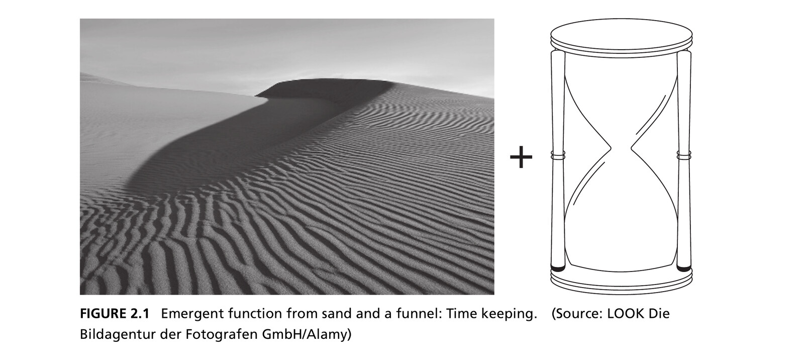
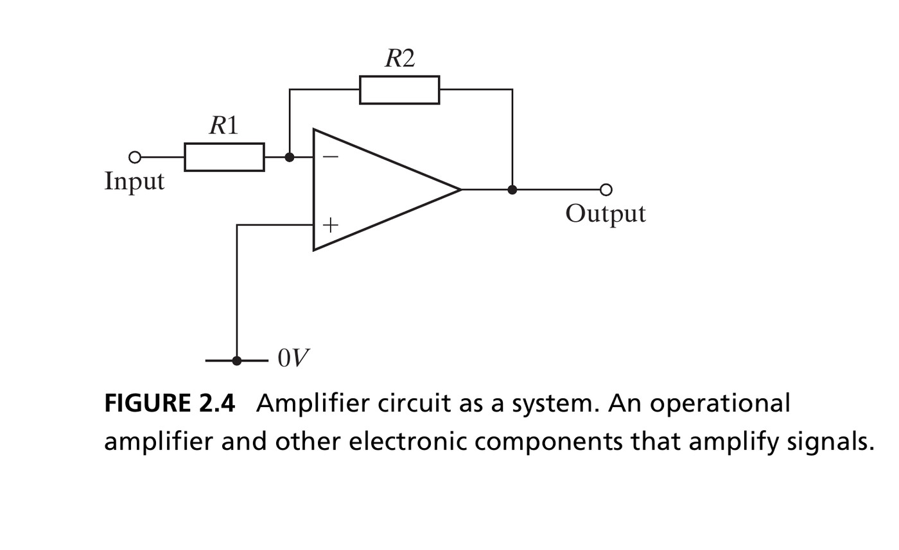
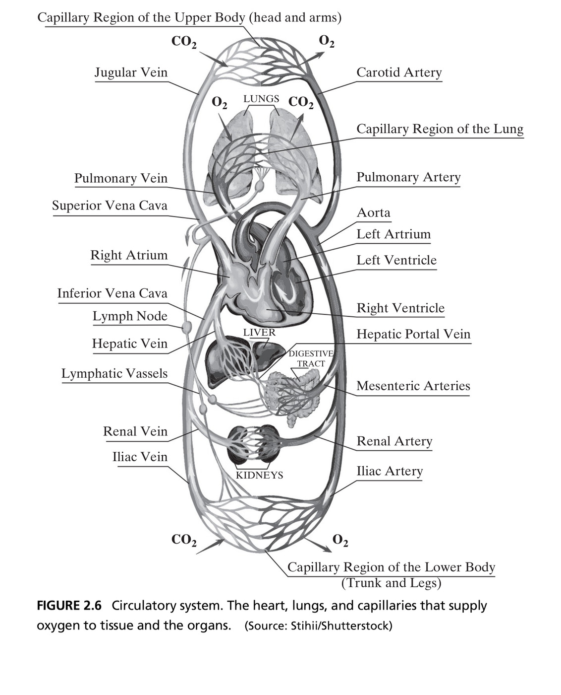
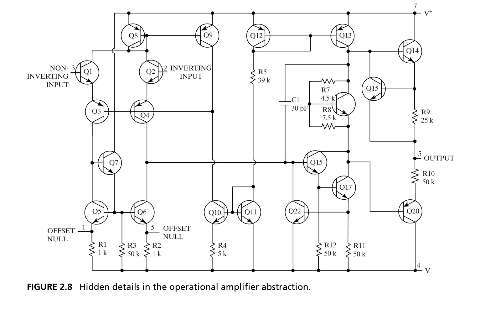

## What Is System Thinking?

- Thinking about a question, circumstance, or problem *explicitly* as a system
- Goal: help complex systems appear **less complicated**
- Two levels of ambition:
  - **Understanding** what is — making sense of a system
  - **Predicting** what might be — if something changes

::: {.fragment .callout-tip title="From analysis to synthesis"}
At the pinnacle of system thinking is **synthesizing** a system — the subject of Part 3 of this course.
:::

::: {.notes}
- **Define system thinking precisely**: thinking about a question/circumstance/problem *explicitly* as a system (a set of interrelated entities) — not the same as "thinking systematically" (methodical/step-by-step). "System" = the object of thought, not the manner of thinking
- Sits alongside other modes students already use: critical reasoning (is a claim valid), analytic reasoning (derive from laws/principles), creative thinking — **meta-cognition** = knowing which mode you're using
- **Two levels of ambition, genuinely different difficulty**: understanding what *is* (basic) vs. predicting what *might be* (hard — requires anticipating emergence)
- The chapter also places system thinking between analysis and action: it helps imagine changes, informs judgment and balance in decisions, and supports synthesis. It is not merely a vocabulary for describing existing systems.
- **Discussion**: Take one current engineering decision. What would critical, analytic, creative, and system thinking each contribute? The point is to select and combine modes deliberately, not to replace them all with “systems thinking.”
- → Top of the ladder: **synthesizing** a system from scratch (architecture) — Part 3, Chapters 9-13. Everything in this chapter builds toward that

[Sources]
- Crawley, Cameron & Selva, *System Architecture* (2016), Ch. 2, pp. 22 and 47-48.
:::

## Four Tasks of System Thinking

1. Identify the system, its form, and its function
2. Identify the entities of the system, their form and function
3. Identify the relationships among the entities
4. Identify the emergent properties of the system

::: {.fragment .callout-note appearance="simple" icon=false title="Chapter roadmap"}
These four tasks structure the rest of this chapter.
:::

::: {.notes}
- **Preview the chapter's whole structure** — the map students keep in mind through everything that follows
- Each task gets its own section (2.3-2.6), applied to the same four running examples: amplifier circuit, design team ("Team X"), circulatory system, solar system
- → Flag up front: presented sequentially for teaching, but real practice iterates — a relationship might reveal a missed entity, predicting emergence might send you back to the boundary. **Order is a pedagogical scaffold, not a rigid procedure**
- **Discussion**: Which task is most likely to force a return to Task 1? Task 4 often does: a surprising emergent property may reveal that the original system, function, or boundary was framed incorrectly.

[Sources]
- Crawley, Cameron & Selva, *System Architecture* (2016), Ch. 2, p. 22.
:::

## Box 2.1 · Definition: System {.smaller}

::: {.callout-note appearance="simple" icon=false title=""}
**A system** is a set of entities and their relationships, whose functionality is greater than the sum of the individual entities.
:::

- Almost anything **can** be considered a system — almost everything contains entities and relationships
- What matters is whether treating it as a system is *useful*
- The second half of the definition is the important half — it's what makes a system more than a pile of parts

::: {.notes}
- **Single most important definition in the chapter — slow down**. Two parts, students should recite both:
  - Entities that interact/are interrelated (alone, doesn't distinguish from a random pile)
  - Interacting entities produce a function greater/other than the individual functions — **this clause makes it non-trivial**
- **Stress-test — what's NOT a system?** A brick (macroscopic scale, uniform, no distinguishable entities). A person in Ukraine + a bag of rice in Asia, no connection
- But scale flips the answer: zoom into brick microstructure → arguably a system (clay particles sharing load). Person buys the rice with a euro → now a trading system
- → Almost anything *can* be a system at the right scale — the real question is never "is this technically a system" but "is treating it as a system *useful*"
- Two adjacent terms not to conflate: **product** = something exchanged (rice: product, not system; solar system: system, not product); **architecture** = abstract description of a system's entities + relationships
- **Discussion**: The same object can be modeled as different systems at different scales. What question would make a brick wall the useful system? What question would make one brick the useful system?
- **Teaching caution**: “Greater than the sum” means new or different functionality arising through interaction; it does not mean every numerical property becomes larger. Mass, for example, is usually additive.

[Sources]
- Crawley, Cameron & Selva, *System Architecture* (2016), Ch. 2, Box 2.1 and pp. 22-24.
:::

## Systems and Emergence

::: {style="margin-top: 2em; font-size: 1.4em; text-align: center;"}
*A system is a set of entities and their relationships, whose functionality is [greater than the sum]{style="color:#a30000; font-weight:bold;"} of the individual entities.*
:::

::: {.fragment}
This is **emergence** — the power and the magic of systems. It's why we build them.
:::

::: {.notes}
- **Isolate the second half of the definition, name it**: "functionality greater than the sum" = **emergence**
- Appears/surfaces only when the system operates as a whole — cannot be found in any individual entity alone
- Not mystical jargon — a precise technical term used constantly for the rest of the course
- The text defines emergence broadly as what **appears, materializes, or surfaces when a system operates**. “Greater functionality” can mean a genuinely new function, not simply more of an existing one.
- **Discussion**: Is emergence always surprising? No. Timekeeping in a designed hourglass is anticipated, yet it is still emergent because it belongs to the interacting whole rather than either entity separately.
- → Why this matters practically: emergence is why we bother building systems at all, not just collecting useful parts. Sand + a funnel-shaped tube separately = nothing useful; together = an hourglass that keeps time. That's the "power and the magic" — next slides make it concrete

[Sources]
- Crawley, Cameron & Selva, *System Architecture* (2016), Ch. 2, pp. 23-24.
:::

## What Emerges? {.smaller}

- **Function** — what a system does: its actions, outcomes, outputs
  - Anticipated *and* desirable (cars transport people)
  - Anticipated but *undesirable* (cars burn hydrocarbons)
  - Unanticipated but desirable (cars provide a sense of freedom)
  - Unanticipated and *undesirable* (cars can kill people)
- **Performance** — how well the system executes its function
- The **"ilities"** — reliability, maintainability, safety, robustness — emerge over the system's *lifecycle*, not immediately

::: {.notes}
- **Break "emergence" into kinds of things that can emerge** — otherwise students think only "surprising side effects"
- **Function** splits along two independent axes: anticipated or not; desirable or not → four combinations, all illustrated by cars:
  - Anticipated + desirable: transporting people (why we build cars)
  - Anticipated + undesirable: burning hydrocarbons (engineers know, can't fully avoid)
  - Unanticipated + desirable: sense of personal freedom (nobody designed this, but it's part of why people buy cars)
  - Unanticipated + undesirable: cars can kill people (most serious category, next slides build toward this)
- **Performance** also emerges — not "does it do the thing" but "how well." How fast? How accurate (hourglass)?
- **The "ilities"** (reliability, maintainability, operability, safety, robustness) — key distinguishing feature: unlike function/performance (immediate), ilities emerge **over the system's lifecycle**
- The book connects all of these emergent properties to **benefit and value**. Primary function is not the only source of benefit; lifecycle qualities and the absence of emergencies can be decisive.
- **Discussion**: Classify emissions, safety, and personal freedom from the viewpoints of different stakeholders. “Desirable” is not intrinsic to the property; it depends on who judges the benefit and cost.
- → Matters later when we discuss architecting for the long haul, not just day-one performance

[Sources]
- Crawley, Cameron & Selva, *System Architecture* (2016), Ch. 2, pp. 24-27.
:::

## Table 2.1 · Types of Emergent Function {.smaller}

```{=html}
<div style="display:grid; grid-template-columns: 1fr 1fr 1fr; gap:4px; text-align:center; margin-top:1rem;">
  <div></div>
  <div style="background:#f0f0f0; font-weight:bold; padding:0.6rem; border-radius:6px;">Anticipated</div>
  <div style="background:#f0f0f0; font-weight:bold; padding:0.6rem; border-radius:6px;">Unanticipated</div>

  <div style="background:#f0f0f0; font-weight:bold; padding:0.6rem; border-radius:6px;">Desirable</div>
  <div style="border:1px solid #ccc; border-radius:6px; padding:0.6rem;">Cars transport people<br>Cars keep people warm/cool</div>
  <div style="border:1px solid #ccc; border-radius:6px; padding:0.6rem;">Cars create a sense of personal freedom</div>

  <div style="background:#f0f0f0; font-weight:bold; padding:0.6rem; border-radius:6px;">Undesirable</div>
  <div style="border:1px solid #ccc; border-radius:6px; padding:0.6rem;">Cars burn hydrocarbons</div>
  <div style="border:1px solid #ccc; border-radius:6px; padding:0.6rem;">Cars can kill people</div>
</div>
```

::: {.notes}
- **Same 2×2 taxonomy as previous slide, now a grid** — easier to see structure at a glance
- **Recall check**: cover the cells, ask students to fill in from memory before revealing
- Second "anticipated + desirable" example beyond transportation: cars keep people warm/cool
- The source table also lists **cars entertain people** in the anticipated/desirable cell. That example helps show that one system can have several emergent functions beyond its primary purpose.
- **Discussion**: Can one emergent function occupy different cells for different stakeholders? Noise, data collection, or automation may be desirable to one stakeholder and undesirable to another.
- → Reference table to come back to when classifying a newly discovered emergent property in project work: anticipated or not, desirable or not?

[Sources]
- Crawley, Cameron & Selva, *System Architecture* (2016), Ch. 2, Table 2.1, p. 24.
:::

## Figure 2.1 · Emergence from Sand and a Funnel

{width=85% fig-align="center"}

::: {.side-caption}
Neither sand nor a funnel-shaped tube has a "timekeeping" function on its own — put together, the emergent function of keeping time appears. Source: Crawley, Cameron & Selva (2016), Fig. 2.1. Photo: LOOK Die Bildagentur der Fotografen GmbH/Alamy.
:::

::: {.notes}
- **Book's cleanest, simplest illustration of emergence — dwell on it precisely because it's simple**
- Sand alone: no timekeeping function. Funnel-shaped glass tube alone: just channels flow, no timekeeping function
- Together, right geometric arrangement → genuinely new function: **keeping time**
- **Rhetorical question**: how could anyone predict, from sand and glass separately, that combining them tracks the abstraction we call "time"? Nothing in either component suggests it
- **Discussion**: What must be controlled for acceptable performance, not merely function? Grain size, aperture geometry, quantity of sand, orientation, vibration, and humidity affect how accurately and reliably time is measured.
- This separates **function emergence** (“keeps time”) from **performance emergence** (“keeps time accurately”) and from lifecycle qualities such as robustness.
- → That unpredictability from the parts alone is the essence of emergence — why understanding it is both "the goal" and "the art" of system thinking

[Sources]
- Crawley, Cameron & Selva, *System Architecture* (2016), Ch. 2, Fig. 2.1 and pp. 24-25.
- Image: LOOK Die Bildagentur der Fotografen GmbH/Alamy, reproduced in Crawley et al., Fig. 2.1.
:::

## Box 2.2 · Principle of Emergence {.smaller}

::: {.callout-note appearance="simple" icon=false title="Systems emerge through interaction"}
*"A system is not the sum of its parts, but the product of the interactions of those parts."* — Russell Ackoff

*"The whole is more than the sum of the parts."* — Aristotle, *Metaphysics*
:::

- The interaction of entities leads to emergence
- As a consequence, change propagates in **unpredictable** ways
- It is difficult to predict how a change in one entity will influence emergent properties
- System success = anticipated properties emerge; system failure = they don't (or unwanted ones do)

::: {.notes}
- **Chapter's first formally named "Principle"** — book's format: ancient/enduring quotes (Aristotle's *Metaphysics*, Ackoff) + prescriptive statement
- Ackoff's is the sharper one: not "the sum" but "the *product* of the interactions" — emergence from how entities interact, not from being collected
- **Chain of reasoning, not four independent facts**:
  - Emergence arises from entities *interacting* (not just coexisting)
  - Change propagates through interactions in genuinely hard-to-predict ways
  - Predicting how one component change ripples into emergent properties is hard in general — not an individual-engineer failure
  - → Crisp definition: **success** = anticipated properties emerge as designed; **failure** = absence, or unwanted properties appear
- The principle has both descriptive and prescriptive content: interactions cause emergence, therefore architects should actively consider **anticipated and unanticipated** emergent properties before committing to the architecture.
- **Discussion**: What review practice could operationalize this principle? Examples include interaction-focused hazard analysis, misuse cases, cross-disciplinary interface reviews, and testing at progressively integrated levels.
- Students should be able to apply this success/failure framing to any system for the rest of the course

[Sources]
- Crawley, Cameron & Selva, *System Architecture* (2016), Ch. 2, Box 2.2, pp. 25-26.
:::

## Figure 2.2 · Emergent Performance

{width=55% fig-align="center"}

::: {.side-caption}
Every soccer team has the same function — score more than the opponent. Performance is how *well* the system executes it. The German national team, arguably the world's highest-performing team in 2014, went on to win the World Cup. Source: Crawley, Cameron & Selva (2016), Fig. 2.2. Photo: wareham.nl (sport)/Alamy.
:::

::: {.notes}
- **Distinguish function from performance** — students often blur these
- Every soccer team shares the identical function: score more than the opponent. If function were the whole story, every team would be identical
- What differs = **performance**, emerging from specific players + formal relationships (positions, passing patterns) + functional interactions (how they actually play)
- 2014 German national team: performance emerged from the team as a whole, not any single star — arguably highest-performing team that year, won the World Cup
- **Discussion**: Which properties belong to the entities, and which belong only to the team? Individual speed can be measured on a player; coordinated pressing, field coverage, and match resilience require relationships among players.
- **Discussion**: If the roster stays fixed but the formation changes, which task of system thinking captures the change? Task 3—the formal relationships changed—and Task 4 predicts the resulting performance.
- → Ask students: name a system with common/simple function but wildly varying performance based on how the parts are put together (restaurants, sports teams, codebases doing "the same" task)

[Sources]
- Crawley, Cameron & Selva, *System Architecture* (2016), Ch. 2, Fig. 2.2 and pp. 24-25.
- Image: wareham.nl (sport)/Alamy, reproduced in Crawley et al., Fig. 2.2.
:::

## Emergency: When Emergence Goes Wrong

::: {.columns}
::: {.column width="55%"}
- The most severe class of emergence: **severe, unanticipated, undesirable** emergence
- We call this an *emergency* — same word root as *emergence*
- Cars lose traction and spin. A soccer team implodes on the day of a big match.
:::
::: {.column width="45%"}
{width=100%}

::: {.side-caption}
Hurricane Katrina bearing down on New Orleans. Source: Crawley, Cameron & Selva (2016), Fig. 2.3. Image courtesy GOES Project Science Office/NASA.
:::
:::
:::

::: {.notes}
- **Wordplay is a real mnemonic, not just a pun**: "emergency" and "emergence" share a root — an emergency = the most severe class of emergence (unanticipated *and* undesirable)
- Mechanical example: car loses traction, spins out
- Organizational example: soccer team implodes on the day of a big match
- Natural-system example: Hurricane Katrina bearing down on New Orleans, pictured
- **Discussion**: An emergency is classified by severity, anticipation, and desirability—not by whether a component failed. Which interactions turn a disturbance into a system-level emergency?
- The chapter links the **absence of emergencies** to value. Safety can therefore be treated not only as avoiding harm but as an emergent benefit that the architecture must support over the lifecycle.
- → These ideas aren't limited to human-engineered systems — apply to any system, built or natural

[Sources]
- Crawley, Cameron & Selva, *System Architecture* (2016), Ch. 2, Fig. 2.3 and pp. 26-27.
- Image: GOES Project Science Office/NASA, reproduced in Crawley et al., Fig. 2.3.
:::

## Section 2.2 Summary {.smaller}

- A system is a set of entities and their relationships, whose functionality is greater than the sum of the individual entities
- Almost anything can be considered a system
- Emergence occurs when the functionality of the system is greater than the sum of the functionalities of the individual entities
- Understanding emergence is the goal — and the art — of system thinking
- Function, performance, and the "ilities" emerge as systems operate; so does their absence — and so, in the worst case, does an emergency

::: {.notes}
- **Checkpoint, not just recap** — have students explain each bullet in their own words before moving on
- By now comfortable with: two-part definition of a system; anything *can* be a system, usefulness decides whether you *should*; precise meaning of emergence; the four things that emerge (function, performance, ilities, emergency); why emergence is both the "goal" and the "art" of system thinking (goal = what we're after, art = no guaranteed formula to predict it)
- Add the chapter's value bridge: **value is benefit at cost**, and emergent function, performance, lifecycle qualities, and avoided emergencies all contribute to perceived benefit.
- **Discussion**: Choose a familiar system and name one emergent property in each category. Which category is easiest to discover late, after deployment?
- → From here: chapter turns from "what is a system" to the concrete four-task procedure for *doing* system thinking

[Sources]
- Crawley, Cameron & Selva, *System Architecture* (2016), Ch. 2, p. 27.
:::

# 2.3 Task 1

## Identify the System, Its Form, and Function

::: {.callout-note appearance="simple" icon=false title=""}
**Task 1**: Identify the system, its form, and its function.
:::

- **Form** is what the system *is* — physical or informational, with shape, configuration, arrangement, layout
- **Function** is what the system *does* — the action for which it exists
- Form is not function, but form is necessary to *deliver* function

::: {.notes}
- **Launches Task 1** — define form/function crisply, the whole course depends on this pair
- **Form** = what the system *is* — physical (shape, configuration, arrangement, layout) or informational; relatively static/perseverant, though can be created/altered/destroyed
- **Function** = what the system *does* — actions, operations, transformations; the reason it exists
- **Key idea, worth stating twice**: form is not function — but form is *necessary* to deliver function, no function floats free of an embodiment
- The book describes form as relatively **static and perseverant** over the time of interest, while function is transient and concerns changes in state. The time horizon matters: form may itself be created, altered, or destroyed over a longer interval.
- Function is more abstract than form and generally harder to diagram. A physical schematic often shows the instrument clearly while leaving its purpose and behavior implicit.
- **Discussion**: Is software form or function? Source code and stored information are informational form; execution is function. The distinction depends on whether we are describing what exists or what it does.
- → Sets up Task 1: name both what a system is (form) and does (function), see how the latter depends on but isn't identical to the former

[Sources]
- Crawley, Cameron & Selva, *System Architecture* (2016), Ch. 2, pp. 27-29 and Box 2.3.
:::

## Four Running Examples {.smaller}

We'll use these four systems throughout the rest of the course — chosen to span built and evolved, informational, organizational, mechanical, and natural systems.

```{=html}
<div style="display:flex; gap:1rem; justify-content:center; margin-top:0.5rem;">
  <div style="flex:1; text-align:center;">
    
    <div style="font-weight:bold; margin-top:0.4rem;">Amplifier circuit</div>
  </div>
  <div style="flex:1; text-align:center;">
    
    <div style="font-weight:bold; margin-top:0.4rem;">Design team (Team X)</div>
  </div>
  <div style="flex:1; text-align:center;">
    
    <div style="font-weight:bold; margin-top:0.4rem;">Circulatory system</div>
  </div>
  <div style="flex:1; text-align:center;">
    
    <div style="font-weight:bold; margin-top:0.4rem;">Solar system</div>
  </div>
</div>
```

::: {.side-caption}
Source: Crawley, Cameron & Selva (2016), Figs. 2.4–2.7.
:::

::: {.notes}
- **Introduce as a set** — return to all four repeatedly this chapter (Team X extends into Chapter 3)
- Deliberate diversity: amplifier circuit (*built* electronic), Team X (*organizational*, 3 people developing a design), circulatory system (*natural, evolved biological*), solar system (*natural, physical*, no designer)
- Built systems make intent easier to ask about; evolved and natural systems force the analyst to choose a useful function without access to a designer's statement. That is why the same four tasks must work in both cases.
- **Discussion**: Which example has the least obvious boundary? Which has the least obvious primary function? Boundary and function are analytical choices, not always facts waiting to be read off the object.
- → Spanning built/evolved/informational/organizational/mechanical/natural makes the point implicitly: system thinking isn't engineering-specific, applies uniformly across domains. Kept simple (2-3 entities each) deliberately, to master the four tasks before Chapter 3 scales up

[Sources]
- Crawley, Cameron & Selva, *System Architecture* (2016), Ch. 2, Figs. 2.4-2.7 and pp. 27-30.
- Images: source credits reproduced from Crawley et al., Figs. 2.4-2.7.
:::

## Function = Process + Operand

- The **process** is the pure action or transformation — the part that changes the state of something
- The **operand** is the thing whose state is changed — created, destroyed, or altered
- In organizations, function is sometimes called *role* or *responsibility*

::: {.fragment .callout-tip title="Amplifier example"}
For the amplifier: the process **amplifies**, and the operand is the **output signal**.
:::

::: {.notes}
- **Decompose "function" one level further** — too coarse otherwise
- **Process** = the pure action/transformation, changes something's state. **Operand** = the thing whose state changes (created/destroyed/altered)
- Function is inherently transient: always a transition happening to an operand, not a static property
- **Amplifier worked example**: process = "amplifies," operand = "output signal"
- The output signal is the **value-related operand**—its changed state is the reason the amplifier exists. Other operands, such as input voltage, may participate without being the primary value-bearing result.
- **Discussion**: Rewrite vague functions such as “provides capability” or “supports operations” as a process acting on a specific operand. If the operand cannot be named, the function is probably underspecified.
- → In organizations, function is often called "role" or "responsibility" instead — same concept, different vocabulary (comes up again with Team X)

[Sources]
- Crawley, Cameron & Selva, *System Architecture* (2016), Ch. 2, pp. 29-30.
:::

## Table 2.2 · Form and Function {.smaller}

| System | Form | Process | Operand |
|---|---|---|---|
| Amplifier | The amplifier circuit | Amplifies | output signal |
| Design team (Team X) | The team | Develops | design |
| Circulatory system | The circulatory system | Supplies | oxygen |
| Solar system | The solar system | Maintains | constant solar flux |

::: {.fragment}
The solar system's function is *especially* emergent — it requires both a constant solar output **and** a roughly constant planetary orbital radius.
:::

::: {.notes}
- **Walk across all four running examples**, applying process/operand uniformly: amplifier (amplifies / output signal), Team X (develops / design), circulatory system (supplies / oxygen), solar system (maintains / constant solar flux)
- **Spend extra time on the solar system row** — most conceptually interesting, function is *especially* emergent
- Constant flux needs *two* independent things together: constant solar output **and** roughly constant orbital radius. Neither alone produces it — the combination does
- Built systems can have **primary and secondary functions**. Team X may primarily develop a design and secondarily present it. The table deliberately records the primary function only.
- The goods/services distinction offers another check: goods emphasize the form being exchanged; services emphasize function, while still requiring an instrument of form to perform it.
- → Also harder to state than the other three: for designed systems (amplifier, team) you can ask the designer's intent. For natural/evolved systems, no designer to ask — dozens of equally valid formulations exist (e.g. Earth-centric: "maintains Earth's temperature to support life")
- **Discussion**: How would the chosen system function change under a Mars-centric, heliophysics, or astrobiology question? A useful function statement is purpose-relative, especially for natural systems.

[Sources]
- Crawley, Cameron & Selva, *System Architecture* (2016), Ch. 2, Table 2.2 and pp. 29-31.
:::

## Instrument – Process – Operand {.smaller}

::: {.columns}
::: {.column width="55%"}
- Every system has an **instrument of form** (what it *is*) and a **function**, which breaks into a **process** (the transformation) and an **operand** (what's transformed)
- Noam Chomsky's transformational grammar: every sentence has a noun (instrument), a verb (process), and a noun (operand)
:::
::: {.column width="45%"}
::: {.callout-tip appearance="simple" icon=false title=""}
**noun – verb – noun**\
= **form – process – operand**
:::
:::
:::

::: {.fragment .callout-important appearance="minimal" icon=false title="A recurring cognitive pattern"}
This instrument–process–operand pattern may be fundamental to how the human brain understands *any* system.
:::

::: {.notes}
- **Intellectually striking claim — give it room, don't rush past**
- Every system so far decomposes into: instrument of form (what it *is*), process (transformation), operand (what gets transformed)
- **Chomsky's transformational grammar parallel**: deep structure of all human language = noun (instrument) + verb (process) + noun (operand) — every basic sentence is noun-verb-noun
- **Qualification**: present this as the book's analogy to transformational grammar, not as a complete or uncontested account of modern linguistics. Its value here is representational: it forces an explicit instrument, action, and affected object.
- **Discussion**: Test the pattern on a passive or autonomous system. For a bridge, is the process “supports” and the operand “traffic,” or “transfers” and the operand “load”? The question reveals that several valid functional abstractions may coexist.
- → Either fundamental to how systems work, or to how the human brain understands them — useful either way. Have students try it: state any system's function as a sentence, check if it falls into noun-verb-noun form. Awkwardness can signal that the system or function is not yet crisply identified.

[Sources]
- Crawley, Cameron & Selva, *System Architecture* (2016), Ch. 2, p. 31.
:::

# 2.4 Task 2

## Identify the Entities

::: {.callout-note appearance="simple" icon=false title=""}
**Task 2**: Identify the entities of the system, their form and function, and the system boundary and context.
:::

- Systems are composed of **a set of entities** — their constituents
- Each entity also has its own form and function
- Selecting entities is guided by holistic thinking and by focus

::: {.notes}
- **Task 2**: having identified the system (Task 1), open it up — systems are composed of constituent entities
- Recursive idea, worth stating explicitly: each entity *also* has its own form and function, just like the whole system did — first hint of a theme (recursion) formalized in Chapter 3
- The initial choice of “the system” is arbitrary within a hierarchy: the human body can be the system containing the circulatory system, or the heart can be the system containing chambers and valves.
- Generalization from the text: systems are composed of entities that are themselves systems, and the system is usually an entity of one or more larger systems. The practical question is where to place the lens for the problem at hand.
- **Discussion**: If the system of interest moves one level upward or downward, which entities, functions, stakeholders, and external interfaces change?
- → Selecting entities is not mechanical — guided by **holistic thinking** (cast a wide net) and **focus** (narrow to a manageable set). Both get their own principle + Team X worked example in the slides that follow

[Sources]
- Crawley, Cameron & Selva, *System Architecture* (2016), Ch. 2, Box 2.4 and pp. 31-33.
:::

## Table 2.3 · Entities Have Form and Function Too {.smaller}

| System Function | Entity Function | Entity Form |
|---|---|---|
| Amplifies signal | Sets gain | Resistor 1, Resistor 2 |
| | Amplifies voltage | Operational amplifier |
| Supplies oxygen | Pumps blood | Heart |
| | Exchanges gasses w/ atmosphere | Lungs |
| | Exchanges gasses w/ organs | Capillaries |

::: {.fragment}
System form → entity form is **decomposition**; the reverse is **aggregation**. System function → entity function is **zooming**; the reverse is **emergence**.
:::

::: {.notes}
- **Amplifier row**: system function "amplifies signal" decomposes into entity functions "sets gain" (two resistors) + "amplifies voltage" (op-amp)
- **Circulatory row**: "supplies oxygen" decomposes into heart (pumps blood), lungs (exchanges gas w/ atmosphere), capillaries (exchanges gas w/ organs)
- **Four vocabulary terms at once — take it slowly, directionality confuses students**:
  - Form columns, right-to-left (system → entities) = **decomposition**
  - Form columns, left-to-right (entities → system) = **aggregation**
  - Function columns, left-to-right (system function → entity functions) = **zooming**
  - Function columns, right-to-left (entity functions → system function) = **emergence** (recall: "more than the sum" — non-additive behavior shows up here)
- Reasoning about form alone or function alone can be convenient early in analysis, but it does not imply that the other domain is absent. Each entity ultimately has both, and they are linked.
- **Discussion**: Why is combining entity functions called emergence rather than functional aggregation? The whole-system function may be new and non-additive, whereas the form of the whole is an aggregation of entity forms.
- → Decomposition/aggregation = form-domain pair; zooming/emergence = function-domain pair — same "apart vs. up" idea, applied separately to each domain

[Sources]
- Crawley, Cameron & Selva, *System Architecture* (2016), Ch. 2, Table 2.3 and pp. 31-33.
:::

## Five Issues for the Systems Thinker

1. Defining the **initial decomposition** into entities
2. Identifying potential entities using **holistic thinking**
3. Winnowing down to consequential entities using **focus**
4. Creating **abstractions** for the entities
5. Defining the **boundary** of the system, separating it from context

::: {.notes}
- **Roadmap for the rest of this section** — five issues tackled one by one, Team X as running example throughout
- 1. How do you begin dividing into entities?
- 2. How do you make sure you've considered everything relevant (holistic thinking)?
- 3. Holistic thinking surfaces too much — how do you narrow to what matters (focus)?
- 4. How do you represent each entity usefully, hiding irrelevant detail (abstraction)?
- 5. Where's the line between "in the system" and "outside but still relevant" (boundary and context)?
- These are coupled judgments, not a checklist completed once. A poor abstraction can conceal a consequential relationship; discovering that relationship may require revisiting focus, holism, or the boundary.
- **Discussion**: Which of the five issues is most likely to be decided implicitly in real projects? What risk is created when nobody records that decision?
- → Next slides tackle each in turn

[Sources]
- Crawley, Cameron & Selva, *System Architecture* (2016), Ch. 2, p. 33.
:::

## Modular vs. Integral Systems {.smaller}

::: {.columns}
::: {.column width="50%"}
**Modular**

- Made of clearly distinct entities
- Internal relationships are dense *within* a module, weak *between* modules
- Decomposition is challenging but relatively clear
:::
::: {.column width="50%"}
**Integral**

- Highly interconnected — hardest to decompose
- Cannot be easily divided without breaking function
- Example: a car's steering mechanism (tires, wheels, suspension, column — all simultaneously part of *other* systems too)
:::
:::

::: {.fragment}
Some systems are trivially **distinct** (Team X: three separate people) — decomposition there is obvious.
:::

::: {.notes}
- **Issue #1: initial decomposition** — a spectrum with three named points
- **Trivially distinct** (one end): Team X, three separate people, no meaningful alternative decomposition
- **Integral** (other end): highly interconnected, hard to decompose without breaking function — car's steering mechanism (tires, wheels, suspension, column all interwoven, several also *simultaneously* part of other systems, e.g. suspension in the ride-quality system). Also: complex forgings, machined parts, ICs
- **Modular** (in between): clearly distinct entities, dense relationships *within* a module, weak *between* modules — "challenging but relatively clear." Amplifier circuit sits here (some fuzziness about resistor-vs-wire boundary, but entities broadly clear)
- Modularity is relative to the chosen function and abstraction. A component may look modular for procurement yet integral for thermal, structural, or control behavior.
- **Discussion**: Can the same system be modular in one view and integral in another? Ask students to test this using a smartphone, vehicle, or software service.
- → Have students classify their own project's system on this spectrum

[Sources]
- Crawley, Cameron & Selva, *System Architecture* (2016), Ch. 2, pp. 33-34.
:::

## Box 2.5 · Principle of Holism {.smaller}

::: {.callout-note appearance="simple" icon=false title="Think beyond the immediate system"}
*"Always design a thing by considering it in its next larger context — a chair in a room, a room in a house, a house in an environment, an environment in a city plan."* — Eliel Saarinen

*"No man is an island, entire of itself..."* — John Donne
:::

- To think holistically is to encompass **all** aspects of the system at hand — influences, consequences, anything that might interact with it
- Methods: structured/unstructured brainstorming, frameworks, thinking from different perspectives, thinking about context

::: {.notes}
- **Issue #2: holistic thinking, now a named principle**
- Saarinen quote = **nested context** (chair → room → house → environment → city plan). Donne quote = **interconnection** generally, nothing exists in isolation
- Define precisely: holism = encompass *all* aspects, every influence/consequence, anything that might interact — opposite of reductionism (explain the whole via its parts)
- **Concrete methods**: structured/unstructured brainstorming (Chapter 11 on stakeholders), frameworks/checklists (Chapters 4-8 theme), thinking from multiple perspectives, thinking about context
- The prescriptive portion of the principle asks for architectures in harmony with **larger, smaller, and peer systems**. Holism therefore looks vertically across hierarchy and horizontally across neighboring systems.
- **Discussion**: Holism cannot literally include everything. What stopping rule keeps it useful? Generate broadly first, then use the explicitly stated question and stakeholder outcomes to focus.
- → Next slide's Team X walkthrough shows holistic thinking actually applied, not just described

[Sources]
- Crawley, Cameron & Selva, *System Architecture* (2016), Ch. 2, Box 2.5 and pp. 33-35.
:::

## Known-Unknowns vs. Unknown-Unknowns

::: {.columns}
::: {.column width="50%"}
**Known-unknown**

Something you know is there, but don't know much about. Its presence is known; its features aren't.
:::
::: {.column width="50%"}
**Unknown-unknown**

Something you don't even know is there — no way to evaluate its importance until it surfaces.
:::
:::

::: {.fragment .callout-tip title="Goal of holistic thinking"}
Holistic thinking works to convert as many unknown-unknowns into known-unknowns as possible.
:::

::: {.notes}
- **Precise vocabulary for *why* holistic thinking matters**
- **Known-unknown**: aware it's there, don't know the details — a gap you know exists and can fill
- **Unknown-unknown**: far more dangerous — don't know it exists at all, no way to evaluate/budget/plan for it, until it surfaces on its own
- → Holistic thinking's real payoff: convert as many unknown-unknowns into known-unknowns as possible. Can't eliminate uncertainty, but gets everything onto the table as a known gap, not a blind spot
- **Discussion**: Which activities uncover unknown-unknowns most effectively: diverse stakeholder interviews, operational observation, precedent review, prototypes, red teams, or postmortems? Match the activity to the kind of blind spot it can reveal.
- Converting an unknown-unknown into a known-unknown is progress even before the missing information is resolved: it can now be assigned, monitored, bounded, or tested.
- Connect back to Chapter 1's John Deere crop-sprayer: the column-separation constraint was an unknown-unknown to whoever wrote the naive productivity equation — should have surfaced as a known-unknown through more holistic thinking

[Sources]
- Crawley, Cameron & Selva, *System Architecture* (2016), Ch. 2, pp. 34-35.
:::

## Box 2.6 · Principle of Focus {.smaller}

::: {.callout-note appearance="simple" icon=false title="Observation requires training"}
*"I see no more than you, but I have trained myself to notice what I see."* — Sherlock Holmes (Arthur Conan Doyle)

*"The question is not what you look at but what you see."* — Henry David Thoreau
:::

- Holistic thinking can surface tens or hundreds of potentially relevant entities — too many for any team to hold at once
- The human brain can reason about roughly **seven ± two** things at a time [Miller, 1956]
- **Failure rarely occurs in aspects on which you focus** — it hides in what you left out

::: {.notes}
- **Issue #3: focus** — directly answers the problem holistic thinking creates (tens/hundreds of entities, nobody can reason about that many at once)
- Both quotes (Holmes, Thoreau): same raw input available to everyone — skill is training yourself to notice/prioritize the *right* subset
- **"Seven ± two" is the rule of thumb used by the text**, citing George Miller (1956). Present it as a conventional cognitive limit for organizing attention, not as an exact universal capacity for every task or person.
- Practical process: holistic thinking generates the long list → focus narrows to critical items, close to 7±2
- Focus begins by defining the question and what matters to the stakeholders. Without an explicit outcome, “important” has no operational meaning.
- The focused set is temporary: the book describes **swapping in** different issues as the circumstance or activity changes. Excluded does not mean permanently irrelevant.
- **Discussion**: What item would you deliberately swap out today, and what trigger would cause you to bring it back?
- → **Sharp, counter-intuitive insight**: failure rarely occurs in what you're focusing on (precisely because you're watching it) — it hides in what you left out. Reframes focus as also a risk decision (implicitly choosing what *not* to look at) — why holistic thinking must come first, so exclusions are deliberate, not accidental

[Sources]
- Crawley, Cameron & Selva, *System Architecture* (2016), Ch. 2, Box 2.6 and pp. 35-37.
- George A. Miller, “The Magical Number Seven, Plus or Minus Two” (1956), cited by Crawley et al.
:::

## Table 2.4 · Evolution of Thinking about Team X {.smaller}

**Initial**: John develops concept · Sue evaluates & approves design

::: {.fragment}
**+ Holistic thinking**: + Amy interprets requirements · Heather determines customer needs · Chris does competitive analysis · Karen plans manufacturing · James plans supply chain · Nicole interprets regulation · Meagan coaches team · John models project finance
:::
::: {.fragment}
**+ Focus**: narrowed back down to Amy, Heather, Chris, Karen, James (finance, team dynamics, regulation dropped)
:::
::: {.fragment}
**+ Abstraction**: Heather + Chris → "Marketing" · Karen + James → "Operations"
:::

::: {.notes}
- **Walk through live, one fragment at a time** — clearest demonstration of holistic thinking + focus + abstraction in sequence
- **Initial**: narrow view — just John (develops concept), Sue (evaluates/approves)
- **+ Holistic thinking**: balloons to Amy, Heather, Chris, Karen, James, Nicole, Meagan, John (2nd hat, finance) — nine entities, more than 7±2
- **+ Focus**: drops Meagan, Nicole, John's finance role (not consequential *right now*) — keeps Amy, Heather, Chris, Karen, James + John, Sue
- **+ Abstraction**: Heather + Chris (market-facing) → "Marketing." Karen + James (production-facing) → "Operations"
- The question driving focus is “produce a good design.” A different question—regulatory approval, team sustainability, or project finance—would retain a different subset. The table illustrates a reasoning path, not a universally correct team boundary.
- **Discussion**: Ask the class to change the focal outcome and rebuild the focus column. Which omitted entities return, and which current entities become context?
- → Four-stage pattern (initial → holistic expansion → focus narrowing → abstraction compression) is repeatable for any system-thinking exercise

[Sources]
- Crawley, Cameron & Selva, *System Architecture* (2016), Ch. 2, Table 2.4 and pp. 35-39.
:::

## Creating Abstractions {.smaller}

An **abstraction** brings important details to the surface and hides the rest.

::: {.columns}
::: {.column width="55%"}
- Op-amp → "amplifies the difference between two inputs"
- A person → a "team member" who creates concepts
- The heart → a simple pump
- Planet Earth → a sphere
:::
::: {.column width="45%"}
{width=100%}

::: {.side-caption}
The detail hidden inside the "op-amp" abstraction. Source: Crawley, Cameron & Selva (2016), Fig. 2.8.
:::
:::
:::

::: {.notes}
- **Issue #4: abstraction** — define precisely, gets its own guidelines next slide
- "Expression of quality apart from the object" / representation with only the intrinsic nature, not the detail. Plain terms: surface important details, hide the rest
- Same job at wildly different scales: op-amp (dozens of transistors/resistors) → "amplifies the difference between two inputs." Person → "team member who creates concepts." Heart (four chambers, valves, conduction) → "a simple pump." Earth (mass, ecosystem, population) → "a sphere"
- Many problems arrive with predefined abstractions—people, layers, control volumes, departments. These can enable reasoning or disable it by hiding the wrong information.
- **Discussion**: What fact is concealed by calling the heart “a pump”? That abstraction may work for flow analysis but fail for electrophysiology, control, development, or disease progression.
- → Same move every time: enormous hidden complexity, replaced by a simple surface representation adequate to the question being asked

[Sources]
- Crawley, Cameron & Selva, *System Architecture* (2016), Ch. 2, Fig. 2.8 and pp. 37-38.
- Figure: operational-amplifier internals reproduced from Crawley et al., Fig. 2.8.
:::

## Guidelines for Good Abstractions

- Represent the **important information on the surface**, concealing less important detail
- Allow for representation of **appropriate relationships**
- Create abstractions at the **right level** of decomposition or aggregation
- Create the **minimum number** of abstractions that effectively represent the system

::: {.fragment .callout-important appearance="minimal" icon=false title="Abstractions are purpose-dependent"}
Abstractions aren't unique — which one is "right" depends on the question at hand.
:::

::: {.notes}
- **Four actionable guidelines, generalized from previous slide's examples**:
  1. Surface important info, conceal the rest (core definition as instruction)
  2. Still allow the relationships you need to represent (too much hiding = can't connect to anything useful)
  3. Right level of decomposition/aggregation (too fine wastes effort, too coarse loses something needed)
  4. **Minimum** number of distinct abstractions that still effectively represents the system (parsimony)
- **Bad-abstraction example**: op-amp as "a heat source" — technically true, but violates guideline 1 (misses the amplification role). Representing every internal transistor violates 3 and 4 (too much detail)
- Abstraction selection loops back to focus and holism. If an abstraction hides a newly important issue, revise it; if it reveals a missing concern, reopen the holistic scan.
- Combining Heather and Chris into Marketing, and Karen and James into Operations, reduces possible relationship cells from (7^2=49) to (5^2=25). Abstraction can reduce relational complexity, not merely shorten a label.
- **Discussion**: What information must remain on the “surface” of an abstraction so another entity can interact with it correctly? This is an early route into interface definition.
- → **Important epistemological point**: abstractions aren't unique — no single "correct" abstraction of a heart or a team member, it depends on the question at hand. No answer key to memorize; the skill is choosing well for the task

[Sources]
- Crawley, Cameron & Selva, *System Architecture* (2016), Ch. 2, pp. 37-38.
:::

## Defining the Boundary {.smaller}

*Context* is what surrounds the system — entities "just outside" that are still relevant to it.

::: {.example-diagram}
```{=html}
<div style="display:flex; justify-content:center; margin-top:1rem;">
  <div style="display:grid; grid-template-columns:1.45fr 1fr; gap:1.3rem; width:78%; align-items:center;">
    <div style="position:relative; border:2px dashed #555; border-radius:8px; padding:1.2rem; display:grid; grid-template-columns:1fr 1fr; gap:0.8rem;">
      <div style="position:absolute; top:-0.8rem; left:1rem; padding:0 0.35rem; background:white; font-size:0.72em; color:#555;">system boundary</div>
      <div style="padding:0.5rem; border:1px solid #999; border-radius:6px; background:#eef2f7; text-align:center; grid-column:1 / 3;">Amy interprets requirements</div>
      <div style="padding:0.5rem; border:1px solid #999; border-radius:6px; background:#eef2f7; text-align:center;">John develops concept</div>
      <div style="padding:0.5rem; border:1px solid #999; border-radius:6px; background:#eef2f7; text-align:center;">Sue evaluates & approves</div>
    </div>
    <div style="display:grid; gap:0.8rem; position:relative;">
      <div style="position:absolute; top:-1.15rem; left:0; font-size:0.72em; color:#777;">context</div>
      <div style="padding:0.5rem; border:1px solid #ccc; border-radius:6px; text-align:center; color:#777;">Marketing performs analysis</div>
      <div style="padding:0.5rem; border:1px solid #ccc; border-radius:6px; text-align:center; color:#777;">Operations plans operations</div>
    </div>
  </div>
</div>
<div style="text-align:center; font-size:0.8em; color:#888; margin-top:0.5rem;">The dashed line encloses only the system; context remains outside it.</div>
```
:::

::: {.fragment}
When a relationship crosses the boundary, it defines an **external interface**.
:::

::: {.notes}
- **Issue #5, the last — drawing the boundary, completes Task 2**
- Context = what surrounds the system, "just outside" but still relevant. All systems (short of the entire cosmos) have boundaries — limited by human capability or by a deliberate judgment call that going further isn't useful
- **Team X boundary, continuing Table 2.4**: Amy, John, Sue *inside* (solid boxes, since the system's job is "produce a design"); Marketing and Operations abstractions sit just outside, in context (faded boxes) — support the process but don't make the design
- The text offers several boundary tests: include what must be analyzed, what is needed to create the design, what the team is responsible for implementing or operating, and respect legal, contractual, conventional, standards-based, and supplier boundaries.
- A boundary is therefore not only physical. Responsibility, authority, ownership, contract, and analysis scope can each define a legitimate system boundary.
- **Discussion**: What changes if Marketing is moved inside Team X? Consider accountability, information latency, decision rights, and which interfaces become internal relationships.
- → Term central for the rest of the course: a relationship crossing the boundary = **external interface**. Nearly impossible to have a system with zero — everything connects beyond its boundary. Much of systems engineering (and this course) is about managing external interfaces well

[Sources]
- Crawley, Cameron & Selva, *System Architecture* (2016), Ch. 2, Fig. 2.9 and pp. 38-40.
:::

# 2.5 Task 3

## Identify the Relationships

::: {.callout-note appearance="simple" icon=false title=""}
**Task 3**: Identify the relationships among the entities in the system and at the boundary, as well as their form and function.
:::

Relationships come in two flavors:

- **Formal relationships** — exist or could exist stably (a connection, a geometric relationship). Also called *structure*.
- **Functional relationships** — entities *doing* something to/with each other (operations, transfers, exchanges). Also called *interactions*.

::: {.notes}
- **Task 3**, having identified the system (Task 1) and entities (Task 2) — now connect them. Recall the system definition: entities *and their relationships*
- **Two-way split mirrors form/function from Task 1**:
  - **Formal relationships** = exist/could exist *stably* (physical connection, geometric arrangement). "Formal" derives from "form," not ceremony — head off that confusion. Also called **structure**
  - **Functional relationships** = entities *doing* something to/with each other (operations, transfers, exchanges). Also called **interactions**
- Functional interactions exchange operands or act jointly on them: blood, current, information, force, material, authority, or money. Naming the operand makes a vague arrow more analyzable.
- The same pair of entities may have several formal and functional relationships at once. A team connection may carry requirements, approval, feedback, and informal influence through different channels.
- **Discussion**: For one relationship in a familiar system, state its formal instrument, functional interaction, direction, and operand.
- → Both can occur purely within the system, or cross the boundary (in which case: external interfaces)

[Sources]
- Crawley, Cameron & Selva, *System Architecture* (2016), Ch. 2, pp. 40-42 and Box 2.7.
:::

## Formal Enables Functional {.smaller}

- A functional relationship usually **requires** a formal relationship as its instrument
- The heart cannot exchange blood with the lung without a connection
- Team members cannot share results without proximity or an information link
- Because emergence occurs in the *functional* domain, functional interactions are ultimately what matter most — but formal relationships are where you start looking

::: {.example-diagram}
```{=html}
<div style="display:flex; justify-content:center; margin-top:0.7rem; text-align:center;">
  <svg viewBox="0 0 760 175" role="img" aria-label="A thin double-headed arrow represents the formal electrical connection, while a broad arrow represents the functional flow of current from Resistor 1 to the operational amplifier." style="width:78%; max-height:10.5rem; overflow:visible;">
    <defs>
      <marker id="formal-arrow" markerWidth="8" markerHeight="8" refX="6" refY="4" orient="auto-start-reverse" markerUnits="strokeWidth">
        <path d="M0,0 L8,4 L0,8 Z" fill="#777"/>
      </marker>
      <marker id="functional-arrow" markerWidth="5" markerHeight="5" refX="4" refY="2.5" orient="auto" markerUnits="strokeWidth">
        <path d="M0,0 L5,2.5 L0,5 Z" fill="#222"/>
      </marker>
    </defs>

    <rect x="20" y="35" width="220" height="105" rx="8" fill="#fff" stroke="#999" stroke-width="2"/>
    <text x="130" y="78" text-anchor="middle" font-size="25" font-weight="600">Resistor 1</text>
    <text x="130" y="109" text-anchor="middle" font-size="21" fill="#666">sets gain</text>

    <rect x="520" y="35" width="220" height="105" rx="8" fill="#fff" stroke="#999" stroke-width="2"/>
    <text x="630" y="78" text-anchor="middle" font-size="25" font-weight="600">Op Amp</text>
    <text x="630" y="109" text-anchor="middle" font-size="21" fill="#666">amplifies voltage</text>

    <line x1="268" y1="63" x2="492" y2="63" stroke="#777" stroke-width="1.5" marker-start="url(#formal-arrow)" marker-end="url(#formal-arrow)"/>
    <rect x="298" y="36" width="164" height="24" fill="#fff"/>
    <text x="380" y="54" text-anchor="middle" font-size="18" fill="#666">formal: connected</text>

    <line x1="268" y1="116" x2="492" y2="116" stroke="#222" stroke-width="6" marker-end="url(#functional-arrow)"/>
    <rect x="288" y="87" width="184" height="24" fill="#fff"/>
    <text x="380" y="105" text-anchor="middle" font-size="18" font-weight="600" fill="#222">functional: current flows</text>
  </svg>
</div>
```
:::

::: {.notes}
- **Echoes Task 1's "form is necessary to deliver function"**: functional relationships generally *require* a formal relationship as instrument
- Heart can't exchange blood with lung without a connection; team members can't share results without proximity or an information link
- **Amplifier diagram**: the thin, double-headed arrow is the formal relationship (physically connected); the broad, directed arrow is the functional relationship (current flows). A standard schematic draws just one line for both — conceptually they're two distinct relationships
- “Usually requires” matters: the book does not claim a simple one-to-one mapping. One formal link can enable several functions, and one functional interaction may rely on a chain of formal relationships.
- **Discussion**: A communication channel exists, but useful information is not exchanged. Which relationship exists, and which fails? This distinguishes connectivity from interaction quality.
- → Resolves the tension: if functional relationships are what matter (emergence lives there), why study formal ones? Because they're concrete and easy to observe — a good *starting point*, even though the functional relationships they enable are the real target

[Sources]
- Crawley, Cameron & Selva, *System Architecture* (2016), Ch. 2, Figs. 2.10-2.11 and pp. 40-42.
:::

## Two Ways to Represent Relationships {.smaller}

::: {.columns}
::: {.column width="50%"}
**Relationship diagram**

Boxes for entities, arrows for relationships. Easy to visualize; gets cluttered fast as entities multiply.
:::
::: {.column width="50%"}
**N-Squared table**

An N×N grid of entities against themselves; off-diagonal cells describe the relationship. More detail, no visual clutter, but less intuitive at a glance.
:::
:::

::: {.fragment .callout-tip title="Internal relationships and interfaces"}
Both diagrams distinguish relationships **within** the system from relationships that cross the **system boundary** — the external interfaces.
:::

::: {.notes}
- **Two standard tools, used throughout the course** — reappear in Chapter 3 (complex systems) and later DSM-based methods
- **Relationship diagram**: boxes + arrows, intuitive, easy at a glance for small systems — gets cluttered fast as entities/relationships grow (motivates N-Squared tables in Chapter 3)
- **N-Squared table**: N×N grid of entities against themselves, off-diagonal cells describe the relationship. Never clutters (just gets bigger), but less intuitive to scan than a diagram
- The book uses **separate N-Squared tables** for formal and functional relationships. Keeping them separate prevents a generic “connected” cell from concealing what is exchanged or enabled.
- Best practice is to label entities with form and function and label relationships, but this quickly congests a node-link diagram. The representation should match the review question and system scale.
- **Discussion**: Which representation better exposes a missing interface? Which better communicates an architectural pattern to a mixed audience?
- → Both distinguish relationships *within* the system from those *crossing* the boundary (external interfaces). Next two slides apply both to the amplifier circuit

[Sources]
- Crawley, Cameron & Selva, *System Architecture* (2016), Ch. 2, Table 2.5 and pp. 40-43.
:::

## External Interfaces

- Formal and functional relationships can exist **across the boundary**, between entities in the system and entities in its context
- These are the system's **external interfaces**
- It is nearly impossible to define a system that has *no* external interfaces — everything connects to something beyond its boundary

::: {.fragment .callout-important appearance="minimal" icon=false title="Team X boundary interfaces"}
Team X's external interfaces: to Marketing (needs, competitive analysis) and to Operations (manufacturing, supply chain).
:::

::: {.notes}
- **Consolidate external-interface concept**, first seen with the Task 2 boundary diagram, now formal as part of Task 3
- Both formal and functional relationships can cross the boundary, entity-inside to entity-in-context = external interface
- → **Strong claim**: nearly impossible to define any system with zero external interfaces — everything connects beyond its boundary. Not an edge case, a near-universal task
- **Team X, continuing the example**: Amy/John/Sue inside, Marketing/Operations in context → interfaces to Marketing (customer needs, competitive analysis) and Operations (manufacturing, supply chain). Good systems thinking deliberately identifies/characterizes these rather than letting them go unexamined
- The circulatory system's exchange with air is another external interface. Whether lungs are inside the boundary or part of the context changes how that interface is represented, though the physical exchange remains.
- **Discussion**: Which interfaces cross an organizational boundary as well as a technical boundary? Those often carry mismatched incentives, vocabulary, authority, and timing—not just data or material.

[Sources]
- Crawley, Cameron & Selva, *System Architecture* (2016), Ch. 2, pp. 42-43.
:::

# 2.6 Task 4

## Predicting Emergence

::: {.callout-note appearance="simple" icon=false title=""}
**Task 4**: Based on the function of the entities and their functional interactions, identify the emergent properties of the system.
:::

Emergence is the magic of a system — but it's *hard to predict a priori* what will emerge from combining the functions of a system's entities.

::: {.notes}
- **Fourth and final task, brings the chapter full circle** — opened defining emergence as the power/magic of systems, now Tasks 1-3 done, Task 4 asks us to *predict* what emerges
- **Be honest: this is hard.** Knowing every entity's function and every functional interaction doesn't make emergence easy to predict — that's precisely what makes it "the magic," not mechanically computable
- The text contrasts domains: aggregated form is often approximately linear—the total mass of A and B is their summed mass—while interacting functions can produce qualitatively new behavior. This is why a complete parts list is not a prediction of system behavior.
- Task 4 depends on the outputs of all earlier tasks: entity functions are enabled by form, functional interactions are enabled by formal relationships, and both are shaped by the boundary and context.
- **Discussion**: What evidence would justify confidence in a predicted emergent property? Ask for precedent, experiments, validated models, or an explicit chain of judgment and assumptions.
- → Next slides: why it's hard (failure examples), then the tools we do have (precedent, experimentation, modeling)

[Sources]
- Crawley, Cameron & Selva, *System Architecture* (2016), Ch. 2, Box 2.8 and pp. 43-46.
:::

## System Failure {.smaller}

Failure happens two ways: the anticipated desirable emergence **fails to occur**, or undesirable emergence **occurs unanticipated**.

::: {.columns}
::: {.column width="55%"}
- Gridlock: every car does exactly what it's built to do, every driver follows the rules — yet the anticipated performance (fast travel) fails to materialize
- Airbus A320, Warsaw: thrust reverser withheld until *both* landing gear compressed — but one wing was held low in the crosswind, so one gear never triggered it
:::
::: {.column width="45%"}
{width=100%}

::: {.side-caption}
A320 overrun in Warsaw, Poland — a system failure where every component worked exactly as designed. Source: Crawley, Cameron & Selva (2016), Fig. 2.12. Photo: STR News/Reuters.
:::
:::
:::

::: {.notes}
- **Two examples, same unsettling point: system failure doesn't require any individual component to malfunction**
- **Gridlock** (deliberately mundane): every car does exactly what it's built to do, every driver follows the rules — yet anticipated performance (fast travel) fails to materialize. "Anticipated emergence fails to occur"
- Additional source examples broaden the pattern: a partially clogged cardiovascular connection raises pressure elsewhere; good requirements that are not communicated can still produce a losing design. Failures propagate through interactions.
- **Airbus A320, Warsaw** (more dramatic, walk through the mechanism):
  - Software withholds thrust reverser until *both* landing gear compressed (safety measure)
  - Strong crosswind, pilot holds upwind wing low (normal technique) → one gear never fully compresses
  - Wheel brakes separately ineffective on wet runway
  - Software withholds reverser exactly as designed → aircraft overruns runway
  - Every component (software, sensors, brakes, pilot technique) worked exactly as intended, individually
- **Discussion**: Which local requirement was satisfied, and which system-level assumption failed? “Both landing gears compressed” was used as a proxy for “aircraft has landed”; the operating context broke that equivalence.
- **Discussion**: Where should such an interaction be discovered—requirements analysis, hazard analysis, simulation, integrated test, operational training, or all of them?
- → Failure purely at the system level — unanticipated, undesirable emergent property from how the pieces interacted. Powerful, sobering illustration of why predicting emergence matters in high-stakes engineering

[Sources]
- Crawley, Cameron & Selva, *System Architecture* (2016), Ch. 2, Fig. 2.12 and pp. 44-45.
- Image: STR News/Reuters, reproduced in Crawley et al., Fig. 2.12.
:::

## Three Ways to Predict Emergence {.smaller}

::: {.columns}
::: {.column width="33%"}
**Precedent**

We've done it before, with minimal changes. *Grandfather clocks work like this because grandfather's did too.*
:::
::: {.column width="33%"}
**Experiments**

Put the entities together and see what happens. *Spiral development builds a slice first to check emergence.*
:::
::: {.column width="33%"}
**Modeling**

If function and interaction can be modeled, emergence can sometimes be predicted. *Integrated circuits: billions of transistors, modeled with a few lines of algebra.*
:::
:::

::: {.fragment .callout-important appearance="minimal" icon=false title="When evidence runs out"}
Without precedent, experiment, or reliable modeling — you are reasoning from judgment alone. This is the crux of system thinking.
:::

::: {.notes}
- **Three genuine tools for predicting emergence** — not guarantees, best available levers
- **Precedent**: built essentially this before, minimal changes, expect similar emergence — grandfather clocks work the way they do because grandfather's did too
- **Experiments**: put entities together, observe what emerges, rather than predicting purely analytically — casual tinkering up to structured prototyping. Spiral/iterative development = disciplined version, build a thin slice first to check emergence
- **Modeling**: if entity functions and interactions can be represented adequately, emergence may be predicted. The textbook cites integrated circuits as a spectacular modeling success; its “few lines of algebra” specifically describe the simple amplifier circuit using component relations and Kirchhoff's laws, not a complete billion-gate IC model.
- Each method has a **similarity or validity question**: Is the precedent truly comparable? Does the experiment reproduce the relevant context and scale? Is the model valid for the interaction and regime being predicted?
- The three methods can be combined. A model calibrated by experiment and checked against precedent generally supports stronger judgment than any method alone.
- **Discussion**: For the students' project, identify one emergent property and rank the three methods by feasibility and credibility. What remains untested?
- → **Honest, sobering bottom line, read aloud slowly**: no precedent, can't experiment cheaply, can't model reliably → reasoning from human judgment alone. Book calls this "the crux of system thinking" — genuinely novel product development lands here routinely, and Part 3 of the course is partly about sharpening that judgment

[Sources]
- Crawley, Cameron & Selva, *System Architecture* (2016), Ch. 2, pp. 45-46.
:::

## Emergence Depends on Structure {.smaller}

The *same* entities, arranged differently, produce **different** emergence:

```{=html}
<div style="display:flex; gap:0.8rem; text-align:center; font-size:0.85em; margin-top:0.5rem;">
  <div style="flex:1; border:1px solid #ccc; border-radius:8px; padding:0.7rem;">
    <strong>Low-pass filter</strong><br>
    Resistor between input/output, capacitor to ground &rarr; attenuates <em>high</em> frequencies.<br>
    Swap the components &rarr; attenuates <em>low</em> frequencies instead.
  </div>
  <div style="flex:1; border:1px solid #ccc; border-radius:8px; padding:0.7rem;">
    <strong>Mechanical lever</strong><br>
    Fulcrum near the far end &rarr; magnifies force.<br>
    Move the fulcrum closer to the operator &rarr; the emergence disappears.
  </div>
  <div style="flex:1; border:1px solid #ccc; border-radius:8px; padding:0.7rem;">
    <strong>Software segment</strong><br>
    <code>IF</code> statement first &rarr; conditional execution.<br>
    Reorder the sequence &rarr; the statement always executes.
  </div>
</div>
```

::: {.fragment .callout-tip title="Formal relationships shape emergence"}
Pattern of connectivity, physical location, and sequence are all **formal relationships** — and they govern what functionally emerges.
:::

::: {.notes}
- **Three minimal-pair examples**: emergence depends not just on *which* entities, but *how they're arranged* — formal relationships. Reinforces "Formal Enables Functional" from Task 3
- **Electrical filter**: resistor input→output + capacitor to ground = low-pass (attenuates high frequencies). Swap resistor/capacitor roles, same parts → attenuates low frequencies instead
- **Mechanical lever**: fulcrum near the far end = magnifies force. Move fulcrum closer to operator, identical bar/fulcrum → magnification disappears
- **Software**: `IF` first in sequence = conditional execution. Reorder the same two lines → statement always executes
- The examples isolate three distinct formal properties: **connectivity** in the circuit, **location** in the lever, and **sequence** in software. “Structure” is broader than a physical connection diagram.
- **Discussion**: Find a fourth domain in which identical entities produce different behavior solely because of arrangement—team reporting lines, manufacturing sequence, network topology, or clinical workflow.
- **Discussion**: Which structural change is easiest to reverse? Reversibility affects how cautiously an architectural relationship should be committed.
- → Common thread: connectivity pattern, physical location, sequence are all **formal relationships** — they govern what functionally emerges. Loop back to "Formal Enables Functional" — same principle, now three vivid minimal pairs

[Sources]
- Crawley, Cameron & Selva, *System Architecture* (2016), Ch. 2, Fig. 2.13 and pp. 46-47.
:::

## Section 2.6 Summary

- Emergence can be predicted *a priori* via precedent, experimentation, and modeling
- For unprecedented systems, humans must reason about emergence from judgment
- Emergence depends on the function of the entities (enabled by form) **and** on the functional relationships (enabled by formal relationships)
- It is emergence that gives systems their power — and creates the challenge of understanding and predicting them

::: {.notes}
- **Checkpoint for Task 4**, mirrors the Section 2.2 checkpoint
- Students should name the three prediction tools (precedent, experimentation, modeling), acknowledge novel systems fall back on judgment
- **Bullet worth emphasizing most, ties Tasks 1-4 together**: emergence depends on *both* function of entities (enabled by form) *and* functional relationships among them (enabled by formal relationships) — can't understand it from entities or relationships alone, needs both
- Human judgment is not necessarily uninformed guessing. The text allows partial precedent, incomplete experiments, and incomplete models to inform a reasoned projection; the remaining uncertainty should be made explicit.
- **Discussion**: What assumption, if false, would most change the predicted emergence? This turns a broad uncertainty into a target for learning or risk reduction.
- → Closing theme restated: emergence gives systems their power *and* makes them hard to predict — that duality is why system thinking needs to exist as a discipline

[Sources]
- Crawley, Cameron & Selva, *System Architecture* (2016), Ch. 2, pp. 45-47.
:::

## Table 2.6 · Features and Tasks {.smaller}

| Essential Feature of Systems | Task of System Thinking |
|---|---|
| Systems have form and function; form is the instrument of function | **1.** Identify the system, its form and function |
| Systems are composed of entities, which also have form and function | **2.** Identify the entities, their form/function, and the boundary |
| Entities are linked through formal and functional relationships | **3.** Identify the relationships, their form and function |
| Function and other properties emerge as the entities interact | **4.** Identify the emergent properties |

::: {.notes}
- **Whole chapter compressed into four rows** — make the parallel structure explicit: each row = defining feature of what a system *is* ↔ the task that addresses it
- Systems have form/function → Task 1. Composed of entities w/ own form/function → Task 2 (+ boundary). Entities linked by relationships → Task 3. Function/performance/ilities emerge as entities interact → Task 4
- The table also encodes hierarchy and context: entities are generally systems themselves, the system is an entity of larger systems, and some relationships connect to entities outside the chosen boundary.
- **Discussion**: Give students a short unfamiliar case and ask them to produce one sentence for each row. The exercise reveals whether they can transfer the method beyond the four running examples.
- → Genuine study tool, not just recap — the four tasks aren't arbitrary, each addresses one defining feature. If students can reconstruct this table unprompted, they've internalized the chapter

[Sources]
- Crawley, Cameron & Selva, *System Architecture* (2016), Ch. 2, Table 2.6 and pp. 47-48.
:::

## From Understanding to Synthesizing

::: {.example-diagram}
```{=html}
<div style="display:flex; flex-direction:column; align-items:center; gap:0.9rem; margin-top:1rem;">
  <div style="padding:0.6rem 1.4rem; border:2px solid #999; border-radius:8px;">Understanding what <em>is</em></div>
  <div style="font-size:1.5rem; color:#888;">&darr;</div>
  <div style="padding:0.6rem 1.4rem; border:2px solid #999; border-radius:8px;">Predicting what <em>might be</em>, if something changes</div>
  <div style="font-size:1.5rem; color:#888;">&darr;</div>
  <div style="padding:0.6rem 1.4rem; border:2px solid #999; border-radius:8px;">Informing judgment and balance in <strong>decision making</strong></div>
  <div style="font-size:1.5rem; color:#888;">&darr;</div>
  <div style="padding:0.6rem 1.4rem; border:2px solid #a30000; border-radius:8px; font-weight:bold; color:#a30000;">Synthesizing a system — system architecting</div>
</div>
```
:::

::: {.notes}
- **Closes the loop to slide 1**: understanding + predicting = two levels of ambition, synthesizing = pinnacle. Now the full ladder — walk it rung by rung
- Base: **understanding** what *is* — what the four tasks have been practicing on simple systems
- Next: **predicting** what *might be* — harder, requires anticipating emergence (just spent several slides establishing that's difficult)
- New rung: outputs feed into **decision making** — judgment/balance to weigh options, tensions, future change
- Top: **synthesizing** a system from scratch = system architecting, subject of the whole course, specifically Part 3 (Chapters 9-13)
- The book names concrete decision questions: What tensions are present? What alternatives balance competing factors? How will the solution respond to future change? System thinking supports the identification of implications before options are weighed.
- **Discussion**: Understanding, prediction, decision, and synthesis require progressively stronger claims. What evidence is adequate at one rung but inadequate at the next?
- → Chapter 2 built the analytical foundation (understanding + predicting) that makes synthesizing possible later. Chapter 3 is the last stop before scaling up to genuinely complex systems

[Sources]
- Crawley, Cameron & Selva, *System Architecture* (2016), Ch. 2, pp. 47-48.
:::

## Next: Thinking about Complex Systems {.smaller}

Chapter 3 extends system thinking to systems with **many** interrelated, interconnected entities:

1. What makes a system *complex* (vs. merely *complicated*)
2. Decomposition and hierarchy for complex systems
3. Special relationship types: class/instance, specialization/generalization
4. Tools for reasoning through complexity: zigzagging, views, projections
5. An introduction to SysML and OPM

::: {.callout-tip title="Reference"}
Crawley, E., Cameron, B., & Selva, D. (2016). *System Architecture: Strategy and Product Development for Complex Systems*. Pearson. Chapter 2.
:::

::: {.notes}
- **Frame what changes next, and why**: this chapter deliberately used simple systems (2-3 entities) to master the four tasks without scale. Chapter 3 keeps the same four tasks and vocabulary, extends to *many* interrelated, interconnected entities — what students will actually encounter professionally
- **Five things Chapter 3 adds**:
  1. **Complex** (intrinsic — many interrelated entities) vs. **complicated** (perceptual — overwhelms our understanding) — the central distinction of the next lecture
  2. Decomposition/hierarchy tools scaled up, incl. sizing rules (~7±2 per level, echoing Miller's number from this chapter)
  3. Special logical relationships beyond decomposition: class/instance, specialization/generalization
  4. Reasoning techniques: zigzagging between form and function, views and projections
  5. First look at SysML and OPM — **OPM is the tool this course uses going forward**
- **Discussion bridge**: Which Chapter 2 task becomes hardest first as the entity count grows? Students will often identify Task 2 or Task 3, motivating decomposition, hierarchy, views, and relationship-management tools.
- → Per course policy: cover OPM in depth, only briefly mention SysML for context

[Sources]
- Crawley, Cameron & Selva, *System Architecture* (2016), Ch. 2, pp. 47-48, and Ch. 3 overview.
:::
