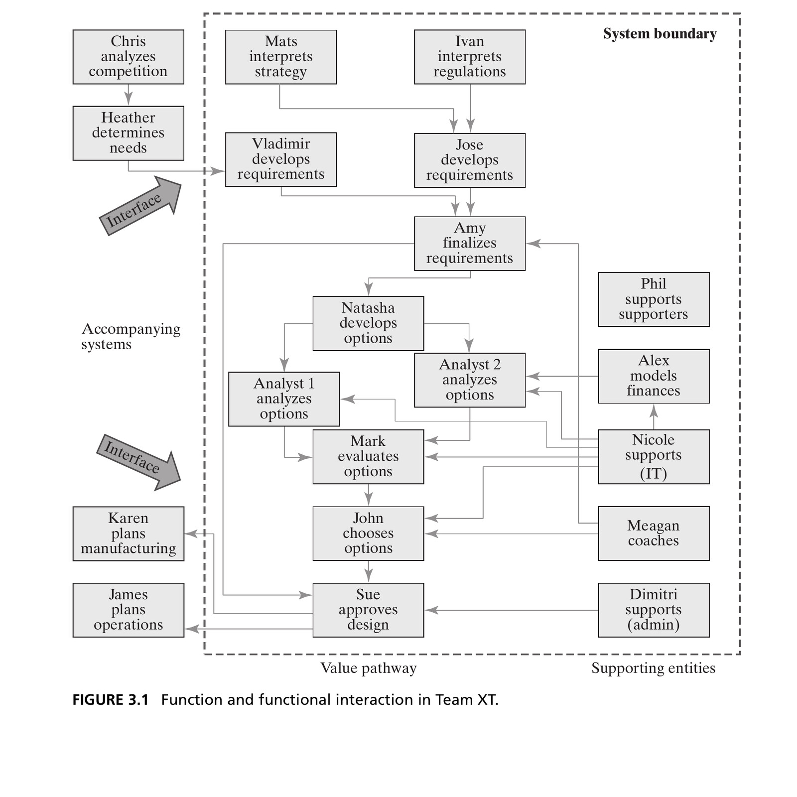
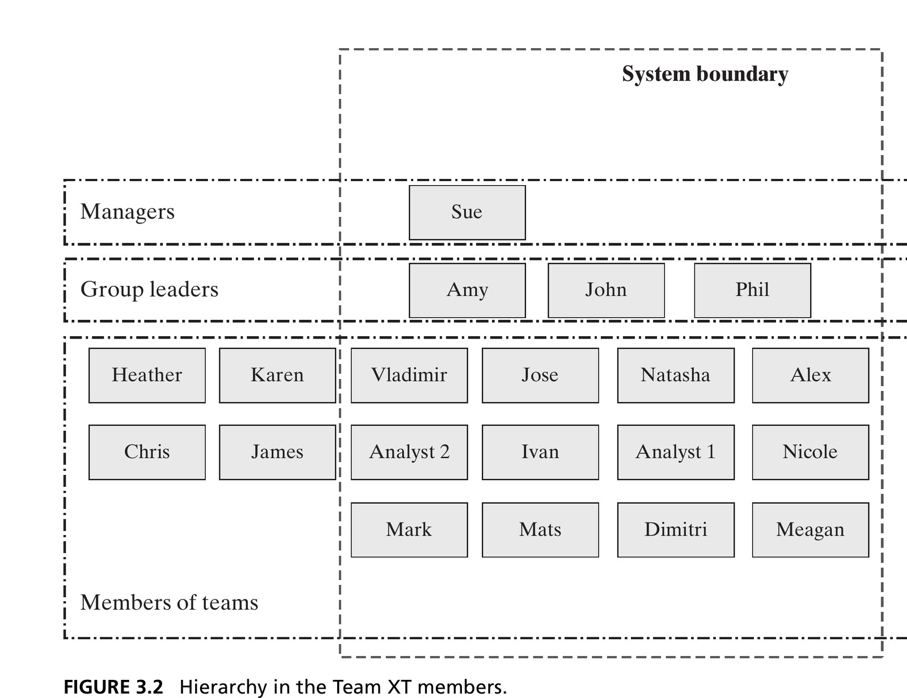
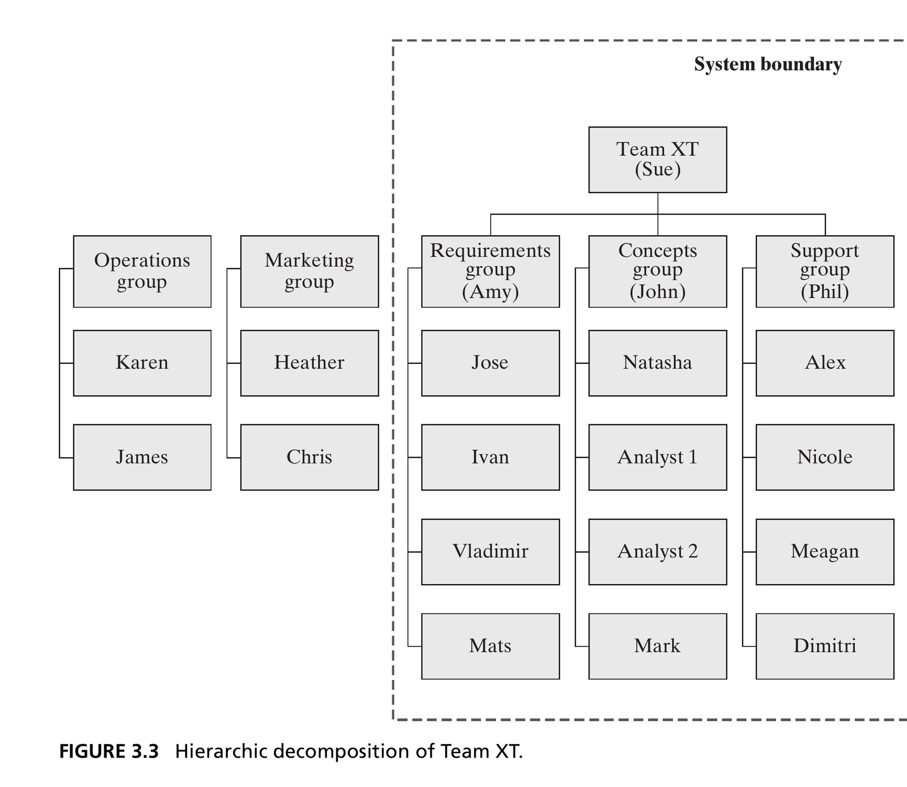
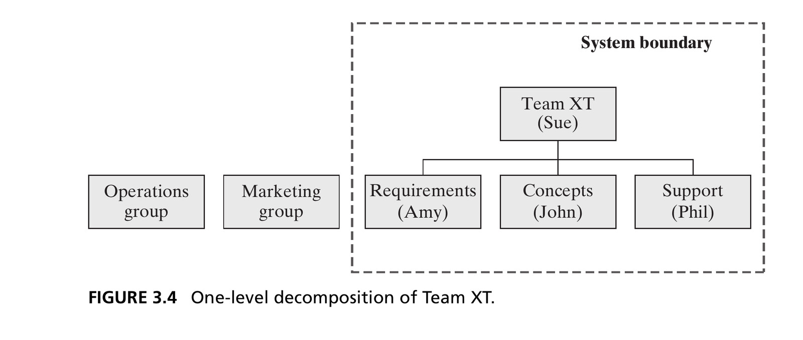
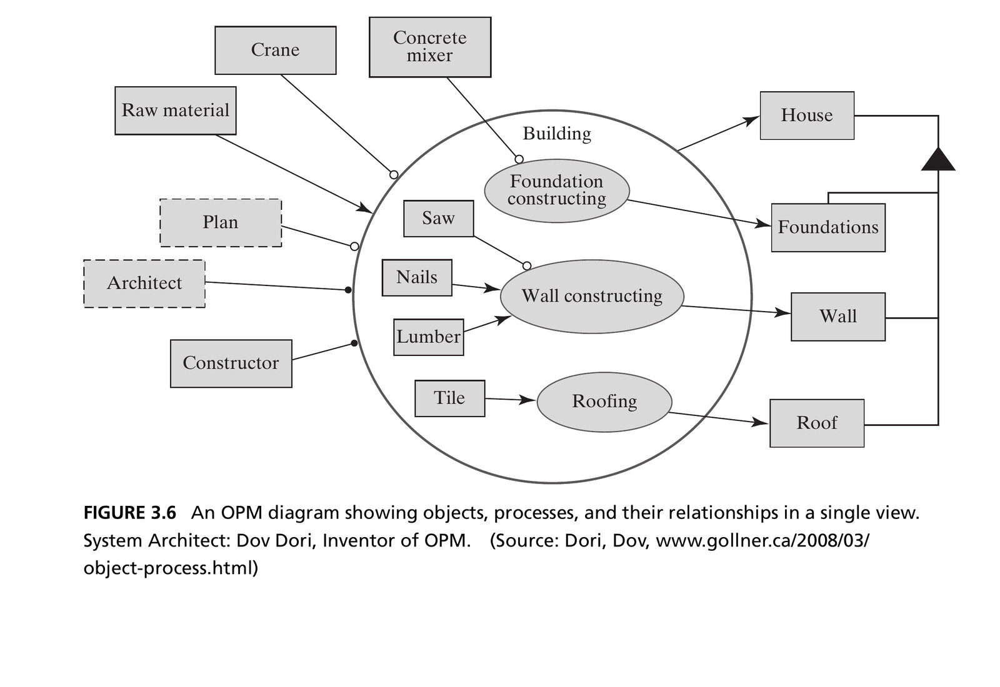

## From Simple to Complex {.smaller}

- Chapter 2 deliberately used **simple** systems — two or three entities — to focus on the ideas: form, function, entities, relationships, emergence
- Most systems we build and work with professionally are **complex**
- This chapter extends system thinking with tools for complexity:

1. Decomposition and hierarchy
2. Special logical relationships (class/instance, specialization, recursion)
3. Techniques for reasoning through complex systems
4. An introduction to SysML and OPM

::: {.notes}
- **Name why Chapter 2 felt easy** — deliberate. Two/three-entity systems (amplifier, Team X, circulatory system, solar system) let us focus purely on form, function, entities, relationships, emergence, without scale as a burden
- Nobody builds professionally with two-entity systems — real amplifiers, design teams, aircraft have dozens of entities
- → This chapter's job: scale everything from Chapter 2 up to genuinely complex systems
- **Preview the four additions**:
  - Decomposition and hierarchy — formalized specifically for managing complexity
  - Special logical relationships that recur with many entities: class/instance, specialization/generalization, recursion
  - Techniques for reasoning through a complex system without getting lost: top-down/bottom-up/middle-out, zigzagging
  - First introduction to **SysML** and **OPM**
- Flag up front: this course uses **OPM** as its primary tool going forward — SysML mentioned for context only, no deep dive into its diagram types
- **Discussion**: What made the Chapter 2 examples easy to hold in mind: few entities, few relationships, or familiar behavior? Those are different sources of apparent simplicity.

[Sources]
- Crawley, Cameron & Selva, *System Architecture* (2016), Ch. 3, pp. 49-50.
:::

## Box 3.1 · Definition: Complex System {.smaller}

::: {.callout-note appearance="simple" icon=false}
**A complex system** has many elements or entities that are highly interrelated, interconnected, or interwoven.
:::

- The fuzziness of the word "many" is deliberate
- Complexity is driven into systems by *asking more of them*: more function, more performance, more robustness, more flexibility
- It is also driven in by asking systems to **work together and interconnect** — your car with the traffic control system, your house with the internet

::: {.notes}
- **Give the formal definition, flag the deliberate vagueness** — students will want an exact entity count, book intentionally doesn't give one
- "Many" is fuzzy on purpose — no bright line (no "50+ entities" rule). What matters is the qualitative property: highly interrelated/interconnected/interwoven, not just numerous
- **Two distinct ways complexity gets driven in** (diagnostic lens for students' own projects):
  1. Asking more of a single system — more function, performance, robustness, flexibility
  2. Asking systems to interconnect with others not designed together — car with traffic control, house with the internet
- → Driver #2 is increasingly dominant in modern systems: complexity isn't only controlled by simplifying your own design — much of it arrives from the environment your system interoperates with
- The chapter notes two broad measurement traditions—information content and functional complexity—but does not adopt a single metric. The definition here is intentionally architectural rather than numerical.
- **Discussion**: If two systems have the same number of entities, what kinds of interconnection could make one much harder to reason about?

[Sources]
- Crawley, Cameron & Selva, *System Architecture* (2016), Ch. 3, pp. 49-50.
:::

## Complex ≠ Complicated {.smaller}

::: {.columns}
::: {.column width="50%"}
**Complex**

An intrinsic property of the system: many interrelated, interconnected entities and relationships.
:::
::: {.column width="50%"}
**Complicated**

A property of *human perception*: something overwhelms our ability to understand it. High **apparent** complexity.
:::
:::

::: {.fragment .callout-important appearance="minimal" icon=false}
**Build systems of the necessary level of complexity that are *not* complicated.**
:::

::: {.fragment}
This is our job as architects: to train our minds to understand complex systems so they do not appear complicated to us — or to anyone else who must work on the system.
:::

::: {.notes}
- **Single most important distinction in the chapter** — be deliberate, these words are used interchangeably in everyday speech but differ sharply here
- **Complex** = intrinsic, objective property of the system — how many entities, how interrelated — independent of who's looking
- **Complicated** = property of *human perception* — whether it overwhelms a person's/team's ability to understand it. Book calls it "apparent" complexity
- **Mission-statement fragment, worth putting on the board verbatim**: build systems of the necessary level of complexity that are *not* complicated
- Not a contradiction — a system can (must) be complex given what's demanded of it, while still not complicated if people have the right abstractions/decompositions/representations to comprehend it
- → This is the architect's job: not avoiding complexity (often impossible), but managing it so it doesn't become complicated — for you and everyone after you
- Historical grounding: complex systems aren't new (Roman water-delivery networks) — but the ratio of complexity to our management tools has shifted; that gap is what this chapter, and the course, closes
- The practical test is audience-dependent: an architecture is not successfully made comprehensible if only its original architect can understand it. Designers, builders, operators, and maintainers must also be able to reason from it.
- **Discussion**: Name a system that is intrinsically complex but well explained. Which abstraction keeps it from feeling complicated?

[Sources]
- Crawley, Cameron & Selva, *System Architecture* (2016), Ch. 3, p. 50.
:::

## Introducing Team XT {.smaller}

- **Team XT** is an *extended* version of Team X from Chapter 2 — same role (producing a design), more entities
- Walking through Task 1: the system is still the group of people and the process responsible for developing the design
- Form = the people. Function = developing a design.
- Determining each member's function requires observation, experience, or interviews — the book tabulates all 18 people in **Table 3.1**, along with their formal structure (location, connectivity, reporting) and functional interactions

::: {.notes}
- **Introduce the running example — deliberate pedagogical device**: Team XT is Team X from Chapter 2, *extended* to realistically many entities, same role (producing a design)
- → Lets students transfer everything from Chapter 2 onto a genuinely complex system, no new vocabulary needed
- **Walk through Task 1 exactly as in Chapter 2** — same four-task procedure applies unchanged: system = group of people + process; form = the people; function = developing a design
- Determining each person's function isn't readable off an org chart — needs observation, experience, or structured interviews (real systems-thinker legwork)
- **Table 3.1** tabulates all 18 Team XT members: function, formal structure (location — Cambridge/Moscow, connectivity, reporting), functional interactions
- → "Team X's Table 2.3, scaled up to 18 people" — same info, realistic scale — and that scale is exactly what forces decomposition and hierarchy next (nobody holds 18 entities in mind at once, per the 7±2 limit)
- Task 2 also forces a boundary decision: Marketing and Operations interact with the team but are abstracted as context rather than included as Team XT entities. That choice keeps attention on the design-development system.
- Task 3 records both **formal** relationships (location, connectivity, reporting) and **functional** interactions. The two structures overlap, but they are not interchangeable.

[Sources]
- Crawley, Cameron & Selva, *System Architecture* (2016), Ch. 3, pp. 50-53, especially Table 3.1.
:::

## Figure 3.1 · Function and Interaction in Team XT

{width=62% fig-align="center"}

::: {.side-caption}
The "value pathway" runs down the center; supporting entities (IT, coaching, admin, finance) flow in from the right; Marketing and Operations sit outside the system boundary. Source: Crawley, Cameron & Selva (2016), Fig. 3.1.
:::

::: {.notes}
- **Walk through this diagram deliberately** — it's Task 3 (relationships) applied to all 18 Team XT entities at once, doing more work than a first glance suggests
- **"Value pathway"** runs down the center — the spine that actually accomplishes the team's job: interpreting strategy/regulation → developing requirements → finalizing requirements → developing/analyzing design options → evaluating → choosing → approving the design. Trace it top to bottom out loud
- **Supporting entities** flow in from the right — IT, coaching, admin, finance — enable the value-pathway people without sitting on the pathway itself
- Outside the dashed system boundary: Marketing and Operations — same abstracted context entities as Team X in Chapter 2, connected via "Interface" markers
- → Even fully drawn, this diagram reveals nothing about **hierarchy** — who outranks whom. All 18 shown on equal footing. That's exactly the gap the next slides (Hierarchy, Figure 3.2) fill
- Do not read the center pathway as the whole architecture. The support layer enables it, while Marketing and Operations represent interfaces to context; removing either from the explanation would hide dependencies relevant to delivery.
- **Discussion**: Which interaction would create the greatest downstream disruption if delayed or removed? Use the arrows, not job titles, to justify the answer.

[Sources]
- Crawley, Cameron & Selva, *System Architecture* (2016), Ch. 3, pp. 52-53, Table 3.1 and Fig. 3.1.
:::

## Decomposition: Divide and Conquer {.smaller}

::: {.columns}
::: {.column width="55%"}
- **Decomposition**: dividing an entity into smaller pieces or constituents — one of the most powerful tools for dealing with complexity
- "Divide and conquer": break a problem down until each piece is tractable
- The difficulty isn't in the *breaking apart* — it's in **integration**, bringing the decomposed entities back together to build the whole
:::
::: {.column width="45%"}
::: {.callout-tip appearance="simple" icon=false title=""}
*"All Gaul is divided into three parts."*

— Julius Caesar, *The Gallic Wars*
:::
:::
:::

::: {.fragment}
In the **formal** domain, form *aggregates* — we worry about physical/logical fit. In the **functional** domain, we decompose functions into more basic functions — and recombining them is where we encounter emergence: the real challenge.
:::

::: {.notes}
- **Decomposition = one of two central tools for handling complexity** (hierarchy is the other, next slides)
- Definition: dividing an entity into smaller pieces or constituents. "Divide and conquer" = the underlying strategy — break an intractable problem down until each piece is tractable
- Julius Caesar quote: this strategy is at least two thousand years old (ties back to Roman water-delivery networks point)
- **Counter-intuitive but key**: the difficulty isn't in *breaking apart* (usually mechanically straightforward) — it's in **integration**, bringing pieces back together to reconstruct the whole
- → Foreshadows a huge amount of later course content, and real systems-engineering practice, where integration failures are notoriously common and expensive
- Fragment sharpens by domain: **formal domain** — form aggregates fairly benignly, mostly physical/logical fit. **Functional domain** — decomposing then recombining functions is where we hit **emergence**, the real challenge
- Decomposition can follow form or function. The book notes, for example, that Jose and Vladimir could be grouped by the shared function “develop requirement documents,” even if another decomposition groups them differently.
- **Discussion**: Propose two valid decompositions of the same familiar system. What question does each make easier to answer, and what does each obscure?

[Sources]
- Crawley, Cameron & Selva, *System Architecture* (2016), Ch. 3, pp. 53-54.
:::

## Hierarchy {.smaller}

- **Hierarchy**: a system in which entities belong to layers or grades, ranked one above the other — very common in social systems
- What makes one grade rank above another?

1. **More scope** — a governor outranks a mayor (a state is larger than a city)
2. **More importance or performance** — a black belt outranks a brown belt
3. **More responsibility** — a president outranks a vice president

::: {.fragment .callout-note appearance="simple" icon=false}
Hierarchy is not always obvious from a functional-interaction diagram like Figure 3.1 — it took a separate view (Figure 3.2) to reveal that Sue outranks Amy, John, and Phil, who outrank everyone else.
:::

::: {.notes}
- **Hierarchy = second core tool for managing complexity**: entities in layers or grades, ranked above one another — extremely common in social/organizational systems (why Team XT is a natural vehicle)
- **Three distinct reasons one grade outranks another** — often conflated, worth separating:
  1. More **scope** — governor outranks mayor (state larger than city, nothing about the person)
  2. More **importance/performance** — black belt outranks brown belt (higher standard, more skill)
  3. More **responsibility** — president outranks vice president
- Ask students which reason applies to examples they think up themselves
- → **Surprising methodological point**: hierarchy isn't always visible from a functional-interaction diagram — even complete Figure 3.1 shows all 18 members flat, nothing signals Sue outranks Amy/John/Phil, who outrank everyone else
- Extracting hierarchy required a separate view (Figure 3.2, next), pulled from Table 3.1's reporting column — concrete preview of "views and projections" (formalized later in §3.6)
- In Team XT, leaders still participate in the value-delivery interactions. That is why rank cannot safely be inferred from how “central” someone looks in the functional diagram.
- **Discussion**: Can a person be high in one hierarchy and low in another—for example, responsibility versus technical expertise? What architectural confusion follows if we collapse those rankings?

[Sources]
- Crawley, Cameron & Selva, *System Architecture* (2016), Ch. 3, p. 54.
:::

## Figure 3.2 · Hierarchy in Team XT

{width=70% fig-align="center"}

::: {.side-caption}
Three flat layers — managers, group leaders, members — with no reporting structure implied within a layer. Source: Crawley, Cameron & Selva (2016), Fig. 3.2.
:::

::: {.notes}
- **Direct payoff of previous slide's claim**: extracted purely from Table 3.1's reporting info, sorts all 18 into three ranked layers — managers (Sue) → group leaders (Amy, John, Phil) → remaining members
- **What it deliberately does NOT claim** (easy misreading): no implied reporting structure within a layer — same tier just means same rank, not that one reports to another
- Compare to Figure 3.1: that showed rich interaction, no hierarchy; this shows clean hierarchy, strips interaction detail
- → Neither view alone is complete — each surfaces one kind of information while suppressing another. "Abstraction" from Chapter 2, now at complex scale
- Use this as a reading discipline: first state what information a diagram encodes, then state what it deliberately omits. Avoid treating omission as evidence that a relationship does not exist.
- **Discussion**: What question can Figure 3.2 answer immediately that Figure 3.1 cannot—and vice versa?

[Sources]
- Crawley, Cameron & Selva, *System Architecture* (2016), Ch. 3, p. 54, Fig. 3.2.
:::

## Hierarchic Decomposition {.smaller}

- Often, decomposition and hierarchy combine into a **hierarchic decomposition**: more than two levels, with reporting relationships between them
- Cognitively more satisfying than an undifferentiated flat layer — it appeals to our desire to group things in sets of **seven ± two**
- The "group" (Requirements / Concepts / Support) is a *useful abstraction* — but not the *only* way to decompose the team. We could have clustered by location, connectivity, or functional relationship instead.

::: {.notes}
- **Combine the two central tools** into a compound structure: **hierarchic decomposition** — more than two levels, explicit reporting relationships between adjacent levels
- Figure 3.2 was hierarchy but flat (three tiers, no further structure); upcoming Figure 3.3 shows genuine hierarchic *decomposition* — middle tier organized into distinct led groups
- **Why this feels more natural than a flat layer**: the text invokes Miller's 7±2 as a grouping heuristic — a flat list of 14 reports is harder to scan, while three groups of ~4-5 keep each local grouping manageable. Treat 7±2 as a rule of thumb, not a universal design law
- **Caution against over-literal thinking**: the Requirements/Concepts/Support grouping is a *useful* abstraction, not the *only* correct decomposition — could equally cluster by location, shared tool, or other functional criterion
- → Echoes "abstractions aren't unique" from Chapter 2 — no single canonical decomposition, only more or less useful ones for the question at hand
- **Discussion**: If Team XT were decomposed by location rather than function, which coordination problem would become visible, and which functional story would become harder to see?

[Sources]
- Crawley, Cameron & Selva, *System Architecture* (2016), Ch. 3, pp. 54-55; Miller (1956), cited by the authors as Ref. 1.
:::

## Figure 3.3 · Hierarchic Decomposition of Team XT

{width=68% fig-align="center"}

::: {.side-caption}
Three group leaders reporting to Sue, about four people reporting to each leader. Source: Crawley, Cameron & Selva (2016), Fig. 3.3.
:::

::: {.notes}
- **Concrete payoff of the previous slide's abstract discussion** — trace out loud: Sue at top; three group leaders (Amy/Requirements, John/Concepts, Phil/Support) report to her; ~4 members report to each leader
- Exactly the hierarchic decomposition just described: three levels, with small local groupings (Sue: 3 direct reports; each leader: ~4)
- **Good moment for side-by-side comparison** if time allows: Figure 3.1 (rich interaction, no hierarchy), Figure 3.2 (flat hierarchy, no grouping), Figure 3.3 (hierarchy + grouping)
- → Each a legitimate, different projection of the same 18 people — no single diagram captures everything; choosing which view to draw is itself a meaningful architectural decision
- **Discussion**: Does this reporting decomposition also minimize the functional interactions that cross group boundaries? Figure 3.1 supplies the evidence needed to test the organizational choice.

[Sources]
- Crawley, Cameron & Selva, *System Architecture* (2016), Ch. 3, p. 55, Fig. 3.3.
:::

## Simple, Medium, and Complex Systems {.smaller}

::: {.columns}
::: {.column width="55%"}
- **Simple system**: fully described by a *one-level* decomposition — generally no more than 7 ± 2 elements, which are essentially atomic (Figure 3.4)
- **Medium-complexity system**: a *two-level* decomposition, up to about (7 ± 2)² ≈ 81 entities (Figure 3.3)
- **Complex system**: same two-level diagram as medium-complexity — but at the second level, there are still further *abstractions* of things below
:::
::: {.column width="45%"}
{width=100%}

::: {.side-caption}
Figure 3.4: one-level decomposition of Team XT. Source: Crawley, Cameron & Selva (2016).
:::
:::
:::

::: {.fragment .callout-tip title="Practical scale limit"}
One rarely sees a decomposition diagram more than two levels deep: a third level could hold up to 729 elements — far more than humans can routinely process.
:::

::: {.notes}
- **Quantitative way to classify any system** — worth working through the arithmetic on the board
- **Simple system**: single-level decomposition, ~7±2 elements, essentially atomic (nothing meaningful lurks below). Figure 3.4 = Team XT collapsed to top-level groups
- **Medium-complexity system**: genuine two-level decomposition. Arithmetic: (7±2)² ≈ **81** entities at the bottom level. Figure 3.3 (Sue, 3 leaders, ~12-15 members) is exactly this
- **Complex system**: *same* two-level diagram as medium — visually identical to Figure 3.3. What differs: second-level elements are not truly atomic, they're **abstractions** hiding further real structure
- Book's example: if Natasha (an individual in Figure 3.3) actually leads her own sub-organization with unshown reports, the system is complex, not medium — diagram looks identical, hidden depth is real
- → Why we never see three-level diagrams drawn in practice: (7±2)³ ≈ **729** elements, vastly more than anyone can process. Sets up the next slide's less-literal vocabulary (Level 0/1/2, atomic parts)
- Present “simple / medium / complex” as the book's representational scheme, not a universal industry classification. Its value is the distinction between visible decomposition depth and hidden depth below an abstraction.
- **Discussion**: What evidence would tell you that a Level 2 box is genuinely atomic for your purpose rather than merely hiding structure you have not investigated?

[Sources]
- Crawley, Cameron & Selva, *System Architecture* (2016), Ch. 3, pp. 55-56, Figs. 3.3-3.4.
:::

## Level 0, 1, and 2 — and Atomic Parts {.smaller}

- We refer to **Level 0** ("the system"), **Level 1 (down)**, **Level 2 (down)** — the designation of Level 0 is somewhat arbitrary and depends on the architect's viewpoint
- There is little consensus on names for the levels below "the system" (modules, assemblies, components, routines, sections...) — one person's assembly is another's component

::: {.fragment}
**Atomic part**: from Greek *átomos*, "indivisible."

- Mechanical systems: *"Call it a part when you can't take it apart."*
- Informational systems: *"Call it a part if it loses meaning when you take it apart."*
:::

::: {.notes}
- **Standardized vocabulary for decomposition depth** — industry's informal vocabulary is a genuine mess
- **Level 0** = "the system," **Level 1 (down)** = immediate constituents, **Level 2 (down)** = entities within those
- Be honest about arbitrariness (echoes Chapter 2): which layer is Level 0 depends on the architect's viewpoint — no objectively correct starting point, only a useful one
- Industry terms below "the system" (modules, assemblies, components, routines, sections) have no consensus — one person's assembly is another's component. Don't try to memorize a "correct" mapping that doesn't exist
- **"Atomic part"** — workable if fuzzy definition. Etymology: Greek *átomos*, "indivisible"
  - Mechanical: "call it a part when you can't take it apart" — bolt, screw, chip (chip has internal detail but treated as atomic for higher-level reasoning)
  - Informational: "call it a part if it loses meaning when you take it apart" — word, instruction, discrete data unit
- → Both rules capture the same idea — a natural stopping point for decomposition, adapted to physical vs. informational domains
- Levels can also extend upward—Level 1 up, Level 2 up—because the chosen Level 0 may itself sit inside a larger system. The naming is relational to the reference system, not absolute.
- “Atomic” is therefore purpose-relative: a chip or screw can contain internal structure while still being treated as indivisible in the current architectural model.
- **Discussion**: At what level would a battery cell be atomic for a vehicle architect, and at what level would it cease to be atomic?

[Sources]
- Crawley, Cameron & Selva, *System Architecture* (2016), Ch. 3, pp. 56-57.
:::

# 3.4 Special Logical Relationships

## The Class/Instance Relationship {.smaller}

- A **class** describes the general features of something; an **instance** is a specific occurrence of that class
- A model of a car is a class; a specific Vehicle Identification Number (VIN) is an instance
- A part number refers to a class; a serial number refers to an instance

::: {.fragment .callout-tip title="Class and instances in Team XT"}
Table 3.1 has two "Analyst" entities — we could instead define a class **Analyst**, with Analyst 1 and Analyst 2 as its instances. The 11 players on a soccer team and the 88 keys of a piano are instances of the classes "Player" and "Key."
:::

::: {.notes}
- **First of three "special logical relationships"** that recur once systems get complex — worth naming explicitly, show up in software, hardware, organizations
- **Class/instance**: class = general features of a category; instance = one specific occurrence. Term borrowed from OOP, though the idea predates programming languages
- Everyday examples: car model = class, a specific VIN = instance (an actual car in a driveway). Part number = class, serial number = instance
- **Connect to Team XT**: Table 3.1's "Analyst 1"/"Analyst 2" could be reformulated as class **Analyst** with two instances
- → Useful when an entity type recurs and instances are easily added — 11 soccer players = instances of "Player," 88 piano keys = instances of "Key." Ask students for their own examples
- Instances share the class definition, but remain individually identifiable and may occupy different states. A serial number matters precisely because two nominally identical parts can have different histories.
- **Discussion**: In Team XT, which properties belong to the class “Analyst,” and which belong only to Analyst 1 or Analyst 2?

[Sources]
- Crawley, Cameron & Selva, *System Architecture* (2016), Ch. 3, p. 57.
:::

## The Specialization Relationship {.smaller}

- **Specialization/generalization** describes the connection between a general object and a set of more specific objects
- Shopping for a house: the general object is "House," and specific objects are styles — colonial, Victorian, modern
- In Team XT, we created three specializations of the generalization "Group": a requirements group, a design (concepts) group, and a support group

::: {.fragment .callout-note appearance="simple" icon=false}
Specialization is akin to **inheritance** in object-oriented programming: a class is created from a more general class, inheriting some attributes and functionality while adding its own.
:::

::: {.notes}
- **Second special logical relationship — distinguish carefully from class/instance** (students frequently conflate). Ask directly: "what's the difference between an instance of a class and a specialization of a generalization?"
- Class/instance = interchangeable, near-identical occurrences. Specialization/generalization = genuinely *different variants* sharing a common general concept
- **House-shopping example**: "House" = general object; colonial/Victorian/modern = specific objects, real feature differences, not interchangeable copies
- **Reconnect to Team XT**: the "group" abstraction wasn't three generic identical groups — we specialized "Group" into requirements, design (concepts), support groups, each with different composition and purpose
- Fragment's OOP parallel: specialization = **inheritance** — a more specific class inherits attributes/functionality from a general class, adding its own on top
- → If students have programming background, ask them to map a class hierarchy from their own code onto this language
- A quick test: “this particular X” usually signals an instance; “this kind of X” usually signals a specialization. A specific Victorian house is an instance of the specialization “Victorian house.”
- **Discussion**: Classify “vehicle,” “electric vehicle,” and “the car with VIN 123” using both relationships.

[Sources]
- Crawley, Cameron & Selva, *System Architecture* (2016), Ch. 3, p. 57.
:::

## Recursion {.smaller}

- **Recursion**: when a process or object uses itself within the whole — entities or relationships applied in a self-similar way at multiple levels
- Team XT: the whole team is a team of people; within it, three groups are each *mini-teams* — a mild form of recursion
- Software engineering uses recursion explicitly and often: a class `Node` with an attribute `Neighbors` that is itself an array of `Node`s

::: {.notes}
- **Third and last special logical relationship**: recursion — a process/object uses itself within the whole, the same pattern repeating self-similarly at multiple levels
- Different from the previous two: class/instance = interchangeable copies, specialization/generalization = variants of a shared concept, recursion = self-similar repeating pattern *across levels*
- **Team XT example**: whole team = team of people; zoom into any of the three groups, each is *also* structurally a small team — same "team" pattern one level down. Mild recursion (sub-teams don't have their own sub-sub-teams, but the pattern echoes)
- **Software example** (crisper, literal): class `Node` with attribute `Neighbors` that is itself an array of `Node`s — the class is defined in terms of itself
- → Explicit deliberate recursion, used constantly in real software (any graph/tree/linked-list). Not an exotic edge case — one of the most common, useful patterns once structure can legitimately repeat at different scales
- Distinguish recursion from repetition: many analysts are repeated instances; a team containing smaller entities organized as teams is self-similar across levels and therefore recursive.
- **Discussion**: Which properties must repeat across levels before you would call a structure recursive rather than merely nested?

[Sources]
- Crawley, Cameron & Selva, *System Architecture* (2016), Ch. 3, pp. 57-58.
:::

# 3.5 Reasoning through Complex Systems

## Top-Down / Bottom-Up / Middle-Out {.smaller}

::: {.columns}
::: {.column width="33%"}
**Top-down**

Start from the goals of a system, proceed to concept and high-level architecture, then increase detail until reaching the smallest entities of interest. Follows the "left-hand side" of the systems-engineering V model.
:::
::: {.column width="33%"}
**Bottom-up**

Start from the artifacts, capabilities, or services available at the lowest-level entities, and build upward, predicting emergence.
:::
::: {.column width="33%"}
**Middle-out**

Because truly complex systems have no real top or bottom, we always start somewhere in the hierarchy and reason a level or two up or down from there.
:::
:::

::: {.notes}
- **First of two general-purpose reasoning techniques — this one about direction**
- **Top-down**: start from overall goals, through concept/high-level architecture, progressively increase detail. Corresponds to the "left-hand side" of the systems-engineering V-model. Most of the textbook's development follows this
- **Bottom-up**: start from artifacts/capabilities/services already available at the lowest level, build *upward*, predict what emerges. Example: CEO gathers 16 appropriate employees, lets them self-organize into a design process — starting from capable individuals, letting structure emerge upward
- **Middle-out** resolves a real tension: truly complex systems have no definitive top or bottom (even "Level 0" is arbitrary, per Chapter 2), so in practice we always start from some arbitrary embedded point and work outward a level or two
- → Book's honest conclusion: because there's no true top or bottom, we're always practically doing middle-out, even when we call it top-down or bottom-up. Good architects practice all three fluidly
- The book also names an **outer-in** variant: begin at both the goals and the available lower-level capabilities, then work toward a meeting point. This exposes mismatches earlier than committing to either end alone.
- **Discussion**: For a redesign constrained by an installed legacy subsystem, where would you begin and why? Identify what must be reasoned downward and what must be reasoned upward.

[Sources]
- Crawley, Cameron & Selva, *System Architecture* (2016), Ch. 3, p. 58.
:::

## Zigzagging {.smaller}

- Term coined by **Nam Suh** in his work on axiomatic design
- When reasoning about a system, we alternate between the **form** domain and the **function** domain — start in one, work as long as practical, then switch
- Team XT example: we started in the function domain ("design developing"), switched to form (small groups), then switched back to function (what each group does) — and this pattern continues down through the levels

::: {.fragment .callout-tip title="Architectural reasoning in practice"}
Good architects practice top-down, bottom-up, and middle-out reasoning, zigzagging between form and function throughout.
:::

::: {.notes}
- **Second general-purpose reasoning technique — domain-switching, not direction**
- Term coined by **Nam Suh** in axiomatic design (formal framework mapping needs → functional requirements → design parameters, worth a brief mention)
- Observation: when reasoning through a system, we naturally alternate between form and function domains, staying in one as long as practical before switching
- **Team XT worked example** (retraces the earlier hierarchic-decomposition steps): function ("developing a design") → form (small groups: Requirements, Concepts, Support) → function again (what each group does) → repeats down through successive levels
- → Section takeaway: good architects don't pick one reasoning mode rigidly — they practice top-down/bottom-up/middle-out *while* zigzagging form/function. Direction and domain-switching operate independently and combine freely; neither alone is sufficient
- Zigzagging is not casual alternation. Each switch asks whether the proposed form can deliver the function, or what function a proposed form can support; the answer constrains the next move.
- **Discussion**: Start from one desired function in a student project. Propose a form, then state the next lower-level function that choice creates.

[Sources]
- Crawley, Cameron & Selva, *System Architecture* (2016), Ch. 3, pp. 58-59; Suh (1998), cited by the authors as Ref. 3.
:::

# 3.6 Architecture Representation: OPM

## Views and Projections {.smaller}

A description of a complex system's architecture contains more information than any one person can readily comprehend.

::: {.callout-note appearance="simple" icon=false}
**Integrated model + projections**: build one consistent model, then *project* it into whatever view is needed (floor plan, façade, section) — like modern 3D CAD. Views are guaranteed consistent because they come from the same model.
:::

::: {.fragment}
This course uses **OPM** (Object-Process Methodology), which follows the integrated-model approach.
:::

::: {.notes}
- **Chapter's final major topic**: how do we *represent* a complex system's architecture, given that a full description exceeds what one person can comprehend at once?
- **Two genuinely different strategic approaches — a real methodological fork**:
  1. Multiple separate *views*, no guarantee of mutual consistency (SysML, DoDAF)
  2. Single *integrated model*, project whichever view is needed (this slide's approach)
- **Civil-architecture analogy**: pre-3D-CAD, hand-drawn floor plan/façade/sections had no guarantee of consistency. Modern 3D CAD: one model, software projects whatever 2D view is needed, automatically consistent because all views derive from the same model
- → Fragment states course policy plainly: **OPM** follows the integrated-model approach — this is our primary representation tool for the rest of the semester
- Both strategies are used in practice. SysML and DoDAF organize multiple views; OPM maintains an integrated model from which relevant information can be projected. The tradeoff is not “diagrams versus no diagrams,” but where consistency is maintained.
- **Discussion**: What governance or tooling is needed to keep separately maintained views consistent after a design change?

[Sources]
- Crawley, Cameron & Selva, *System Architecture* (2016), Ch. 3, pp. 59-60.
:::

## OPM {.smaller}

- **Object-Process Methodology** — developed by Professor **Dov Dori** at Technion, unifying object- and process-oriented paradigms into a single model
- **Objects** (boxes) and **processes** (ovals) appear together in *one* integrated diagram, connected by typed relationships — an object can be an *instrument* of a process, or can be *changed by* a process
- No separate views: form and function, and every logical relationship, are all represented in a single model

::: {.notes}
- **Introduce OPM properly** — the tool for the rest of the course
- Developed by **Professor Dov Dori** at Technion, unifying object-oriented and process-oriented modeling paradigms into one integrated model — no separate structure/behavior diagrams
- **Core visual grammar**: objects (form) = boxes; processes (function) = ovals; both appear together in one diagram, connected by typed relationships
- Two relationship types: object as **instrument** of a process (tool/resource, unchanged), or object **changed by** a process (altered/created/consumed — our familiar "operand" from Chapter 2, now a precise OPM relationship type)
- → Payoff: OPM maintains a single integrated model that can contain form, function, and logical relationships. The textbook's “no different views or types of diagrams” claim should not be taken to mean every fact must be displayed at once; useful projections can still be generated from the master model
- **Discussion**: What is gained by placing objects and processes in one model? What new diagram-density problem does that create?

[Sources]
- Crawley, Cameron & Selva, *System Architecture* (2016), Ch. 3, pp. 61-62.
:::

## Figure 3.6 · An OPM Diagram

{width=62% fig-align="center"}

::: {.side-caption}
Building a house: objects (Crane, Lumber, Foundations...) and processes (Foundation constructing, Wall constructing, Roofing) in one view. System Architect: Dov Dori, inventor of OPM. Source: Dori, D., gollner.ca (2008), reproduced in Crawley, Cameron & Selva (2016), Fig. 3.6.
:::

::: {.notes}
- **First real OPM notation example — walk through carefully**, make sure box/oval distinction and arrows are legible
- System: building a house. **Objects** (boxes): Crane, Raw material, Plan, Architect, Constructor, Lumber, Nails, Saw, Tile, and outputs Foundations, Wall, Roof, House. **Processes** (ovals, inside overall "Building"): Foundation constructing, Wall constructing, Roofing
- **Trace the relationships, not a chronology**: raw material is consumed by Building; Plan, Architect, and Constructor enable it; the subprocesses yield Foundations, Wall, and Roof; those parts aggregate into House. The figure does not specify construction timing
- → Good single-slide illustration of the whole chapter (and last) together: form (boxes), function (ovals), decomposition/aggregation (parts → House), functional relationships (instrument/consumption arrows) — all in one integrated model, no separate views
- Use the link-end symbols as evidence: a filled dot, open circle, arrowhead, and aggregation triangle encode different semantics. Students should resist reading every line as a generic “is connected to.”
- **Discussion**: Choose one object and explain whether the process changes it, uses it without changing it, or produces it.

[Sources]
- Crawley, Cameron & Selva, *System Architecture* (2016), Ch. 3, p. 61, Fig. 3.6.
:::

## OPM Representations {.smaller}

OPM has its own visual conventions for the logical relationships from Section 3.4:

| Relationship | OPM Notation |
|---|---|
| Decomposition / aggregation | Triangle-headed tree |
| Specialization / generalization | Open-triangle tree |
| Class / instance | Paired filled/open-triangle tree |

::: {.fragment .callout-tip title="Course modeling convention"}
This course uses **OPM** as its architecture representation tool throughout.
:::

::: {.notes}
- **Practical reference table** for OPM notation of the three §3.4 relationships — students will come back to this when drawing OPM diagrams
- Decomposition/aggregation: solid, filled triangle-headed tree
- Specialization/generalization: similar tree, but *open* (unfilled) triangle head — small but important distinction to avoid confusing the two
- Class/instance: a tree marked by the paired filled/open-triangle symbol shown in Table 3.2; this is distinct from both aggregation's filled triangle and specialization's open triangle
- → Fragment restates course policy: OPM is the tool for the rest of the course. Good moment to practice converting a small example (Team XT's hierarchic decomposition) into proper OPM notation while the grammar is fresh
- The table gives equivalent local patterns in SysML and OPM, not a guarantee that whole models can be translated mechanically. The authors point to view generation as a more involved problem.
- **Discussion**: Cover the labels and ask students to identify each relationship from the triangle symbol alone, then explain the semantics in words.

[Sources]
- Crawley, Cameron & Selva, *System Architecture* (2016), Ch. 3, p. 62, Table 3.2.
:::

## Section 3.7 Summary {.smaller}

| Feature of Complex Systems | Approach |
|---|---|
| Can be decomposed into smaller, more specialized entities | Decompose; identify hierarchy; continue to ~2 levels or atomic parts |
| Certain logical relationships recur among entities | Identify class/instance; identify specialization/generalization; identify recursion |
| Patterns of relationship can be exploited when reasoning | Top-down/bottom-up/middle-out; zigzag between form and function |
| Architecture can be viewed or projected for understanding | Project from a single integrated model (OPM) |

::: {.notes}
- **Same use as Chapter 2's closing table** — compressed four-row map students should reconstruct from memory. Each row pairs a *feature* of complex systems (left) with the *approach* this chapter gives us (right)
- Decomposable into specialized entities → decompose, identify hierarchy, continue ~2 levels or to atomic parts
- Certain logical relationships recur → identify class/instance, specialization/generalization, recursion
- Relationship patterns can be exploited → reason top-down/bottom-up/middle-out, zigzag form/function
- Architecture can be viewed/projected → project from a single integrated model (OPM)
- → Direct scaling-up of Chapter 2's Table 2.6 — same logic, now addressing what changes once "many interrelated entities" enters the picture
- Table 3.3 also previews four techniques developed later: system/accompanying-system/context distinctions, value-pathway layers, function-goal reasoning, and “2 Down 1 Up” reasoning. Chapter 3 is a map of methods, not the endpoint.
- **Discussion**: Give students an unfamiliar complex system and ask which row they would use first. Different starting choices should reveal different assumptions about the problem.

[Sources]
- Crawley, Cameron & Selva, *System Architecture* (2016), Ch. 3, pp. 62-64, Table 3.3.
:::

## Next: Form

Part 2 — Analysis of System Architecture — begins with Chapter 4, developing **form** and **function** as the building blocks of architecture in depth.

::: {.callout-tip title="Reference"}
Crawley, E., Cameron, B., & Selva, D. (2016). *System Architecture: Strategy and Product Development for Complex Systems*. Pearson. Chapter 3.
:::

::: {.notes}
- **Close the chapter and close out Part 1** — Chapter 3 is the last of "System Thinking" (Chapters 1-3)
- Remind students: Chapter 1 motivated the subject with real stakes (Apollo, NPOESS, Boeing); Chapter 2 built the four-task foundation on simple systems (form, function, entities, relationships, emergence); Chapter 3 scaled it to genuinely complex systems (decomposition, hierarchy, special logical relationships, reasoning techniques, OPM)
- → Preview Chapter 4: opens **Part 2, Analysis of System Architecture** (Chapters 4-8) — works differently, goes *deep* on form and function as fundamental building blocks, deliberately restarting with simple systems before scaling back up to master each method before applying it to complex cases
- **Exit prompt**: In one sentence, name the technique from Chapter 3 you would use first when a system feels complicated, and state what information it would reveal.

[Sources]
- Crawley, Cameron & Selva, *System Architecture* (2016), Ch. 3, p. 64, and the transition to Part 2.
:::
