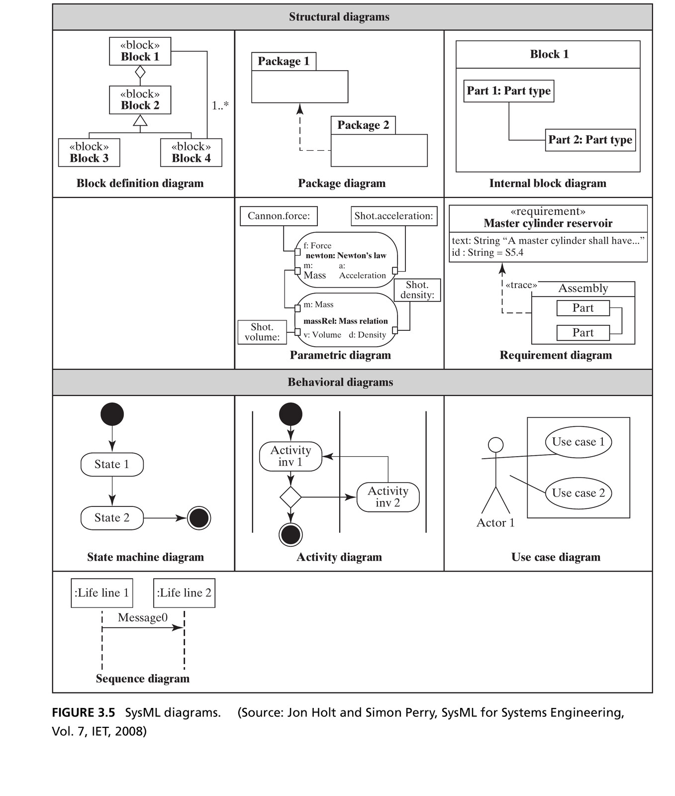

## From Simple to Complex {.smaller}

- Chapter 2 deliberately used **simple** systems — two or three entities — to focus on the ideas: form, function, entities, relationships, emergence
- Most systems we build and work with professionally are **complex**
- This chapter extends system thinking with tools for complexity:

1. Decomposition and hierarchy
2. Special logical relationships (class/instance, specialization, recursion)
3. Techniques for reasoning through complex systems
4. An introduction to SysML and OPM

## Box 3.1 · Definition: Complex System {.smaller}

::: {.callout-note appearance="simple" icon=false}
**A complex system** has many elements or entities that are highly interrelated, interconnected, or interwoven.
:::

- The fuzziness of the word "many" is deliberate
- Complexity is driven into systems by *asking more of them*: more function, more performance, more robustness, more flexibility
- It is also driven in by asking systems to **work together and interconnect** — your car with the traffic control system, your house with the internet

## Complex ≠ Complicated {.smaller}

::: {.columns}
::: {.column width="50%"}
**Complex**

An intrinsic property of the system: many interrelated, interconnected entities and relationships.
:::
::: {.column width="50%"}
**Complicated**

A property of *human perception*: something overwhelms our ability to understand it. High **apparent** complexity.
:::
:::

::: {.fragment .callout-important appearance="minimal" icon=false}
**Build systems of the necessary level of complexity that are *not* complicated.**
:::

::: {.fragment}
This is our job as architects: to train our minds to understand complex systems so they do not appear complicated to us — or to anyone else who must work on the system.
:::

## Introducing Team XT {.smaller}

- **Team XT** is an *extended* version of Team X from Chapter 2 — same role (producing a design), more entities
- Walking through Task 1: the system is still the group of people and the process responsible for developing the design
- Form = the people. Function = developing a design.
- Determining each member's function requires observation, experience, or interviews — the book tabulates all 18 people in **Table 3.1**, along with their formal structure (location, connectivity, reporting) and functional interactions

## Figure 3.1 · Function and Interaction in Team XT

{width=62% fig-align="center"}

::: {.side-caption}
The "value pathway" runs down the center; supporting entities (IT, coaching, admin, finance) flow in from the right; Marketing and Operations sit outside the system boundary. Source: Crawley, Cameron & Selva (2016), Fig. 3.1.
:::

## Decomposition: Divide and Conquer {.smaller}

::: {.columns}
::: {.column width="55%"}
- **Decomposition**: dividing an entity into smaller pieces or constituents — one of the most powerful tools for dealing with complexity
- "Divide and conquer": break a problem down until each piece is tractable
- The difficulty isn't in the *breaking apart* — it's in **integration**, bringing the decomposed entities back together to build the whole
:::
::: {.column width="45%"}
::: {.callout-tip appearance="simple" icon=false}
*"All Gaul is divided into three parts."*

— Julius Caesar, *The Gallic Wars*
:::
:::
:::

::: {.fragment}
In the **formal** domain, form *aggregates* — we worry about physical/logical fit. In the **functional** domain, we decompose functions into more basic functions — and recombining them is where we encounter emergence: the real challenge.
:::

## Hierarchy {.smaller}

- **Hierarchy**: a system in which entities belong to layers or grades, ranked one above the other — very common in social systems
- What makes one grade rank above another?

1. **More scope** — a governor outranks a mayor (a state is larger than a city)
2. **More importance or performance** — a black belt outranks a brown belt
3. **More responsibility** — a president outranks a vice president

::: {.fragment .callout-note appearance="simple" icon=false}
Hierarchy is not always obvious from a functional-interaction diagram like Figure 3.1 — it took a separate view (Figure 3.2) to reveal that Sue outranks Amy, John, and Phil, who outrank everyone else.
:::

## Figure 3.2 · Hierarchy in Team XT

{width=70% fig-align="center"}

::: {.side-caption}
Three flat layers — managers, group leaders, members — with no reporting structure implied within a layer. Source: Crawley, Cameron & Selva (2016), Fig. 3.2.
:::

## Hierarchic Decomposition {.smaller}

- Often, decomposition and hierarchy combine into a **hierarchic decomposition**: more than two levels, with reporting relationships between them
- Cognitively more satisfying than an undifferentiated flat layer — it appeals to our desire to group things in sets of **seven ± two**
- The "group" (Requirements / Concepts / Support) is a *useful abstraction* — but not the *only* way to decompose the team. We could have clustered by location, connectivity, or functional relationship instead.

## Figure 3.3 · Hierarchic Decomposition of Team XT

{width=68% fig-align="center"}

::: {.side-caption}
Three group leaders reporting to Sue, about four people reporting to each leader. Source: Crawley, Cameron & Selva (2016), Fig. 3.3.
:::

## Simple, Medium, and Complex Systems {.smaller}

::: {.columns}
::: {.column width="55%"}
- **Simple system**: fully described by a *one-level* decomposition — generally no more than 7 ± 2 elements, which are essentially atomic (Figure 3.4)
- **Medium-complexity system**: a *two-level* decomposition, up to about (7 ± 2)² ≈ 81 entities (Figure 3.3)
- **Complex system**: same two-level diagram as medium-complexity — but at the second level, there are still further *abstractions* of things below
:::
::: {.column width="45%"}
{width=100%}

::: {.side-caption}
Figure 3.4: one-level decomposition of Team XT. Source: Crawley, Cameron & Selva (2016).
:::
:::
:::

::: {.fragment .callout-tip}
One rarely sees a decomposition diagram more than two levels deep: a third level could hold up to 729 elements — far more than humans can routinely process.
:::

## Level 0, 1, and 2 — and Atomic Parts {.smaller}

- We refer to **Level 0** ("the system"), **Level 1 (down)**, **Level 2 (down)** — the designation of Level 0 is somewhat arbitrary and depends on the architect's viewpoint
- There is little consensus on names for the levels below "the system" (modules, assemblies, components, routines, sections...) — one person's assembly is another's component

::: {.fragment}
**Atomic part**: from Greek *átomos*, "indivisible."

- Mechanical systems: *"Call it a part when you can't take it apart."*
- Informational systems: *"Call it a part if it loses meaning when you take it apart."*
:::

# 3.4 Special Logical Relationships

## The Class/Instance Relationship {.smaller}

- A **class** describes the general features of something; an **instance** is a specific occurrence of that class
- A model of a car is a class; a specific Vehicle Identification Number (VIN) is an instance
- A part number refers to a class; a serial number refers to an instance

::: {.fragment .callout-tip}
Table 3.1 has two "Analyst" entities — we could instead define a class **Analyst**, with Analyst 1 and Analyst 2 as its instances. The 11 players on a soccer team and the 88 keys of a piano are instances of the classes "Player" and "Key."
:::

## The Specialization Relationship {.smaller}

- **Specialization/generalization** describes the connection between a general object and a set of more specific objects
- Shopping for a house: the general object is "House," and specific objects are styles — colonial, Victorian, modern
- In Team XT, we created three specializations of the generalization "Group": a requirements group, a design (concepts) group, and a support group

::: {.fragment .callout-note appearance="simple" icon=false}
Specialization is akin to **inheritance** in object-oriented programming: a class is created from a more general class, inheriting some attributes and functionality while adding its own.
:::

## Recursion {.smaller}

- **Recursion**: when a process or object uses itself within the whole — entities or relationships applied in a self-similar way at multiple levels
- Team XT: the whole team is a team of people; within it, three groups are each *mini-teams* — a mild form of recursion
- Software engineering uses recursion explicitly and often: a class `Node` with an attribute `Neighbors` that is itself an array of `Node`s

# 3.5 Reasoning through Complex Systems

## Top-Down / Bottom-Up / Middle-Out {.smaller}

::: {.columns}
::: {.column width="33%"}
**Top-down**

Start from system goals, proceed to concept and high-level architecture, then increase detail until reaching the smallest entities of interest. Follows the "left-hand side" of the systems-engineering V model.
:::
::: {.column width="33%"}
**Bottom-up**

Start from the artifacts, capabilities, or services available at the lowest-level entities, and build upward, predicting emergence.
:::
::: {.column width="33%"}
**Middle-out**

Because truly complex systems have no real top or bottom, we always start somewhere in the hierarchy and reason a level or two up or down from there.
:::
:::

## Zigzagging {.smaller}

- Term coined by **Nam Suh** in his work on axiomatic design
- When reasoning about a system, we alternate between the **form** domain and the **function** domain — start in one, work as long as practical, then switch
- Team XT example: we started in the function domain ("design developing"), switched to form (small groups), then switched back to function (what each group does) — and this pattern continues down through the levels

::: {.fragment .callout-tip}
Good architects practice top-down, bottom-up, and middle-out reasoning, zigzagging between form and function throughout.
:::

# 3.6 SysML and OPM

## Views and Projections {.smaller}

A description of a complex system's architecture contains more information than any one person can readily comprehend. Two approaches:

::: {.columns}
::: {.column width="50%"}
**Integrated model + projections**

Like modern 3D CAD: build one consistent model, then *project* it into whatever view is needed (floor plan, façade, section) — views are guaranteed consistent because they come from the same model.
:::
::: {.column width="50%"}
**Multiple views**

Like traditional civil architecture before 3D tools: maintain several views directly, with only limited confidence that they'll yield a consistent whole.
:::
:::

::: {.fragment .callout-note appearance="simple" icon=false}
OPM follows the integrated-model approach. SysML (and DoDAF) follow the multiple-views approach.
:::

## SysML {.smaller}

- **Systems Modeling Language** — developed 2003 by the Object Management Group (OMG) and INCOSE, adapting UML for systems engineers
- Uses a subset of UML plus new features for requirements and performance
- **9 views**, split into two groups:

::: {.columns}
::: {.column width="50%"}
**Structural** (form) — block definition, internal block, package, parametric, requirement
:::
::: {.column width="50%"}
**Behavioral** (function) — activity, state machine, use case, sequence
:::
:::

## Figure 3.5 · SysML Diagrams

{width=58% fig-align="center"}

::: {.side-caption}
Block definition and internal block diagrams represent form; the four behavioral diagrams represent function and time-dependent behavior. Source: Jon Holt and Simon Perry, *SysML for Systems Engineering*, Vol. 7, IET (2008), reproduced in Crawley, Cameron & Selva (2016), Fig. 3.5.
:::

## OPM {.smaller}

- **Object-Process Methodology** — developed by Professor **Dov Dori** at Technion, unifying object- and process-oriented paradigms into a single model
- **Objects** (boxes) and **processes** (ovals) appear together in *one* integrated diagram, connected by typed relationships — an object can be an *instrument* of a process, or can be *changed by* a process
- No separate views: everything SysML spreads across 9 diagrams, OPM represents in a single model

## Figure 3.6 · An OPM Diagram

{width=62% fig-align="center"}

::: {.side-caption}
Building a house: objects (Crane, Lumber, Foundations...) and processes (Foundation constructing, Wall constructing, Roofing) in one view. System Architect: Dov Dori, inventor of OPM. Source: Dori, D., gollner.ca (2008), reproduced in Crawley, Cameron & Selva (2016), Fig. 3.6.
:::

## SysML vs. OPM {.smaller}

Both tools are expressive enough to represent the same logical relationships — they just draw them differently.

| Relationship | SysML | OPM |
|---|---|---|
| Decomposition / aggregation | Diamond-headed tree | Triangle-headed tree |
| Specialization / generalization | Open-triangle tree | Open-triangle tree |
| Class / instance | Separate boxes, `instance:Class` | Nested inside the class box |

::: {.fragment .callout-tip}
This text uses **OPM** as the primary tool for architecture representation, referring to SysML diagrams as needed.
:::

## Section 3.7 Summary {.smaller}

| Feature of Complex Systems | Approach |
|---|---|
| Can be decomposed into smaller, more specialized entities | Decompose; identify hierarchy; continue to ~2 levels or atomic parts |
| Certain logical relationships recur among entities | Identify class/instance; identify specialization/generalization; identify recursion |
| Patterns of relationship can be exploited when reasoning | Top-down/bottom-up/middle-out; zigzag between form and function |
| Architecture can be viewed or projected for understanding | Construct consistent views (SysML); project from an integrated model (OPM) |

## Next: Form

Part 2 — Analysis of System Architecture — begins with Chapter 4, developing **form** and **function** as the building blocks of architecture in depth.

::: {.callout-tip}
**Reference**: Crawley, E., Cameron, B., & Selva, D. (2016). *System Architecture: Strategy and Product Development for Complex Systems*. Pearson. Chapter 3.
:::
