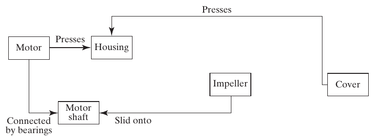
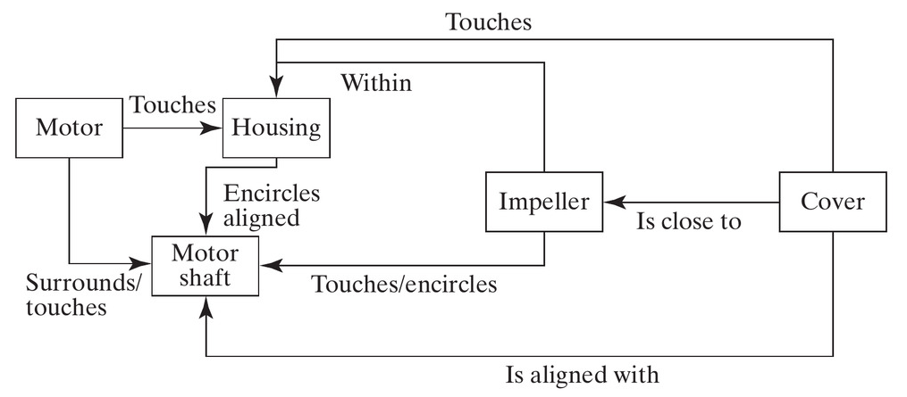
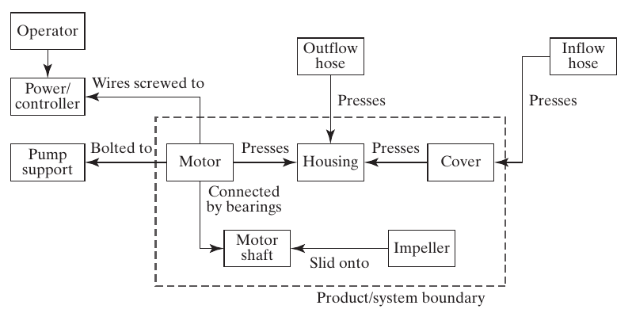

## Starting Part 2: Analysis of System Architecture {.smaller}

- Part 2 applies architectural analysis to progressively larger systems
- We begin with **form**, the most concrete aspect of a system, and work toward function (Ch. 5) and their mapping into architecture (Ch. 6)
- **Reverse engineering** starts with an existing architecture and analyzes it. This prepares us to design new architectures later

::: {.fragment .callout-tip title="Course modeling language"}
This text follows Dov Dori's **Object-Process Methodology (OPM)** throughout, our method for representing architecture.
:::

::: {.notes}
- **How Part 2 differs from Part 1**: Chs. 1-3 built general vocabulary; Chs. 4-8 apply it rigorously to form and function
- Chapter 4 tackles **form first**, deliberately: more concrete, easier to point at, natural starting point before function's abstract character (Ch. 5). Ch. 6 shows how form + function combine into architecture (the mapping between them)
- **Name the strategy**: this is **reverse engineering**: assume architecture exists, analyze it, rather than synthesizing new (Part 3's job, Chs. 9-13)
- Analyzing existing architectures helps students assess design choices before proposing their own.
- Fragment restates the OPM-only policy from Ch. 3: Ch. 4 is where real OPM notation (triangles, boxes, arrows) begins.
:::

## Table 4.1 · Questions for Defining Form {.smaller .form-questions}

| Question | Produces |
|---|---|
| 4a. What is the system? | An object defining the abstraction of form |
| 4b. What are the principal elements of form? | The first- and second-level downward abstractions |
| 4c. What is the formal structure? | Spatial and connectivity relationships among the objects |
| 4d. What are the accompanying systems? What is the whole product system? | Objects essential for delivering value, and their relationships |
| 4e. What are the system boundaries? What are the interfaces? | A clear boundary between system and context |
| 4f. What is the use context? | Objects that are not essential to value, but inform function and design |

::: {.notes}
- **Chapter outline**: every section answers one of these six questions in order; return to this table at each major transition
- Book's framing device: every Part 2 chapter opens with a table like this; this is Chapter 4's version, for form
- **4a** (what is the system?) → single top-level abstraction object: answered first, using the pump
- **4b** (principal elements of form?) → first/second-level decomposition: hierarchic decomposition tools from Ch. 3, applied to form
- **4c** (formal structure?) → spatial and connectivity relationships (Section 4.4)
- **4d/4e** (accompanying systems, whole product system, boundaries, interfaces) → expand outward to context (Section 4.5)
- **4f** (use context) → expand one step further
- By chapter's end, students should answer all six for any system's form, on demand

**Suggested answer:** Worked pump answer: **4a:** the centrifugal-pump product at the chosen boundary. **4b:** pump assembly and motor assembly, then their constituent objects such as impeller, housing, cover, motor, and shaft. **4c:** attachment, containment, alignment, and connection relationships, including shaft–impeller attachment. **4d:** hoses, support, power/controller, and operator; these plus the pump form the whole product system. **4e:** the pump boundary separates those external systems from the supplied product; interfaces include inlet/outlet, mounting, and power connections. **4f:** the surrounding installation and operating environment inform requirements. State the boundary before classifying any item.

:::

## Box 4.1 · Definition: Form {.smaller}

::: {.callout-note appearance="simple" icon=false}
**Form** is the physical or informational embodiment of a system that exists, or has the potential for stable, unconditional existence, for some period of time, and is instrumental in the execution of function. Form includes the entities of form and the formal relationships among the entities. Form exists prior to the execution of function.
:::

- Describe a coffee cup, pencil, or notebook using only form. Names such as "handle" and "eraser" already suggest a function
- Staying entirely in the form domain: "flat cardboard half-circle," "rubber cylinder," "metal spiral"
- Form is what the system **is**. It is *implemented, built, written, composed, manufactured, or assembled*

::: {.notes}
- Explain how the definition applies to both physical and informational systems.
- "**Physical or informational**": deliberately broad, covers software/organizations as well as hardware (why the chapter ends with bubblesort)
- "**Exists... for some period of time**": first test, existence itself; "for some period of time" lets us discuss historical systems (already existed) or designs (will exist) with the same language
- "**Instrumental in the execution of function**": second test, connects form to the rest of the course; not just "stuff that exists," stuff that *enables* something
- "**Exists prior to function**": form comes first, temporally and logically; need the instrument before using it
- Ask students to describe a coffee cup, pencil, or notebook using only shape, material, and structural relationships.
- Book's model examples: "flat cardboard half-circle" (not handle), "rubber cylinder" (not eraser), "metal spiral" (not binding)
- Everyday names often combine form and function. This exercise separates the two descriptions.

**Suggested answer:** Coffee cup: “a hollow ceramic body with an open circular top, a closed base, and a curved ceramic loop attached at two points.” Pencil: “an elongated wooden body surrounding a graphite core, with one tapered end.” Notebook: “a stack of rectangular paper sheets between thicker covers, joined along one edge by a metal spiral.” These describe material, geometry, parts, and relationships. “Holds coffee,” “writes,” and “keeps pages together” introduce functions. Ordinary names such as handle are convenient shorthand, but the exercise asks students to unpack them into formal descriptions.

:::

## Figure 4.1 · Form in Civil Architecture

{width=78% fig-align="center"}

::: {.side-caption}
A beach house: the floor plan (a) and finished result (b) are both representations of the same form. Source: Crawley, Cameron & Selva (2016), Fig. 4.1. © The Sater Design Collection, Inc.
:::

::: {.notes}
- **Make "form" tangible with a familiar civil-architecture example** before anything technical
- Form of the beach house = the spaces themselves (grand room, kitchen, veranda): floor plan and finished photo are the same underlying form, different representational conventions
- Kitchen *exists* (test 1) and *facilitates* food prep/conversation (test 2, instrumental to function): concrete instance of the two-part Box 4.1 definition
- Preview: "form of a building" returns briefly in Ch. 6 (architecture as a mapping)
- For now: form is what the house physically *is*
:::

## Figure 4.2 · Form Can Be Informational

{width=52% fig-align="center"}

::: {.side-caption}
An airline emergency card represents informational form. Its instructions help passengers respond to an emergency. Source: Crawley, Cameron & Selva (2016), Fig. 4.2. © Cabin Safety International Ltd.
:::

::: {.notes}
- **Important conceptual work**: first proof that "form" isn't limited to physical hardware
- The card's information exists and supports the function of instructing passengers. Its physical medium carries that information.
- **Structural detail to remember**: pictures organized in sequence (numbered), groups prefaced by smaller pictures/letters, separated by horizontal rules: sequencing/grouping = *structure* (foreshadows Section 4.4)
- Later connection: this card returns as a metaphor for software form: encoded objects that, when "operated" (read) by a human, are interpreted as instructions leading to function, exactly like pseudocode and a computer
:::

## Box 4.2 · Definition: Object {.smaller}

::: {.callout-note appearance="simple" icon=false}
**An object** is that which has the potential for stable, unconditional existence for some period of time.
:::

- We represent form as objects and the formal relationships (structure) among them
- Objects can be **informational**: anything comprehended intellectually: ideas, thoughts, arguments, instructions, conditions, data
- Objects have **attributes**: physical, electrical, or logical characteristics. Some attributes have **states**: a house's construction attribute goes from "not built" to "built"

::: {.notes}
- **"Object" = basic representational unit for form**: a subtlety the book flags: this definition mirrors only the *first half* of Box 4.1 (the "exists" part), not the second half (instrumental to function, prior to function)
- So: every form is built from objects, but not every object counts as form: one that doesn't meet form's extra criteria is called an *operand* in Chapter 5
- For now: objects = building blocks for form, names are generally nouns
- **Not** the same "object" as object-oriented programming, despite overlapping terminology: explain, many students have programming backgrounds
- **Informational objects** (Dori's definition, OPM's creator): anything comprehended intellectually, implies existence without physical tangibility: ideas, thoughts, arguments, instructions, conditions, data. Control systems, software, math, policy lean heavily on these
- **Attributes and states** (recurs in next slide's figure): objects have attributes (physical/electrical/logical), some have *states*: values that change over the object's existence
- Book's example: beach house's "construction" attribute: not built → built; "occupancy": unoccupied → occupied; "temperature": cooler → warmer. All state values together = the object's overall configuration
:::

## Figure 4.3 · OPM Representations of Objects

{width=68% fig-align="center"}

::: {.side-caption}
Left: a simple object. Center: an object with states shown directly. Right: an object with an explicit attribute (linked by the "is characterized by" double-triangle), which itself has states. Source: Crawley, Cameron & Selva (2016), Fig. 4.3.
:::

::: {.notes}
- **First real graphical notation students reproduce themselves: explain all three**
- **Left**: simplest form, object = plain rectangle, just naming existence
- **Center**: same object, states shown directly as small ovals nested at the bottom: shorthand for "has an attribute, here are its states," used when the attribute name doesn't matter
- **Right**: fullest version: object box connects to a separate "Attribute" box via double-triangle ("is characterized by"), and that box has its own nested state ovals: more verbose, more precise (names the attribute)
- **When to use which**: right-hand form when the attribute *name* matters (e.g. distinguishing "temperature" from "construction"); center form when states alone are self-explanatory
- OPM uses the same box notation for physical and informational objects.
:::

## Decomposition of Form {.smaller}

::: {.columns}
::: {.column width="55%"}
- Form is *concrete*: it decomposes easily, and the aggregation of form traces the decomposition in a simple way
- OPM represents decomposition with a **black triangle**: System 0 *decomposes* into Level 1 objects, which correspondingly *aggregate* into System 0
:::
::: {.column width="45%"}
{width=100%}
:::
:::

::: {.fragment .callout-tip title="Form representation"}
Form will be modeled throughout as **objects of form**, plus the **formal structure** among them.
:::

::: {.notes}
- **Connects back to Ch. 3's decomposition/hierarchy tools**, now with specific graphical notation
- A formal decomposition identifies parts and how they aggregate. Functional analysis, introduced in Chapter 5, examines the behavior of their combination.
- **The filled-black-triangle symbol** (recurs constantly rest of course): solid black triangle between "System 0" and Level 1 elements, point touching System 0: top-to-bottom = "decomposes into," bottom-to-top = "aggregate into." Graphical vocabulary for the decomposition/aggregation relationship from Ch. 2's Table 2.3
- **Core methodological commitment, memorize as a standalone sentence**: form is always modeled as objects of form + the formal structure among them. Rest of the chapter works out what those look like for real systems
:::

## The Centrifugal Pump {.smaller}

::: {.columns}
::: {.column width="55%"}
- Our reference case for analyzing form: a real engineering system, the centrifugal pump
- The turning impeller does work on the fluid; the housing diffuses the flow, converting kinetic energy into pressure
- Chosen because it's **modular**: nine parts, none absolutely discrete (like a team) nor fully integral (like the heart): a "simple system," with atomic parts at Level 1
:::
::: {.column width="45%"}
{width=100%}

::: {.side-caption}
Source: Crawley, Cameron & Selva (2016), Fig. 4.5. Source: PumpBiz.com.
:::
:::
:::

::: {.notes}
- **Chapter's running worked example**: briefly explain the physics first, makes later structural relationships more intuitive
- Centrifugal pump increases fluid energy: flow enters axially through the cover hole, impeller flings it radially outward (does work, raises velocity), housing's passage slows it back down (converts kinetic energy to static pressure). Mass conserved, energy conserved (motor's electrical power → outlet pressure)
- **Why the book picks this example**: middle of the "trivially distinct/modular/integral" spectrum (Ch. 2): not as discrete as Team X, nowhere near as integral as the heart. Nine parts, none hard to pull apart → per Ch. 3's sizing guideline, a "simple system," atomic parts already at Level 1
- The small pump example lets students follow each step of the analysis before applying the method to larger systems.
:::

## Defining the System (Question 4a) {.smaller}

- The procedure: examine the system and create an **abstraction of form** that conveys the important information and implies a boundary
- For the pump, we create the abstraction "**Pump**": surfaces the idea of something that moves fluid, hides all detail of motors and impellers
- We could have chosen "centrifugal pump" instead: a more *specific* abstraction (other pump types include axial-flow and positive-displacement pumps)

::: {.fragment}
This gives us a **specialization** relationship: Pump ← (unfilled triangle) → Centrifugal Pump.
:::

::: {.notes}
- **Start working Table 4.1's six questions: Question 4a**
- General procedure (applies to every system, not just the pump): examine the system, create an abstraction of form conveying important info, implying a boundary consistent with the detailed boundary drawn later (4e)
- For the pump: abstraction "**Pump**": surfaces "moves fluid," hides motor/impeller/housing detail; implicitly boundaries the exploded-view parts vs. hoses/supports/power supply outside
- Not the only choice: could've picked the more specific "centrifugal pump" directly. Other pump types named for contrast: axial-flow, positive-displacement: "Pump" really is a genuine generalization with real specializations
- Fragment names this formally (Ch. 3 vocabulary): Pump = generalization, Centrifugal Pump = one specialization: next slide shows the OPM graphical notation
:::

## Figure 4.6 · Specialization and Decomposition

{width=62% fig-align="center"}

::: {.side-caption}
"Pump" specializes to "Centrifugal pump" (open triangle), which decomposes into its ten elements of form (filled triangle). Source: Crawley, Cameron & Selva (2016), Fig. 4.6.
:::

::: {.notes}
- **Two distinct triangle symbols: confusing them is a common OPM mistake, explain each part**
- Top: "Pump"→"Centrifugal pump" via *unfilled/open* triangle (specialization/generalization, Ch. 3's OPM table): "Centrifugal pump is a specialization of Pump"
- Below: "Centrifugal pump" → ten elements via *filled/solid* triangle (decomposition): "Centrifugal pump decomposes into these ten elements"
- Same tree shape, different meaning by fill: have students trace both aloud to check the distinction
- Flag the count discrepancy: exploded view showed nine labeled parts, this shows ten: "motor" got split into two objects (motor, motor shaft), explained next slide
:::

## Identifying the Entities of Form {.smaller}

- Question 4b: start with a reference **parts list**, then combine or eliminate elements, and use hierarchy to find the most important ones
- The motor has a non-rotating element and a rotating **motor shaft**: different enough functionally that we split it into two objects, even though the parts list says "motor"
- A careful look reveals **five screws**: but we abstracted just one class, "Screw," with five instances

::: {.fragment .callout-tip title="Hierarchy of pump elements"}
Hierarchy can rank the ten elements too: cover/impeller/housing/motor shaft/motor carry the most scope and function; O-ring/seal/water-slinger are mid-rank; screws and locking nut are least important.
:::

::: {.notes}
- **Question 4b: general procedure**: start with a reference parts list, combine/eliminate elements, use hierarchy to find the most important
- Manufacturer's numbered parts list is the natural starting point, but not used unmodified
- **Motor/motor-shaft split** (instructive example of thoughtful abstraction, not blind copying): parts list says "motor," but it has a non-rotating housing and a rotating shaft: different functional roles (some elements connect to the stationary body, others to the spinning shaft). Lumping into one object would hide important detail (violates Ch. 2's "surface important detail" rule) → split into two
- **Screws, the mirror-image lesson**: five separate physical screws, but only one abstraction "Screw": class/instance relationship (Ch. 3) implicitly used: class "Screw," five instances, no architectural value in tracking them separately
- Fragment: hierarchy (Ch. 3) ranks the ten elements: cover/impeller/housing/motor shaft/motor = most scope/function; O-ring/seal/water-slinger = mid; screws/locking nut = least. Basis for the simplified five-element diagrams coming in Section 4.4
:::

## Table 4.2 · Parts List and Elements of Form {.smaller .chapter04-detail}

::: {.parts-table}
| Parts list | Abstractions used to designate elements of form |
|---|---|
| Cover | Cover |
| Screws | Screws (class of 5) |
| O-ring | O-ring |
| Locking nut | Locking nut |
| Impeller | Impeller |
| Seal | Seal |
| Housing | Housing |
| Water slinger | Water slinger |
| Motor | Motor; motor shaft |
:::

Nine parts-list entries become **ten abstractions**: separate the rotating shaft from the non-rotating motor.

::: {.side-caption}
Source: Crawley, Cameron & Selva (2016), Table 4.2, p. 74.
:::

::: {.notes}
- The two abstractions in the motor row preserve the book's separate Motor and Motor shaft entries.
- Ask why five screws appear as one class, but the motor appears as two objects.
- **Suggested answer:** Distinguish elements when their relationships matter: the shaft connects to the impeller, while the motor body supports the housing. The five screws are instances of a common class; model individual screws only when their differences matter.
:::

## Table 4.3 · Hierarchy of Pump Elements {.smaller .chapter04-detail}

| Scope / rank | Elements of form |
|---|---|
| Whole system | Centrifugal pump |
| Highest-priority elements | Cover, impeller, housing, motor shaft, motor |
| Middle rank | O-ring, seal, water slinger |
| Fasteners | Screws (class), locking nut |

- Begin structural analysis with the **five highest-priority elements**.
- Add the remaining elements when their detail is needed.
- This is a ranking for architectural reasoning; it does not make seals or fasteners optional.

::: {.side-caption}
Source: Crawley, Cameron & Selva (2016), Table 4.3, p. 75; explanatory rank labels added.
:::

::: {.notes}
- Cover and housing contain the fluid and provide interfaces; the impeller works on the fluid; the motor drives the shaft and supports the housing; the shaft drives the impeller.
- Distinguish hierarchy of importance from physical containment. The three groups are not three nested assemblies.
- Ask whether a lower-ranked part can still cause system failure. **Suggested answer:** Yes: loss of a seal or fastener can be critical. Ranking guides the order of analysis, not a reliability judgment.
:::


## Figure 4.9 · Managing Complexity in OPM

{width=52% fig-align="center"}

::: {.side-caption}
Everything at once: specialization (Pump → Centrifugal pump), two-level hierarchic decomposition (Pump/Motor assembly), class/instance (Screw → Screw #1), and an attribute with states (Motor shaft → Spinning: yes/no). Source: Crawley, Cameron & Selva (2016), Fig. 4.9.
:::

::: {.notes}
- Ask students to identify each relationship symbol in the diagram and explain its meaning.
- Packs together essentially every OPM relationship type so far
- Top: "Pump" specializes (open triangle) to "Centrifugal pump," as before
- "Centrifugal pump" decomposes (filled triangle) through **two levels**: into "Pump assembly"/"Motor assembly" (pure abstractions, not literal parts: could equally be "rotating"/"non-rotating," no single correct Level-1 grouping, Ch. 3's non-uniqueness point), then further into the ten actual elements at Level 2
- **Two additional relationships at the bottom**: "Screw" → "Screw #1" via class/instance (nested-instance notation, Ch. 3's OPM table): one instance of the five-member class
- "Motor shaft" → attribute "Spinning" → states "Yes"/"No": object/attribute/state notation from Fig. 4.3, applied to a real element
- **Review**: if students can read every relationship in this diagram aloud unprompted, they've mastered the form-side OPM vocabulary so far
:::

## Section 4.2–4.3 Summary {.smaller}

- Analyzing form requires creating an abstraction that conveys the important information without too much detail, and implies a system boundary
- The elements of form can be represented as a hierarchic decomposition: a set of objects representing first- and second-level abstractions
- Level 1 abstractions are **not unique**: the pump assembly / motor assembly split could just as easily have been rotating / non-rotating components

::: {.notes}
- **Review** before shifting from "what are the elements" (4a/4b) to "how are they related" (4c, structure, next: Section 4.4)
- By now students should: create a top-level abstraction of any system's form, decompose hierarchically into first/second-level elements
- Re-emphasize (recurring course theme): Level 1 grouping choice is never the *only* valid one: pump/motor-assembly vs. rotating/non-rotating split are both legitimate abstractions of the same ten elements, chosen for different purposes
:::

# 4.4 Formal Relationships

## Box 4.4 · Definition: Formal Relationships (Structure) {.smaller}

::: {.callout-note appearance="simple" icon=false}
**Formal relationships**, or **structure**, are the relationships between objects of form that have the potential for stable, unconditional existence for some duration of time and may be instrumental in the execution of functional interactions.
:::

- Structure is *not* conveyed by a decomposition diagram alone: a random pile of parts doesn't tell you how to assemble them
- Structure shows *where* the elements of form are located and *how* they are connected
- Formal relationships often **carry** functional interactions: if A supplies power to B, there is likely a connecting wire (the structure)

::: {.notes}
- **Moves to Question 4c**: what is the formal structure?
- Definition deliberately echoes Box 4.1's form definition: structure, like form, is about things that *exist* stably, not things that happen moment to moment
- "May be instrumental in the execution of functional interactions": crucial link forward to Ch. 6: structure often exists specifically to enable something functional
- A parts list identifies the constituents. Assembly also requires structural information about their locations and connections.
- Decomposition tells you the *parts*, structure tells you how they *fit together*
- Formal relationships frequently *carry* functional interactions (Ch. 5's subject): A supplies power to B → probably a wire connecting them, that wire is structure, power flow is the function it enables: Ch. 2's "Formal Enables Functional" idea, now named and about to be broken into types
:::

## Two Kinds of Structural Relationship {.smaller}

::: {.columns}
::: {.column width="50%"}
**Spatial / topological**

Where things *are*: location or placement: above/below, near/far, within, adjacent to, encircling. Implies only placement, not the ability to transmit anything.
:::
::: {.column width="50%"}
**Connectivity**

What is connected, linked, or joined to what. Explicitly creates the ability to transfer or exchange something between objects: a wire, a shared address, a bearing.
:::
:::

::: {.fragment .callout-tip title="Architectural relevance test"}
The key question for either type: *"Is this relationship key to some important functional interaction, or to the successful emergence of function and performance?"*
:::

::: {.notes}
- **Two main structural-relationship categories**: distinction is subtle in physical systems
- **Spatial/topological**: *where things are*, relative location/placement: above, below, near, far, within, adjacent, encircling. Says nothing about transmit/exchange ability: objects can touch without functional coupling
- "Spatial" (absolute/relative location, coordinate system) vs. "topological" (within, surrounded by, adjacent) are subtly distinct, but book treats as one combined category
- **Connectivity**: explicitly *what's connected/linked/joined*: creates transfer/exchange ability (wire for current, shared memory address, a bearing transmitting rotational force)
- **Discriminating example**: two houses can be spatially adjacent without being connected (no shared plumbing/wiring); a computer and remote server can be connected (network) with unspecified relative location
- **Practical filter** (echoes Ch. 2's "focus" principle): every pair has *some* spatial relationship (too much info to be useful): the real question, pairwise: is this relationship key to an important functional interaction or to function/performance emergence? If not, leave it out

**Suggested answer:** Include a relationship when changing it can alter an important interaction or requirement. Shaft–impeller attachment matters because it permits torque transfer; the clearance between impeller and housing matters because it affects motion and fluid behavior. The pump's distance from an unrelated decorative object can be omitted unless access, safety, or another relevant requirement makes it consequential. “Near” alone does not establish a connection, and a connection alone does not prove that a transfer actually occurs.

:::

## Figure 4.13 · OPM Structure Notation

{width=62% fig-align="center"}

::: {.side-caption}
A binary link, drawn as a single-headed arrow with a label: "the housing surrounds the impeller." The direction of the arrow is arbitrary: it implies no exchange, interaction, or causality, just a relationship that exists. Source: Crawley, Cameron & Selva (2016), Fig. 4.13.
:::

::: {.notes}
- **Graphical convention for every structural diagram from here forward**: single-headed arrow, one object to another, plain-language label
- Pump example: housing surrounds the impeller without touching → arrow Housing→Impeller, labeled "Surrounds"
- The arrow and its label describe an existing relationship. Read them together to determine the meaning.
- Reversing Housing to Impeller, labeled "Surrounds," requires the inverse label "Is within." The two readings express the same relationship. "Aligned with" uses the same label in either direction.
- Important contrast to flag now: in Ch. 5, functional relationship direction *will* matter (a process acts on an operand in a specific direction): watch for that contrast later
:::

## Figure 4.14 · Spatial Structure of the Pump

{width=68% fig-align="center"}

::: {.side-caption}
The five key elements from the hierarchy, connected by their important spatial/topological relationships. Source: Crawley, Cameron & Selva (2016), Fig. 4.14.
:::

::: {.notes}
- **Payoff of the "pairwise, ask if it matters" procedure**: restricted to the five top-priority elements (cover, impeller, housing, motor, motor shaft), lower-ranked parts left out
- Trace a few aloud: cover touches housing, aligned with motor shaft; cover also close to impeller (not visually obvious, but matters functionally: pump fails with a gap between impeller and cover): good example of the "is this relationship key to function" filter surfacing something non-obvious
- Use the OPM diagram to identify the spatial relationships needed for the pump to function.
:::

## The Design Structure Matrix (DSM) {.smaller}

::: {.callout-note appearance="simple" icon=false}
**DSM**: an N-squared matrix used to map the connections between one element of a system and the others. Read down the column to the relationship at the row heading.
:::

- The DSM contains the *same information* as the graphical OPM view: just tabulated instead of drawn
- Graphical views are easier to develop and visualize; matrix views handle complexity without visual clutter, and are easier to compute on
- We'll use both throughout this course

::: {.notes}
- **DSM = tabular counterpart to graphical OPM diagrams**, connects back to Ch. 2's N-Squared tables
- Acronym: **D**esign **S**tructure **M**atrix generally (also seen as Decision/Dependency Structure Matrix): N×N matrix; reading convention: read *down the column* to the relationship *at the row heading*: flows column→row
- Same info as an OPM diagram, just represented differently: five-element pump DSM shows the same "touches"/"aligned with"/"close to" relationships as Fig. 4.14, as cells instead of arrows
- Structural DSMs are symmetric except when forward/backward labels use different words (e.g. "slid onto" vs. "had slid onto"): structure just *exists*, no direction/causality
- **Tradeoff, use both all course**: graphical easier to develop/visualize for small systems but clutters fast; matrix scales without clutter and is easier to compute on (sort/cluster/search): choice depends on system size and human-vs-computer use
:::

## Table 4.5 · Spatial / Topological Pump DSM {.smaller .chapter04-detail}

Read **column → cell → row**. X marks self; a blank means no relationship is recorded.

<div class="pump-dsm"><table><thead><tr><th scope="col">Object list</th>
<th scope="col">Cover</th>
<th scope="col">Impeller</th>
<th scope="col">Housing</th>
<th scope="col">Motor</th>
<th scope="col">Motor shaft</th>
</tr></thead><tbody>
<tr><th scope="row">Cover</th>
<td>X</td>
<td>Close to</td>
<td>Touch</td>
<td></td>
<td>Aligned with</td>
</tr>
<tr><th scope="row">Impeller</th>
<td>Close to</td>
<td>X</td>
<td>Surrounds</td>
<td></td>
<td>Touch / is encircled by</td>
</tr>
<tr><th scope="row">Housing</th>
<td>Touch</td>
<td>Within</td>
<td>X</td>
<td>Touch</td>
<td>Is encircled by / aligned</td>
</tr>
<tr><th scope="row">Motor</th>
<td></td>
<td></td>
<td>Touch</td>
<td>X</td>
<td>Within / touches</td>
</tr>
<tr><th scope="row">Motor shaft</th>
<td>Aligned with</td>
<td>Touch / encircles</td>
<td>Encircles / aligned</td>
<td>Surrounds / touches</td>
<td>X</td>
</tr>
</tbody></table></div>
Column **Housing**, row **Impeller**: “Housing surrounds impeller.” Reverse: “Impeller is within housing.”

::: {.side-caption}
Source: Crawley, Cameron & Selva (2016), Table 4.5, p. 85; same relationships as Fig. 4.14.
:::

::: {.notes}
- Read from the column heading down to the selected cell, then to the row heading. Do not read these labels as row-to-column.
- Cover and impeller are close; cover and shaft are aligned. Neither entry establishes a mechanical connection.
- The off-diagonal pattern is symmetric, but inverse labels differ. “Surrounds” and “within” express the same relationship viewed in opposite directions.
- Ask students to translate a second link from Figure 4.14 into both DSM cells. **Suggested answer:** Housing encircles/is aligned with shaft; shaft is encircled by/is aligned with housing.
:::

## Connectivity Relationships {.smaller .chapter04-detail}

- Ask **what is connected, linked, or joined to what** and how that connection is implemented.
- A connection enables an interaction; it does not mean energy, material, or information is currently being exchanged.
- Examples: a press fit, bearings, a wire, or a shared software address.
- Model each relevant pair. Abstract away connectors when appropriate; retain them when interface detail matters.

::: {.callout-tip title="Placement and connection"}
Two objects can be adjacent without being connected. A computer and a remote server can be connected without specifying their relative location.
:::

::: {.side-caption}
Source: Crawley, Cameron & Selva (2016), Section 4.4, pp. 85–87.
:::

::: {.notes}
- Connectivity records existing structure, including the result of assembly or implementation.
- In the simplified pump, screws are abstracted away; “presses” represents the cover–housing connection they maintain. Bearings are named because they characterize the motor–shaft connection.
- A connection can remain when the pump is off. Flow and torque during operation belong to functional analysis.
- Not every functional interaction needs an explicit material connector: radiation, gravity, and a fluid jet are examples. Do not turn “formal enables functional” into a universal requirement for a drawn connection.
:::

## Figure 4.16 · Connectivity Structure of the Pump {.chapter04-detail}

{width=82% fig-align="center" fig-alt="Five pump objects joined by presses, bearings, and a slid-onto connection."}

::: {.side-caption}
Four pairwise connections among the five principal elements. The labels describe how the parts are joined, not a flow direction. Source: Crawley, Cameron & Selva (2016), Fig. 4.16, p. 87.
:::

::: {.notes}
- Trace each pair: cover–housing presses; motor–housing presses; motor–shaft connected by bearings; impeller slid onto shaft.
- Screws maintaining the pressing connection are omitted at this abstraction level.
- “Slid onto” describes the assembled relation. The arrow does not depict the impeller moving during pump operation.
- Compare the next slide with Figure 4.14 before moving to the matrix.
:::

## Figures 4.14 and 4.16 · Comparison {.smaller .chapter04-detail}

::: {.columns}
::: {.column width="50%"}
**Fig. 4.14: spatial / topological**

{width=100% fig-alt="Spatial and topological pump relationships."}

Eight pairs: touching, proximity, containment, encircling, alignment.
:::
::: {.column width="50%"}
**Fig. 4.16: connectivity**

{width=100% fig-alt="Mechanical pump connections."}

Four pairs: pressing, bearing support, shaft–impeller fit.
:::
:::

- **Touches → presses:** the connection also conveys the ability to transmit load.
- **Within, close to, aligned with:** these do not by themselves establish a connection.

::: {.side-caption}
Source: Crawley, Cameron & Selva (2016), Figs. 4.14 and 4.16, pp. 82 and 87.
:::

::: {.notes}
- Ask which four spatial relationships remain as connectivity relationships: cover–housing, housing–motor, motor–shaft, shaft–impeller.
- **Suggested answer:** Cover–impeller proximity, cover–shaft alignment, housing–impeller containment, and housing–shaft encircling/alignment do not appear as connections in the simplified model.
- Figure 4.14 has eight distinct off-diagonal pairs, Figure 4.16 has four; count each pair once, rather than counting both directions or each label separately.
- Touching records location; pressing describes a load-transmitting connection. Spatial and connectivity views overlap in this mechanical example, but answer different questions.
:::

## Table 4.6 · Connectivity Pump DSM {.smaller .chapter04-detail}

<div class="pump-dsm"><table><thead><tr><th scope="col">Object list</th>
<th scope="col">Cover</th>
<th scope="col">Impeller</th>
<th scope="col">Housing</th>
<th scope="col">Motor</th>
<th scope="col">Motor shaft</th>
</tr></thead><tbody>
<tr><th scope="row">Cover</th>
<td>X</td>
<td></td>
<td>Presses</td>
<td></td>
<td></td>
</tr>
<tr><th scope="row">Impeller</th>
<td></td>
<td>X</td>
<td></td>
<td></td>
<td>Had slid onto</td>
</tr>
<tr><th scope="row">Housing</th>
<td>Presses</td>
<td></td>
<td>X</td>
<td>Presses</td>
<td></td>
</tr>
<tr><th scope="row">Motor</th>
<td></td>
<td></td>
<td>Presses</td>
<td>X</td>
<td>Connected by bearings</td>
</tr>
<tr><th scope="row">Motor shaft</th>
<td></td>
<td>Slid onto</td>
<td></td>
<td>Connected by bearings</td>
<td>X</td>
</tr>
</tbody></table></div>
Column **Impeller**, row **Motor shaft**: “Impeller slid onto motor shaft.” The reverse cell uses the book's “Had slid onto.”

::: {.side-caption}
Source: Crawley, Cameron & Selva (2016), Table 4.6, p. 87; same relationships as Fig. 4.16.
:::

::: {.notes}
- Blank cells deliberately omit pure alignment, containment, and proximity.
- The book's reverse phrase “Had slid onto” is awkward: explain it as “shaft has the impeller slid onto it.” Preserve the table's label while clarifying its meaning.
- The existence of each connection is reciprocal; inverse wording does not imply a directed transfer.
- Ask whether the DSM changes when the motor is switched off. **Suggested answer:** No: the same mechanical connections exist; their current functional activity changes.
:::

## Table 4.7 · Combined Pump Structure {.smaller .chapter04-detail}

**S** = spatial/topological relationship; **C** = connectivity relationship.

<div class="pump-dsm"><table><thead><tr><th scope="col">Object list</th>
<th scope="col">Cover</th>
<th scope="col">Impeller</th>
<th scope="col">Housing</th>
<th scope="col">Motor</th>
<th scope="col">Motor shaft</th>
</tr></thead><tbody>
<tr><th scope="row">Cover</th>
<td>X</td>
<td>S</td>
<td>SC</td>
<td></td>
<td>S</td>
</tr>
<tr><th scope="row">Impeller</th>
<td>S</td>
<td>X</td>
<td>S</td>
<td></td>
<td>SC</td>
</tr>
<tr><th scope="row">Housing</th>
<td>SC</td>
<td>S</td>
<td>X</td>
<td>SC</td>
<td>S</td>
</tr>
<tr><th scope="row">Motor</th>
<td></td>
<td></td>
<td>SC</td>
<td>X</td>
<td>SC</td>
</tr>
<tr><th scope="row">Motor shaft</th>
<td>S</td>
<td>SC</td>
<td>S</td>
<td>SC</td>
<td>X</td>
</tr>
</tbody></table></div>
- **SC:** cover–housing has both placement and connection.
- **S only:** cover–shaft alignment matters without a direct connection.
- The combined DSM shows existence; Tables 4.5 and 4.6 retain the relationship details.

::: {.side-caption}
Source: Crawley, Cameron & Selva (2016), Table 4.7, p. 88.
:::

::: {.notes}
- Each populated pair in Table 4.6 also appears in Table 4.5, so this particular mechanical example has no C-only cells.
- Do not generalize that observation to every system: software connectivity and topology can differ substantially.
- **Discussion:** What is lost by replacing “presses” and “touches” with SC? **Suggested answer:** The existence of both kinds remains, but the nature of the connection and geometry is hidden; consult the detailed views for implementation or interface decisions.
:::


## Other Formal Relationships {.smaller}

Beyond spatial/topological and connectivity, several other relationship types simply *exist*:

- **Address**: where something can be found (a memory address, a mailing address)
- **Sequence**: a static ordering (statement 2 is always after statement 1 in the code)
- **Membership**: being part of a group or class
- **Ownership**: a static relationship between an owner and the owned
- **Human relationships**: trust, liking, bonds between people (uniquely, not always reciprocal)

::: {.fragment .callout-tip title="Static does not mean permanent"}
All formal relationships are static at any instant: but they *can* change: connections made and broken, addresses reassigned, membership revoked.
:::

::: {.notes}
- **Round out the catalog beyond spatial/topological and connectivity**: less central to the pump, matter a lot in software/organizational systems
- **Address**: where something *is*, encoded: specialized encoded spatial relationship, common in software (memory addresses, registers)
- **Sequence**: static ordering: statement 2 after statement 1 in code holds regardless of execution. Subtlety: in *imperative* languages, written-order implies execution-order; not necessarily true in *declarative* languages. What's always true (any paradigm): the purely structural fact "2 follows 1 in the written code": a formal claim, distinct from the functional execution-order claim
- **Membership**: part of a group/class: "A is a member of Group 1" may or may not imply interaction/responsibility (resembles but isn't identical to Ch. 3's class/instance)
- **Ownership** relates an owner to an object. Ask what distinguishes a person's land from a neighboring parcel, even when no physical boundary is visible.
- **Human relationships** can be asymmetric: someone can trust a public figure who has never met them.
- These relationships describe a state at a particular instant. Locations, connections, addresses, membership, ownership, and human relationships can all change.

**Suggested answer:** The conceptual answer is the ownership relation between a person and a defined parcel, rather than a visible difference in the soil. A fence or boundary marker may represent that distinction, but the architectural model can record the owner–parcel relationship even without a physical barrier. A transaction changes that relation; once established, it is a state that exists at a given time. Keep this as an example of intangible structure rather than a discussion of particular property-law rules.

:::

## Section 4.4 Summary {.smaller}

- Form consists of objects and **structure**: the formal relationships among them. Both must be considered in analysis.
- Three broad types of formal relationship: **connection** (carries functional interaction), **location/placement**, and **intangible** (membership, ownership, human bonds)
- Formal relationships inform and influence the nature of functional interaction and the emergence of function and performance
- Formal relationships are static in that they *exist*: although they can be changed

::: {.notes}
- **Review closing Section 4.4**, before moving outward to context (4.5)
- **Book's cleaner three-way taxonomy**: connection-type (creates the channel for functional interaction: connectivity), location/placement-type (spatial/topological, address, sequence: literal or encoded), intangible (membership, ownership, human bonds: no physical channel)
- Two conclusions: formal relationships inform/influence what functional interactions are possible and how function/performance emerge (link to Chs. 5-6); and formal relationships are about existence, not occurrence: they simply *are*, though they can and do change over time
:::

# 4.5 Formal Context

## Accompanying Systems and the Whole Product System {.smaller}

- Another application of **holistic thinking**: take an increasingly broad view of the system and its context
- The **accompanying systems**: objects not part of the product/system, but *essential* for it to deliver value
- The sum of the product/system and its accompanying systems is the **whole product system**

::: {.fragment .callout-tip title="Pump accompanying systems"}
For the pump: the inflow and outflow hoses, the pump support structure, and the power/controller are all accompanying systems: without them, the pump delivers no value.
:::

::: {.notes}
- **Addresses Questions 4d and 4e together**: another application of the Principle of Holism (Ch. 2), now applied to form, expanding outward one deliberate step
- Procedure: look at objects near/connected to the system, ask "essential to delivering product/system value?" If yes → accompanying system, create an abstraction, identify structure connecting it, same as for internal elements
- **Accompanying systems**: objects *not* part of the product/system but *essential* for it to deliver value: must be present, connected, working
- **Whole product system** = product/system + its accompanying systems
- Pump: the ten elements alone deliver zero value (a pump on a shelf does nothing): need inflow/outflow hoses, pump support, power/controller. None are part of the pump, but without them, zero value → that's what makes them accompanying systems, not mere context

**Suggested answer:** Apply the test relative to the intended operating mode: remove the external power source and this electrically driven pump cannot run; remove a required hose or support and the installation cannot deliver the intended service. These are accompanying systems. A nearby object that is not essential may belong to use context, although it can still affect requirements such as access or noise. Essentiality is not universal: a redesigned pump with integrated power or different connections would shift the boundary and classification.

:::

## Figure 4.17 · The Pump Whole Product System

{width=80% fig-align="center"}

::: {.side-caption}
The dashed line is the product/system boundary. Including the operator reminds the architect to consider human interaction with the system. Source: Crawley, Cameron & Selva (2016), Fig. 4.17.
:::

::: {.notes}
- **Example of the previous slide**: pump's whole product system = six elements: the pump itself (dashed border = product/system boundary) plus five accompanying systems: inflow hose, outflow hose, pump support, power/controller, and an **operator**
- **Why include the operator**: deliberate choice: value delivery usually requires a human in the loop; good practice to include the operator explicitly, reminds the architect not to neglect human interaction (easy to overlook if hardware-focused)
- This decomposition view enumerates what accompanying systems *are*, but shows no structural info (no connections/spatial relationships)
- That gap is filled by redrawing as a connectivity diagram (Fig. 4.18 in the book), showing physical links and where boundary crossings/interfaces occur. Drawing the boundary clearly (dashed line) is good practice generally: reduces ambiguity, makes every interface explicit
:::

## Figure 4.18 · Connections Across the Pump Boundary {.chapter04-detail}

{width=82% fig-align="center" fig-alt="Pump whole product system with a dashed boundary around the five pump objects and connections to hoses, support, and power/controller."}

::: {.side-caption}
Figure 4.17 lists the accompanying systems. Figure 4.18 shows how they connect and where interfaces cross the product boundary. Source: Crawley, Cameron & Selva (2016), Fig. 4.18, p. 90.
:::

::: {.notes}
- Trace four physical boundary crossings: inlet hose–cover, outlet hose–housing, pump support–motor, and power/controller–motor.
- The operator connects to the controller outside the pump boundary. The figure does not draw an operator–pump connection.
- Internal connections from Fig. 4.16 are retained inside the dashed boundary.
- Ask which interfaces the pump supplier must specify even if accompanying systems are supplied by other organizations. Continue with the following discussion slide.
:::

## Discuss Figure 4.18 · Interface Responsibilities {.smaller .chapter04-detail}

| Boundary crossing | Details to agree across the interface |
|---|---|
| Inflow hose ↔ cover | Fit, sealing, allowable pressure |
| Outflow hose ↔ housing | Fit, sealing, allowable pressure |
| Pump support ↔ motor | Mounting pattern, loads, alignment |
| Power/controller ↔ motor | Terminals, electrical supply, control compatibility |

**Discuss:** A third-party inlet hose leaks at the cover. Is it enough to say “the hose is outside our system boundary”?

::: {.side-caption}
Source: Crawley, Cameron & Selva (2016), discussion based on Fig. 4.18 and Section 4.5, pp. 90–91; interface details are teaching examples.
:::

::: {.notes}
- **Suggested answer:** No. The pump supplier may control only the pump, but delivering value depends on a compatible hose–cover interface. Define and verify mating geometry, seal, pressure limits, and responsibility for integration.
- Distinguish responsibility for an external component from responsibility for specifying its interface to the pump.
- The operator's control interaction is still important even though its connection lies outside the pump boundary.
- A decomposition tree does not expose these crossings; a connectivity view with an explicit system boundary does.
:::


## The Use Context {.smaller}

- One more step outward: the **use context**: objects normally present when the system operates, but *not necessary* for it to deliver value
- Use context informs the **function** of the product/system: it gives place to the system and informs its design
- Even though the architect is only *responsible* for the product/system, they will likely be held *accountable* for the function of the whole product system regardless

::: {.fragment .callout-important appearance="minimal" icon=false}
It's important to understand about two levels down in decomposition: and about two levels *out* in context: the whole product system and the use context.
:::

::: {.notes}
- **Question 4f, last/outermost: distinct from accompanying systems, make the distinction explicit**
- Accompanying systems = *essential* for value delivery. **Use context** = one step further out: objects normally *present* but not strictly necessary for value
- Use context matters differently: informs the *function* of the system (preview Ch. 5), gives it place, informs good design: even though removing it wouldn't stop the system working
- The drawings do not specify the pump's use context. Compare possible applications, such as an industrial saltwater sump or a dishwasher, and discuss how requirements would differ.
- Users may hold the pump supplier accountable for problems with the whole product system, such as a poorly fitting third-party hose, even when the supplier controls only the pump.
- **Clean rule of thumb** (mirrors Ch. 3's decomposition-depth guidance): understand ~two levels *down* into decomposition, and ~two levels *out* into context: whole product system (one out), use context (two out)
:::

# 4.6 Form in Software Systems

## The Bubblesort Algorithm {.smaller}

We review the same procedure on a software system: **bubblesort**, which sorts an array by successively swapping adjacent out-of-order entries.

```
1  Procedure bubblesort (List array, number length_of_array)
2      for i = 1 to length_of_array - 1
3          for j = 1 to length_of_array - i
4              if array[j] > array[j+1] then
5                  temporary = array[j+1]
6                  array[j+1] = array[j]
7                  array[j] = temporary
8              end if
9          end of j loop
10     end of i loop
11     return array
12 End procedure
```

::: {.notes}
- **Launches the chapter's second running example: why include it**: everything so far has been physical (the pump); this section tests whether the same six-question procedure works on a purely informational system
- Bubblesort provides a small informational example in which students can follow the same six questions used for the pump.
- **What bubblesort does**: sorts an array by repeatedly comparing adjacent entries and swapping if out of order, sweeping repeatedly: "bubble" because larger values gradually bubble toward the end
- Nested loop structure (outer `i`, inner `j`, conditional swap) is the whole procedure: we return to specific line numbers repeatedly, make sure students can follow control flow before moving on
:::

## Bubblesort · Video and Trace {.smaller .chapter04-detail}

<iframe data-src="https://www.youtube.com/embed/8UzMlK4TJ08" width="900" height="440" title="Bubblesort explanation video" frameborder="0" allow="accelerometer; clipboard-write; encrypted-media; gyroscope; picture-in-picture; web-share" referrerpolicy="strict-origin-when-cross-origin" allowfullscreen></iframe>

[Open the video on YouTube](https://youtu.be/8UzMlK4TJ08)

Trace one left-to-right pass on **[4, 2, 3, 1]**. Which statements compare entries, and which perform a swap?

::: {.notes}
- Play the user-selected video to establish the sorting behavior before analyzing the code's structure. Use the direct link if embedding is unavailable.
- **Suggested answer:** [4,2,3,1] → [2,4,3,1] → [2,3,4,1] → [2,3,1,4]. The largest entry reaches the last position in the first pass.
- In the book's pseudocode, line 4 compares adjacent entries; lines 5–7 swap them using temporary storage. Loops 2/10 and 3/9 organize repeated passes.
- Sorting is function; the written instructions and their relationships are form. Use the book's line numbers for the following tables, regardless of notation in the video.
- Video supplied by the instructor: https://youtu.be/8UzMlK4TJ08.
:::


## What Is the "Object" in Software? {.smaller}

- Question 4a: the system is the pseudocode itself: but what is the *object of form*?
- Box 4.1: form "exists... is instrumental in the execution of function... and exists prior to the execution of function"
- The code **is** the form: it exists, it's implemented (written), and when *operated* (executed), it's interpreted as instructions that lead to function
- The emergency instruction card (Figure 4.2) is a metaphor: a set of objects that, when "operated" by a human reader, are interpreted as instructions

::: {.notes}
- Apply Question 4a to identify the software's object of form.
- What the system *is* = easy, it's the pseudocode. Harder: what's the *object of form*? Warn: not the OOP sense of "object," despite overlapping terminology
- **Re-apply Box 4.1**: form exists, is instrumental to function, exists prior to function. Applied to software: the code itself *is* the form: exists as written text, "implemented" by being written, and when *operated* (executed) is interpreted as instructions leading to function (a sorted array)
- Source code is informational form. A computer interprets or compiles it to perform the specified operations.
- Reconnect to Figure 4.2 (emergency card): a set of objects that exist, are implemented (printed), and when "operated" by a human reader lead to function: software works the same way, processor instead of human eye

**Suggested answer:** The encoded instructions are informational form: they exist before execution and enable the sorting process when interpreted or executed in a suitable environment. Sorting is the process; the array is the operand whose ordering changes. The processor and runtime provide accompanying physical and software resources. “Object” here means an entity of form, not necessarily an object instantiated from an object-oriented programming class.

:::

## Box 4.7 · Principle of Dualism {.smaller}

::: {.callout-note appearance="simple" icon=false}
*"Dualism in philosophy, mind/body, free will/determinism, idealism/materialism appear as contradictory only because of underdeveloped formulation of the concepts involved."*: Hegel's dialectic, *Science of Logic* (1812–1816)
:::

- All built systems inherently and simultaneously exist in the **physical** and the **informational** domain
- "Information systems" are just abstractions of physical objects that store and process information
- Poems are in print; thoughts are encoded in neural patterns; images are pixels: informational form must always be encoded in **some** physical form

::: {.notes}
- **Explanation of the previous slide**: read the Hegel quote slowly; apparent contradictions between paired concepts dissolve once formulated more carefully, exactly what this principle does for form
- Built systems have physical and informational aspects. The model selects the aspect relevant to the question.
- "Information systems" aren't a different category from physical systems: abstractions of physical objects organized around storing/processing information (charges in memory, ink on a page, pits on a disc)
- **Examples across substrates**: poems (words/meaning, encoded in print); thoughts (ideas, encoded in neural firing); a DVD movie (frames, encoded as optical markings); digital images (a picture, encoded as pixel values)
- **Conclusion**: informational form must *always* be encoded in some physical form: no such thing as pure disembodied information. Justifies why bubblesort's code, pure information, is legitimately "form" on the same footing as the pump's steel parts
:::

## Structure in Software {.smaller}

- Question 4b: the principal elements of form are the **lines of pseudocode**: decomposing further (e.g., into individual characters) adds no useful architectural information
- Question 4c: **sequence** describes the ordering of statements, and **containment** describes their nesting within blocks and loops. Together they help specify execution order

::: {.notes}
- Apply Questions 4b and 4c to identify the elements and structural relationships in bubblesort.
- **4b**: elements of form = individual lines of pseudocode. Could abstract coarser (procedure/if-block/j-loop/i-loop as four elements), but decomposing further (to characters) adds nothing: past the atomic-part threshold (Ch. 3's "loses meaning when taken apart" rule)
- **4c, observation**: software spatial/topological relationships are more abstract than physical: no literal geometry; structure shows up via indentation, conventions, syntax
- Most important spatial/topological relationship in imperative languages: **sequence** (which lines execute before which)
- Second: **containment**: what's nested within what (swap logic, lines 5-7, contained within the `if`, itself within the `j` loop)
- Sequence and containment are *structural* claims about static written code, distinct from (though related to) the *functional* claim about runtime execution order: next figure makes this explicit
:::

## Figure 4.20 · Structure of Bubblesort

{width=58% fig-align="center"}

::: {.side-caption}
The "precedes" relationship informs transfer of control; "contains" informs what executes conditionally. Source: Crawley, Cameron & Selva (2016), Fig. 4.20.
:::

::: {.notes}
- **Diagram of sequence/containment**: same single-headed-arrow OPM notation as Fig. 4.13, applied to lines of code
- `if` block "contains" the three swap lines; within that block, each line "precedes" the next
- **What each relationship tells us functionally**: "precedes" (sequence) = transfer of control at execution (line 5 before 6 before 7); "contains" = which lines execute only *conditionally* (swap only runs if the `if` condition is true)
- Continue to Table 4.8 on the next slide: full DSM of this structure using F=follows, P=precedes, W=within, C=contains, extended across the whole bubblesort procedure
:::

## Table 4.8 · Bubblesort Topology DSM {.smaller .chapter04-detail}

**F** = follows · **P** = precedes · **W** = within · **C** = contains

<div class="software-dsm"><table><thead><tr><th scope="col">Object list</th>
<th scope="col">1</th>
<th scope="col">2/10</th>
<th scope="col">3/9</th>
<th scope="col">4/8</th>
<th scope="col">5</th>
<th scope="col">6</th>
<th scope="col">7</th>
<th scope="col">11</th>
<th scope="col">12</th>
<th scope="col" class="outside">Calling<br>routine</th>
<th scope="col">Compiler</th>
</tr></thead><tbody>
<tr><th scope="row">1</th>
<td>X</td>
<td>F</td>
<td></td>
<td></td>
<td></td>
<td></td>
<td></td>
<td></td>
<td></td>
<td class="outside"></td>
<td></td>
</tr>
<tr><th scope="row">2/10</th>
<td>P</td>
<td>X</td>
<td>FW</td>
<td>W</td>
<td>W</td>
<td>W</td>
<td>W</td>
<td></td>
<td></td>
<td class="outside"></td>
<td></td>
</tr>
<tr><th scope="row">3/9</th>
<td></td>
<td>PC</td>
<td>X</td>
<td>FW</td>
<td>W</td>
<td>W</td>
<td>W</td>
<td></td>
<td></td>
<td class="outside"></td>
<td></td>
</tr>
<tr><th scope="row">4/8</th>
<td></td>
<td>C</td>
<td>PC</td>
<td class="swap-block">X</td>
<td class="swap-block">FW</td>
<td class="swap-block">W</td>
<td class="swap-block">W</td>
<td></td>
<td></td>
<td class="outside"></td>
<td></td>
</tr>
<tr><th scope="row">5</th>
<td></td>
<td>C</td>
<td>C</td>
<td class="swap-block">PC</td>
<td class="swap-block">X</td>
<td class="swap-block">F</td>
<td class="swap-block"></td>
<td></td>
<td></td>
<td class="outside"></td>
<td></td>
</tr>
<tr><th scope="row">6</th>
<td></td>
<td>C</td>
<td>C</td>
<td class="swap-block">C</td>
<td class="swap-block">P</td>
<td class="swap-block">X</td>
<td class="swap-block">F</td>
<td></td>
<td></td>
<td class="outside"></td>
<td></td>
</tr>
<tr><th scope="row">7</th>
<td></td>
<td>C</td>
<td>C</td>
<td class="swap-block">C</td>
<td class="swap-block"></td>
<td class="swap-block">P</td>
<td class="swap-block">X</td>
<td>F</td>
<td></td>
<td class="outside"></td>
<td></td>
</tr>
<tr><th scope="row">11</th>
<td></td>
<td></td>
<td></td>
<td></td>
<td></td>
<td></td>
<td>P</td>
<td>X</td>
<td>F</td>
<td class="outside"></td>
<td></td>
</tr>
<tr><th scope="row">12</th>
<td></td>
<td></td>
<td></td>
<td></td>
<td></td>
<td></td>
<td></td>
<td>P</td>
<td>X</td>
<td class="outside"></td>
<td></td>
</tr>
<tr class="outside"><th scope="row">Calling<br>routine</th>
<td></td>
<td></td>
<td></td>
<td></td>
<td></td>
<td></td>
<td></td>
<td></td>
<td></td>
<td class="outside"></td>
<td></td>
</tr>
<tr><th scope="row">Compiler</th>
<td></td>
<td></td>
<td></td>
<td></td>
<td></td>
<td></td>
<td></td>
<td></td>
<td></td>
<td class="outside"></td>
<td></td>
</tr>
</tbody></table></div>
**Column → row.** Shading: Fig. 4.20 subset. Dashed rules: system boundary.

::: {.side-caption}
Source: Crawley, Cameron & Selva (2016), Table 4.8, p. 94; all cells retained.
:::

::: {.notes}
- Retain the book's choice of separate procedure opening (1) and closing (12) in this table. Table 4.9 groups them as 1/12; the two matrices therefore have different dimensions.
- A blank is no relationship recorded, not a missing value. External rows/columns are intentionally blank, including their diagonal cells.
- The shaded submatrix is 4/8, 5, 6, 7: exactly the conditional and swap statements represented in Fig. 4.20.
- X marks internal self-relations excluded from analysis. Explain the column-to-row convention before decoding FW or PC.
:::

## Reading Table 4.8 {.smaller .chapter04-detail}

- Column **5**, row **4/8** is **FW**: line 5 *follows* and is *within* the conditional block.
- Column **4/8**, row **5** is **PC**: the block *precedes* and *contains* line 5.
- Column **5**, row **6** is **P**: line 5 precedes line 6.
- Blank external rows/columns: no spatial/topological relation to the **calling routine** or **compiler** is represented here.

**Discuss:** Does containment in the `if` block mean lines 5–7 execute on every comparison?

::: {.notes}
- **Suggested answer:** No. Lines 5–7 are structurally contained in the conditional block but execute only when array[j] > array[j+1]. Structure informs control flow; it is not a runtime trace.
- The labels denote static sequence and containment in the book's abstraction, not every possible jump during loop execution.
- Ask students to identify why swapping lines 5 and 6 changes the algorithm. The temporary copy must preserve array[j+1] before that value is overwritten.
- Source: Crawley, Cameron & Selva (2016), Table 4.8 and Fig. 4.19, pp. 92–94.
:::

## Table 4.9 · Bubblesort Connectivity DSM {.smaller .chapter04-detail}

**A** = array · **L** = length · **T** = temporary · **I/J** = loop indices<br>
**C** = sharing the procedure's instructions with the compiler

<div class="software-dsm"><table><thead><tr><th scope="col">Object list</th>
<th scope="col">1/12</th>
<th scope="col">2/10</th>
<th scope="col">3/9</th>
<th scope="col">4/8</th>
<th scope="col">5</th>
<th scope="col">6</th>
<th scope="col">7</th>
<th scope="col">11</th>
<th scope="col" class="outside">Calling<br>routine</th>
<th scope="col">Compiler</th>
</tr></thead><tbody>
<tr><th scope="row">1/12</th>
<td>X</td>
<td>L</td>
<td>L</td>
<td>A</td>
<td>A</td>
<td>A</td>
<td>A</td>
<td>A</td>
<td class="outside">AL</td>
<td>C</td>
</tr>
<tr><th scope="row">2/10</th>
<td>L</td>
<td>X</td>
<td>LI</td>
<td></td>
<td></td>
<td></td>
<td></td>
<td></td>
<td class="outside"></td>
<td>C</td>
</tr>
<tr><th scope="row">3/9</th>
<td>L</td>
<td>LI</td>
<td>X</td>
<td>J</td>
<td>J</td>
<td>J</td>
<td>J</td>
<td></td>
<td class="outside"></td>
<td>C</td>
</tr>
<tr><th scope="row">4/8</th>
<td>A</td>
<td></td>
<td>J</td>
<td class="swap-block">X</td>
<td class="swap-block">AJ</td>
<td class="swap-block">AJ</td>
<td class="swap-block">AJ</td>
<td>A</td>
<td class="outside"></td>
<td>C</td>
</tr>
<tr><th scope="row">5</th>
<td>A</td>
<td></td>
<td>J</td>
<td class="swap-block">AJ</td>
<td class="swap-block">X</td>
<td class="swap-block">AJ</td>
<td class="swap-block">AJT</td>
<td>A</td>
<td class="outside"></td>
<td>C</td>
</tr>
<tr><th scope="row">6</th>
<td>A</td>
<td></td>
<td>J</td>
<td class="swap-block">AJ</td>
<td class="swap-block">AJ</td>
<td class="swap-block">X</td>
<td class="swap-block">AJ</td>
<td>A</td>
<td class="outside"></td>
<td>C</td>
</tr>
<tr><th scope="row">7</th>
<td>A</td>
<td></td>
<td>J</td>
<td class="swap-block">AJ</td>
<td class="swap-block">AJT</td>
<td class="swap-block">AJ</td>
<td class="swap-block">X</td>
<td>A</td>
<td class="outside"></td>
<td>C</td>
</tr>
<tr><th scope="row">11</th>
<td>A</td>
<td></td>
<td></td>
<td>A</td>
<td>A</td>
<td>A</td>
<td>A</td>
<td>X</td>
<td class="outside">A</td>
<td>C</td>
</tr>
<tr class="outside"><th scope="row">Calling<br>routine</th>
<td>AL</td>
<td></td>
<td></td>
<td></td>
<td></td>
<td></td>
<td></td>
<td>A</td>
<td class="outside"></td>
<td></td>
</tr>
<tr><th scope="row">Compiler</th>
<td>C</td>
<td>C</td>
<td>C</td>
<td>C</td>
<td>C</td>
<td>C</td>
<td>C</td>
<td>C</td>
<td class="outside"></td>
<td></td>
</tr>
</tbody></table></div>
Shared variables establish connections; these are not directed runtime flows.

::: {.side-caption}
Source: Crawley, Cameron & Selva (2016), Table 4.9, p. 95; all cells retained.
:::

::: {.notes}
- Here the book groups procedure opening/closing as 1/12. Do not force its dimensions to match Table 4.8.
- C now means instruction sharing with the compiler, not “contains.” The legend changes because the relation type changes.
- The shaded conditional/swap block is retained, as are all calling-routine and compiler connections. Dashed rules mark the product boundary.
- The compiler connection is an implementation relationship. It does not imply that a compiler is active during every sort.
- This matrix records the book's structural abstraction of shared variables, not a complete dynamic data-dependence analysis.
:::

## Comparing the Bubblesort DSMs {.smaller .chapter04-detail}

| Pair | Table 4.8: topology | Table 4.9: connectivity |
|---|---|---|
| Lines 5 and 7 | No direct sequence entry | AJT: share array, j, and temporary |
| Line 1 / procedure and calling routine | No relation recorded | AL: array and length interface |
| Procedure statements and compiler | No relation recorded | C: instructions available to compiler |

- **Sequence and nesting** organize the code; **shared variables** connect its elements.
- Software separates these structures more strongly than the pump example.

**Discuss:** Why does `temporary` connect lines 5 and 7 even though line 6 lies between them?

::: {.notes}
- **Suggested answer:** Line 5 writes temporary; line 7 reads it to finish the swap. The shared-variable relation exists without adjacent placement in the code. Table 4.8 encodes immediate sequence (5→6→7), not its transitive closure.
- Table 4.9 labels the 5–7 pair AJT, including the array and j as well as temporary.
- The calling routine shares array and length with the procedure interface and receives the returned array at line 11. These off-diagonal external blocks identify connectivity across the software boundary.
- The compiler has instruction-sharing links to the code even though it has no containment/sequence links in Table 4.8.
- For the pump, all four connections also had spatial relationships; these software examples show why the two views cannot be substituted for one another.
- Source: Crawley, Cameron & Selva (2016), Tables 4.8–4.9, pp. 94–95.
:::


## Section 4.6 Summary {.smaller}

- The objects of form for a software system are the code, which (when operated) is interpreted as instructions
- Software form decomposes into modules, procedures, and eventually lines of code
- Software structure consists of **spatial/topological** relationships (informing control flow) and **connectivity** relationships (informing data/variable flow)
- The whole product system for software includes the compiler, calling routine, processor, and input/output: and its use context informs requirements for quality, reliability, and maintainability

::: {.notes}
- **Summary for software-form section**: review the two DSMs and their connectivity interfaces
- **Connectivity in software** = exchange of data/variables: which lines share the array, its length, the temp variable, or loop indices `i`/`j`
- Book's observation: bubblesort's spatial/topological vs. connectivity structure overlap *less* than the pump's did: informational systems can separate these two kinds of structure more cleanly than physical systems (which usually need physical adjacency to connect)
- **Whole-product-system/use-context for software (4d/4e/4f), briefly**: accompanying systems = calling routine, compiler, and further out, the processor, I/O devices
- Use context (teaching example vs. production library vs. safety-critical code) changes requirements for QA, reliability, maintainability: even with identical core algorithm/form
- Same "same system, different context, different requirements" logic as the pump: applies whether physical or purely informational
:::

## Chapter 4 Summary {.smaller}

- Form is a system attribute: the physical/informational embodiment of a system that exists, and is instrumental in delivering function
- Form decomposes into objects, which have formal relationships (structure) among them
- Form combines with accompanying systems to create the whole product system, delivering value across a well-defined boundary
- We took the approach of **reverse engineering**: analyze form first, defer the less concrete attribute, function, to Chapter 5

::: {.callout-tip title="Reference"}
Crawley, E., Cameron, B., & Selva, D. (2016). *System Architecture: Strategy and Product Development for Complex Systems*. Pearson. Chapter 4.
:::

::: {.notes}
- Review all six questions in Table 4.1 using the pump and bubblesort examples.
- **4a**: what is the system → top-level abstraction of form
- **4b**: principal elements → hierarchic decomposition into first/second-level objects
- **4c**: formal structure → spatial/topological + connectivity relationships (plus address, sequence, membership, ownership, human bonds), graphical OPM or tabular DSM
- **4d/4e**: accompanying systems, whole product system → holistic thinking one level out
- **4f**: use context → one further step out
- Remind students of the reverse-engineering framing from the first slide: form (more concrete) analyzed before function (Ch. 5): deliberate, form is the right foundation to build on. Preview: Ch. 5 applies the same question-driven analysis to the same pump/bubblesort examples, now asking what they *do*; Ch. 6 shows how form and function combine into architecture itself
:::
