## Starting Part 2: Analysis of System Architecture

- Part 2 works with progressively larger systems, but always showcases methods and diagrams that can *directly represent architecture*
- We begin with **form** — the most concrete aspect of a system — and work toward function (Ch. 5) and their mapping into architecture (Ch. 6)
- This is the direction of **reverse engineering**: assume the architecture exists, and analyze it. Learning analysis first creates the conditions for successful synthesis.

::: {.fragment .callout-tip title="Course modeling language"}
This text follows Dov Dori's **Object-Process Methodology (OPM)** throughout, our tool of choice for representing architecture.
:::

::: {.notes}
- **How Part 2 differs from Part 1**: Chs. 1-3 built general vocabulary; Chs. 4-8 apply it rigorously to form and function
- Chapter 4 tackles **form first**, deliberately — more concrete, easier to point at, natural starting point before function's abstract character (Ch. 5). Ch. 6 shows how form + function combine into architecture (the mapping between them)
- **Name the strategy**: this is **reverse engineering** — assume architecture exists, analyze it, rather than synthesizing new (Part 3's job, Chs. 9-13)
- Pedagogical logic: mastering *analysis* of existing architecture creates the conditions for good *synthesis* later — can't reliably design what you can't competently critique
- → Fragment restates the OPM-only policy from Ch. 3 — Ch. 4 is where real OPM notation (triangles, boxes, arrows) starts in earnest
:::

## Table 4.1 · Questions for Defining Form {.smaller}

| Question | Produces |
|---|---|
| 4a. What is the system? | An object defining the abstraction of form |
| 4b. What are the principal elements of form? | The first- and second-level downward abstractions |
| 4c. What is the formal structure? | Spatial and connectivity relationships among the objects |
| 4d. What are the accompanying systems? What is the whole product system? | Objects essential for delivering value, and their relationships |
| 4e. What are the system boundaries? What are the interfaces? | A clear boundary between system and context |
| 4f. What is the use context? | Objects that are not essential to value, but inform function and design |

::: {.notes}
- **Chapter roadmap up front** — every section answers one of these six questions in order; return to this table at each major transition
- Book's framing device: every Part 2 chapter opens with a table like this; this is Chapter 4's version, for form
- **4a** (what is the system?) → single top-level abstraction object — answered first, using the pump
- **4b** (principal elements of form?) → first/second-level decomposition — hierarchic decomposition tools from Ch. 3, applied to form
- **4c** (formal structure?) → spatial and connectivity relationships (Section 4.4)
- **4d/4e** (accompanying systems, whole product system, boundaries, interfaces) → expand outward to context (Section 4.5)
- **4f** (use context) → expand one step further
- → By chapter's end, students should answer all six for any system's form, on demand
:::

## Box 4.1 · Definition: Form {.smaller}

::: {.callout-note appearance="simple" icon=false}
**Form** is the physical or informational embodiment of a system that exists, or has the potential for stable, unconditional existence, for some period of time, and is instrumental in the execution of function. Form includes the entities of form and the formal relationships among the entities. Form exists prior to the execution of function.
:::

- It is surprisingly difficult to separate form from function — try describing a coffee cup, a pencil, or a notebook *without* using function words like "handle" or "eraser"
- Staying entirely in the form domain: "flat cardboard half-circle," "rubber cylinder," "metal spiral"
- Form is what the system **is**. It is *implemented, built, written, composed, manufactured, or assembled*

::: {.notes}
- **Central chapter definition — read slowly, unpack clause by clause**, since every later slide leans on it
- "**Physical or informational**" — deliberately broad, covers software/organizations as well as hardware (why the chapter ends with bubblesort)
- "**Exists... for some period of time**" — first test, existence itself; "for some period of time" lets us discuss historical systems (already existed) or designs (will exist) with the same language
- "**Instrumental in the execution of function**" — second test, connects form to the rest of the course; not just "stuff that exists," stuff that *enables* something
- "**Exists prior to function**" — form comes first, temporally and logically; need the instrument before using it
- **Do the class exercise live**: describe a coffee cup/pencil/notebook with zero function words — genuinely hard, students reach for "handle" (function word) instead of staying in form language
- Book's model examples: "flat cardboard half-circle" (not handle), "rubber cylinder" (not eraser), "metal spiral" (not binding)
- → Makes the abstract definition viscerally concrete — form/function are conceptually distinct, but everyday language blends them; separating cleanly takes deliberate effort
:::

## Figure 4.1 · Form in Civil Architecture

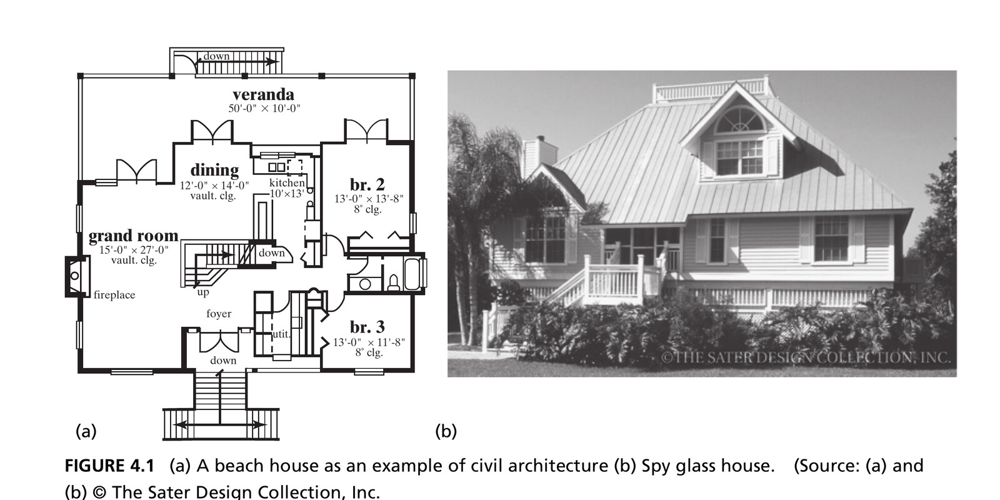{width=78% fig-align="center"}

::: {.side-caption}
A beach house — the floor plan (a) and finished result (b) are both representations of the same form. Source: Crawley, Cameron & Selva (2016), Fig. 4.1. © The Sater Design Collection, Inc.
:::

::: {.notes}
- **Make "form" tangible with a familiar civil-architecture example** before anything technical
- Form of the beach house = the spaces themselves (grand room, kitchen, veranda) — floor plan and finished photo are the same underlying form, different representational conventions
- Kitchen *exists* (test 1) and *facilitates* food prep/conversation (test 2, instrumental to function) — concrete instance of the two-part Box 4.1 definition
- Preview: "form of a building" returns briefly in Ch. 6 (architecture as a mapping)
- → For now: form is what the house physically *is*
:::

## Figure 4.2 · Form Can Be Informational

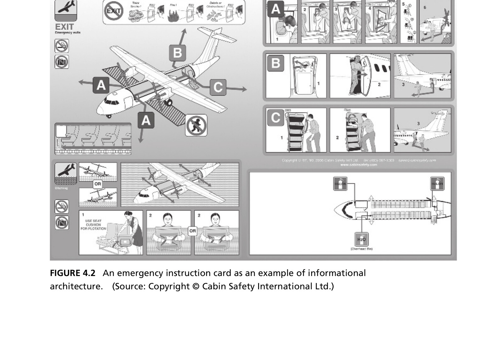{width=52% fig-align="center"}

::: {.side-caption}
An airline emergency instruction card — informational architecture, not physical, but still form: it exists, and is instrumental in the function of instructing passengers. Source: Crawley, Cameron & Selva (2016), Fig. 4.2. © Cabin Safety International Ltd.
:::

::: {.notes}
- **Important conceptual work**: first proof that "form" isn't limited to physical hardware
- Emergency card is form, full stop — exists (test 1), instrumental to instructing passengers (test 2) — even though the physical material matters far less than the *information* encoded
- **Structural detail to remember**: pictures organized in sequence (numbered), groups prefaced by smaller pictures/letters, separated by horizontal rules — sequencing/grouping = *structure* (foreshadows Section 4.4)
- → Flag for later: this card returns as a metaphor for software form — encoded objects that, when "operated" (read) by a human, are interpreted as instructions leading to function, exactly like pseudocode and a computer
:::

## Box 4.2 · Definition: Object {.smaller}

::: {.callout-note appearance="simple" icon=false}
**An object** is that which has the potential for stable, unconditional existence for some period of time.
:::

- We represent form as objects and the formal relationships (structure) among them
- Objects can be **informational** — anything comprehended intellectually: ideas, thoughts, arguments, instructions, conditions, data
- Objects have **attributes** — physical, electrical, or logical characteristics. Some attributes have **states**: a house's construction attribute goes from "not built" to "built"

::: {.notes}
- **"Object" = basic representational unit for form** — a subtlety the book flags: this definition mirrors only the *first half* of Box 4.1 (the "exists" part), not the second half (instrumental to function, prior to function)
- So: every form is built from objects, but not every object counts as form — one that doesn't meet form's extra criteria is called an *operand* in Chapter 5
- For now: objects = building blocks for form, names are generally nouns
- **Not** the same "object" as object-oriented programming, despite overlapping terminology — flag directly, many students have programming backgrounds
- **Informational objects** (Dori's definition, OPM's creator): anything comprehended intellectually, implies existence without physical tangibility — ideas, thoughts, arguments, instructions, conditions, data. Control systems, software, math, policy lean heavily on these
- **Attributes and states** (recurs in next slide's figure): objects have attributes (physical/electrical/logical), some have *states* — values that change over the object's existence
- → Book's example: beach house's "construction" attribute: not built → built; "occupancy": unoccupied → occupied; "temperature": cooler → warmer. All state values together = the object's overall configuration
:::

## Figure 4.3 · OPM Representations of Objects

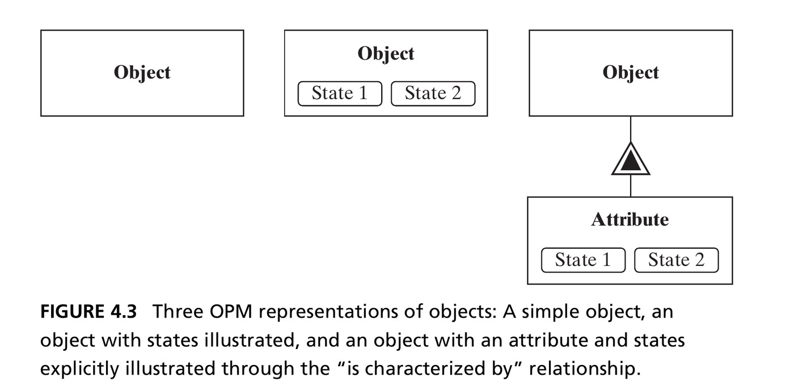{width=68% fig-align="center"}

::: {.side-caption}
Left: a simple object. Center: an object with states shown directly. Right: an object with an explicit attribute (linked by the "is characterized by" double-triangle), which itself has states. Source: Crawley, Cameron & Selva (2016), Fig. 4.3.
:::

::: {.notes}
- **First real graphical notation students reproduce themselves — walk through all three carefully**
- **Left**: simplest form, object = plain rectangle, just naming existence
- **Center**: same object, states shown directly as small ovals nested at the bottom — shorthand for "has an attribute, here are its states," used when the attribute name doesn't matter
- **Right**: fullest version — object box connects to a separate "Attribute" box via double-triangle ("is characterized by"), and that box has its own nested state ovals — more verbose, more precise (names the attribute)
- **When to use which**: right-hand form when the attribute *name* matters (e.g. distinguishing "temperature" from "construction"); center form when states alone are self-explanatory
- → Aside: SysML differentiates object notation by type (physical, human operator, etc.) — OPM's uniform box notation for all object types is one of its simplifications
:::

## Decomposition of Form {.smaller}

::: {.columns}
::: {.column width="55%"}
- Form is *concrete* — it decomposes easily, and the aggregation of form traces the decomposition in a simple way
- OPM represents decomposition with a **black triangle**: System 0 *decomposes* into Level 1 objects, which correspondingly *aggregate* into System 0
:::
::: {.column width="45%"}
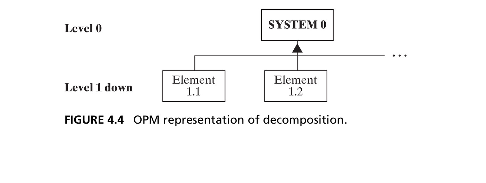{width=100%}
:::
:::

::: {.fragment .callout-tip title="Form representation"}
Form will be modeled throughout as **objects of form**, plus the **formal structure** among them.
:::

::: {.notes}
- **Connects back to Ch. 3's decomposition/hierarchy tools**, now with specific graphical notation
- Why form decomposes so cleanly (unlike function, trickier in Ch. 5): form is concrete — breaking apart and reassembling both trace decomposition simply/additively, no emergence complications
- **The filled-black-triangle symbol** (recurs constantly rest of course): solid black triangle between "System 0" and Level 1 elements, point touching System 0 — top-to-bottom = "decomposes into," bottom-to-top = "aggregate into." Graphical vocabulary for the decomposition/aggregation relationship from Ch. 2's Table 2.3
- → **Core methodological commitment, memorize as a standalone sentence**: form is always modeled as objects of form + the formal structure among them. Rest of the chapter works out what those look like for real systems
:::

## The Centrifugal Pump {.smaller}

::: {.columns}
::: {.column width="55%"}
- Our reference case for analyzing form: a real engineering system, the centrifugal pump
- The turning impeller does work on the fluid; the housing diffuses the flow, converting kinetic energy into pressure
- Chosen because it's **modular**: nine parts, none absolutely discrete (like a team) nor fully integral (like the heart) — a genuinely "simple system," with atomic parts at Level 1
:::
::: {.column width="45%"}
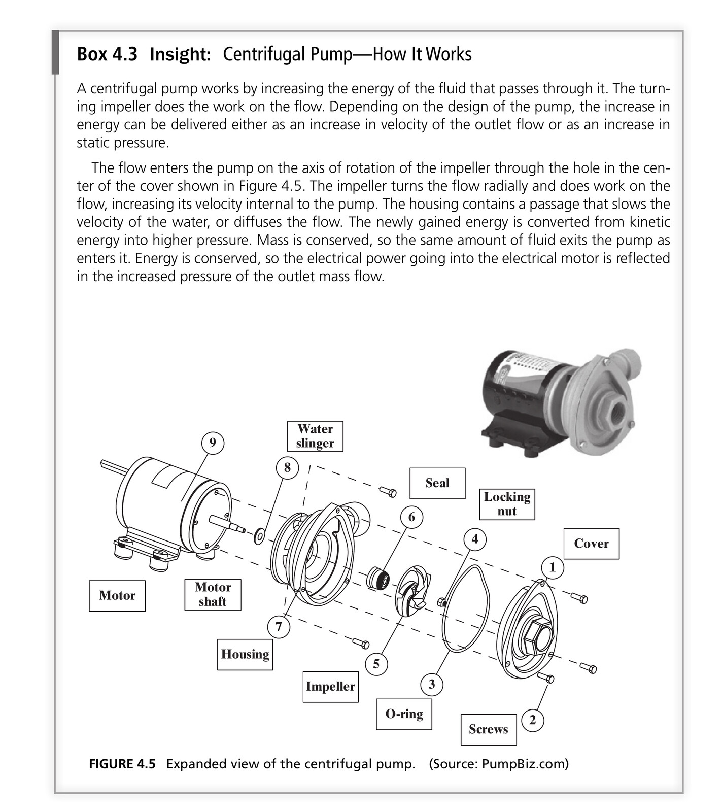{width=100%}

::: {.side-caption}
Source: Crawley, Cameron & Selva (2016), Fig. 4.5. Source: PumpBiz.com.
:::
:::
:::

::: {.notes}
- **Chapter's running worked example** — briefly explain the physics first, makes later structural relationships more intuitive
- Centrifugal pump increases fluid energy: flow enters axially through the cover hole, impeller flings it radially outward (does work, raises velocity), housing's passage slows it back down (converts kinetic energy to static pressure). Mass conserved, energy conserved (motor's electrical power → outlet pressure)
- **Why the book picks this example**: middle of the "trivially distinct/modular/integral" spectrum (Ch. 2) — not as discrete as Team X, nowhere near as integral as the heart. Nine parts, none hard to pull apart → per Ch. 3's sizing guideline, a genuinely "simple system," atomic parts already at Level 1
- → Be candid: using the full architecture toolkit on something this simple can feel like a sledgehammer on a thumbtack — that's the point, lets students see the *method* clearly before tackling something too big to hold in their heads
:::

## Defining the System (Question 4a) {.smaller}

- The procedure: examine the system and create an **abstraction of form** that conveys the important information and implies a boundary
- For the pump, we create the abstraction "**Pump**" — surfaces the idea of something that moves fluid, hides all detail of motors and impellers
- We could have chosen "centrifugal pump" instead — a more *specific* abstraction (other pump types include axial-flow and positive-displacement pumps)

::: {.fragment}
This gives us a **specialization** relationship: Pump ← (unfilled triangle) → Centrifugal Pump.
:::

::: {.notes}
- **Start working Table 4.1's six questions in earnest — Question 4a**
- General procedure (applies to every system, not just the pump): examine the system, create an abstraction of form conveying important info, implying a boundary consistent with the detailed boundary drawn later (4e)
- For the pump: abstraction "**Pump**" — surfaces "moves fluid," hides motor/impeller/housing detail; implicitly boundaries the exploded-view parts vs. hoses/supports/power supply outside
- Not the only choice — could've picked the more specific "centrifugal pump" directly. Other pump types named for contrast: axial-flow, positive-displacement — "Pump" really is a genuine generalization with real specializations
- → Fragment names this formally (Ch. 3 vocabulary): Pump = generalization, Centrifugal Pump = one specialization — next slide shows the OPM graphical notation
:::

## Figure 4.6 · Specialization and Decomposition

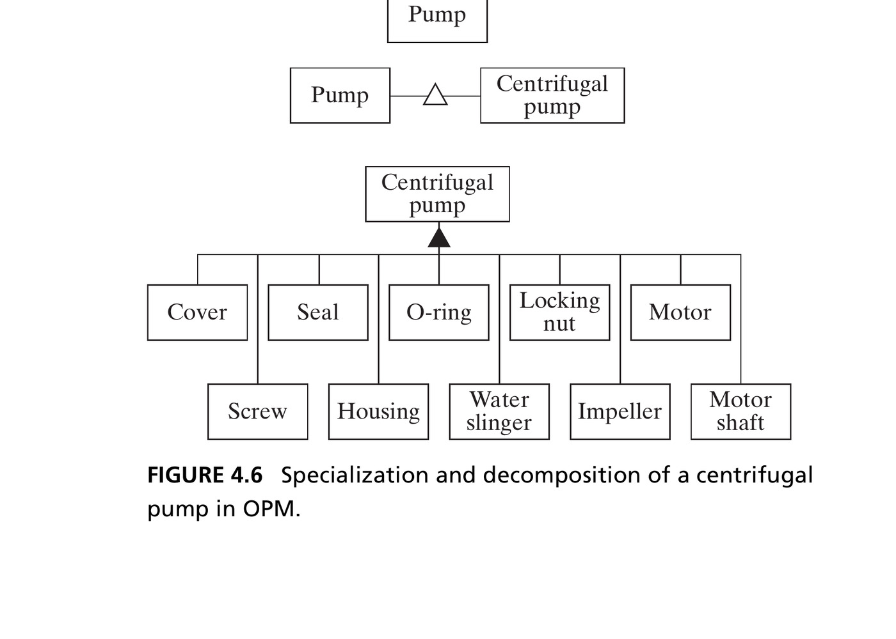{width=62% fig-align="center"}

::: {.side-caption}
"Pump" specializes to "Centrifugal pump" (open triangle), which decomposes into its ten elements of form (filled triangle). Source: Crawley, Cameron & Selva (2016), Fig. 4.6.
:::

::: {.notes}
- **Two distinct triangle symbols — confusing them is a common OPM mistake, walk through carefully**
- Top: "Pump"→"Centrifugal pump" via *unfilled/open* triangle (specialization/generalization, Ch. 3's OPM table) — "Centrifugal pump is a specialization of Pump"
- Below: "Centrifugal pump" → ten elements via *filled/solid* triangle (decomposition) — "Centrifugal pump decomposes into these ten elements"
- Same tree shape, different meaning by fill — have students trace both aloud to lock in the distinction
- → Flag the count discrepancy: exploded view showed nine labeled parts, this shows ten — "motor" got split into two objects (motor, motor shaft), explained next slide
:::

## Identifying the Entities of Form {.smaller}

- Question 4b: start with a reference **parts list**, then combine or eliminate elements, and use hierarchy to find the most important ones
- The motor has a non-rotating element and a rotating **motor shaft** — different enough functionally that we split it into two objects, even though the parts list says "motor"
- A careful look reveals **five screws** — but we abstracted just one class, "Screw," with five instances

::: {.fragment .callout-tip title="Hierarchy of pump elements"}
Hierarchy can rank the ten elements too: cover/impeller/housing/motor shaft/motor carry the most scope and function; O-ring/seal/water-slinger are mid-rank; screws and locking nut are least important.
:::

::: {.notes}
- **Question 4b — general procedure**: start with a reference parts list, combine/eliminate elements, use hierarchy to find the most important
- Manufacturer's numbered parts list is the natural starting point, but not used unmodified
- **Motor/motor-shaft split** (instructive example of thoughtful abstraction, not blind copying): parts list says "motor," but it has a non-rotating housing and a rotating shaft — different functional roles (some elements connect to the stationary body, others to the spinning shaft). Lumping into one object would hide important detail (violates Ch. 2's "surface important detail" rule) → split into two
- **Screws, the mirror-image lesson**: five separate physical screws, but only one abstraction "Screw" — class/instance relationship (Ch. 3) implicitly used: class "Screw," five instances, no architectural value in tracking them separately
- → Fragment: hierarchy (Ch. 3) ranks the ten elements — cover/impeller/housing/motor shaft/motor = most scope/function; O-ring/seal/water-slinger = mid; screws/locking nut = least. Basis for the simplified five-element diagrams coming in Section 4.4
:::

## Figure 4.9 · Managing Complexity in OPM

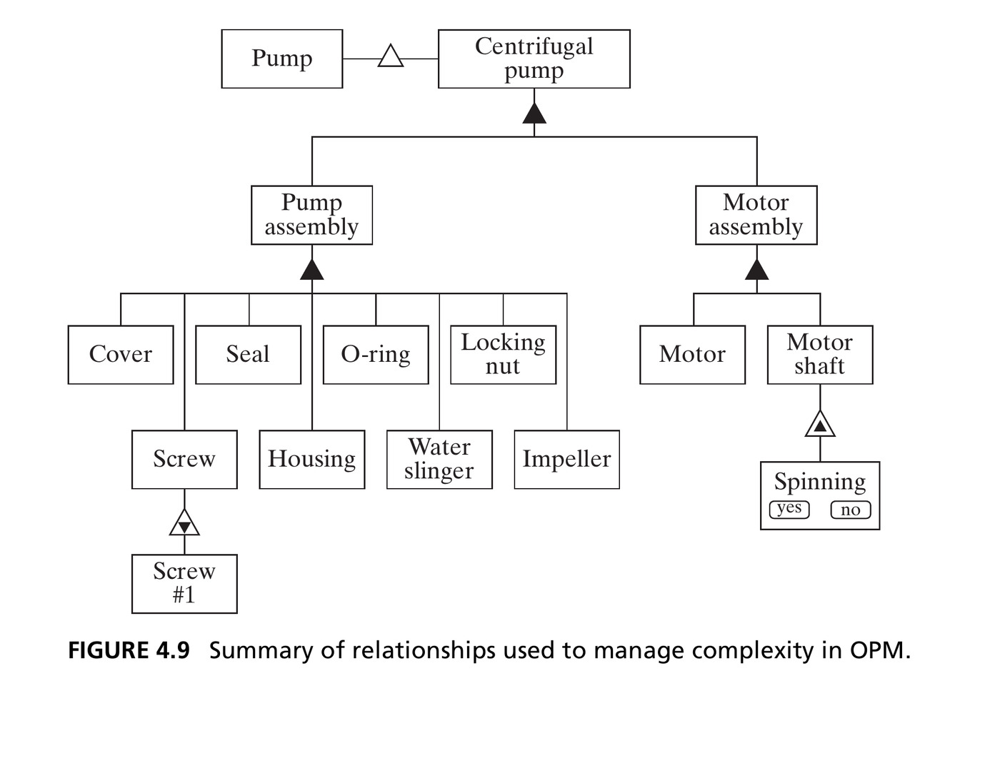{width=52% fig-align="center"}

::: {.side-caption}
Everything at once: specialization (Pump → Centrifugal pump), two-level hierarchic decomposition (Pump/Motor assembly), class/instance (Screw → Screw #1), and an attribute with states (Motor shaft → Spinning: yes/no). Source: Crawley, Cameron & Selva (2016), Fig. 4.9.
:::

::: {.notes}
- **Genuine synthesis slide — spend real time, have students annotate live symbol by symbol**
- Packs together essentially every OPM relationship type so far
- Top: "Pump" specializes (open triangle) to "Centrifugal pump," as before
- "Centrifugal pump" decomposes (filled triangle) through **two levels**: into "Pump assembly"/"Motor assembly" (pure abstractions, not literal parts — could equally be "rotating"/"non-rotating," no single correct Level-1 grouping, Ch. 3's non-uniqueness point), then further into the ten actual elements at Level 2
- **Two additional relationships at the bottom**: "Screw" → "Screw #1" via class/instance (nested-instance notation, Ch. 3's OPM table) — one instance of the five-member class
- "Motor shaft" → attribute "Spinning" → states "Yes"/"No" — object/attribute/state notation from Fig. 4.3, applied to a real element
- → **Checkpoint**: if students can read every relationship in this diagram aloud unprompted, they've mastered the form-side OPM vocabulary so far
:::

## Section 4.2–4.3 Summary {.smaller}

- Analyzing form requires creating an abstraction that conveys the important information without too much detail, and implies a system boundary
- The elements of form can be represented as a hierarchic decomposition — a set of objects representing first- and second-level abstractions
- Level 1 abstractions are **not unique** — the pump assembly / motor assembly split could just as easily have been rotating / non-rotating components

::: {.notes}
- **Checkpoint** before shifting from "what are the elements" (4a/4b) to "how are they related" (4c, structure, next: Section 4.4)
- By now students should: create a top-level abstraction of any system's form, decompose hierarchically into first/second-level elements
- → Re-emphasize (recurring course theme): Level 1 grouping choice is never the *only* valid one — pump/motor-assembly vs. rotating/non-rotating split are both legitimate abstractions of the same ten elements, chosen for different purposes
:::

# 4.4 Formal Relationships

## Box 4.4 · Definition: Formal Relationships (Structure) {.smaller}

::: {.callout-note appearance="simple" icon=false}
**Formal relationships**, or **structure**, are the relationships between objects of form that have the potential for stable, unconditional existence for some duration of time and may be instrumental in the execution of functional interactions.
:::

- Structure is *not* conveyed by a decomposition diagram alone — a random pile of parts doesn't tell you how to assemble them
- Structure shows *where* the elements of form are located and *how* they are connected
- Formal relationships often **carry** functional interactions — if A supplies power to B, there is likely a connecting wire (the structure)

::: {.notes}
- **Moves to Question 4c**: what is the formal structure?
- Definition deliberately echoes Box 4.1's form definition — structure, like form, is about things that *exist* stably, not things that happen moment to moment
- "May be instrumental in the execution of functional interactions" — crucial link forward to Ch. 6: structure often exists specifically to enable something functional
- **Vivid image for "decomposition alone isn't enough"**: a random pile of parts (or loose lines of code) with only a parts list doesn't tell you how to assemble them — missing piece is structural info: where things are, how connected
- Decomposition tells you the *parts*, structure tells you how they *fit together*
- → Formal relationships frequently *carry* functional interactions (Ch. 5's subject): A supplies power to B → probably a wire connecting them, that wire is structure, power flow is the function it enables — Ch. 2's "Formal Enables Functional" idea, now named and about to be broken into types
:::

## Two Kinds of Structural Relationship

::: {.columns}
::: {.column width="50%"}
**Spatial / topological**

Where things *are*: location or placement — above/below, near/far, within, adjacent to, encircling. Implies only placement, not the ability to transmit anything.
:::
::: {.column width="50%"}
**Connectivity**

What is connected, linked, or joined to what. Explicitly creates the ability to transfer or exchange something between objects — a wire, a shared address, a bearing.
:::
:::

::: {.fragment .callout-tip title="Architectural relevance test"}
The key question for either type: *"Is this relationship key to some important functional interaction, or to the successful emergence of function and performance?"*
:::

::: {.notes}
- **Two main structural-relationship categories** — distinction is genuinely subtle in physical systems
- **Spatial/topological**: *where things are*, relative location/placement — above, below, near, far, within, adjacent, encircling. Says nothing about transmit/exchange ability — objects can touch without functional coupling
- "Spatial" (absolute/relative location, coordinate system) vs. "topological" (within, surrounded by, adjacent) are subtly distinct, but book treats as one combined category
- **Connectivity**: explicitly *what's connected/linked/joined* — genuinely creates transfer/exchange ability (wire for current, shared memory address, a bearing transmitting rotational force)
- **Discriminating example**: two houses can be spatially adjacent without being connected (no shared plumbing/wiring); a computer and remote server can be connected (network) with unspecified relative location
- → **Practical filter** (echoes Ch. 2's "focus" principle): every pair has *some* spatial relationship (too much info to be useful) — the real question, pairwise: is this relationship key to an important functional interaction or to function/performance emergence? If not, leave it out
:::

## Figure 4.13 · OPM Structure Notation

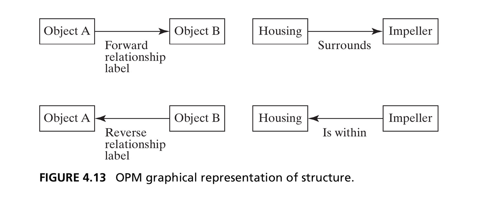{width=62% fig-align="center"}

::: {.side-caption}
A binary link, drawn as a single-headed arrow with a label: "the housing surrounds the impeller." The direction of the arrow is arbitrary — it implies no exchange, interaction, or causality, just a relationship that exists. Source: Crawley, Cameron & Selva (2016), Fig. 4.13.
:::

::: {.notes}
- **Graphical convention for every structural diagram from here forward**: single-headed arrow, one object to another, plain-language label
- Pump example: housing surrounds the impeller without touching → arrow Housing→Impeller, labeled "Surrounds"
- **Trips students up most (book flags it explicitly)**: arrow *direction* is entirely arbitrary — no causality, exchange, or interaction implied, just an existing relationship
- Reverse arrow (Impeller→Housing, "Is within") would mean exactly the same thing; convention picks one direction, reverse reading stays implicit — relationship is symmetric even when labels differ ("aligned with" reverses cleanly both ways)
- → Important contrast to flag now: in Ch. 5, functional relationship direction *will* matter (a process acts on an operand in a specific direction) — watch for that contrast later
:::

## Figure 4.14 · Spatial Structure of the Pump

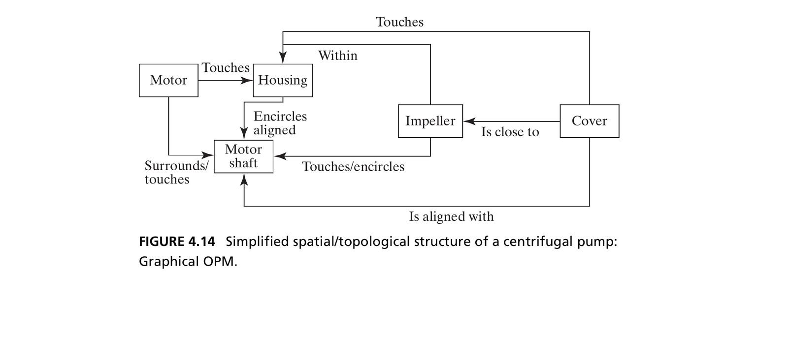{width=68% fig-align="center"}

::: {.side-caption}
The five key elements from the hierarchy, connected by their important spatial/topological relationships. Source: Crawley, Cameron & Selva (2016), Fig. 4.14.
:::

::: {.notes}
- **Payoff of the "pairwise, ask if it matters" procedure** — restricted to the five top-priority elements (cover, impeller, housing, motor, motor shaft), lower-ranked parts left out
- Trace a few aloud: cover touches housing, aligned with motor shaft; cover also close to impeller (not visually obvious, but matters functionally — pump fails with a gap between impeller and cover) — good example of the "is this relationship key to function" filter surfacing something non-obvious
- → Aside: an equivalent structural diagram exists in SysML (block definition + internal block diagram) — not covered here, consistent with the OPM-only policy, but worth knowing it exists in industry
:::

## The Design Structure Matrix (DSM) {.smaller}

::: {.callout-note appearance="simple" icon=false}
**DSM**: an N-squared matrix used to map the connections between one element of a system and the others. Read down the column to the relationship at the row heading.
:::

- The DSM contains the *same information* as the graphical OPM view — just tabulated instead of drawn
- Graphical views are easier to develop and visualize; matrix views handle complexity without visual clutter, and are easier to compute on
- We'll use both throughout this course

::: {.notes}
- **DSM = tabular counterpart to graphical OPM diagrams**, connects back to Ch. 2's N-Squared tables
- Acronym: **D**esign **S**tructure **M**atrix generally (also seen as Decision/Dependency Structure Matrix) — N×N matrix; reading convention: read *down the column* to the relationship *at the row heading* — flows column→row
- Same info as an OPM diagram, just represented differently — five-element pump DSM shows the same "touches"/"aligned with"/"close to" relationships as Fig. 4.14, as cells instead of arrows
- Structural DSMs are symmetric except when forward/backward labels use different words (e.g. "slid onto" vs. "had slid onto") — structure just *exists*, no direction/causality
- → **Tradeoff, use both all course**: graphical easier to develop/visualize for small systems but clutters fast; matrix scales without clutter and is easier to compute on (sort/cluster/search) — choice depends on system size and human-vs-computer use
:::

## Other Formal Relationships {.smaller}

Beyond spatial/topological and connectivity, several other relationship types simply *exist*:

- **Address** — where something can be found (a memory address, a mailing address)
- **Sequence** — a static ordering (statement 2 is always after statement 1 in the code)
- **Membership** — being part of a group or class
- **Ownership** — a static relationship between an owner and the owned
- **Human relationships** — trust, liking, bonds between people (uniquely, not always reciprocal)

::: {.fragment .callout-tip title="Static does not mean permanent"}
All formal relationships are static at any instant — but they *can* change: connections made and broken, addresses reassigned, membership revoked.
:::

::: {.notes}
- **Round out the catalog beyond spatial/topological and connectivity** — less central to the pump, matter a lot in software/organizational systems
- **Address**: where something *is*, encoded — specialized encoded spatial relationship, common in software (memory addresses, registers)
- **Sequence**: static ordering — statement 2 after statement 1 in code holds regardless of execution. Subtlety: in *imperative* languages, written-order implies execution-order; not necessarily true in *declarative* languages. What's always true (any paradigm): the purely structural fact "2 follows 1 in the written code" — a formal claim, distinct from the functional execution-order claim
- **Membership**: part of a group/class — "A is a member of Group 1" may or may not imply interaction/responsibility (resembles but isn't identical to Ch. 3's class/instance)
- **Ownership**: "if you own it, it's yours" — thought-provoking question to pose: what separates your land from your neighbor's? Just a past transaction — but once done, ownership is a genuine static formal relationship
- **Human relationships** (trust, liking): uniquely **not necessarily reciprocal** — you can trust a public figure who doesn't know you exist; unlike any physical connection
- → **Closing qualifier**: all of these are static *at any instant* — but not permanent. Location moves, connections make/break, addresses reassign, sequence reorders, membership/ownership change. Human bonds are the single most fickle — can deteriorate in an instant
:::

## Section 4.4 Summary {.smaller}

- Form consists of objects and **structure** — the formal relationships among them. Both must be considered in analysis.
- Three broad types of formal relationship: **connection** (carries functional interaction), **location/placement**, and **intangible** (membership, ownership, human bonds)
- Formal relationships inform and influence the nature of functional interaction and the emergence of function and performance
- Formal relationships are static in that they *exist* — although they can be changed

::: {.notes}
- **Checkpoint closing Section 4.4**, before moving outward to context (4.5)
- **Book's cleaner three-way taxonomy**: connection-type (creates the channel for functional interaction — connectivity), location/placement-type (spatial/topological, address, sequence — literal or encoded), intangible (membership, ownership, human bonds — no physical channel)
- → Two big-picture takeaways: formal relationships inform/influence what functional interactions are possible and how function/performance emerge (link to Chs. 5-6); and formal relationships are about existence, not occurrence — they simply *are*, though they can and do change over time
:::

# 4.5 Formal Context

## Accompanying Systems and the Whole Product System {.smaller}

- Another application of **holistic thinking**: take an increasingly broad view of the system and its context
- The **accompanying systems**: objects not part of the product/system, but *essential* for it to deliver value
- The sum of the product/system and its accompanying systems is the **whole product system**

::: {.fragment .callout-tip title="Pump accompanying systems"}
For the pump: the inflow and outflow hoses, the pump support structure, and the power/controller are all accompanying systems — without them, the pump delivers no value.
:::

::: {.notes}
- **Addresses Questions 4d and 4e together** — another application of the Principle of Holism (Ch. 2), now applied to form, expanding outward one deliberate step
- Procedure: look at objects near/connected to the system, ask "essential to delivering product/system value?" If yes → accompanying system, create an abstraction, identify structure connecting it, same as for internal elements
- **Accompanying systems**: objects *not* part of the product/system but *essential* for it to deliver value — must be present, connected, working
- **Whole product system** = product/system + its accompanying systems
- → Pump: the ten elements alone deliver zero value (a pump on a shelf does nothing) — need inflow/outflow hoses, pump support, power/controller. None are part of the pump, but without them, zero value → that's what makes them accompanying systems, not mere context
:::

## Figure 4.17 · The Pump Whole Product System

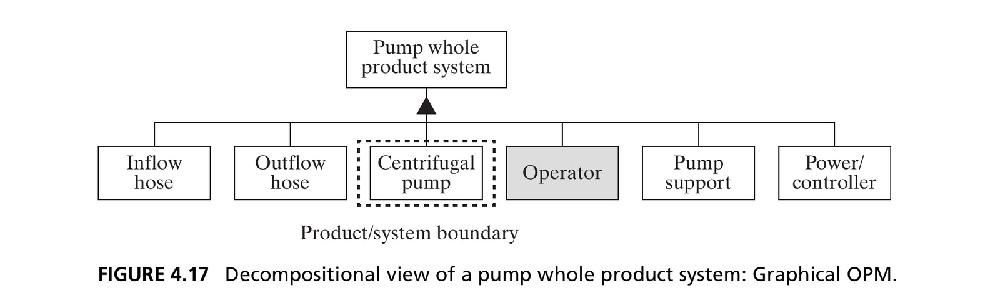{width=80% fig-align="center"}

::: {.side-caption}
The dashed line is the product/system boundary. Including the operator reminds the architect to consider human interaction with the system. Source: Crawley, Cameron & Selva (2016), Fig. 4.17.
:::

::: {.notes}
- **Concrete payoff of the previous slide**: pump's whole product system = six elements — the pump itself (dashed border = product/system boundary) plus five accompanying systems: inflow hose, outflow hose, pump support, power/controller, and an **operator**
- **Why include the operator**: deliberate choice — value delivery usually requires a human in the loop; good practice to include the operator explicitly, reminds the architect not to neglect human interaction (easy to overlook if hardware-focused)
- This decomposition view enumerates what accompanying systems *are*, but shows no structural info (no connections/spatial relationships)
- → That gap is filled by redrawing as a connectivity diagram (Fig. 4.18 in the book), showing physical links and where boundary crossings/interfaces occur. Drawing the boundary clearly (dashed line) is good practice generally — reduces ambiguity, makes every interface explicit
:::

## The Use Context {.smaller}

- One more step outward: the **use context** — objects normally present when the system operates, but *not necessary* for it to deliver value
- Use context informs the **function** of the product/system — it gives place to the system and informs its design
- Even though the architect is only *responsible* for the product/system, they will likely be held *accountable* for the function of the whole product system regardless

::: {.fragment .callout-important appearance="minimal" icon=false}
It's important to understand about two levels down in decomposition — and about two levels *out* in context: the whole product system and the use context.
:::

::: {.notes}
- **Question 4f, last/outermost — genuinely distinct from accompanying systems, make the distinction explicit**
- Accompanying systems = *essential* for value delivery. **Use context** = one step further out: objects normally *present* but not strictly necessary for value
- Use context matters differently: informs the *function* of the system (preview Ch. 5), gives it place, informs good design — even though removing it wouldn't stop the system working
- **Pump example, honest limitation**: no hints on actual use context in the reference drawings, so speculate — industrial sump pump (saltwater) vs. home dishwasher — design requirements differ (corrosion resistance vs. food-safety/noise) even though core pumping function/accompanying-systems analysis look identical
- **Uncomfortable practical point**: architect is formally *responsible* only for the product/system, but likely held *accountable* for the whole product system's function regardless — book's example: a poorly-connecting third-party hose gets blamed on the pump supplier, not the hose supplier
- → **Clean rule of thumb** (mirrors Ch. 3's decomposition-depth guidance): understand ~two levels *down* into decomposition, and ~two levels *out* into context — whole product system (one out), use context (two out)
:::

# 4.6 Form in Software Systems

## The Bubblesort Algorithm {.smaller}

We review the same procedure on a software system: **bubblesort**, which sorts an array by successively swapping adjacent out-of-order entries.

```
1  Procedure bubblesort (List array, number length_of_array)
2      for i = 1 to length_of_array - 1
3          for j = 1 to length_of_array - i
4              if array[j] > array[j+1] then
5                  temporary = array[j+1]
6                  array[j+1] = array[j]
7                  array[j] = temporary
8              end if
9          end of j loop
10     end of i loop
11     return array
12 End procedure
```

::: {.notes}
- **Launches the chapter's second running example — why include it**: everything so far has been physical (the pump); this section tests whether the same six-question procedure works on a purely informational system
- Bubblesort is, like the pump, genuinely simple — far simpler than architecture tools are meant for — but surfaces important form observations only visible in software
- **What bubblesort does**: sorts an array by repeatedly comparing adjacent entries and swapping if out of order, sweeping repeatedly — "bubble" because larger values gradually bubble toward the end
- → Nested loop structure (outer `i`, inner `j`, conditional swap) is the whole procedure — we return to specific line numbers repeatedly, make sure students can follow control flow before moving on
:::

## What Is the "Object" in Software? {.smaller}

- Question 4a: the system is obviously the pseudocode itself — but what is the *object of form*?
- Box 4.1: form "exists... is instrumental in the execution of function... and exists prior to the execution of function"
- The code **is** the form — it exists, it's implemented (written), and when *operated* (executed), it's interpreted as instructions that lead to function
- The emergency instruction card (Figure 4.2) is a metaphor: a set of objects that, when "operated" by a human reader, are interpreted as instructions

::: {.notes}
- **Apply Question 4a to bubblesort — surfaces a genuinely subtle point**
- What the system *is* = easy, it's the pseudocode. Harder: what's the *object of form*? Warn: not the OOP sense of "object," despite overlapping terminology
- **Re-apply Box 4.1**: form exists, is instrumental to function, exists prior to function. Applied to software: the code itself *is* the form — exists as written text, "implemented" by being written, and when *operated* (executed) is interpreted as instructions leading to function (a sorted array)
- Useful reframing: source code isn't a description of form (like a floor plan describes a house) — the code literally *is* the form, same directness as the pump's metal parts being its form
- → Reconnect to Figure 4.2 (emergency card): a set of objects that exist, are implemented (printed), and when "operated" by a human reader lead to function — software works the same way, processor instead of human eye
:::

## Box 4.7 · Principle of Dualism {.smaller}

::: {.callout-note appearance="simple" icon=false}
*"Dualism in philosophy, mind/body, free will/determinism, idealism/materialism appear as contradictory only because of underdeveloped formulation of the concepts involved."* — Hegel's dialectic, *Science of Logic* (1812–1816)
:::

- All built systems inherently and simultaneously exist in the **physical** and the **informational** domain
- "Information systems" are just abstractions of physical objects that store and process information
- Poems are in print; thoughts are encoded in neural patterns; images are pixels — informational form must always be encoded in **some** physical form

::: {.notes}
- **Philosophical payoff of the previous slide** — read the Hegel quote slowly; apparent contradictions between paired concepts dissolve once formulated more carefully, exactly what this principle does for form
- **Core claim**: every built system exists simultaneously in physical *and* informational domains — genuine duality, not either/or
- "Information systems" aren't a different category from physical systems — abstractions of physical objects organized around storing/processing information (charges in memory, ink on a page, pits on a disc)
- **Examples across substrates**: poems (words/meaning, encoded in print); thoughts (ideas, encoded in neural firing); a DVD movie (frames, encoded as optical markings); digital images (a picture, encoded as pixel values)
- → **Unifying lesson**: informational form must *always* be encoded in some physical form — no such thing as pure disembodied information. Justifies why bubblesort's code, pure information, is legitimately "form" on the same footing as the pump's steel parts
:::

## Structure in Software {.smaller}

- Question 4b: the principal elements of form are the **lines of pseudocode** — decomposing further (e.g., into individual characters) adds no useful architectural information
- Question 4c: for software, the most important **spatial/topological** relationship is **sequence** — what executes before what — and **containment** — what's nested within what (e.g., inside the `if` block, inside the `j` loop)

::: {.notes}
- **Questions 4b and 4c together for bubblesort** — briskly, once the software-form idea is established
- **4b**: elements of form = individual lines of pseudocode. Could abstract coarser (procedure/if-block/j-loop/i-loop as four elements), but decomposing further (to characters) adds nothing — past the atomic-part threshold (Ch. 3's "loses meaning when taken apart" rule)
- **4c, headline observation**: software spatial/topological relationships are more abstract than physical — no literal geometry; structure shows up via indentation, conventions, syntax
- Most important spatial/topological relationship in imperative languages: **sequence** (which lines execute before which)
- Second: **containment** — what's nested within what (swap logic, lines 5-7, contained within the `if`, itself within the `j` loop)
- → Sequence and containment are *structural* claims about static written code, distinct from (though related to) the *functional* claim about runtime execution order — next figure makes this explicit
:::

## Figure 4.20 · Structure of Bubblesort

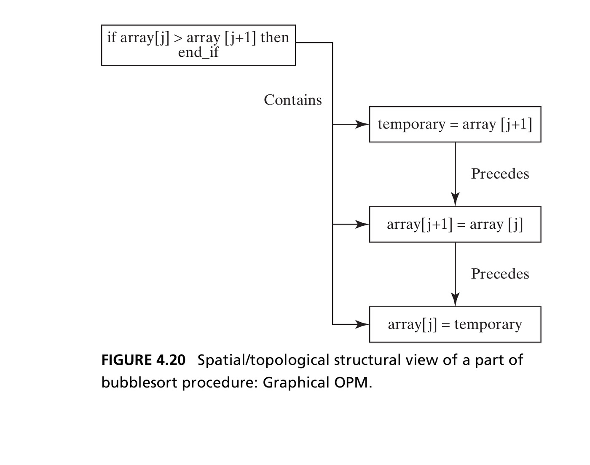{width=58% fig-align="center"}

::: {.side-caption}
The "precedes" relationship informs transfer of control; "contains" informs what executes conditionally. Source: Crawley, Cameron & Selva (2016), Fig. 4.20.
:::

::: {.notes}
- **Direct graphical payoff of sequence/containment** — same single-headed-arrow OPM notation as Fig. 4.13, applied to lines of code
- `if` block "contains" the three swap lines; within that block, each line "precedes" the next
- **What each relationship tells us functionally**: "precedes" (sequence) = transfer of control at execution (line 5 before 6 before 7); "contains" = which lines execute only *conditionally* (swap only runs if the `if` condition is true)
- → Point back to Table 4.8 (book): full DSM of this structure using F=follows, P=precedes, W=within, C=contains, extended across the whole bubblesort procedure
:::

## Section 4.6 Summary {.smaller}

- The objects of form for a software system are the code, which (when operated) is interpreted as instructions
- Software form decomposes into modules, procedures, and eventually lines of code
- Software structure consists of **spatial/topological** relationships (informing control flow) and **connectivity** relationships (informing data/variable flow)
- The whole product system for software includes the compiler, calling routine, processor, and input/output — and its use context informs requirements for quality, reliability, and maintainability

::: {.notes}
- **Closing checkpoint for software-form section** — fill in the missing piece: connectivity structure
- **Connectivity in software** = exchange of data/variables — which lines share the array, its length, the temp variable, or loop indices `i`/`j`
- Book's observation: bubblesort's spatial/topological vs. connectivity structure overlap *less* than the pump's did — informational systems can separate these two kinds of structure more cleanly than physical systems (which usually need physical adjacency to connect)
- **Whole-product-system/use-context for software (4d/4e/4f), briefly**: accompanying systems = calling routine, compiler, and further out, the processor, I/O devices
- Use context (teaching example vs. production library vs. safety-critical code) changes requirements for QA, reliability, maintainability — even with identical core algorithm/form
- → Same "same system, different context, different requirements" logic as the pump — applies whether physical or purely informational
:::

## Chapter 4 Summary {.smaller}

- Form is a system attribute: the physical/informational embodiment of a system that exists, and is instrumental in delivering function
- Form decomposes into objects, which have formal relationships (structure) among them
- Form combines with accompanying systems to create the whole product system, delivering value across a well-defined boundary
- We took the approach of **reverse engineering**: analyze form first, defer the less concrete attribute — function — to Chapter 5

::: {.callout-tip title="Reference"}
Crawley, E., Cameron, B., & Selva, D. (2016). *System Architecture: Strategy and Product Development for Complex Systems*. Pearson. Chapter 4.
:::

::: {.notes}
- **Close the chapter — walk back through all six Table 4.1 questions**, now with two worked systems (pump, bubblesort)
- **4a**: what is the system → top-level abstraction of form
- **4b**: principal elements → hierarchic decomposition into first/second-level objects
- **4c**: formal structure → spatial/topological + connectivity relationships (plus address, sequence, membership, ownership, human bonds), graphical OPM or tabular DSM
- **4d/4e**: accompanying systems, whole product system → holistic thinking one level out
- **4f**: use context → one further step out
- → Remind students of the reverse-engineering framing from the first slide: form (more concrete) analyzed before function (Ch. 5) — deliberate, form is the right foundation to build on. Preview: Ch. 5 applies the same question-driven analysis to the same pump/bubblesort examples, now asking what they *do*; Ch. 6 shows how form and function combine into architecture itself
:::
