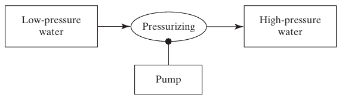
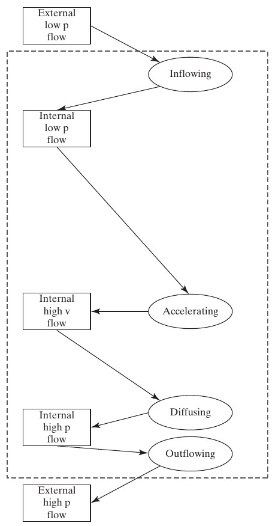
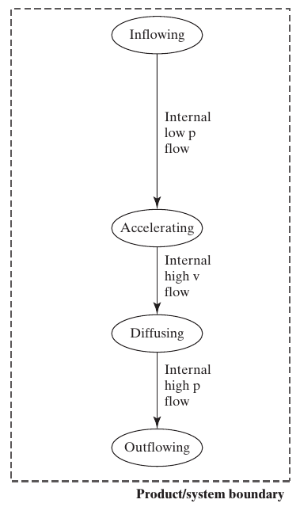
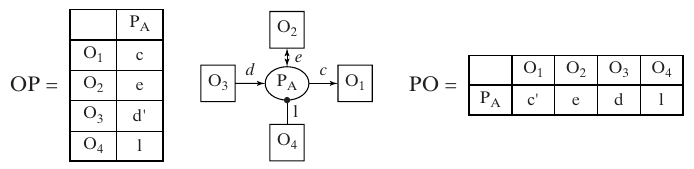

## Form and Function {.smaller}

- Chapter 4 analyzed **form**: what a system *is*
- This chapter analyzes **function**: what a system *does*
- Function describes activity and change, so representing it requires more than a static description of form

::: {.fragment .callout-tip title="Architecture maps function to form"}
Once we can analyze both form and function, Chapter 6 shows how they combine into **system architecture**.
:::

::: {.notes}
- Chapters 4 and 5 separate form and function for study. In design, architects move between them through zigzagging, as introduced in Chapter 3.
- **Why function is harder to pin down than form**: function = activity (operations, transformations, actions); form = existence (static, point-at-able). You can photograph form; you can't photograph function the same way (concrete in a couple slides, Figure 5.1)
- Function is the entire reason systems exist: nobody builds a pump for the metal parts, they want the *pressurizing*
- All the magic (and nearly all the difficulty) of systems is in the functional domain, not the formal one
- **Closing fragment previews**: form (Ch. 4, done) + function (this chapter) → Chapter 6 defines architecture precisely as the *mapping* between them: which instrument objects enable which processes. This chapter builds the vocabulary that mapping needs
- **Discussion**: Pick a familiar product and describe its form without saying what it does, then describe its function without naming its parts. Where does ordinary language force the two domains back together?

**Suggested answer:** Example: an electric kettle's form includes a metal vessel, lid, resistive element, switch, and cable with specified connections. Its function is heating water from a cooler state to a desired temperature. Words such as “heater,” “handle,” and “spout” encode purpose in a part name, so everyday descriptions mix form and function. A good answer can separate the object from the process without denying that the object enables that process.

[Sources]
- Crawley, Cameron & Selva, *System Architecture* (2016), Ch. 5, p. 97.
:::

## Box 5.1–5.3 · Definitions {.smaller}

::: {.callout-note appearance="simple" icon=false title=""}
**Function** is the action for which a system exists.
:::
::: {.callout-note appearance="simple" icon=false title=""}
**An operand** is an object that need not exist prior to the execution of function, and is in some way acted upon by the function.
:::
::: {.callout-note appearance="simple" icon=false title=""}
**A process** is the application of an instrument of form on an operand, changing it in some way: creating, destroying, or affecting it.
:::

::: {.fragment}
Function = process + operand. A process needs an **instrument** (form) to execute it.
:::

::: {.notes}
- **Walk through all three definitions carefully**: precise vocabulary for the rest of the chapter and course
- **Box 5.1, function**: activity/operation/transformation causing or contributing to performance; the actions for which a system exists, leading to delivery of value (defined properly in a few slides)
- Function is executed *by* form (form is instrumental): form enables function, is not itself function
- **Box 5.2, operand**: an object, so has potential for stable existence: but need not exist *prior* to the function's execution; may be created, modified, consumed
- Surprising point: operands are usually **not** supplied by the architect/builder: house architect doesn't supply the resident, card designer doesn't supply the passenger. They appear at operation time from elsewhere, and are almost never shown on conventional system representations: easy to overlook since nobody "builds" them
- **Box 5.3, process**: pattern of transformation an object undergoes: creation, destruction, or change of an operand
- Process vs. objects: process is transient/dynamic, unfolds along a timeline; objects have stable existence at a point in time: sets up why process is hard to draw (next slide)
- **Closing fragment**: function = process + operand (from Ch. 2), plus the missing piece: a process needs an **instrument** (form) to execute. Sets up the full canonical model: operand, process, instrument together
- The same object can play different roles in different relations: water is an operand of pressurizing, while a sensor may later use that water state as an instrument for measuring. “Instrument” and “operand” describe roles in a process, not permanent object types.
- **Discussion**: In “a drill makes a hole in a plate,” identify the process, operand, and instrument. What changes if the drill bit itself is wearing down?

**Suggested answer:** Drilling is the process, the plate is the operand whose geometry changes, and the drill with its bit is the instrument. A hole is a resulting geometric feature of the plate, rather than necessarily a separate material object. In the idealized drilling model the bit is unchanged; once wear is included, the bit is also an operand of a wear process. Roles belong to particular process relationships, so an object can enable one process and be affected by another.

[Sources]
- Crawley, Cameron & Selva, *System Architecture* (2016), Ch. 5, pp. 97-101, Boxes 5.1-5.3.
:::

## Figure 5.1 · Function Is Hard to Draw

{width=85% fig-align="center"}

::: {.side-caption}
Process is inherently dynamic: a static image always struggles to capture it. Source: Crawley, Cameron & Selva (2016), Fig. 5.1. Photo (b) Miguel Angel Salinas Salinas/Shutterstock, (c) Screwy/Shutterstock.
:::

::: {.notes}
- Use the images to distinguish a static pose from evidence of motion.
- You cannot photograph process: need a video; no single frame reveals it, only the whole sequence
- **Book's illustration**: video of a sprinter crossing the finish line. A single frame, or even the "running" pictogram (middle of figure): you can only *infer* dynamics from a static shape, not observe motion directly
- **Cartoon on the right**: motion lines, exaggerated poses hint at motion in one frame: still ambiguous (is the character in panel (a) taking the wheel cover off, or putting it on?). Static image is fundamentally ambiguous about direction
- This is exactly the problem OPM's explicit process notation solves, starting next slide
- **Discussion**: What extra evidence, before/after states, arrows, timestamps, or a sequence, would remove the hubcap image's ambiguity? Each answer suggests information a functional model must encode.

**Suggested answer:** Show an initial state “hubcap attached,” a final state “hubcap detached,” and a transition labeled Removing, or reverse the states for Installing. Ordered, time-stamped frames can establish which direction occurred. An arrow helps only if its meaning is clear: a force arrow or a person's pose alone need not establish actual motion. The functional model must identify the operand, process, and direction of state change; labels should distinguish the intended action from evidence of its completion.

[Sources]
- Crawley, Cameron & Selva, *System Architecture* (2016), Ch. 5, pp. 99-100, Fig. 5.1.
:::

## OPM Notation for Process and Operand {.smaller}

Three ways a process and operand can relate in OPM:

::: {.columns}
::: {.column width="33%"}
**Affect**\
(double arrow)\
The process changes an attribute of the operand, but doesn't create or destroy it.
:::
::: {.column width="33%"}
**Consume**\
(arrow into process)\
The operand no longer exists in its original form after the process.
:::
::: {.column width="33%"}
**Produce**\
(arrow out of process)\
The operand didn't exist before the process, and does after.
:::
:::

{width=70% fig-align="center"}

::: {.notes}
- **Introduce OPM's precise notation for process**: the fix to the previous slide's ambiguity problem
- Process = oval, labeled with process name. Operand = rectangle (it's an object), labeled with operand name
- Function itself has no separate symbol: it's the combination of process + operand, not a third shape
- **Three relationship types (which arrow matters a lot)**:
  - Arrow *from* process *to* operand → **produces** (creates): factory creates a car, team develops a design; didn't exist before, exists after
  - Arrow *from* operand *to* process → **consumes**: factory consuming parts, lungs consuming oxygen; original abstraction no longer exists in its original form/place (note: the car-factory *parts* still physically exist, just as part of a new abstraction, "the car")
  - Double-headed arrow → **affects**: no consume/produce; residents exist before and after moving in, only "being housed" changed
- **Right-side examples**: passenger *informed* (affected: knowledge changes, passenger persists); decision *made* (produced: didn't exist before); oxygen *absorbed* (consumed from air's perspective, produced from tissue's)
- Affect/consume/produce is the fundamental notational grammar: recurs on every remaining diagram in this chapter
- “Consumed” is abstraction-dependent: car parts still physically exist after assembly, but they no longer exist as separate parts in their original place. Read the arrow at the level of the modeled object, not as a claim that matter vanished.
- **Discussion**: Classify charging a battery, burning fuel, and generating a report as affect, consume, or produce. Which example needs more than one relation?

**Suggested answer:** Charging affects the battery's state of charge; the battery persists. Burning consumes fuel in its original chemical form and produces combustion products, while also transferring energy. Generating a report produces a report object, usually using source data without consuming it. Burning therefore needs more than one relation in a complete model; charging and report generation also need additional input and enabling relationships when those details matter. These labels describe the chosen abstraction, not destruction of conserved matter or energy.

[Sources]
- Crawley, Cameron & Selva, *System Architecture* (2016), Ch. 5, pp. 100-101, Fig. 5.2.
:::

## Figure 5.3 · The Canonical Model {.smaller}

{width=58% fig-align="center"}

::: {.side-caption}
Function is a process affecting an operand. The instrument object enables the process. This pattern recurs in the architecture models throughout the course. Source: Crawley, Cameron & Selva (2016), Fig. 5.3.
:::

::: {.notes}
- The book calls this the canonical model of a system. Ask students to identify the instrument, process, and operand in each example.
- Brings together everything so far: OPM's round-headed arrow links the *instrument object* (form) to the process it enables; the process connects via create/destroy/affect to the operand it acts on
- **Three examples**: instrument enables "Processing" acting on "Operand." Team X (instrument/form) enables "Making," acting on "Decision." Instruction card (instrument/form) enables "Informing," acting on "Passenger"
- Same three-part shape every time: form on the right enabling function (process + operand) on the left: the seed every more elaborate architecture diagram in this course grows from (internal functions, functional architecture, full Ch. 6 architecture)
- **Discussion**: Build the canonical model for a thermostat-controlled room. Be precise about whether the room, its air, or its temperature is the operand, and defend the chosen abstraction.

**Suggested answer:** At a useful room-comfort abstraction, room air is the operand, temperature is its attribute, and Heating/Cooling moves it from outside to inside the desired temperature range. The heating/cooling equipment enables the thermal process; the thermostat senses and controls when it occurs. “Room” is acceptable as a coarser operand if its thermal state is defined clearly. Do not imply that the thermostat alone supplies heat, or treat the numerical temperature value as a material object being transported.

[Sources]
- Crawley, Cameron & Selva, *System Architecture* (2016), Ch. 5, p. 101, Fig. 5.3.
:::

## Making States Explicit {.smaller}

::: {.columns}
::: {.column width="55%"}
- A more detailed OPM view shows the operand's **states** directly, and which state the process moves it from and to
- This is often the most useful representation: it shows exactly what "changes" means for a given operand
:::
::: {.column width="45%"}
{width=100%}
:::
:::

::: {.notes}
- Extend the canonical model by naming the operand's initial and final states.
- Draw "Operand" containing named states (State 1, State 2), arrow showing which state the process moves it from/to
- Passenger example: operand "Passenger" has states "Not know"/"Know," process "Informing" moves it Not-know → Know
- Explicit states let us check the outcome. For example, can the passenger now explain the instructions?
- States force a testable claim: naming only “informing” describes an attempted action; showing `does not know → knows` states the outcome that must actually occur for the function to succeed.
- **Discussion**: For one process, propose a state pair that is observable but insufficient to prove value, then improve it to a value-relevant state pair.

**Suggested answer:** For safety instruction, “card not displayed → card displayed” is observable but does not establish that a passenger learned anything. A more value-relevant pair is “cannot identify the required action → can identify and demonstrate it,” checked by an appropriate response or demonstration. Keep card display as an enabling event while representing the passenger's knowledge as the outcome. Similarly, “heater off → on” does not prove that water reached its required temperature.

[Sources]
- Crawley, Cameron & Selva, *System Architecture* (2016), Ch. 5, p. 101, Fig. 5.4.
:::

# 5.3 External Function and Value

## Table 5.1 · Questions for Defining Function {.smaller}

| Question | Produces |
|---|---|
| 5a. What is the primary externally delivered function? What is value? | The value-related operand, its state, the process that changes it, and the enabling form |
| 5b. What are the internal functions? | The internal processes and operands |
| 5c. What is the functional architecture? | The functional interactions among internal processes |
| 5d. What are secondary value-related functions? | Additional operands and processes delivering value |

::: {.notes}
- **Chapter's roadmap**, exactly parallel to Table 4.1 in Chapter 4: four questions, each its own section, each a specific analytical output
- **5a**: primary externally delivered function, what is value → rest of 5.3 → value-related operand, its state, the process that changes it
- **5b**: principal internal functions → 5.4 → internal processes and operands
- **5c**: functional architecture, how internal functions connect into a value pathway → 5.5 → functional interactions among processes
- **5d**: secondary value-related functions → 5.6
- Structural echo with Chapter 4's form questions: primary/external, then internal decomposition, then interactions, then secondary: this four-step pattern recurs through the rest of Part 2
- Use the “Produces” column as a completeness check. An answer to 5a that names only a verb, or an answer to 5c that lists processes without exchanged operands, is incomplete by construction.
- **Discussion**: Which question would reveal why a system with individually correct components still fails to deliver its intended outcome?

**Suggested answer:** Question **5c**, functional architecture, examines whether internal processes exchange the right operands in the right states and conditions to produce the external result. Correct components can still fail collectively because of a missing handoff, incompatible data, or incorrect sequencing. Also revisit **5a**: a flawlessly integrated system can deliver the wrong outcome if the primary function or stakeholder value was defined incorrectly.

[Sources]
- Crawley, Cameron & Selva, *System Architecture* (2016), Ch. 5, p. 98, Table 5.1.
:::

## The Primary Externally Delivered Function {.smaller}

- The **primary externally delivered function** emerges when a process acts across the system boundary, at an interface
- The **value-related operand** is the one whose change in state is the reason the system exists
- To find it, ask: *What is the most specific operand the system acts on to deliver value? What attribute and state change is associated with that value? What process changes it?*

::: {.fragment .callout-tip title="Pump primary function"}
Pump: operand is **water**, attribute is **pressure**, value-state is **high**, process is **pressurizing**.
:::

::: {.notes}
- **Introduce "primary externally delivered function"**: anchors the rest of 5.3. Unpack "externally delivered" carefully:
  - Must cross the system boundary and influence something in the context: purely internal doesn't count
  - Among possibly many, there's a *primary* one: the function the system was originally built for
- **Anticipate the objection**: what about systems built "only for their form": art, trophies, coins, collectibles? Book's answer: even these have functions, just tied to human reaction not physical transformation: pleasing (the viewer), impressing (others), satisfying (a collecting need)
- **Value-related operand**: the specific operand whose state change is *the reason the system exists*: not just any operand touched
- Ask which operand changes, which attribute and target state matter to the user, and which process produces that change.
- **Pump example** (fragment): operand = water, attribute = pressure, value-state = "high," process = pressurizing
- Why not "consuming low-pressure water"? We build pumps to *produce* high-pressure water, not consume low-pressure: framing determines which operand counts as value-related (more in Figure 5.9)
- The book offers a useful failure test: identify the function whose absence would cause the operator to discard or replace the system. This separates the primary function from an attractive but nonessential feature.
- **Discussion**: Apply that discard test to a smartphone, an elevator, or a university course. Do different stakeholders identify the same primary function?

**Suggested answer:** An elevator primarily changes passengers' or goods' location between levels; without that capability it would normally be discarded. A course primarily develops learner capability, while an employer may emphasize demonstrated competence and a student may also value a credential. A smartphone user may prioritize communication, accessibility, or access to information rather than traditional voice calling alone. Stakeholders need not choose the same primary function; record whose need and operating context justify the chosen framing instead of forcing a universal answer.

[Sources]
- Crawley, Cameron & Selva, *System Architecture* (2016), Ch. 5, pp. 103-104, Table 5.2.
:::

## Table 5.2 · External Function and Form {.smaller .chapter05-detail}

::: {.function-table}
| Value-related operand | Attribute → valued state | Process | System form |
|---|---|---|---|
| Output signal | Magnitude → higher | Amplifying | Operational amplifier |
| Design | Completeness → complete | Developing | Team X |
| Oxygen | Location → at organs | Supplying | Circulatory system |
| Water | Pressure → high | Pressurizing | Centrifugal pump |
| Array | Sortedness → sorted | Sorting | Bubblesort code |
| Bread | Slicedness → sliced | Making | Kitchen |
:::

**Read across:** what changes, what outcome matters, what activity causes it, and what form enables it.

::: {.side-caption}
Adapted from Table 5.2. The operand and process describe function; the last column identifies form.
:::

::: {.notes}
Compare systems from electronics, organizations, biology, fluid machinery, software, and food preparation. The same grammar applies even though the domain physics differs.

**Discussion:** Why is “pump” alone an incomplete description of function?

**Suggested answer:** It names form. A functional description names Pressurizing + water, with the desired pressure state and relevant external interface. “High” must eventually become a measurable requirement for a particular application.

[Sources]
- Crawley, Cameron & Selva, *System Architecture* (2016), Ch. 5, p. 104, Table 5.2.
:::

## Figure 5.7 · Increasing Levels of Detail

{width=68% fig-align="center"}

::: {.side-caption}
Three equally valid OPM diagrams of the same external function: increasingly explicit about the operand's states. Source: Crawley, Cameron & Selva (2016), Fig. 5.7.
:::

::: {.notes}
- **Important methodological point**: no single "correct" level of detail: all three diagrams shown are simultaneously valid, just different amounts of explicit information
- **Op-amp worked example**:
  - Leftmost (simplest): "Amplifying" acting on "Output signal,"
  - Middle: explicit states Lo/Hi on the output signal: amplifying moves it Lo → Hi
  - Rightmost (most detailed): decomposes "Output signal" into attribute "Amplitude," itself with Lo/Hi states, amplifying acts on that attribute specifically
- Which level to draw depends on audience/purpose: quick stakeholder sketch vs. rigorous architecture doc. None more "true"; progressively more detailed projections of the same function
- More detail is useful only when it changes reasoning or verification. Explicitly modeling the amplitude attribute, for example, distinguishes the valued change from other signal properties such as phase or noise.
- **Discussion**: Which of the three representations would you use for a customer conversation, a test specification, and a failure investigation? Explain why the answer changes.

**Suggested answer:** For an initial customer conversation, use the simplest representation if “amplifying the signal” is enough to agree on purpose, or the middle view to clarify the desired state change. For a test specification, use the explicit amplitude attribute with units, limits, and conditions rather than only Lo/Hi. For a failure investigation, begin with that detailed view and add relevant attributes such as noise or distortion and internal process dependencies. Choose detail according to the decision; the rightmost diagram is not automatically sufficient for every investigation.

[Sources]
- Crawley, Cameron & Selva, *System Architecture* (2016), Ch. 5, pp. 105-106, Fig. 5.7.
:::

## Figure 5.8 · The Pump as a Transformation {.smaller .chapter05-detail}

{width=85% fig-alt="OPM: low-pressure water enters Pressurizing, high-pressure water leaves, and Pump enables the process."}

- Input: **low-pressure water**; valued output: **high-pressure water**.
- Separate input/output objects emphasize what crosses the interface.
- “Consume/create” describes the modeled objects; it does not imply that water matter disappears or is manufactured.

::: {.side-caption}
Source: Figure 5.8. Compare the persistent-water representation in Figure 5.9 next.
:::

::: {.notes}
The pump is an instrument enabling Pressurizing. The output state explains the benefit; merely accepting the input does not fulfill the primary function.

**Discussion:** Could sorting be drawn in this style?

**Suggested answer:** Yes: consume an unsorted-array abstraction and produce a sorted-array abstraction. Alternatively retain one array and change its sortedness state. Keep the chosen identity convention consistent.

[Sources]
- Crawley, Cameron & Selva, *System Architecture* (2016), Ch. 5, p. 107, Fig. 5.8.
:::

## Figure 5.9 · The Pump's Value-Related Operand

{width=68% fig-align="center"}

::: {.side-caption}
Water is the operand; pressure is the value-related attribute; pressurizing is the process that moves it from Lo to Hi. Source: Crawley, Cameron & Selva (2016), Fig. 5.9.
:::

::: {.notes}
- **Resolves the open question**: why is high-pressure water, not low-pressure, the value-related operand?
- Figure 5.9 keeps water as the operand and explicitly changes its pressure state from low to high. Figure 5.8 instead uses distinct low-pressure and high-pressure water abstractions.
- **Book's reasoning (generalizes beyond pumps)**: we don't build pumps *to* consume low-pressure water: we build them to *produce* high-pressure water. "Why does this system exist" tells you which side of the transformation is value-related
- Have students apply the diagnostic to a system of their own choosing: ask "why does this exist," check the answer names the *produced/desired* state, not just any state passed through
- Other pump operands, electrical power and low-pressure water, are necessary, but necessity alone does not make an operand value-related. The value-related designation follows the intended benefit.
- **Discussion**: For a refrigerator, distinguish the value-related operand from the required energy input and name the attribute/state change that delivers benefit.

**Suggested answer:** For a refrigerator, stored food is a useful value-related operand; its temperature and preservation condition matter to the user. Cooling moves food toward a suitable storage temperature, and subsequent regulation maintains that condition. Electricity is a required energy input, while refrigerant is an internal working material. Cold internal air is an intermediate means of delivering benefit, not necessarily the final valued outcome. A different application, such as a laboratory refrigerator, would define the valued contents and target states differently.

[Sources]
- Crawley, Cameron & Selva, *System Architecture* (2016), Ch. 5, pp. 106-107, Figs. 5.8-5.9.
:::

## Figures 5.8 and 5.9 · Same Function, Two Views {.smaller .chapter05-detail}

::: {.columns}
::: {.column width="50%"}
**Figure 5.8: input/output objects**

{width=100%}

Emphasizes the transformation between named flow objects.
:::
::: {.column width="50%"}
**Figure 5.9: explicit states**

{width=100%}

Emphasizes the pressure change of water that persists.
:::
:::

Both express **Pressurizing + water**. Choose a view that answers the engineering question; do not mix object identities midway through a model.

::: {.notes}
The diagrams are alternatives, not two successive physical operations. Figure 5.9's two water boxes show before and after views. The desired external result is the same.

**Discussion:** Which view makes a pressure requirement easiest to attach?

**Suggested answer:** Figure 5.9 makes the pressure attribute and initial/final states explicit. Figure 5.8 is convenient for discussing named inlet/outlet flows and supplier interfaces. Neither qualitative diagram alone calculates conservation or performance.

[Sources]
- Crawley, Cameron & Selva, *System Architecture* (2016), Ch. 5, p. 107, Figs. 5.8–5.9.
:::

## Box 5.4–5.5 · Value and Benefit {.smaller}

::: {.callout-note appearance="simple" icon=false title=""}
**Value** is the benefit received relative to the cost incurred.
:::

::: {.fragment .callout-note appearance="simple" icon=false title="Box 5.5 · Benefit delivery"}
Good architectures deliver benefit through the emergence of the primary function and its delivery across a system boundary at an interface.
:::

::: {.fragment}
Value relates benefit to cost. Architecture determines how form enables the required functions and therefore influences both.
:::

::: {.notes}
- In this text, value means benefit relative to cost. Keep that meaning consistent when discussing examples.
- Benefit = worth/importance/utility created: judged **subjectively** by an observer, not the architect (the customer/beneficiary/user; distinction returns properly in Ch. 11)
- Cost = contribution made in exchange for that benefit
- Good value can come two ways: high benefit at modest cost, or modest benefit at very low cost: value considers benefit at cost; the definition does not prescribe a numerical benefit/cost ratio
- **Flag explicitly**: some people use "value" as a synonym for "benefit": this book deliberately doesn't; value always means benefit *relative to* cost
- Box 5.5 directs attention to benefit for people, the emergence of function, and delivery at an interface. Internal activity by itself is insufficient.
- **Closing fragment**: architecture = function enabled by form. Good architecture = desired function for minimal form: nearly synonymous with delivering good value. Bridges into Ch. 6, where the formal form-function mapping *is* the definition of architecture
- The visible principle paraphrases Box 5.5. The Chapter 6 quotations previously used here have been removed so the heading matches the content.
- **Discussion**: Can two observers receive different value from the same function at the same cost? Identify what changes in the judgment, not in the system.

**Suggested answer:** Yes. The same temperature-controlled storage at the same price can provide great benefit to someone preserving temperature-sensitive supplies and little benefit to someone who does not need cold storage. The observers differ in needs, priorities, alternatives, or consequences of failure; the delivered function and nominal cost can remain identical. State whose benefit is being judged, and avoid treating an engineer's preferred performance metric as an objective measure of everyone's value.

[Sources]
- Crawley, Cameron & Selva, *System Architecture* (2016), Ch. 5, pp. 104-105, Boxes 5.4-5.5.
:::

## Section 5.2–5.3 Summary {.smaller}

- Function is a process acting on an operand, enabled by an instrument of form
- The primary externally delivered function emerges when a process acts on the value-related operand across the system boundary
- Benefit materializes as a consequence of a process acting on the value-related operand: analyze the operand, its value-related attribute and state change, and the process

::: {.notes}
- **Review before external → internal function**
- Students should now be comfortable with: full OPM grammar (objects as boxes, processes as ovals, affect/consume/produce, round-headed instrument arrow); the canonical model (instrument enabling process acting on operand); the procedure for finding primary externally delivered function (value-related operand, its attribute, target state, responsible process)
- Section 5.4 next turns to what's happening *inside* the boundary to explain how that external function comes about: assumes fluency with all of the above
- **Retrieval check**: Give only “high-pressure water” and ask students to reconstruct the operand, attribute, valued state, process, and instrument without looking back.

**Suggested answer:** Operand: water. Value-related attribute: pressure. Desired state: the outlet pressure required by the user or downstream system. Process: pressurizing. Instrument: the pump, with an impeller and other enabling objects at a finer level. “High” must be specified relative to an inlet condition and an application requirement; pressure without adequate flow or excessive energy cost may still fail to deliver the intended value.

[Sources]
- Crawley, Cameron & Selva, *System Architecture* (2016), Ch. 5, pp. 97-107.
:::

# 5.4 Internal Function

## Identifying Internal Functions {.smaller}

- Internal functions are the processes and operands **inside** the boundary that lead to the value-related external function
- Identifying internal functions requires **domain knowledge**. Use the elements of form, established designs, or suitable analogies as starting points
- The three techniques from Chapter 2 for predicting emergence apply here too: **precedent, experiments, and analysis**

::: {.fragment .callout-tip title="Pump internal functions"}
Pump: increments kinetic energy (**accelerating**), then trades it for pressure (**diffusing**): in addition to inflowing and outflowing.
:::

::: {.notes}
- **Move from external boundary-crossing function to what's happening inside**: Question 5b, Table 5.1
- **Be honest**: no mechanical shortcut: requires domain knowledge. Three techniques:
  - **Reverse-engineer elements of form**: reason from the physical/informational pieces present. Op-amp: analog-circuit knowledge reveals feedback resistors set the gain, op-amp does the amplifying
  - **Standard blueprints**: stable, well-known internal step sequences that persist across huge spans of time. Book's example: riding a horse to town 150 years ago (get horse out, mount, ride/navigate, arrive, stable it) vs. driving a car today (get car out, drive/navigate, arrive, park): the blueprint "prepare vehicle, navigate, arrive, secure vehicle" is stable across a century and a totally different technology
  - **Metaphors**: compare to a familiar analogous system. Circulatory system ↔ home heating system: both have a working fluid (blood/water) absorbing something (oxygen/heat), pumped to a delivery point
- The three Ch. 2 emergence-prediction techniques (precedent, experiment, analysis) apply directly here too: identifying internal functions is a special case of that problem. Don't skip plain direct observation either
- **Pump example**: domain knowledge (fluid mechanics) reveals it's not just "pass water through": first increments kinetic energy (**accelerating**), then trades that for pressure (**diffusing**), plus inflowing/outflowing → four internal functions for one external pressurizing action
- Standard blueprints are hypotheses, not substitutes for evidence. They help propose missing functions, which must still be checked against the actual system, its context, and domain physics.
- **Discussion**: Compare the transportation and decision-making blueprints in Box 5.6. Which steps are stable across technologies, and which are implementation-specific?

**Suggested answer:** Box 5.6's transportation blueprint includes overcoming gravity, overcoming drag, and guiding the mass; the horse/car narrative also preserves preparation, travel/navigation, arrival, and securing the vehicle. Supporting against gravity is relevant even when a road vehicle is not climbing. Decision making preserves gathering evidence, developing options, developing criteria, evaluating options, and deciding. Horses versus engines, reins versus steering controls, interviews versus databases, and hand calculations versus software are implementation choices. The high-level purposes can persist while mechanisms, ordering, and feedback change.

[Sources]
- Crawley, Cameron & Selva, *System Architecture* (2016), Ch. 5, pp. 108-110, Table 5.3 and Box 5.6.
:::

## Table 5.3 · Principal Internal Functions {.smaller .chapter05-detail}

::: {.function-table}
| System form | Internal operand → process pairs |
|---|---|
| Operational amplifier | Gain → Setting; Voltage → Increasing |
| Team X | Requirements → Finalizing; Concepts → Developing; Design → Approving |
| Circulatory system | Oxygen → Absorbing; Blood → Pumping; Oxygen → Delivering |
| Centrifugal pump | Flow → Accelerating; Flow → Diffusing |
| Bubblesort code | I index → Looping; J index → Looping; Array entries → Testing / Exchanging |
| Kitchen | Dough → Mixing; Bread → Baking; Slices → Cutting |
:::

**Compare Table 5.2:** several internal functions contribute to one externally delivered function. Their interactions still need to be identified.

::: {.side-caption}
Adapted from Table 5.3; all listed pairs retained. Each arrow pairs an operand with its process, not an OPM flow arrow.
:::

::: {.notes}
Read pairs in the table as associations. Dough is produced by Mixing, while array entries are read by Testing and affected by Exchanging. Do not assume every listed operand is consumed, or that table ordering fully specifies causality.

**Discussion:** Does identifying Accelerating and Diffusing establish that the pump will pressurize water?

**Suggested answer:** No. Their operands, interfaces, state changes, and interactions must connect coherently, and domain analysis must show the desired performance. A list of processes is not a complete functional architecture.

[Sources]
- Crawley, Cameron & Selva, *System Architecture* (2016), Ch. 5, p. 108, Table 5.3.
:::

## Box 5.6 · Standard Process Patterns {.smaller .chapter05-detail}

::: {.blueprint-table}
| Purpose | A starting blueprint |
|---|---|
| Transport mass | Overcome gravity; overcome drag; guide the mass |
| Transfer information | Encode; transmit while directing; decode |
| Engage an employee | Recruit; agree; train; assign tasks; evaluate |
| Make a decision | Gather evidence; develop options and criteria; evaluate; decide |
| Assemble parts | Bring together; inspect; assemble; test |
:::

Use these patterns to **propose** internal functions. Check them against the actual system, observations, and domain knowledge.

::: {.notes}
Blueprints can persist while their instruments change. Horse and automobile transportation both require guidance; steering wheels and reins are different form allocations. The listed activities need not be strictly sequential and can involve feedback.

**Discussion:** How does Team X in Table 5.3 fit the decision blueprint?

**Suggested answer:** Finalizing requirements gathers evidence and establishes criteria; developing concepts creates options; approving a design evaluates options and makes a decision. The blueprint suggests functions to investigate rather than proving the particular team's workflow.

[Sources]
- Crawley, Cameron & Selva, *System Architecture* (2016), Ch. 5, pp. 109–110, Box 5.6.
:::

## Figure 5.10 · Internal Functions of Bread Slicing

{width=42% fig-align="center"}

::: {.side-caption}
Mixing produces dough, baking produces bread, cutting produces slices: inferred from a standard cooking blueprint. Source: Crawley, Cameron & Selva (2016), Fig. 5.10.
:::

::: {.notes}
- **Clean illustration of the "standard blueprint" technique**
- Value-related external function: "making sliced bread." Standard cooking blueprint (mix, apply heat, portion), same blueprint that works for almost any baked good, gives three internal processes: mixing (produces dough), baking (produces bread from dough), cutting (produces slices from bread)
- Diagram is deliberately incomplete: shows outputs cascading forward but not raw-ingredient inputs into mixing yet. That gap gets filled once we move from "internal function" to "functional architecture" in a few slides
- **Discussion**: Before revealing Figure 5.12, ask students what must enter `Mixing` and whether each input is consumed, affected, or merely used as an instrument.

**Suggested answer:** The illustrated recipe needs flour, water, salt, and yeast as ingredient inputs. Mixing consumes them as separate recipe ingredients and produces dough; their matter is incorporated, not annihilated. A bowl, stirrer, and cook or mixer enable the process and are instruments at this abstraction. A model that tracks persistent material identities could instead show affected material states, provided it remains consistent about that choice.

[Sources]
- Crawley, Cameron & Selva, *System Architecture* (2016), Ch. 5, pp. 110-111, Fig. 5.10.
:::

## Figure 5.11 · Internal Functions of Bubblesort

{width=48% fig-align="center"}

::: {.side-caption}
Looping affects the index (doesn't create/destroy it); exchanging affects array entries; testing uses array elements as an instrument, without changing them. Source: Crawley, Cameron & Selva (2016), Fig. 5.11.
:::

::: {.notes}
- **Software example, continuing bubblesort** (Ch. 4: value-related external function = producing a sorted array from unsorted)
- Reverse-engineer from the pseudocode itself → four internal functions: looping over I, looping over J (each *affects* its index: increments it, doesn't create/destroy: index persists across the sort), testing whether a pair is out of order, exchanging (conditional swap) when needed
- **Worth dwelling on**: testing uses array elements as an **instrument**, not something it changes: reads values to decide, values untouched
- Nice illustration of an operand later reused as an instrument of a *different* process: array elements are operands w.r.t. whatever sets their values, instruments w.r.t. testing that merely reads them. Operands can, and often do, later serve as instruments: complicates the clean instrument/operand split from earlier
- **Discussion**: Follow one pair of array elements through testing and conditional exchanging. At each step, identify whether the elements are instruments or operands and what evidence supports the role.

**Suggested answer:** Take adjacent values [5,2]. Testing reads them without changing their values or locations, so the chapter models them as instruments of Testing. A true comparison result enables Exchanging; that process affects their positions to produce [2,5], so the entries are its operands. The two numerical values persist. For [2,5], the test is false and the exchange is skipped. The role follows what the particular process does to the object, not a permanent label attached to the object.

[Sources]
- Crawley, Cameron & Selva, *System Architecture* (2016), Ch. 5, p. 111, Fig. 5.11.
:::

# 5.5 Functional Interactions

## Functional Architecture {.smaller}

::: {.callout-important appearance="minimal" icon=false title="Functional architecture"}
The **exchanged or shared operands are the functional interactions**. The functions plus the functional interactions are the **functional architecture**.
:::

- Interactions among internal functions produce the externally delivered function
- Comparing the internal-function view to the functional-architecture view usually reveals **additional input/output operands** that were implicit before

::: {.notes}
- **Question 5c: arguably the most important question in the whole chapter**, tell students directly
- Having identified internal functions (5.4), now understand how they *connect*
- **Definition, repeat verbatim**: exchanged/shared operands *are* the functional interactions between processes (echoes Ch. 2: functional relationships are also called interactions). Internal functions + their functional interactions = **functional architecture**
- **Functional interactions**: it's specifically through interaction of internal functions, not functions in isolation, that the externally delivered function *emerges* (an application of Chapter 2's discussion of emergence). Knowing mixing/baking/cutting alone doesn't tell you how "making sliced bread" emerges: need the operand connections/flow
- Diagnostic technique: going from internal-function diagram to functional-architecture diagram almost always surfaces additional input/output operands that were only implicit before, because drawing connections forces you to notice edges. Next slide (bread slicing) shows this discovery in action
- A list of processes is therefore not yet a functional architecture. Architecture appears only when the model identifies which operand is exchanged or shared and thereby connects one process to another.
- **Discussion**: If two processes both mention “data,” what additional detail is needed before claiming a functional interaction exists between them?

**Suggested answer:** Specify the identity and meaning of the data, which process produces or changes it, which process receives or uses it, and the required state, format, units, timing, and availability. Two unrelated data objects sharing a generic label do not establish a functional interaction. For example, an estimator's position in metres at time t is not interchangeable with an unrelated geographic record simply because both arrows say “data.” A shared operand must create a real dependency between the processes.

[Sources]
- Crawley, Cameron & Selva, *System Architecture* (2016), Ch. 5, pp. 112-113.
:::

## Completing a Functional Architecture {.smaller .chapter05-detail}

1. Start with the known internal processes and the **value-related operand**.
2. Add missing boundary processes, such as importing or exporting.
3. Add missing operands, including inputs and intermediate results.
4. For **each process**, check every required operand and its relationship.
5. For **each operand**, check all the processes that use or change it.
6. Trace backward from the valued output: can this connected model explain the desired emergence?

**Bread example:** Mixing → Baking → Cutting needs ingredients, dough, bread, and delivered slices to become a complete pathway.

::: {.notes}
Apply the checklist to Figure 5.10 before showing Figure 5.12. Do not invent equipment or processes simply because a generic blueprint contains them; add what the chosen system and boundary require.

**Discussion:** What gap would appear if Mixing produced dough but Baking had no input connection?

**Suggested answer:** The output of Mixing would not enable Baking in the model. Add dough as the shared operand with the appropriate consume relationship. Merely listing both processes does not establish their interaction.

[Sources]
- Crawley, Cameron & Selva, *System Architecture* (2016), Ch. 5, pp. 112–114, procedure for identifying functional interactions.
:::

## Figure 5.12 · Functional Architecture of Bread Slicing

{width=42% fig-align="center"}

::: {.side-caption}
Adding the raw-ingredient input reveals the full functional architecture: compare to Figure 5.10. Source: Crawley, Cameron & Selva (2016), Fig. 5.12.
:::

::: {.notes}
- **Explicit compare to Figure 5.10**: the difference is the purpose. 5.10 showed only mixing/baking/cutting cascading forward
- This figure adds raw-ingredient inputs (flour, water, salt, yeast) into mixing at the top: exactly the "additional input operand" predicted last slide
- Trace the chain: flour/water/salt/yeast consumed by mixing → produces dough; dough consumed by baking → produces bread; bread consumed by cutting → produces slices (external value-related operand, crossing the boundary)
- Book's language: operands (dough, bread) created by one process and consumed by the next: that *is* the interaction between those processes
- This is a **simple flow-through** system: single chain, each operand created upstream/consumed immediately downstream: common pattern (piping and control-block diagrams)
- Flag for students: the pump example just ahead complicates this: not every system is cleanly flow-through, and forcing one that isn't can obscure what's really happening
- **Discussion**: Remove one ingredient or one intermediate operand from the diagram. Which downstream processes become impossible, and how does the broken pathway demonstrate functional dependence?

**Suggested answer:** Remove dough and Baking loses its required input; without baked bread, Cutting cannot produce slices through the illustrated pathway. Removing flour prevents production of the intended dough in this recipe. Removing yeast may still allow mixing and baking in the physical world, but it changes the product and may fail the intended bread requirement. Distinguish a missing required operand in the model from a claim that all physical activity becomes impossible. The arrows identify which downstream value depends on each input.

[Sources]
- Crawley, Cameron & Selva, *System Architecture* (2016), Ch. 5, pp. 112-113, Fig. 5.12 and Box 5.7.
:::

## Box 5.7 · From OPM to a PO Array {.smaller .chapter05-detail}

- Put **processes in rows** and **operands in columns**.
- Read one process and its direct OPM connections at a time.

::: {.function-table}
| Entry | Meaning in that process row |
|---|---|
| `c′` | Creates the operand |
| `d` | Consumes/destroys the modeled operand |
| `a` | Affects an existing operand's state |
| `I` | Uses an unchanged object as an instrument |
| Blank | No direct relationship in this model |
:::

The prime marks a created, post-process operand. A **PO array can be rectangular**; a DSM uses the same entity set on both axes.

::: {.notes}
Keep the capital I for instrument distinct from the loop index I and the numeral 1. The prime is meaningful for later causal projection; it is not differentiation. Consumed ingredients need not cease to exist as matter.

**Discussion:** Should Mixing have an entry under Slices merely because it ultimately contributes to making slices?

**Suggested answer:** No. The array records direct relationships. Mixing creates dough; later processes create bread and slices. Do not fill it with indirect effects.

[Sources]
- Crawley, Cameron & Selva, *System Architecture* (2016), Ch. 5, p. 113, Box 5.7.
:::

## Worked PO Array · Making Bread Slices {.smaller .chapter05-detail}

::: {.po-table}
| Process ↓ / Operand → | Ingredients* | Dough | Bread | Slices |
|---|:---:|:---:|:---:|:---:|
| Mixing | d | c′ | | |
| Baking | | d | c′ | |
| Cutting | | | d | c′ |
:::

\*Flour, water, salt, and yeast grouped for readability; separate columns would each contain `d` in the Mixing row.

- **Read a row:** Baking consumes dough and creates bread.
- **Read a column:** Dough connects its producer, Mixing, to its consumer, Baking.
- External ingredients enter; valued slices leave the boundary.

::: {.side-caption}
Worked translation of Figure 5.12 using Box 5.7. Blank cells mean no direct relationship.
:::

::: {.notes}
Instruments such as the oven and mixer are omitted from this functional pathway view; omission does not imply that the processes need no form. Adding an instrument column would use I for a process it enables under an unchanged-instrument assumption.

**Discussion:** If Cutting is removed, what valued output is missing?

**Suggested answer:** Slices. Bread may still be produced, but the specified externally delivered function is making sliced bread. Trace the missing direct relationship rather than adding unstated failure modes.

[Sources]
- Crawley, Cameron & Selva, *System Architecture* (2016), Ch. 5, pp. 112–113, Fig. 5.12 and Box 5.7.
:::

## Figure 5.13 · Pump Flow-Through Model {.smaller .chapter05-detail}

::: {.columns}
::: {.column width="52%"}
{height=475px fig-alt="Pump flow-stage operands linked through Inflowing, Accelerating, Diffusing, and Outflowing."}
:::
::: {.column width="48%"}
- Four processes connect the external inlet and outlet flows.
- Each internal flow-stage object is **created** by one process and **consumed** by another.
- Follow the arrows from low-pressure input to high-pressure output.
- `p` = pressure; `v` = velocity.
:::
:::

::: {.side-caption}
Source: Figure 5.13. The dashed line marks the system boundary.
:::

::: {.notes}
Do not read the large visual spacing between Inflowing and Accelerating as a long time delay. It is a diagram layout, not a time scale. The external flow objects belong outside the dashed system boundary.

**Discussion:** Which internal operand connects Accelerating to Diffusing?

**Suggested answer:** Internal high-velocity flow. Accelerating creates that flow-stage abstraction and Diffusing consumes it while producing internal high-pressure flow.

[Sources]
- Crawley, Cameron & Selva, *System Architecture* (2016), Ch. 5, p. 114, Fig. 5.13.
:::

## Table 5.4 · Pump Flow-Through PO Array {.smaller .chapter05-detail}

::: {.po-table}
| Process | Internal low-p flow | Internal high-v flow | Internal high-p flow | External low-p flow | External high-p flow |
|---|:---:|:---:|:---:|:---:|:---:|
| Inflowing | c′ | | | d | |
| Accelerating | d | c′ | | | |
| Diffusing | | d | c′ | | |
| Outflowing | | | d | | c′ |
:::

`c′` = create; `d` = consume. Blank = no direct relationship.

**Trace a handoff:** In the high-v column, Accelerating creates the operand that Diffusing consumes. This is the corresponding link in Figure 5.13.

::: {.side-caption}
Table 5.4, with abbreviated headers: p = pressure; v = velocity. External columns represent interface operands.
:::

::: {.notes}
Read all four rows against Figure 5.13. Each of the three internal flow columns has a producer and consumer. External low-pressure flow enters through Inflowing; external high-pressure flow leaves through Outflowing.

**Discussion:** Why does Accelerating not create external high-pressure flow directly?

**Suggested answer:** It creates internal high-velocity flow in this model. Diffusing and Outflowing are required downstream to produce and deliver the valued output. The PO array records those direct steps, not the overall indirect consequence.

[Sources]
- Crawley, Cameron & Selva, *System Architecture* (2016), Ch. 5, p. 111, Table 5.4; p. 114, Fig. 5.13.
:::

## Figure 5.14 · The Pump, Redrawn with States {.smaller}

::: {.columns}
::: {.column width="45%"}
- Figure 5.13 uses separate flow-stage objects to represent the water at successive stages
- Figure 5.14 instead represents the water as a continuing operand whose **state** changes
:::
::: {.column width="55%"}
{height=325px fig-align="center"}
:::
:::

::: {.fragment .callout-tip title="Choose the view that explains emergence"}
Choose an interpretation of internal functions that helps explain and predict the system's emergent behavior.
:::

::: {.notes}
- Compare the two views of water as it passes through the pump.
- Apply flow-through mechanically to the pump (same procedure as bread) → Figure 5.13: inflowing "creates" low-pressure-flow, accelerating "destroys"/"creates" high-velocity-flow, diffusing "destroys"/"creates" high-pressure-flow, outflowing "destroys" for output. Valid, not *wrong*: but misleading: water isn't actually destroyed/recreated at every stage, that's an artifact of forcing create/destroy onto a continuous physical process
- **Figure 5.14 fixes this**: single continuous internal-flow operand whose *state* changes through the pump: velocity (up via accelerating, down via diffusing), pressure (up via diffusing, discharged by outflowing). This is the states-explicit style from earlier ("Making States Explicit"), now at the internal-function level
- **Fragment states the chapter's most important methodological caveat**: interpretation of internal functions/processes is *not unique*: unlike form decomposition (relatively tangible), several equally defensible internal-process definitions can exist. Test isn't "objectively correct," it's "which makes emergence easiest to understand and predict." Flow-through vs. states-explicit pump views are both valid: states-explicit more accurately captures the physics, arguably more useful for engineering reasoning
- The corresponding PO array in Table 5.5 makes the same modeling choice explicit: `a` records state effects, while create/destroy marks existence changes. Diagram and matrix should tell the same semantic story.
- **Discussion**: When would the simpler flow-through view be preferable despite being less faithful to the continuous physics? Name the audience and decision it would serve.

**Suggested answer:** Use the simpler flow-through view when discussing inlet/output responsibilities with a supplier, explaining the main stages to a non-specialist, or checking whether an essential handoff is missing. It makes sequence and interfaces easy to scan. Explain that “created” and “consumed” refer to the modeled flow-stage objects rather than literal creation or destruction of water. Use persistent-water states and appropriate physical quantities for conservation, performance prediction, or detailed fault analysis.

[Sources]
- Crawley, Cameron & Selva, *System Architecture* (2016), Ch. 5, pp. 114-116, Figs. 5.13-5.14 and Table 5.5.
:::

## Table 5.5 · Pump PO Array with States {.smaller .chapter05-detail}

::: {.po-table}
| Process | Internal flow: existence | Internal flow: velocity | Internal flow: pressure | External low-p flow | External high-p flow |
|---|:---:|:---:|:---:|:---:|:---:|
| Inflowing A | c′ | | | d | |
| Accelerating B | | a | | | |
| Diffusing C | | a | a | | |
| Outflowing D | d | | | | c′ |
:::

`a` = affect a state; `c′` / `d` = create / consume the modeled object.

- Accelerating changes velocity; Diffusing changes **velocity and pressure**.
- One internal-flow object persists between inlet and outlet; its attribute columns expose what changes.

::: {.side-caption}
Table 5.5 corresponds to Figure 5.14. Velocity and pressure are attributes of the internal flow, not extra material objects.
:::

::: {.notes}
The table separates existence from attribute states. Blank existence cells for Accelerating and Diffusing do not mean no water is present: they mean these processes do not create or destroy its identity in this model. The a entries alone do not encode direction or magnitude; the states and domain model provide those details.

**Discussion:** What would be wrong with putting c′ under internal-flow existence for Accelerating here?

**Suggested answer:** It would silently switch to a created flow-stage identity, contradicting this persistent-flow representation. Keep diagram and matrix semantics aligned.

[Sources]
- Crawley, Cameron & Selva, *System Architecture* (2016), Ch. 5, p. 116, Table 5.5.
:::

## Figures 5.13 and 5.14 · Compare the Models {.smaller .chapter05-detail}

::: {.columns}
::: {.column width="50%"}
**5.13 / Table 5.4: flow stages**

{height=360px}

Separate flow objects; `c′` and `d` show handoffs.
:::
::: {.column width="50%"}
**5.14 / Table 5.5: persistent flow**

{height=360px}

One internal flow; `a` exposes velocity and pressure changes.
:::
:::

Same intended external benefit. Different choices of operand identity make different questions easier to answer.

::: {.notes}
The flow-through model makes a pathway easy to follow. The state model exposes changes in physical attributes more directly. Both remain abstractions and need quantitative domain analysis for performance predictions.

**Discussion:** Use one model for checking stage handoffs and one for locating where pressure changes. Which would you choose?

**Suggested answer:** Figure 5.13/Table 5.4 for stage handoffs; Figure 5.14/Table 5.5 for attribute changes. Diffusing affects pressure and velocity in the latter. Neither view licenses literal creation or destruction of conserved matter.

[Sources]
- Crawley, Cameron & Selva, *System Architecture* (2016), Ch. 5, pp. 111, 114–116, Tables 5.4–5.5 and Figs. 5.13–5.14.
:::

## The Value Pathway {.smaller}

- The **value pathway** is the chain of internal processes and operands that leads to the primary externally delivered function
- Not every operand and process is on it: some are:
  - **Not contributing to any desired function** (unwanted side-effects, poor design, legacy: a source of *gratuitous complexity*, Ch. 13)
  - **Supporting processes and form** (even further from the value pathway: Ch. 6)

::: {.notes}
- Define the value pathway as the connected processes and operands that produce the primary externally delivered function.
- Value pathway: the chain of internal operands/processes from initial input, through internal transformations, to the value-related external output
- In flow-through architectures (bread, pump), usually evident by tracing the main chain; less linear architectures may need more careful reasoning
- Some internal entities lie outside the primary value pathway. Distinguish these categories:
  - Operands/processes contributing to no desired function: unwanted side-effects, poor design, legacy cruft: a source of **gratuitous complexity** (full treatment in Ch. 13)
  - Supporting processes/form: needed, but one step further removed (book's example, next slide: kitchen's powering isn't part of "making sliced bread" but the operation can't happen without it): revisited in Ch. 6
- Keep three classifications separate: primary value pathway, secondary value pathway, and supporting function. “Not primary” does not automatically mean waste.
- **Discussion**: For an aircraft flight, classify navigation, cabin lighting, and hydraulic-pump cooling. Which are primary, secondary, supporting, or context-dependent?

**Suggested answer:** With transporting passengers between locations as the primary function, navigation contributes directly to achieving the intended trajectory and destination and is a primary-pathway contributor; it is not by itself the complete external function. Cabin lighting usually provides secondary comfort or usability value, but emergency lighting can be essential in an evacuation context. Cooling a hydraulic pump is normally a supporting function that preserves equipment needed by other functions. Classification depends on the mission, boundary, and function being analyzed; supporting does not mean optional.

[Sources]
- Crawley, Cameron & Selva, *System Architecture* (2016), Ch. 5, pp. 116-117.
:::

## Figure 5.15 · Entities Not on the Value Pathway

{width=75% fig-align="center"}

::: {.side-caption}
Frying belongs to a secondary value pathway; growing mold is unwanted. Powering (the kitchen) is a supporting function, one step further removed. Source: Crawley, Cameron & Selva (2016), Fig. 5.15.
:::

::: {.notes}
- **Example of the previous slide's two-category distinction**, bread-slicing again, elaborated with extra entities to show what's *excluded*
- Value pathway itself (dough → baking → bread → slicing → slices) = same chain as Figure 5.12
- Elaborated diagram adds two different off-primary cases: **frying** produces fried dough on a legitimate secondary value pathway; **growing** produces mold as an unwanted side effect and source of gratuitous complexity
- Diagram also shows oven + slicer (form) enabling baking/slicing, and kitchen (form) enabling a powering process both depend on
- Powering sits even *further* from the value pathway than frying/mold: not unwanted, a necessary supporting function, but still one layer removed from mixing-baking-cutting. Have students practice classifying "on pathway" / "off and gratuitous" / "off but supporting" on their own system
- Frying is not inherently gratuitous; it is off the *sliced-bread* pathway but could support a legitimate secondary product. Classification depends on the system's intended functions, not on the process name alone.
- **Discussion**: Redraw the system boundary or change the intended product so that frying moves onto a value pathway. What else in the architecture must change?

**Suggested answer:** Define the intended product as fried dough rather than sliced bread. Then a chain such as ingredient preparation → mixing → portioning → frying → delivery becomes a primary value pathway, and its valued output is the fried product. Add or explicitly allocate the fryer, heat supply, cooking medium, and relevant handling and quality functions; baking and slicing may no longer belong to that primary chain. Merely redrawing a boundary does not create value unless the intended beneficiary and output also justify the new pathway.

[Sources]
- Crawley, Cameron & Selva, *System Architecture* (2016), Ch. 5, pp. 116-117, Fig. 5.15.
:::

## Emergence and Zooming {.smaller}

- **Emergence**: the "smaller to larger" whole-part relationship for process: internal processes combine into the emergent external function
- **Zooming**: the reverse, "larger to smaller": reasoning from the emergent function back down into the internal processes that produce it

{width=62% fig-align="center"}

::: {.notes}
- **Reconnect Ch. 2's emergence and zooming**, now applied to *process*: process has a whole-part relationship too
- **Direction check**: zooming = "larger to smaller," from emergent whole-system function *down into* internal processes; emergence = "smaller to larger," internal processes combining *up into* the emergent function
- Same pair of terms first introduced for form (Ch. 2, Table 2.3): this slide confirms the identical relationship holds for process
- **Pump figure**: left side = internal processes individually (inflowing, accelerating, diffusing, outflowing) with their operands: "zoomed in" view. Right side = same system, internal processes suppressed into single emergent "Pressurizing," only internal/external operands attached
- Left-to-right (suppress detail, combine upward) = emergence. Right-to-left (expand back into constituents) = zooming. Moving fluently both ways is exactly the skill 5.4/5.5 have been building
- The visible slide now correctly says zooming is “larger to smaller”; the prior “larger to larger” wording contradicted both Figure 5.16 and the chapter text.
- **Discussion**: Starting with `Pressurizing`, what evidence would justify the particular four-process zoom shown here rather than a different decomposition?

**Suggested answer:** The four-process decomposition is justified by the centrifugal pump's geometry, observations of its operation, and fluid-mechanical analysis: water enters, the impeller adds energy and accelerates it, passage geometry supports diffusion and pressure recovery, and water exits. Measurements of flow and pressure can test whether these stages explain the external behavior. The model must also account for losses at the fidelity needed. A positive-displacement pump or a different analysis question could require another decomposition; four is not a universal process count.

[Sources]
- Crawley, Cameron & Selva, *System Architecture* (2016), Ch. 5, pp. 117-118, Fig. 5.16.
:::

## Figure 5.17 · Projecting onto Processes {.smaller .chapter05-detail}

::: {.columns}
::: {.column width="45%"}
{height=440px fig-alt="Pump process projection: Inflowing to Accelerating to Diffusing to Outflowing, with shared flow labels."}
:::
::: {.column width="55%"}
- Replace an explicit operand node between processes with a **process-to-process dependency**.
- Here, flow labels preserve the reason for each link.
- The projection highlights the pathway but hides detailed operand relationships and states.
- Return to the full OPM/PO model to analyze an interface.
:::
:::

::: {.side-caption}
Source: Figure 5.17, a projection of the flow-through pump model. The supplementary slides develop Box 5.8's matrix construction.
:::

::: {.notes}
Trace one link back to Figure 5.13 and Table 5.4. The Accelerating → Diffusing link exists because the two processes share internal high-velocity flow as producer and consumer. A shared unchanged instrument alone does not establish such a production order.

**Discussion:** What cannot an unlabeled dependency arrow tell us?

**Suggested answer:** It does not identify the operand, its required state, or whether the receiving process consumes, affects, or merely reads it. A dependency view cannot replace the full model for interface verification.

[Sources]
- Crawley, Cameron & Selva, *System Architecture* (2016), Ch. 5, p. 119, Fig. 5.17 and Box 5.8.
:::

## Functional Architecture in Software {.smaller}

- Software functions are of two types: **computational** statements (`A = B + C`) and functions that **dynamically allocate control** (`if... then...`)
- Control functions need operands too: **control tokens**, more implicit than explicit data variables
- This produces two parallel kinds of functional interaction: **data interactions** and **command (control) interactions**

::: {.notes}
- **Extend the framework to software**: a genuine wrinkle worth calling out on its own
- In principle, software's functional architecture represents the same way as any system's: in practice, software engineers find information systems hard to conceive as *static* architectures, because they're so dynamic in structure/behavior
- **Two types of software function**:
  - **Computational statements**: `A = B + C`, straightforward data transformation
  - Functions that **dynamically allocate control**: `if... then...`, don't transform data, determine which process executes next
- If control functions are genuine functions, per function = process + operand, they need operands too → **control tokens**: more implicit than data variables, but operands nonetheless
- Two parallel kinds of functional interaction run simultaneously: **data interactions** (explicit variables) and **command/control interactions** (control tokens). This parallelism is a completely general feature of information systems, not bubblesort-specific
- A data-flow-only model can therefore be behaviorally incomplete: it may show what values are transformed while omitting the tokens or conditions that determine whether and when the transformation occurs.
- **Discussion**: In an `if sensor > limit then shut_down` statement, identify the data operands and the command operand. Which interaction carries causality to the shutdown process?

**Suggested answer:** The comparison uses the sensor reading and threshold as input data, usually without changing them. In the chapter's OPM convention, unchanged read inputs can be enabling instruments of Testing; they are not affected operands merely because they are data. Testing produces a Boolean result or control token, and a true token authorizes or triggers Shutting down. That command interaction carries the causal permission to act; the shutdown process then changes the operating state of the controlled system. Availability of the reading alone is not a shutdown command.

[Sources]
- Crawley, Cameron & Selva, *System Architecture* (2016), Ch. 5, pp. 118-121.
:::

## Figure 5.19 · Bubblesort with Command Operands

{width=52% fig-align="center"}

::: {.side-caption}
Control tokens pass between Looping, Testing, and Exporting: the command interactions running in parallel with the data interactions. Source: Crawley, Cameron & Selva (2016), Fig. 5.19.
:::

::: {.notes}
- **Fully reverse-engineered functional architecture of bubblesort**, building on Figure 5.11
- Systematic procedure (start from known internal processes/operands, add missing processes like importing/exporting, missing operands like array-length and external arrays) gives: importing brings in the array and array length; looping-I and looping-J increment their indices *and* (new piece) each creates a control token governing what happens next; testing compares entries (instrument, per 5.11) and produces its own control token; exchanging swaps guided by testing's token; exporting delivers the sorted array across the boundary
- **Control-token pathway**: J-looping creates a token to testing or back to I-looping; I-looping passes control to J-looping or to exporting: same logical structure as nested-loop control flow, now explicit as a functional-architecture diagram (control tokens as dashed-line operands, parallel to solid-line data operands)
- Use this slide to have students compare this diagram to their own bubblesort pseudocode/code and map lines to OPM elements
- The diagram also decomposes the array operand because only two elements are affected in a given exchange. Operand decomposition can be essential even when the overall array remains the value-related object.
- **Discussion**: Walk through a single comparison that does *not* trigger an exchange. Which data and control operands still move, and which process is skipped?

**Suggested answer:** For adjacent entries [2,5], Testing reads both values and produces a false result or a control outcome that continues the loop. The relevant index and loop-control state still update, and the array remains available, but Exchanging is skipped and the entries remain [2,5]. “Move” need not mean copying data physically: read access and control transfer can be represented as interactions. Exporting occurs only after the outer sorting procedure finishes, not after every comparison.

[Sources]
- Crawley, Cameron & Selva, *System Architecture* (2016), Ch. 5, pp. 120-121, Fig. 5.19.
:::

## Section 5.5 Summary {.smaller}

- The entities of internal function, the internal processes, and the interactions of operands among processes establish the functional architecture
- Representation of internal function is not unique: it depends on interpretation and style
- The functional architecture generally contains a **value pathway**; we zoom the external function to identify it
- Diagrams can be simplified using **projections**, where interactions between processes are indicated by shared operands alone

::: {.notes}
- **Review for Section 5.5 before secondary functions**
- Reinforce core definition: functional architecture = internal processes + their interactions (shared/exchanged operands)
- Repeat the non-uniqueness caveat (pump flow-through vs. states-explicit): no single correct representation of internal function, only more or less useful ones, judged by whether they make emergence easy to understand/predict
- Value-pathway bullet ties back to "Emergence and Zooming"/"Value Pathway": find it by zooming the external function down into internal operands/processes
- Last bullet: **projections** (Figure 5.17 here; Box 5.8 in the supplementary slides): simplify process-operand diagrams by projecting onto just the processes, leaving shared operands implicit. Analogous to DSM-projection techniques elsewhere in the book: this matrix-based machinery reappears later, particularly Ch. 13's decomposition discussion
- A projection is useful only if its lost detail remains recoverable from the underlying model. Otherwise an unlabeled process-to-process arrow can hide whether the interaction is material, energy, information, or control.
- **Discussion**: What question can the full process-operand model answer that a process-only projection cannot answer directly?

**Suggested answer:** The full model can answer exactly which operand connects two processes, which attributes or states must match, and whether the receiving process consumes, affects, or merely reads it. A process-only projection can show a dependency without identifying its cause. For example, “Mixing precedes Baking” does not directly show that dough must exist in a suitable state before baking can proceed. Recover the operand detail when investigating a failed interface or verifying conditions.

[Sources]
- Crawley, Cameron & Selva, *System Architecture* (2016), Ch. 5, pp. 117-121, Box 5.8 and Fig. 5.17.
:::

# 5.6 Secondary Functions

## Secondary Value-Related Functions {.smaller}

- Systems may deliver **secondary value-related functions** in addition to their primary function
- Team X could also produce reports; the circulatory system also returns CO₂; an op-amp could also filter noise
- Secondary functions can meet customer expectations and distinguish competing products
- Procedure: repeat the same reasoning used for the primary value-related function

::: {.notes}
- **Chapter's final question, 5d**: what other secondary value-related functions does the system deliver?
- Key insight: once delivering its primary function, nothing stops a system from *also* delivering secondary value-related functions
- **Three examples**: Team X's primary function is developing a design, but could also produce reports (separate value); circulatory system's primary function is supplying oxygen, but also returns CO₂ (second valuable function in parallel); op-amp's primary function is amplifying, could also filter high-frequency noise as a bonus
- **Why this matters practically**: customers expect secondary functions, and they're a real source of competitive advantage: but they must not distract from the primary function. The book's iPhone antenna example illustrates failure of the primary radio function despite the product's many other features
- **Procedure is refreshingly simple**: same reasoning as identifying the primary value-related function, applied repeatedly: same three-part diagnostic (operand, attribute/state, process) for each additional plausible output
- Keep “secondary” distinct from “unimportant.” A secondary function may be decisive in customer choice or safety even though its absence does not erase the system's original primary purpose.
- **Discussion**: Name one expected secondary function whose failure would make users reject a product in practice. Does that reveal a change in the product's modern primary function?

**Suggested answer:** A user may reject a smartphone whose camera fails even while calling and messaging work. That shows a function can be commercially decisive without erasing another primary purpose. It may indicate that the user's intended product is now a portable communication-and-imaging system rather than simply a telephone, but rejection alone does not prove a universal change in the primary function. Revisit stakeholder needs and context; do not define “secondary” as unimportant or dispensable.

[Sources]
- Crawley, Cameron & Selva, *System Architecture* (2016), Ch. 5, p. 122.
:::

## Figure 5.20 · Secondary Functions of the Pump

{width=62% fig-align="center"}

::: {.side-caption}
A "slinger" deflects leaked water away from the motor; a sensor measures outlet pressure. Neither is on the primary value pathway, but both add real value. Source: Crawley, Cameron & Selva (2016), Fig. 5.20.
:::

::: {.notes}
- **Close secondary functions with the pump one final time**
- **Slinger**: rotating component flings leaked water away from the motor, protecting it. Secondary value-related function: operand = leaked water, process = "deflecting," delivers value (motor protection) separate from primary pressurizing
- **Pressure sensor**: measures outlet pressure: the very property tied to the pump's primary value, but via its own secondary function ("measuring"), producing a separate operand (a pressure signal) valuable to an operator
- These two relate to the value pathway differently: measuring taps directly into the primary pathway (reads a state already in the primary chain); deflecting runs on an entirely separate pathway (the leaked-water branch lies outside the intended primary delivery pathway). Good final classification exercise for students: not every secondary function relates to the primary pathway the same way
- **Discussion**: For each secondary function, identify its operand, relevant attribute/state, process, and beneficiary. Which one shares an operand with the primary pathway?

**Suggested answer:** **Deflecting:** operand = leaked water; relevant attribute = trajectory/location; desired change = away from the motor; instrument = slinger; beneficiaries = users and maintainers who avoid water damage. **Measuring:** the outlet water's pressure is read, and the measurement process produces a pressure signal whose value and accuracy matter to the operator or controller. Measurement shares access to the primary pathway's water/pressure, normally without changing that pressure in the idealized model. The new signal is its produced operand; deflection acts on leaked water outside the intended primary flow.

[Sources]
- Crawley, Cameron & Selva, *System Architecture* (2016), Ch. 5, pp. 122-123, Fig. 5.20.
:::

## Chapter 5 Summary {.smaller}

- Function is a process (enabled by an instrument of form) acting on an operand
- The **primary externally delivered function** emerges where a process crosses the system boundary and changes the value-related operand
- **Internal functions** require domain knowledge to identify; their interactions (shared/exchanged operands) form the **functional architecture**
- The value pathway explains how the primary function emerges. Other entities may serve secondary functions, provide support, or add gratuitous complexity
- Systems can deliver **secondary** value-related functions too, beyond the primary one

::: {.notes}
- Review the four questions in Table 5.1 and connect each to the examples.
- Function = process + operand, process needs an instrument of form: the canonical model
- **5a**: primary externally delivered function emerges where a process crosses the boundary and changes the value-related operand; value = benefit relative to cost
- **5b**: internal functions require real domain knowledge: reverse-engineer form, standard blueprints, metaphors: no shortcut
- **5c**: internal functions' interactions (shared/exchanged operands) = functional architecture; the primary value pathway predicts how the primary emergent function comes about; off-pathway entities may serve secondary value, provide support, or add gratuitous complexity
- **5d**: secondary value-related functions, found by repeating the same reasoning as the primary one
- Point forward to the closing form/function contrast table (Table 5.6) as a self-study tool. This chapter had to come before Ch. 6: we now have rigorous ways to talk about both form (Ch. 4) and function (this chapter): exactly the pair Ch. 6 needs to define architecture as the mapping between them
- Use Table 5.6 as a final contrast: form aggregates, enables, and attracts cost; function emerges, requires instruments, and creates external benefit. The interface is where both must be specified coherently.
- **Discussion**: Ask students to explain one pump element twice, first as form and then through the function it enables, without confusing the object with the process.

**Suggested answer:** Use the impeller. As form, it is a rotating object with blades, geometry, material, and a mechanical connection to the shaft. Through function, it enables Accelerating, which changes the water's velocity and energy. The impeller is the instrument, Accelerating is the process, and water is the operand. The complete pump's pressurizing function emerges with the other internal processes and their interactions.

[Sources]
- Crawley, Cameron & Selva, *System Architecture* (2016), Ch. 5, p. 123, Table 5.6.
:::

## Table 5.6 · Form and Function {.smaller .chapter05-detail}

::: {.function-table}
| Form | Function |
|---|---|
| What a system **is** (noun) | What a system **does** (verb) |
| Objects + formal structure | Operands + processes |
| Aggregates and decomposes | Emerges and zooms |
| Enables function | Requires an instrument of form |
| Specified at an interface | Specified at an interface |
| Source of cost | Source of external benefit |
| Transaction: a good | Transaction: a service |
:::

**Architecture connects the columns:** which elements of form enable which processes, acting on which operands?

::: {.side-caption}
Adapted from Table 5.6. These are analytical emphases; real offerings can combine goods and services.
:::

::: {.notes}
Ask students to interpret one row using the pump. Impeller geometry and connections belong to form; Accelerating + water belongs to function. Both need coherent interface specifications.

**Discussion:** Why does “specified at an interface” appear in both columns?

**Suggested answer:** An interface needs formal properties such as geometry or data structure and functional properties such as what crosses it, with what state, timing, or performance. Matching only one side does not ensure the intended benefit emerges.

[Sources]
- Crawley, Cameron & Selva, *System Architecture* (2016), Ch. 5, p. 123, Table 5.6.
:::

## Next: System Architecture

Chapter 6 combines form and function: the **mapping** of instrument objects to internal processes *is* the architecture of a system.

::: {.callout-tip title="Reference"}
Crawley, E., Cameron, B., & Selva, D. (2016). *System Architecture: Strategy and Product Development for Complex Systems*. Pearson. Chapter 5.
:::

::: {.notes}
- Chapter 6 combines the form and function analyses developed in Chapters 4 and 5.
- Ch. 6 defines system architecture formally as the *mapping*: which instrument objects of form enable which internal processes of function: precise and checkable, not a vague metaphor
- Once you can list elements of form (Ch. 4) and internal processes/operands (this chapter), architecture is simply the assignment connecting the two
- Preview: Ch. 6 also covers non-idealities in the mapping (one instrument, multiple processes; one process, multiple instruments), supporting layers, interfaces, operational behavior: richer territory tractable now that form and function are each independently well understood
- **Exit prompt**: Choose one internal process from this chapter and predict which object of form Chapter 6 will allocate to it. What evidence would make that allocation architecturally convincing?

**Suggested answer:** Allocate Accelerating to the impeller: its rotation and blade interaction transfer energy to the water. Evidence includes the shaft connection, blade geometry, observed flow behavior, and performance measurements or analysis under stated conditions. Allocate other processes separately rather than saying that one part “does everything.” An allocation is convincing when the proposed object has the interfaces, resources, and capability to enable the named process and its required operand change.

[Sources]
- Crawley, Cameron & Selva, *System Architecture* (2016), Ch. 5, p. 123, and Ch. 6, pp. 124-125.
:::

# Supplementary Representations

## Figure 5.18 · From PO to OP {.smaller .chapter05-detail}

{width=95% fig-alt="A single process with created, affected, consumed, and instrument objects, alongside its PO row and OP column."}

1. Transpose PO: rows become operands, columns become processes.
2. Change `c′` to `c`; change `d` to `d′`.
3. Leave affect and instrument entries unchanged.

**Notation:** the reproduced figure uses `e` for the effect link; the text and our tables use `a`. `I` denotes an instrument.

::: {.side-caption}
Source: Figure 5.18 and Box 5.8. Primes distinguish the before/after roles needed for the causal projection.
:::

::: {.notes}
This is a symbolic construction, not a numerical transpose of arbitrary codes. Figure 5.18 prints the affect link as e while Box 5.8 says a; maintain a in the worked arrays for consistency. The instrument glyph resembles a lowercase l in the reproduction.

**Discussion:** If Baking consumes Dough in PO, what is its entry in OP?

**Suggested answer:** d′ at row Dough, column Baking. If Mixing creates Dough, the corresponding OP entry is c at row Dough, column Mixing.

[Sources]
- Crawley, Cameron & Selva, *System Architecture* (2016), Ch. 5, p. 120, Fig. 5.18 and Box 5.8.
:::

## Box 5.8 · A Symbolic Process Projection {.smaller .chapter05-detail}

For **m processes** and **n operands**, assemble the blocks:

$$\begin{bmatrix} PP & PO \\ OP & OO \end{bmatrix}$$

- `PP` and `OO`: diagonal process and operand identifiers.
- `PO`: m × n; `OP`: n × m, constructed on the previous slide.
- Project through the operand identifiers: **PO × OO × OP** → m × m.
- To retain the book's causal links, discard terms containing a prime.
- Read the resulting DSM from **column process to row process**.

::: {.side-caption}
Based on Box 5.8. Its printed product begins with PP; PO is required for compatible dimensions and a projection through operands.
:::

::: {.notes}
The printed equation in this edition is PP × OO × OP. With m processes and n operands the first multiplication is undefined when m differs from n; even if equal, PP does not encode process–operand links. The dimensionally consistent expression is PO × OO × OP. Explain this correction explicitly rather than propagating the typo. Products are symbolic: they preserve the operand and relation labels, not numerical weights.

The prime filter is the book's convention for retaining producer-to-consumer terms; it is not a full scheduling or dynamic model. Shared affect/instrument relationships need interpretation and may remain symmetric.

[Sources]
- Crawley, Cameron & Selva, *System Architecture* (2016), Ch. 5, pp. 119–120, Box 5.8.
:::

## Worked Projection · Mixing to Baking {.smaller .chapter05-detail}

**Shared operand: Dough**

- PO(Baking, Dough) = `d`; OP(Dough, Mixing) = `c`.
- Their symbolic product contributes **d · Dough · c** at row Baking, column Mixing.
- No prime: retain **Mixing → Baking**.
- The reverse term is **c′ · Dough · d′**; it contains primes and is discarded.

::: {.po-table}
| Receiver ↓ / Source → | Mixing | Baking | Cutting |
|---|:---:|:---:|:---:|
| Mixing | — | | |
| Baking | Dough | — | |
| Cutting | | Bread | — |
:::

This off-diagonal projection preserves the handoff chain; detailed operand states remain in the full model.

::: {.notes}
Repeat the calculation for Bread: Cutting consumes Bread, Baking creates it, so the retained entry is row Cutting, column Baking. Self terms are omitted from this dependency display. Ingredients and Slices each connect to only one modeled internal process, so they create no off-diagonal internal handoff here.

**Discussion:** Why is the upper-right cell blank even though Mixing contributes to the final slices?

**Suggested answer:** The projection records direct shared-operand links. The downstream effect on Cutting is indirect through Baking; it is not a shared operand between Mixing and Cutting in this model.

[Sources]
- Crawley, Cameron & Selva, *System Architecture* (2016), Ch. 5, pp. 112–113 and 119–120, Fig. 5.12 and Boxes 5.7–5.8 (worked application).
:::
