## From Form to Function

- Chapter 4 analyzed **form** — what a system *is*
- This chapter analyzes **function** — what a system *does*
- Function is the more abstract, dynamic attribute — harder to pin down than form, but it's the reason systems exist at all

::: {.fragment .callout-tip}
Once we can analyze both form and function, Chapter 6 shows how they combine into **system architecture**.
:::

## Box 5.1–5.3 · Definitions {.smaller}

::: {.callout-note appearance="simple" icon=false}
**Function** is the action for which a system exists.
:::
::: {.callout-note appearance="simple" icon=false}
**An operand** is an object that need not exist prior to the execution of function, and is in some way acted upon by the function.
:::
::: {.callout-note appearance="simple" icon=false}
**A process** is the application of an instrument of form on an operand, changing it in some way — creating, destroying, or affecting it.
:::

::: {.fragment}
Function = process + operand. A process needs an **instrument** (form) to execute it.
:::

## Figure 5.1 · Function Is Hard to Draw

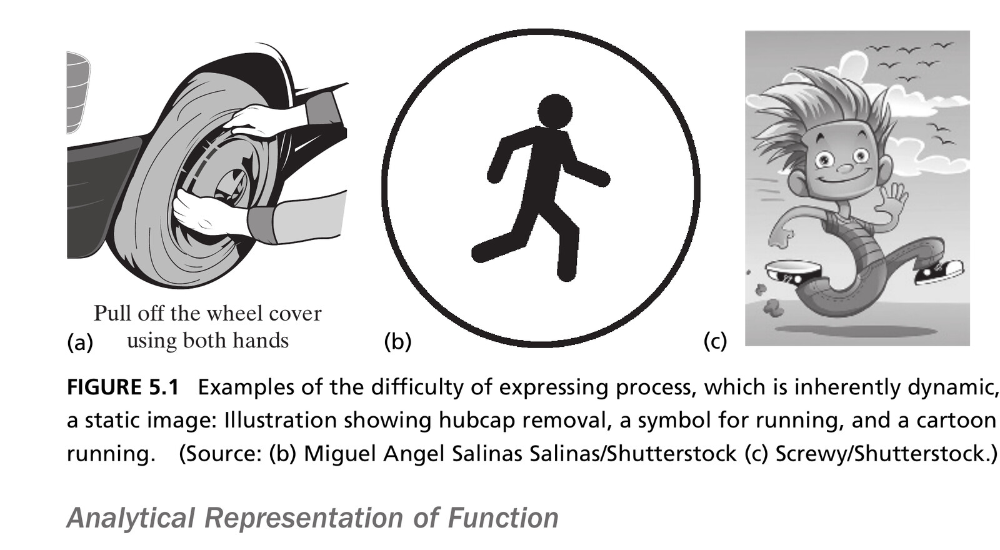{width=85% fig-align="center"}

::: {.side-caption}
Process is inherently dynamic — a static image always struggles to capture it. Source: Crawley, Cameron & Selva (2016), Fig. 5.1. Photo (b) Miguel Angel Salinas Salinas/Shutterstock, (c) Screwy/Shutterstock.
:::

## OPM Notation for Process and Operand {.smaller}

Three ways a process and operand can relate in OPM:

::: {.columns}
::: {.column width="33%"}
**Affect**\
(double arrow)\
The process changes an attribute of the operand, but doesn't create or destroy it.
:::
::: {.column width="33%"}
**Consume**\
(arrow into process)\
The operand no longer exists in its original form after the process.
:::
::: {.column width="33%"}
**Produce**\
(arrow out of process)\
The operand didn't exist before the process, and does after.
:::
:::

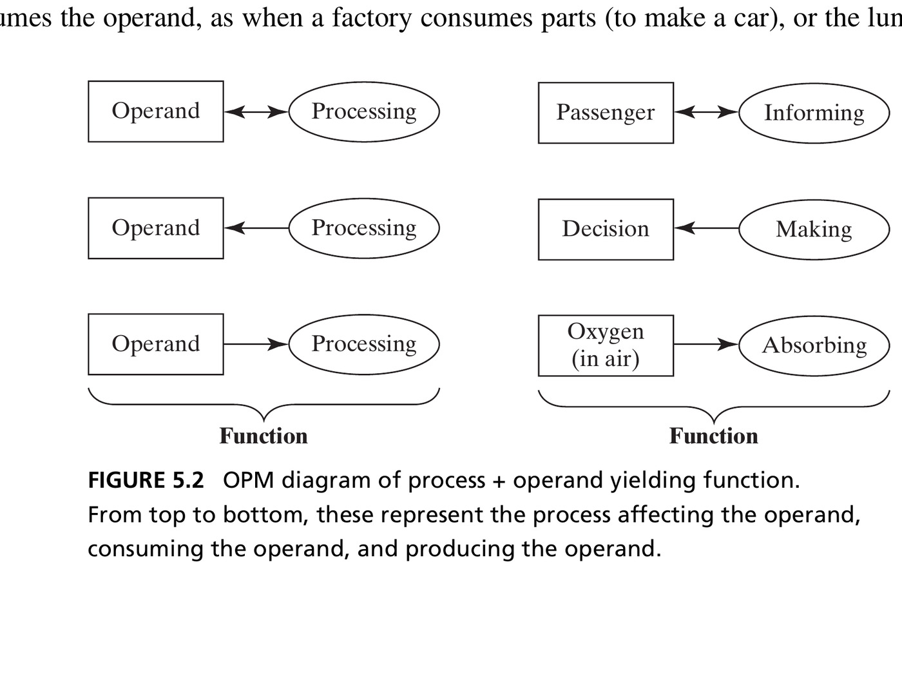{width=70% fig-align="center"}

## Figure 5.3 · The Canonical Model {.smaller}

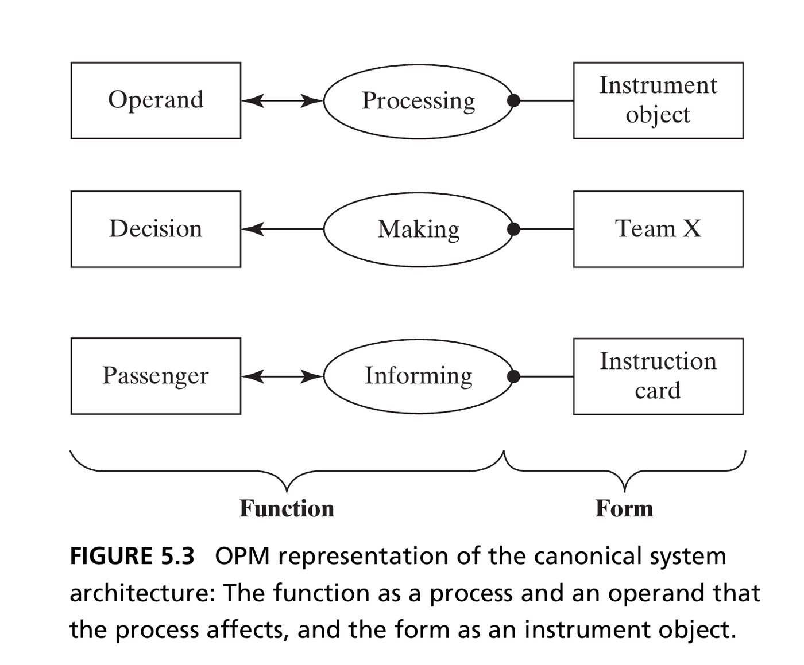{width=58% fig-align="center"}

::: {.side-caption}
Function is a process affecting an operand; form is the instrument object enabling the process. This single diagram is the seed of every architecture model in this course. Source: Crawley, Cameron & Selva (2016), Fig. 5.3.
:::

## Making States Explicit {.smaller}

::: {.columns}
::: {.column width="55%"}
- A more detailed OPM view shows the operand's **states** directly, and which state the process moves it from and to
- This is often the most useful representation: it shows exactly what "changes" means for a given operand
:::
::: {.column width="45%"}
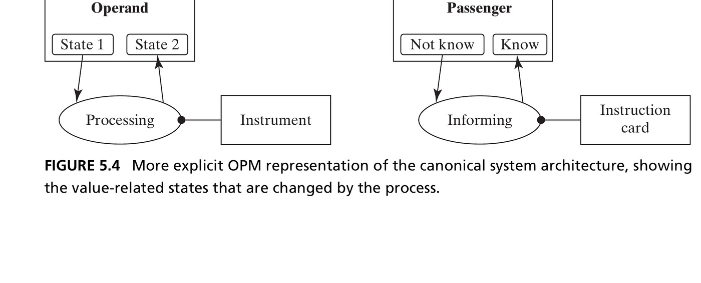{width=100%}
:::
:::

# 5.3 External Function and Value

## Table 5.1 · Questions for Defining Function {.smaller}

| Question | Produces |
|---|---|
| 5a. What is the primary externally delivered function? What is value? | The value-related operand, its state, and the process that changes it |
| 5b. What are the internal functions? | The internal processes and operands |
| 5c. What is the functional architecture? | The functional interactions among internal processes |
| 5d. What are secondary value-related functions? | Additional operands and processes delivering value |

## The Primary Externally Delivered Function {.smaller}

- The **primary externally delivered function** emerges when a process acts across the system boundary, at an interface
- The **value-related operand** is the one whose change in state is the reason the system exists
- To find it, ask: *What is the most specific operand the system acts on to deliver value? What attribute and state change is associated with that value? What process changes it?*

::: {.fragment .callout-tip}
Pump: operand is **water**, attribute is **pressure**, value-state is **high**, process is **pressurizing**.
:::

## Figure 5.7 · Increasing Levels of Detail

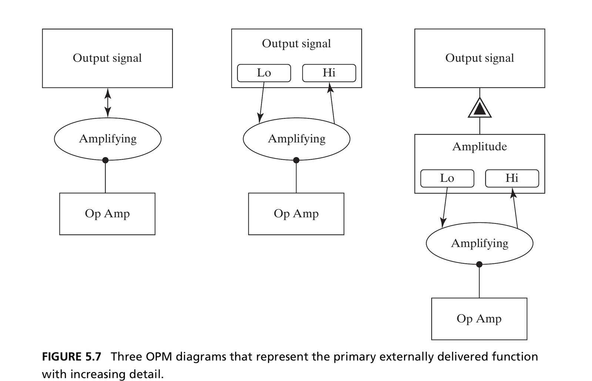{width=68% fig-align="center"}

::: {.side-caption}
Three equally valid OPM diagrams of the same external function — increasingly explicit about the operand's states. Source: Crawley, Cameron & Selva (2016), Fig. 5.7.
:::

## Figure 5.9 · The Pump's Value-Related Operand

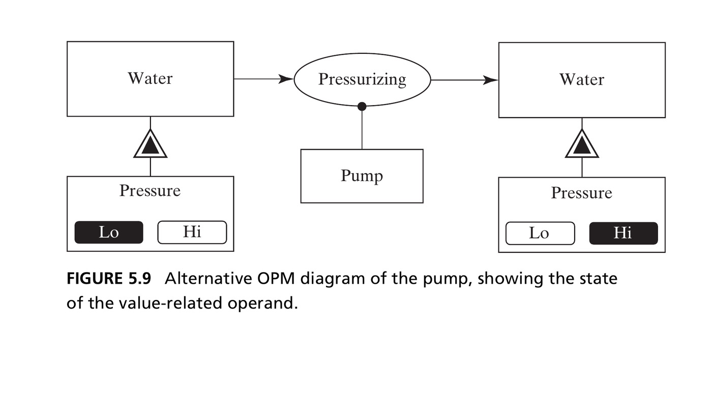{width=68% fig-align="center"}

::: {.side-caption}
Water is the operand; pressure is the value-related attribute; pressurizing is the process that moves it from Lo to Hi. Source: Crawley, Cameron & Selva (2016), Fig. 5.9.
:::

## Box 5.4–5.5 · Value and Benefit {.smaller}

::: {.callout-note appearance="simple" icon=false}
**Value** is the benefit received relative to the cost incurred.
:::

::: {.fragment .callout-note appearance="simple" icon=false}
*"Design is not just what it looks like and feels like. Design is how it works."* — Steve Jobs

*"Form and function should be one, joined in a spiritual union."* — Frank Lloyd Wright
:::

::: {.fragment}
Value = benefit at cost. Architecture is function enabled by form. Good architectures (desired function for minimal form) are nearly synonymous with the delivery of value.
:::

## Section 5.2–5.3 Summary {.smaller}

- Function is a process acting on an operand, enabled by an instrument of form
- The primary externally delivered function emerges when a process acts on the value-related operand across the system boundary
- Benefit materializes as a consequence of a process acting on the value-related operand — analyze the operand, its value-related attribute and state change, and the process

# 5.4 Internal Function

## Identifying Internal Functions {.smaller}

- Internal functions are the processes and operands **inside** the boundary that lead to the value-related external function
- No shortcut exists — this requires **domain knowledge**: reverse-engineering the elements of form, applying standard blueprints for your field, or using metaphors
- The three techniques from Chapter 2 for predicting emergence apply here too: **precedent, experiments, and analysis**

::: {.fragment .callout-tip}
Pump: increments kinetic energy (**accelerating**), then trades it for pressure (**diffusing**) — in addition to inflowing and outflowing.
:::

## Figure 5.10 · Internal Functions of Bread Slicing

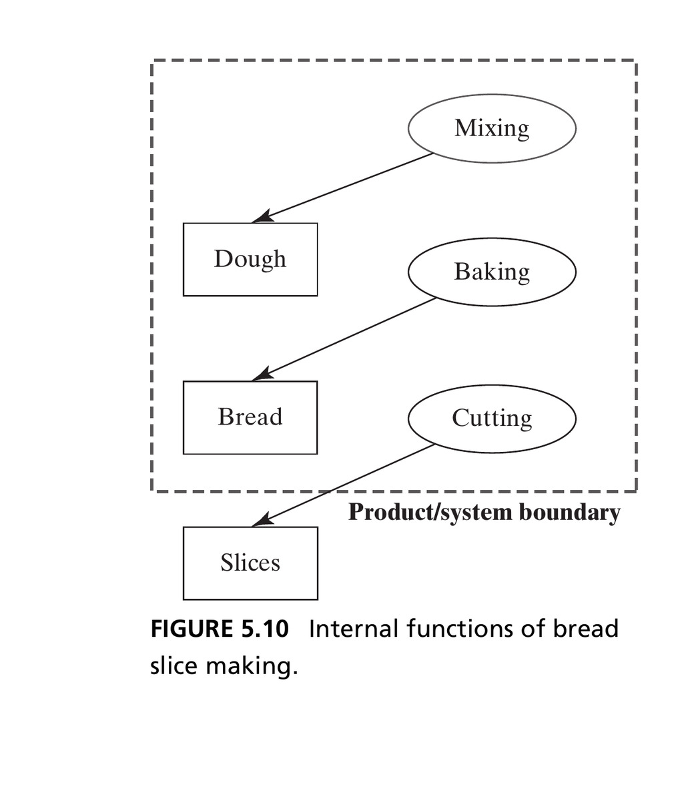{width=42% fig-align="center"}

::: {.side-caption}
Mixing produces dough, baking produces bread, cutting produces slices — inferred from a standard cooking blueprint. Source: Crawley, Cameron & Selva (2016), Fig. 5.10.
:::

## Figure 5.11 · Internal Functions of Bubblesort

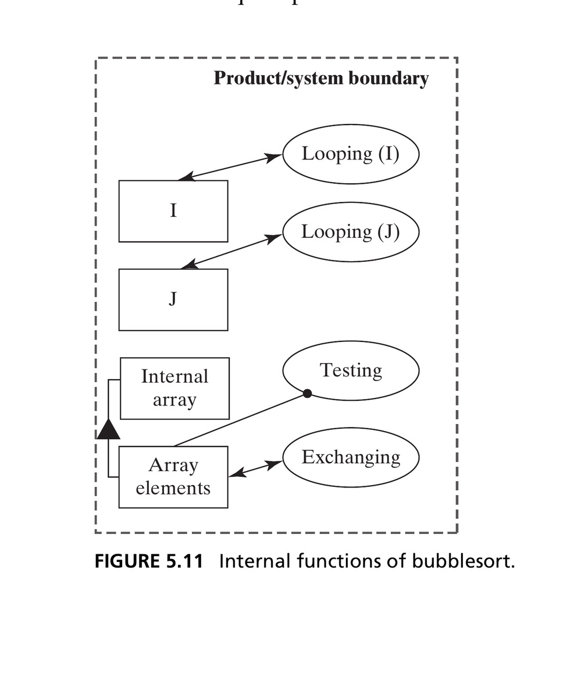{width=48% fig-align="center"}

::: {.side-caption}
Looping affects the index (doesn't create/destroy it); exchanging affects array entries; testing uses array elements as an instrument, without changing them. Source: Crawley, Cameron & Selva (2016), Fig. 5.11.
:::

# 5.5 Functional Interactions

## Functional Architecture {.smaller}

::: {.callout-important appearance="minimal" icon=false}
The **exchanged or shared operands are the functional interactions**. The functions plus the functional interactions are the **functional architecture**.
:::

- This is the key step in analyzing architecture: it's through the interaction of internal functions that the externally delivered function *emerges*
- Comparing the internal-function view to the functional-architecture view usually reveals **additional input/output operands** that were implicit before

## Figure 5.12 · Functional Architecture of Bread Slicing

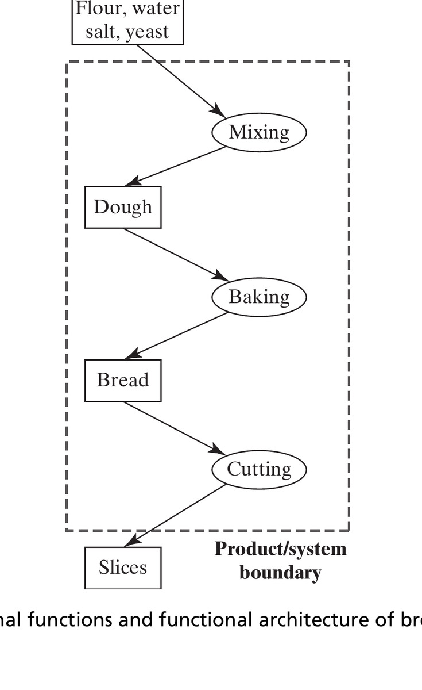{width=42% fig-align="center"}

::: {.side-caption}
Adding the raw-ingredient input reveals the full functional architecture — compare to Figure 5.10. Source: Crawley, Cameron & Selva (2016), Fig. 5.12.
:::

## Figure 5.14 · The Pump, Redrawn with States {.smaller}

::: {.columns}
::: {.column width="45%"}
- Figure 5.13 (not shown) makes the pump look like a simple flow-through system — but water isn't really destroyed and recreated at each stage
- Figure 5.14 captures what's *really* happening: the **state** of the water changes as it moves through the system
:::
::: {.column width="55%"}
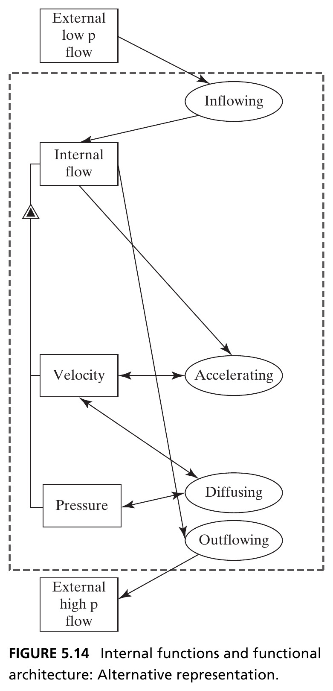{height=325px fig-align="center"}
:::
:::

::: {.fragment .callout-tip}
The interpretation of internal functions is never unique — the real test is whether it makes emergence easy to understand and predict.
:::

## The Value Pathway {.smaller}

- The **value pathway** is the chain of internal processes and operands that leads to the primary externally delivered function
- Not every operand and process is on it — some are:
  - **Not contributing to any desired function** (unwanted side-effects, poor design, legacy — a source of *gratuitous complexity*, Ch. 13)
  - **Supporting processes and form** (even further from the value pathway — Ch. 6)

## Figure 5.15 · Entities Not on the Value Pathway

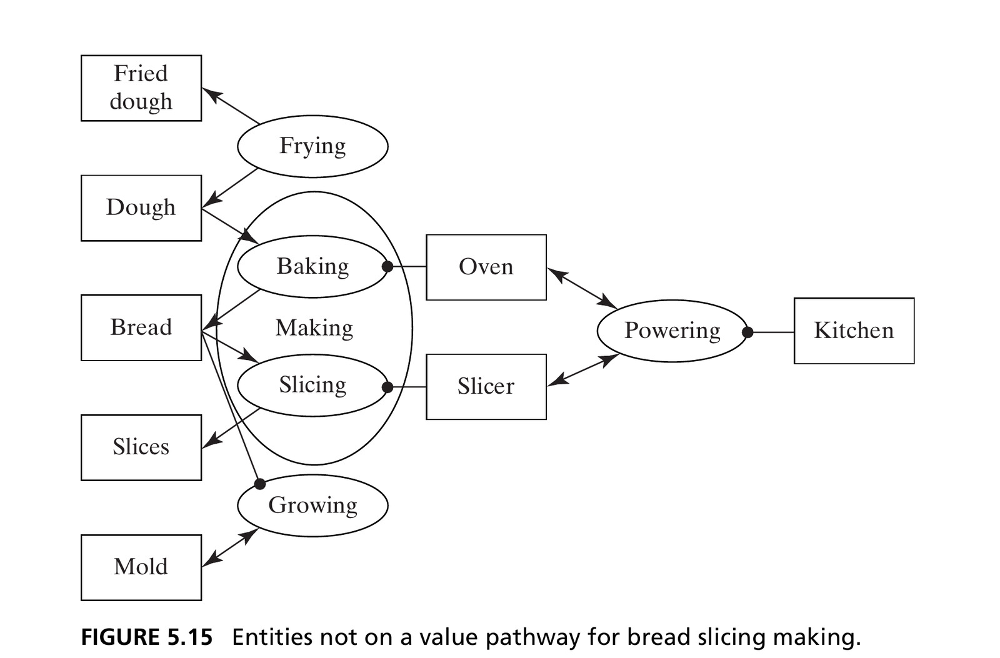{width=75% fig-align="center"}

::: {.side-caption}
Frying and growing mold aren't part of making sliced bread — unwanted or irrelevant. Powering (the kitchen) is a supporting function, one step further removed. Source: Crawley, Cameron & Selva (2016), Fig. 5.15.
:::

## Emergence and Zooming {.smaller}

- **Emergence**: the "smaller to larger" whole-part relationship for process — internal processes combine into the emergent external function
- **Zooming**: the reverse, "larger to larger" — reasoning from the emergent function back down into the internal processes that produce it

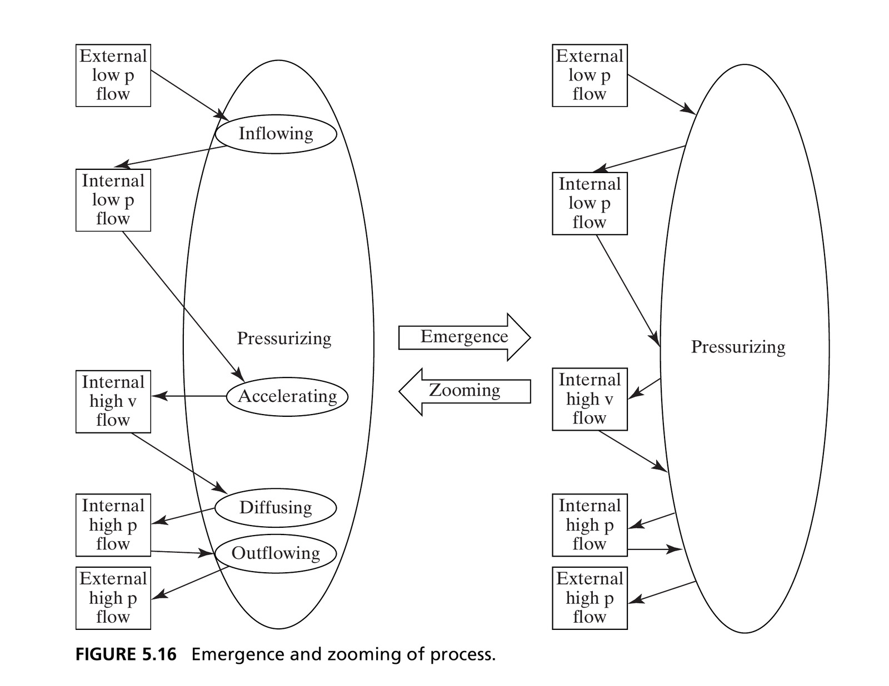{width=62% fig-align="center"}

## Functional Architecture in Software {.smaller}

- Software functions are of two types: **computational** statements (`A = B + C`) and functions that **dynamically allocate control** (`if... then...`)
- Control functions need operands too — **control tokens**, more implicit than explicit data variables
- This produces two parallel kinds of functional interaction: **data interactions** and **command (control) interactions**

## Figure 5.19 · Bubblesort with Command Operands

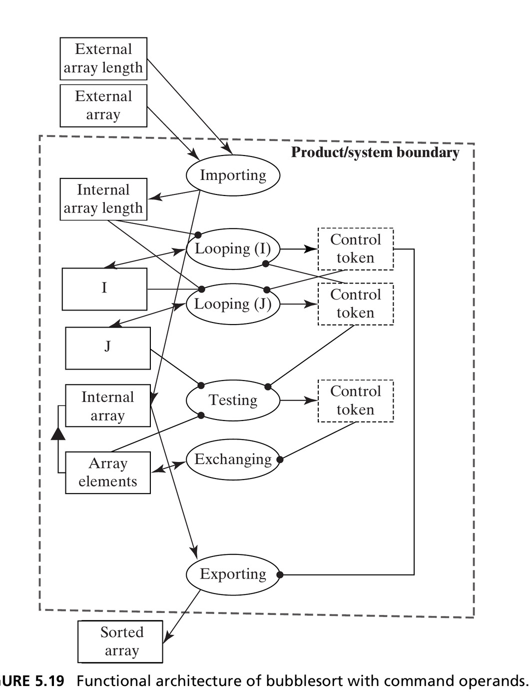{width=52% fig-align="center"}

::: {.side-caption}
Control tokens pass between Looping, Testing, and Exporting — the command interactions running in parallel with the data interactions. Source: Crawley, Cameron & Selva (2016), Fig. 5.19.
:::

## Section 5.5 Summary {.smaller}

- The entities of internal function, the internal processes, and the interactions of operands among processes establish the functional architecture
- Representation of internal function is not unique — it depends on interpretation and style
- The functional architecture generally contains a **value pathway**; we zoom the external function to identify it
- Diagrams can be simplified using **projections**, where interactions between processes are indicated by shared operands alone

# 5.6 Secondary Functions

## Secondary Value-Related Functions {.smaller}

- Once a system delivers its primary function, there's no reason it shouldn't deliver **other** value-related functions too
- Team X could also produce reports; the circulatory system also returns CO₂; an op-amp could also filter noise
- These matter: customers expect them, and they're a source of **competitive advantage**
- Procedure: repeat the same reasoning used for the primary value-related function

## Figure 5.20 · Secondary Functions of the Pump

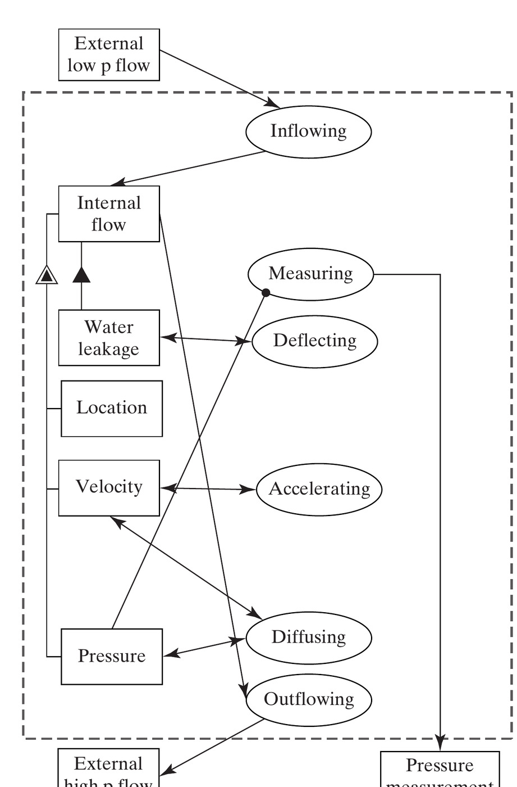{width=62% fig-align="center"}

::: {.side-caption}
A "slinger" deflects leaked water away from the motor; a sensor measures outlet pressure. Neither is on the primary value pathway, but both add real value. Source: Crawley, Cameron & Selva (2016), Fig. 5.20.
:::

## Chapter 5 Summary {.smaller}

- Function is a process (enabled by an instrument of form) acting on an operand
- The **primary externally delivered function** emerges where a process crosses the system boundary and changes the value-related operand
- **Internal functions** require domain knowledge to identify; their interactions (shared/exchanged operands) form the **functional architecture**
- The value pathway is what predicts emergence — everything else is either gratuitous or merely supporting
- Systems can deliver **secondary** value-related functions too, beyond the primary one

## Next: System Architecture

Chapter 6 combines form and function: the **mapping** of instrument objects to internal processes *is* the architecture of a system.

::: {.callout-tip}
**Reference**: Crawley, E., Cameron, B., & Selva, D. (2016). *System Architecture: Strategy and Product Development for Complex Systems*. Pearson. Chapter 5.
:::
