## From Form and Function to Architecture

- Chapter 4 gave us **form** — the elements and structure of what a system *is*
- Chapter 5 gave us **function** — the processes and operands of what a system *does*
- This chapter is the synthesis: **system architecture**, the mapping between form and function

::: {.fragment .callout-tip}
Chapter 7 adds the last piece — **concept** — completing the full definition of architecture.
:::

::: {.notes}
Open by telling students explicitly that this chapter is the payoff of the last two lectures: Chapter 4 gave us a rigorous vocabulary for form (elements, structure, the various types of formal relationships), and Chapter 5 gave us an equally rigorous vocabulary for function (processes, operands, the functional architecture, the value pathway). Neither chapter alone gets us to "architecture" — up to now we've had two separate descriptive systems, one for what a system *is* and one for what it *does*, without a formal way to connect them.

This chapter is exactly that connection: system architecture, defined as the mapping between form and function. That word "mapping" is doing real work and is worth emphasizing immediately, because it previews the central idea of the whole chapter — architecture isn't a third independent attribute alongside form and function, it's the specific assignment of *which* elements of form execute *which* processes.

The fragment flags something worth remembering as we go: even by the end of this chapter, our definition of architecture will still be incomplete. There's a fifth term — concept — that Chapter 7 introduces, and only once concept is added will the full formal definition (coming up on the next slide, Box 6.1) be completely explained. Tell students not to worry if "concept" feels underspecified today; that's deliberate, and it's next lecture's job.
:::

## Box 6.1 · Definition: System Architecture {.smaller}

::: {.callout-note appearance="simple" icon=false}
**System architecture** is the embodiment of *concept*, the allocation of physical/informational *function* to the elements of *form*, and the definition of *relationships* among the elements and with the surrounding *context*.
:::

- Five key terms: **function**, **form**, **relationship**, **context** (Ch. 2–5), and **concept** — a mental image or system vision that maps form and function (Ch. 7)
- Architecture is **not** an independent system attribute — it is the *mapping* between form and function

::: {.notes}
This is the book's fully mature, final definition of system architecture, and it's worth reading slowly and dissecting term by term, since every one of these five words has already been given a precise technical meaning in a previous chapter — this definition is not introducing new vocabulary, it's assembling vocabulary we already have. Function, form, relationship, and context were all defined carefully across Chapters 2 through 5. Concept is the only genuinely new term, defined here only loosely, as a mental image, notion, or system vision that maps form and function — full treatment waits for Chapter 7.

The second bullet is the single most important conceptual point in the entire chapter, worth writing on the board verbatim: architecture is *not* an independent attribute of a system, the way mass or color might be. It is specifically the *mapping* between form and function — architecture only exists in the relationship connecting the two, not as some third free-standing thing you could point to separately. This is why the chapter spends so much time on questions like "which instrument executes which process" rather than treating form and function as separate topics to enumerate independently, the way Chapters 4 and 5 did. Point students toward Table 6.1 (coming up in a couple of slides), which the book organizes the entire rest of the chapter around — every remaining section answers one of that table's questions.
:::

## Figure 6.1 · Architecture as Combination {.smaller}

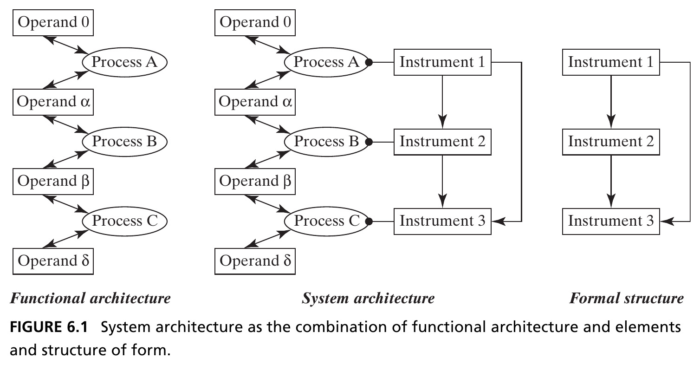{height=420px fig-align="center"}

::: {.side-caption}
Functional architecture (left) + formal structure (right) combine into system architecture (center): each process is now linked to the instrument object that executes it. Source: Crawley, Cameron & Selva (2016), Fig. 6.1.
:::

::: {.notes}
Walk through this figure as the visual embodiment of the previous slide's central claim. On the left is the *functional architecture* alone — exactly what Chapter 5 gave us: operands and processes, with no elements of form anywhere in sight. On the right is the *formal structure* alone — exactly what Chapter 4 gave us: a set of instrument objects and their formal (structural) relationships, with no functional information at all. In the center, system architecture is literally the combination of the two: the same processes from the left diagram, now each explicitly linked to the instrument object from the right diagram that actually executes it.

This is worth pausing on as a visual proof, not just an assertion: architecture in this diagram is nothing more than drawing a line connecting a process (from the function side) to an instrument (from the form side). There's no separate "architecture" box anywhere in the diagram — architecture *is* those connecting links. This concretely justifies the claim from the previous slide that architecture isn't a third independent thing, it's purely relational, existing only in the mapping between the two things we already know how to describe.
:::

## Box 6.2 · Principle of Value and Architecture {.smaller}

::: {.callout-note appearance="simple" icon=false}
*"Design is not just what it looks like and feels like. Design is how it works."* — Steve Jobs

*"Form and function should be one, joined in a spiritual union."* — Frank Lloyd Wright
:::

::: {.fragment}
**Value is benefit at cost.** Architecture is function enabled by form — benefit is delivered by function, cost is associated with form. Good architectures (desired function for minimal form) are nearly synonymous with the delivery of value.
:::

::: {.notes}
Both quotes here are pointing at the same underlying claim from slightly different angles, and it's worth having students articulate that claim themselves before revealing the fragment. Steve Jobs's quote pushes back against the popular misconception that "design" is primarily aesthetic — insisting instead that design is fundamentally about function, about how something works. Frank Lloyd Wright's quote goes further, insisting form and function shouldn't even be thought of as separate things to reconcile — they should be unified, "one."

The fragment cashes this out into the chapter's economic framing, and it's worth being precise about the definition given: value is benefit at cost. Recall from Chapter 2 that benefit comes from emergent function (the primary, and any secondary, value-related function a system delivers) — so benefit is fundamentally a function-side quantity. Cost, on the other hand, is chiefly associated with form — building, procuring, and maintaining the physical or informational elements a system is made of costs money, materials, and effort. Given this, a genuinely good architecture — one that maps a *lot* of desired function onto a *minimal* amount of form — is nearly synonymous with delivering good value, since it maximizes the benefit-to-cost ratio by definition. This economic framing recurs throughout the rest of the chapter (and the rest of the course): every time we talk about "elegant" or "efficient" mappings between form and function later on, this is fundamentally why that elegance matters — it isn't just aesthetic tidiness, it's value.
:::

# 6.2 System Architecture: Form and Function

## Mapping of Form and Function {.smaller}

How would we describe the architectural difference between two bridges with the *same* external function (carrying vehicles) and *similar* form (towers, roadbed, cables)?

::: {.fragment .callout-tip}
The roadbed of a cable-stay bridge carries load in **compression**; a suspension bridge's roadbed does not. The suspension bridge's anchors react to cable loads directly — letting it span much farther.
:::

::: {.notes}
This section-header slide opens with a genuinely good puzzle, worth posing to the room and letting students actually try to answer before revealing the fragment. Both bridge types deliver the exact same external function (carrying vehicles across a gap) and have superficially similar form (both have central towers, a roadbed, and cables) — so what, precisely, makes their architectures different? If students only had Chapter 4's form vocabulary and Chapter 5's function vocabulary separately, they could describe each bridge's parts and each bridge's job, but neither vocabulary alone explains why the two bridges are architecturally distinct, or why one can span farther than the other.

The fragment gives the real, load-path answer: in a cable-stay bridge, the roadbed itself carries compressive load (it's a working structural member); in a suspension bridge, the roadbed does not carry that compressive load — instead, the massive anchors at each end react directly against the tension pulling in from the main cables. This is exactly the kind of insight that only architecture-level thinking reveals: not "what parts exist" (form) and not "what function is delivered" (function) alone, but specifically *how* form maps onto the internal processes that deliver that function — which is why, mechanically, a suspension bridge's load path lets it span a much longer distance than a cable-stay bridge's can. This example is doing real work to motivate why "Question 6a" (introduced on the next slide) — how are instrument objects mapped to internal processes — is described by the book as the crux of this entire chapter, and really of the entire second part of the course.
:::

## Figure 6.2 · Two Bridges, Two Architectures

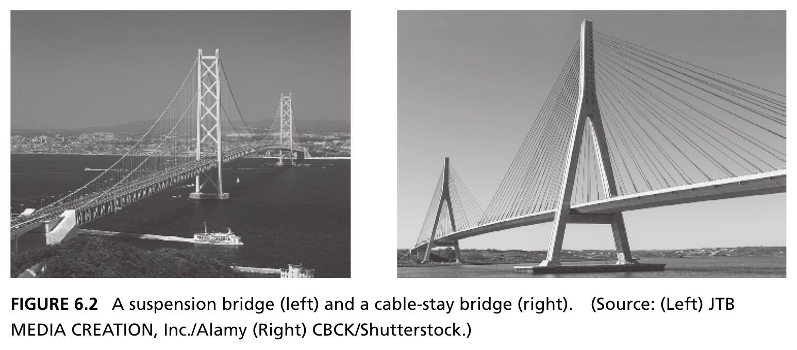{width=85% fig-align="center"}

::: {.side-caption}
A suspension bridge (left) and a cable-stay bridge (right) — same function, similar form, different architecture. Source: Crawley, Cameron & Selva (2016), Fig. 6.2. Photos: (left) JTB Media Creation/Alamy, (right) CBCK/Shutterstock.
:::

::: {.notes}
Give students a moment to actually look at both bridges and try to spot the architectural difference visually before you point it out — the towers, roadbed, and cables really do look broadly similar at a glance, which is exactly the point. The visual similarity is what makes this such a good teaching example: it proves that architecture is not something you can fully read off a system's form alone, the way you might naively expect. You have to understand the internal load path — how force actually flows from the roadbed, through the cables, to the anchors or towers — to see that these are, in fact, two fundamentally different architectures wearing similar-looking clothes.
:::

## Table 6.1 · Questions for Defining Architecture {.smaller}

| Question | Produces |
|---|---|
| 6a. How are instruments mapped to internal processes? | The idealized architecture |
| 6b. What non-idealities require added operands/processes/instruments? | The realistic architecture |
| 6c. What supporting functions and instruments support the value path? | Layers near the value pathway |
| 6d. What are the interfaces at the system boundaries? | Formal/functional interface definitions |
| 6e–g. What is the execution sequence? Parallel threads? Timing? | A sequence diagram; timing constraints |

::: {.side-caption}
**Question 6a** is the crux of Part 2 — and of this entire text.
:::

::: {.notes}
Present this table as the literal outline of the rest of the chapter — every section from here forward exists to answer one specific row. Question 6a — how instrument objects map to internal processes, and how that mapping supports functional interaction and influences emergence — produces the *idealized* architecture, and the book calls it out explicitly as the crux of Part 2, and of the entire text. We'll spend Section 6.2 (the rest of this section) developing that idealized mapping.

Question 6b asks what non-idealities require additional operands, processes, and instruments beyond the idealized picture — this produces the *realistic* architecture, and is the subject of the first part of Section 6.3. Question 6c asks what supporting functions and instruments are needed to keep the value-pathway instruments actually working (structurally, energetically, informatically) — producing the layered picture also covered in Section 6.3. Question 6d asks about interfaces at the system's boundaries — also Section 6.3. And questions 6e through 6g, grouped together here, ask about execution sequence, parallel threads, and timing — these become Section 6.4's subject, operational behavior. Point out to students that having this table as a mental checklist is genuinely useful beyond this course: when analyzing *any* system's architecture in the future, working through these same seven questions in order is a reliable, comprehensive procedure.
:::

## The Simplest Case: One-to-One Flow-Through {.smaller}

::: {.columns}
::: {.column width="55%"}
- The center diagram of Figure 6.1 is the simplest, most commonly *assumed* architecture: one instrument per process, one process per instrument
- Each process produces a distinct operand — function reduces to "produce + outgoing operand"
- This is the **independence axiom** [Suh, 1998]. If only life were so simple!
:::
::: {.column width="45%"}
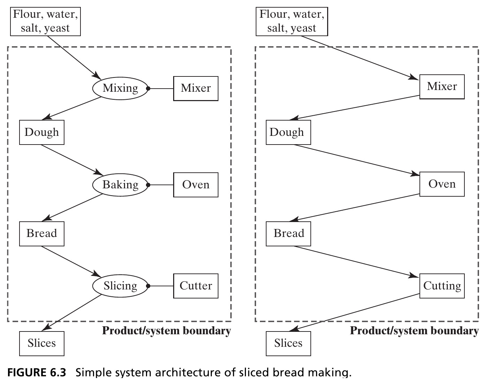{width=100%}
:::
:::

::: {.notes}
Begin answering Question 6a with the easiest possible case, which the center diagram of Figure 6.1 (revisited here) represents: exactly one instrument object executes each process, and exactly one process is executed by each instrument — a clean, uncomplicated one-to-one mapping. In this simplest case, each process just produces a single distinct operand as its output, so the whole function of the system can be described in the simple template "produce, then pass along an outgoing operand" at every stage.

Give this simplification its formal name: it's known as the *independence axiom*, credited to Nam Suh's work on axiomatic design (the same Suh who gave us "zigzagging" back in Chapter 3). The independence axiom, roughly, holds that each functional requirement should be satisfiable by adjusting exactly one corresponding design parameter, independently of the others. The dry, slightly wistful closing line on the slide — "if only life were so simple" — is worth delivering with a knowing pause, because the next several slides are entirely devoted to showing, with real examples, exactly how quickly this clean assumption breaks down once you look at real systems even slightly more closely.
:::

## Figure 6.3 · Simple Architecture of Bread Slicing {.smaller}

- Left: mixer → mixing, oven → baking, cutter → slicing — a clean one-to-one map
- Right: the mental shortcut this enables — form becomes a *proxy* for process. Dough "goes into" an oven; bread "emerges." Suppress the processes and reason directly in terms of form
- Works — but is it **generalizable**?

::: {.notes}
Walk through the bread-slicing example as the concrete instance of the independence axiom just introduced: a mixer executes mixing, an oven executes baking, a cutter executes slicing — three processes, three instruments, perfectly one-to-one. Point students to the left-hand diagram (referenced from the previous section's Figure 6.1) as this clean case laid out explicitly.

The right-hand version of the same diagram shows something genuinely useful this simplicity affords us: when form maps one-to-one onto process this cleanly, form can act as a *proxy* for process, and we can suppress the process ovals altogether and just talk in terms of form directly — dough "goes into" the oven, and bread "emerges" from it, without explicitly naming "baking" as a separate step in our mental model. This is a real cognitive convenience, and it's the reason we so often talk about systems purely in terms of their physical components ("the oven bakes the bread") without consciously separating out the underlying process.

But close by posing the question the slide poses, and let it hang before moving to the next slide: does this convenient proxy trick actually generalize to more realistic systems? The next figure answers that question directly, and the answer is no.
:::

## Figure 6.4 · A Not-So-Simple Architecture {.smaller}

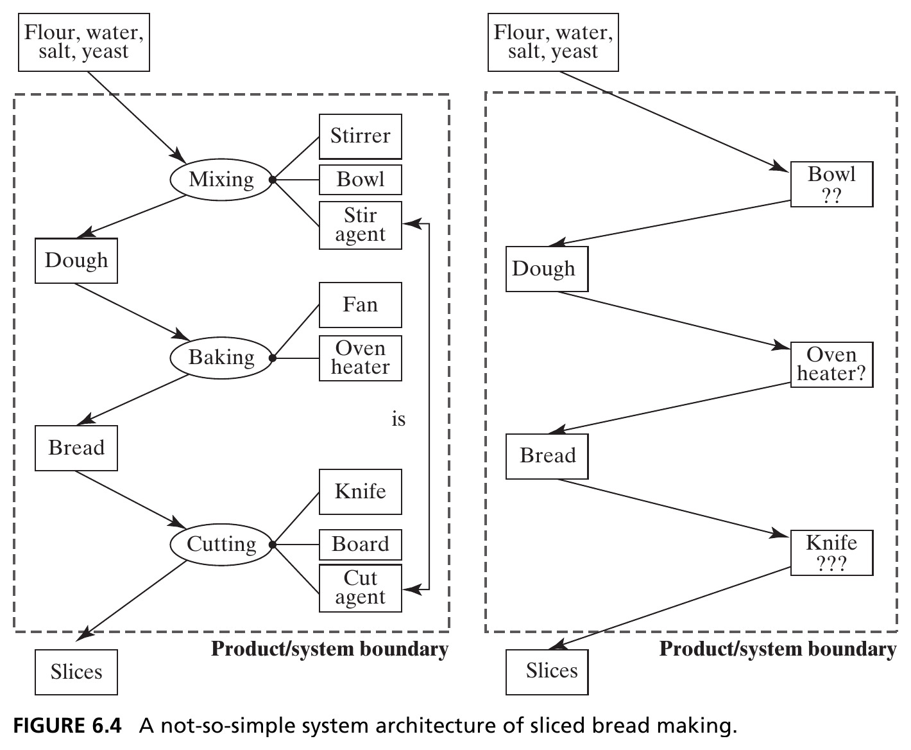{height=400px fig-align="center"}

::: {.side-caption}
"Mixer" replaced by stirrer + bowl + stir agent (the cook) — one instrument (the cook) now maps to *two* processes. The proxy shortcut on the right breaks down: what does it mean to go "into" a bowl or a knife? Source: Crawley, Cameron & Selva (2016), Fig. 6.4.
:::

::: {.notes}
This figure directly answers the "is it generalizable" question from the previous slide, and the answer is a clear no. Simply decompose the abstraction "mixer" one level further into its real constituent parts — a stirrer (like a spoon), a bowl, and a stir agent (the cook actually doing the stirring) — and the clean one-to-one mapping immediately breaks. Do the same for cutting: instead of a single "cutter," we now have a knife, a board, and a cut agent — and the key observation the book makes explicit is that the "stir agent" and the "cut agent" are, in fact, the *same person*, the cook, shown as a single instrument object linked structurally to both processes. One instrument, now mapped to two distinct processes — the independence axiom has already broken.

Point to the right-hand version of this more detailed diagram to show exactly why the earlier "form as proxy for process" shortcut stops making sense once mapping is no longer one-to-one: what does it actually mean, intuitively, to say dough "goes into" a bowl, or bread "goes into" a knife? The proxy trick relied entirely on there being a clean, unambiguous process each piece of form was standing in for — once an instrument (the cook) serves multiple processes, that convenient shorthand collapses, and we're forced back to reasoning explicitly about processes and instruments separately, exactly as the full OPM-style diagrams do. This is the key transition moment of the section: real systems are not one-to-one, and the rest of this section catalogs the actual patterns that show up instead.
:::

## Two Special Cases Worth Naming {.smaller}

::: {.columns}
::: {.column width="50%"}
**No instrument shown**

Ice melting into water — is there really no instrument? Every process needs *something* enabling it; when none appears, ask what really is the enabler.
:::
::: {.column width="50%"}
**The operand is the instrument**

A person walking: "people walk themselves." An operand that *exists prior to* the process can double as its own instrument — form and operand objects are not mutually exclusive.
:::
:::

::: {.notes}
Introduce two genuinely tricky edge cases that are worth naming explicitly, since students will run into both constantly once they start doing real architectural analysis of their own systems. The first: sometimes a diagram of a process shows no instrument object at all — the book's example is ice melting into water. Push students on this: is it really possible for a process to have no instrument whatsoever? The book's answer is no — every process needs *something* to enable it (in the case of melting, ambient heat, or the surrounding warm environment, is the real, if unstated, enabler); when a diagram appears to show no instrument, that's a signal to dig further and ask what the true enabler actually is, not to conclude instruments are sometimes genuinely optional.

The second, subtler case: sometimes the operand of a process turns out to also be that same process's instrument. The book's memorable example: people "walk themselves" — a person is simultaneously the thing whose state changes (they move from one location to another, so they're the operand) *and* the thing enabling the walking to happen at all (so they're also the instrument). This resolves what looks like a paradox by going back carefully to the formal definitions from earlier chapters: form was defined as something that exists *prior to* the execution of function, and is instrumental in that execution; an operand was defined as something that need *not* exist prior to the process, and is acted upon by it. A walking person satisfies the form/instrument definition perfectly (they exist before they start walking, and they're what makes walking happen) — but they *also* satisfy the operand definition (they're the thing being acted upon and changed by the process). The conclusion worth emphasizing: form objects and operand objects are not mutually exclusive categories — the same real-world object can genuinely be both at once, depending on which relationship you're describing.
:::

## Figure 6.5 · Fragments of Simple Architectures {.smaller}

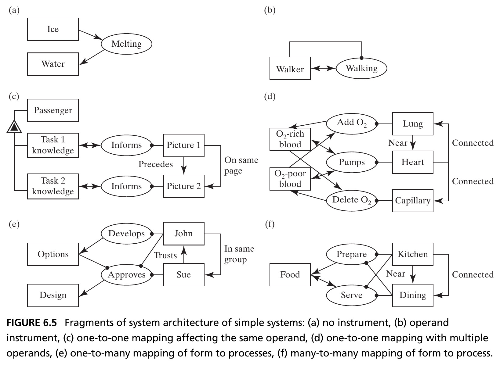{height=400px fig-align="center"}

::: {.side-caption}
Left to right, top to bottom: (a) no instrument, (b) operand-as-instrument, (c) one-to-one affecting the same operand (emergency card), (d) one-to-one with multiple operands (circulatory system), (e) one-to-many form-to-process (Team X's John), (f) many-to-many (kitchen/dining). Source: Crawley, Cameron & Selva (2016), Fig. 6.5.
:::

::: {.notes}
Use this figure as a gallery of six worked micro-examples, and take a moment on each one, since together they cover essentially every important pattern that recurs throughout the rest of the chapter. Panel (a) is the ice-melting "no instrument shown" case just discussed; panel (b) is the "walker walks themselves" operand-as-instrument case. Panels (c) through (f) — covered in detail on the next slide — introduce four *additional* patterns: two genuinely one-to-one cases that are nonetheless more subtle than they first appear (the airline safety card and the circulatory system), and two cases of real many-to-one and many-to-many mapping (Team X's John, and a kitchen/dining example), which is where the independence axiom really and truly stops applying. Tell students this figure is worth returning to as a reference any time they're trying to classify a mapping pattern they've found in their own system analysis.
:::

## What These Fragments Teach {.smaller}

- **(c)** Passenger safety card: each picture informs a distinct task-knowledge state — one-to-one mapping, but the operands are coupled (attributes of the same passenger)
- **(d)** Circulatory system: heart/lung/capillary map one-to-one to processes, but on the operand side, pumping affects *both* oxygen-rich and oxygen-poor blood
- **(e)–(f)** John is instrument to *two* processes; kitchen and dining each support *both* preparing and serving — many-to-many mapping is a very common occurrence, and it demands real attention from the architect

::: {.notes}
Draw out the specific lesson from each remaining fragment. In (c), the airline emergency-instruction card, each individual picture maps one-to-one onto a single process — "informs" — but look closely at the operand side: each picture builds a different piece of the passenger's task knowledge, and all of those distinct pieces of knowledge are, in fact, attributes of one and the same passenger. So even though the form-to-process mapping is clean, the operands aren't fully independent — they're all coupled through being properties of the same underlying entity. This is a genuinely subtle form of coupling students might otherwise miss.

In (d), the circulatory system revisited from Chapter 2: heart, lung, and capillary each map one-to-one onto a single process (pumping, gas-exchanging, and so on) — but again, look at the operand side: the pumping process alone affects *both* oxygen-rich and oxygen-poor blood as it moves through the system. One-to-one instrument-to-process mapping doesn't guarantee simplicity on the operand side.

In (e) and (f), we finally reach genuine many-to-one and many-to-many mapping, which the independence axiom explicitly ruled out. John, from Team X, is shown as the instrument for two distinct processes — he might develop design options *and* help choose among them. And in the kitchen/dining fragment, both the kitchen and the dining room support *both* preparing and serving food (some prep happens in the dining room too — tossing a salad, carving meat — and some serving happens directly from the kitchen, buffet-style). The takeaway worth stressing: many-to-many mapping between form and function isn't a rare exception, it's genuinely common in real systems, and precisely because it's common, it demands real, deliberate attention from the architect — you can't just assume the clean one-to-one case and move on.
:::

## Figure 6.8 · The Pump's Idealized Architecture

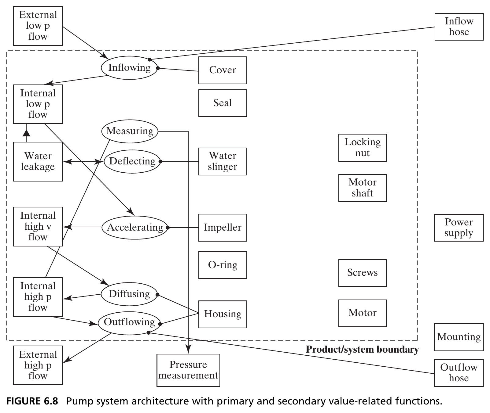{height=370px fig-align="center"}

::: {.side-caption}
Cover, impeller, and housing map (nearly) one-to-one onto inflowing/accelerating/diffusing/outflowing — the primary value pathway — plus the secondary functions of measuring and deflecting. Many instruments (seal, O-ring, motor, screws...) are still unassigned. Source: Crawley, Cameron & Selva (2016), Fig. 6.8.
:::

::: {.notes}
Return to the centrifugal pump — the running example carried over from Chapters 4 and 5 — and apply the mapping ideas developed so far. Walk through the primary value pathway: the cover is the instrument of inflowing, the impeller is the instrument of accelerating, and the housing is the instrument of both diffusing and outflowing — so the housing alone actually maps to two processes, another concrete instance of the many-to-one pattern just discussed. Beyond the primary pathway, note the secondary value-related functions from Chapter 5 make their appearance here too: measuring (there should be an instrument for this — a sensor — though notice the book flags that none was actually included on the original parts list from Chapter 4, an interesting gap worth calling out) and deflecting (handled by the water slinger, which protects the motor from leaked water).

The important, honest observation to make explicit here: a large number of instruments from the pump's original parts list — the seal, O-ring, motor, motor shaft, screws, locking nut, power supply — are still completely unassigned to any process in this diagram. This isn't a mistake or an oversight in the analysis; it's the natural, expected result of having so far only identified the *idealized* value-delivering architecture (Question 6a from Table 6.1). Flag for students that this dangling list of unassigned instruments is exactly the setup for Section 6.3's discussion of non-idealities — these leftover parts exist to do something, and we'll find out what over the next several slides.
:::

## Figure 6.9 · Bubblesort's Architecture

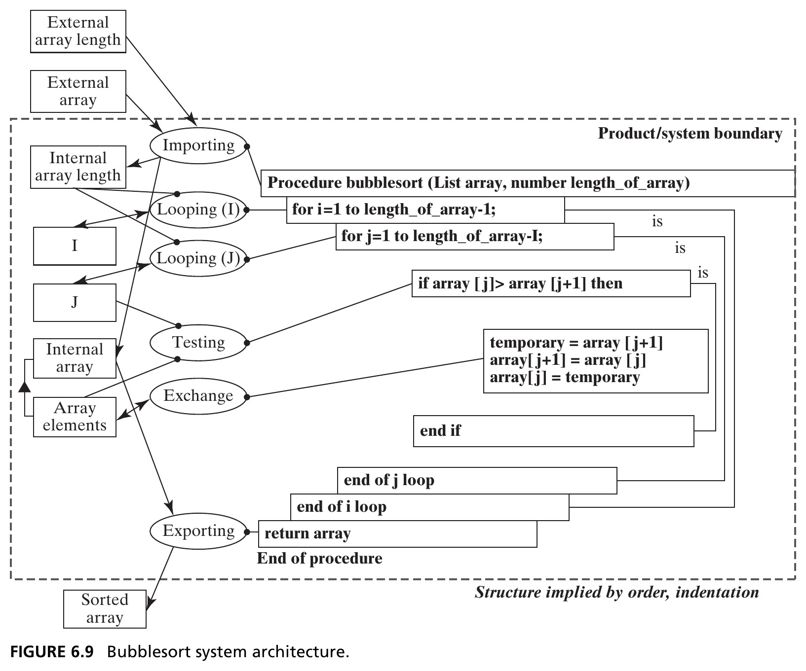{height=400px fig-align="center"}

::: {.side-caption}
Importing, looping, testing, and exporting each map to a single line of code; the exchanging process spans three lines. The emergence of sorting is clear: the `if` creates conditional exchange, the two `for` loops add the sweep that produces the sorted result. Source: Crawley, Cameron & Selva (2016), Fig. 6.9.
:::

::: {.notes}
Apply the exact same mapping analysis to the second running example from Chapter 5, the bubblesort software routine. Most of the processes here map cleanly to a single line of code as their instrument: importing, the two nested looping processes, testing, and exporting each correspond to one line. The exchanging process is the interesting exception — it's spread across three separate lines of code (the temporary-variable swap sequence), so here a single process maps to *multiple* instrument lines, the mirror image of the many-to-one pattern seen with the pump's housing.

Walk through where the emergent sorting behavior actually comes from, since this is a satisfying, precise answer that's worth spelling out: the conditional `if` statement is what creates *conditional* exchanging — swapping only happens when the test condition is true. Layer the two nested `for` loops on top of that, and you get a full sweep through the array, repeated enough times to guarantee everything ends up in order — that combination of conditional exchange plus a repeated sweep is exactly what produces the emergent, desired function of sorting. This is a nice, fully worked, mechanistic example of "emergence from mapping" that students can trace through with total precision, unlike the fuzzier real-world examples — worth using it as the concrete anchor when the pump examples start to feel more hand-wavy.
:::

## Section 6.2 Summary {.smaller}

- The system architecture consists of instrument objects mapped onto internal processes; processes interact through shared or exchanged operands
- The mapping can be **one-to-one** (the simple, assumed case), **many-to-one**, or **one instrument to many processes** — an operand existing prior to a process can even act as its own instrument
- **Structure supports emergence**: connections enable functional interaction directly; location/placement and intangible relationships (Ch. 4) inform and influence it
- Structure also **informs performance** — how well the system executes its functions

::: {.notes}
Use this as a checkpoint before moving into Section 6.3. By now students should be comfortable that architecture is fundamentally about mapping instrument objects onto internal processes, and that this mapping is very often *not* one-to-one — many-to-one and one-to-many patterns are the norm in real systems, not the exception, and even an operand can double as its own instrument in the right circumstances.

The last two bullets deserve special emphasis, since they connect this chapter back to Chapter 4's structural relationships in a way that's easy to skim past. Structure (the formal relationships among elements of form, from Chapter 4 — connections, location, and intangible relationships) *supports* emergence, but does so in two different ways depending on the type: connections generally *directly enable* functional interaction (recall the circulatory system — the physical connection between heart and lung is what actually lets blood exchange happen), while location/placement and intangible relationships tend to *inform and influence* function and performance rather than strictly enable it (the heart and lungs being physically close together doesn't enable blood exchange per se, but it does make pumping more efficient, informing performance rather than gating whether the function happens at all). This is a genuinely useful distinction for students to carry forward — not all structural relationships play the same role in supporting a system's function.
:::

# 6.3 Non-idealities, Supporting Layers, and Interfaces

## Non-idealities in System Architecture {.smaller}

- Looking back at Figure 6.8: the seal, O-ring, motor, motor shaft, screws, locking nut, and power supply are **not yet** associated with any process
- These exist because the idealized value pathway is *not sufficient* — real systems must also **manage the operands**: containing them, moving them, storing them, protecting against uncertainty
- The seal and O-ring are "close to" the value pathway (they touch the water) but exist purely to **contain** it, not to move it toward the value-related state

::: {.fragment .callout-tip}
Bubblesort, being a deterministic digital system, has *no* non-idealities in Figure 6.9 — though a real run-time implementation would need instructions for moving and storing data.
:::

::: {.notes}
Pick up exactly where the pump example left off: that pile of leftover, unassigned instruments (seal, O-ring, motor, motor shaft, screws, locking nut, power supply) is the section's starting point, and now we finally explain what they're for. The honest answer is that up to this point, we've only analyzed the pump's *idealized* value-delivery pathway — and getting that pathway right is necessary, but nowhere near sufficient, for a system to actually work in the real world. Real systems need to manage their operands in ways the idealized picture completely ignores: containing them so they don't escape, moving them to where they're needed, storing them, and generally protecting the value-delivery process against real-world uncertainty.

Apply this reasoning concretely to the pump's remaining parts: the seal and the O-ring are both physically "close to" the value pathway (they're literally touching the water as it moves through the pump) — but neither one is moving the water toward its desired value-related state (higher pressure). Their entire job is *containment* — keeping the water from leaking out where it shouldn't. This is a genuinely useful reverse-engineering technique worth naming explicitly for students: when you find an unassigned instrument in a real system, ask what non-ideality it's addressing — is it there to contain something, move something, store something, or protect against some uncertainty?

The fragment offers a clean contrast that sharpens the concept by exception: bubblesort, being a fully deterministic digital algorithm, has no non-idealities at all in its idealized architecture diagram — there's no analog of leakage or containment failure to worry about at this level of abstraction. But push students to think one level deeper, exactly as the fragment does: a *real* run-time implementation of this same code, running on actual hardware, absolutely would need additional instructions for moving data in and out of memory and storing intermediate values — those are real non-idealities, just hidden one layer below the abstraction the diagram is drawn at.
:::

## Supporting Functions and Layers in Architecture {.smaller}

- Objects on the value pathway (impeller, cover) must themselves be **supported** — against gravity, applied loads, and must be **powered** and **controlled**
- A classic case: **networked information systems**. All value is created in the *application* layer (OSI 7-layer / Internet 4-layer models) — every layer below is purely supporting
- General pattern: **value operands → value processes → value instruments**, then alternating layers of **supporting processes and instruments** (mechanical, energetic, informatic support)

::: {.notes}
Introduce a second, distinct category of "extra" architecture beyond non-idealities: supporting functions and layers. The core insight is simple but far-reaching: even the instruments that genuinely *are* on the value pathway — the impeller, the cover — cannot just float in space; physical objects need to be structurally supported against gravity and applied loads, and most active components additionally need to be powered and, often, controlled. None of that support work delivers value directly, yet without it the value-delivering instruments couldn't function at all.

Give students the networked-information-systems example as the canonical, widely-recognized case of this pattern, since most of them will have at least a passing familiarity with how network protocol stacks work: in both the classic OSI seven-layer model and the simpler Internet four-layer model, all of the actual *value* — the content a user cares about — is created in the topmost, application layer. Every single layer below that (transport, network, link, physical) exists purely to *support* getting that application-layer content where it needs to go; none of those lower layers create value on their own.

Generalize this into the pattern the book proposes for architecture in general: start with value operands, which are acted on by value processes, which are executed by value instruments — that's the core value pathway from before. Then, layered around and beneath that core, add alternating layers of supporting processes and supporting instruments, addressing whatever kind of support the value instruments specifically need — mechanical support (structure), energetic support (power), or informatic support (control/data), among others. This layered mental model is exactly what the next figure will show fully drawn out for the pump.
:::

## Figure 6.10 · The Pump, Fully Layered {.smaller}

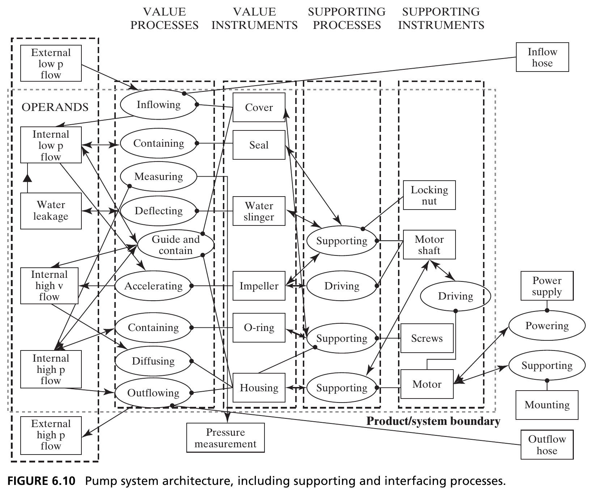{height=400px fig-align="center"}

::: {.side-caption}
Value processes/instruments (left) plus supporting processes/instruments (right): the motor *drives* the shaft but also *supports* it; the housing (a value instrument) also *supports* the cover and O-ring. Assignment to a column is not unique — but instruments should sit as close to the value pathway as possible. Source: Crawley, Cameron & Selva (2016), Fig. 6.10.
:::

::: {.notes}
This is the fully-worked payoff of the previous slide's general pattern, applied concretely to the pump — and it's the point where every single instrument from the original parts list finally gets assigned to *something*. Walk through the two interesting details the book specifically flags, since they nicely illustrate that this layered picture isn't perfectly clean either. First: the motor doesn't just power the shaft — it plays a dual role, simultaneously *driving* the shaft (an active, value-adjacent process) and *supporting* it (a purely structural role). Second: the housing, which is squarely a value-pathway instrument (it diffuses and outflows the water), *also* takes on a supporting role for the cover and the O-ring — a value instrument moonlighting as a supporting instrument for other parts.

The explicit lesson to draw out, stated directly in the book: the assignment of any given instrument to the "value" column versus the "supporting" column is not unique or perfectly clean — real components very often play more than one role simultaneously, exactly like the motor and the housing here. The practical guidance the book offers instead of a hard rule: when in doubt, place instruments as close to the value pathway as the analysis reasonably supports, since that keeps the diagram's organization maximally informative about what really matters for delivering the system's core value.
:::

## System Interfaces in Form and Function {.smaller}

- Boundaries are central to defining a system (Ch. 2) — the **system interface** is where something is passed into or out of the system, at a boundary crossing
- For the pump, Figure 6.10 shows five: inflowing fluid, outflowing fluid, external powering, external supporting, and pressure measurement leaving the system

::: {.fragment}
It is the architect's **obligation to specify** interfaces — by citing a standard, or writing an interface control document.
:::

::: {.notes}
Return to the system boundary — a concept students have now seen in three different chapters (Chapter 2's original definition, Chapter 4's formal boundary, and now here) — and give it its most operational treatment yet: a system interface exists at exactly the point where something is passed into or out of the system, crossing that boundary. This directly answers Question 6d from Table 6.1.

Count through the pump's five interfaces concretely, using the fully-layered Figure 6.10 as the reference: fluid inflowing into the system (through the inflow hose), fluid outflowing (through the outflow hose), external powering coming in (from the power supply), external supporting coming in (the mounting), and — easy to overlook, since it's an *output* rather than an input — the pressure measurement signal leaving the system. Five distinct crossings of the boundary, in both directions, across three different domains (mechanical/fluid, electrical, and informational).

The fragment states an important professional-responsibility point, worth emphasizing directly to students who will eventually be doing real systems work: it is specifically the *architect's* obligation to specify these interfaces precisely, either by citing an existing external standard (a connector spec, a protocol, a fitting standard) or by writing a dedicated interface control document when no suitable standard exists. Interfaces left informally or ambiguously specified are a classic, recurring source of integration failure in real engineering programs — this obligation isn't a bureaucratic formality, it's how the risk of mismatched assumptions between two connecting systems gets managed.
:::

## Figure 6.11 · Model of an Interface {.smaller}

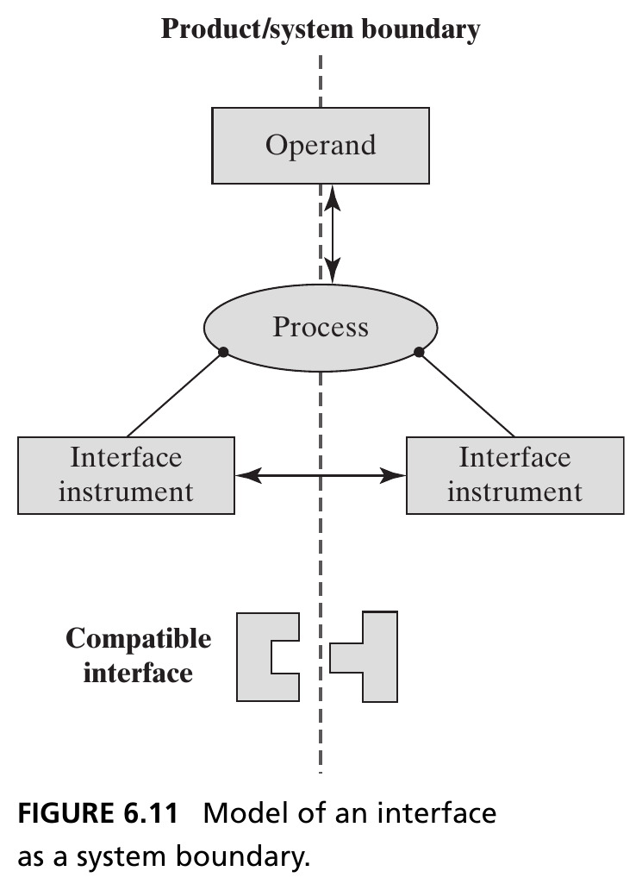{height=400px fig-align="center"}

::: {.side-caption}
An interface has both form and function: the shared **operand**, the shared **process**, and two **interface instruments** — either androgynous (identical on both sides) or compatible (different, but fitting together). Source: Crawley, Cameron & Selva (2016), Fig. 6.11.
:::

::: {.notes}
Give students the precise, minimum information content that any well-specified interface must contain, using this generic model as the template. Like every entity we've studied all course, an interface itself has both form and function: the shared operand is whatever's actually passing through the boundary (and note it's the *same* operand on both sides — the water doesn't change identity as it crosses); the shared, or common, process is the act of passing that operand across (usually described identically from both sides too); and there are two distinct interface instruments, one belonging to each side of the boundary, that have some formal relationship to each other.

Introduce the two named relationship types for how those two interface instruments relate: they can be *androgynous*, meaning the interface form is literally identical on both sides (think of a coupling where either half can mate with an identical other half); or they can be *compatible*, meaning the two sides are genuinely different in form, but are specifically designed to fit together (a classic male/female connector pair, for instance). Both patterns show up constantly in real interfaces, and it's worth asking students to think of an example of each from something they use daily — USB-C to USB-C is a nice androgynous example; a standard electrical plug and wall socket is a nice compatible example — right before moving to the pump's own worked interfaces on the next slide.
:::

## Figure 6.12 · Four Interfaces of the Pump {.smaller}

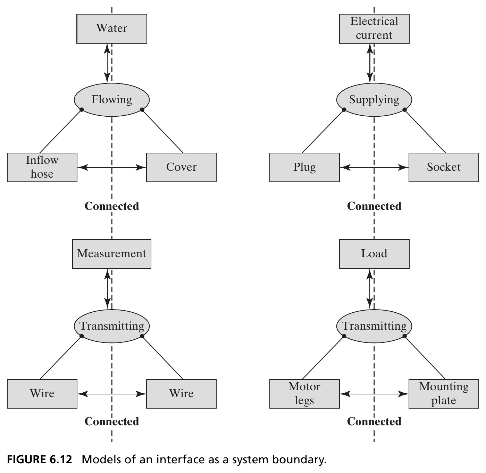{height=400px fig-align="center"}

::: {.side-caption}
Flowing (hose ↔ cover), supplying (plug ↔ socket), transmitting-measurement (wire ↔ wire), transmitting-load (motor legs ↔ mounting plate) — each pair of interface instruments is *connected*. Source: Crawley, Cameron & Selva (2016), Fig. 6.12.
:::

::: {.notes}
Apply the generic interface model from the previous slide to four of the pump's actual five interfaces (fluid outflowing works essentially like fluid inflowing, so the book doesn't draw it separately). For the fluid interface: the operand is water, passing through unchanged; the process is flowing; the two interface instruments are the inflow hose (outside) and the cover (inside), connected to each other. For the power interface: the operand is electrical current; the process is supplying; the instruments are a plug and a socket, connected. For the measurement interface: the operand is the pressure measurement signal itself; the process is transmitting; the instruments are a wire on each side, connected together. And for the mechanical support interface: the operand is structural load; the process is transmitting (load, this time, rather than a signal); the instruments are the motor's legs and an external mounting plate, connected.

Point out the pattern that unifies all four examples: in every single case here, the relationship between the two interface instruments is specifically "connected" — a formal relationship straight out of Chapter 4's vocabulary. This nicely closes the loop back to that earlier chapter: interfaces aren't a new kind of thing requiring new tools, they're simply an application of the exact same form/function/relationship framework we've been building all course, specifically applied at the point where a system's boundary is crossed.
:::

## Section 6.3 Summary {.smaller}

- Even though there is nominally an idealized value delivery pathway, **non-idealities** must be accommodated — usually associated with containing, moving, or storing operands
- Architecture can be represented in **layers**: value operands/processes/instruments, then one or two layers of supporting processes and instruments
- **Interfaces** have form and function too — at minimum, specify the shared operand, the shared process, and the compatible instruments on each side of the boundary

::: {.notes}
Recap Section 6.3's three additions to the idealized picture from Section 6.2, and make sure students can distinguish them from each other, since they're related but genuinely different concepts that are easy to blur together on a first pass. Non-idealities address the gap between an idealized value pathway and a working real system — they're specifically about managing operands (containing, moving, storing them) in the face of real-world uncertainty. Supporting layers address a different gap — even the *idealized* value instruments need mechanical, energetic, and informatic support just to function at all, giving rise to the layered architecture picture. And interfaces address yet a third concern — specifying precisely what happens, in both form and function, wherever the system boundary is crossed. All three are necessary additions to the clean, idealized Question-6a mapping from Section 6.2 in order to arrive at a genuinely realistic architecture — which is exactly Question 6b and 6c and 6d from Table 6.1, now all answered.
:::

# 6.4 Operational Behavior

## The Operator {.smaller}

- Function describes what a system **can do**; **operational behavior** is what actually happens when it runs, over time and in sequence
- Every system has an **operator** — sometimes essential to operation (riding a bike), sometimes merely supervisory (changing a TV channel)
- The pump and bubblesort aren't rich examples of operator interaction — someone starts the pump, someone calls bubblesort, but that's it

::: {.notes}
Introduce a genuinely important distinction that's easy to miss if you've been thinking purely in terms of function up to now: function, as we've defined and used it for two full chapters, is a fundamentally *quasi-static* description — it tells you what a system *can* do, its capability. Operational behavior is different: it's about what actually, dynamically happens when the system runs — the real sequence of events over actual time, as the system interacts dynamically with the people and systems around it. The book's own illustrative contrast is worth repeating verbatim: saying an ATM *can* dispense money (its function) is a completely different statement from listing, in order, every single step actually required to get money out of an ATM (its operational behavior).

Introduce the operator as the first of three aspects of operational behavior this section covers (behavior/sequence and operations cost are the other two, coming up next). Every system has some operator — the person who actually uses it — but the *degree* of involvement varies enormously: for some systems the operator's active, continuous involvement is essential to the system even functioning at all (riding a bicycle simply doesn't work without a rider actively balancing and pedaling); for others the operator plays a much lighter, purely supervisory role (changing the channel on a television, where the TV otherwise runs on its own). This matters enough architecturally, the book notes, that the human operator is often treated as a genuine product/system attribute in its own right, informed by human factors and industrial design.

Be honest that our two running examples, the pump and bubblesort, are admittedly not rich examples of operator interaction — someone turns the pump on and off, or supervises whatever control software runs it; someone calls the bubblesort routine, but doesn't interact with it once it's running. That's exactly why the next slide introduces a new, richer example specifically to illustrate operator interaction properly.
:::

## Figure 6.13 · The Butterfly Corkscrew {.smaller}

::: {.columns}
::: {.column width="45%"}
- A richer example: the two-levered ("butterfly") corkscrew
- The operator is **essential**: places the device on the bottle, twists the handle, pushes down the levers, removes the cork
:::
::: {.column width="55%"}
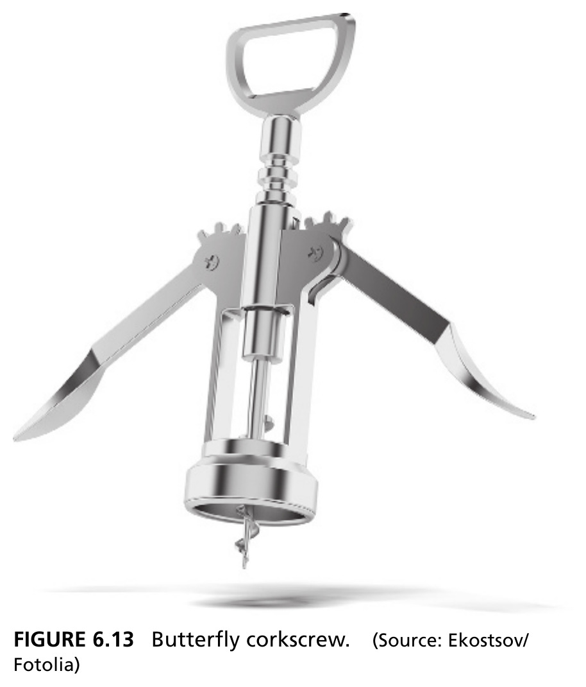{height=480px fig-align="center"}
:::
:::

::: {.notes}
Introduce the butterfly (two-levered) corkscrew as this section's new running example, chosen specifically because — unlike the pump or bubblesort — the operator's involvement is genuinely essential and richly multi-step, making it a much better vehicle for illustrating operational behavior. Walk through the operator's actual sequence of physical actions, since this is exactly the kind of detail Chapter 6's "operational behavior" concept is meant to capture that pure "function" language glosses over: the operator places the device on top of the bottle, twists the central screw handle downward (driving the screw into the cork while the two side levers rise), then pushes those two levers back down (which, through the mechanism's geometry, draws the screw and cork back up out of the bottle), and finally removes the extracted cork from the screw.

Point out explicitly why this example was chosen over the pump or bubblesort: the corkscrew simply does not function at all without this exact, ordered sequence of deliberate operator actions — there's no "supervisory" mode here, the operator's manual sequence of steps *is* the operation. This makes it the perfect vehicle for the next slide, where we formally define "behavior" as the sequence of functions and state changes a system undergoes — precisely what we've just walked through informally for the corkscrew.
:::

## Behavior: Sequence vs. Timing {.smaller}

::: {.callout-note appearance="simple" icon=false}
**Behavior** is the sequence of functions (and associated state changes) a system executes to deliver value.
:::

- The **operations sequence**: the total progression of actions — including overlaps, and whether ordering is required, uncertain, or optional
- **Dynamic behavior (timing)** is different: specific reference to clock time — start-up transients, latency, deadlines (e.g., a car's brakes must deploy within milliseconds of pedal movement)

::: {.notes}
Give the formal definition of "behavior," and then immediately split it into the two genuinely distinct sub-concepts the book is careful to separate, since students often conflate them. Behavior overall is the sequence of functions, and their associated state changes, that a system executes in order to deliver value — it's fundamentally about representing the *events* that contribute to a system's external function, not just its static capability.

The *operations sequence* is about ordering, in a relative, qualitative sense: the total progression of actions or processes a system undergoes, including whether steps must strictly follow one another, whether some steps can overlap in time, and whether the required ordering is fixed, uncertain, or genuinely optional. The book's own nice everyday example: you must start a car before driving it (strict, required ordering) — but you can adjust the mirrors either before or after starting the engine (optional, unordered relative to starting).

*Dynamic behavior*, or timing, is a genuinely different concern: it's about *specific*, quantitative reference to actual clock time — not just "this happens before that," but "this must happen within this many milliseconds of that." The book's example, worth repeating precisely: a car's brakes must deploy within some specific number of milliseconds of the driver depressing the pedal — that's not just a sequencing constraint (brakes after pedal press), it's a genuine timing constraint (brakes within X milliseconds of pedal press). This distinction — qualitative sequence versus quantitative timing — matters enormously in real-time and safety-critical systems, and it's worth flagging for students that we'll come back to it with the corkscrew's own sequence diagram on the very next slide.
:::

## Figure 6.14 · Corkscrew Operations Sequence {.smaller}

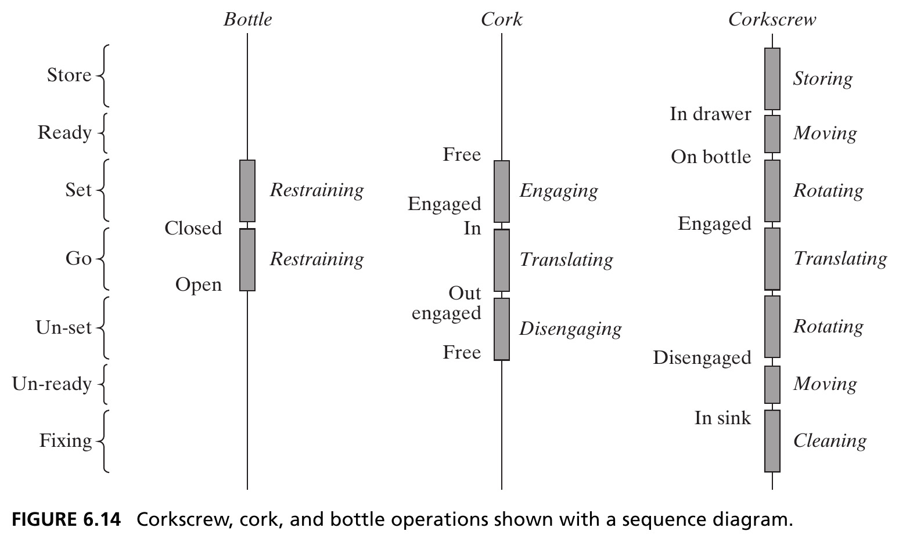{height=420px fig-align="center"}

::: {.side-caption}
A sequence-line diagram: states to the left, processes to the right. The corkscrew itself cycles from storage through use and back to cleaning — the full operational lifecycle (Ch. 8). Source: Crawley, Cameron & Selva (2016), Fig. 6.14.
:::

::: {.notes}
Walk through this figure as the concrete representation of the operations sequence just defined, applied to the corkscrew example. Point out the diagram's convention: states are listed down the left side, and the processes that cause transitions between those states run down the right side — this is explicitly described as a variant of a standard SysML sequence diagram, adapted here to a single object's timeline. The book actually shows three parallel sequence lines together — one for the bottle (being restrained, then released), one for the cork (engaging, translating out, disengaging), and one for the corkscrew itself, shown here — because a complete picture of "opening a wine bottle" genuinely requires tracking all three objects, not just the corkscrew in isolation.

Trace the corkscrew's own full sequence explicitly: it starts in storage, moves (say, taken from a drawer) onto the bottle, rotates (as the screw is twisted in), translates (as it's driven down into the cork), rotates again and translates again as the levers are worked to extract the cork, and finally — this is worth calling out as a nice forward-looking detail — the sequence doesn't stop once the cork is out; the corkscrew continues on to being moved to, and cleaned in, a sink. That final "cleaning" state is a small but deliberate preview of Chapter 8's fuller treatment of a system's complete operational lifecycle (storage, use, maintenance, and so on) — behavior, properly understood, includes the entire operational cycle a system goes through, not just the moments where it's actively delivering its primary value.
:::

## Operations Cost {.smaller}

- Operational behavior, concept (Ch. 7), and system details (Ch. 8) all drive **operations cost** — typically expressed per event, per day, or per unit usage
- Built from **direct costs** (operator, other personnel, consumables) and **indirect costs** (maintenance, upgrades, insurance)

::: {.fragment .callout-tip}
The architect must weigh operational cost carefully — it's a major factor in a product/system's long-term competitiveness.
:::

::: {.notes}
Introduce the third and final aspect of operational behavior this section covers: operations cost. Note explicitly that this isn't something Chapter 6 fully determines on its own — operational behavior (this chapter), concept (Chapter 7, not yet covered), and the detailed specifics of system operations (Chapter 8, also not yet covered) all jointly influence what operations actually cost. Operational cost is typically expressed on a per-event basis, a per-day basis, or in terms of a specific usage metric (the book's example: cost per mile driven, for a car).

Break operations cost down into its two major components, since this is a useful checklist for students doing their own cost analysis later: direct costs are chiefly the cost of the operator and any other personnel needed to run the system, plus consumables (fuel, materials, anything used up during operation); indirect costs include maintenance, periodic upgrades, and insurance — costs that support ongoing operation without being directly tied to any single operating event.

The fragment states the practical stakes plainly, and it's worth connecting this back to the very first chapter of the course: operational cost is a major factor in a product or system's *long-term* competitiveness — echoing Chapter 1's Boeing/BlackBerry discussion about architectural decisions determining competitive advantage. A system with a brilliant idealized architecture and elegant value pathway can still lose in the market if its real-world operational costs — the personnel, consumables, maintenance, and insurance that come with actually running it day after day — are too high relative to competitors. The architect genuinely needs to weigh this carefully, not treat it as an afterthought to be optimized later by someone else.
:::

## Section 6.4 Summary {.smaller}

- Every system has an operator — closely involved or merely supervisory — and the operator interface is a key part of the architecture
- Behavior is the sequence of functions necessary for value to emerge — including execution order and associated state changes
- Dynamic behavior specifically references clock time; operations cost (direct + indirect) is a key driver of long-term competitiveness

::: {.notes}
Recap Section 6.4's three components as a checkpoint before moving into the chapter's final section on representation. Every system has an operator, whose degree of involvement can range from essential (the corkscrew, a bicycle) to merely supervisory (a television) — and given how essential the operator can be, the interface to that operator deserves to be treated as a genuine, deliberate part of the system's architecture, not an afterthought bolted on at the end. Behavior is the ordered sequence of functions and associated state changes a system executes to actually deliver its value over time — captured concretely with sequence-line diagrams like the corkscrew's. And within behavior, dynamic behavior specifically refers to quantitative clock-time constraints (as opposed to purely qualitative ordering), while operations cost — built from direct costs like personnel and consumables, and indirect costs like maintenance and insurance — is a real, material driver of a system's long-term competitiveness in the market. With operational behavior now covered, the chapter has answered every question in Table 6.1 except how to *represent* all of this information usefully — which is exactly what the final section takes on.
:::

# 6.5 Reasoning about Architecture Using Representations

## Simplified System Representation {.smaller}

- The full representation (Figure 6.10) can be too much detail for many purposes
- Three approaches to simplify: **abstract** (hide detail inside larger-scale objects), **omit** (leave out low-priority detail), or **project** (discussed next)
- Guiding principle: preserve the **value pathway**, simplify elsewhere (Principle of Focus, Box 2.6)

::: {.notes}
Open the chapter's final section by naming an honest, practical problem: the full architecture representation we've built up over Sections 6.2 through 6.4 — value pathway, non-idealities, supporting layers, interfaces, operational behavior — is genuinely complete, but that completeness comes at the cost of being too dense and detailed for many real purposes, like communicating the architecture's key ideas to a broader, less technical audience.

Give students the three named strategies for producing a simpler representation, since these become the organizing structure for the rest of the section. You can *abstract*: create larger-scale objects that conceal internal detail (the book's example: bundle "the motor assembly" as one abstracted object, hiding the motor and shaft separately inside it). You can *omit*: simply leave out details that are low priority for the current purpose, guided directly by Chapter 2's Principle of Focus — reflect on what's genuinely important to preserve in the hierarchy, and simplify everything else. Or you can *project* — which is different enough, and used often enough, that the rest of this section is devoted entirely to explaining it properly. The guiding principle across all three strategies, worth stating clearly: whatever you cut or simplify, always preserve the value pathway intact — that's the one thing that must never get lost, no matter how aggressively everything else is condensed.
:::

## Figure 6.15 · Simplified Pump Architecture {.smaller}

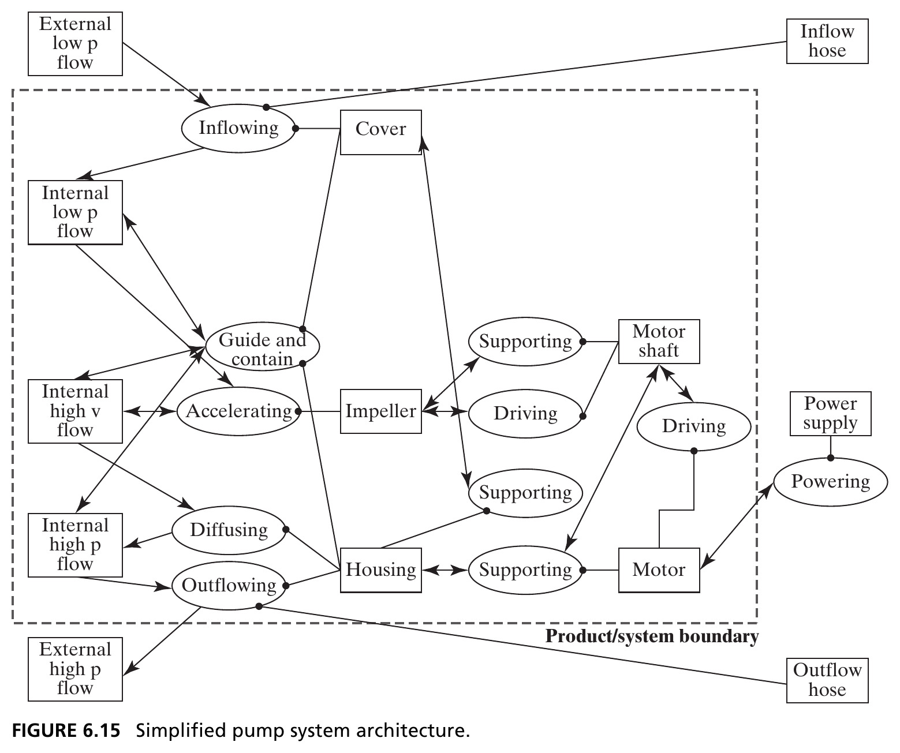{height=400px fig-align="center"}

::: {.side-caption}
Compare with Figure 6.10: the value pathway is fully preserved; the motor shaft's dual role (supporting *and* driving the impeller) stands out more clearly. Source: Crawley, Cameron & Selva (2016), Fig. 6.15.
:::

::: {.notes}
Compare this simplified diagram directly, side by side if possible, with the fully-layered Figure 6.10 from Section 6.3. Point out concretely what's been simplified away (some of the finer-grained supporting detail) and what's been deliberately preserved (the full value pathway remains completely intact — every value operand, process, and instrument is still there). Interestingly, note that this simplification doesn't just make the diagram *smaller* — it arguably makes at least one relationship *clearer*: the motor shaft's dual role, supporting the impeller structurally while also driving it, actually stands out more prominently here than it did buried in the fuller Figure 6.10. This is a nice, concrete demonstration that simplification, done well following the Focus principle, isn't purely a lossy compromise — it can genuinely improve comprehension of the parts that matter most, precisely because distracting detail has been cleared away.
:::

## Table 6.2 · The Architecture as an Array {.smaller}

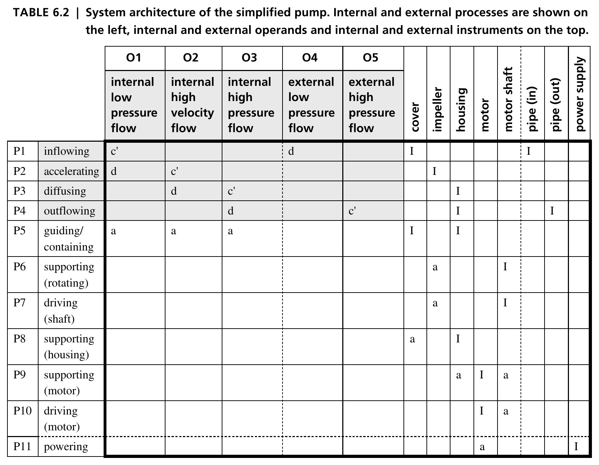{height=400px fig-align="center"}

::: {.side-caption}
The **process-form (PF) array**: rows are processes, columns are operands (O1–O5) and instruments. **c′** = produce, **d** = consume, **a** = affect, **I** = instrument-of. Contains exactly the same information as Figure 6.15 — just tabulated. Source: Crawley, Cameron & Selva (2016), Table 6.2.
:::

::: {.notes}
Introduce the matrix, or array, representation as a genuinely different way to encode the exact same architectural information as the simplified diagram from the previous slide — worth stressing explicitly that this table contains *exactly* the same content as Figure 6.15, just organized differently. Walk through the structure: each row is one process (inflowing, accelerating, diffusing, outflowing, and the various supporting processes); the columns split into two groups — first the five operands (labeled O1 through O5, representing the different flow states as the fluid moves through the pump), then the instruments of form (cover, impeller, housing, motor, and so on).

Give students the small set of relationship codes used to fill the cells, since these become important building blocks for the next couple of slides: c′ means the process *produces* that operand; d means it *consumes* that operand; a means it merely *affects* the operand without fully producing or consuming it; and I means that column's object is the *instrument of* that row's process. Point out the practical trade-off worth remembering: the graphical version (Figure 6.15) is generally easier to develop by hand and easier to visually grasp at a glance, while this matrix version is more compact, and — this becomes important very shortly — is far easier to manipulate computationally, which is exactly what the next slide's "combined array" idea depends on.
:::

## The Design Structure Matrix, Generalized {.smaller}

- Box 5.11 defined **PP**, **PO**, **OP**, **OO** (relationships among processes and operands); this chapter adds **PF** (process↔form) and, by analogy, **FP**
- **FF** is generally a diagonal — just an identifier for each element of form (it does *not* duplicate the structural connections of Ch. 4)
- **OF** and **FO** are generally zero: operands rarely connect directly to form — there's always an intervening process

::: {.fragment .callout-tip}
Graphical views (Figures) are easier to develop and visualize; matrix views (Tables) scale better and are easier to compute on. We use both throughout.
:::

::: {.notes}
Generalize Table 6.2's process-form array into the fuller Design Structure Matrix (DSM) framework the rest of the section builds on. Remind students of the four arrays Chapter 5's Box 5.11 already introduced — PP (process-to-process), PO (process-to-operand), OP (operand-to-process), and OO (operand-to-operand) — all capturing different slices of the purely functional architecture. This chapter's Table 6.2 adds a fifth, PF (process-to-form, exactly what we just walked through), and by straightforward analogy, its transpose FP (form-to-process) as well.

Point out two additional arrays that complete the full picture, both worth understanding precisely because they behave in a special, almost trivial way, which is itself informative. FF (form-to-form) is generally just a diagonal matrix — essentially nothing more than a distinct identifier label for each element of form — and it's worth being explicit that this FF array does *not* duplicate the actual structural connections between elements of form that Chapter 4 discussed (those connections are a separate, distinct kind of information, not encoded in this particular array). And OF and FO (operand-to-form and form-to-operand) are generally entirely zero — operands essentially never connect directly to form; there is always some intervening process standing between them, which is exactly what PF, FP, PO, and OP are for.

The closing fragment states an important, practical methodological point worth returning to throughout the rest of the section: graphical (figure-based) views are typically easier to develop by hand and to visualize intuitively, while matrix (table-based) views are more compact and, crucially, far easier to compute on — which becomes essential once we start actually deriving projections algorithmically, as the next several slides do. The book, and this course, use both representations side by side rather than picking one exclusively, precisely because each has a genuine advantage the other lacks.
:::

## Projection onto Objects {.smaller}

- **Projection**: show operands and instruments explicitly as objects; processes become the *links* between them
- Advantage: to most viewers, objects feel more concrete than processes — but it requires understanding the (sometimes unfamiliar) idea of an **operand object**

::: {.notes}
Introduce the first of the two named projection strategies (the third of the three simplification approaches from a few slides back — abstract, omit, project). A projection onto objects keeps both operands and instruments explicitly visible as objects in the diagram, but collapses the processes down into simple *links* connecting those objects, rather than drawing them as their own separate ovals the way full OPM notation does.

Explain the intuitive advantage this offers, since it's genuinely worth understanding why anyone would choose this representation over the full diagram: to most viewers — especially those less steeped in formal systems methodology — concrete objects (a bowl, an oven, a housing) feel more tangible and easier to reason about than abstract processes (mixing, baking, diffusing). Projecting onto objects plays to that intuition directly. The one real cost, worth flagging honestly: viewers need to be comfortable with the sometimes-unfamiliar idea that operands themselves are objects too, not just instruments — the dough, the bread, the internal flow states of the pump are all objects appearing in this projected diagram, connected by links, exactly like the instrument objects are. The next couple of slides show exactly what this looks like worked out concretely.
:::

## Figure 6.16 · Projection onto Objects (Bread) {.smaller}

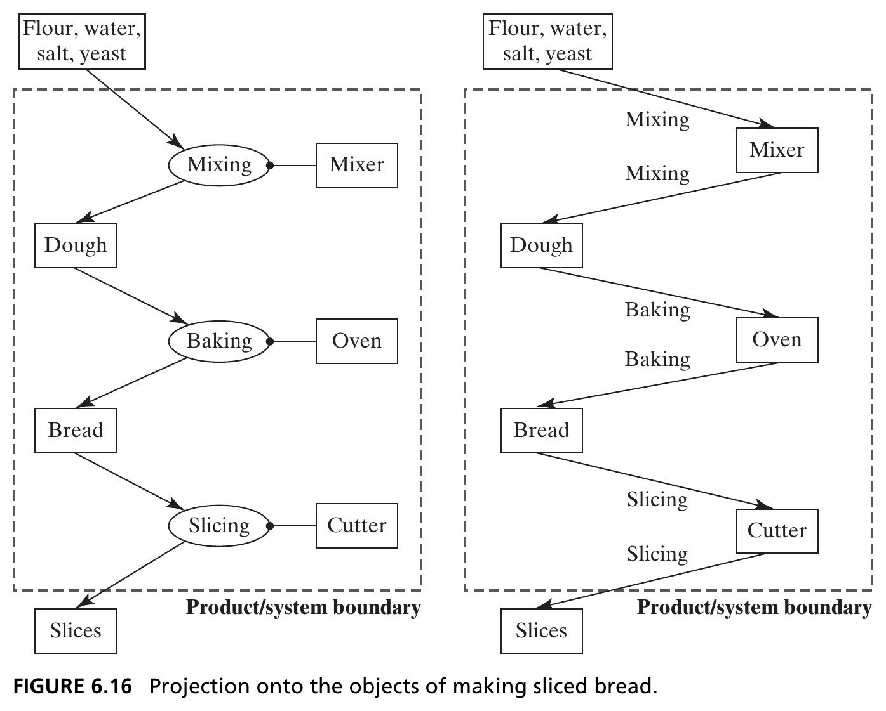{height=400px fig-align="center"}

::: {.side-caption}
Left: the full OPM view. Right: projected onto objects — flour/dough/bread/slices connect directly to mixer/oven/cutter, labeled by the process that links them. Source: Crawley, Cameron & Selva (2016), Fig. 6.16.
:::

::: {.notes}
Compare the two sides of this figure directly, side by side, as the clearest possible illustration of what "projecting onto objects" actually does to a diagram. The left side is the familiar full OPM-style view students have seen since Chapter 3: objects as boxes, processes as ovals, both shown explicitly and connected by relationship arrows. The right side is the same underlying architecture, projected: the process ovals (mixing, baking, cutting) have vanished as separate shapes and instead now appear as *labels* directly on the arrows connecting flour/dough/bread/slices to mixer/oven/cutter. All the same information is present — you can still tell that mixing connects flour to dough via the mixer — it's just been re-encoded so processes are edge labels rather than their own nodes. This is worth having students trace by hand, tracing one specific path (say, flour to dough) on both diagrams to confirm they really are carrying identical information in two different visual forms.
:::

## Figure 6.18 · Pump Value Stream, Projected onto Objects {.smaller}

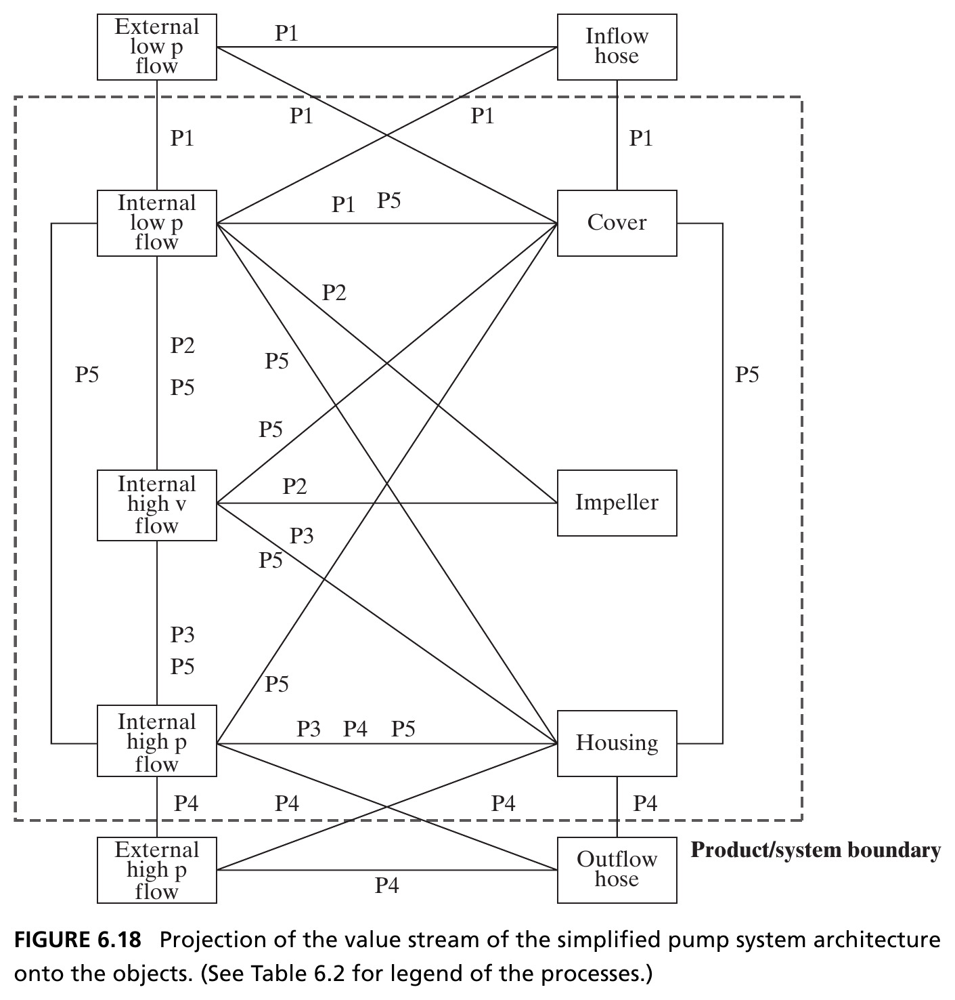{height=400px fig-align="center"}

::: {.side-caption}
Every operand-instrument pair from Table 6.2's value-related rows (P1–P5), redrawn as a direct link labeled by the connecting process. Source: Crawley, Cameron & Selva (2016), Fig. 6.18.
:::

::: {.notes}
Apply the same object-projection technique to the pump's value stream specifically, this time drawing directly on the matrix data from Table 6.2 rather than a hand-drawn OPM diagram — a nice demonstration that this projection can be produced either graphically by hand or computed algorithmically from the array representation, exactly the trade-off flagged a couple of slides back. Every operand (the various internal and external flow states, O1 through O5) and every instrument (cover, impeller, housing, and the rest) from the value-related rows of Table 6.2 appears here as its own object, connected to whichever other objects it's linked to via a process — with each link explicitly labeled by the process code (P1 through P5) that connects them, so you can always trace back to Table 6.2 to see exactly what each labeled link means in full functional detail. Point out that this diagram is doing real analytical work beyond just being a simplified picture: because instruments and operands are directly visible and connected, a viewer can reason all the way from operand through the process links to the responsible instrument (recovering function), or trace directly from form object to form object to gauge how tightly coupled two pieces of the pump's hardware really are — a preview of the "functional coupling" idea that comes up explicitly on the next slide.
:::

## Projection onto Form {.smaller}

- A second projection: onto just the **objects of form**, the most tangible and concrete elements
- Links between form objects now encode *three* things at once: the preceding process, the connecting operand, and the following process
- Produces the **most compact** representation — understandable by nearly anyone, but with a lot of information compressed into each link

::: {.notes}
Introduce the second, more aggressive projection strategy: rather than keeping both operands and instruments visible (as the object projection did), project all the way down onto just the objects of form — the most tangible, physically concrete elements of the system, and arguably the easiest of all for a non-expert to intuitively grasp.

Be precise about what gets compressed into a single link here, since this is the key trade-off students need to understand clearly: because operands have now been projected away as separate nodes too, each link directly connecting two form objects has to silently encode three pieces of information at once — the process that preceded (produced the operand flowing into the next object), the connecting operand itself (what's actually flowing between the two form objects), and the following process (what the receiving object then does with that operand). That's a lot of compressed information riding on a single arrow.

State the resulting trade-off plainly: this produces the single *most compact* representation of the three we've now covered (full OPM, projection onto objects, projection onto form) — genuinely understandable by nearly anyone at a glance, since it's "just" a diagram of physical parts connected by arrows — but that compactness comes directly at the cost of a lot of information being packed, implicitly, into each individual link, which a viewer has to unpack carefully (or refer back to a fuller representation) if they want the complete picture rather than just the gist.
:::

## Figure 6.19 · Projection onto Form (Bread) {.smaller}

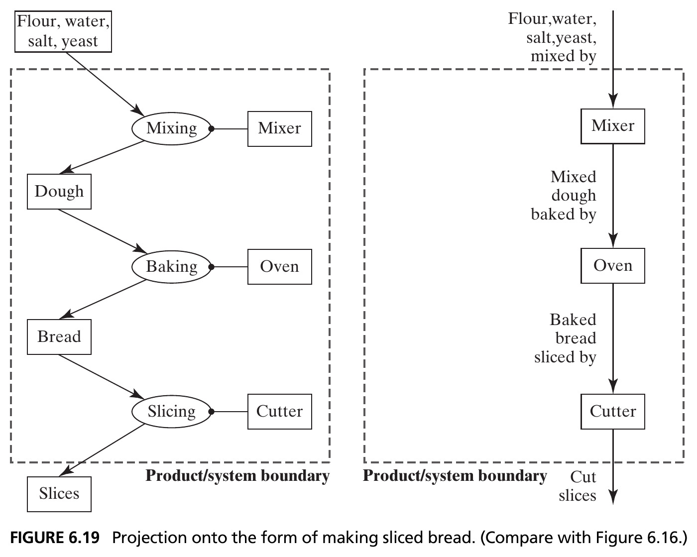{height=400px fig-align="center"}

::: {.side-caption}
Compare with Figure 6.16: now mixer → oven → cutter are linked directly, each arrow labeled with what flows and what happens ("mixed dough, baked by..."). Source: Crawley, Cameron & Selva (2016), Fig. 6.19.
:::

::: {.notes}
Compare this figure directly against Figure 6.16 (the projection onto objects, shown a couple of slides back) — same underlying bread-slicing architecture, one further step of compression applied. Now only the form objects remain as nodes: mixer, oven, cutter, connected directly to each other, with flour/water/salt/yeast still shown as inputs and slices as the final output. Each connecting arrow now carries a compact but information-dense label like "mixed dough, baked by..." — packing together what was produced, what it is, and what happens to it next, exactly the three-part compression described on the previous slide. Have students explicitly compare the visual density here to Figure 6.16: fewer total nodes on the page, but each remaining arrow doing noticeably more explanatory work than before.
:::

## Figure 6.21 · Pump Value Stream, Projected onto Form {.smaller}

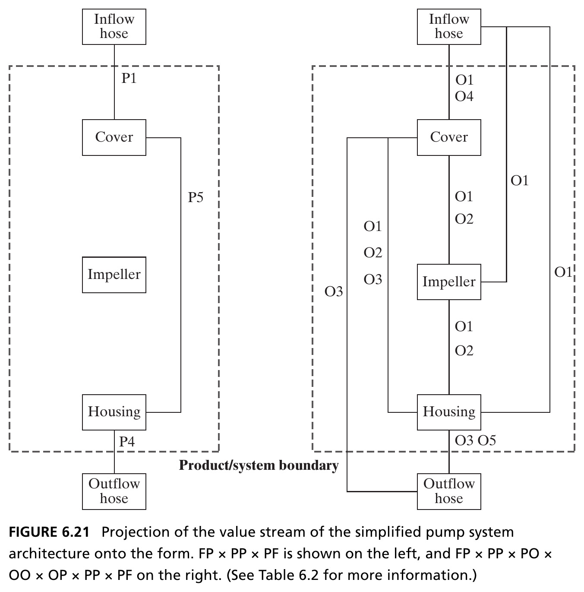{height=400px fig-align="center"}

::: {.side-caption}
Left: form-to-form links only (FP × PP × PF). Right: the fuller projection that also threads through the operands (FP × PP × PO × OO × OP × PP × PF) — the same N-squared DSM structure from Table 6.3, applied to this example. Source: Crawley, Cameron & Selva (2016), Fig. 6.21.
:::

::: {.notes}
Apply the form-only projection to the pump's value stream, and use this slide specifically to make the algorithmic, matrix-based side of this section concrete for students who want the fuller mechanical picture, not just the visual intuition. The left-hand diagram is the simpler of the two computed projections — form objects connected purely through the processes that link them, computed as the matrix product FP × PP × PF (form-to-process, times process-to-process, times process-to-form — literally "chaining" three of the DSM arrays from a few slides back together to derive a new, form-to-form relationship array). The right-hand diagram is the fuller version, which doesn't stop at just chaining through processes, but threads all the way through the operands as well: FP × PP × PO × OO × OP × PP × PF — a longer chain of matrix multiplications that captures not just which form objects are linked, but the full operand pathway connecting them.

Tie this back explicitly to Table 6.3's full nine-array DSM structure (PP, PO, OP, OO, PF, FP, FF, OF, FO) introduced a few slides ago: this is exactly that same general N-squared DSM framework, now put to concrete computational use, deriving a new, useful array (form-to-form relationships) by multiplying together several of the more primitive arrays we already had. Students with a linear-algebra or graph-theory background will likely recognize this as directly analogous to computing multi-step reachability or path composition in a graph via matrix multiplication — worth pointing out explicitly if it helps the idea land, since it's exactly that operation, just applied to architectural relationship matrices instead of a generic adjacency matrix.
:::

## Table 6.4 · Classes of Operand Interactions {.smaller}

| Category | Subtype | Example interaction |
|---|---|---|
| **Matter** | Mechanical | Mass exchange, force/momentum |
| | Biochemical | Chemical reaction, biological replication |
| **Energy** | — | Work, thermal (heating) |
| **Information** | Signal | Data transfer, command/trigger |
| | Thought | Exchanging ideas, imparting beliefs |

::: {.fragment .callout-tip}
A useful checklist when identifying what, exactly, an operand link represents.
:::

::: {.notes}
Give students this table as a genuinely practical, reusable checklist, not just descriptive content to memorize — it's meant to help answer a question that comes up constantly once you're actually doing projected-diagram analysis of your own: when you draw a link between two objects, exactly what kind of interaction does that link represent? The table organizes possible answers into three broad top-level categories — matter, energy, and information — each with named subtypes and characteristic example interactions. Matter splits into mechanical interactions (mass exchange, or force and momentum transfer) and biochemical interactions (chemical reactions, or biological replication). Energy interactions include work and thermal exchange (heating). Information splits into signal-based interactions (transferring data, or triggering a command) and, interestingly, thought-based interactions (exchanging ideas, or imparting beliefs) — worth pointing out that this last category is what lets the same general framework apply cleanly even to organizational and social systems like Team X, not just physical hardware.

The fragment states the practical use case directly: any time students are building their own projected diagram (object or form) and need to label a link, or any time they're analyzing someone else's architecture and trying to pin down exactly what an ambiguous-looking arrow represents, this table is the checklist to run through — is this link fundamentally about matter, energy, or information, and which subtype specifically?
:::

## Section 6.5 Summary {.smaller}

- The full architecture representation (operands, processes, form) is complete but can be complex — abstraction, omission, and **projection** all help
- **Projection onto objects** keeps operands and instruments explicit and concrete, with processes as links — good for those less familiar with the model
- **Projection onto form** is the most compact representation, understandable by nearly anyone — but stores much more information per link

::: {.notes}
Recap the final section as a checkpoint before the chapter's closing summary. The full architecture representation — every operand, every process, every form object, and all their relationships — is genuinely complete, but that completeness comes at a real cost in complexity, which is often too much for a given communication purpose. Abstraction (hiding detail inside larger-scale objects), omission (leaving out low-priority detail, guided by the Principle of Focus), and projection (systematically collapsing part of the representation) all help manage that complexity. Of the two named projections, projecting onto objects keeps both operands and instruments visible and concrete, with processes reduced to labeled links — a good middle ground for audiences less steeped in the full formal model. Projecting onto form goes a step further, producing the single most compact and broadly understandable representation of all — at the real cost of packing much more implicit information into each remaining link. Students should leave this section with a genuine toolkit: given a specific audience and purpose, they should be able to choose deliberately among the full representation, abstraction, omission, and either projection, rather than defaulting to whichever one they happen to have drawn first.
:::

## Chapter 6 Summary {.smaller}

- **System architecture** is not an independent attribute — it's the *mapping* between form and function, informed by structure
- The idealized value pathway rarely tells the whole story: **non-idealities**, **supporting layers**, and **interfaces** round out a realistic architecture
- **Operational behavior** — the operator, sequence, timing, and cost — describes what actually happens when a system runs
- Architecture can be **represented** at different levels of abstraction: full OPM/DSM, simplified, or projected onto objects or form

::: {.fragment .callout-tip}
Still missing from our definition of architecture (Box 6.1): **concept** — the mental image that maps form and function. That's Chapter 7.
:::

::: {.notes}
Walk back through the whole chapter's arc one final time, tying every section explicitly to Table 6.1's questions, since that table was the chapter's real outline from the start. We opened by establishing that architecture is not an independent system attribute, but specifically the mapping between form and function, informed throughout by structure — this was Section 6.2's answer to Question 6a, the crux of the chapter (and the book calls it the crux of this entire part of the text). We then found that the idealized mapping alone isn't sufficient for a realistic architecture: non-idealities (Question 6b), supporting layers (Question 6c), and interfaces (Question 6d) all had to be added in Section 6.3 to round the picture out. We then moved beyond static mapping altogether into operational behavior — the operator, the sequence and timing of operations, and operations cost (Questions 6e through 6g) — describing what actually happens dynamically when a system runs, in Section 6.4. And finally, in Section 6.5, we surveyed how to represent all of this rich information at different levels of abstraction depending on the audience and purpose: the full representation, simplified diagrams, and the two projection strategies.

The closing fragment is the important forward pointer, and it's worth returning to Box 6.1's five-term definition from the start of the lecture one more time to make the gap explicit: function, form, relationship, and context have all now been thoroughly covered across Chapters 2 through 6 — but *concept*, the fifth term in that definition, has so far only been mentioned in passing. Chapter 7 is entirely devoted to giving concept the same rigorous treatment form and function have already received, and only once that's done will our definition of system architecture finally be complete.
:::

## Next: Solution-Neutral Function and Concepts

Chapter 7 asks: before committing to *this* architecture, what is the space of possible concepts that could deliver the same function?

::: {.callout-tip}
**Reference**: Crawley, E., Cameron, B., & Selva, D. (2016). *System Architecture: Strategy and Product Development for Complex Systems*. Pearson. Chapter 6.
:::

::: {.notes}
Close the lecture by framing exactly what problem Chapter 7 exists to solve, since it represents a genuine shift in perspective from everything covered today. Everything in this chapter analyzed a *specific*, already-chosen architecture — the pump, bubblesort, the bridges, the corkscrew — asking how form maps to function *within* that one particular design. Chapter 7 steps back and asks a prior, more fundamental question: before committing to any one specific architecture, what's the full space of possible *concepts* — alternative ways of mapping form to function — that could deliver the same required external function? Preview for students that this is where "solution-neutral function" as a formal idea gets introduced — describing what a system needs to do without prematurely committing to any one way of doing it — precisely so the space of genuinely different concepts can be explored honestly, rather than architecture being chosen by default, out of habit, or from the first idea that came to mind.
:::
