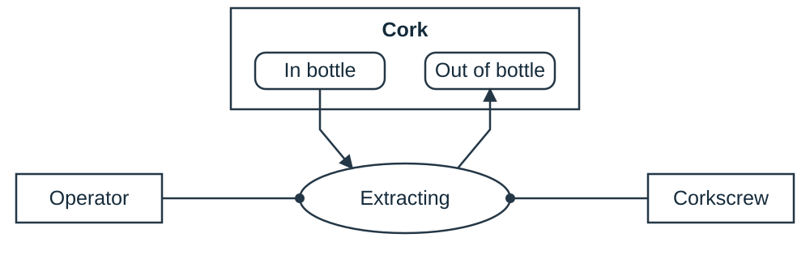
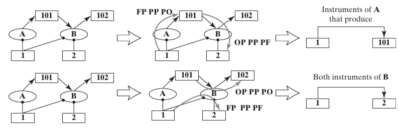
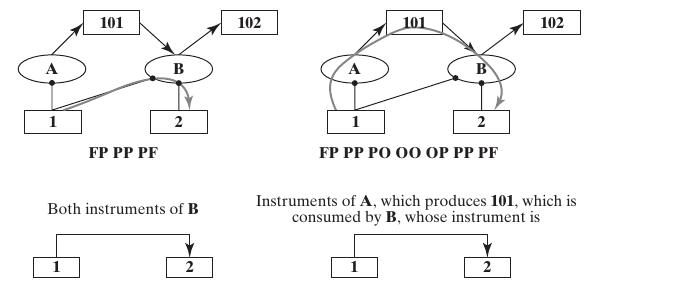

## Form, Function, and Architecture

- Chapter 4 gave us **form**: the elements and structure of what a system *is*
- Chapter 5 gave us **function**: the processes and operands of what a system *does*
- This chapter connects form and function through **system architecture**

::: {.fragment .callout-tip}
Chapter 7 adds the last piece, **concept**, completing the full definition of architecture.
:::

::: {.notes}
- Chapters 4 and 5 described form and function separately. Chapter 6 connects them by identifying which instruments enable which processes.
- This chapter is the connection: **system architecture** = the *mapping* between form and function
- "Mapping" is doing real work: architecture isn't a third independent attribute, it's the specific assignment of *which* form elements execute *which* processes
- Flag: our definition stays incomplete through this whole chapter: a fifth term, **concept**, only arrives in Ch. 7. Don't worry that it feels underspecified today; that's deliberate
:::

## Box 6.1 · Definition: System Architecture {.smaller}

::: {.callout-note appearance="simple" icon=false}
**System architecture** is the embodiment of *concept*, the allocation of physical/informational *function* to the elements of *form*, and the definition of *relationships* among the elements and with the surrounding *context*.
:::

- Five key terms: **function**, **form**, **relationship**, **context** (Ch. 2–5), and **concept**: a mental image or system vision that maps form and function (Ch. 7)
- Architecture describes the **mapping between form and function**

::: {.notes}
- Explain each term in the definition and relate it to the earlier chapters.
- Every one of the five words already has a precise meaning from earlier chapters: this isn't new vocabulary, it's assembling what we have: **function, form, relationship, context** (Ch. 2–5), **concept** (new, only loosely defined here: mental image/vision mapping form and function, full treatment in Ch. 7)
- Architecture describes how form enables function. Ask students to identify that mapping in an example.
- This is why the chapter asks "which instrument executes which process" instead of enumerating form and function separately. Point to **Table 6.1** (coming up): the literal outline for the rest of the chapter
:::

## Figure 6.1 · Architecture as Combination {.smaller}

{height=420px fig-align="center"}

::: {.side-caption}
Functional architecture (left) + formal structure (right) combine into system architecture (center): each process is now linked to the instrument object that executes it. Source: Crawley, Cameron & Selva (2016), Fig. 6.1.
:::

::: {.notes}
- **Visual embodiment of the previous slide's central claim**
- Left: *functional architecture* alone (Ch. 5): operands and processes, no form
- Right: *formal structure* alone (Ch. 4): instrument objects and structural relationships, no function
- Center: system architecture = literal combination: same processes as left, now each linked to the instrument from the right that executes it
- Visual proof, not just assertion: architecture *is* the connecting lines between process and instrument: no separate "architecture" box exists. Purely relational, existing only in the mapping
:::

## Box 6.2 · Principle of Value and Architecture {.smaller}

::: {.callout-note appearance="simple" icon=false}
*"Design is not just what it looks like and feels like. Design is how it works."*: Steve Jobs

*"Form and function should be one, joined in a spiritual union."*: Frank Lloyd Wright
:::

::: {.fragment}
**Value is benefit at cost.** Function delivers benefit, while building and operating the required form incurs costs. Architectural choices affect both.
:::

::: {.notes}
- **Both quotes point at the same claim from different angles**: have students articulate it before revealing the fragment
- Jobs: pushes back on "design = aesthetics": design is fundamentally about function, how something works
- Wright: goes further: form and function shouldn't be reconciled, they should be **unified**, "one"
- Relate benefit to the delivered function and cost to building, procuring, and maintaining the system's form.
- A good architecture (lots of desired function, minimal form) is nearly synonymous with good value: seeks valued benefit at acceptable cost; this does not prescribe a numerical benefit/cost ratio. This is why "elegant"/"efficient" mappings matter later: not aesthetics, value
:::

# 6.2 System Architecture: Form and Function

## Mapping of Form and Function {.smaller}

How would we describe the architectural difference between two bridges with the *same* external function (carrying vehicles) and *similar* form (towers, roadbed, cables)?

::: {.fragment .callout-tip}
In the idealized cable-stayed arrangement, inclined stays introduce **deck compression**. In a conventional earth-anchored suspension bridge, the main cables transfer loads to towers and end anchorages. Different load paths mean different mappings of form to function.
:::

::: {.notes}
- **Pose the puzzle to the room, let students try before revealing the fragment**: both bridges same external function (carry vehicles), similar form (towers, roadbed, cables): what makes the architectures different?
- Form vocabulary + function vocabulary separately can't explain why they're architecturally distinct, or why one spans farther
- **Fragment = the load-path answer**: cable-stay roadbed carries **compression** (working structural member); suspension roadbed does not: anchors react directly to cable tension
- Only architecture-level thinking reveals this: not "what parts" or "what function" alone, but *how* form maps onto the processes delivering that function. Motivates why **Question 6a** (next slide) is the crux of this chapter and of Part 2

**Suggested answer:** The key difference is the load path. In the idealized cable-stayed arrangement, inclined stays connect the deck directly to towers and their horizontal components introduce substantial deck compression. In a conventional earth-anchored suspension bridge, hangers transfer deck loads to main cables, which pass loads to towers and end anchorages. The architecture therefore differs in which elements carry which forces and how those forces reach the ground. Qualify the slide's simplification: suspension decks still experience structural forces, and actual span capability depends on geometry, materials, stiffness, loading, and the anchorage arrangement.

:::

## Figure 6.2 · Two Bridges, Two Architectures

{width=85% fig-align="center"}

::: {.side-caption}
A suspension bridge (left) and a cable-stay bridge (right): same function, similar form, different architecture. Source: Crawley, Cameron & Selva (2016), Fig. 6.2. Photos: (left) JTB Media Creation/Alamy, (right) CBCK/Shutterstock.
:::

::: {.notes}
- **Give students a moment to look and try to spot the difference visually first**: towers/roadbed/cables really do look similar at a glance, that's the point
- Visual similarity = why this is such a good teaching example: proves architecture can't be fully read off form alone
- Must understand the internal load path (force flow: roadbed → cables → anchors/towers) to see these are two fundamentally different architectures wearing similar-looking clothes
:::

## Table 6.1 · Questions for Defining Architecture {.smaller .chapter06-detail}

::: {.architecture-table}
| Question | Analytical result |
|---|---|
| **6a.** Which instruments enable which processes? How does structure support interaction and emergence? | Idealized form–process–operand architecture |
| **6b.** Which non-idealities require added operands, processes, or instruments? | Realistic value pathway |
| **6c.** What supports the value-pathway instruments? | Supporting processes and instruments |
| **6d.** What crosses each boundary, through which process and compatible instruments? | Formal and functional interface definition |
| **6e.** In what order do processes execute? | Ordered actions and state changes |
| **6f.** Which activities execute in parallel? | Interacting threads of activity |
| **6g.** What clock-time constraints matter? | Durations, latency, overlap, and deadlines |
:::

::: {.side-caption}
Adapted from Table 6.1. Question 6a includes both allocation and the structural relationships needed for the interactions.
:::

::: {.notes}
Keep 6e, 6f, and 6g separate: ordering, concurrency, and clock time are different questions. The result of 6a is not merely an equipment list. A map of enabling instruments must also explain how their processes can interact through operands.

**Discussion:** Which question would expose two processes that are correctly allocated but cannot exchange their operand?

**Suggested answer:** 6a's structural-interaction question. Then use 6d to specify an interface if the interaction crosses the chosen boundary.

[Sources]
- Crawley, Cameron & Selva, *System Architecture* (2016), Ch. 6, p. 126, Table 6.1.
:::

## The Simplest Case: One-to-One Flow-Through {.smaller}

::: {.columns}
::: {.column width="55%"}
- The center diagram of Figure 6.1 is the simplest, most commonly *assumed* architecture: one instrument per process, one process per instrument
- Each process produces a distinct operand: function reduces to "produce + outgoing operand"
- This illustrates the **independence axiom** [Suh, 1998], in which functional requirements can be satisfied independently
:::
::: {.column width="45%"}
{width=100%}
:::
:::

::: {.notes}
- **Begin Question 6a with the easiest case**: center diagram of Fig. 6.1, revisited: exactly one instrument per process, one process per instrument, clean one-to-one
- Each process produces a single distinct operand → whole function reduces to "produce, then pass along an outgoing operand"
- Formal name: the ***independence axiom*** (Nam Suh, axiomatic design: same Suh as "zigzagging" from Ch. 3): each functional requirement satisfiable by adjusting exactly one design parameter, independently
- "If only life were so simple": deliver with a knowing pause. Next several slides show exactly how fast this clean assumption breaks down in real systems
:::

## Figure 6.3 · Simple Architecture of Bread Slicing {.smaller}

- Left: mixer → mixing, oven → baking, cutter → slicing: a clean one-to-one map
- Right: the mental shortcut this enables: form becomes a *proxy* for process. Dough "goes into" an oven; bread "emerges." Suppress the processes and reason directly in terms of form
- This simplification depends on an unambiguous mapping between each instrument and its process

::: {.notes}
- **Concrete instance of the independence axiom**: mixer→mixing, oven→baking, cutter→slicing: three processes, three instruments, perfectly one-to-one (left diagram, from Fig. 6.1)
- **Right-hand version**: form as a *proxy* for process: suppress the process ovals, talk directly in terms of form. Dough "goes into" the oven, bread "emerges": no explicit "baking" step in the mental model
- Real cognitive convenience: why we say "the oven bakes the bread" without separating out the underlying process
- Pose the question, let it hang: does this proxy trick generalize to realistic systems? Next figure answers: no

**Suggested answer:** The proxy is useful when each relevant object maps unambiguously to one process at the chosen level: mixer to mixing, oven to baking, cutter to cutting. It is not generally sufficient for realistic mappings. One object can enable several processes and one process can require several objects. The shortcut can remain useful for a limited communication purpose, but recover explicit processes when ambiguity or shared-resource constraints matter.

:::

## Figure 6.4 · A Not-So-Simple Architecture {.smaller}

{height=400px fig-align="center"}

::: {.side-caption}
"Mixer" replaced by stirrer + bowl + stir agent (the cook): one instrument (the cook) now maps to *two* processes. The proxy shortcut on the right breaks down: what does it mean to go "into" a bowl or a knife? Source: Crawley, Cameron & Selva (2016), Fig. 6.4.
:::

::: {.notes}
- Figure 6.4 shows how the mapping changes when instruments participate in more than one process.
- Decompose "mixer" one level further: stirrer (spoon), bowl, stir agent (the cook) → clean one-to-one immediately breaks
- Same for cutting: knife, board, cut agent: and the "stir agent" and "cut agent" are the *same person* (the cook), one instrument linked to two processes
- One instrument mapped to two processes: the independence axiom has already broken
- **Right-hand diagram**: shows why "form as proxy" collapses once mapping isn't one-to-one: what does "dough goes into a bowl" even mean? The trick needed an unambiguous process to stand in for; multi-process instruments break it, forcing explicit process/instrument reasoning (full OPM)
- Key transition of the section: real systems are not one-to-one: rest of the section catalogs the actual patterns instead

**Suggested answer:** “Dough goes into a bowl” identifies placement but not the operation: the bowl might support mixing, holding, or resting. Mixing requires the bowl, stirrer, and agent together. The same cook also enables cutting, so assuming that every object stands for exactly one process loses both allocation detail and possible scheduling conflicts. Restore the process nodes, their operands, and the enabling links before reasoning about what the arrangement can accomplish.

:::

## Omitted Instruments and Shared Roles {.smaller}

::: {.columns}
::: {.column width="50%"}
**No instrument shown**

Ice melting into water: is there really no instrument? Every process needs *something* enabling it; when none appears, ask what really is the enabler.
:::
::: {.column width="50%"}
**The operand is the instrument**

A person walking: "people walk themselves." An operand that *exists prior to* the process can double as its own instrument: form and operand objects are not mutually exclusive.
:::
:::

::: {.notes}
- Discuss omitted instruments and objects that serve as both instrument and operand.
- **No instrument shown**: ice melting into water. Ask what environmental conditions enable melting. Include the surroundings or heating apparatus and the heat transfer as appropriate; distinguish the enabling object from the transferred energy. An omitted symbol should prompt investigation of the model boundary.
- **Operand is the instrument**: "people walk themselves": a person is simultaneously the operand (state changes, they move) *and* the instrument (enables the walking)
- Resolve via the formal definitions: form = exists *prior to* function, instrumental in it; operand = need not exist prior, is acted upon. A walker satisfies both
- Form objects and operand objects are not mutually exclusive: the same practical object can be both, depending on which relationship you're describing

**Suggested answer:** For ice melting, expose the environment and heat transfer: warmer surroundings or a heater supply energy to the ice, which changes phase. If an instrument is required in the chosen model, identify the relevant environmental object or apparatus; transferred heat is energy, not itself a persistent object of form. Absence of an instrument symbol means the diagram may omit context, not that melting occurs without physical conditions or energy exchange. For walking, the person both enables the motion and has a changed location, illustrating that an existing object can take instrument and operand roles.

:::

## Figure 6.5 · Fragments of Simple Architectures {.smaller}

{height=400px fig-align="center"}

::: {.side-caption}
Left to right, top to bottom: (a) no instrument, (b) operand-as-instrument, (c) one-to-one affecting the same operand (emergency card), (d) one-to-one with multiple operands (circulatory system), (e) one-to-many form-to-process (Team X's John), (f) many-to-many (kitchen/dining). Source: Crawley, Cameron & Selva (2016), Fig. 6.5.
:::

::: {.notes}
- **Gallery of six worked micro-examples**: take a moment on each, they cover essentially every pattern that recurs through the chapter
- (a) ice melting: no instrument shown; (b) walker walks themselves: operand-as-instrument
- (c)–(f), detailed next slide: two subtler one-to-one cases (safety card, circulatory system) and two real many-to-one/many-to-many cases (Team X's John, kitchen/dining): where the independence axiom truly stops applying
- Worth returning to as a reference whenever classifying a mapping pattern in students' own system analysis
:::

## Mapping Patterns {.smaller}

- **(c)** Passenger safety card: each picture informs a distinct task-knowledge state: one-to-one mapping, but the operands are coupled (attributes of the same passenger)
- **(d)** Circulatory system: heart/lung/capillary map one-to-one to processes, but on the operand side, pumping affects *both* oxygen-rich and oxygen-poor blood
- **(e)–(f)** John enables two processes. The kitchen and dining room each support preparing and serving, illustrating a many-to-many mapping

::: {.notes}
- **(c) Safety card**: each picture maps one-to-one to "informs": but operands (pieces of task knowledge) are coupled, all attributes of the same passenger. Subtle coupling, easy to miss
- **(d) Circulatory system**: heart/lung/capillary map one-to-one to processes: but pumping alone affects *both* oxygen-rich and oxygen-poor blood. One-to-one instrument mapping doesn't guarantee operand-side simplicity
- **(e)–(f) Genuine many-to-one/many-to-many** (independence axiom explicitly ruled these out): John (Team X) is instrument for two processes (develop options, choose among them); kitchen and dining room both support preparing *and* serving
- Many-to-many mapping is common, not a rare exception: precisely because it's common, it demands real, deliberate attention from the architect
:::

## A Procedure for Mapping Form to Function {.smaller .chapter06-detail}

1. List the important **elements of form** from Chapter 4.
2. List the value-related **processes and operands** from Chapter 5.
3. For each process, identify every instrument needed to execute it.
4. Draw the instrument–process links; allow one-to-many and many-to-one mappings.
5. Investigate **unassigned elements of form**: what omitted process explains their role?

**Pump:** the impeller enables Accelerating; the housing enables both Diffusing and Outflowing. The remaining seal, shaft, and motor prompt further analysis.

::: {.notes}
This procedure is a reverse-engineering method, not permission to invent equipment. A missing instrument may reveal an incomplete parts list, an implicit environmental enabler, or an inappropriate abstraction. The pressure measurement example in the book reveals an instrument absent from the original list.

**Discussion:** Is an unassigned element automatically unnecessary?

**Suggested answer:** No. It may manage a non-ideality, support another instrument, or participate in an interface. Investigate those roles before proposing removal.

[Sources]
- Crawley, Cameron & Selva, *System Architecture* (2016), Ch. 6, pp. 131–132, Identifying Form-to-Process Mapping.
:::

## Figure 6.8 · The Pump's Idealized Architecture

{height=370px fig-align="center"}

::: {.side-caption}
Cover, impeller, and housing map (nearly) one-to-one onto inflowing/accelerating/diffusing/outflowing, the primary value pathway, plus the secondary functions of measuring and deflecting. Many instruments (seal, O-ring, motor, screws...) are still unassigned. Source: Crawley, Cameron & Selva (2016), Fig. 6.8.
:::

::: {.notes}
- **Return to the pump** (running example, Ch. 4–5): apply the mapping ideas developed so far
- **Primary value pathway**: cover→inflowing, impeller→accelerating, housing→diffusing *and* outflowing (housing maps to two processes: one-to-many from form to process)
- Secondary value-related functions also appear: measuring (should have a sensor: book flags none was on Ch. 4's original parts list, an interesting gap) and deflecting (water slinger, protects motor from leaked water)
- The seal, O-ring, motor, shaft, screws, locking nut, and power supply still need functions assigned to them.
- Not an oversight: natural result of identifying only the *idealized* architecture (Question 6a). Sets up Section 6.3's non-idealities discussion
:::

## Figure 6.9 · Bubblesort's Architecture

{height=400px fig-align="center"}

::: {.side-caption}
Importing, looping, testing, and exporting each map to a single line of code; the exchanging process spans three lines. The emergence of sorting is clear: the `if` creates conditional exchange, the two `for` loops add the sweep that produces the sorted result. Source: Crawley, Cameron & Selva (2016), Fig. 6.9.
:::

::: {.notes}
- **Same mapping analysis, applied to bubblesort** (Ch. 5's other running example)
- Most processes map cleanly to one line of code: importing, the two looping processes, testing, exporting
- Exception: exchanging spans three lines (temp-variable swap sequence): one process, multiple instrument lines. Mirror image of the pump housing's one-to-many mapping
- **Where emergent sorting actually comes from**: `if` creates *conditional* exchanging; the two nested `for` loops add a full repeated sweep
- Conditional exchange + repeated sweep = emergent sorting. A fully precise, mechanistic "emergence from mapping" example: good anchor when the fuzzier pump examples feel hand-wavy
:::

## How Structure Enables Functional Interaction {.smaller .chapter06-detail}

::: {.architecture-table}
| Structural relationship | What it can enable or influence |
|---|---|
| A connecting passage | Transfer of an operand between processes |
| Proximity and alignment | Fluid or other ballistic transfer without mechanical attachment |
| Sequence and shared variable access | Software control and data interactions |
| Intangible relationships, such as trust | Performance of organizational interactions |
:::

**Test each functional link:** which structural relationship makes it possible, and which properties affect how well it works?

Connections are common enablers, but **mechanical attachment is not required for every interaction**.

::: {.notes}
The book distinguishes enabling function from influencing performance, while giving exceptions to a simple connection-versus-location rule. Heart/lung connections enable blood movement; proximity can reduce the burden of moving blood. In software, sequence can itself enable the correct function. Proximity and alignment can also enable a fluid transfer.

**Discussion:** Does a line between two objects on a parts drawing establish a functional interaction?

**Suggested answer:** No. Identify the relationship represented by the line and the operand/process interaction it supports. Conversely, absence of a mechanical connection does not prove absence of functional interaction.

[Sources]
- Crawley, Cameron & Selva, *System Architecture* (2016), Ch. 6, pp. 133–135, Formal Structure and Functional Interaction.
:::

## The Pump · A Fluid Path without a Mechanical Joint {.smaller .chapter06-detail}

::: {.architecture-table}
| Functional handoff (Figure 6.8) | Enabling form | Structural question |
|---|---|---|
| Inflowing → Accelerating, via low-pressure flow | Cover → Impeller | Can inlet flow reach the rotating impeller? |
| Accelerating → Diffusing, via high-velocity flow | Impeller → Housing | Can discharged flow enter the housing passage? |
:::

- **Figure 4.16:** mechanical connectivity does not show these fluid handoffs as direct attachments.
- **Figure 4.14 / Table 4.7:** spatial proximity and arrangement supply the missing explanation.
- A hose aimed into a nearby bucket transfers water without a joint. Pump clearances likewise matter to transfer and performance.

::: {.notes}
Revisit the already-taught Chapter 4 spatial and connectivity diagrams. Do not add a mechanical joint between a rotating impeller and the stationary cover merely to make the connectivity graph match the flow pathway. The physical geometry makes the fluid interaction possible, and the gap affects leakage and pressure performance.

**Discussion:** What should be specified beyond “close to” for engineering analysis?

**Suggested answer:** The relevant gap, alignment, passage geometry, and operating conditions. “Close to” identifies a relationship but is not a quantitative performance specification.

[Sources]
- Crawley, Cameron & Selva, *System Architecture* (2016), Ch. 6, pp. 134–135, with Ch. 4, Figs. 4.14/4.16 and Table 4.7.
:::

## Checking Structure against the Functional Model {.smaller .chapter06-detail}

1. Identify the important structural relationships.
2. Identify the functional interactions among the allocated processes.
3. For each interaction, ask **what structure enables it**.
4. Ask which structural properties influence performance and other emergent qualities.
5. Reconcile discrepancies in the model; revise the design only when justified.

**Bubblesort:** shared variable access enables data exchange; nesting, sequence, and conditional control enable the intended execution. Shared access alone does not prove that a value is actually passed.

::: {.notes}
The procedure links Chapter 4's static relationships to Chapter 5's dynamic interactions. For reverse engineering, first correct incomplete descriptions; for synthesis, consider changing the actual relationships. OPM enabling links do not by themselves record every connection between a formal relationship and a functional interaction.

**Discussion:** Why is the swap block's access to array entries insufficient to establish sorting?

**Suggested answer:** Correct tests, loop bounds, sequencing, and conditional execution must cause appropriate exchanges. Static access permits an interaction; the behavioral model determines whether and when it occurs.

[Sources]
- Crawley, Cameron & Selva, *System Architecture* (2016), Ch. 6, pp. 134–135, Identifying How Formal Structure Enables Function and Performance.
:::

## Section 6.2 Summary {.smaller}

- The system architecture consists of instrument objects mapped onto internal processes; processes interact through shared or exchanged operands
- The mapping can be **one-to-one** (the simple, assumed case), **many-to-one**, or **one instrument to many processes**: an operand existing prior to a process can even act as its own instrument
- **Structure supports emergence**: connections often enable interaction; spatial arrangement and software sequence can also enable it. Other relationships influence performance
- Structure also **informs performance**: how well the system executes its functions

::: {.notes}
- **Review before Section 6.3**: architecture = mapping instrument objects onto processes; often *not* one-to-one: many-to-one/one-to-many are the norm, not the exception; an operand can double as its own instrument
- **Last two bullets connect back to Ch. 4's structural relationships: easy to skim past**
- Connections generally *directly enable* functional interaction (heart–lung connection is what lets blood exchange happen)
- Location/placement and intangible relationships tend to *inform and influence* function/performance rather than strictly enable it (heart/lungs being close doesn't enable exchange, but makes pumping more efficient)
- Useful distinction to carry forward: not all structural relationships play the same role in supporting function
:::

# 6.3 Non-idealities, Supporting Layers, and Interfaces

## Non-idealities in System Architecture {.smaller}

- Looking back at Figure 6.8: the seal, O-ring, motor, motor shaft, screws, locking nut, and power supply are **not yet** associated with any process
- These exist because the idealized value pathway is *not sufficient*: real systems must also **manage the operands**: containing them, moving them, storing them, protecting against uncertainty
- The seal and O-ring are "close to" the value pathway (they touch the water) but exist purely to **contain** it, not to move it toward the value-related state

::: {.fragment .callout-tip}
Bubblesort, being a deterministic digital system, has *no* non-idealities in Figure 6.9: though a real run-time implementation would need instructions for moving and storing data.
:::

::: {.notes}
- **Pick up where the pump left off**: leftover unassigned instruments (seal, O-ring, motor, motor shaft, screws, locking nut, power supply): now explain what they're for
- We've only analyzed the *idealized* value-delivery pathway so far: necessary, not sufficient. Real systems must manage operands the idealized picture ignores: contain, move, store, protect against uncertainty
- **Concretely**: seal/O-ring are physically close to the value pathway (touch the water) but don't move it toward its value state: their job is pure **containment**
- Reverse-engineering technique: find an unassigned instrument, ask what non-ideality it addresses: contain, move, store, or protect against uncertainty?
- **Fragment contrast**: bubblesort (deterministic digital) has zero non-idealities at the diagram's abstraction level: but push one level deeper: a real run-time implementation would need instructions for moving/storing data in memory, real non-idealities hidden below the abstraction

**Suggested answer:** Examples: seal/O-ring contain water to prevent leakage; screws and the locking nut maintain required attachment and alignment; motor, shaft, and power supply provide and transmit the energy needed to rotate the impeller. These are different supporting contributions, not all instances of containment. Ask which necessary condition would fail without the object. For software, an idealized sorting diagram can omit memory movement and storage even though a real execution requires them; this does not establish that real software has no failures or resource constraints.

:::

## Non-Idealities · Performance and Robustness {.smaller .chapter06-detail}

::: {.architecture-table}
| Need beyond the idealized pathway | Book example | Added contribution |
|---|---|---|
| Contain or direct an operand | Pump seals; circulatory check valves | Limit leakage or reverse flow |
| Store and control information | Team document system | Keep information available and controlled |
| Improve performance | Electronic design tools for Team X | Support design work |
| Improve reliability | Monitor dough moisture | Reveal conditions affecting baking |
| Compensate for bias | Operational amplifier | Offset a non-ideal response |
:::

Ask **which condition or limitation** each added function addresses. Keep this distinct from directly delivering the primary benefit.

::: {.notes}
The existing slide emphasizes containment; the book also discusses added performance and robustness. Monitoring reveals a condition but does not, by itself, correct it: any corrective action would need its own allocation. Do not assume every unused part is a seal-like containment device.

**Discussion:** Is monitoring dough moisture the primary function of a bread-making system?

**Suggested answer:** No. It can support reliable delivery of the bread outcome. The primary value-related output remains the specified bread or slices.

[Sources]
- Crawley, Cameron & Selva, *System Architecture* (2016), Ch. 6, p. 136, Non-idealities in System Architecture.
:::

## Supporting Functions and Layers in Architecture {.smaller}

- Objects on the value pathway (impeller, cover) must themselves be **supported**: against gravity, applied loads, and must be **powered** and **controlled**
- In **networked information systems**, lower layers support the functions delivered through the application layer
- General pattern: **value operands → value processes → value instruments**, then alternating layers of **supporting processes and instruments** (mechanical, energetic, informatic support)

::: {.notes}
- **Second category of "extra" architecture: supporting functions and layers**
- Even genuine value-pathway instruments (impeller, cover) can't float in space: need structural support against gravity/loads, plus power and often control. None of this delivers value directly, but nothing works without it
- Network models illustrate supporting layers. In the OSI and Internet models, lower layers provide services used by the application layer.
- Generalized pattern: **value operands → value processes → value instruments** (core pathway), then alternating layers of **supporting processes/instruments**: mechanical, energetic, informatic. Next figure shows this fully drawn for the pump
:::

## Figure 6.10 · The Pump, Fully Layered {.smaller}

{height=400px fig-align="center"}

::: {.side-caption}
Value processes/instruments (left) plus supporting processes/instruments (right): the motor *drives* the shaft but also *supports* it; the housing (a value instrument) also *supports* the cover and O-ring. Assignment to a column is not unique: but instruments should sit as close to the value pathway as possible. Source: Crawley, Cameron & Selva (2016), Fig. 6.10.
:::

::: {.notes}
- Check that each instrument in the original parts list now has an assigned role.
- Motor: dual role: *drives* the shaft (active, value-adjacent) *and* *supports* it (structural)
- Housing: squarely a value instrument (diffuses/outflows), *also* supports the cover and O-ring: a value instrument moonlighting as supporting
- Assignment to "value" vs. "supporting" column is not unique or clean: real components play multiple roles. Practical guidance: when in doubt, place instruments as close to the value pathway as reasonably supported
:::

## System Interfaces in Form and Function {.smaller}

- Boundaries are central to defining a system (Ch. 2): the **system interface** is where something is passed into or out of the system, at a boundary crossing
- For the pump, Figure 6.10 shows five: inflowing fluid, outflowing fluid, external powering, external supporting, and pressure measurement leaving the system

::: {.fragment}
It is the architect's **obligation to specify** interfaces: by citing a standard, or writing an interface control document.
:::

::: {.notes}
- **Return to the system boundary** (seen in Ch. 2, Ch. 4, now here): most operational treatment yet: an interface exists exactly where something crosses the boundary. Answers Question 6d
- **Pump's five interfaces** (Fig. 6.10): fluid inflowing, fluid outflowing, external powering in, external supporting in, and: easy to overlook, it's an output: pressure measurement leaving
- Five crossings, both directions, three domains: mechanical/fluid, electrical, informational
- **Professional-responsibility point**: it's the *architect's* obligation to specify interfaces precisely: cite a standard, or write an interface control document. Ambiguous interfaces are a classic source of integration failure
:::

## Figure 6.11 · Model of an Interface {.smaller}

{height=400px fig-align="center"}

::: {.side-caption}
An interface has both form and function: the shared **operand**, the shared **process**, and two **interface instruments**: either androgynous (identical on both sides) or compatible (different, but fitting together). Source: Crawley, Cameron & Selva (2016), Fig. 6.11.
:::

::: {.notes}
- **Precise minimum content of any well-specified interface**, using this generic model as the template
- Interfaces have both form and function too: shared **operand** (same identity on both sides: water doesn't change crossing the boundary), shared **process** (passing it across), and two **interface instruments**, one per side, with a formal relationship
- **Androgynous**: interface form identical on both sides (either half mates with an identical other half)
- **Compatible**: sides differ but are designed to fit together (male/female connector)
- Ask students for daily examples and identify the actual mating halves: a plug and matching socket are compatible; two identical fastening straps can be androgynous if each has mating hook and loop regions. See the suggested answer for the USB-C distinction.

**Suggested answer:** Compatible example: an electrical plug and its matching receptacle have different forms that mate and transfer electrical energy. An androgynous example is a pair of identical hook-and-loop straps, each with matching hook and loop regions, arranged so the two identical halves fasten together. The test is whether each mating half can connect to an identical half. Two USB-C cable ends having the same plug shape does not make the actual plug-to-receptacle mating interface androgynous. For any example, identify the operand transferred, the transfer process, and the two actual mating instruments.

:::

## Figure 6.12 · Four Interfaces of the Pump {.smaller}

{height=400px fig-align="center"}

::: {.side-caption}
Flowing (hose ↔ cover), supplying (plug ↔ socket), transmitting-measurement (wire ↔ wire), transmitting-load (motor legs ↔ mounting plate): each pair of interface instruments is *connected*. Source: Crawley, Cameron & Selva (2016), Fig. 6.12.
:::

::: {.notes}
- **Generic model applied to four of the pump's five interfaces** (outflowing works like inflowing, not drawn separately)
- Fluid: operand = water (unchanged), process = flowing, instruments = inflow hose ↔ cover
- Power: operand = current, process = supplying, instruments = plug ↔ socket
- Measurement: operand = pressure signal, process = transmitting, instruments = wire ↔ wire
- Support: operand = structural load, process = transmitting, instruments = motor legs ↔ mounting plate
- Unifying pattern: every relationship is specifically "connected" (Ch. 4 vocabulary): interfaces aren't new machinery, just the same form/function/relationship framework applied at the boundary crossing
:::

## Software Interfaces · Calling Bubblesort {.smaller .chapter06-detail}

::: {.architecture-table}
| Interface | Operand passed/shared | Process | Instruments of form |
|---|---|---|---|
| Entry | External array and array length | Importing | Caller’s call statement + routine’s entry/parameter declaration |
| Exit | Sorted array | Exporting | Routine’s return mechanism + receiving caller; or shared storage for an in-place model |
:::

- Specify compatible **representation, dimensions, and calling convention**.
- State whether the array is returned, copied, or modified in place.
- The diagram’s logical interface is not automatically a physical memory copy.

::: {.side-caption}
Based on the book’s interface analysis; implementation choices must be stated explicitly.
:::

::: {.notes}
The book identifies the array and its length at import and the sorted array at export; it notes that the array may remain at its original address. Representation, dimensions, and calling convention are practical ways to make compatibility checkable, rather than assumptions about the book's particular implementation.

**Discussion:** Can a routine complete its sorting process while the caller still receives an unusable result?

**Suggested answer:** Yes, if the interface contract is inconsistent—for example, the caller expects a returned copy while the model only guarantees modification in place. Specify the shared operand and how the caller observes its final state.

[Sources]
- Crawley, Cameron & Selva, *System Architecture* (2016), Ch. 6, p. 138, System Interfaces in Form and Function.
:::

## Section 6.3 Summary {.smaller}

- Even though there is nominally an idealized value delivery pathway, **non-idealities** must be accommodated: usually associated with containing, moving, or storing operands
- Architecture can be represented in **layers**: value operands/processes/instruments, then one or two layers of supporting processes and instruments
- **Interfaces** have form and function too: at minimum, specify the shared operand, the shared process, and the compatible instruments on each side of the boundary

::: {.notes}
- **Recap Section 6.3's three additions: make sure students can distinguish them**, easy to blur on first pass
- **Non-idealities**: gap between idealized pathway and working system: managing operands (contain/move/store) against practical uncertainty
- **Supporting layers**: even idealized value instruments need mechanical/energetic/informatic support to function at all
- **Interfaces**: what happens, in form and function, wherever the boundary is crossed
- All three needed on top of the idealized Question-6a mapping to arrive at a realistic architecture: Questions 6b, 6c, 6d, now all answered
:::

# 6.4 Operational Behavior

## The Operator {.smaller}

- Function describes what a system **can do**; **operational behavior** is what actually happens when it runs, over time and in sequence
- Every system has an **operator**: sometimes essential to operation (riding a bike), sometimes merely supervisory (changing a TV channel)
- The pump and bubblesort examples show limited operator interaction: starting the pump or calling the procedure

::: {.notes}
- **Important distinction, easy to miss**: function is *quasi-static*: what a system *can* do. Operational behavior is what *actually happens* dynamically, over time, as the system interacts with people/systems around it
- Book's contrast: an ATM *can* dispense money (function) vs. every step actually required to get money out (operational behavior)
- **First of three aspects this section covers: the operator** (behavior/sequence and operations cost come next)
- Every system has an operator, but involvement varies: essential (riding a bike: doesn't work without an active rider) vs. purely supervisory (changing a TV channel)
- Human operator often treated as a genuine product/system attribute: informed by human factors and industrial design
- Honest admission: the pump and bubblesort aren't rich operator examples (someone turns it on, someone calls the routine): next slide introduces a richer example
:::

## Figure 6.13 · The Butterfly Corkscrew {.smaller}

::: {.columns}
::: {.column width="45%"}
- The two-levered ("butterfly") corkscrew requires several operator actions
- The operator is **essential**: places the device on the bottle, twists the handle, pushes down the levers, removes the cork
:::
::: {.column width="55%"}
{height=480px fig-align="center"}
:::
:::

::: {.notes}
- **New running example: the butterfly corkscrew**: chosen because operator involvement is essential and richly multi-step, unlike the pump/bubblesort
- **Walk through the operator's actual sequence**: place device on bottle → twist screw handle down (drives screw into cork, levers rise) → push levers back down (draws screw+cork up) → remove cork
- Why this example: no "supervisory" mode: the manual sequence of steps *is* the operation. Perfect setup for formally defining "behavior" next
:::

## Behavior: Sequence vs. Timing {.smaller}

::: {.callout-note appearance="simple" icon=false}
**Behavior** is the sequence of functions (and associated state changes) a system executes to deliver value.
:::

- The **operations sequence**: the total progression of actions: including overlaps, and whether ordering is required, uncertain, or optional
- **Dynamic behavior (timing)** is different: specific reference to clock time: start-up transients, latency, deadlines (e.g., a car's brakes must deploy within milliseconds of pedal movement)

::: {.notes}
- **Formal definition of "behavior"**, then split into two sub-concepts students often conflate
- Behavior = sequence of functions + associated state changes a system executes to deliver value: the *events*, not just static capability
- **Operations sequence**: relative, qualitative ordering: strict, overlapping, or optional. Car example: must start before driving (strict); mirrors can be adjusted before or after starting (optional)
- **Dynamic behavior (timing)**: quantitative, actual clock time: not "before/after" but "within how many milliseconds." Brakes must deploy within X ms of pedal press: a timing constraint, not just a sequencing one
- Qualitative sequence vs. quantitative timing matters hugely in real-time/safety-critical systems: is applied in the OPM corkscrew walkthrough next
:::

## Corkscrew Operations · An OPM View {.smaller .chapter06-detail}

{width=96% fig-alt="OPM state change: Extracting moves Cork from in bottle to out of bottle, enabled by the operator and corkscrew."}

- **Operand:** cork; **state change:** in bottle → out of bottle.
- **Process:** Extracting; **instruments:** operator and corkscrew.
- Before extraction, the screw must engage the cork and the bottle must be restrained.

::: {.side-caption}
Course OPM adaptation of the operational example on pp. 140–142. Pointed arrows show the state change; round-ended links identify enabling instruments.
:::

::: {.notes}
The before and after states are states of the same persistent cork, not different objects and not a claim of material creation/destruction. The operator and device jointly enable the process. The operational conditions are stated in prose here; they are not depicted as extra OPM links in this focused diagram.

**Discussion:** Why does the static allocation not fully specify an operation?

**Suggested answer:** It says what enables Extracting but not whether engagement and restraint are established at the necessary times. Execution requires the state and ordering conditions as well as the enabling objects.

[Sources]
- Crawley, Cameron & Selva, *System Architecture* (2016), Ch. 6, pp. 140–142, operational example (OPM adaptation).
:::

## Corkscrew Operations · Trace the Operand States {.smaller .chapter06-detail}

::: {.architecture-table}
| Stage | Process | Object/state evidence |
|---|---|---|
| Prepare | Move device; restrain bottle | Corkscrew on bottle; bottle held |
| Engage | Rotate screw into cork | Cork remains in bottle; screw engaged |
| Extract | Translate screw and cork | Cork moves out while bottle remains restrained |
| Release | Disengage cork | Cork free of device; bottle open |
| Restore | Move and clean device | Device at cleaning location, then clean and ready for storage |
:::

Track **all three objects**: bottle, cork, and corkscrew. The operation includes preparation and restoration as well as the value-producing extraction.

::: {.notes}
This is an OPM-oriented execution walkthrough, not an additional modeling notation. Each row can be expanded into processes, objects, states, and enabling instruments. The final readiness-for-storage state extends the book's cleaning endpoint to make the next-use condition explicit.

**Discussion:** Which process must overlap extraction rather than simply happen before it?

**Suggested answer:** Restraining the bottle. Establishing restraint once is not enough; it must persist while the cork is extracted. This motivates the distinction between ordering and concurrent conditions.

[Sources]
- Crawley, Cameron & Selva, *System Architecture* (2016), Ch. 6, pp. 140–142, operational behavior (adapted walkthrough).
:::

## Parallel Activity · Order Is Not Enough {.smaller .chapter06-detail}

**Corkscrew:** the operator maintains bottle restraint while the cork moves. One activity must continue during another.

**Illustrative controller requirement** *(assumed numbers for this exercise)*:

- A sensor sample arrives every **20 ms**.
- Processing takes **8 ms** and actuation takes **5 ms**, sequentially.
- The response deadline is **15 ms after sample arrival**.

With no waiting, 8 + 5 = **13 ms**: the deadline is met. A parallel logging task that blocks processing for 4 ms makes the response **17 ms**: the deadline is missed.

Correct ordering does not guarantee timely execution when activities share resources.

::: {.notes}
This numerical exercise is a course illustration of the book's timing discussion, not a textbook claim about a particular device. Assume one blocking delay before processing, no other overhead, and the stated deadline reference. The period and response deadline are different quantities.

**Discussion:** How much blocking can be tolerated under these assumptions?

**Suggested answer:** At most 2 ms, because 15 − 8 − 5 = 2. The architecture must account for scheduling or resource isolation if a concurrent activity could block longer. This is timing analysis alongside an OPM allocation, not a new diagram language.

[Sources]
- Crawley, Cameron & Selva, *System Architecture* (2016), Ch. 6, p. 142, dynamic behavior and parallel threads.
:::

## Operations Cost {.smaller}

- Operational behavior, concept (Ch. 7), and system details (Ch. 8) all drive **operations cost**: typically expressed per event, per day, or per unit usage
- Built from **direct costs** (operator, other personnel, consumables) and **indirect costs** (maintenance, upgrades, insurance)

::: {.fragment .callout-tip}
The architect must weigh operational cost carefully: it's a major factor in a product/system's long-term competitiveness.
:::

::: {.notes}
- **Third and final aspect: operations cost**: jointly driven by operational behavior (this chapter), concept (Ch. 7), and system-operations detail (Ch. 8)
- Typically expressed per event, per day, or per usage metric (e.g., cost per mile driven)
- **Direct costs**: operator + personnel, consumables (fuel, materials)
- **Indirect costs**: maintenance, upgrades, insurance
- Connects back to Ch. 1's Boeing/BlackBerry discussion: operational cost is a major factor in *long-term* competitiveness. A brilliant idealized architecture can still lose in the market if practical operational costs are too high: the architect must weigh this deliberately, not as an afterthought
:::

## Section 6.4 Summary {.smaller}

- Every system has an operator, closely involved or merely supervisory, and the operator interface is a key part of the architecture
- Behavior is the sequence of functions necessary for value to emerge: including execution order and associated state changes
- Dynamic behavior specifically references clock time; operations cost (direct + indirect) is a key driver of long-term competitiveness

::: {.notes}
- **Recap Section 6.4 before the chapter's final section**
- Every system has an operator: essential (corkscrew, bicycle) to merely supervisory (TV): deserves deliberate architectural treatment, not an afterthought
- Behavior = ordered sequence of functions + state changes delivering value, captured with sequence-line diagrams
- Dynamic behavior = quantitative clock-time constraints (vs. qualitative ordering); operations cost (direct + indirect) is a real driver of long-term competitiveness
- Every Table 6.1 question now answered except how to *represent* all this: the final section's job
:::

# 6.5 Reasoning about Architecture Using Representations

## Simplified System Representation {.smaller}

- The full representation (Figure 6.10) can be too much detail for many purposes
- Three approaches to simplify: **abstract** (hide detail inside larger-scale objects), **omit** (leave out low-priority detail), or **project** (discussed next)
- Guiding principle: preserve the **value pathway**, simplify elsewhere (Principle of Focus, Box 2.6)

::: {.notes}
- A full architecture model can contain more detail than an audience needs. Select the information relevant to the discussion.
- **Three named simplification strategies**:
  - **Abstract**: create larger-scale objects concealing internal detail (e.g., bundle "the motor assembly," hide motor+shaft inside)
  - **Omit**: leave out low-priority detail, guided by Ch. 2's Principle of Focus
  - **Project**: distinct enough to get the rest of the section
- Guiding principle across all three: always preserve the value pathway intact, no matter how aggressively everything else is condensed
:::

## Figure 6.15 · Simplified Pump Architecture {.smaller}

{height=400px fig-align="center"}

::: {.side-caption}
Compare with Figure 6.10: the value pathway is fully preserved; the motor shaft's dual role (supporting *and* driving the impeller) stands out more clearly. Source: Crawley, Cameron & Selva (2016), Fig. 6.15.
:::

::: {.notes}
- **Compare directly with Fig. 6.10** (fully-layered): what's simplified away (finer supporting detail) vs. preserved (full value pathway intact)
- Simplification doesn't just shrink the diagram: the motor shaft's dual role (support + drive) actually stands out *more clearly* here than buried in Fig. 6.10. Done well, simplification can improve comprehension, not just compress it
:::

## Table 6.2 · Combined Process–Operand and Process–Form Array {.smaller .chapter06-detail}

**[ PO | PF ]:** each process row records its relationships with both operands and form objects.

::: {.architecture-table}
| Block | Columns | What to record |
|---|---|---|
| **PO** | Flow operands O1–O5 | Created (`c′`), consumed (`d`), or affected (`a`) |
| **PF** | Cover, impeller, housing, motor, shaft, pipes, power supply | Instrument (`I`), or affected (`a`) when that form object is acted upon |
:::

- A form object can enable one process and be an **operand of another**.
- The next two slides split Table 6.2 by process rows for readability.
- Together they represent the same simplified architecture as Figure 6.15.

::: {.notes}
Do not call the entire table a PF array. Its left block is PO and its right block is PF. O1, O2, and O3 are internal low-pressure, high-velocity, and high-pressure flow; O4 and O5 are external low-pressure and high-pressure flow. The flow-stage object identities match the flow-through representation from Chapter 5.

**Discussion:** Why can an a appear in the PF block?

**Suggested answer:** The corresponding element of form is acted upon by that process. For example, the shaft enables driving while the impeller is affected. Object identity does not confine it to the instrument role in every relation.

[Sources]
- Crawley, Cameron & Selva, *System Architecture* (2016), Ch. 6, p. 144, Table 6.2.
:::

## Table 6.2 · Value-Pathway Rows P1–P5 {.smaller .chapter06-detail}

::: {.wide-array}
| Process | O1 | O2 | O3 | O4 | O5 | Cover | Impeller | Housing | Pipe in | Pipe out |
|---|:---:|:---:|:---:|:---:|:---:|:---:|:---:|:---:|:---:|:---:|
| P1 Inflowing | c′ | | | d | | I | | | I | |
| P2 Accelerating | d | c′ | | | | | I | | | |
| P3 Diffusing | | d | c′ | | | | | I | | |
| P4 Outflowing | | | d | | c′ | | | I | | I |
| P5 Guiding / containing | a | a | a | | | I | | I | | |
:::

**O1–O3:** internal low-p, high-v, high-p flow. **O4–O5:** external low-p, high-p flow. p = pressure; v = velocity.

**Read P2:** the impeller enables Accelerating, which consumes O1 and creates O2. **P5:** cover and housing also guide/contain the flow.

::: {.side-caption}
Table 6.2, rows P1–P5. Motor, shaft, and supply columns are entirely blank here and omitted; blank cells mean no direct modeled relationship.
:::

::: {.notes}
The three entirely blank form columns are omitted for readability; restore them as blank columns to reconstruct the full table. The motor, shaft, and power supply appear in supporting rows, not as direct instruments of P2 in this allocation.

**Discussion:** Why is the housing marked I in more than one row?

**Suggested answer:** It enables Diffusing, Outflowing, and Guiding/containing. One object of form can participate in several processes, so replacing it with one process name would hide part of the architecture.

[Sources]
- Crawley, Cameron & Selva, *System Architecture* (2016), Ch. 6, p. 144, Table 6.2.
:::

## Table 6.2 · Supporting Rows P6–P11 {.smaller .chapter06-detail}

::: {.support-array}
| Process | Cover | Impeller | Housing | Motor | Shaft | Pipe in | Pipe out | Supply |
|---|:---:|:---:|:---:|:---:|:---:|:---:|:---:|:---:|
| P6 Supporting (rotating) | | a | | | I | | | |
| P7 Driving (shaft) | | a | | | I | | | |
| P8 Supporting (housing) | a | | I | | | | | |
| P9 Supporting (motor) | | | a | I | a | | | |
| P10 Driving (motor) | | | | I | a | | | |
| P11 Powering | | | | a | | | | I |
:::

All five **PO columns are blank** for these rows in Table 6.2; they are omitted here to enlarge the PF block.

**Read P7:** shaft = instrument (`I`); impeller = affected object (`a`). In P2, that same impeller is the instrument of Accelerating.

::: {.side-caption}
Table 6.2, rows P6–P11. Process labels follow the book; use I/a entries to identify the instrument and affected object.
:::

::: {.notes}
Walk backward from impeller to shaft to motor to supply. P6 and P7 share the same relation pattern, but represent different processes: supporting rotation and driving. Their distinction cannot be recovered from I/a codes alone; the process labels matter.

**Discussion:** Does an affected impeller cease to be an element of form?

**Suggested answer:** No. It remains the same object. Relative to Driving it is acted upon; relative to Accelerating it enables the process. Distinguish identity from role.

[Sources]
- Crawley, Cameron & Selva, *System Architecture* (2016), Ch. 6, p. 144, Table 6.2.
:::

## Table 6.3 · The Full System DSM {.smaller .chapter06-detail}

::: {.architecture-table}
| Rows ↓ / Columns → | Processes P | Operands O | Form F |
|---|:---:|:---:|:---:|
| **Processes P** | PP | PO | PF |
| **Operands O** | OP | OO | OF |
| **Form F** | FP | FO | FF |
:::

- `PO` and `PF` are the adjacent blocks shown in Table 6.2.
- Here `PP`, `OO`, and `FF` contain diagonal entity identifiers.
- `OF` and `FO` are generally zero in this construction: processes mediate the relationships.
- This `FF` is **not** Chapter 4's mechanical-connectivity DSM.

::: {.side-caption}
Table 6.3. With m processes, n operands, and k form objects, the full matrix is (m+n+k) × (m+n+k).
:::

::: {.notes}
The row/column entity sets determine each block's dimensions. PO is m×n, PF is m×k, OP is n×m, and FP is k×m. Reverse blocks use the Chapter 5 symbolic relationship convention; they should not be treated as arbitrary numerical codes.

**Discussion:** Where would the impeller's enabling relationship to Accelerating appear?

**Suggested answer:** In PF at row Accelerating, column Impeller, with the instrument entry; the reverse relation appears in FP. A mechanical attachment between two parts belongs in a separately defined structural representation, not automatically this diagonal FF block.

[Sources]
- Crawley, Cameron & Selva, *System Architecture* (2016), Ch. 6, p. 145, Table 6.3; Ch. 5, Box 5.8.
:::

## The Design Structure Matrix, Generalized {.smaller}

- Box 5.8 defined **PP**, **PO**, **OP**, **OO** (relationships among processes and operands); this chapter adds **PF** (process↔form) and, by analogy, **FP**
- **FF** is generally a diagonal: just an identifier for each element of form (it does *not* duplicate the structural connections of Ch. 4)
- **OF** and **FO** are generally zero: operands rarely connect directly to form: there's always an intervening process

::: {.fragment .callout-tip}
Graphical views (Figures) are easier to develop and visualize; matrix views (Tables) scale better and are easier to compute on. We use both throughout.
:::

::: {.notes}
- **Generalize Table 6.2's combined PO/PF array into the fuller Design Structure Matrix (DSM) framework**
- Remind students of Ch. 5 Box 5.8's four arrays: **PP, PO, OP, OO** (purely functional). This chapter adds **PF** and its transpose **FP**
- **FF** (form-to-form): generally just a diagonal: an identifier label per form element, does *not* duplicate Ch. 4's structural connections
- **OF, FO**: generally zero: operands never connect directly to form, always an intervening process
- Practical trade-off: graphical views easier to develop/visualize by hand; matrix views more compact and far easier to compute on: essential once projections are derived algorithmically. Use both, not one exclusively
:::

## Projection onto Objects {.smaller}

- **Projection**: show operands and instruments explicitly as objects; processes become the *links* between them
- Advantage: to most viewers, objects feel more concrete than processes: but it requires understanding the (sometimes unfamiliar) idea of an **operand object**

::: {.notes}
- **First of the two named projection strategies** (the "project" option from a few slides back)
- Projection onto objects keeps both operands and instruments visible as objects; processes collapse into simple *links*, not separate ovals
- **Advantage**: concrete objects (bowl, oven, housing) feel more tangible than abstract processes (mixing, baking) to most viewers
- **Cost**: viewers need to accept that operands are objects too, not just instruments: dough, bread, internal pump flow states all appear as objects
- Next couple of slides show this worked out concretely
:::

## Figure 6.16 · Projection onto Objects (Bread) {.smaller}

{height=400px fig-align="center"}

::: {.side-caption}
Left: the full OPM view. Right: projected onto objects: flour/dough/bread/slices connect directly to mixer/oven/cutter, labeled by the process that links them. Source: Crawley, Cameron & Selva (2016), Fig. 6.16.
:::

::: {.notes}
- **Compare the two sides directly**: clearest illustration of what projecting onto objects does
- Left: familiar full OPM view (objects as boxes, processes as ovals)
- Right: same architecture, projected: process ovals vanish, become *labels* on the arrows connecting flour/dough/bread/slices to mixer/oven/cutter
- Same information, re-encoded: processes as edge labels, not nodes. Have students trace one path (flour to dough) on both diagrams to confirm
:::

## Figure 6.17 · Constructing an Object Projection {.smaller .chapter06-detail}

{width=94% fig-alt="OPM paths through processes become labeled links between operand and form objects."}

1. Isolate an object: an operand or an instrument.
2. Follow its link to a process, then to another connected object.
3. Replace that path with an object-to-object link **labeled by the process and relationship**.

Keep the full model available: the new link compresses information rather than removing its meaning.

::: {.side-caption}
Source: Figure 6.17. Letters A/B denote processes; numbered rectangles denote objects.
:::

::: {.notes}
Trace one original two-link path and its resulting projected edge. The figure illustrates both an instrument/operand relationship and two instruments participating in a process. A projected association is not necessarily a physical attachment or a causal flow.

**Discussion:** If an oven enables Baking that consumes Dough, what survives in the projection?

**Suggested answer:** Oven and Dough remain explicit objects, with a link encoding the Baking relationship. Dropping the process label would make the edge ambiguous.

[Sources]
- Crawley, Cameron & Selva, *System Architecture* (2016), Ch. 6, p. 146, Fig. 6.17.
:::

## Object Projection · Read the Matrix Paths {.smaller .chapter06-detail}

::: {.architecture-table}
| Endpoints retained | Symbolic path through a process |
|---|---|
| Operand ↔ Operand | OP × PP × PO |
| Operand ↔ Form | OP × PP × PF |
| Form ↔ Operand | FP × PP × PO |
| Form ↔ Form | FP × PP × PF |
:::

`PP` retains the process identifier in the resulting link. These are **symbolic products**, not numerical weights.

**Worked path:** Dough — Baking — Oven becomes a Dough/Oven relationship labeled by Baking and the consume/instrument roles.

Retaining all terms shows associations; the book's prime-filtering convention can make causal direction more explicit.

::: {.notes}
For n operands, m processes, k form objects, OP×PP×PF has dimensions n×m times m×m times m×k, resulting in n×k. The link labels retain the process and relation types. A shared instrument does not prove that two activities run in parallel or in a particular order.

**Discussion:** Why retain a process identifier instead of drawing only an unlabeled line?

**Suggested answer:** The identifier distinguishes relationships such as mixing, storing, or heating that might connect the same objects. It provides a route back to the full architecture.

[Sources]
- Crawley, Cameron & Selva, *System Architecture* (2016), Ch. 6, p. 146, object-projection construction.
:::

## Figure 6.18 · Pump Value Stream, Projected onto Objects {.smaller}

{height=400px fig-align="center"}

::: {.side-caption}
Every operand-instrument pair from Table 6.2's value-related rows (P1–P5), redrawn as a direct link labeled by the connecting process. Source: Crawley, Cameron & Selva (2016), Fig. 6.18.
:::

::: {.notes}
- **Same object-projection technique applied to the pump's value stream**: this time computed directly from Table 6.2's matrix data, not hand-drawn
- Demonstrates the trade-off from earlier: projection can be produced graphically by hand *or* computed algorithmically from the array
- Every operand (O1–O5) and instrument from the value rows appears as an object, links labeled by process code (P1–P5), traceable back to Table 6.2 for full detail
- Real analytical work, not just a simplified picture: reason operand→process→instrument (recovering function), or trace form-to-form to gauge coupling: a preview of "functional coupling," next slide
:::

## Projection onto Form {.smaller}

- A second projection: onto just the **objects of form**, the most tangible and concrete elements
- Links between form objects now encode *three* things at once: the preceding process, the connecting operand, and the following process
- Produces a **compact representation**, with several relationships encoded in each link

::: {.notes}
- **Second, more aggressive projection**: onto just the objects of form: most tangible, easiest for a non-expert to grasp
- **Key trade-off**: each link now silently encodes three things: preceding process, connecting operand, following process: a lot compressed into one arrow
- Result: the single *most compact* representation of the three covered (full OPM, projection onto objects, projection onto form): understandable by nearly anyone at a glance, at the cost of a lot of implicit information per link
:::

## Figure 6.19 · Projection onto Form (Bread) {.smaller}

{height=400px fig-align="center"}

::: {.side-caption}
Compare with Figure 6.16: now mixer → oven → cutter are linked directly, each arrow labeled with what flows and what happens ("mixed dough, baked by..."). Source: Crawley, Cameron & Selva (2016), Fig. 6.19.
:::

::: {.notes}
- **Compare directly against Fig. 6.16**: same bread architecture, one further step of compression
- Only form objects remain as nodes: mixer, oven, cutter, connected directly; inputs/output still shown
- Each arrow carries a dense label like "mixed dough, baked by...": the three-part compression from the previous slide
- Have students compare visual density to Fig. 6.16: fewer nodes, each arrow doing much more explanatory work
:::

## Figure 6.20 · Two Ways to Project onto Form {.smaller .chapter06-detail}

{width=85% fig-alt="Two projection paths: shared process between instruments, and process-operand-process between instruments."}

- **Shared process:** FP × PP × PF.
- **Through an operand:** FP × PP × PO × OO × OP × PP × PF.

The second path explains a handoff; the first can identify instruments that jointly enable an activity. Neither alone asserts mechanical connectivity.

::: {.side-caption}
Source: Figure 6.20. The two contributions can be combined in a form-to-form DSM.
:::

::: {.notes}
Walk the left path from form 1 to process B to form 2; both are instruments of B. Walk the right path from form 1 through A, operand 101, and B to form 2. Read the resulting relation with its process/operand labels rather than assuming every edge means the same thing.

**Discussion:** Which path explains a mixer–oven handoff through dough?

**Suggested answer:** The operand-mediated path: Mixer enables Mixing, which produces Dough; Baking consumes Dough and is enabled by Oven. Both processes and the operand belong in the interpretation of the compact link.

[Sources]
- Crawley, Cameron & Selva, *System Architecture* (2016), Ch. 6, p. 148, Fig. 6.20.
:::

## Figure 6.21 · Pump Value Stream, Projected onto Form {.smaller}

{height=400px fig-align="center"}

::: {.side-caption}
Left: form-to-form links only (FP × PP × PF). Right: the fuller projection that also threads through the operands (FP × PP × PO × OO × OP × PP × PF): the same N-squared DSM structure from Table 6.3, applied to this example. Source: Crawley, Cameron & Selva (2016), Fig. 6.21.
:::

::: {.notes}
- **Form-only projection applied to the pump's value stream**: makes the algorithmic/matrix side concrete for students wanting the fuller mechanical picture
- Left: simpler computed projection: form objects linked purely through processes, matrix product **FP × PP × PF**
- Right: fuller version, threads through operands too: **FP × PP × PO × OO × OP × PP × PF**
- Ties to Table 6.3's full nine-array DSM structure: deriving a new useful array (form-to-form) by multiplying primitive arrays. Directly analogous to multi-step reachability/path composition in graph theory via matrix multiplication, worth naming explicitly if it helps it land
:::

## Table 6.4 · Matter and Energy Interactions {.smaller .chapter06-detail}

::: {.architecture-table}
| Category | Subtype | Interaction | Example relation |
|---|---|---|---|
| Matter | Mechanical | Mass exchange | Passes flow to |
| Matter | Mechanical | Force / momentum | Pushes on |
| Matter | Biochemical | Chemical | Reacts with |
| Matter | Biochemical | Biological | Replicates |
| Energy | — | Work | Carries electricity |
| Energy | — | Thermal energy | Heats |
:::

Use the table to label **what the relationship means**, not merely that two elements are “connected.”

::: {.side-caption}
Table 6.4, matter and energy rows; retains the book's classification and example phrases.
:::

::: {.notes}
The categories are a modeling checklist, not a claim that physical phenomena fit mutually exclusive boxes. An electrical interface can transfer energy and information; a shaft can carry torque and mechanical work. Specify the relevant quantity and required properties for the chosen interaction.

**Discussion:** What extra detail turns “hose connected to cover” into a functional interface statement?

**Suggested answer:** Identify water flow, direction, and relevant pressure/flow conditions, along with the compatible interface form. A connection label by itself does not specify the interaction.

[Sources]
- Crawley, Cameron & Selva, *System Architecture* (2016), Ch. 6, p. 149, Table 6.4.
:::

## Table 6.4 · Information Interactions {.smaller .chapter06-detail}

::: {.architecture-table}
| Category | Subtype | Interaction | Example relation |
|---|---|---|---|
| Information | Signal | Data | Transfers file |
| Information | Signal | Commands | Triggers |
| Information | Thought | Cognitive thought | Exchanges ideas |
| Information | Thought | Affective thought | Imparts beliefs |
:::

- **Data is not a command:** having a sensor value does not itself authorize an action.
- Organizational systems also exchange ideas and beliefs; their interactions belong in the architecture.
- A physical interface may support several kinds of interaction.

::: {.side-caption}
Table 6.4, information rows. Label the particular interaction represented by each edge.
:::

::: {.notes}
Tie signal data/commands to Chapter 5's bubblesort data/control operands. The thought categories extend the framework to Team X and other human systems. Retain the book's terminology while asking what observable evidence would support a claimed information transfer.

**Discussion:** Classify a measurement file and a shutdown authorization.

**Suggested answer:** The file is data; the authorization is a command. Both are information, but the latter carries permission or control that changes what executes.

[Sources]
- Crawley, Cameron & Selva, *System Architecture* (2016), Ch. 6, p. 149, Table 6.4.
:::

## Section 6.5 Summary {.smaller}

- The full architecture representation (operands, processes, form) is complete but can be complex: abstraction, omission, and **projection** all help
- **Projection onto objects** keeps operands and instruments explicit and concrete, with processes as links: good for those less familiar with the model
- **Projection onto form** compresses the model by encoding more information in each link

::: {.notes}
- **Recap the final section before the chapter's closing summary**
- Full representation is complete but complex: often too much for a given communication purpose
- **Abstraction, omission, projection** all help manage that complexity
- Projection onto objects: good middle ground, concrete, less steeped audiences. Projection onto form: most compact/broadly understandable, at the cost of more implicit info per link
- Students should leave with a real toolkit: choose deliberately among full representation, abstraction, omission, or either projection based on audience and purpose: not default to whatever was drawn first
:::

## Chapter 6 Summary {.smaller}

- **System architecture** maps form to function and includes the relationships that enable the system to operate
- A realistic architecture also accounts for **non-idealities**, **supporting functions**, and **interfaces**
- **Operational behavior**: the operator, sequence, timing, and cost: describes what actually happens when a system runs
- Architecture can be **represented** at different levels of abstraction: full OPM/DSM, simplified, or projected onto objects or form

::: {.fragment .callout-tip}
Still missing from our definition of architecture (Box 6.1): **concept**: the mental image that maps form and function. That's Chapter 7.
:::

::: {.notes}
- **Walk back through the whole chapter's arc, tying every section to Table 6.1's questions**
- Architecture = the mapping between form and function, informed by structure: Section 6.2's answer to Question 6a, the crux of the chapter
- Idealized mapping alone isn't enough: non-idealities (6b), supporting layers (6c), interfaces (6d): Section 6.3
- Beyond static mapping: operator, sequence/timing, operations cost (6e–6g): Section 6.4
- Representing all this at different abstraction levels: full, simplified, or projected (objects/form): Section 6.5
- **Forward pointer**: Box 6.1's five terms: function, form, relationship, context all covered (Ch. 2–6): but *concept* only mentioned in passing. Ch. 7 gives concept the same rigorous treatment; only then is the definition complete
:::

## Next: Solution-Neutral Function and Concepts

Chapter 7 asks: before committing to *this* architecture, what is the space of possible concepts that could deliver the same function?

::: {.callout-tip}
**Reference**: Crawley, E., Cameron, B., & Selva, D. (2016). *System Architecture: Strategy and Product Development for Complex Systems*. Pearson. Chapter 6.
:::

::: {.notes}
- Chapter 7 examines alternative concepts before selecting a particular architecture.
- Today: analyzed a *specific*, already-chosen architecture (pump, bubblesort, bridges, corkscrew): how form maps to function *within* that design
- Ch. 7 steps back: before committing to any architecture, what's the full space of possible *concepts* that could deliver the same function?
- Preview "solution-neutral function": describing what a system needs to do without prematurely committing to how: so different concepts get explored, rather than architecture chosen by default or habit

**Suggested answer:** For the pump example, a solution-neutral formulation is “increase the pressure of a specified fluid while delivering the required flow,” rather than “rotate an impeller.” Candidate concepts include centrifugal and positive-displacement mechanisms, with different allocations and tradeoffs. State the fluid, flow, pressure, and operating constraints before comparing concepts; otherwise an alternative may appear equivalent only because the function was underspecified. The goal is to avoid choosing the familiar mechanism before exploring ways to meet the need.

:::
