## From Reverse to Forward Engineering {.smaller}

- Chapters 4–6 pursued **reverse engineering**: the system already exists, so we analyzed its form, function, and architecture
- Using centrifugal pumps and bubblesort to teach architecture was "a sledge hammer to a thumb tack" — simple systems don't need the full toolkit
- This chapter shifts to **forward engineering**: two new ideas, **solution-neutral function** and **concept**, plus two higher-complexity systems — an air transportation service and a home data network

::: {.fragment .callout-tip}
Table 7.1 amends the Chapter 5 questions and adds a new one (7a) — collating everything into a method for synthesis, not just analysis.
:::

## Box 7.1 · Principle of Solution-Neutral Function {.smaller}

::: {.callout-note appearance="simple" icon=false}
*"We cannot solve our problems with the same thinking we used when we created them."* — Albert Einstein
:::

- Poor system specifications frequently contain clues about an intended solution, function, or form — and those clues narrow the architect's options before exploration even begins
- Use **solution-neutral functions** where possible, and use the hierarchy of solution-neutral statements to scope how broad an exploration should be

## Figure 7.1 · Concepts for Removing a Wine Bottle Cork {.smaller}

::: {.columns}
::: {.column width="45%"}
- A corkscrew opens a wine bottle. But can we name *other* concepts for the same job?
- We describe concepts as an **operand-process-instrument** set: cork (operand) pushing (process) injected gas (instrument)
- Pulling alone is insufficient to describe a concept — "cork pulling with a screw" is a corkscrew
:::
::: {.column width="55%"}
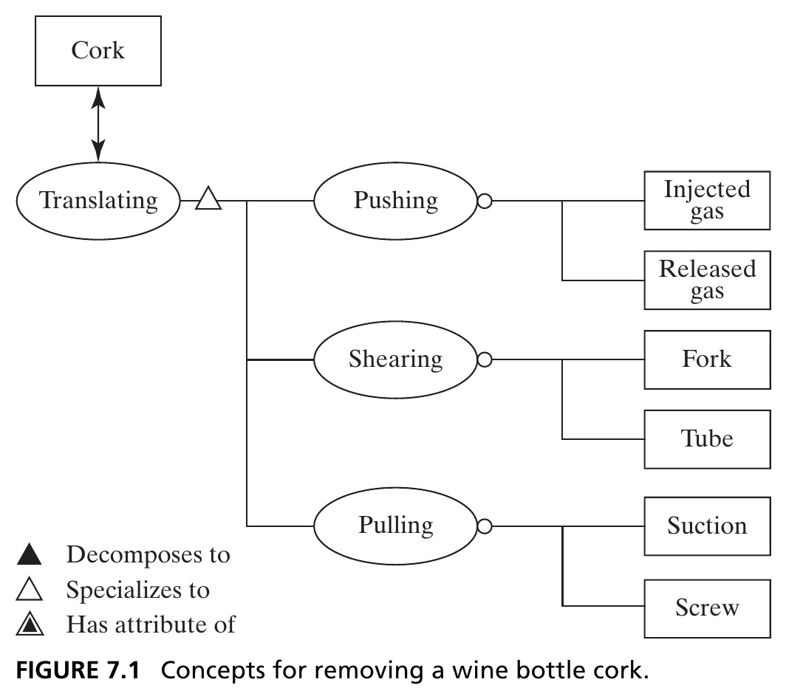{height=420px fig-align="center"}
:::
:::

::: {.side-caption}
Source: Crawley, Cameron & Selva (2016), Fig. 7.1.
:::

## Solution-Neutral Function in a Hierarchy {.smaller}

- Drawing Figure 7.1 is itself a form of **structured creativity** (Ch. 12) — pulling led us to think about pushing, which we might otherwise have missed
- Solution-neutral function exists in a **hierarchy**: translating the cork generalizes to removing the cork, which generalizes to opening the bottle, up to accessing the wine

::: {.fragment .callout-tip}
The breadth of concepts we generate depends heavily on the functional intent we pose — the more solution-neutral the expression, the broader the set of concepts.
:::

## Figure 7.2 · A Hierarchy of Broader Concepts {.smaller}

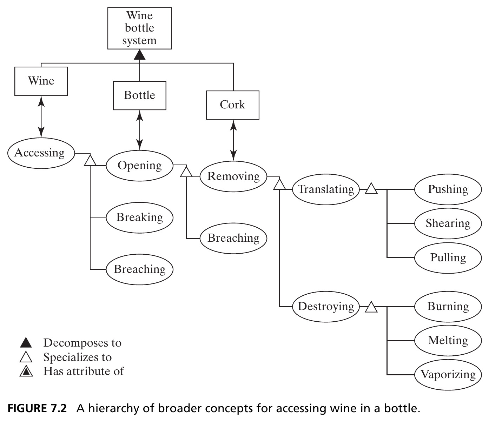{height=420px fig-align="center"}

::: {.side-caption}
Where to stop is a matter of practicality — with a wine bottle already on the table, concepts above "wine accessing" make no sense. Source: Crawley, Cameron & Selva (2016), Fig. 7.2.
:::

## Table 7.1 · Questions for Defining Concept {.smaller}

| Question | Produces |
|---|---|
| 7a. Who are the beneficiaries? What is the solution-neutral operand and its value-related attribute/process? | A solution-neutral framing of the desired function |
| 5a. What is the value-related operand-process-form? What is the concept? What other concepts satisfy the same function? | The operand-process-form construct defining the system |
| 5b. What are the internal functions? What are the concept fragments and integrated concept? | The internal processes/operands, first- and second-level |

# 7.2 Identifying the Solution-Neutral Function

## Deriving a Solution-Neutral Statement {.smaller}

::: {.columns}
::: {.column width="50%"}
The procedure (Question 7a):

- Consider the beneficiary
- Identify their need
- Identify the **solution-neutral operand** that, acted upon, yields the benefit
- Identify the operand's **attribute**
:::
::: {.column width="50%"}
- Identify **other relevant attributes** of the operand
- Define the **solution-neutral process** that changes the benefit-related attribute
- Identify relevant **attributes of that process**
:::
:::

::: {.fragment .callout-tip}
Two new examples: an **air transportation service** (beneficiary: the traveler) and a **home data network** (beneficiary: the surfer).
:::

## Table 7.2 · Formulating the Solution-Neutral Intent {.smaller}

| Question | Transportation Service | Home Network |
|---|---|---|
| Beneficiary? | Traveler | Surfer |
| Need? | "Visit a client in another city" | "Buy a cool book" |
| Solution-neutral operand? | Traveler | Book |
| Benefit-related attribute? | Location | Ownership |
| Other operand attributes? | Alone with light luggage | Consistent with tastes |
| Solution-neutral process? | Changing (transporting) | Buying |
| Attributes of process? | Safely and on demand | Online |

## Intent Vanishes When the System Operates {.smaller}

::: {.callout-important appearance="minimal" icon=false}
When a system operates, the intent **vanishes**. Watching a room full of servers, or a plane in flight, it's hard to tell *why* — the architect must record intent, because once built, the system rarely says it back.
:::

::: {.fragment}
In summary: the functional intent for a system should be stated as a **solution-neutral function** — an operand and a process (with their attributes) linked to value, containing **no reference to solution**.
:::

# 7.3 Concept

## The Notion of Concept {.smaller}

- The intellectual distance from solution-neutral function to architecture is a *large gap to jump* — **concept** bridges it
- Concept is the transition point from solution-neutral to solution-specific
- It must allow value-related functions to be executed, enabled by form; it establishes the vocabulary for the solution; it implicitly sets design parameters and the level of technology

## Box 7.2 · Definition of Concept {.smaller}

::: {.callout-note appearance="simple" icon=false}
**Concept** is a product or system vision, idea, notion, or mental image that maps function to form. It embodies a sense of how the system will function and an abstraction of the system form — a simplification of the architecture that allows for high-level reasoning.
:::

::: {.fragment}
Concept is **not** a system attribute, but a *notional mapping* between two attributes: form and function.
:::

## Figure 7.3 · Concept and Architecture {.smaller}

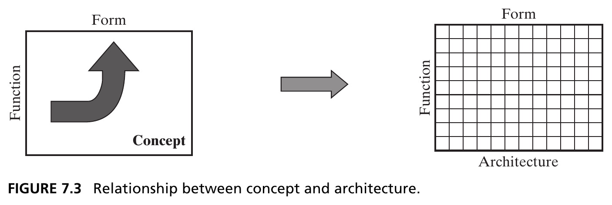{height=340px fig-align="center"}

::: {.side-caption}
Concept and architecture both map function to form — concept does it in a general way, architecture in elaborate detail. If you have a concept, it guides the architecture; if you have an architecture, **concept rationalizes** it. Source: Crawley, Cameron & Selva (2016), Fig. 7.3.
:::

## Concept, Concretely {.smaller}

::: {.fragment .callout-tip}
**Pump**: solution-neutral function is "moving fluid." The concept is *water* (specific operand), *pressurizing* (specific process), using a *centrifugal pump* (specific instrument of form).
:::

::: {.fragment .callout-tip}
**Bubblesort** is literally the name of a concept: *array* (specific operand: entries), *sequentially exchanging* (specific process), using *bubblesort* (specific instrument).
:::

- Naming the specific instrument (centrifugal pump, bubblesort) immediately establishes a vocabulary, sets design parameters, and implies a level of technology

## Figure 7.4 · Template for Deriving Concept {.smaller}

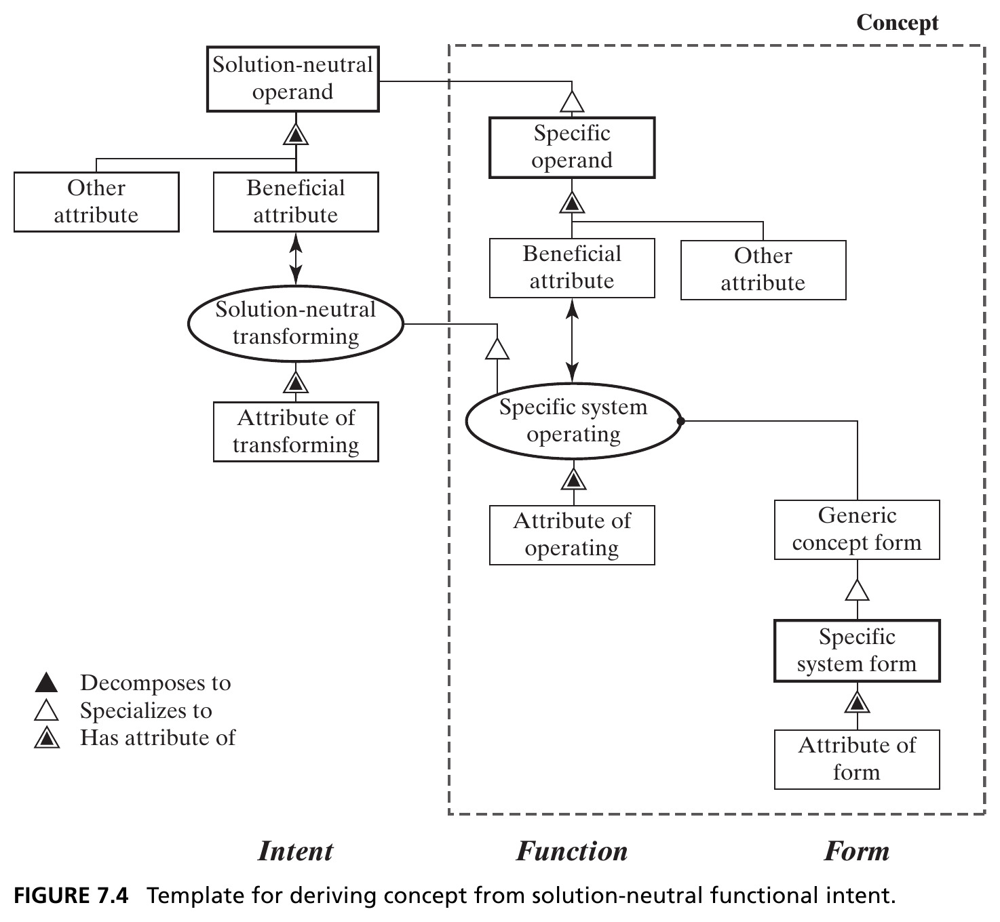{height=440px fig-align="center"}

::: {.side-caption}
Five key ideas (thick borders): solution-neutral operand, specific operand, specific system operating, generic concept form, specific system form. Intent → Function → Form. Source: Crawley, Cameron & Selva (2016), Fig. 7.4.
:::

## Table 7.3 · Five Systems, Solution-Neutral to Concept {.smaller}

| Solution-Neutral Operand | Solution-Neutral Process | Specific Operand | Specific Process | Specific Instrument |
|---|---|---|---|---|
| Fluid | Moving | Water | Pressurizing | Centrifugal pump |
| Array | Sorting | Array entries | Sequentially exchanging | Bubblesort |
| Cork | Translating | Cork | Pulling | Screw |
| Traveler | Transporting | Traveler | Flying | Airplane |
| Book | Buying | Internet | Accessing | Home DSL connection |

::: {.side-caption}
There is no single relationship between solution-neutral and specific operand/process — specializing to concept requires creativity, not automation.
:::

## Box 7.3 · Specializing Function to Concept {.smaller}

A few of the patterns the specific operand can take, relative to the solution-neutral operand:

- **Completely different** operand and process: *entertaining* a person by *watching* a DVD
- **Same process**, different operand: *choosing* a leader by *choosing* the president
- **Part of** the solution-neutral operand: *opening* the bottle by *removing* the cork
- **A type of** the solution-neutral operand: *moving* fluid by *pressurizing* water
- **An attribute** of the solution-neutral operand: *amplifying* a signal by increasing *signal voltage*

::: {.fragment .callout-tip}
Similar patterns apply to specializing the **process** — e.g., *transporting* a traveler by *flying* a traveler.
:::

## Table 7.4 · From Solution-Neutral to Concept {.smaller}

| Question | Transportation Service | Home Network |
|---|---|---|
| Specific operand? | Traveler | Internet |
| Benefit-related attribute? | Location | Access |
| Other operand attributes? | Alone with light luggage | High-speed connection |
| Specific process? | Flying | Gaining (accessing) |
| Attributes of process? | In less than 2 hours | Reliably |
| Generic concept form? | "Flyer" | "Accesser" |
| Specific form? | Airplane | Home DSL connection |
| Attributes of form? | Commercial | Inexpensive |

## Naming Concepts {.smaller}

- No simple convention exists — rationally, concepts are named **operand + process + instrument**, as in *light + emitting + diode*
- Naming for just the operand rarely works — a "mower" only makes sense because of the implicit "er" ending suggesting an instrument
- Sometimes a concept is named for an **attribute**: "wireless" described two entirely different concepts, a century apart

::: {.fragment .callout-tip}
Developing concepts is an open-ended creative process — the architect should build a *rich* set of alternatives before sorting and down-selecting (Ch. 11).
:::

## Figure 7.5 · A Tree of Concept Options {.smaller}

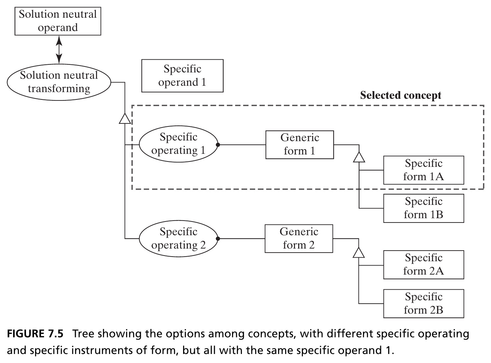{height=400px fig-align="center"}

::: {.side-caption}
An operand layer, a process layer, and an instrumental form layer. Fewer operand options than process options, and fewer process options than form options — a decision tree. Source: Crawley, Cameron & Selva (2016), Fig. 7.5.
:::

## Figure 7.6 · Pump Concept Options {.smaller}

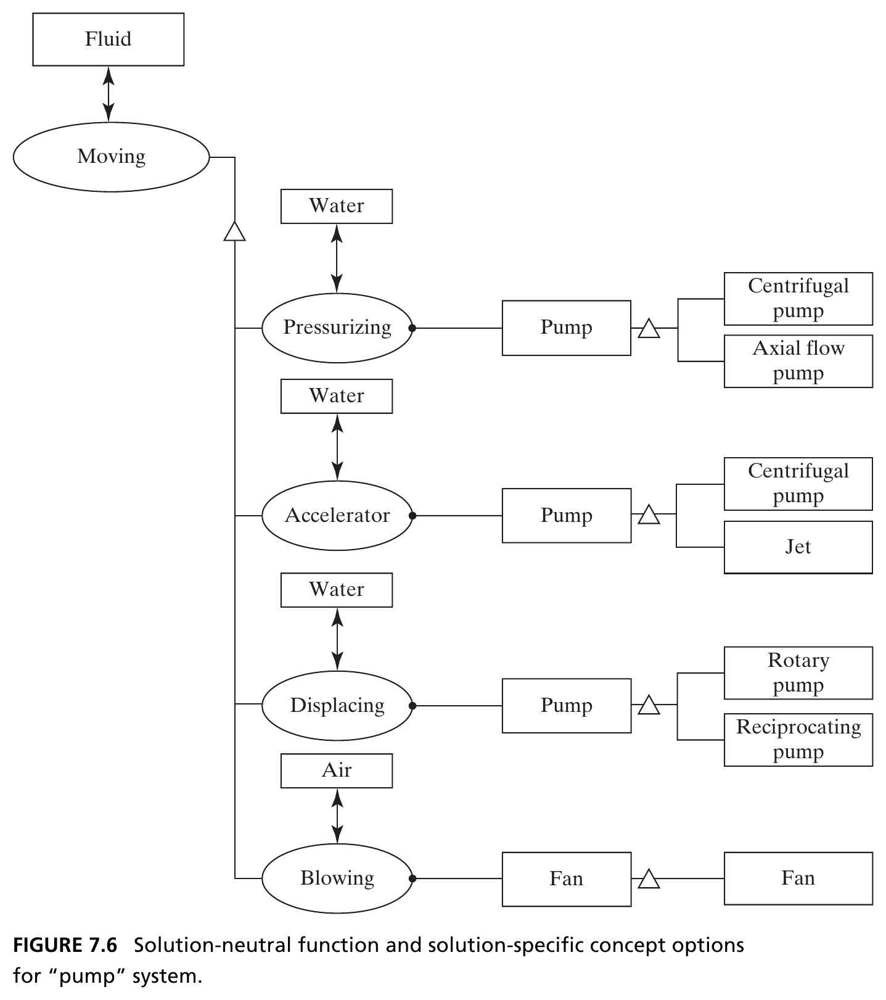{height=420px fig-align="center"}

::: {.side-caption}
Seven non-exhaustive concept options for moving fluid — from pressurizing with a centrifugal pump, to blowing air with a fan. Source: Crawley, Cameron & Selva (2016), Fig. 7.6.
:::

## Figure 7.7 · Bubblesort Concept Options {.smaller}

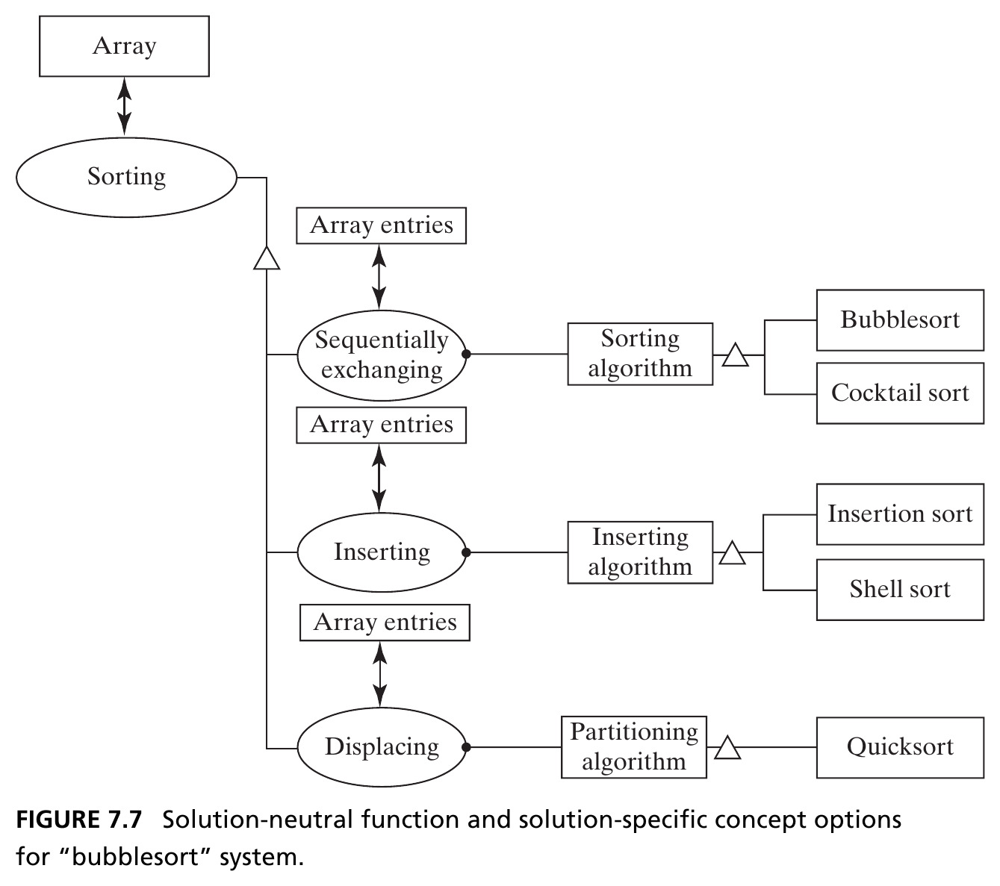{height=420px fig-align="center"}

::: {.side-caption}
Three principles of operation for sorting an array — sequentially exchanging, inserting, displacing — each with specific algorithms. Source: Crawley, Cameron & Selva (2016), Fig. 7.7.
:::

## Figure 7.8 · Transportation Concept Options {.smaller}

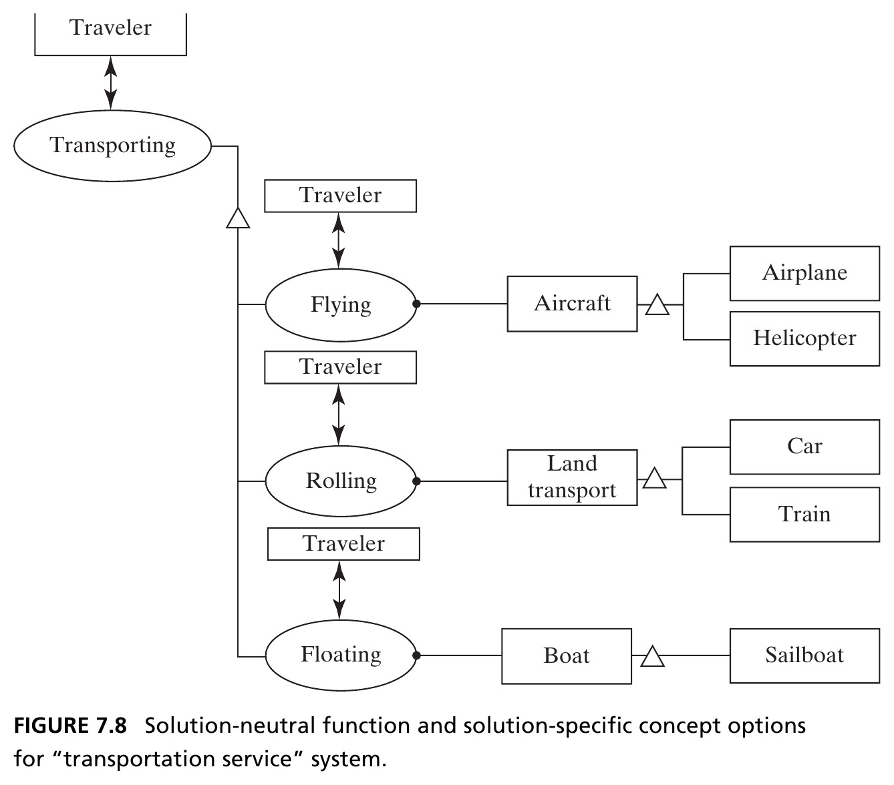{height=420px fig-align="center"}

::: {.side-caption}
Flying, rolling, and floating — each linked to common instruments. Traveler is the only likely operand; transporting is a long-standing human endeavor. Source: Crawley, Cameron & Selva (2016), Fig. 7.8.
:::

## Figure 7.9 · Home Network Concept Options {.smaller}

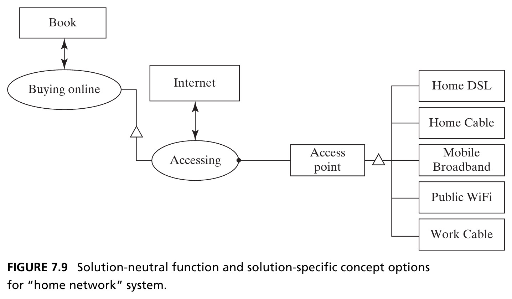{height=380px fig-align="center"}

::: {.side-caption}
A far more limited option space — buying a book online basically requires accessing the Internet, so the only real options are *how* you access it. Source: Crawley, Cameron & Selva (2016), Fig. 7.9.
:::

## Broader Concepts and Hierarchy {.smaller}

- The concept-option analysis looked "downward" toward increasing detail — but we can also look **"upward"** toward increasingly general intent
- Why move fluid? Maybe to dry a basement. Why dry a basement? Maybe to improve living conditions
- There is hierarchy in functional intent, just as there is hierarchy in built systems

::: {.fragment .callout-important appearance="minimal" icon=false}
The **specific function at one level becomes the solution-neutral functional intent at the next level down**.
:::

## Figure 7.10 · A Hierarchy Leading to Flying the Traveler

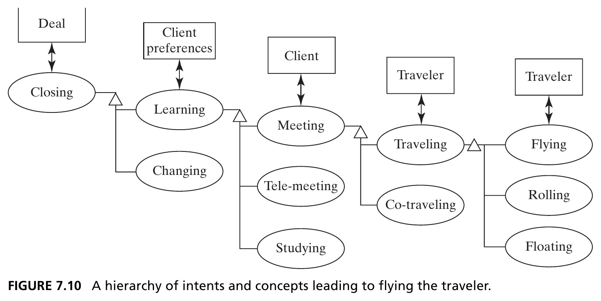{width=95% fig-align="center"}

::: {.side-caption}
Closing a deal, by learning client preferences, by meeting the client, by traveling, by flying. At every level there are alternatives — a teleconference instead of a visit, a train instead of a flight. Source: Crawley, Cameron & Selva (2016), Fig. 7.10.
:::

## Figure 7.11 · A Hierarchy Leading to Home Internet Access

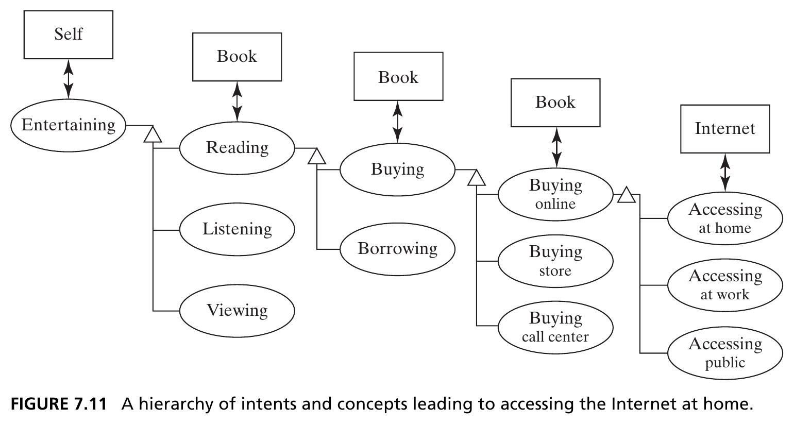{width=95% fig-align="center"}

::: {.side-caption}
Entertainment → reading books → buying books → buying online → accessing the network. Understanding this hierarchy might surface new options, like selling electronic books. Source: Crawley, Cameron & Selva (2016), Fig. 7.11.
:::

## Section 7.3 Summary {.smaller}

- **Concept** is a system vision that maps function to form; it sets the solution vocabulary and design parameters, and rationalizes the architecture
- Concept is derived by specializing the solution-neutral operand and process to a specific operand, process, and abstraction of form
- There is no naming convention, and no single relationship between solution-neutral and specific — concept generation requires **creativity**
- Concepts sit in a **hierarchy**: understanding it one or two levels up is very useful for the architect

# 7.4 Integrated Concepts

## Rich Concepts and Concept Fragments {.smaller}

- A concept's process is often rich in meaning, and can be "unpacked" into several internal functions — visiting a client implies going there, spending time, and returning
- An **integrated concept** is made of smaller **concept fragments** — one per internal process — combined recursively using the same concept-development procedure

::: {.fragment .callout-tip}
Transporting has at least three important internal processes: **lifting** (overcoming gravity), **propelling** (overcoming drag), and **guiding**. Without all three, transporting doesn't work.
:::

## The Morphological Matrix {.smaller}

- For a car, lifting, propelling, *and* guiding are all done by wheels — a car is **wheels-wheels-wheels**
- A train differs only in guiding — **wheels-wheels-ground**
- Combining one instrument per internal process across many choices reveals a surprising number of integrated concepts — this structured layout is a **morphological matrix** (covered in full in Ch. 14)

## Table 7.6 · Morphological Matrix for Transporting {.smaller}

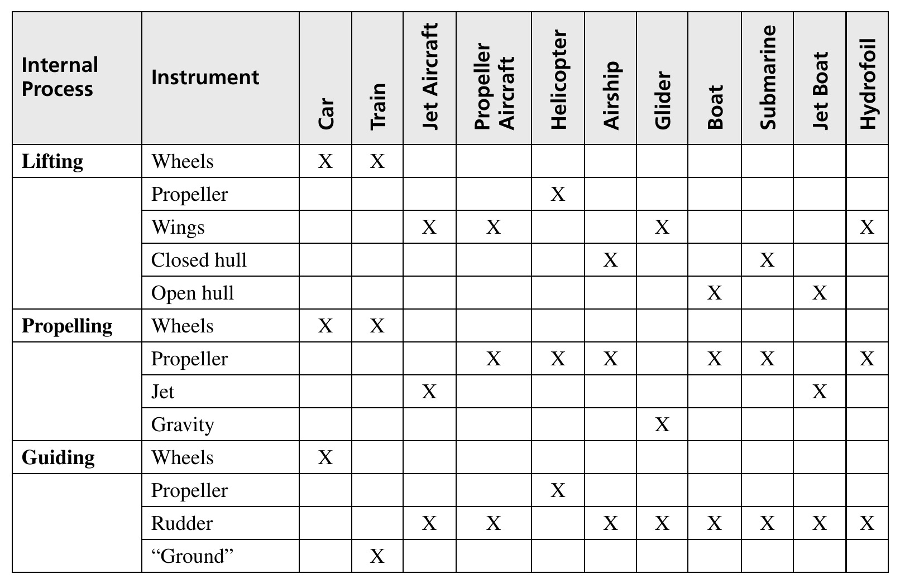{height=430px fig-align="center"}

::: {.side-caption}
Each column is an integrated concept. Aircraft and gliders differ only in propulsion; airships and submarines are conceptually identical, differing only in operating medium. Source: Crawley, Cameron & Selva (2016), Table 7.6.
:::

## Integrating the Home Data Network {.smaller}

- The home network has five key internal processes: connecting the local network to the ISP; modulating the ISP carrier signal; managing data on the local network; connecting user devices; interacting with the user
- Combining one instrument per process (with some flexibility — a residential gateway *and* a separate WAP can both manage the network) yields an integrated concept

## Figure 7.12 · An Integrated Concept for the Home Network {.smaller}

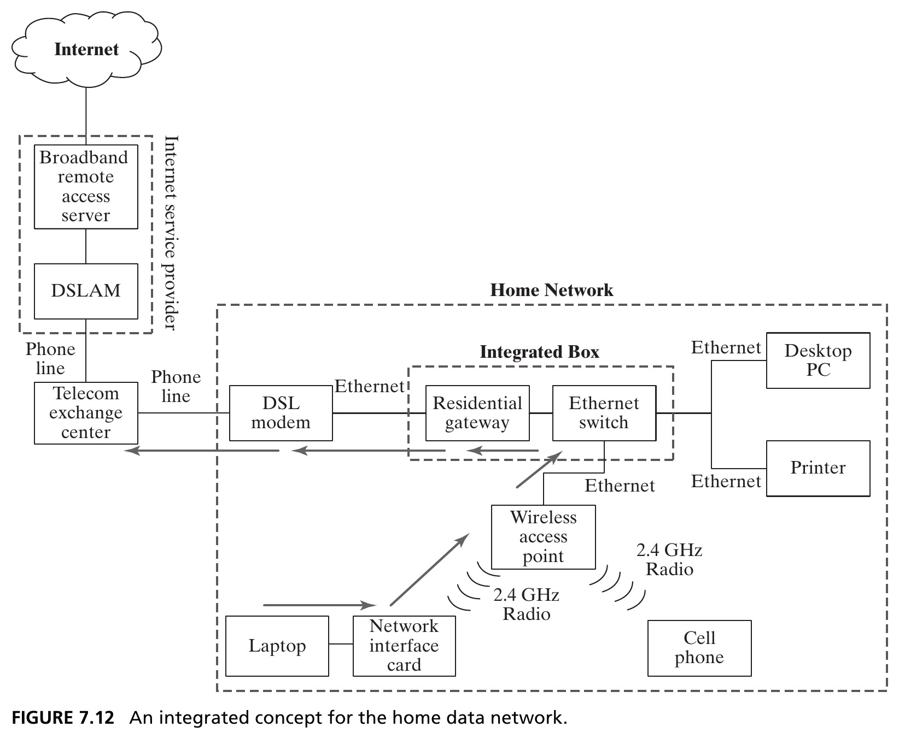{height=440px fig-align="center"}

::: {.side-caption}
A DSL modem plus a box combining a residential gateway and Ethernet switch, with both WiFi and Ethernet connections to user devices. Source: Crawley, Cameron & Selva (2016), Fig. 7.12.
:::

## Table 7.8 · Three Integrated Concepts Compared {.smaller}

| Function | Concept 1 | Concept 2 | Concept 3 |
|---|---|---|---|
| Local network ↔ ISP | DSL | Coaxial cable | Mobile broadband |
| Modulating carrier | Dedicated DSL modem | Cable modem, integrated | Embedded broadband modem |
| Managing local data | Gateway + switch + WAP | Integrated modem/gateway/switch | Modem + phone tether |
| Connecting devices | WiFi + Ethernet | Cable + Ethernet | WiFi |
| Interacting with user | Laptop, phone, desktop, printer | VOIP, TV, desktop, printer | Laptop |

## Section 7.4 Summary {.smaller}

- Rich concepts often unfold into a set of internal processes that must all be executed — choosing a specific operand, process, and instrument for each defines a **concept fragment**
- The architect explores and recombines concept fragments to build desirable **integrated concepts**
- The **morphological matrix** organizes this combinatorics — one column per integrated concept, one row per fragment choice

# 7.5 Concepts of Operations and Services

## Concept of Operations ("ConOps") {.smaller}

- Function is a somewhat static view of what a system **can do**; **operation** is the sequence of things leading to delivery of the primary function — what the system actually **does** (Ch. 6)
- The **concept of operations** sketches out *how* the system will operate: who operates it, when, and coordinated with what else
- The relationship between concept and architecture is the same as between concept of operations and a detailed operations sequence

## Service vs. Good {.smaller}

::: {.callout-note appearance="simple" icon=false}
If the enterprise transfers the **instrument**, it is a **good** (an aircraft manufacturer sells airplanes). If it transfers the **function**, it is a **service** (an airline sells transportation).
:::

::: {.fragment}
From the aircraft's own conops, the aircraft is the *operand* — it's loaded, flown, maintained. From the perspective of the *service*, the aircraft is the *instrument* — it transports the traveler.
:::

## Figure 7.13 · Two ConOps, Side by Side {.smaller}

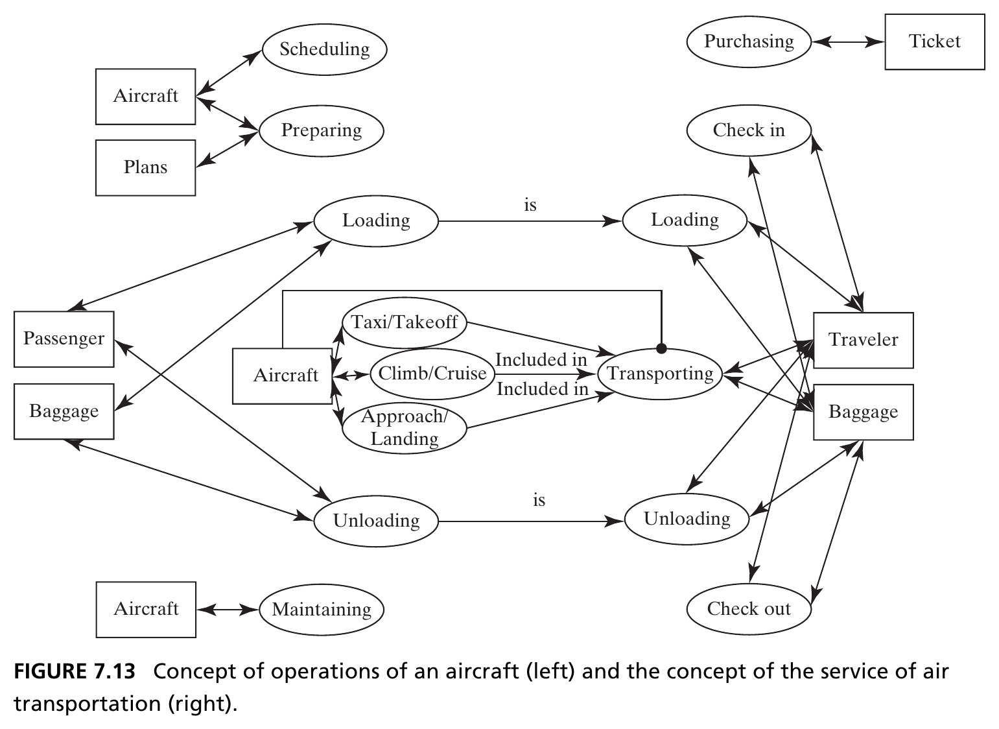{height=440px fig-align="center"}

::: {.side-caption}
Left: the concept of operations of the aircraft itself (scheduling, loading, taxi/takeoff, climb/cruise, approach/landing, unloading, maintaining). Right: the concept of the *service* of air transportation, seen from the traveler's side (purchasing, check-in, loading, transporting, unloading, check-out). Source: Crawley, Cameron & Selva (2016), Fig. 7.13.
:::

## A Service Is a System {.smaller}

- A service can be architected the same way as a system — it is simply more **process-focused** than a product
- The concept of operations contains information vital to understanding the system architecture: it's much easier to predict how a system delivers value once you know *how* it operates

::: {.fragment .callout-tip}
Details of taxi, takeoff, and the like are relatively unimportant to the traveler — but *very* important to the aircraft's own concept of operations. Same system, different conops, depending on perspective.
:::

## Section 7.5 Summary {.smaller}

- The **concept of operations** defines, at a conceptual level, how the system actually operates when it delivers value
- Concepts of operations can be defined both for the system itself, and for any service built upon it

## Chapter 7 Summary {.smaller}

- This chapter transitioned from simple to more complex systems, and from purely analytical to the beginning of a **synthetic** approach to architecture
- The synthetic process begins with the stakeholder's need, expressed as a **solution-neutral function** — then specializes the operand, process, and instrument to define a **concept**
- For almost any solution-neutral function there are many possible concepts; the architect creatively develops, sorts, and selects among them
- Rich concepts unfold into **concept fragments**, recombined into an **integrated concept** — and a **concept of operations** describes how it all actually runs

::: {.callout-tip}
**Reference**: Crawley, E., Cameron, B., & Selva, D. (2016). *System Architecture: Strategy and Product Development for Complex Systems*. Pearson. Chapter 7.
:::

## Next: System Architecture (Synthesis)

Chapter 8 builds on the selected concept and concept of operations to develop the full **architecture** of the system — completing the move from analysis to synthesis.
