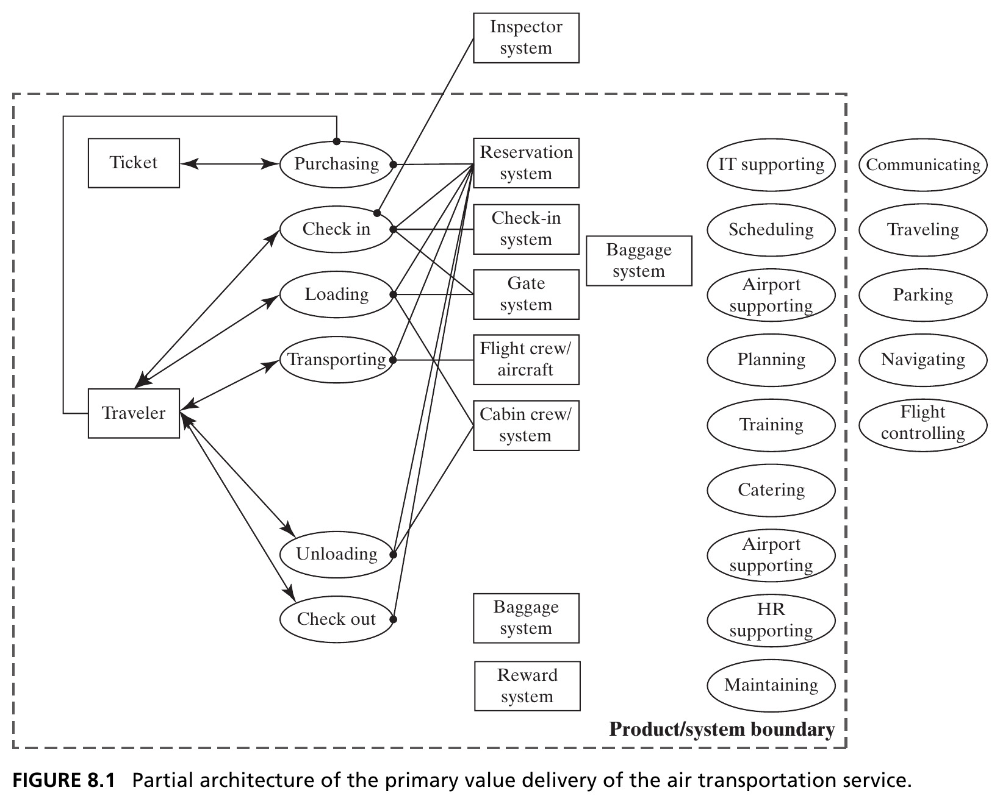
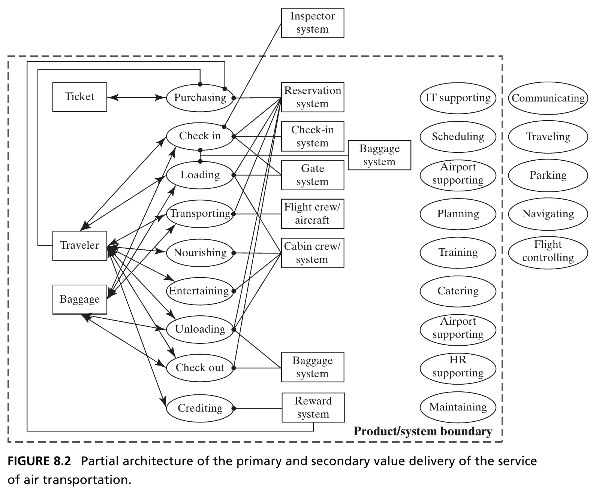
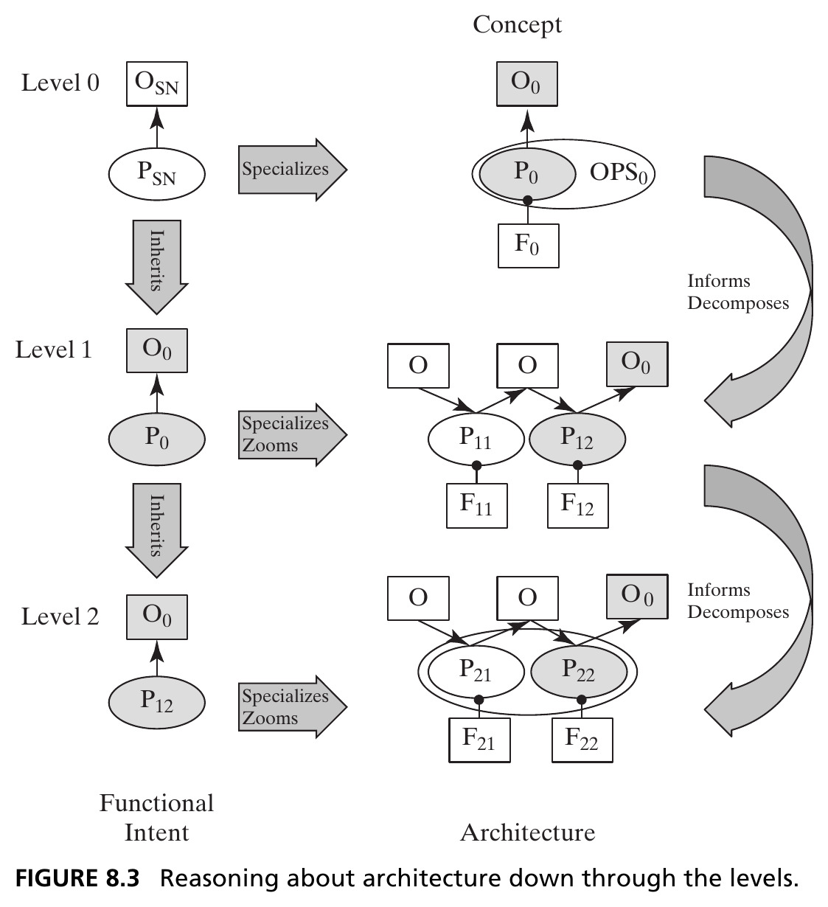
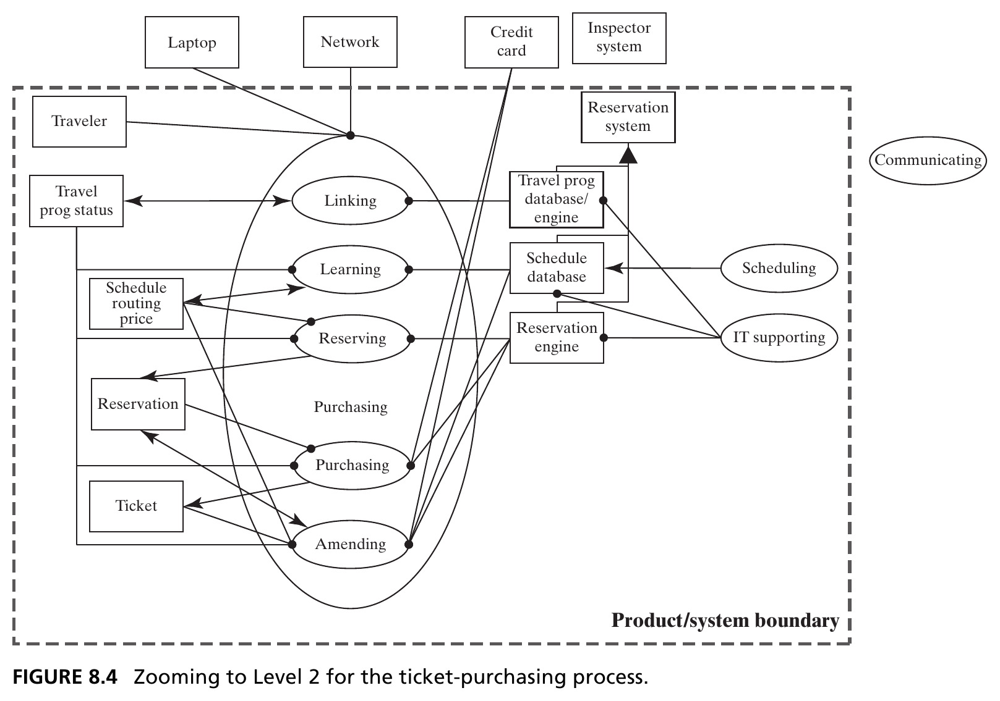
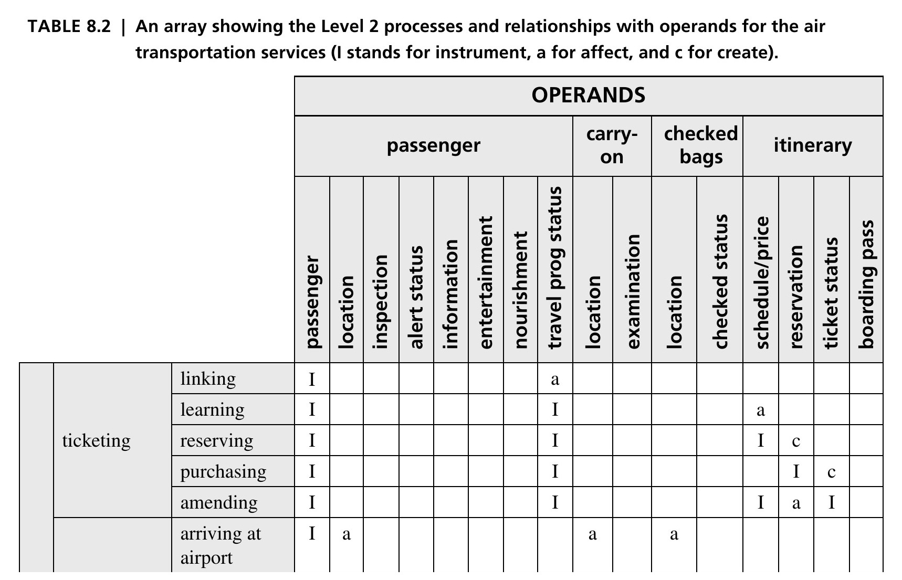
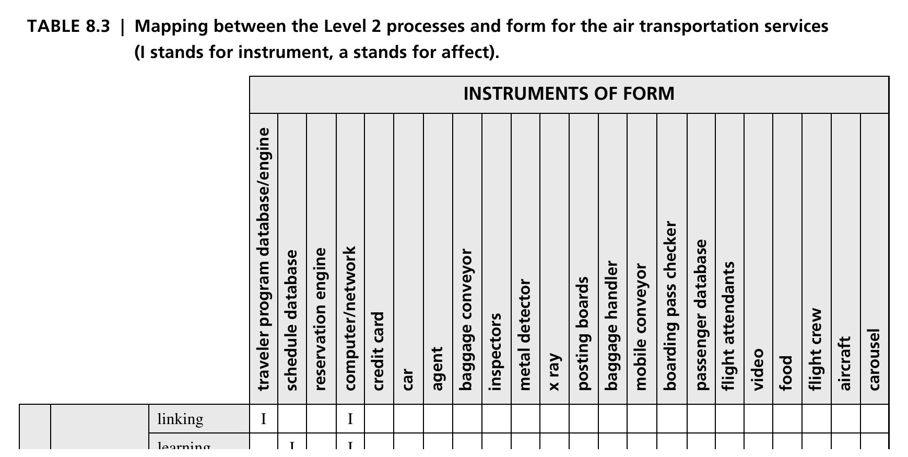
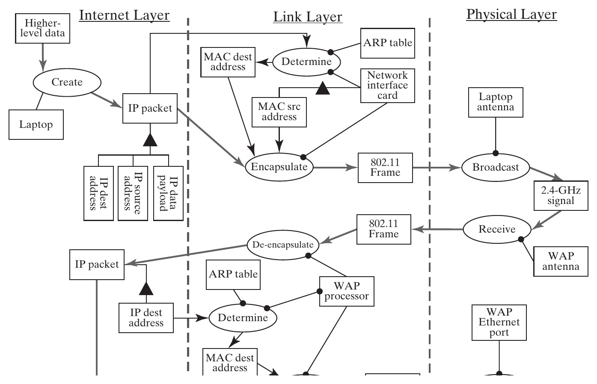
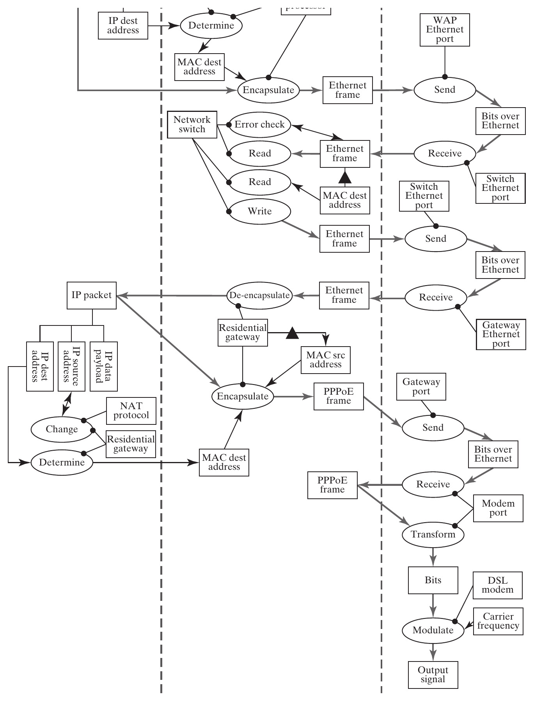
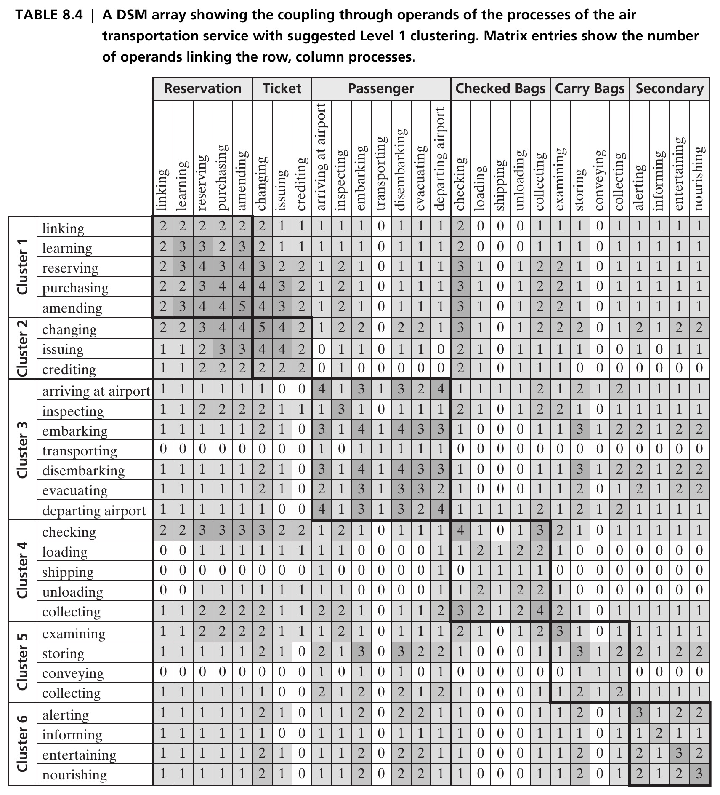

## Closing the Loop on Analysis {.smaller}

- Concept is a *notional* mapping between form and function — architecture is a comprehensive, detailed one
- The amount of information needed to describe architecture is **orders of magnitude larger** than what's needed for concept: a pump or bubblesort concept fits in one line, but the full architecture needs everything from Chapter 6
- This chapter shows the process: **concept → Level 1 architecture → Level 2 architecture → modularization**

::: {.fragment .callout-tip}
Running example: an **air transportation service**. Section 8.4 repeats the process for the home data network.
:::

## Two New Questions {.smaller}

Table 8.1 compiles every question from Chapters 4–7, in the order they're addressed during synthesis, plus two new ones this chapter answers:

::: {.callout-note appearance="simple" icon=false}
**8a.** How does the architecture of Level 1 extend to Level 2?
:::
::: {.callout-note appearance="simple" icon=false}
**8b.** What is a possible modularization of the Level 2 objects?
:::

# 8.2 Developing the Level 1 Architecture

## Expanding Concept to Functional Architecture {.smaller}

- First task: identify the **value pathway** — start with the key internal functions from the integrated concept (Question 5b), and link them from inputs/start points to outputs/end points
- Concept: *flying* a *traveler* with an *airplane*. Primary operand: the **traveler**. Secondary operand: **checked baggage**
- Every process acts on the traveler except purchasing the ticket; the only other operand is the **ticket** itself — an information object encoding itinerary, status, reservation, and fees

## Figure 8.1 · Primary Value Delivery {.smaller}

{height=400px fig-align="center"}

::: {.side-caption}
A simple "no-frills" airline: purchasing → check in → loading → transporting → unloading → check out. Source: Crawley, Cameron & Selva (2016), Fig. 8.1.
:::

## Figure 8.2 · Adding Secondary Value {.smaller}

{height=400px fig-align="center"}

::: {.side-caption}
Nourishing, entertaining, and crediting (a frequent-flyer program) add secondary value — and make the architecture noticeably more complex, since much of the operational detail must now be replicated for baggage too. Source: Crawley, Cameron & Selva (2016), Fig. 8.2.
:::

## Defining the Form: Zigzagging Back {.smaller}

- Recall Chapter 3's **zigzagging**: reason in one domain as long as practical, then switch. We've gone as far as we can in function — time to "zig" into form (Questions 4a–4f)
- **4a.** The form is the airline's employees and equipment, plus leased airport entities directly tied to processing (ticket desks, baggage conveyors) — *excluding* non-airline airport services (parking, arriving by car) and government-run ATC/navigation/security
- **4d–4f.** Accompanying systems (navigation satellites, ATC towers) are only *inferred*, not shown; the one explicit interface is federally supplied security inspection at check-in; use context is a single domestic leg with substantial surrounding infrastructure (roads, rental cars) left out of scope

## Mapping Function to Form {.smaller}

- "Zag" back to function: the **reservation system** is an instrument of virtually every process — the check-in and gate systems only get the traveler checked in and boarded; the flight crew is responsible only for transporting (Question 6a)
- **Non-idealities (6b):** this model doesn't yet handle a transiting passenger, a hub connection, or international travel with passport control
- **Supporting functions (6c)** are enumerated in Figure 8.2 but *not yet connected* — nearly every value-related instrument needs personnel who must be trained and supported (HR), and mapping that fully requires Level 2 detail

## Sequence and Parallel Threads {.smaller}

- **Sequence (6e)** is inferred directly from how Figure 8.2 is drawn: processes are listed vertically in the order they occur
- **Parallel threads (6f)** are strongly suggested: baggage has almost an entire parallel path to the passenger, separating at check-in and (hopefully) reuniting at check-out
- **Clock time (6g)** clearly matters — aircraft keep real schedules — but that information isn't shown here; it would need additional diagrams

## Figure 8.3 · Reasoning Down Through the Levels {.smaller}

{height=440px fig-align="center"}

::: {.side-caption}
The starting point for Level 1 is the Level 0 information: the solution-neutral function, the concept, and the concept of operations. Source: Crawley, Cameron & Selva (2016), Fig. 8.3.
:::

## Function-Goal Reasoning {.smaller}

::: {.callout-important appearance="minimal" icon=false}
**The solution at one level becomes the problem statement at the next.**
:::

- The Level 0 specific function (the functional half of the concept) becomes the **functional intent at Level 1**
- That intent is specialized and zoomed into the Level 1 functional architecture — operands and internal processes — while Level 0 form is decomposed into Level 1 entities of form and mapped onto them
- The rest of Level 1 detail fills in from there: non-idealities, supporting processes and form, interfaces

## Section 8.2 Summary {.smaller}

- Level 1 architecture begins from the value pathway: the key internal functions of the integrated concept, linked start to end
- Zigzagging alternates function and form — form questions (4a–4f) and function-to-form mapping (6a–6g) round out the picture
- **Function-goal reasoning** governs the whole process: the specific function at one level *is* the functional intent one level down

# 8.3 Developing the Level 2 Architecture

## Intent and Recursion at Level 2 {.smaller}

- The complete Level 1 architecture already has **18+ internal processes** (9 value-related + supporting) plus their form and interfaces — already a great deal of complexity
- The key question: *is Level 1 the right decomposition — or at least a good one?* We can't fully judge that without seeing how the details actually work
- We **recursively apply Table 8.1**, one more level down: *each function at Level 1 becomes a statement of functional intent at Level 2* — the same function–goal reasoning as Figure 8.3, one level lower

::: {.fragment .callout-tip}
Example: "purchasing tickets" (Level 1) becomes the Level 2 intent, specialized down to *purchasing online* and beyond.
:::

## Figure 8.4 · Zooming to Level 2 for Ticket Purchasing {.smaller}

{height=420px fig-align="center"}

::: {.side-caption}
Purchasing specializes into 5 internal processes (linking, learning, reserving, purchasing, amending) and reveals 3 new internal operands and 3 new accompanying instruments — all hidden at Level 1. Source: Crawley, Cameron & Selva (2016), Fig. 8.4.
:::

## Table 8.2 · Level 2 Processes and Operands {.smaller}

{height=420px fig-align="center"}

::: {.side-caption}
Applying this zooming to all 9 Level 1 value processes produces **28 internal processes at Level 2** (excerpt shown — ticketing and part of checking-in). Note 3 processes (entertaining, nourishing, crediting) get "demoted" from Level 1 — such judgment calls are routine in architecting. Source: Crawley, Cameron & Selva (2016), Table 8.2.
:::

## Table 8.3 · Level 2 Processes Mapped to Form {.smaller}

{height=420px fig-align="center"}

::: {.side-caption}
28 processes mapped onto 22 instruments of form (excerpt shown) — close to one-to-one, with notable exceptions: agents and flight attendants are human, and adapt to many roles. Source: Crawley, Cameron & Selva (2016), Table 8.3.
:::

## Do We Need Level 3? {.smaller}

- Together, Tables 8.2 and 8.3 *are* the Level 2 architecture — though still without supporting systems, interfaces, or external accompanying systems
- Typical scale: **Level 1** ≈ 20–30 entities; **Level 2** ≈ 50–100; **Level 3** would run into the *hundreds*

::: {.fragment .callout-important appearance="minimal" icon=false}
Three levels are hard to develop and too much to comprehend easily — we usually don't need to go to Level 3. Examining Level 2 exists to **confirm** Level 1's abstractions and **inform modularization** — not to fully re-architect everything one level deeper.
:::

## Section 8.3 Summary {.smaller}

- Level 2 architecture is developed by **recursively** applying the same procedure: each Level 1 function becomes the Level 2 functional intent
- The result is dramatically more detailed — dozens of processes and operands, mapped onto dozens of form instruments
- The purpose isn't more detail for its own sake: it's to **validate** the Level 1 decomposition and enable good **modularization** (Section 8.5)

# 8.4 Home Data Network Architecture at Level 2

## A Second Worked Example {.smaller}

- Recall from Chapter 7: solution-neutral function is *buying a book*; the integrated concept is *accessing the Internet* via a DSL modem, residential gateway/switch, WiFi access point, and laptop
- Figure 8.5 traces an IP packet's Level 2 architecture, from the laptop until it leaves the house — broken into three **layers**: Internet, Link, and Physical (mirroring the bottom of the standard Internet protocol suite)

::: {.fragment .callout-tip}
Layering lets a network designer view the system through the lens of a single layer at a time — powerful for scalability and robustness, but it makes the *functional pathway* of the data harder to trace end to end.
:::

## Figure 8.5a · Laptop to Wireless Access Point {.smaller}

{height=440px fig-align="center"}

::: {.side-caption}
The laptop creates an IP packet, encapsulates it into an 802.11 frame with MAC addressing (via ARP), and broadcasts it over WiFi; the WAP receives, de-encapsulates, and re-encapsulates it as an Ethernet frame toward the switch. Source: Crawley, Cameron & Selva (2016), Fig. 8.5.
:::

## Figure 8.5b · Switch to the ISP {.smaller}

{height=460px fig-align="center"}

::: {.side-caption}
The switch error-checks, reads the destination, and forwards the frame to the gateway, which de-encapsulates it, performs **NAT** (network address translation) to swap the private IP for a public one, and re-encapsulates it as PPPoE — modulated by the DSL modem onto the phone line toward the ISP. Source: Crawley, Cameron & Selva (2016), Fig. 8.5.
:::

## Section 8.4 Summary {.smaller}

- The home network expands to Level 2 the same way: **24 internal processes**, following the same recursive function–goal reasoning
- Instruments include both physical devices (laptop, switch, antenna) and informational objects (software, data tables like the ARP table)
- The Level 2 model — and specifically its layered structure — lets us judge whether the Level 1 model was robust and well-modularized

# 8.5 Modularizing the System at Level 1

## Why Modularize? {.smaller}

- We initially organized Level 1 by the **timeline** of air travel: ticketing, checking in, loading, transporting, unloading, checking out. Is that actually a *good* decomposition?
- Objective: **cluster** entities that are tightly interconnected — this minimizes interactions *across* modules and maximizes coherence *within* them
- First choice: cluster by **process** (via shared operands) or by **form** (via structure) — Box 8.1 covers both

## Box 8.1 · Clustering by Interactions {.smaller}

::: {.callout-note appearance="simple" icon=false}
Three tasks: choose the basis for clustering (processes or form), represent that information (as a DSM), and compute the clusters. Replacing the interaction *type* (create/affect/instrument) with a simple **count** of connections lets a clustering algorithm rearrange rows and columns into tightly coupled blocks.
:::

::: {.fragment .callout-tip}
Here, clustering is based on **processes**, linked through *shared operands*: two processes that touch many of the same operands are assumed to be tightly coupled.
:::

## Table 8.4 · DSM Clustering of Level 2 Processes {.smaller}

{height=420px fig-align="center"}

::: {.side-caption}
The **Thebeau algorithm** reorders the 28×28 process-interaction matrix so tightly-coupled entities fall into contiguous, shaded blocks along the diagonal — six clusters emerge. Individual cell values aren't the point here; the *block-diagonal pattern* is. Source: Crawley, Cameron & Selva (2016), Table 8.4.
:::

## Six Clusters Emerge {.smaller}

- **Cluster 1** (reservation): linking, learning, reserving, purchasing, amending
- **Cluster 2** (ticket): changing, issuing, crediting
- **Clusters 3–5** (passenger, checked bags, carry-on bags): each follows the same check-in → move → check-out pattern for its respective operand
- **Cluster 6** (secondary experience): alerting, informing, entertaining, nourishing

::: {.fragment .callout-tip}
This clustering is *organized by operand path*, not by chronology — a genuinely different decomposition than the original timeline-based one.
:::

## Two Decompositions, Neither "Right" {.smaller}

- The clustering isn't perfect — interactions still cross block boundaries — and clustering doesn't guarantee a *better* modularization, just *a* systematic one
- The original, timeline-based decomposition (Figure 8.2) and this operand-based one (Table 8.4) represent **two different ways of organizing the same system**

::: {.fragment .callout-important appearance="minimal" icon=false}
If the airline cared about *running time*, the time-based organization might make more sense. If it cared about *end-to-end reliability* per passenger or bag, the operand-based clustering looks more appropriate.
:::

## Section 8.5 Summary {.smaller}

- Modularizing Level 1 well requires expanding to Level 2, examining relationships by process or form, and then clustering
- Clustering algorithms maximize local interaction and minimize cross-block interaction — better informing internal interfaces and how design work gets distributed
- No single decomposition is universally "correct" — the right one depends on what the architect is optimizing for

## Chapter 8 Summary {.smaller}

- Concept expands into architecture through a **recursive** process: Level 0 → Level 1 → Level 2, applying function–goal reasoning at each step
- Level 1 architecture starts from the value pathway (Question 5b), then zigzags between function and form to fill in the rest (Questions 4, 5, 6)
- Level 2 architecture, developed the same way, has two jobs: **validate** that Level 1 is a reasonable decomposition, and **inform its modularization**
- **This closes Part 2** — analysis of form (Ch. 4), function (Ch. 5), form-to-function mapping (Ch. 6), solution-neutral function and concept (Ch. 7), and Level 1/2 architecture (Ch. 8)

::: {.callout-tip}
**Reference**: Crawley, E., Cameron, B., & Selva, D. (2016). *System Architecture: Strategy and Product Development for Complex Systems*. Pearson. Chapter 8.
:::

## Next: Part 3 — Creating System Architecture

Having analyzed how architecture is built, we turn to **real synthesis**: defining architectures that don't yet exist, for complex systems, starting with the role of the architect (Chapter 9).
