## Starting Part 3: Creating System Architecture {.smaller}

- Part 2 was about **holism** — the architect must manage a huge number of considerations
- This can be misread as "the architect is a generalist." Not so: to paraphrase Eberhardt Rechtin, the architect is a **specialist** in simplifying complexity, resolving ambiguity, and focusing creativity
- The architect is not the design team, the financial controller, the marketing executive, or the plant manager

::: {.fragment .callout-tip}
Three principal roles: **reduce ambiguity**, **employ creativity**, **manage complexity**.
:::

## The Three Roles of the Architect {.smaller}

::: {.columns}
::: {.column width="33%"}
**Reduce ambiguity**

Define the boundaries, goals, and functions of the system.
:::
::: {.column width="33%"}
**Employ creativity**

Create the concept.
:::
::: {.column width="33%"}
**Manage complexity**

Choose a decomposition of the system.
:::
:::

::: {.fragment}
These three roles all center on **information**: reducing ambiguity by identifying necessary, consistent, important information; adding new information through creativity; and managing the explosion of information in the final architecture.
:::

# 9.2 Ambiguity and the Role of the Architect

## Before the Architect Is Engaged {.smaller}

- There has been an **"upstream process"** — full of ambiguity, issues, opportunities, and needs for the new system
- What are the high-priority needs vs. the "nice to haves"? What regulations apply? How is manufacturing competence aligned with the envisioned product?

::: {.fragment .callout-important appearance="minimal" icon=false}
**The architect drives ambiguity out of the upstream process.** The architect is responsible for creating boundaries and concretizing goals.
:::

## Driving Ambiguity Out: The Architect's Inputs {.smaller}

- Interpreting corporate and functional strategies, competitive marketing analyses
- Listening to users, beneficiaries, customers, or their representatives
- Considering the competence of the enterprise and its supply chain
- Considering operations and the operational environment of the system
- Infusing technology where appropriate
- Interpreting regulatory and pre-regulatory influences
- Recommending standards, frameworks, and best practice
- Developing goals for the system based on the upstream influences

## From Goals to Concept to Complexity {.smaller}

::: {.fragment}
**Employing creativity**: once goals are defined, there's a creative task — defining a concept. A good concept doesn't ensure success, but a bad concept almost certainly dooms a system to failure. Tasks include proposing concept options, identifying key metrics and drivers, conducting highest-level trades, selecting a concept (and perhaps a backup), thinking holistically about the full lifecycle, and anticipating failure modes.
:::

::: {.fragment}
**Managing complexity**: once a concept is chosen, information explodes rapidly — external interfaces, first-level design, decomposition, downstream considerations. The architect manages this by decomposing form and function, allocating functionality to form, defining interfaces, configuring subsystems, balancing flexibility vs. optimality, and controlling product evolution.
:::

## Box 9.1 · Principle of the Role of the Architect {.smaller}

::: {.callout-note appearance="simple" icon=false}
*"Some single mind must master, else there will be no agreement in anything."* — Abraham Lincoln

*"Timing has a whole bunch to do with the outcome of a rain dance."* — Cowboy saying
:::

- The role of the architect is to resolve ambiguity, focus creativity, and simplify complexity — creating elegant systems that create value and competitive advantage
- Given the ambiguity and complexity in most systems, it's often desirable to have architecture created by a **single individual or a small group**
- The architect maintains a holistic view but always focuses on the small number of issues critical to the design, and adopts different frameworks and paradigms as appropriate — not a single fixed method

## Two Kinds of Ambiguity {.smaller}

::: {.callout-note appearance="simple" icon=false}
Ambiguity is composed of two ideas: **fuzziness** and **uncertainty**. In common usage it also connotes incorrect, missing, or conflicting information.
:::

::: {.columns}
::: {.column width="50%"}
**Fuzziness**

Occurs when an event or state is subject to multiple interpretations. "Smooth finish" or "good gas mileage" mean different things to different customers — fuzziness is influenced by context.
:::
::: {.column width="50%"}
**Uncertainty**

Occurs when an event's outcome is unclear or in doubt. We can articulate the possible states, but not which one will occur — like a coin flip.
:::
:::

## The (X, Y, Z) Shorthand for Compounding Ambiguity {.smaller}

Where X, Y, Z are the *true* inputs to the system:

- **Unknown information** (X, __, Z): information is under-determined or unavailable. A *known unknown* is knowing you lack it (a competitor's plans); an *unknown unknown* is not even knowing you lack it (a brand-new competitor appears)
- **Conflicting information** (X, D, Z and X, B, Z): two or more sources offer opposing indications — the problem is over-determined
- **False information** (F, Y, Z): you believe you have complete information, but some of it is simply wrong

## Classifying Ambiguity — A Quick Drill {.smaller}

- Will it be a boy or a girl? *(Uncertain, Fuzzy)*
- Produce a low-cost, high-quality product. *(Conflicting, Fuzzy, Unknown)*
- Every fourth year is a leap year. *(False)*
- Please make me a smooth cover for this phone. *(Fuzzy)*
- Make sure we meet your quarterly goals. *(Unknown, Conflicting)*

::: {.fragment .callout-tip}
Ambiguity is almost always present in the upstream influences — segmented roughly by corporate function: strategy, marketing, customers, manufacturing, operations, R&D, regulations, standards.
:::

## Box 9.2 · Principle of Ambiguity {.smaller}

::: {.callout-note appearance="simple" icon=false}
*"The best-laid schemes o' mice an' men / Gang aft agley [often go awry]"* — Robert Burns
:::

- The early phase of a system design is characterized by great ambiguity — the architect must resolve it to produce (and continuously update) goals for the team
- Development is possible only with the acceptance of uncertainty
- No one designs or rigorously controls the upstream process — there should be **no expectation of unambiguity**
- Uncertainty can create opportunities; it is not always bad
- Uncertainties should be identified and prioritized so they can be managed

## Deliverables of the Architect {.smaller}

::: {.callout-important appearance="minimal" icon=false}
Deliverables are different from tasks — they are the **end result**, not the procedure by which it's achieved.
:::

- A clear, complete, consistent, attainable (80–90% confidence) set of goals, emphasizing functional goals
- A description of the broader context, including the whole product context
- A **concept** for the system, and a **concept of operations** including contingency/emergency operations
- A functional description with at least two layers of decomposition
- The decomposition of form to two levels of detail, and the structure at this level
- Details of all external interfaces and a process for interface control
- A notion of developmental cost, schedule, risk, and design/implementation plans

## Section 9.2 Summary {.smaller}

- The role of the architect includes reducing ambiguity, employing creativity, and managing complexity
- Architecture sits astride upstream activities (before) and downstream activities (after) — ambiguity arises from both
- In practice, ambiguity is a combination of fuzzy, uncertain, missing, conflicting, and incorrect information
- The principal job of the architect at the interface to the upstream (the "fuzzy front end") is to drive as much of this ambiguity from the system as possible

# 9.3 The Product Development Process

## What Is a PDP? {.smaller}

::: {.callout-note appearance="simple" icon=false}
Nearly every large firm has a **product development process (PDP)** — capturing methodology, terminology, phases, milestones, and tasks/outputs.
:::

- A principal advantage: it's a tool for reducing ambiguity by defining tasks and responsibilities
- But it's easy to be lulled into thinking the PDP resolves upstream ambiguity automatically — this is only *partially* true. A PDP can do the architect a disservice if it presumes more certainty than is actually present
- We seek a PDP that is "birth to death" *and* "lust to dust" — capturing everything from first envisioning a product to retiring the last instance

## Figure 9.1 · NASA's PDP {.smaller}

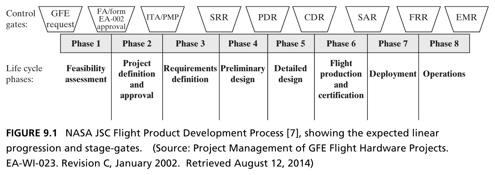{height=380px fig-align="center"}

::: {.side-caption}
Includes some of the fuzzy front end (feasibility, approval, requirements) and includes operations — since NASA is usually the operator of its own products. Very traceability- and review-heavy, reflecting low-volume, high-cost, high-perceived-risk systems. Source: Crawley, Cameron & Selva (2016), Fig. 9.1.
:::

## Figure 9.2 · Helicopter Inc.'s PDP {.smaller}

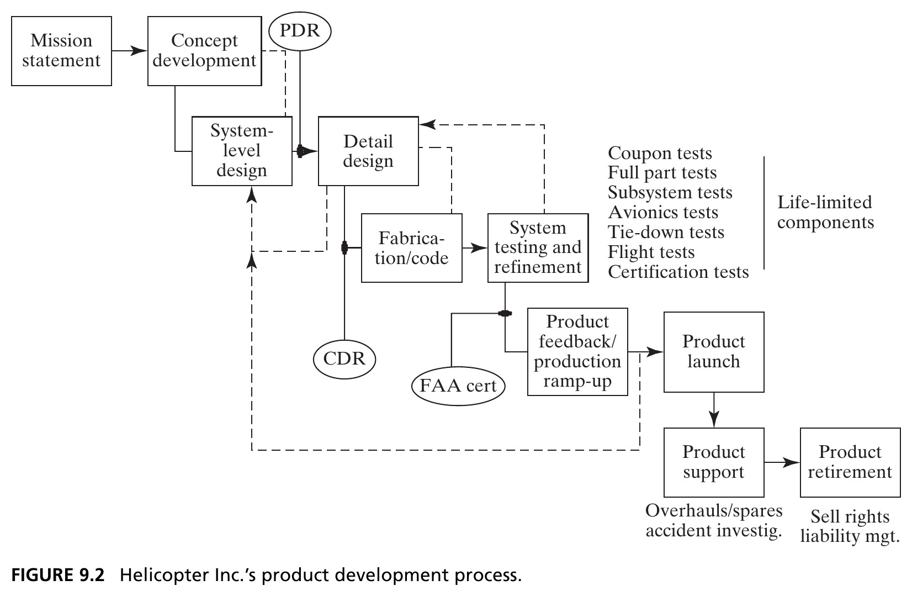{height=440px fig-align="center"}

::: {.side-caption}
Compared to NASA, iteration loops stand out — even in aerospace, iteration is inevitable and not at odds with a stage-gated process. The process centers on FAA certification, itself an instrument of the more important process: sales. Source: Crawley, Cameron & Selva (2016), Fig. 9.2.
:::

## Figure 9.3 · Camera Co.'s PDP {.smaller}

::: {.columns}
::: {.column width="55%"}
- Camera Co.'s PDP explicitly shows upstream processes: strategy, voice of the customer, and R&D — all part of "conceiving"
- Manufacturing process development *precedes* product development — Camera Co. is a process-driven industry
- Raises a question: does the architect's role in reducing *manufacturing* ambiguity matter more than innovation, given a stable customer base?
:::
::: {.column width="45%"}
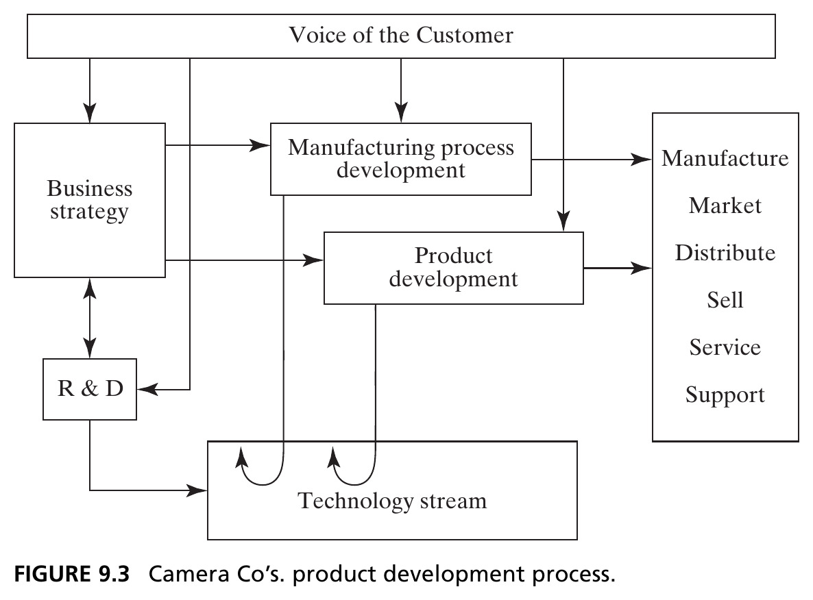{width=100%}
:::
:::

## Figure 9.4 · An Agile PDP {.smaller}

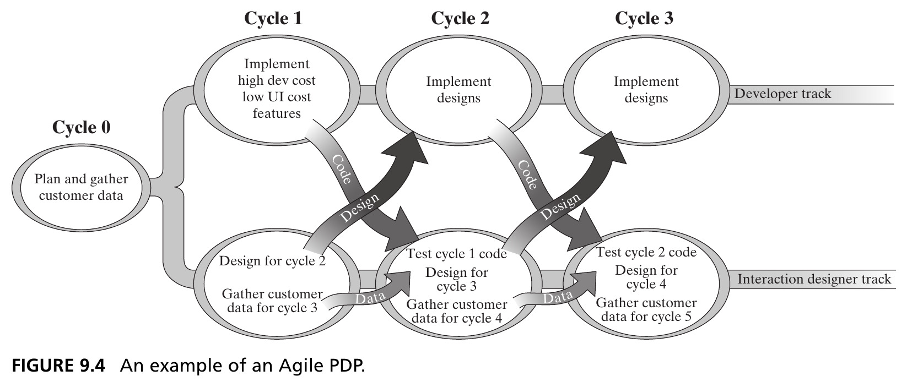{height=420px fig-align="center"}

::: {.side-caption}
Agile emphasizes iterative, incremental development — collaborative teams evolve requirements and solutions evolutionarily. Originated in rapid prototyping of software for small/medium applications; since extended (with mixed success) to capital-intensive, longer-lifecycle industries. Source: Crawley, Cameron & Selva (2016), Fig. 9.4.
:::

## Comparing the Four PDPs {.smaller}

Are differences between PDPs superficial, or substantial? Some observed differences:

- Existence/number of phases and phase exit criteria
- Existence/number of design reviews, timing for committing capital
- Requirements "enforcement," degree of customer input/feedback/aftermarket integration
- Degree of explicit/implicit iteration, amount of prototyping
- Internal testing/validation effort, importance of traceability, timing of supplier involvement

::: {.fragment .callout-tip}
Many factors *could* drive real differences: hardware vs. software, existing vs. new product, standalone vs. platform, production volume, capital intensity, technology push vs. market pull.
:::

## Figure 9.5 · The Generic PDP {.smaller}

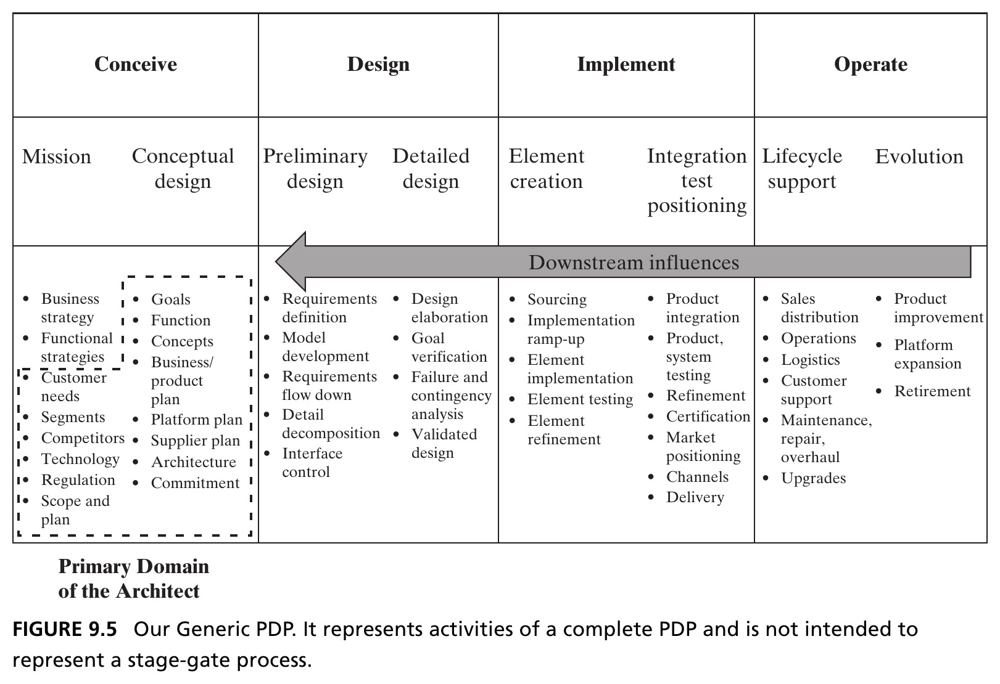{height=440px fig-align="center"}

::: {.side-caption}
Four common activity groups: **conceiving**, **designing**, **implementing**, **operating** — a checklist, not a stage-gate process. The architect's primary domain sits in "conceive," but must move relevant downstream information back into the architecting phase. Source: Crawley, Cameron & Selva (2016), Fig. 9.5.
:::

## Linear Representations Are Flawed {.smaller}

::: {.callout-important appearance="minimal" icon=false}
Studies have shown that linear representations of the design process are deeply flawed — they fail to represent iterations and feedback, presume a linear flow of time and effort across stages, and can mask a design's immaturity when gate criteria are compromised.
:::

- The Generic PDP is a **checklist** of activities that appear in complete PDPs, not a mandated sequence
- "Implementing" deliberately includes coding software, manufacturing hardware, and integrating into systems
- "Operating" includes support and release of future product instances — ending in retirement

## Section 9.3.1 Summary {.smaller}

- Nearly every large firm has an internal PDP — a tool for reducing ambiguity, but one that can mislead if it presumes more certainty than is actually present
- Comparing PDPs across NASA, Helicopter Inc., Camera Co., and Agile reveals many superficial differences, but real underlying similarities
- The **Generic PDP** codifies this common practice as four activity groups: conceive, design, implement, operate — deliberately not a stage-gate process

# 9.3.2 The Global PDP

## Building the Global PDP {.smaller}

- To further support comparison across PDPs, we construct an extended baseline: the **Global PDP**, in three nested views
- Level 1 centers on the architecture of the product — function and form — as a reflection of product goals, themselves set to respond to market/stakeholder needs
- The architect answers the canonical **W Questions**: *why, what, how, where, when, who, how much*

::: {.fragment .callout-tip}
*Quo* is the shared Indo-European root of these words across languages — French *qui/quoi/quand*, Hindi *kab/kya/kyon*, and the seven circumstances of the ancient Greek rhetorician Hermagoras.
:::

## Figure 9.6 · Level 1 — The Holistic Framework {.smaller}

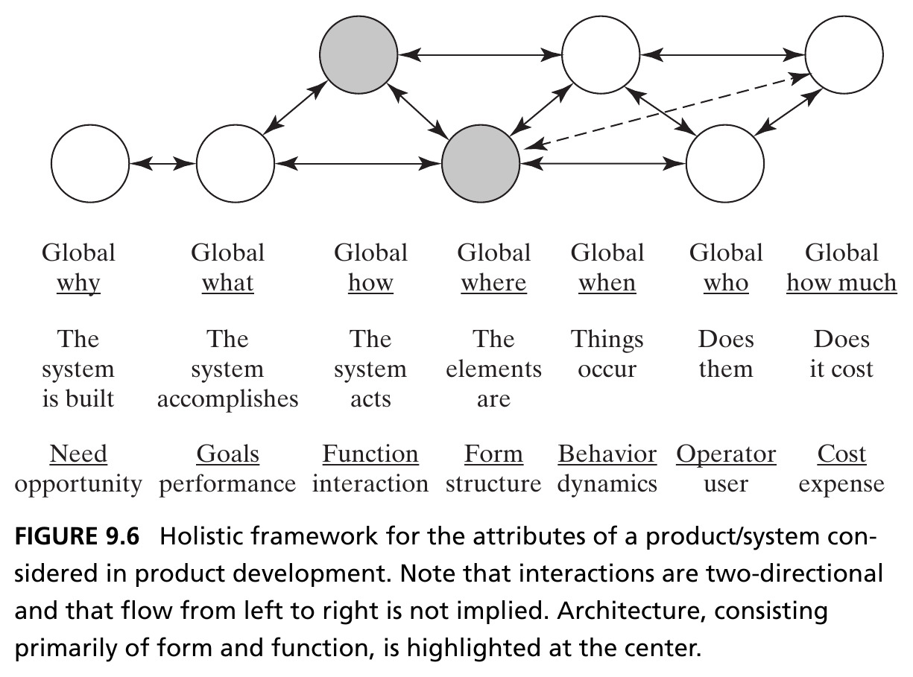{height=430px fig-align="center"}

::: {.side-caption}
**Architecture** — form and function — sits at the center of the framework. Interactions are two-directional; flow from left to right is not implied. Source: Crawley, Cameron & Selva (2016), Fig. 9.6.
:::

## Figure 9.7 · Level 2 — Design and Implementation in Parallel {.smaller}

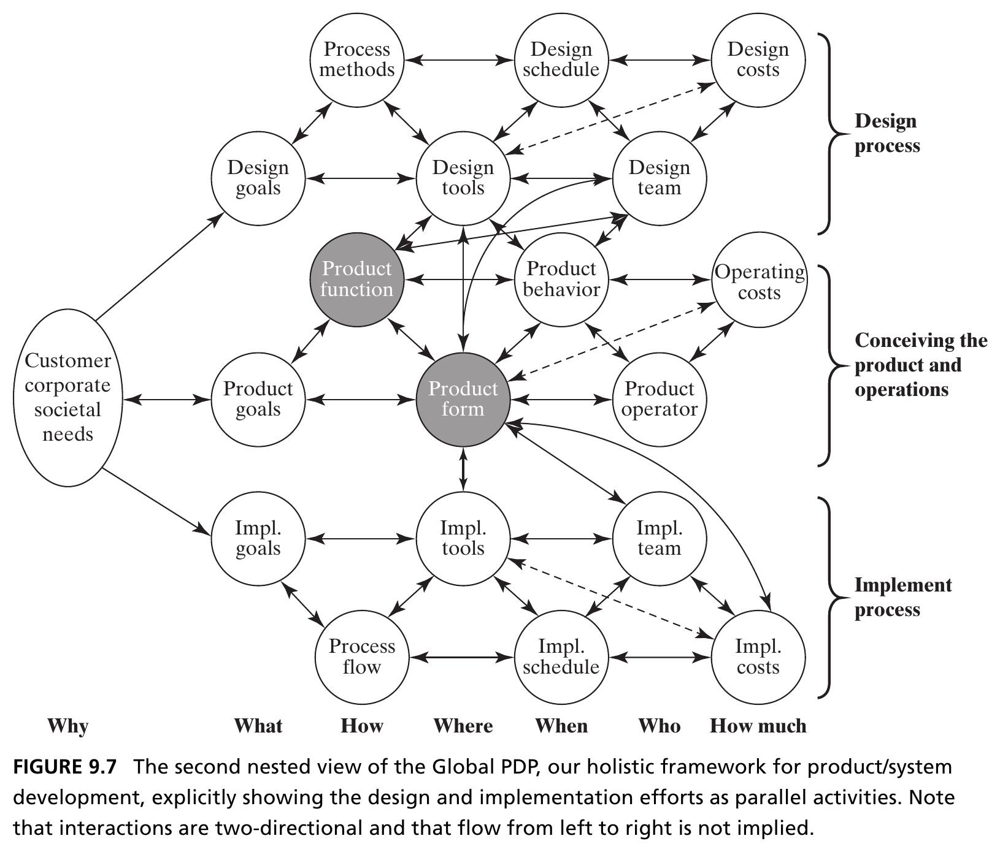{height=440px fig-align="center"}

::: {.side-caption}
Moving up a layer: the design process and implementation process each get their own instantiation of the W Questions. The design process has its own form too — notably design tools, which shape and constrain the system form that's achievable. Source: Crawley, Cameron & Selva (2016), Fig. 9.7.
:::

## Figure 9.8 · Level 3 — The Enterprise Context {.smaller}

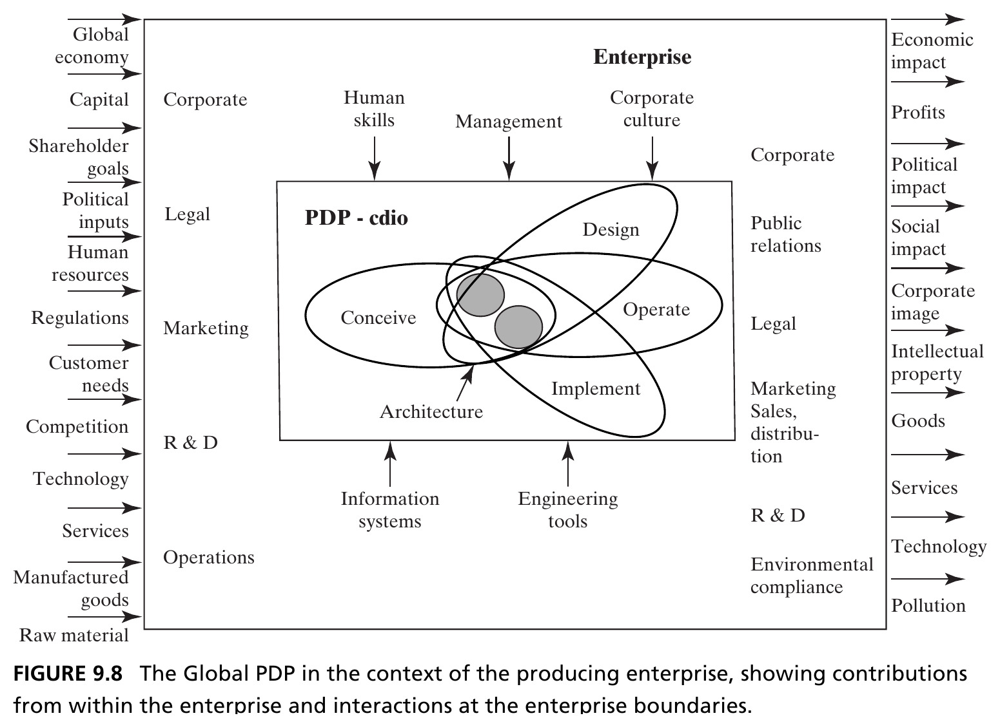{height=430px fig-align="center"}

::: {.side-caption}
The broadest nested view: the firm's PDP inside the enterprise boundary (R&D and corporate functions mostly upstream; PR, sales, distribution mostly downstream), plus external actors and attributes — capital, competition, regulation — that affect the enterprise. Source: Crawley, Cameron & Selva (2016), Fig. 9.8.
:::

## Box 9.3 · Principle of the Stress of Modern Practice {.smaller}

::: {.callout-note appearance="simple" icon=false}
*"Things which matter most must never be at the mercy of things which matter least."* — Johann Wolfgang von Goethe
:::

Modern product development — with concurrency, distributed teams, and early supplier engagement — places **even more emphasis** on having a good architecture:

- Accelerating development via concurrency increases the importance of initial conceptual decisions
- Empowering distributed/non-collocated teams increases the importance of well-coordinated, visible high-level design guidance
- Involving suppliers early increases the importance of an architectural concept and baseline — suppliers can define or defy decomposition

## Section 9.3.2 Summary {.smaller}

- The Global PDP is a nested framework used to compare different PDPs on a common baseline, built around the canonical W Questions
- It reveals the architect's system boundary — largely, but not exclusively, the "conceive" activities
- The purpose of the broadest view is to remind the architect: understanding the *contents* of the PDP is not sufficient — the firm and its context matter too

# Box 9.4 — Case Study: Civil Architecture and System Architecture

## Where "Architect" Comes From {.smaller}

*By Steve Imrich, Architect and Principal at Cambridge Seven Associates*

- Civil architecture has an **interpretive-interactive-performance** aspect that differs from most industrial/product design — buildings inherit complex cultural and symbolic qualities affecting space, materials, and user experience
- Ideally, the *"special problems"* of a building inform its design — as with helicopters, sailboats, or computers, concept/design/engineering can transcend mere style
- Because buildings are only seen/experienced as part of their site, their special problems always relate to a wider context: time, culture, infrastructure, human behavior, environment, re-interpreted use
- Buildings are rarely mocked up beforehand — a large element of risk, usually associated with the arts

## Figure 9.9 · Concept in Civil Architecture {.smaller}

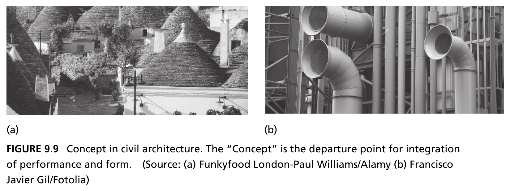{height=400px fig-align="center"}

::: {.side-caption}
Left: Trulli houses, Alberobello, Italy (a). Right: industrial ductwork, Centre Pompidou, Paris (b). The **concept** is the departure point for integrating performance and form. Source: Crawley, Cameron & Selva (2016), Fig. 9.9. Photos: (a) Funkyfood London-Paul Williams/Alamy, (b) Francisco Javier Gil/Fotolia.
:::

## Six Ideas in "Design Process with Attitude" {.smaller}

- **Context** — the built environment, cultural norms, and history of the organizations and people the building serves
- **Content** — the building's programmatic requirements and functional performance
- **Concept** — the unifying idea by which all design decisions are evaluated; concept generation succeeds when it integrates and balances the nature of content *and* context
- **Circuitry** — the connective tissue between functional components; more than a path from A to B, it creates interest and anticipation
- **Character** — a building's material, site, and sense of life beyond the aggregation of parts
- **Magic** — the largely intangible quality defined by the user's experience; magic fosters delight and joyful appreciation of the unexpected

## Figure 9.10 · Magic in Civil Architecture {.smaller}

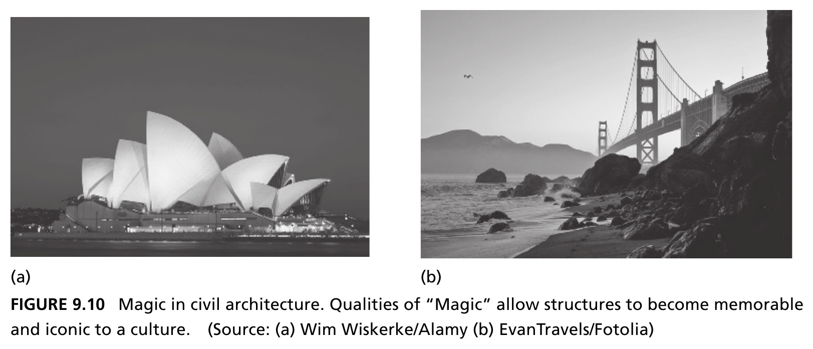{height=400px fig-align="center"}

::: {.side-caption}
Left: Sydney Opera House (a). Right: Golden Gate Bridge (b). Qualities of "Magic" allow structures to become memorable and iconic to a culture. Source: Crawley, Cameron & Selva (2016), Fig. 9.10. Photos: (a) Wim Wiskerke/Alamy, (b) EvanTravels/Fotolia.
:::

## On Magic {.smaller}

::: {.callout-note appearance="simple" icon=false}
*"Surprise, as all art and architecture, helps us contemplate. Life wears out our ability for surprise. Surprise is the beginning of a true vision of the world."* — Eladio Dieste
:::

- Magic is the emergence of elegance and character at the building level — the sleight of hand
- It is difficult to *define*, but when something is magical, it's immediately *recognizable*
- Magic is the unusual circumstance that becomes normalized in good architecture — that moment of surprise that leaves a person in wonder and awe
- Real magic makes architecture symbolic and iconic in a *sustained* manner — it reaches beyond the original intent, communicating viscerally with users

## Figure 9.11 · Overlaying Performance and Poetry {.smaller}

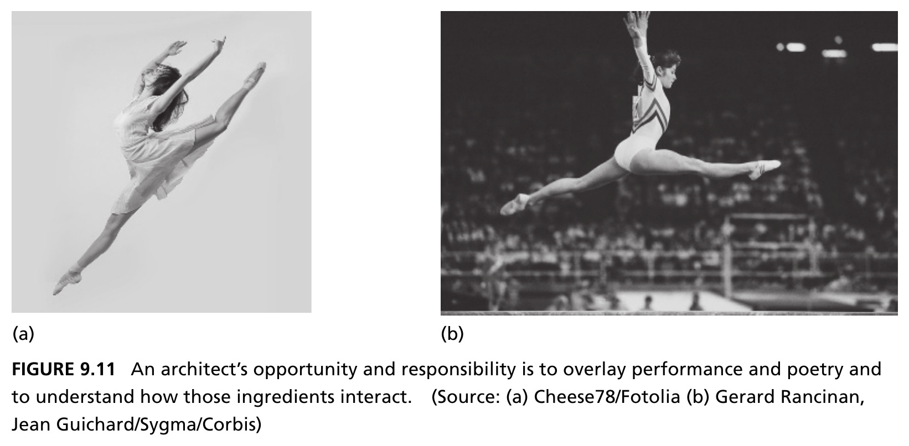{height=400px fig-align="center"}

::: {.side-caption}
A ballerina and a gymnast share athleticism, dynamic patterning, and nuance of expression — yet one is considered "art," the other "athletic expertise." An architect's opportunity and responsibility: to overlay performance and poetry, and understand how those ingredients interact. Source: Crawley, Cameron & Selva (2016), Fig. 9.11. Photos: (a) Cheese78/Fotolia, (b) Gerard Rancinan, Jean Guichard/Sygma/Corbis.
:::

## Chapter 9 Summary {.smaller}

- The architect is not a generalist, but a specialist in resolving ambiguity, focusing creativity, and simplifying complexity
- Ambiguity comes in many forms — fuzziness, uncertainty, and missing, conflicting, or incorrect information — and the architect must recognize and deal with each
- The architect is responsible for producing specific deliverables, central to reducing ambiguity and bridging corporate functions to the design environment
- Product development processes differ superficially across firms and sectors, but share deep common structure — codified here as the Generic and Global PDPs
- Architects must discern which segments of a PDP are centrally linked to their role, and stay skilled at interpreting new product development initiatives

::: {.callout-tip}
**Reference**: Crawley, E., Cameron, B., & Selva, D. (2016). *System Architecture: Strategy and Product Development for Complex Systems*. Pearson. Chapter 9.
:::

## Next: Up/Down-stream Influences

Chapter 10 examines the principal upstream and downstream influences on system architecture in detail — including the ABCD Product Case.
