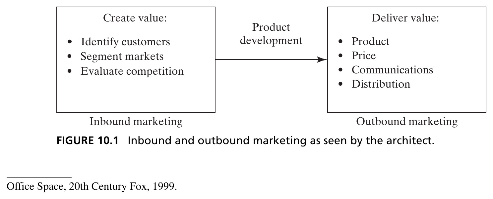
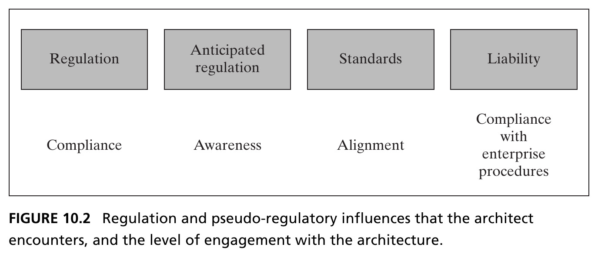
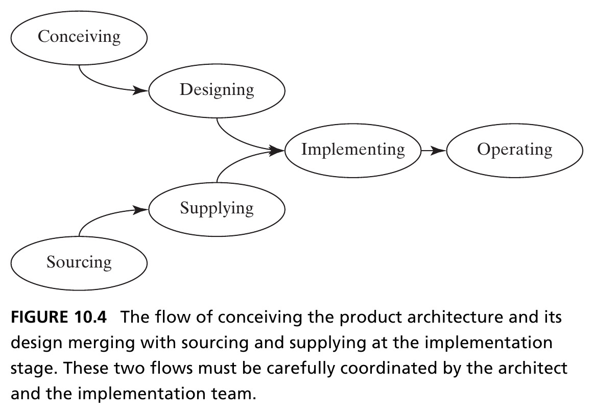
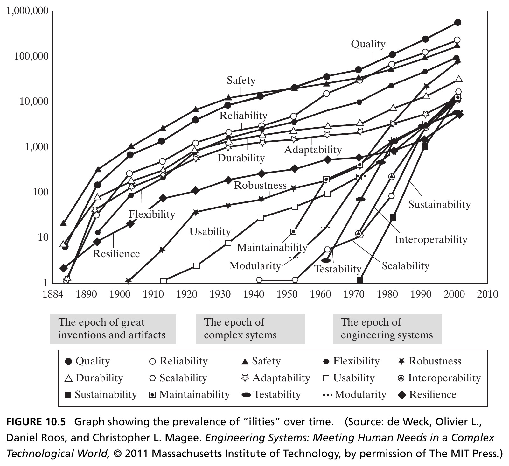
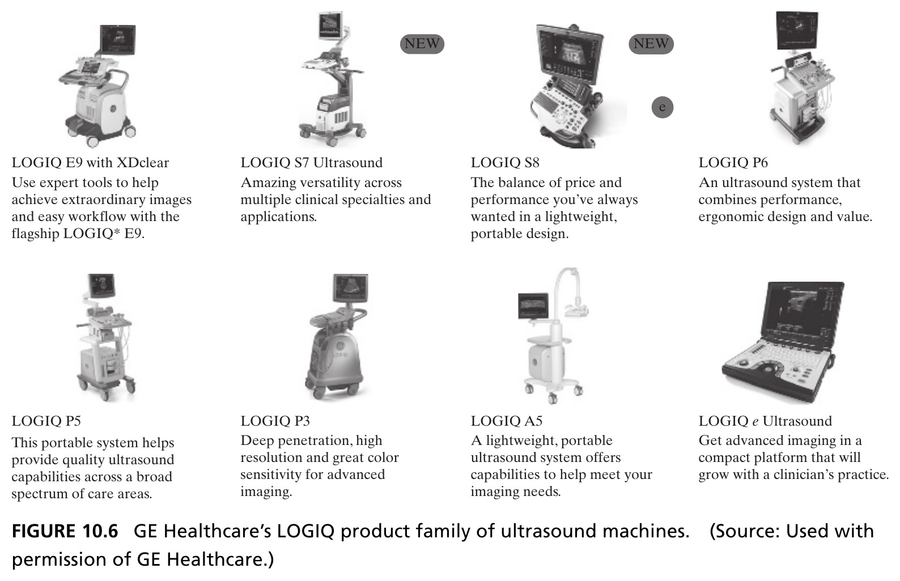
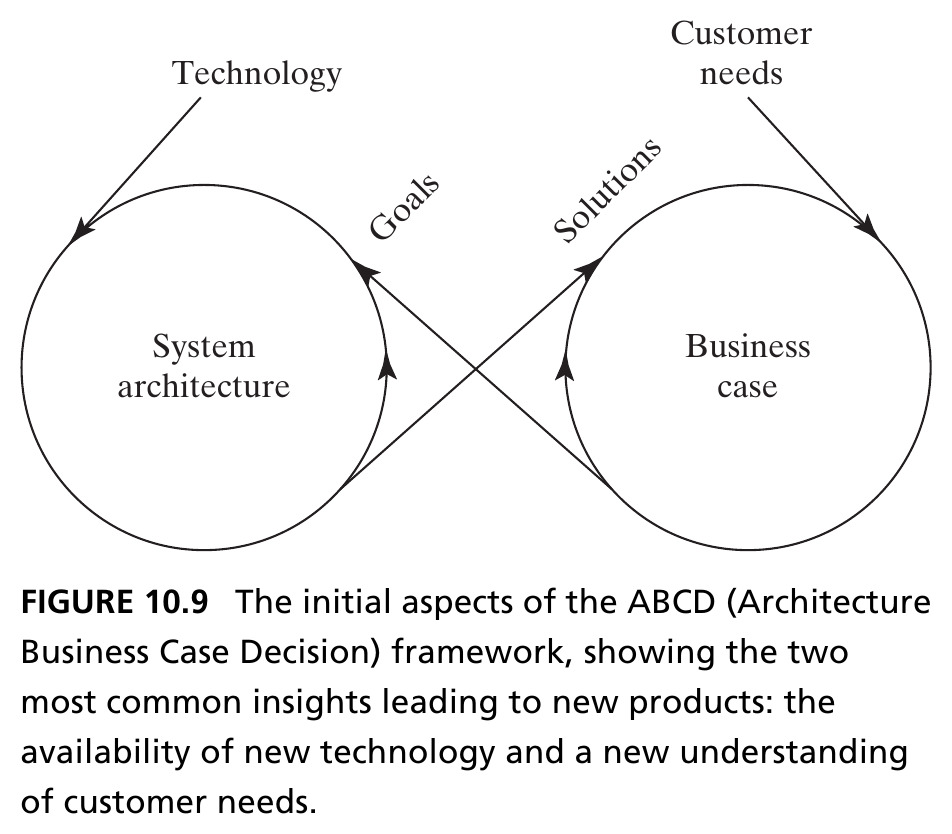
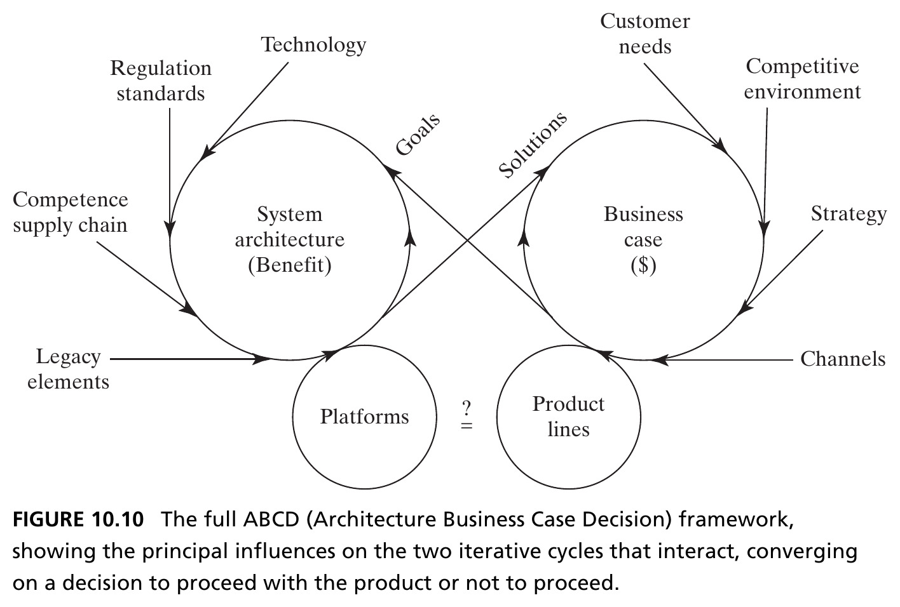
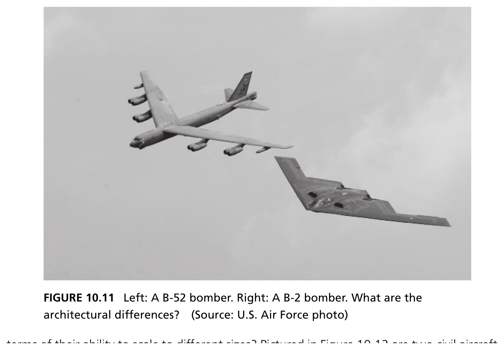
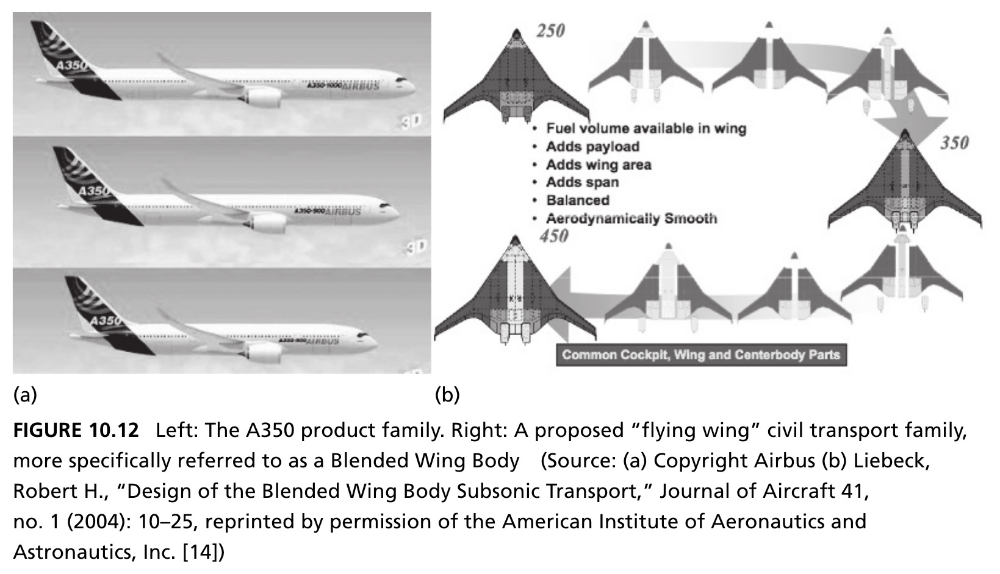
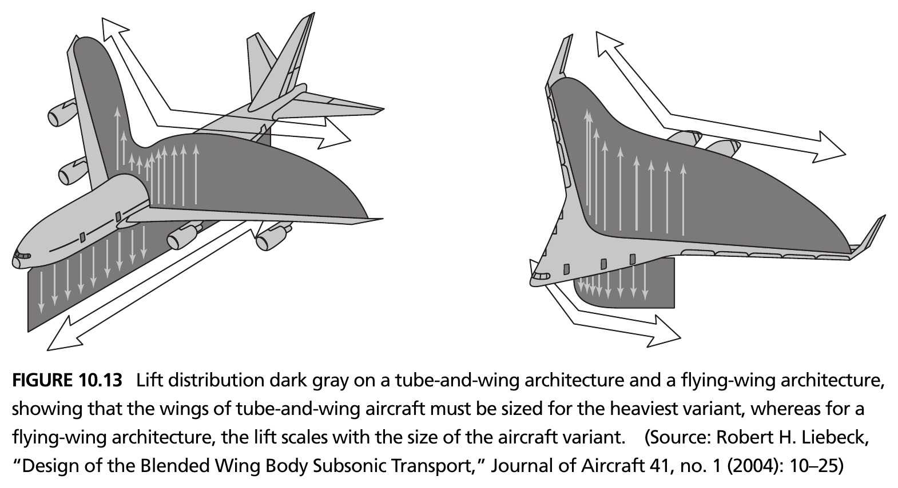

## Beyond the Architect's Immediate Control {.smaller}

- Chapter 9 established the architect's role: reduce ambiguity, employ creativity, manage complexity
- Much of that ambiguity comes from **upstream** influences (strategy, marketing, customers, technology, regulation) and **downstream** influences (implementation, operations, product evolution)
- The architect doesn't control these — but must understand them well enough to make good decisions

::: {.fragment .callout-tip}
This chapter surveys the principal upstream and downstream influences, then shows how they combine in an iterative decision framework: the **ABCD Product Case**.
:::

# 10.2 Upstream Influence: Strategy and Marketing

## Strategy Sets the Stage {.smaller}

- Corporate and business unit **strategy** frames everything: what markets to compete in, what capabilities to build, what advantage to pursue
- The architect must interpret strategy — often incomplete or ambiguous — into concrete goals for the system
- Strategy rarely specifies architecture directly; it specifies **intent**, and the architect must translate intent into form and function

## Figure 10.1 · Marketing as Seen by the Architect {.smaller}

{height=380px fig-align="center"}

::: {.side-caption}
**Inbound marketing** creates value: identifying customers, segmenting markets, evaluating competition. **Outbound marketing** delivers value: product, price, communications, distribution. Product development is the bridge between them. Source: Crawley, Cameron & Selva (2016), Fig. 10.1.
:::

## Working with Marketing {.smaller}

- Inbound marketing generates the **voice of the customer** — needs, preferences, willingness to pay — which the architect must translate into solution-neutral function (Ch. 7)
- Outbound marketing determines how the *architecture itself* gets communicated and positioned — an elegant architecture is easier to market
- The architect and marketing function are natural partners: marketing knows *what* customers want, the architect determines *whether and how* it can be delivered

## Section 10.2 Summary {.smaller}

- Corporate strategy and marketing are major upstream influences the architect must interpret, not just receive
- Inbound marketing (creating value) and outbound marketing (delivering value) both interact with the architecture — inbound shapes goals, outbound shapes communication
- The architect's job is translation: converting ambiguous strategic and market intent into concrete, solution-neutral functional goals

# 10.4 Upstream Influence: Regulation and Pseudo-Regulatory Influences

## Regulation: Enabler and Barrier {.smaller}

- Regulation can be both an **enabler** of competitive advantage and a **barrier** to entry
- It can preserve an existing architecture well past its useful life — or generate an opportunity for new architectures to disrupt the market
- Example: Tier 4 Final emissions regulations for off-highway trucks upheld stricter standards, forcing firms to update their engine portfolios — but also opened a new competitive axis on fuel efficiency

::: {.fragment .callout-tip}
Regulation affects architecture two ways: **directly** (mandatory backup cameras, medical device material rules) and **indirectly**, through downstream factors like manufacturing location, hiring rate, or addressable markets.
:::

## Figure 10.2 · Regulation and Pseudo-Regulatory Influences {.smaller}

{height=380px fig-align="center"}

::: {.side-caption}
Four categories, each demanding a different level of engagement: **regulation** (compliance), **anticipated regulation** (awareness), **standards** (alignment), **liability** (compliance with enterprise procedures). Source: Crawley, Cameron & Selva (2016), Fig. 10.2.
:::

## Sources and Levels of Regulation {.smaller}

- Regulations occur at **federal, state, and city/county levels** in the U.S., plus international regulations — agencies like the FDA, USDA, FAA, and EPA oversee federal rules
- **Pseudo-regulations** matter too: standards (voluntary but expected), anticipated regulation (not yet law, but coming), and litigation/liability precedent
- The architect must decide: which elements of regulation are important enough to shape the *architecture*, and which can be addressed later in detailed design and testing?

## Section 10.4 Summary {.smaller}

- Regulation is a two-edged upstream influence — it can protect incumbents or create openings for disruption
- Beyond formal regulation, the architect must track pseudo-regulatory influences: anticipated regulation, standards, and liability exposure
- The key architectural judgment: separate regulatory elements that must shape the architecture from those addressable later, in detailed design

# 10.5 Upstream Influence: Technology

## Infusing New Technology {.smaller}

- One of the architect's pivotal roles: deciding **whether and how** to infuse a new technology into an architecture
- Three questions the architect must answer:

::: {.fragment .callout-important appearance="minimal" icon=false}
**1.** Will the technology be ready for infusion? **2.** Will it actually create additional value for customers and stakeholders? **3.** How will it be effectively transferred into the product or system?
:::

## Table: Technology Readiness Levels (TRL) {.smaller}

| TRL | Description |
|---|---|
| 1–2 | Basic principles observed; concept formulated (paper studies) |
| 3–4 | Active R&D; proof of concept; lab component validation |
| 5–6 | Validation in a *relevant* environment; prototype demo |
| 7–8 | Prototype demo in an *operational* environment; qualified via test |
| 9 | Proven through successful mission operations |

::: {.side-caption}
As defined by the U.S. Department of Defense. Technology development proceeds at its own pace, independent of a product's timing — it may be ready, late, or have lain fallow so long the development team has dispersed. Source: Crawley, Cameron & Selva (2016), Fig. 10.3 (Dept. of Defense, TRA Guidelines, April 2011).
:::

## Know-How, Not Just IP {.smaller}

- Technology transfer discussions often jump straight to **IP ownership** — necessary, but not sufficient
- IP covers the "know **what**" of transfer; the real problem is transferring the "know **how**"
- **People** are by far the most effective means of knowledge transfer — when technology moves from a research lab to a product team, the people who developed it often move with it

::: {.fragment .callout-tip}
Modern practice often de-invests in internal technology, instead sourcing from suppliers, universities, and government labs — an inherently inefficient marketplace, since developers rarely know the architect's intended application or have the resources to reach the desired readiness level.
:::

## Section 10.5 Summary {.smaller}

- The architect must judge technology readiness (TRL), value creation, and transfer mechanism before infusing new technology
- Technology development is not linear — setbacks and iteration before final readiness are the norm, despite what a TRL rating might suggest
- Effective technology transfer requires people, not just IP ownership or licensing — "know-how" transfer is the harder, more important half

# 10.6 Downstream Influence: Implementation

## Compressing Downstream Detail {.smaller}

- The downstream development of the system is an equally significant source of ambiguity
- An important architectural role: **compress and extract** relevant downstream details, and inject them back into decision-making up front
- We use **implementation** rather than "manufacturing" to cover both hardware and software — designing software means choosing algorithms/abstractions, data structures, program flow; implementing means writing and testing the actual code

## Figure 10.4 · The Flow to Implementation {.smaller}

{height=420px fig-align="center"}

::: {.side-caption}
Conceiving and designing merge with sourcing and supplying at the implementation stage — two flows that must be carefully coordinated by the architect and the implementation team. Source: Crawley, Cameron & Selva (2016), Fig. 10.4.
:::

## Section 10.6 Summary {.smaller}

- Implementation covers both coding and manufacturing — the point where design and supply chain flows converge
- The architect's job is to compress downstream implementation detail into decisions that can be made early, rather than discovering constraints too late
- Coordinating the conceive/design flow with the source/supply flow is a joint responsibility of the architect and the implementation team

# 10.7 Downstream Influence: Operations

## Table: Operations Framework — Getting Ready and Going {.smaller}

| Phase | Air Transport Service | Refrigerator |
|---|---|---|
| **Get Ready** | Ticket purchasing, staff training, aircraft scheduling | Moving to point of sale, installing |
| **Get Set** | Check-in, baggage tagging, catering loading | Initial cool-down, loading food |
| **Go – Primary Value** | Traveler transporting | Food preserving |
| **Go – Secondary Value** | Nourishing, entertaining | Cold water/ice, freezing food |

::: {.side-caption}
A generic operations framework applied to three examples. Source: Crawley, Cameron & Selva (2016), Table 10.1.
:::

## Table: Operations Framework — Off-Nominal and Wind-Down {.smaller}

| Phase | Air Transport Service | Refrigerator |
|---|---|---|
| **Go – Contingent** | Informing traveler of delays | Easy clean-up of spills |
| **Go – Emergency** | Crash landing position, exiting via slides | Preventing entrapment |
| **Get Unset / Unready** | Unloading baggage, cleaning, storage | Cleaning out, disposing |
| **Fix** | Routine maintenance, upgrades | Event-driven maintenance/repair |

::: {.side-caption}
Continued from Table 10.1 — contingency, emergency, and end-of-cycle phases. Source: Crawley, Cameron & Selva (2016), Table 10.1.
:::

## Contingencies, Emergencies, and Stand-Alone Operations {.smaller}

::: {.columns}
::: {.column width="50%"}
**Contingency operations**

Off-normal, but recoverable without loss of primary function or personal/property damage. Performance may degrade gracefully — a spill in a refrigerator, a skid, a missed network packet. The architect builds in recovery provisions.
:::
::: {.column width="50%"}
**Emergency operations**

Off-normal and *outside* the contingency window. All hope of primary function is abandoned — emphasis shifts entirely to saving life and minimizing property damage. The architect has a serious responsibility to anticipate these.
:::
:::

::: {.fragment .callout-tip}
**Stand-alone operations**: the system must operate without connection to its normal supporting systems — common during test, but sometimes also in the field (e.g., a refrigerator keeping food cold through a power outage).
:::

## Figure 10.5 · The Prevalence of "Ilities" Over Time {.smaller}

{height=400px fig-align="center"}

::: {.side-caption}
15 "ilities" tracked by journal mentions since 1884 (log scale) — quality and safety dominate early; sustainability, interoperability, and scalability are recent arrivals. Not every "ility" is architecturally distinguishing, and they are not independent of one another. Source: Crawley, Cameron & Selva (2016), Fig. 10.5, after de Weck, Roos & Magee (2011), © MIT Press.
:::

## Section 10.7 Summary {.smaller}

- Operations can be organized into a generic framework — get ready, get set, go (nominal/contingent/emergency/stand-alone), get unset, get unready, and fix
- Contingencies are recoverable off-normal events; emergencies abandon primary function to protect life and property — the architect must anticipate both
- "Ilities" — quality, reliability, safety, maintainability, and more — are downstream-emergent attributes the architect must weigh, even though no single one is always architecturally distinguishing

# 10.8 Downstream Influence: Product Evolution

## Platforming vs. Reuse {.smaller}

::: {.callout-note appearance="simple" icon=false}
**Platforming** is the intentional sharing of parts and process across or within products.
:::

- Platforms require the architect to invest once in a common part or module, *predicting* which future models will use it
- Unlike reuse (known performance, known use case), platforming means choosing constraints while living with uncertainty about future applications
- Platforming has become a key strategy for delivering product variety across multiple markets and vertical segments

## Figure 10.6 · GE Healthcare's LOGIQ Product Family {.smaller}

{height=440px fig-align="center"}

::: {.side-caption}
Eight ultrasound machine variants — from the flagship E9 down to the compact, growth-ready *e* Ultrasound — likely built on a shared architecture and shared components across the family. Source: Crawley, Cameron & Selva (2016), Fig. 10.6. Used with permission of GE Healthcare.
:::

## Platforming Always Costs Something {.smaller}

| Phase | Costs and Drawbacks |
|---|---|
| Conception | Constrains future variants; concentrated schedule/brand/cannibalization risk |
| Development | Designing to multiple use cases; more flexible test equipment |
| Production | Lower-end products inherit higher-end parts; added config management |
| Operations | Common-part failure affects many variants; possible perf. shortfall |

::: {.side-caption}
Platforming always involves additional investment, and it often involves other drawbacks or compromises. Source: Crawley, Cameron & Selva (2016), Fig. 10.8, reproduced from Cameron (2013) in Simpson (2013).
:::

## Section 10.8 Summary {.smaller}

- Platforming is the deliberate, forward-looking sharing of parts and process across a product family — distinct from simple reuse
- It's a powerful strategy for delivering variety across markets, but never free: every phase (conception through operations) carries real costs and risks
- The architect must weigh the benefit of shared investment against the constraints it locks in for every future variant

# 10.9 Combining Influences: The ABCD Product Case

## An Iterative Model, Not a Sum {.smaller}

- It's not possible to tackle upstream and downstream influences in sequence, enumerate their goals and constraints, and simply sum them into a concept
- Innovation traditionally derives from one of two sources: a **new customer need**, or a **new technology** that improves the performance/cost ratio of meeting an existing need
- This is a simplified view — it misses value-chain integration, market expansion strategies, and installed-base service strategies — but it's a useful anchor

## Figure 10.9 · The Initial ABCD Framework {.smaller}

{height=420px fig-align="center"}

::: {.side-caption}
**A**rchitecture **B**usiness **C**ase **D**ecision: two iterative cycles. Technology and customer needs feed in; system architecture sets *goals* for the business case, which returns *solutions* back to the architecture. Source: Crawley, Cameron & Selva (2016), Fig. 10.9.
:::

## The Architect ↔ Business Case Interaction {.smaller}

- When product innovation identifies a **customer need**, that need sets *goals* for the system architecture — the architect evaluates feasibility and helps determine whether the business case "closes" (survives financial scrutiny) based on solution cost
- When product innovation derives from a **new technology**, the architect must evaluate whether the resulting solution actually addresses customer needs
- Either direction, the two cycles interact tightly — architecture and business case co-evolve, not develop independently

## Figure 10.10 · The Full ABCD Framework {.smaller}

{height=460px fig-align="center"}

::: {.side-caption}
External drivers now flow in on both sides: regulation, standards, competence, and legacy elements shape the architecture cycle; competitive environment, strategy, and channels shape the business case cycle. Platforms and product lines converge on a **proceed / do not proceed** decision. Source: Crawley, Cameron & Selva (2016), Fig. 10.10.
:::

## Section 10.9 Summary {.smaller}

- The ABCD framework models architecture and business case as two coupled iterative cycles, not a linear sum of independent influences
- Technology and customer needs are the two most common entry points — but the full framework adds regulation, competence, competitive environment, and strategy as further external drivers
- The two cycles converge on a single decision: proceed with the product, or not

# 10.10 Case Study: The B-52 and B-2 Bombers

## Two Bombers, Two Architectures {.smaller}

::: {.columns}
::: {.column width="55%"}
- Both aircraft deliver the same primary function — long-range strategic bombing — with radically different architectures
- The B-52: a conventional **tube-and-wing** design. The B-2: a **flying wing** (blended wing body)
- What upstream and downstream influences led to such different architectural choices for the same mission?
:::
::: {.column width="45%"}
{height=380px fig-align="center"}
:::
:::

## Figure 10.12 · Scaling a Product Family {.smaller}

{height=440px fig-align="center"}

::: {.side-caption}
Left: the Airbus A350 tube-and-wing family — a shared wing, stretched or shortened fuselage. Right: a proposed flying-wing civil transport family, scaling by adding center-body sections rather than stretching a tube. Source: Crawley, Cameron & Selva (2016), Fig. 10.12. (Left) © Airbus. (Right) Liebeck (2004), *Journal of Aircraft* 41(1), by permission of AIAA.
:::

## Why the Architectures Scale Differently {.smaller}

- For tube-and-wing aircraft, the wing is sized for the **heaviest** family member — since wings are expensive to optimize, they're shared across the family with minor changes
- Net effect: the wing is "overdesigned" for the *smallest* family member — it can produce more lift than that aircraft needs
- The flying-wing family instead scales by **splitting along the centerline** and inserting center-body sections — a fundamentally different scaling mechanism

## Figure 10.13 · Lift Distribution, Compared {.smaller}

{height=440px fig-align="center"}

::: {.side-caption}
Dark gray shows the lift-producing region on each architecture. For tube-and-wing, the fuselage produces almost no lift — lengthening it to add capacity forces the wing to grow to support the extra weight. For the flying wing, lift scales naturally with the size of the variant. Source: Crawley, Cameron & Selva (2016), Fig. 10.13, after Liebeck (2004).
:::

## The Architectural Lesson {.smaller}

::: {.callout-important appearance="minimal" icon=false}
A downstream consideration — how a family of products needs to **scale** — can be a first-order driver of architectural choice, just as important as the primary function itself.
:::

- Both architectures deliver the mission function; the B-2's flying wing also buys low radar cross-section (a *different* downstream/upstream driver: stealth requirements)
- Product-family scaling logic, manufacturing constraints, and regulatory/mission requirements all fed into architectures that look nothing alike, despite similar top-level function

## Chapter 10 Summary {.smaller}

- Upstream influences — strategy, marketing, regulation, and technology — shape the goals and constraints the architect must resolve before architecture can begin
- Downstream influences — implementation, operations, and product evolution — must be compressed and fed back into decisions made much earlier
- The **ABCD Product Case** frames architecture and business case as two coupled iterative cycles, converging on a proceed/no-proceed decision
- The B-52/B-2 case study shows how the same influences, weighted differently, can produce radically different — yet equally valid — architectures for the same mission

::: {.callout-tip}
**Reference**: Crawley, E., Cameron, B., & Selva, D. (2016). *System Architecture: Strategy and Product Development for Complex Systems*. Pearson. Chapter 10.
:::

## Next: Translating Needs into Goals

Chapter 11 returns to Part 3's synthetic process, going deeper into how the architect converts fuzzy stakeholder needs into concrete, testable goals.
