## From Influences to Goals {.smaller}

- Chapters 9–10 surveyed the upstream and downstream influences the architect must navigate — but influences alone don't tell us *what to build*
- This chapter develops a systematic process: identify **stakeholders and their needs**, characterize and prioritize those needs, and translate them into **goals** the architect can actually design against
- Running example throughout: a **Hybrid Car** project, plus a closing case study on the 1998 Nagano Olympics IT system

::: {.notes}
Open Part 3 properly here — this is the first chapter where we move from analyzing existing architectures (Part 2) to actually creating new ones, and Chapter 11 is specifically about resolving the very first, most fundamental ambiguity an architect faces: what is this system even supposed to accomplish? Chapters 9 and 10 gave us a map of the terrain — the role of the architect, the product development process, and the upstream/downstream influences (corporate strategy, marketing, regulation, technology, manufacturing, and so on) that constrain any design. But none of that told us, concretely, what to build. This chapter fills that gap with a repeatable process.

Preview the chapter's throughline explicitly, since it recurs across the whole lecture: identify who the stakeholders are and what they need (Section 11.2), characterize those needs along useful dimensions and prioritize among them (Section 11.3), and then translate needs into goals — something the architect can actually design against (Sections 11.4 and 11.5). We'll use one running example throughout to make all of this concrete: a Hybrid Car project, continued from earlier chapters and picked back up in Chapter 12. We'll close with a real, high-stakes case study — IBM's IT system for the 1998 Nagano Winter Olympics — showing these same stakeholder-management ideas playing out in a genuine, complex engagement.
:::

## Figure 11.1 · The Needs-to-Goals Framework {.smaller}

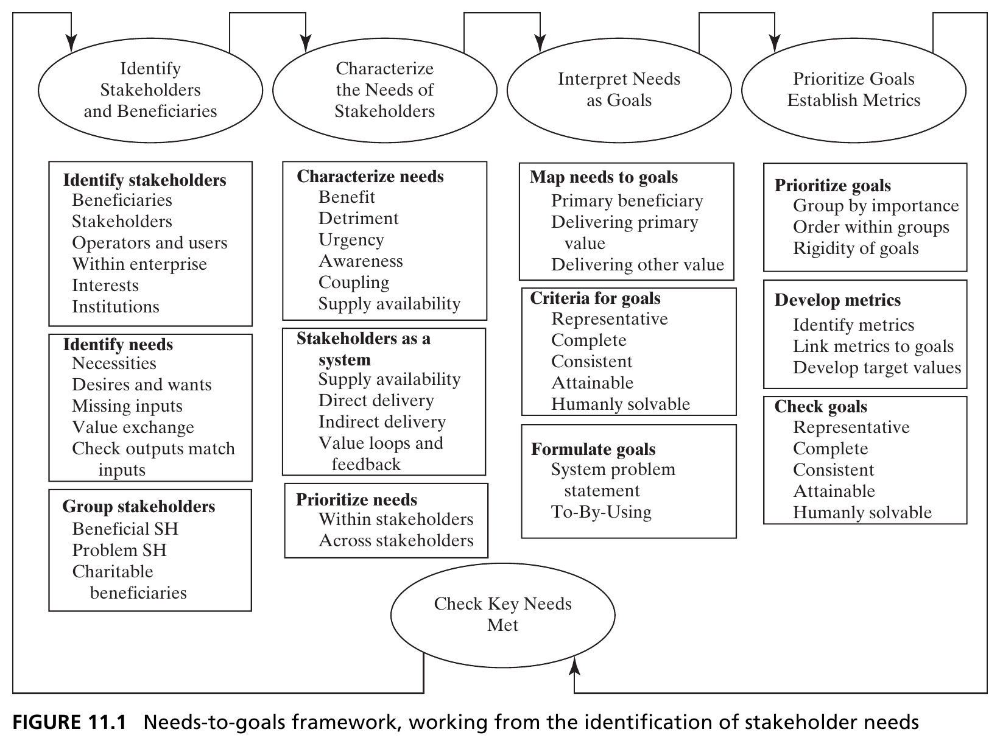{height=440px fig-align="center"}

::: {.side-caption}
Four major steps: identify stakeholders and beneficiaries, characterize their needs, interpret needs as goals, and prioritize goals with metrics — closing the loop by checking key needs are met. Source: Crawley, Cameron & Selva (2016), Fig. 11.1.
:::

::: {.notes}
Walk through this framework diagram carefully, since it's the map for the entire chapter and every remaining slide fits into one of its boxes. Four ellipses across the top represent the four major process steps: identify stakeholders and beneficiaries; characterize the needs of stakeholders; interpret needs as goals; and prioritize goals, establishing metrics. Below each ellipse, the boxes list the specific sub-tasks that step involves — for instance, under "identify stakeholders and beneficiaries" you'll find identifying stakeholders, beneficiaries, operators and users, interests inside and outside the enterprise, and institutions; under "characterize needs" you'll find benefit, detriment, urgency, awareness, coupling, and supply availability.

Point out the closing loop at the bottom: "check key needs met" feeds back up into the process, emphasizing this isn't a strictly linear, one-pass procedure — like most things in this course, it's iterative. Tell students explicitly that this diagram is effectively the chapter's table of contents: Section 11.2 covers the first ellipse, Section 11.3 the second, Section 11.4 the third, and Section 11.5 the fourth. Keep this figure in mind as an anchor to return to mentally as we move through each section.
:::

# 11.2 Identifying Stakeholders and Their Needs

## Setting Bounds and Granularity {.smaller}

Two difficulties in stakeholder analysis: setting **bounds** (how far to trace ripple effects — e.g., the economic multiplier of a contractor's spending) and setting **granularity** (individual suppliers, or "Suppliers" as one abstraction?).

::: {.fragment .callout-tip}
Our test for both: does the choice among architectures *under consideration* matter to this stakeholder? If every candidate architecture delivers the same benefit, the stakeholder still needs managing — but may not merit shaping the architectural decision.
:::

::: {.notes}
Before diving into the mechanics of identifying stakeholders, flag the two genuine methodological difficulties the book calls out up front, since students will run into both in any real project. The first is setting *bounds*: how far do you trace the ripple effects of your system before you stop? The book's own example is the economic multiplier effect — money paid to a contractor gets spent again by that contractor's employees at local businesses, which ripples outward through the broader economy, in principle indefinitely. Where do you draw the line? There's substantial economic literature on measuring multiplier effects, but doing this kind of deep analysis for every possible ripple is usually impractical.

The second difficulty is *granularity* — choosing the right level of abstraction for stakeholders. Should you consider each individual supplier separately, or abstract them all into a single entity called "Suppliers"? This matters because individual suppliers might have meaningfully different needs and different influence, but treating them all as one abstraction is far more tractable if that distinction doesn't matter for the decision at hand.

The fragment gives the book's single, elegant test for resolving both difficulties at once: does the choice among the architectures *actually under consideration* matter to this stakeholder? If every candidate architecture you're comparing would deliver the exact same benefit to a given stakeholder, that stakeholder still needs to be managed as part of the project (they haven't disappeared), but they don't need to shape the *architectural decision* itself — so you don't need fine granularity or extended bounds for them. This test is worth having students memorize, since it recurs as the practical filter for scope throughout the rest of the chapter.
:::

## Box 11.1 · Principle of the Beginning {.smaller}

::: {.callout-note appearance="simple" icon=false}
*"The beginning of the work is most important."* — Plato, *The Republic*

*"Great warriors position themselves where they will surely win, prevailing over those who have already lost."* — Sun Tzu, *The Art of War*
:::

- The stakeholders included at the early stages of product definition will have an **outsized impact** on the architecture — be very careful about who's involved, and how they shape it
- Balance engaging stakeholders for their views against their actual **decision rights** — informed, consulted, voting, or veto

::: {.notes}
Unpack both quotes briefly — Plato's is the more literal reading: whatever happens at the beginning of a project disproportionately shapes everything downstream. Sun Tzu's is more about positioning: great warriors (or, by analogy, great architects) set things up early so that success is already largely secured before the real contest begins — again pointing at how much leverage the earliest moves carry.

The principle itself is a direct, practical warning: the specific list of stakeholders who get included during the *early* stages of product definition will have an outsized impact on the eventual architecture, disproportionate to how the same stakeholder might matter later. This means the architect needs to be very deliberate — not casual — about who is invited into the room during requirements-gathering and concept formation, since who's present early on quietly biases the whole trajectory of the design.

The second bullet introduces a genuinely important, separate consideration: engaging a stakeholder for their views is not the same question as what *decision rights* they should actually have. The book distinguishes several levels: some stakeholders should simply be informed of decisions after the fact; some should be consulted for input, without a formal vote; some should have an actual vote among several options; and some should have full veto power over a decision. Part of doing stakeholder management well is being explicit and deliberate about which of these four levels applies to each stakeholder — conflating "we should listen to this person's opinion" with "this person should have veto power" is a common and costly mistake in real projects.
:::

## Figure 11.2 · Stakeholders and Beneficiaries {.smaller}

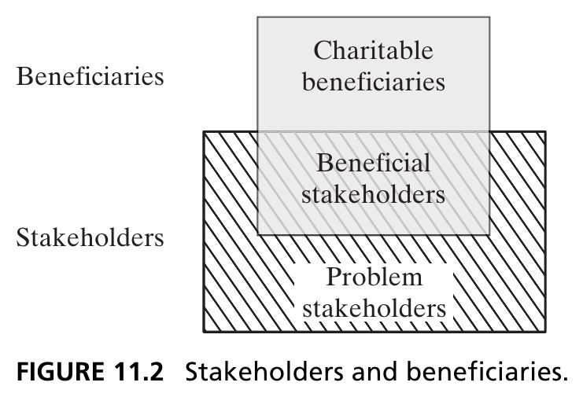{height=380px fig-align="center"}

::: {.side-caption}
**Beneficiaries** are those whom the architecture addresses; you are important *to them*. **Stakeholders** have a stake in the outcome; they are important *to you*. **Charitable beneficiaries** are beneficiaries who aren't also stakeholders. Source: Crawley, Cameron & Selva (2016), Fig. 11.2.
:::

::: {.notes}
This is one of the chapter's most important distinctions, and it's easy to blur in casual speech, so slow down here. The term "stakeholder" has become extremely broad since Edward Freeman's 1984 book *Stakeholder Management* popularized it — so broad that "managing stakeholders" often gets reduced to a downstream public-relations activity, rather than the upstream process of actually identifying and serving potential customers that it should be. The book resolves this by carefully distinguishing two related-but-different concepts.

*Beneficiaries* are those who benefit from your actions — your architecture produces an outcome or output that addresses *their* needs. They are important *to you* in the sense that... no, more precisely: you are important *to them*, because your system serves them. *Stakeholders*, by contrast, are those who have a stake in your product or enterprise — they have an outcome or output that addresses *your* needs, and they are important *to you*. This maps back to something much closer to the original meaning of "stockholder": someone who supplies something you need (cash, in the classic case) in return for a stake in the outcome.

The diagram makes the overlap concrete with three categories, and it's worth having students place a few real examples into each bucket. *Beneficial stakeholders* sit at the intersection — they both receive valued outputs from you and provide valued inputs to you (this is the ideal, mutually-reinforcing relationship). *Charitable beneficiaries* are beneficiaries who are not also stakeholders — the firm provides them value but receives no direct return (however indirect) from them. *Problem stakeholders* are stakeholders who are not beneficiaries — you need something from them, but there's nothing they need from you in return, so the relationship feels one-sided and harder to manage. We'll come back to charitable beneficiaries and problem stakeholders concretely with the Hybrid Car example in just a couple of slides.
:::

## A Starting Checklist of Stakeholders {.smaller}

::: {.columns}
::: {.column width="50%"}
- Driver/owner (primary beneficiary)
- Regulator
- Producing enterprise or company
- Investors in the enterprise
:::
::: {.column width="50%"}
- Suppliers
- Local community
- Environmental NGOs
- Competitors (e.g., oil companies)
:::
:::

::: {.fragment .callout-tip}
This first-pass list gets revisited once we prioritize — treat it as a starting point, not a final answer.
:::

::: {.notes}
Introduce the Hybrid Car running example concretely for the first time in this chapter, walking through the book's first-pass stakeholder list for it. The driver/owner is the primary beneficiary — they're the one who directly uses the transportation product. The regulator (government bodies overseeing safety and emissions), the producing enterprise itself, investors who've put capital into the enterprise, suppliers who provide parts, the local community around manufacturing or dealership operations, environmental NGOs advocating for emissions and sustainability outcomes, and — somewhat unusually — oil companies, included here as a kind of "competitor," since a hybrid vehicle by design aims to reduce gasoline consumption, putting the project in tension with oil companies' interests.

Note something worth flagging explicitly: producing this initial list isn't typically difficult — the book points out that starting with existing products, existing customers, existing shareholders, and existing suppliers on the market, plus the upstream/downstream influences discussed in Chapter 10, gets you to a reasonably complete first draft quickly. The harder work, which the rest of the chapter addresses, is characterizing and prioritizing this list, not generating it in the first place. The fragment's caution is worth repeating explicitly: this is a first-pass list specifically, and it will be revisited once we get to prioritization later in the chapter — don't treat it as final or complete.
:::

## Box 11.2 · Definition of Needs {.smaller}

::: {.callout-note appearance="simple" icon=false}
A **need** may be defined as: a necessity, an overall desire or want, or a wish for something that is lacking.
:::

- Needs exist in the mind (or heart) of the beneficiary — they can be unexpressed, or even unrecognized
- Needs are primarily *outside* the producing enterprise — they are owned by the beneficiary, not chosen by the firm
- Needs are a product/system attribute; they are interpreted, in part, by the architect

::: {.notes}
Pin down "need" precisely, since the rest of the chapter's entire logical structure depends on distinguishing needs from goals (which comes later, in Section 11.4) — and conflating the two is the single most common error students make with this material. A need can be a necessity, an overall desire or want, or simply a wish for something currently lacking.

Three properties of needs are worth emphasizing, one at a time. First: needs exist in the mind, or the heart, of the beneficiary — they are often expressed in fuzzy, general, or ambiguous terms, and critically, they can be unexpressed or even entirely unrecognized by the beneficiary themselves (this sets up "latent needs," a couple of slides ahead). Second: needs are primarily *outside* the producing enterprise's control — they are *owned* by the beneficiary, not invented or chosen by the firm building the system. This is a deliberately strong claim the book makes and defends: the firm doesn't get to decide what people need; it can only try to understand and serve needs that already exist (even if unrecognized).

Third, and this is the bridge to the rest of the chapter: needs are nonetheless a product/system attribute, in that they must be *interpreted*, at least in part, by the architect in order to define goals for the product. This interpretive step is exactly what separates needs from goals — needs live in the beneficiary's world; goals live in the architect's design process, as an interpretation of those needs.
:::

## Figure 11.3 · Needs of the Beneficiaries for the Hybrid Car {.smaller}

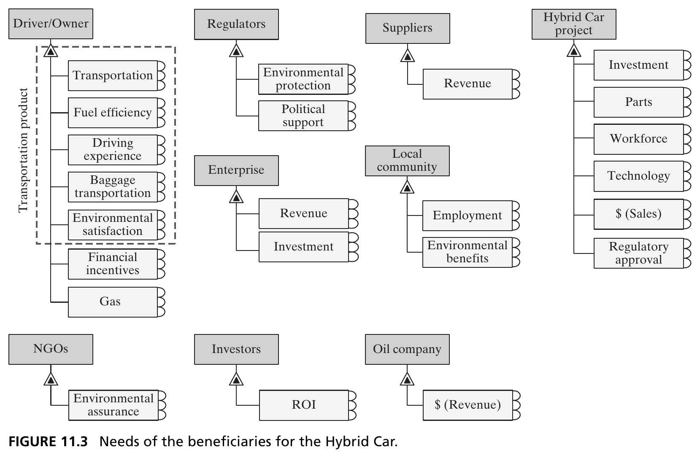{height=440px fig-align="center"}

::: {.side-caption}
Starting with the primary beneficiary — the driver/owner — and their primary need (transportation), we work outward to the other stakeholders and their needs. Source: Crawley, Cameron & Selva (2016), Fig. 11.3.
:::

::: {.notes}
Walk through this figure as the concrete payoff of everything discussed so far. The book's guidance for identifying needs: start with the primary beneficiary and that beneficiary's primary need, whose satisfaction is tied to changes in the principal value-related operand (recall this concept from Chapter 7 — the operand whose state-change constitutes the primary externally-delivered function). For the Hybrid Car, the driver/owner is the primary beneficiary, and their primary need is transportation — specifically fuel-efficient transportation.

Trace the rest of the diagram: under Driver/Owner, needs include transportation, fuel efficiency, driving experience, baggage transportation, environmental satisfaction, financial incentives, and gas — the dashed box grouping several of these together as the "transportation product" itself. Regulators need environmental protection and political support. Suppliers need revenue. The enterprise needs revenue and investment. The local community needs employment and environmental benefits. The Hybrid Car project itself, interestingly, has its own needs too — investment, parts, workforce, technology, sales dollars, and regulatory approval — since the project is, in a sense, its own stakeholder in the network, needing inputs to exist at all. NGOs need environmental assurance; investors need ROI; the oil company needs revenue.

Point out explicitly, since the book flags it too: this diagram is deliberately *not complete* at this stage — keeping it manageable is itself a design choice, an application of "focus" from Chapter 2. Not every need of the driver/owner will actually be satisfied by the real Hybrid Car (the book's own example: the need for financial incentives, like a federal tax deduction, can't be met by the car-producing firm itself — that's a policy lever outside the firm's control, even though it's a legitimate need of the beneficiary).
:::

## Latent Needs {.smaller}

::: {.callout-important appearance="minimal" icon=false}
**Latent needs** are needs that are fundamental to the beneficiary, before the product that meets them comes into being. They are not chosen by the firm — advertising changing customer value functions is a dangerously overused idea in engineering contexts.
:::

- How did Whirlpool know customers "needed" an ice dispenser before it existed? How did GM know drivers with cell phones would "need" OnStar?
- No set procedure identifies latent needs with certainty — the only real answers are deep scrutiny of users, iteration on concepts, and hard work
- **Caution**: Edison in 1922 — *"The radio craze will die out in time."* Ken Olson, DEC founder, in 1977 — *"There is no reason anyone would want a computer in their home."*

::: {.notes}
This is genuinely one of the hardest and most important ideas in stakeholder analysis, and it deserves real class time. Recall from the introduction to this chapter: many transformative architectures arise not from serving already-articulated needs, but from new value propositions that serve needs nobody had yet recognized or expressed. The term "latent needs" captures this — needs that are fundamental to the beneficiary, that exist prior to, and independent of, the product that eventually satisfies them.

Give both of the book's illustrative examples, since they land well with students: how did Whirlpool know customers "needed" an ice dispenser built into the front of a refrigerator, before that feature existed on any product? How did GM know that drivers who already owned cell phones would still "need" something like OnStar (an embedded system to call a central service in an emergency) — a redundant-seeming capability, given cell phones already existed? In both cases, the need was there all along, just unrecognized, waiting for a product to reveal it.

Be explicit and firm about a methodological point the book stresses strongly: the term "latent needs" is used specifically to convey that needs are fundamental to the beneficiary, and are *not chosen by the firm*. The book deliberately pushes back against the idea — common in some marketing circles — that advertising *creates* or *shapes* customer needs; the authors call this idea "dangerously overused" in an engineering context. If you start believing you can manufacture demand for anything, you stop doing the hard work of actually understanding your users, and the history of product development is full of costly features built because they seemed clever to engineers, but were never actually valued by the market.

So how, practically, do you identify latent needs, given they're by definition not yet expressed? The book is honest that there's no reliable formula — Ernest Dichter pioneered in-depth consumer interviews in the 1950s specifically to search for underlying qualities users perceived in a product; the design firm IDEO's "empathic design" approach has designers spend hours directly observing potential customers in context (following shoppers through grocery stores, for instance). But by definition, any procedure that identified latent needs with total certainty through pure analysis would contradict the very idea of *latency* — the only genuine tools are deep scrutiny of users, iteration on concepts, customer feedback, and hard work.

Close with the two cautionary quotes, and let them land as a warning against the opposite failure mode — false confidence about what customers do or don't need: Thomas Edison, in 1922, predicted "the radio craze will die out in time." Ken Olson, founder of Digital Equipment Corporation, said in 1977, "There is no reason anyone would want a computer in their home." Both were serious, accomplished technologists, and both were spectacularly wrong about latent needs that were, in hindsight, enormous. This is a good moment to ask students for modern-day equivalents they suspect might be similarly wrong.
:::

## Needs Arise from an Exchange {.smaller}

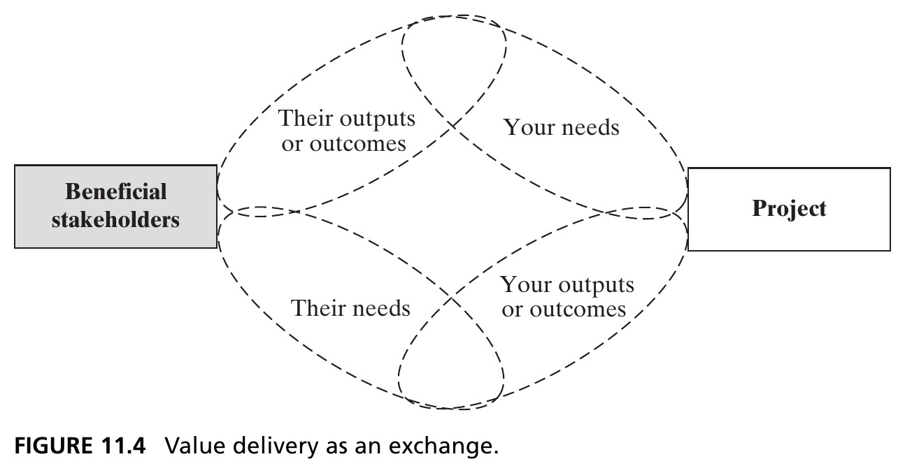{height=400px fig-align="center"}

::: {.side-caption}
A central tenet of stakeholder theory: value results from an *exchange*. Your outputs satisfy their needs; their outputs satisfy yours. This completeness criterion helps surface additional stakeholders. Source: Crawley, Cameron & Selva (2016), Fig. 11.4.
:::

::: {.notes}
Introduce a foundational tenet of stakeholder theory that will structure the entire rest of the chapter, all the way through the stakeholder-map and value-loop material in Section 11.3: stakeholder value results from an *exchange*. We've been identifying the needs of the beneficiary so we can architect our system to satisfy them — that's only half the exchange. The other half is that stakeholders, in turn, have their own outputs or outcomes that meet *our* project's inputs and needs.

Walk through the diagram's structure: beneficial stakeholders sit on one side, the project on the other, and two flows connect them in each direction — "their outputs or outcomes" satisfy "your needs" (the project's), while "your outputs or outcomes" satisfy "their needs" (the stakeholder's). This is at the heart of stakeholder analysis, and it changes how we ask questions. When identifying beneficiaries earlier, we asked "who benefits from the outputs of this project?" We can now see that question has an exchange built into it implicitly.

The genuinely useful practical payoff, worth emphasizing directly: this exchange framing gives us a *completeness* criterion for enumerating stakeholders and beneficiaries. The crux of the method is to first list the input needs of each stakeholder and beneficiary (easier to argue about what you need), then work the method around the network to identify *which* stakeholders actually provide those inputs. Iterating this around the full network eventually produces a genuinely complete list of stakeholders and their outputs, at whatever level of detail you're working at — this is exactly the "check outputs match inputs" step shown back in the Figure 11.1 framework diagram. We'll build this out concretely into a full stakeholder map over the next several slides.
:::

## Grouping Stakeholders {.smaller}

Having listed needs, we take a first pass at prioritizing by grouping stakeholders into three buckets:

::: {.callout-note appearance="simple" icon=false}
Stakeholders who **must** be considered and satisfied. Stakeholders who **must** be considered and **should** be satisfied. Stakeholders who **should** be considered and **might** be satisfied.
:::

::: {.fragment .callout-tip}
This first-guess taxonomy — applied *before* an in-depth analysis — is useful precisely because it lets us later compare expectations against what analysis reveals.
:::

::: {.notes}
This is the final task of Step 1 in the Figure 11.1 framework — a first, rough pass at prioritizing stakeholders and beneficiaries, before we've done any of the deeper analysis that follows in Section 11.3. Give the three-bucket taxonomy the book proposes as the simplest useful grouping: stakeholders who must be considered *and* satisfied; stakeholders who must be considered and *should* be satisfied; and stakeholders who should be considered and *might* be satisfied. Mention in passing, since it's a useful alternative framing some students may find more intuitive, that there are other grouping schemes too — for instance, grouping by how involved a stakeholder should be in decision-making itself (veto power, a vote, an important-but-non-voting opinion, consultation, or simply being informed).

The fragment makes an important methodological point about *when* to apply this kind of rough categorization: we're doing this classification without an explicit, rigorous method yet — it's genuinely just a first guess. And that's precisely the point, not a weakness: writing down your expectations of stakeholder importance *before* conducting an in-depth analysis is valuable because it gives you something concrete to compare your later, more rigorous analysis against. If the rigorous method in Section 11.3 produces a ranking wildly different from this first guess, that's worth investigating — either the first guess was naive, or the rigorous method missed something. The upcoming Figure 11.6 will show this same taxonomy applied concretely to the Hybrid Car's stakeholder list.
:::

## Figure 11.6 · Stakeholder Prioritization for the Hybrid Car {.smaller}

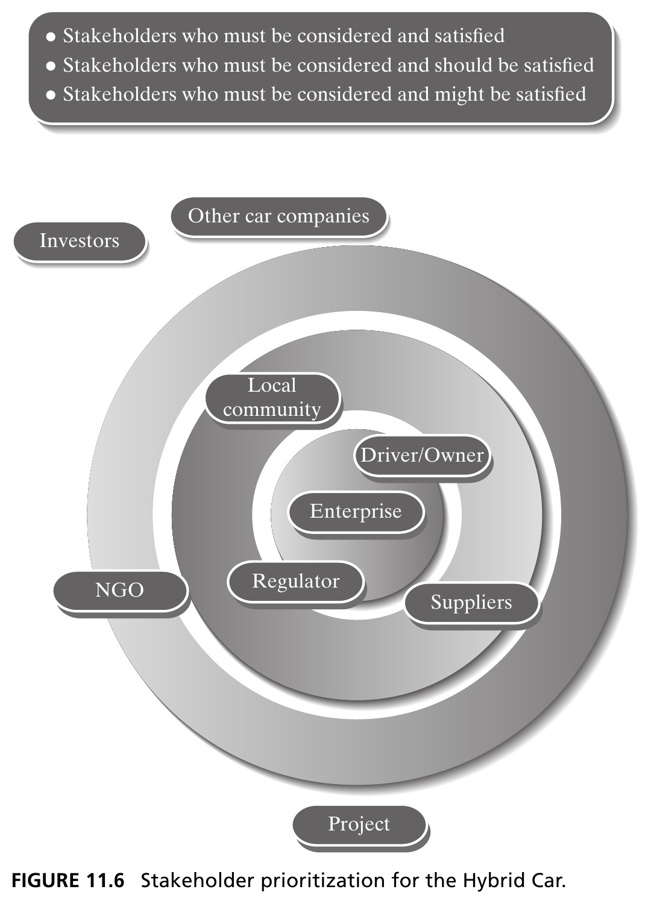{height=440px fig-align="center"}

::: {.side-caption}
Concentric rings show the first-guess priority: enterprise and regulator innermost, then driver/owner and local community, then suppliers, NGOs, and investors — with other car companies and the project itself outside. Source: Crawley, Cameron & Selva (2016), Fig. 11.6.
:::

::: {.notes}
Walk through this concentric-circle visualization as the concrete application of the previous slide's three-bucket taxonomy to the Hybrid Car project. The innermost ring — "must be considered and satisfied" — contains the enterprise itself and the regulator. The middle ring — "must be considered and should be satisfied" — contains the driver/owner and the local community. The outer ring — "must be considered and might be satisfied" — contains suppliers, NGOs, and investors. Other car companies and the project itself sit outside even this outer ring in the diagram, reflecting that they're more peripheral to this first-guess ranking.

It's worth flagging something a sharp student might notice and push back on: shouldn't the driver/owner, as the *primary beneficiary*, be in the innermost ring rather than the middle one? This is exactly the kind of tension the book wants surfaced by writing this first guess down explicitly — it's the author's own judgment call at this early, un-rigorous stage, and it's a good discussion prompt: why might the enterprise and regulator get prioritized above the driver/owner in a first-guess ranking, even though the driver/owner is who the product ultimately serves? (One legitimate answer: the enterprise's survival and regulatory compliance are existential threshold conditions the project must clear regardless of how well it serves the driver, whereas serving the driver well is more of a spectrum than a binary gate.) Keep this figure in mind — we'll return to a far more rigorous, quantitative prioritization later in Section 11.3, via the stakeholder network and value loops, and it's worth comparing that later result back against this first guess.
:::

## Section 11.2 Summary {.smaller}

- Stakeholder analysis requires setting bounds and granularity — test both against whether the choice among candidate architectures would matter to that stakeholder
- Needs exist in the beneficiary's mind — they are unexpressed, latent, and never invented by the firm, only interpreted by the architect
- Value delivery is fundamentally an *exchange* — tracing outputs and inputs both ways is what reveals a complete stakeholder list
- A first-guess grouping of stakeholders, made before deep analysis, is a useful checkpoint against later, more rigorous prioritization

::: {.notes}
Use this as a checkpoint before moving to Section 11.3. By this point students should be comfortable with: the bounds/granularity test (does the choice among architectures under consideration matter to this stakeholder?); the precise definition of "need" and its careful separation from "goal" (still ahead in Section 11.4); the beneficiary/stakeholder/charitable-beneficiary/problem-stakeholder taxonomy from Figure 11.2; the idea that needs can be latent, and that firms discover rather than invent them; the exchange-based view of stakeholder value, which is about to become the backbone of the stakeholder-map material in the next section; and the practical value of writing down a rough, first-guess prioritization before doing rigorous analysis. Section 11.3, coming up next, is where we actually characterize these needs rigorously and build the full stakeholder-network machinery — Kano analysis, stakeholder maps, value loops — that lets us move past first guesses.
:::

# 11.3 Characterizing Needs

## Dimensions of Stakeholder Needs {.smaller}

::: {.callout-note appearance="simple" icon=false}
*"Find the appropriate balance of competing claims by various groups of stakeholders. All claims deserve consideration but some claims are more important than others."* — Warren G. Bennis
:::

Five dimensions along which needs can be characterized: **benefit intensity** (utility/worth), **detriment** (adverse reaction if unmet), **urgency** (how quickly it must be fulfilled), **awareness** (how aware stakeholders are of it), and **coupling** (how it relieves or intensifies other needs).

::: {.notes}
Open Section 11.3 with the Bennis quote, which frames the whole section's task precisely: we're not looking for a single "most important" stakeholder claim, but for a *balance* among competing claims — while still recognizing that not all claims carry equal weight. Having enumerated stakeholders and their needs in Section 11.2, we've now completed column 1 of the Figure 11.1 framework; the next step is to characterize those needs in order to eventually prioritize among them.

Give the five dimensions the book proposes, since these give students a genuinely useful analytical vocabulary for any needs-assessment exercise, not just this course: benefit intensity — how much utility, worth, or benefit fulfilling the need will bring; detriment — the adverse reaction that occurs if the need goes unmet (distinct from benefit intensity — a need can have low benefit but high detriment, or vice versa); urgency — how quickly the need must be fulfilled; awareness — how aware the stakeholders themselves are of having this need (tying back directly to latent needs from the previous section — a need can be real and strong, but the stakeholder may have low awareness of it); and coupling — the degree to which satisfying one need relieves, or intensifies, another. Mention briefly, for completeness, that there are formal survey-based methods for eliciting these dimensions from stakeholders (direct ranking, or pairwise comparison methods like conjoint analysis and the analytic hierarchy process) — but the next slide, Kano analysis, is the specific conceptual model the book develops in depth, because it elegantly integrates several of these dimensions into one simple, visual framework.
:::

## Figure 11.7 · Kano Analysis {.smaller}

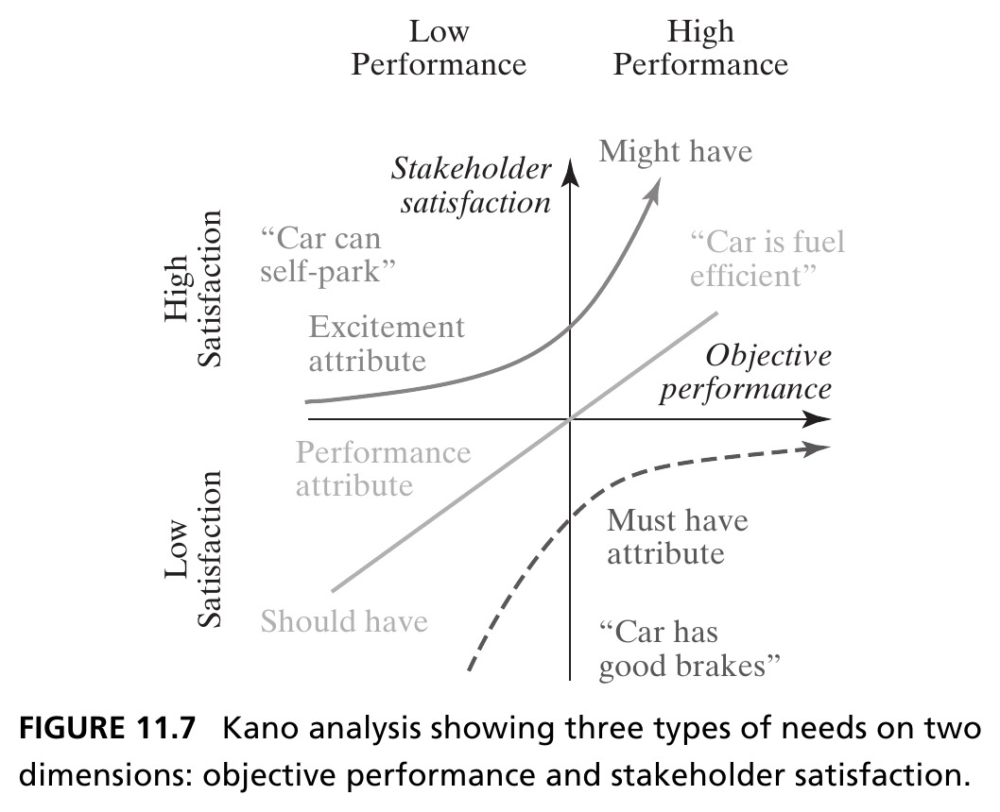{height=440px fig-align="center"}

::: {.side-caption}
Three categories: **Must have** (unmet → strong dissatisfaction; met → no extra credit — "good brakes"), **Should have** (roughly linear satisfaction — "fuel efficient"), **Might have** (an excitement/delight attribute — "self-parking"). Categories shift over time as features become expected. Source: Crawley, Cameron & Selva (2016), Fig. 11.7.
:::

::: {.notes}
Walk through the Kano methodology carefully, since it's the chapter's single most useful practical tool for characterizing needs, and it comes up again in the context of prioritization. Originally developed to classify product attributes from the consumer's perspective, the Kano method asks, for each need, how you'd characterize the presence or absence of that need along three categories: "must have" — its presence is absolutely essential, and you'd regret its absence; "should have" — you'd be satisfied by its presence, and would regret its absence, but less dramatically; and "might have" — you'd be satisfied by its presence, but you would *not* regret its absence.

Walk through the diagram's two axes and three curves concretely, using the book's own automotive examples: the horizontal axis is objective performance (low to high), the vertical axis is stakeholder satisfaction. A "must have" attribute — the book's example is good brakes — shows a curve that's flat and low on the satisfaction axis across most of the performance range, but crashes sharply toward strong dissatisfaction if performance drops below some threshold: having good brakes doesn't particularly delight anyone (nobody says "wow, great brakes!"), but *not* having good brakes produces serious dissatisfaction. A "should have" attribute — fuel efficiency is the example — shows a roughly linear relationship: the better the fuel economy, the more satisfaction it produces, scaling up steadily. A "might have" attribute — self-parking is the example — is an "excitement" or delight attribute: its absence isn't expected or missed at all, but its presence can be a genuine differentiator and selling point.

Close with an important, dynamic caveat the book makes explicitly: these categories are not fixed forever. Self-parking is currently a "might have" — a novel technology feature — but it may well transition into a "must have" over time, as the market comes to expect it as standard. This is a genuinely useful heuristic for students to carry forward: today's delightful "might have" differentiator often becomes tomorrow's baseline expectation, and part of an architect's job is anticipating that drift, not just characterizing needs as they stand today.
:::

## Judgment Still Matters {.smaller}

- In many markets, formal methods for prioritizing needs (like Kano analysis) are **outmatched by the judgment of seasoned individuals** — where large consumer data sets exist, or mature technical buying criteria prevail, analysis is more valuable; otherwise, judgment should not be supplanted
- There are many methods for comparing needs *within* one stakeholder, but few for comparing needs *across* stakeholders — this tests the limits of human reasoning given the sheer number of needs possible

::: {.notes}
This is an important corrective slide, worth not skipping past quickly, since it tempers the previous slide's formal-methods enthusiasm with an honest, experience-based caveat. The book makes two distinct observations here, both worth stating plainly. First: in many real markets, formal methods for prioritizing needs — even something as well-developed as Kano analysis — are genuinely *outmatched* by the judgment of experienced practitioners who deeply understand their customers. Where large, high-quality consumer data sets are available, or where mature, well-understood technical buying criteria dominate a market, formal analysis earns its keep and adds real value. But where those conditions don't hold, analysis shouldn't be allowed to supplant seasoned human judgment just because it feels more rigorous or objective.

Second, and this is a genuinely important limitation to flag explicitly: there are many established methods for comparing and prioritizing needs *within* a single stakeholder's own list (Kano analysis being one), but there are comparatively few good methods for comparing needs *across* different stakeholders — is the driver's need for good handling more or less important than the regulator's need for emissions compliance? This cross-stakeholder comparison problem tests the genuine limits of human reasoning, given how many needs a complex system's full stakeholder list can generate. This honest admission of difficulty sets up the next several slides precisely: the stakeholder-map and value-loop machinery the book develops is specifically an attempt to make *some* headway on this hard cross-stakeholder prioritization problem, even though it can't fully solve it.
:::

## Stakeholders as a System {.smaller}

- Taken as a group, the set of stakeholder exchanges *itself* forms a system — we can build a **stakeholder map**
- Three steps: (1) *who* could satisfy each stakeholder's needs? (2) *what* are the project's outputs, and to whom do they flow? (3) combinatorially pair stakeholders and check for relevant transactions between them

::: {.notes}
This slide makes a genuinely elegant conceptual move, worth pausing on: taken together, the whole set of individual stakeholder exchanges (each one, recall, just a pairwise exchange of outputs meeting needs) *itself* forms a system, in exactly the Chapter 2 sense — a set of entities (the stakeholders) and their relationships (the exchanges), whose functionality is greater than the sum of the individual entities. That's the conceptual justification for building what the book calls a *stakeholder map*: a genuine systems-thinking application, using tools students already know, applied to the stakeholder network itself.

Give the three-step construction procedure precisely, since it's directly applied to build the next two figures. Step one: for each stakeholder's needs identified earlier, ask who could potentially satisfy them (for the Hybrid Car, this leads directly to the supplier as the source of parts). Step two: ask what the project's own outputs actually are, and to whom they flow (the project produces employment, for instance, which implies a corresponding need for workforce — but caution here: outputs that don't link to a genuine need don't deliver real value, and identifying such "unused outputs" is itself a valuable finding, treated separately). Step three, the most powerful and often-overlooked step: combinatorially pair up stakeholders and check whether there are *any* relevant transactions between them, even ones not obviously connected to the project directly. This third step is what will reveal the indirect transactions covered a few slides ahead — relationships you'd never find just by looking at the project's own direct inputs and outputs.
:::

## Figure 11.8 · Hub-and-Spoke Stakeholder Map {.smaller}

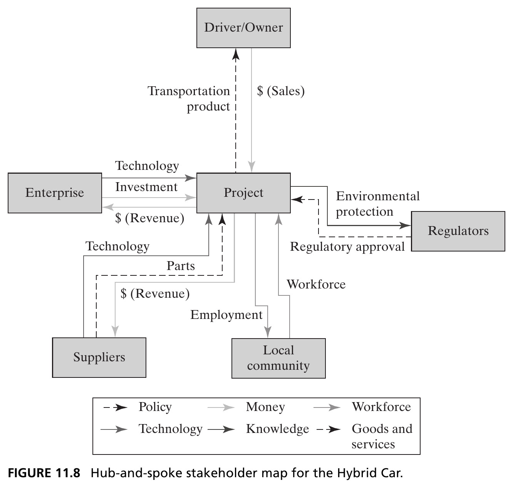{height=440px fig-align="center"}

::: {.side-caption}
The project as hub, with flows to and from each stakeholder — six categories: policy, money, workforce, technology, knowledge, goods and services. Source: Crawley, Cameron & Selva (2016), Fig. 11.8.
:::

::: {.notes}
Walk through this diagram as the output of applying the first two steps from the previous slide (who could satisfy needs, and what does the project output) to the Hybrid Car. The project sits at the center as a hub, with each stakeholder connected by one or more directional flows — the enterprise provides technology and investment, and receives revenue; suppliers provide parts and receive revenue; the local community provides workforce and receives employment; regulators provide regulatory approval and receive environmental protection; the driver/owner receives the transportation product and provides sales revenue.

Point out the legend carefully: flows are categorized into six distinct types — policy, money, workforce, technology, knowledge, and goods and services — shown with different arrow styles. This typology is worth calling attention to, since it's a genuinely reusable framework students can apply to their own stakeholder analyses regardless of domain.

Flag the important, deliberate constraint the book states about this diagram: the links are written in a solution-neutral format — representing flows as *potential* connections doesn't imply we've specified which stakeholders the project has committed to satisfying, nor does it imply we've chosen a concrete concept for *how* those needs get met. The term "value flow," used for these connections, refers specifically to the connection of an output to an input in the model — the provision of value from one stakeholder to another. And critically, an individual value flow is unidirectional — it does not necessarily imply a return flow in the opposite direction; that asymmetry becomes important almost immediately, since this diagram gives us a basis for identifying stakeholders who are *not* in an equilibrium exchange (ones from whom we receive, but to whom we supply nothing, or vice versa) — precisely the charitable-beneficiary and problem-stakeholder categories from Figure 11.2, now made concrete and visual.
:::

## Figure 11.9 · The Full Stakeholder Network {.smaller}

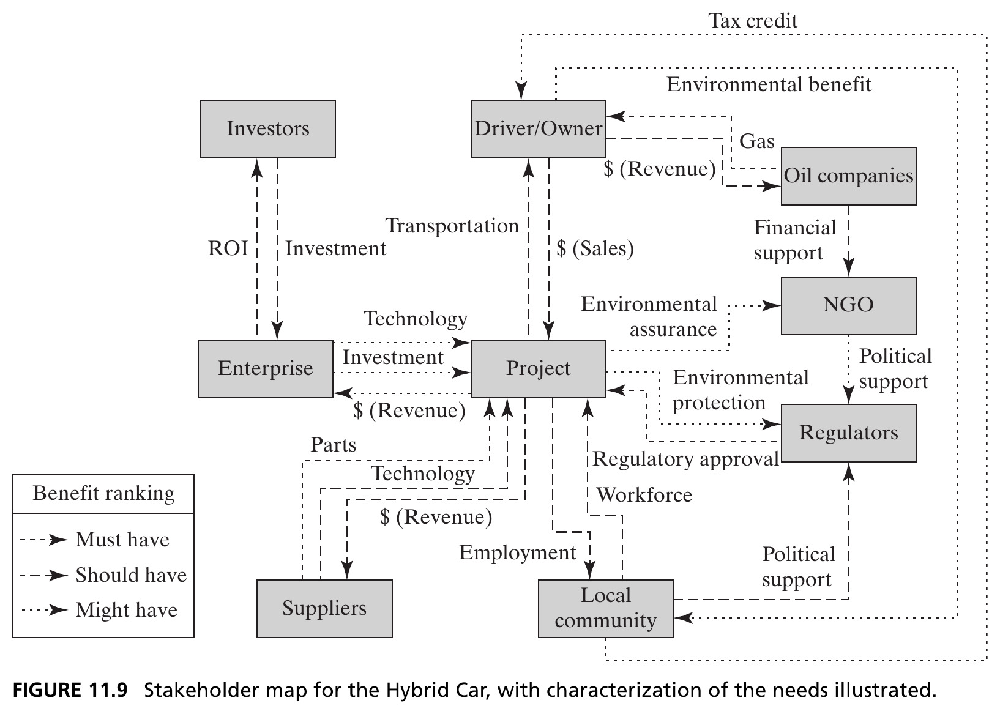{height=410px fig-align="center"}

::: {.side-caption}
Pairing stakeholders combinatorially reveals **indirect transactions** — like the tax credit flowing from local community to driver/owner. NGOs, oil companies, and investors appear here even though they were absent from the hub-and-spoke view, because they don't transact *directly* with the project. Source: Crawley, Cameron & Selva (2016), Fig. 11.9.
:::

::: {.notes}
This figure is the direct payoff of Step 3 from a couple of slides back — combinatorially pairing stakeholders and checking for relevant transactions between *them*, not just between each of them and the project. Point out immediately, and let it sink in, what's genuinely new here compared to the hub-and-spoke view: NGOs, oil companies, and investors now appear on this diagram — but they weren't present at all in Figure 11.8's hub-and-spoke view. Why? Because none of them produce anything, or receive anything, *directly* from the Hybrid Car project itself. They only enter the picture once you consider transactions *between other stakeholders* — the investors' relationship is with the enterprise, not the project directly, for instance.

Trace one concrete indirect transaction chain explicitly, since it's a nice illustration of a "value loop" concept coming up next: the local community provides a tax credit to the driver/owner (a genuine transaction, but one that has nothing to do with the project acting as an intermediary) — and this flow, together with several others, eventually completes a longer loop involving environmental benefit, environmental assurance, political support, and regulatory approval, cycling back around toward the project.

State plainly what this whole exercise has accomplished: we've interpreted the stakeholders for the Hybrid Car project as a genuine *system* (in the full Chapter 2 sense) — we've identified entities (all the stakeholders) and the relationships between them (all these value flows), though notably we have *not* defined a system boundary here, other than the completeness criterion requiring that every potentially relevant stakeholder be listed. This excludes only entities that genuinely won't be impacted by the project at all. As always with any systems perspective, choosing which entities to represent is a judgment call with real consequences for both the utility and the complexity of the resulting representation.
:::

## Value Loops and Indirect Transactions {.smaller}

::: {.callout-important appearance="minimal" icon=false}
A **value loop** is a series of value flows that return to the starting stakeholder — the system behavior of the stakeholder network.
:::

- Indirect transactions have one or more intermediaries between the firm and the end stakeholder — common in complex systems, e.g., a firm securing a foreign contract through a local partner who, in turn, provides jobs to a government that grants the contract
- We prioritize outputs by tracing backward from important inputs, through the chain, to the stakeholders who ultimately provide them — not just by direct transaction size

::: {.notes}
Give students the precise term for the pattern just glimpsed at the end of the previous slide: a *value loop* is a series of value flows that eventually returns to the starting stakeholder — this is, quite literally, the emergent "system behavior" of the stakeholder network, in exactly the sense Chapter 2 used that term. Where the hub-and-spoke diagram only showed direct, bilateral, two-party exchanges, the full network can contain genuine feedback loops of value that only become visible once indirect transactions are traced through.

Define indirect transactions precisely, and give the book's own illustrative example carefully, since it's genuinely instructive and comes up again in the international-business context: an indirect transaction has one or more intermediaries sitting between the firm and the end stakeholder. The book's example: a firm secures a foreign government contract with the help of a local partner. The firm provides technology to the local partner; the local partner provides employment to the government (perhaps by hiring local workers as part of the deal); the government, in turn, provides the contract back to the firm. Notice explicitly: the relationship between the firm's output (technology) and its resulting input (the contract) is no longer direct at all — it only works because of the intermediary — yet it's still entirely possible, and valuable, to trace and prioritize it.

The practical prioritization method this suggests, worth spelling out clearly: rather than prioritizing outputs purely by the size of a direct transaction (which fails the moment a relationship isn't a simple bilateral exchange, and fails to capture supplier relationships well at all), you instead trace *backward* from your most important inputs, through the full chain of the network, to identify which stakeholders ultimately provide them — and how strongly. A simplistic version of this: multiply together the importance of the needs satisfied at each link along a value loop, to get a single strength metric per loop, which lets you compare loops of very different structure against each other. The next slide shows this method's output for the Hybrid Car concretely.
:::

## Figure 11.14 · Prioritized Needs for the Hybrid Car {.smaller}

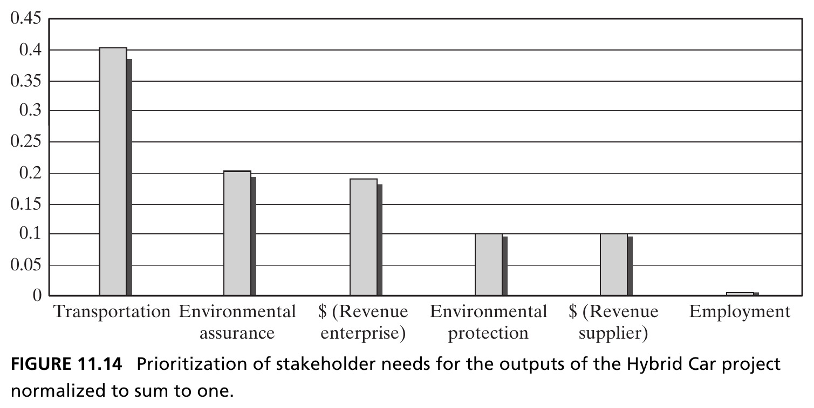{height=440px fig-align="center"}

::: {.side-caption}
Computing value-loop strength across the stakeholder network yields a ranked, normalized priority for the outputs the project must deliver — transportation dominates, but environmental assurance and enterprise revenue matter too. Source: Crawley, Cameron & Selva (2016), Fig. 11.14.
:::

::: {.notes}
Present this bar chart as the quantitative culmination of everything built up over the last several slides — this is what actually applying the value-loop prioritization method produces, for the six needs of stakeholders directly fulfilled by outputs of the Hybrid Car project. Transportation dominates clearly, sitting at roughly 0.4 on this normalized-to-sum-to-one scale — unsurprising, since it's the primary beneficiary's primary need, feeding the strongest, most direct value loop in the network. But notice what comes next: environmental assurance and revenue to the enterprise both land at meaningfully high priority too, followed by environmental protection, revenue to suppliers, and employment trailing at the bottom.

Emphasize what's genuinely powerful about this result, since it's the whole point of building the stakeholder-network machinery in the first place: this method produces a ranked view of the most important stakeholders and their most important needs *without* the firm having to subjectively judge, up front, which stakeholders matter more than others. The only inputs to this computation are the priority of needs as judged individually by each stakeholder (which we characterized back in Section 11.3's Kano-style analysis), and the objective structure of the stakeholder network itself. Notably, the model didn't require us to declare, a priori, whether the enterprise or the regulator was more important — that ranking *emerged* from the network structure, the same way emergent properties always do in this course's framework.

Close with an honest limitation, worth stating for balance: if we had simply disregarded indirect transactions from the start, we could have used a much simpler method — just ordering stakeholders by how many of our important needs they directly satisfy. The problem with that shortcut is that it would disregard exactly the third-party transactions (like the NGO's role) that are individually unimportant to the firm in bilateral terms, but are important as a *lever*, through the network, toward something the firm badly wants (like regulatory approval). The architect has to use judgment about which systems genuinely require this indirect-transaction analysis, and which can be handled with simpler, purely bilateral reasoning.
:::

## Box 11.3 · Principle of Balance {.smaller}

::: {.callout-note appearance="simple" icon=false}
*"Bring balance to the Force, not leave it in darkness…"* — Obi-Wan Kenobi

*"No complex system can be optimized to all parties concerned."* — Eberhardt Rechtin
:::

- One may never be able to enumerate, let alone quantify, all the factors — one must make tradeoffs among the factors that come close to satisfying the recognized influences
- The system must be balanced *as a whole*, not just the sum of balanced elements
- The architect is always balancing **optimality** against **flexibility** — the more optimized for a given application, the less flexible to new use cases and technologies

::: {.notes}
This principle closes out Section 11.3 with an honest, humbling statement about the limits of everything students have just learned. Both epigraphs point at the same underlying truth from different angles — the more memorable pop-culture one (Obi-Wan) and the more formal systems-engineering one (Eberhardt Rechtin, a foundational figure in the systems architecting literature): no complex system, however carefully analyzed, can be optimized to satisfy every party involved simultaneously.

Unpack the three bullets as a connected argument. First: for any real, built system, you may never be able to fully enumerate — let alone precisely quantify — every single factor and influence bearing on it. Given that, the goal isn't to find some theoretically perfect optimum (which may not even exist, or may be meaningless given the un-enumerated factors you're inevitably missing); it's to make sensible tradeoffs among the factors you *have* identified, getting reasonably close to satisfying the recognized influences.

Second, and worth emphasizing since it's a genuinely subtle systems-thinking point: the system must be balanced *as a whole* — this is emphatically not the same thing as separately, locally optimizing each individual element and assuming the sum will automatically be balanced. This is precisely the emergence idea from Chapter 2 again, now applied specifically to the stakeholder-balancing problem: local optimization of parts does not guarantee global balance of the whole.

Third: the architect is perpetually trading off *optimality* against *flexibility*. The more tightly an architecture is optimized for one specific, currently-understood application, the less margin and flexibility it retains to respond to new use cases or new technologies that show up later. Conversely, an architecture built with generous margin for future flexibility is, by construction, less optimized for its current, known use case. This tension — worth flagging as a preview — recurs throughout the rest of the course, and there's no formula that resolves it once and for all; it's a judgment call the architect makes deliberately, informed by exactly the kind of stakeholder analysis this whole section just walked through.
:::

## Section 11.3 Summary {.smaller}

- Needs are characterized along several dimensions — Kano analysis is one useful conceptual model, but judgment often outperforms formal methods
- Treating the stakeholder set as a *system* — with value loops and indirect transactions — reveals stakeholders and priorities invisible from a purely direct, hub-and-spoke view
- Balancing competing stakeholder claims, not optimizing to any single one, is the essence of good architecture

::: {.notes}
Use this as a checkpoint before turning to goals. Students should now be comfortable with: the five dimensions for characterizing needs (benefit intensity, detriment, urgency, awareness, coupling) and the Kano methodology's three categories (must have, should have, might have); the honest limitation that formal prioritization methods can be outmatched by experienced human judgment, and that cross-stakeholder comparison is inherently harder than within-stakeholder comparison; the construction of a stakeholder map treating the stakeholder set itself as a system, using the three-step procedure (who satisfies needs, what are project outputs, combinatorial pairing); the resulting concepts of indirect transactions and value loops, and how tracing them produces a genuinely quantitative, network-derived prioritization; and finally, the Principle of Balance, which honestly caveats all of this by reminding us that no system can be optimized for every stakeholder simultaneously — the goal is balance, not universal optimization. Having now identified stakeholders and thoroughly characterized and prioritized their needs, Section 11.4, up next, finally turns to the actual translation step promised in the chapter's title: converting these needs into goals the architect can design against.
:::

# 11.4 Interpreting Needs as Goals

## Box 11.4 · Definition of Goals {.smaller}

::: {.callout-note appearance="simple" icon=false}
**Goals** are defined as: what is planned to be accomplished, and what the producing enterprise hopes to achieve. Goals are a product/system attribute.
:::

- Needs exist in the stakeholder's mind; **goals are defined by the producing enterprise** with the intent of meeting those needs
- Goals are under the architect's control — they are not static, and are often traded off against other product attributes in design

::: {.notes}
This is the pivotal definitional slide of the whole chapter — the "translating" in the chapter title happens exactly here, so make sure the need/goal distinction is airtight before moving on. A goal is what is planned to be accomplished, and what the producing enterprise hopes to achieve; goals are explicitly a product/system attribute — which is the crucial contrast with needs, which (recall from Box 11.2) exist in the mind and heart of the stakeholder, and are primarily *owned* by the beneficiary, outside the firm's control.

Draw the distinction as sharply as possible, since this is worth a direct side-by-side comparison on the board: needs exist in the stakeholder's mind, prior to and independent of any product; goals, by contrast, are defined *by the producing enterprise*, specifically with the intent of meeting those needs. Needs are not chosen by the firm; goals absolutely are — they are entirely under the architect's control. And goals are explicitly not static or fixed the way a need might feel fixed to the person holding it — goals are frequently traded off against other product attributes during the design process itself. This is worth connecting back to a point made much earlier in the course (Chapter 1's "Structured Creativity" discussion): the whole reason the book insists on the word "goals" rather than "requirements" is to preserve this tradability — a theme the next few slides develop explicitly.

Flag one more subtlety worth surfacing here: creating goals means the architect is *choosing* which needs of the beneficiary the product should address, in addition to which needs of *other* stakeholders — corporate strategy, regulation, and so on — the project should also serve. This raises a legitimate concern some readers have: doesn't this framing suggest corporate strategy or regulation are somehow "optional" for the architect to serve or not? The book's clarification is important: corporate strategy needs are an active choice a firm makes about which markets to compete in, not an imperative forced on every project; and nothing here suggests architects should build systems that violate mandatory regulations — the point is only that these are all needs the architect must weigh and interpret when defining goals, not commands handed down that bypass the architect's judgment entirely.
:::

## Five Criteria for Goals {.smaller}

| Criterion | Meaning |
|---|---|
| **Representative** | Goals reflect stakeholder needs — meeting the goals meets the needs |
| **Complete** | Satisfying all goals satisfies all *prioritized* needs |
| **Humanly Solvable** | Goals are comprehensible and aid the problem solver |
| **Consistent** | Goals do not conflict with each other |
| **Attainable** | Goals can be reached with available resources |

::: {.side-caption}
For comparison, INCOSE's eight requirement criteria collapse into essentially the same five, once "necessary/implementation-independent/clear-and-concise" are folded into Representative and Humanly Solvable. Source: Crawley, Cameron & Selva (2016), §11.4.
:::

::: {.notes}
Introduce these five criteria as the evaluative standard the rest of the chapter (and really, the rest of Part 3) uses to judge whether a set of goals is actually good. Since goals are decisions made by the architect, we need explicit criteria by which to evaluate those decisions — that's exactly what these five provide. Walk through each briefly: Representative — goals should be representative of stakeholder needs, so that a system meeting the goals will, in turn, actually meet those underlying needs. Complete — satisfying all the goals should satisfy all *prioritized* stakeholder needs (note the qualifier "prioritized" — completeness is measured against the needs we've decided matter, via Section 11.3's prioritization work, not literally every conceivable need ever mentioned). Humanly Solvable — goals should be comprehensible, and should actually enhance, not hinder, the problem solver's ability to find a solution (this criterion gets a whole dedicated slide of its own next, since it's the hardest to satisfy in practice). Consistent — goals should not conflict with each other. Attainable — goals should be reachable given the resources actually available.

The side-caption comparison to INCOSE's eight requirement criteria is worth mentioning briefly for students with a systems-engineering background: INCOSE's Necessary, Implementation-independent, Clear-and-Concise, Complete, Consistent, Achievable, Traceable, and Verifiable collapse essentially into these same five, once you notice that Necessary, Traceable, and Verifiable are all captured by Representative, and that Implementation-independent and Clear-and-Concise are both captured by Humanly Solvable. So this isn't an alternative framework competing with established practice — it's a deliberately compressed, five-criterion version, chosen specifically so more emphasis can be placed on trading off *between* goals, which is the book's central concern.
:::

## Crafting Humanly Solvable Goals {.smaller}

- The problem statement itself is one of the architect's greatest levers — it **predisposes** how human designers interpret the goals
- Extraneous information distracts, even if not strictly wrong: *"Find the voltage drop across a 5-ohm resistor... in a 120-V DC circuit"* — the "120-V DC circuit" detail can mislead designers into reasoning about resistance–temperature dependency that was never intended
- Information *not* in the problem statement may be wrongly assumed excluded — crafting a statement is a balancing act: enough solution-neutral information, without extraneous or misleading detail

::: {.fragment .callout-tip}
Maier & Rechtin: the F-16's original problem statement, "build a Mach2+ fighter," focused designers on top speed — when the underlying need was really to *exit a dogfight quickly*, better served by thrust-to-weight ratio.
:::

::: {.notes}
This slide tackles the hardest of the five criteria — Humanly Solvable — and gives concrete, memorable illustrations of how easy it is to get wrong even with good intentions. The core insight: the way a problem statement is *worded* has an enormous, almost psychological effect on how the humans who read it go on to interpret and solve it. This isn't a minor stylistic concern — it's one of the most powerful levers an architect has.

Walk through the toy example carefully, since it's genuinely illuminating: "find the voltage drop across a 5-ohm resistor to which a 12-amp current is applied in a 120-volt DC circuit." Ask students what's actually wrong here — the physics answer is trivial (Ohm's law: 5 ohms times 12 amps equals 60 volts), and every piece of stated information is technically true. The problem is the phrase "120-V DC circuit" is extraneous to solving this specific sub-problem, yet its presence predisposes readers to start reasoning about things it's not actually relevant to — like whether resistance depends on temperature in this operating regime. In a simple problem with well-known physics, this kind of extraneous distraction can be caught and eliminated with confidence; in a complex system, additional information can't be so easily dismissed as irrelevant, so it can genuinely mislead a design team.

The flip side is just as dangerous, and deserves equal weight: information that's *not* included in a problem statement can be silently, and wrongly, assumed to be excluded from consideration entirely. The book's example: leaving out temperature data might get quietly interpreted by a design team as meaning "there is no resistance-temperature dependency to worry about," even if that was never the architect's intent. Crafting a good problem statement is therefore a genuine balancing act — capture enough solution-neutral information to convey the important needs, without introducing extraneous or misleading detail in either direction.

The fragment's F-16 example is the book's most powerful real-world illustration, worth spending real time on: the Air Force's original problem statement was, in effect, "build a Mach 2+ fighter" — a genuine performance goal, but one based on an underlying need that was actually to be able to exit a dogfight quickly. Framing the goal purely around top speed focused designers' minds on maximizing the aircraft's maximum velocity — when a *revised* problem statement, focused instead on a high thrust-to-weight ratio (enabling superior acceleration, to out-accelerate an opponent when needed, targeting something more like Mach 1.4 with excellent acceleration), would have better served the actual underlying need. Same underlying need, two very different problem statements, two very different resulting aircraft designs. This is exactly why crafting the problem statement carefully — the subject of the next slide — deserves its own formal principle.
:::

## Box 11.5 · Principle of the System Problem Statement {.smaller}

::: {.callout-important appearance="minimal" icon=false}
The statement of the problem defines the high-level goal and establishes the boundaries of the system — it divides content from context. Challenge and refine it until you are satisfied it is correct. It is rarely stated properly on first formulation.
:::

- The **System Problem Statement (SPS)** is the single assertion of what the system is intended to accomplish to deliver value — much like a mission statement
- A common failure mode: the de facto problem statement reverts to a previous product with a modifier — "cheaper electric toaster," "more efficient roadster"

::: {.notes}
Formalize the F-16 lesson from the previous slide into a named principle and a concrete tool: the System Problem Statement, or SPS. Define it precisely — the SPS is the single assertion of what the system is intended to accomplish in order to deliver value; the book draws a direct analogy to an organization's mission statement, representative of what real success looks like for the project.

Emphasize the principle's core claim, worth restating verbatim since it's genuinely important: the statement of the problem defines the high-level goal *and* establishes the boundaries of the system — recall from Chapter 2 that defining a boundary is exactly what separates "content" (what's in the system) from "context" (what's just outside it, but still relevant). Getting the SPS right is therefore not just a wording exercise — it has real architectural consequences for scope. And critically: it is *rarely* stated correctly on first formulation. The principle's prescriptive instruction is to challenge and refine the statement repeatedly until you're genuinely satisfied it's correct — treat the first draft as a starting point for interrogation, not a finished artifact.

Diagnose a common, tempting failure mode the book calls out directly: requirements engineering, especially when done hastily, often produces a de facto problem statement that's really just a previous product with a modifier bolted on — "a cheaper electric toaster," "a more efficient roadster." This kind of statement is dangerous precisely because it smuggles in a huge amount of unstated, solution-*specific* assumption (an electric toaster, a roadster) under the guise of a goal statement — foreclosing the very design space you should still be exploring at this early stage. Maier and Rechtin, cited here, note that problem statements in practice are frequently ill-formed, incomplete, or over-constrained, and are often a confused mixture of needs, goals, functions, and forms all tangled together — which is exactly the mess the next slide's To-By-Using framework is designed to untangle.
:::

## The To-By-Using Framework {.smaller}

::: {.callout-note appearance="simple" icon=false}
**To**...[the statement of (solution-neutral functional) intent]
**By** verb-ing...[the statement (solution-specific) of function]
**Using**...[the statement of form]
:::

::: {.fragment}
Example, from the U.S. Constitution: *"...to form a more perfect union...promote the general welfare... (By)...laying and collecting taxes, paying debts... (Using)...the powers of...The Congress."*
:::

::: {.fragment .callout-tip}
The value delivery to the **primary beneficiary** must be presented first — targeting the Hybrid Car at police fleets instead of consumers would change the SPS, and with it, priorities like crash safety and idle time.
:::

::: {.notes}
Introduce the To-By-Using framework as the book's practical, structured tool for actually writing a good SPS — not the book's own invention, as the text is careful to note, but a canonical structure they're formalizing and reusing here. Walk through the three components precisely, and connect each one explicitly back to the instrument-process-operand and solution-neutral-function vocabulary from earlier chapters (Chapter 2's form/function, and especially Chapter 7's solution-neutral function): "To" states solution-neutral functional intent — the pure, abstracted purpose, without committing to any specific mechanism; "By verb-ing" states a solution-*specific* statement of function — some particular way of accomplishing that intent; "Using" states the form — the specific system or instrument doing the accomplishing.

Walk through the U.S. Constitution example as a nice, memorable, non-engineering illustration that the underlying pattern generalizes well beyond product design: "to form a more perfect union...promote the general welfare" is the solution-neutral intent (the "To"); "by laying and collecting taxes, paying debts" is the solution-specific function (the "By"); "using the powers of...the Congress" is the form (the "Using"). This example is worth pointing out precisely because it shows the To-By-Using pattern isn't some engineering-specific trick — it's a genuinely general way of structuring any well-formed statement of purpose.

The final fragment makes a critical, easy-to-overlook point about *sequencing*: the value delivery to the *primary* beneficiary must be presented first in the statement, since this is what most strongly shapes the reader's interpretation. The book's own illustrative hypothetical: if the Hybrid Car project had targeted police vehicle fleet buyers as the primary beneficiary, rather than everyday consumers, the resulting SPS would have been substantially different — and that difference would cascade into real architectural consequences, shifting the prioritization toward things like crash safety and tolerance for extended vehicle idle time, attributes that matter far less to an ordinary consumer driver. This is a good moment to remind students of Figure 11.15 (referenced by name in the next slide) — the To-By-Using framework maps directly onto the same OPM concept template (intent → function → form) introduced back in Chapter 7, which shouldn't be a surprise, since goals and concepts are deeply intertwined ideas.
:::

## Figure 11.16 · System Problem Statement for the Hybrid Car {.smaller}

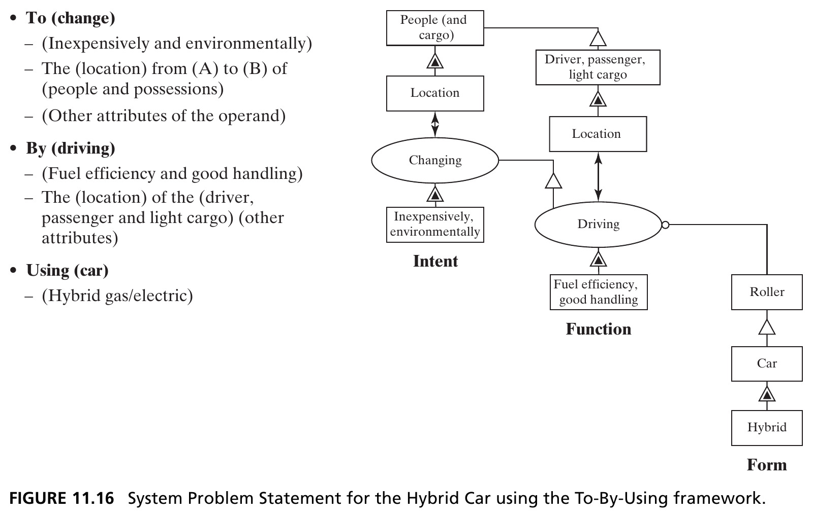{height=440px fig-align="center"}

::: {.side-caption}
The To-By-Using framework maps directly onto the familiar OPM concept template (Fig. 7.4): intent → function → form. *To* change the location of people and cargo inexpensively and environmentally; *by* driving fuel-efficiently with good handling; *using* a hybrid car. Source: Crawley, Cameron & Selva (2016), Fig. 11.16.
:::

::: {.notes}
Walk through the finished Hybrid Car SPS built with the To-By-Using framework, tracing carefully how each piece connects to the OPM diagram shown in the figure. "To" (the solution-neutral intent) is: change, inexpensively and environmentally, the location (from A to B) of people and their possessions — notice this is deliberately abstract, still not committing to "driving" or "a car" as the mechanism. "By" (the solution-specific function) is: driving — allowing the driver to drive themselves, passengers, and light cargo, fuel-efficiently and with good handling characteristics. "Using" (the form) is: a hybrid gas/electric car specifically.

Point out for students how this exact same statement, assembled into full prose, reads as: "Provide our customers a product to transport them and their possessions inexpensively and in an environmentally sound manner, by allowing them to drive themselves, their passengers, and light cargo fuel-efficiently and with good handling characteristics, using a hybrid gas/electric car." Mention, since it's a nice small observation the book makes: enterprise-facing goal statements like "provide our customers..." often appear at the start of a goal statement, and they're indicative of the firm's own internal organizational intent, distinct from the externally-delivered value itself.

Given this SPS, note that we can now proceed systematically through the template item by item to enumerate a much more detailed set of descriptive goals — which is exactly what the next slide does. This diagram is worth keeping visible on the board or referring back to for the rest of the lecture, since virtually every subsequent goal listed traces back to one of these three To/By/Using components.
:::

## From SPS to Detailed Goals {.smaller}

Given the SPS, we enumerate descriptive goals for each need the project intends to satisfy:

::: {.columns}
::: {.column width="50%"}
- Shall provide transportation performance
- Shall be inexpensive
- Shall have environmental satisfaction
- Shall accommodate a driver (size)
:::
::: {.column width="50%"}
- Shall carry passengers and cargo
- Shall have good fuel efficiency
- Shall have desirable handling
- Shall satisfy regulatory requirements
:::
:::

::: {.fragment .callout-tip}
Note we deliberately say **goals**, not "requirements" — architects must be free to make tradeoffs among them, which "shall" language tends to obscure.
:::

::: {.notes}
Walk through this list as the direct, systematic expansion of the SPS from the previous slide — for now, listing a goal for essentially every need the Hybrid Car project intends to satisfy, without yet worrying about relative priority (that comes next, in Section 11.5). Point out that the first several goals shown here (transportation performance, inexpensive, environmental satisfaction, accommodating a driver, carrying passengers and cargo, fuel efficiency, handling) all trace directly back to attributes of the vehicle itself, evaluated against the primary beneficiary's (the driver/owner's) value function.

Mention briefly, since the book covers it and it's worth a sentence, that the full goal list continues beyond what's shown here to cover the needs of *other* stakeholders too, drawn straight from the stakeholder-needs-prioritization work in Section 11.3 — goals about modest corporate investment and selling in volume (serving investors and the enterprise), engaging suppliers in long-term stable relationships (serving suppliers), providing stable employment (serving the local community), and satisfying regulatory and environmental requirements (serving regulators and NGOs). Some of these require interpreting an entire indirect value loop into a single goal statement — for instance, capturing the loop where the project provides environmental assurance to an NGO, which the NGO then converts into political support for the regulator, who grants regulatory approval back to the project, requires writing a goal about delivering environmental assurance *and* explicitly recording the intent that the NGO pass that benefit along politically.

The fragment's terminology point is worth stating firmly, since it's a deliberate, load-bearing choice throughout this whole chapter, not a stylistic quirk: the book consistently uses "goals" rather than "requirements," specifically to emphasize that the architect must remain free to make tradeoffs among them. "Shall" language, so common in formal requirements documents, tends to imply an unconditional, non-negotiable mandate — which quietly obscures the reality that system architecture fundamentally involves trading off competing objectives against each other. All the goals listed here are, at this stage, deliberately stated as flat "shall" statements — they haven't yet been prioritized, which is precisely the unfinished business Section 11.5 picks up next.
:::

## Section 11.4 Summary {.smaller}

- Goals are enterprise-defined, prioritizable interpretations of stakeholder needs — evaluated against five criteria: representative, complete, humanly solvable, consistent, attainable
- The **System Problem Statement**, built with the **To-By-Using** framework, is the architect's most powerful lever for shaping how a design team interprets the problem
- Early architecting should stay solution-neutral (**To**) as long as possible before adding solution-specific function (**By**) and form (**Using**)

::: {.notes}
Use this checkpoint to consolidate Section 11.4 before moving to prioritization. Students should now be comfortable with: the sharp distinction between needs (owned by the beneficiary, unchosen) and goals (defined by the enterprise, chosen and tradable); the five evaluative criteria for goals (representative, complete, humanly solvable, consistent, attainable), and why "humanly solvable" is the hardest to satisfy in practice, given how strongly problem-statement wording predisposes designers' thinking; the System Problem Statement as a formal tool, and the Principle that it's rarely correct on first formulation, so it must be actively challenged and refined; and the To-By-Using framework as the concrete method for constructing a good SPS, moving deliberately from solution-neutral intent, to solution-specific function, to form.

The third bullet is worth emphasizing as practical advice students can actually apply in their own project work: stay in the "To" — the solution-neutral functional intent — for as long as is practical before committing to a specific "By" and "Using." Committing to solution-specific function and form too early forecloses design space and can prejudice the eventual design, exactly the same caution raised back when this framework was first introduced. With needs now translated into a full set of descriptive goals, Section 11.5, up next, tackles the one piece of unfinished business flagged repeatedly throughout this section: how do we actually prioritize among all these "shall" statements?
:::

# 11.5 Prioritizing Goals

## Critical, Important, Desirable {.smaller}

::: {.columns}
::: {.column width="33%"}
**Critical goals**

The 3–7 absolute necessities for product success — "live or die" goals.
:::
::: {.column width="33%"}
**Important goals**

Major goals that contribute to, but are not absolutely necessary for, success.
:::
::: {.column width="33%"}
**Desirable goals**

Objectives that would be nice to meet, but are not critical to the project.
:::
:::

::: {.fragment .callout-tip}
This framework allocates limited project resources: spend on critical goals, trade among important goals, and apply leftover resources to desirable goals.
:::

::: {.notes}
Introduce the book's three-tier prioritization scheme for goals — note the direct structural parallel to the three-bucket stakeholder grouping from Section 11.2, which is worth pointing out explicitly, since it's the same underlying idea (rough categorical prioritization) applied now to goals instead of stakeholders. Critical goals are the three-to-seven absolute necessities without which the product simply fails — sometimes called "live or die" goals, a vivid phrase worth repeating, since it conveys real, binding urgency rather than mere preference. Important goals contribute meaningfully to success but aren't absolutely, individually necessary for it. Desirable goals are objectives it would be nice to achieve, but that the project's success doesn't actually hinge on.

The fragment gives the direct, practical payoff of this categorization — this is genuinely how the framework is meant to be used, not just an academic taxonomy: it tells the project manager how to allocate genuinely limited project resources. Spend first, without hesitation, on the critical goals — these are non-negotiable. Conduct real trades and analysis to determine resource allocation among the important goals, since there's real room for judgment there. And apply whatever resources are left over, if any, to the desirable goals. This gives a clean, actionable decision rule for resource allocation under scarcity, which is the situation virtually every real project actually faces.
:::

## Goals Need Metrics and Targets {.smaller}

- A goal without a metric and target value is incomplete — "should have good fuel efficiency" implies a metric (MPG) but sets no target
- The **rigidity** of a goal matters too: *constraining* ("must accommodate a driver of dimensions XYZ") vs. *unconstrained* ("should have good fuel efficiency") — the architect must decide which needs constrain the design, accepting the consequence of a narrower target market

::: {.notes}
Introduce a genuinely important practical refinement to the goal list built up in Section 11.4: a goal stated in prose alone, without a metric and a target value, is incomplete — you can't actually check whether it's been met. Give the book's own example: "should have good fuel efficiency" implicitly suggests a metric (miles per gallon), but as stated, sets no explicit target value — how many MPG counts as "good"? Without a number, this goal can't be verified or traded against other goals with any rigor.

Introduce "rigidity" as a second, orthogonal attribute every goal needs, beyond just having a metric and target — and walk through the distinction carefully, since it maps onto a real, consequential design decision. A *constraining* goal is something like "must accommodate a driver of dimensions XYZ" — a hard boundary the design must satisfy, with real consequences if violated. An *unconstrained* goal is something like "should have good fuel efficiency" — a target to optimize toward, without a hard pass/fail boundary. The architect genuinely has to decide, goal by goal, which needs should be treated as constraining the design space and which should remain unconstrained targets for optimization — and it's worth being explicit with students about the real tradeoff involved: making more goals constraining shrinks the target market (fewer possible designs will satisfy every constraint), while leaving more goals unconstrained risks under-delivering on something a stakeholder actually needed firmly met. Point out, since it directly foreshadows the very next box, that many organizations blur this distinction, treating all customer-stated needs as equally rigid "musts" — exactly the confusion the next slide's Principle of Ambiguity is partly meant to push back against.
:::

## Box 11.6 · Principle of Ambiguity and Goals {.smaller}

::: {.callout-note appearance="simple" icon=false}
*"Always aim higher than you want to climb, for one usually stops below the goal one sets."* — Traditional Chinese Saying
:::

- The early phase of system design is characterized by great ambiguity — the architect must resolve it into a small, complete, consistent, humanly solvable set of goals
- No one designs or rigorously controls the upstream process — expect uncoordinated, incomplete, and conflicting inputs
- Because context and customer needs evolve, there must be a **process to continuously reexamine and update** the goals

::: {.notes}
Present this principle as a candid, almost consoling acknowledgment of just how messy the goal-setting process really is in practice, after several slides that may have made it sound quite orderly and systematic. The proverb captures a useful bias to build into goal-setting: aim somewhat higher than you actually expect to achieve, since real execution tends to fall short of the stated aim regardless.

Walk through the three substantive bullets as a connected, honest picture of reality. First: the early phase of any system's design is genuinely characterized by great ambiguity, and it is squarely the architect's job to resolve that ambiguity into a small, complete, consistent, and humanly solvable set of goals — notice this is a direct callback to the five criteria from Section 11.4, now framed as the target state the architect is actively working toward, out of an initially messy starting point. Second, and this is worth stating plainly to manage students' expectations about real organizational life: in general, no single person designs or rigorously controls the entire upstream process feeding into goal-setting — so the architect should genuinely *expect* uncoordinated, incomplete, and even outright conflicting inputs arriving from different parts of the organization and different stakeholders, not treat this messiness as an unusual failure to be surprised by.

Third: because the surrounding context and customer needs are constantly evolving (recall the earlier discussion of latent needs, and how a "might have" Kano attribute can drift into a "must have" over time), there must be an ongoing, explicit *process* to continuously reexamine and update the goals — goal-setting isn't a one-time activity performed once at project kickoff and then frozen; it has to be revisited as reality changes around the project.
:::

## Consistency and Attainability {.smaller}

- **Consistency** is subtle: many goals will genuinely conflict (range vs. battery weight) — the architect must understand whether that tradeoff is shallow, steep, or oddly shaped, sometimes only checkable with an analytical model
- **Attainability** means goals can be reached within technology, schedule, resource, and risk constraints — much easier for derivative products than clean-slate designs. When goals aren't attainable: reduce scope, or add resources

::: {.notes}
Return to two of the five criteria from Section 11.4 — Consistent and Attainable — and go deeper into each, since they turn out to be genuinely subtle in practice, not just simple checkboxes. On consistency: it's easy to say "goals shouldn't conflict," but by definition, many real goals genuinely *do* conflict with each other — the book's own example, a Hybrid Car might sacrifice driving range in exchange for reduced battery weight (a lighter battery generally stores less energy). The subtlety worth emphasizing: it's not enough to just know that a tradeoff exists — the architect needs to understand its *shape*. Is the tradeoff between range and weight shallow (small changes in weight barely affect range) or steep (small changes in weight dramatically affect range), or does it have some other, non-monotonic shape entirely? This often can't be assessed through pure logical inspection — sometimes consistency can only genuinely be checked analytically, using a model (low- or high-fidelity) that estimates how different requirement choices actually impact the metrics of interest. And as with any model, you'd need to separately evaluate whether the model itself is accurate enough to trust the decision resting on it.

On attainability: goals are attainable when they can be reached within the real constraints of available technology, development schedule, resources, and acceptable risk. This is genuinely much easier to achieve for derivative products (building on an established, proven platform) than for clean-slate, from-scratch designs, where technology and schedule risk are both far higher. Give students the two concrete levers available when goals turn out *not* to be attainable: reduce the scope of the goals themselves, or add more resources (time, money, people) to the project. There's no third option that magically makes an unattainable goal attainable without changing one of those two things. Mention briefly, since it's flagged honestly in the book, that this course's coverage of validation and verification stays deliberately shallow — these are well-covered topics in dedicated systems-engineering texts — and that Part 4 of this course will return to attainability with explicit cost models used to more rigorously evaluate whether goals can actually be reached.
:::

## Figure 11.17 · Checking Whether Goals Meet Criteria {.smaller}

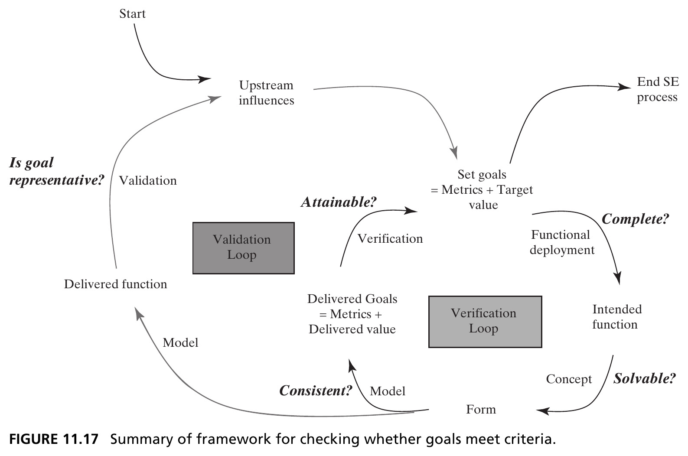{height=410px fig-align="center"}

::: {.side-caption}
Two nested loops: the **validation loop** asks "is the goal representative?" by comparing delivered function against upstream influences; the **verification loop** asks "is it attainable, complete, consistent, solvable?" by comparing delivered goals against the concept, form, and intended function. Source: Crawley, Cameron & Selva (2016), Fig. 11.17.
:::

::: {.notes}
Walk through this diagram as a compact visual summary tying together all five criteria from Section 11.4 into one coherent process picture, showing where each criterion actually gets checked as a project proceeds from goal-setting through to a delivered system. Trace the outer path first: starting from upstream influences, the process sets goals (expressed as metrics plus target values, tying back to a couple of slides ago), proceeds through concept, form, and intended function, into functional deployment, and eventually to an end systems-engineering process delivering actual function.

Now trace the two labeled, nested feedback loops explicitly, since these are the heart of the figure. The *validation loop* asks a single question — "is the goal representative?" — by comparing the delivered function, once the system is actually built and operating, back against the original upstream influences that motivated the goals in the first place; this is fundamentally checking whether we built something that actually addresses real stakeholder needs, not just an internally-consistent, self-referential specification. The *verification loop* asks the remaining four criteria together — attainable, complete, consistent, and solvable — by comparing the delivered goals (again expressed as metrics plus delivered values) against the concept, form, and intended function, working with a model where needed to check consistency.

Point out for students familiar with any systems-engineering coursework (or point out preemptively if not) that this maps onto the classic validation-versus-verification distinction: verification asks "did we build the system right?" (i.e., according to its own stated goals and specifications); validation asks "did we build the right system?" (i.e., does it actually address the real, upstream stakeholder needs it was supposed to serve). A system can pass verification perfectly while still failing validation, if the goals themselves were never truly representative of stakeholder needs in the first place — which is exactly why the Representative criterion, checked by the validation loop, sits conceptually apart from the other four, checked by the verification loop.
:::

## Section 11.5 Summary {.smaller}

- Goals should be grouped as critical, important, and desirable — this framework governs how limited resources get allocated
- Every goal needs an explicit metric, target value, and a stated rigidity (constraining vs. unconstrained)
- Consistency and attainability may require analytical models to check — logical inspection alone is often not enough

::: {.notes}
Use this to close out Section 11.5 before the chapter-level wrap-up. Students should now be comfortable with: the critical/important/desirable three-tier goal prioritization and its direct link to resource allocation decisions; the requirement that every goal carry an explicit metric, a target value, and a declared rigidity (constraining versus unconstrained), not just prose intent; and the genuinely subtle nature of consistency and attainability checks, which frequently require analytical modeling rather than pure logical inspection, tied together visually in the validation-loop/verification-loop diagram. With stakeholders identified, needs characterized and prioritized, and needs translated into a prioritized, metric-bearing set of goals, the chapter's core process (all four steps of the Figure 11.1 framework) is now complete — the next slide pulls the whole chapter together before the closing Nagano Olympics case study.
:::

## Chapter 11 Summary {.smaller}

- Complex systems face real challenges managing stakeholders: many of them, often with unclear relative priority, sometimes providing only non-monetary inputs, and often delivering value indirectly
- Value delivery is an **exchange** — your outputs meet their needs, and their outputs meet yours
- Stakeholders should be **prioritized by the inputs they provide to the project** — directly or through indirect value loops
- Needs are translated into **goals** via the System Problem Statement and the To-By-Using framework, then checked against five criteria and prioritized as critical/important/desirable

::: {.callout-tip}
**Reference**: Crawley, E., Cameron, B., & Selva, D. (2016). *System Architecture: Strategy and Product Development for Complex Systems*. Pearson. Chapter 11.
:::

::: {.notes}
Use this as the full-chapter recap, walking back through the entire needs-to-goals framework from Figure 11.1 one more time in order. We opened by recognizing three genuine challenges complex systems face with stakeholders: there are simply many of them; their relative priority is often unclear, especially when they provide non-monetary inputs (political support, regulatory approval) that are hard to compare against revenue; and complex products frequently deliver value *indirectly*, through intermediaries, rather than through simple, direct, bilateral exchanges.

We then built the whole process in order: identify stakeholders and beneficiaries, using the exchange-based view of value (your outputs meet their needs, their outputs meet yours) as both a definitional anchor and a completeness check; characterize those needs along several dimensions, with Kano analysis as a particularly useful conceptual tool; treat the full stakeholder set as a system in its own right, building a stakeholder map that reveals indirect transactions and value loops invisible from a simple hub-and-spoke view, and using that network structure to prioritize stakeholders by the inputs they actually provide to the project, directly or indirectly; and finally, translate needs into goals — a genuinely different kind of object, defined by the enterprise rather than owned by the beneficiary — using the System Problem Statement and the To-By-Using framework, checked against five criteria (representative, complete, humanly solvable, consistent, attainable), and prioritized into critical, important, and desirable tiers.

Before moving to the closing case study, it's worth stating plainly why this chapter matters so much for everything that follows in Part 3: Chapter 12 is going to take exactly this prioritized set of goals for the Hybrid Car and use it as the starting point for generating and evaluating concept alternatives — none of that creative work in Chapter 12 is possible without the goal-setting groundwork this chapter just laid.
:::

# Case Study: 1998 Nagano Winter Olympics — Stakeholders in IT Architecture

## IBM's Daunting Scope {.smaller}

*By Dr. Victor Tang, Director of IT Client Relations for IBM's 1998 Olympic Winter Games*

- IBM was contractually obligated to build, operate, and maintain the **entire IT system** for the Games: computing and delivering competitors' results, accrediting athletes and staff, recording drug-testing results, and more
- 25 million lines of software; 10 mainframes, 5,000 PCs, 1,500 printers, 160 servers, 2,000 routers — serving ~150,000 athletes, officials, and volunteers
- A genuine **system-of-systems**: each constituent system has a different stakeholder, with distinct priorities, interests, and biases

::: {.notes}
Introduce this closing case study by noting its unusual provenance, since it's worth mentioning to students: this box is written directly by Dr. Victor Tang, who was personally the Director of IT Client Relations for IBM's 1998 Olympic Winter Games, with direct responsibility for architecture and systems management — this is a first-hand practitioner account, not a third-party retrospective, which is part of why it's such a rich, concrete illustration of everything covered in this chapter.

Set the scale and stakes concretely: IBM was one of eleven top sponsors for the 1998 Nagano Winter Olympics, at a reported sponsorship cost of \$60 to 80 million — in exchange, IBM was contractually obligated to provide, build, operate, and maintain the *entire* IT system for the Games, and was permitted to use the Olympic logo for marketing in return. The scope was genuinely daunting: computing and delivering competitors' results to stakeholders, media, and the public; updating and archiving athletes' records; accrediting athletes and staff; recording drug-testing results; and much more. Give the concrete numbers, since they help students appreciate the true scale: 25 million lines of software, running across 10 mainframes, 5,000 PCs, 1,500 printers, and 160 servers, all networked through 2,000 routers, serving roughly 150,000 athletes, officials, and volunteers.

Land on the framing that makes this a genuine system-of-systems, worth connecting explicitly back to Chapter 2's definition of emergence: each constituent system within this larger IT architecture has its own distinct stakeholder — the IOC, the media, games administration, sports federations, the Nagano Organizing Committee, and dozens of others — each with genuinely different priorities, interests, and biases. This isn't one customer with one clean, aligned set of needs; it's exactly the kind of genuinely hard, multi-stakeholder situation this entire chapter has been building tools to handle.
:::

## Figure 11.18 · The Nagano IT System, Clients, and Users {.smaller}

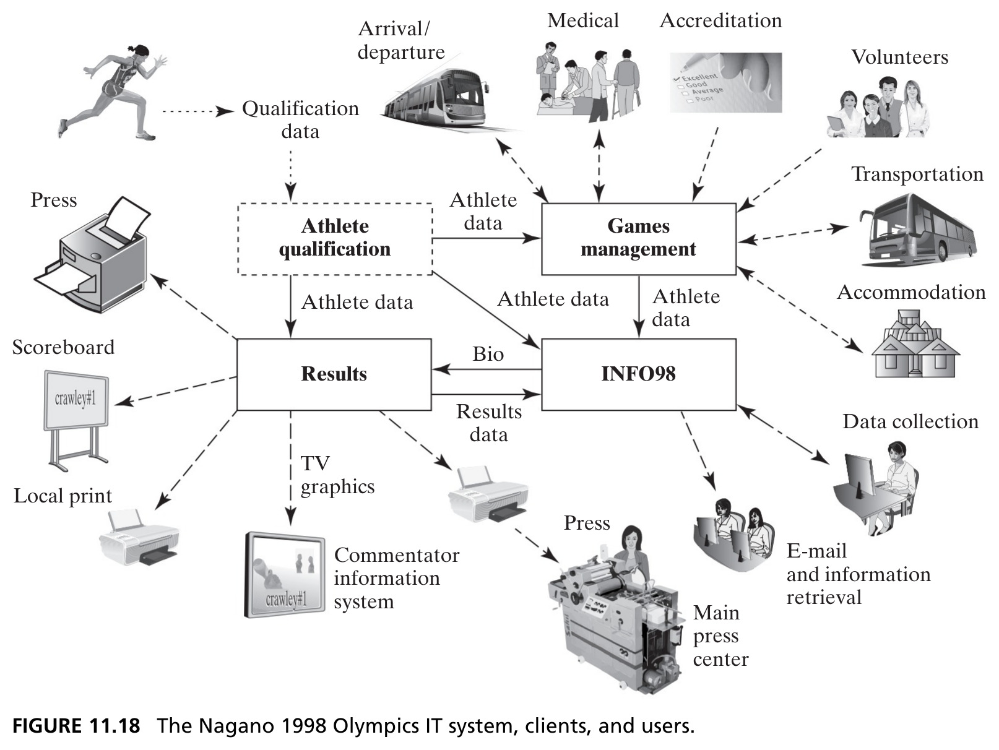{height=440px fig-align="center"}

::: {.side-caption}
Athlete Qualification, Games Management, Results, and INFO98 form the core — surrounded by dozens of client stakeholders: press, medical, accreditation, transportation, accommodation, volunteers, and more. Source: Crawley, Cameron & Selva (2016), Fig. 11.18.
:::

::: {.notes}
Walk through this diagram as a concrete visualization of the system-of-systems scale just described. Four core internal systems anchor the architecture: Athlete Qualification, Games Management, Results, and INFO98 — connected to each other by flows of athlete data, results data, and bio data. Surrounding this core is a genuinely wide array of client-facing systems and user groups: the press, scoreboards, local print, TV graphics and commentator information systems, medical services, accreditation, volunteers, transportation, accommodation, data collection, and email/information retrieval services, among others.

Point out how directly this diagram echoes the stakeholder-map exercises from earlier in the chapter — this is, in effect, a stakeholder map for a real, historical, extremely high-stakes system, with the same underlying logic: a set of interconnected systems and users, each representing a stakeholder with its own needs, connected by flows of value (here, mostly data flows rather than money or goods). It's worth asking students explicitly: given everything covered in Sections 11.2 and 11.3, how would you go about identifying the primary beneficiary here, and prioritizing among all these stakeholders? There's no single obviously-dominant beneficiary the way the Hybrid Car had its driver/owner — which is exactly the kind of genuinely hard, many-stakeholder situation the rest of this case study shows IBM having to navigate in practice.
:::

## Rethinking IBM's Strategy {.smaller}

- After a widely visible fiasco at the 1996 Atlanta Summer Games — showcasing products/technology that weren't ready — the IOC told IBM they *"didn't find any part which worked well."*
- IBM shifted from a **myopic product-technology-centric strategy** to one where products and technology were *the means* to deliver a **service**, not the end itself
- IBM communicated this explicitly: *"IT as a service...helping those running the Games, run the Games."* IBM had **moved the system boundary**

::: {.notes}
Set up the genuine crisis IBM faced heading into Nagano, since the drama here is what makes the rest of the case study land: at the prior Games — the 1996 Atlanta Summer Olympics — IBM had a widely visible fiasco. The book's account: IBM's strategy for Atlanta had been to showcase products, technology, and systems that, in the event, were not actually ready for that kind of high-visibility showcase — causing widely-publicized disruptions to Games operations and business management. The IOC's own verdict afterward was blunt and damning: they told IBM they "didn't find any part which worked well."

This is where the chapter's core theme — the distinction between needs and goals, and getting the *problem statement* right — plays out at enormous real-world stakes. IBM's fundamental strategic shift, heading into Nagano, was to move away from a myopic, product-and-technology-centric strategy, toward one where products and technology were understood as *the means* to deliver a *service* — not ends in themselves. IBM communicated this reframing explicitly and publicly: "IT as a service...helping those running the Games, run the Games...[and] enhancing the Olympic experience."

Connect this directly and explicitly back to Chapter 2's concept of a system boundary: the book's own framing is that IBM had literally *moved the system boundary* — reconceiving what "the system" even was. Rather than treating "the IT products and technology IBM builds" as the system, with the Games organizers as an external customer merely receiving and evaluating a delivered product, IBM redrew the boundary to include the Games organizers' success itself as part of what the IT system was for — this is precisely the difference between building goals around a solution-specific "By/Using" (specific IBM products and technology) versus around a solution-neutral "To" (successfully running the Games), echoing the To-By-Using discussion from earlier in the chapter almost exactly.
:::

## Co-Development With and Without X-Teams {.smaller}

| Task | Without X-Teams | With X-Teams |
|---|---|---|
| Requirements | IBM does; others only review | IBM + stakeholders co-develop and review |
| Write/run test cases | IBM does; others review | IBM + stakeholders co-develop, review |
| Training | IBM does; others concur | IBM + stakeholders co-develop, concur |

::: {.side-caption}
X-teams enable domain experts to work across organizational boundaries with their counterparts — stakeholders became competent spokespeople and credible advocates, not just critics. Source: Crawley, Cameron & Selva (2016), Fig. 11.19.
:::

::: {.notes}
Introduce the organizational mechanism IBM used to make this new "IT as a service" strategy real, rather than just a slogan: X-teams, an organizational pattern that enables domain experts from different organizations to work directly across organizational boundaries with their counterparts, rather than working in isolation and only exchanging finished deliverables for review.

Walk through the table's contrast carefully, since the pattern generalizes beyond just this case study. Without X-teams, the typical pattern for each activity — requirements, writing and running test cases, training — was that IBM did the actual work, and the other stakeholders (Xerox, sports federations, the media, the National Organizing Committee, the IOC) only reviewed or concurred with IBM's output after the fact, largely as outside critics reacting to something already built. With X-teams, the same activities became genuinely co-developed jointly by IBM and its stakeholders together, from the start, with review happening collaboratively rather than adversarially.

The consequence, stated directly in the source material and worth repeating to students as the real payoff: this approach let IBM's engineers develop the Games IT solution with a substantially more comprehensive understanding of both the technical requirements and the reciprocal organizational dependencies between systems. Stakeholders became competent spokespeople and credible advocates *for* IBM's work, rather than remaining purely external critics of it — they had genuine skin in the process, not just an opinion about the finished product. This is a vivid, concrete illustration of exactly the "decision rights" discussion from Box 11.1 earlier in the chapter (informed, consulted, voting, veto) — X-teams represent a deliberate choice to move key stakeholders from a purely "informed/consulted" role into something much closer to genuine co-development.
:::

## Rebuilding Trust Through the ICPG Process {.smaller}

- Four "IBM Must Do" goals emerged from the Atlanta debrief: meet all technical/management requirements, ensure no surprises during the Games, provide 24/7 operations, and ensure highly secure/usable systems
- IBM used **International Competitions Prior to the Games (ICPGs)** — practice events, often World Cup competitions — as a forum with sports federations and the IOC to surface and resolve errors *before* the real Games
- Solving the documented ICPG errors and shortcomings became management's agreed interpretation of satisfying "all requirements" — turning an impossible-to-fully-specify requirement set into something tractable

::: {.notes}
Give the four concrete "IBM Must Do" goals that emerged directly from IBM's own honest debrief of the Atlanta failure: meet all technical and management system requirements; ensure no surprises during the Games; provide 24/7 operations; and ensure highly secure and usable systems. Point out these read almost exactly like the critical-goals category from Section 11.5 — a small number of absolute, "live or die" necessities for success, not a sprawling wish list.

The genuinely clever, practical problem-solving move worth walking through carefully is how IBM tackled the first of these — "meet all technical and management system requirements" — given that the full, formally documented set of technical and sports-specific requirements (covering timing equipment from Seiko, printing and distribution from Xerox, accreditation and security for press/TV/medical/transportation/accommodation, training for volunteers, and much more) was, in the book's own words, "voluminous" and daunting to convincingly satisfy in full.

IBM's answer was the International Competitions Prior to the Games (ICPGs) — real practice events, often existing World Cup competitions in the relevant winter sports, that use new or modified Olympic rules and IT systems ahead of the actual Games, specifically so that everything can be tested under real, live conditions first. Rather than the ad hoc, informal debriefings IBM had used in the past, IBM instead held a formal plenary convocation specifically to discuss its performance at these ICPGs, deliberately inviting the winter-sports federations, IOC representatives, and key stakeholders — who came, notably, armed with papers already documenting IBM's errors and shortcomings from these practice events. After genuine, protracted negotiation, it was agreed that solving all of these *documented* errors and shortcomings would be the accepted, shared interpretation of what it meant to satisfy "all requirements." This turned an impossibly vague, sprawling, and essentially unverifiable goal — "meet all requirements" — into something genuinely tractable and checkable, precisely by anchoring "complete" (recall the five criteria) to a concrete, agreed, finite list rather than an open-ended abstraction. This management-by-exception approach is a genuinely clever, real-world instance of making a goal "humanly solvable" under real organizational pressure.
:::

## Architecture as a Utility {.smaller}

::: {.callout-note appearance="simple" icon=false}
*"Form follows function."* — Louis Sullivan, inventor of the skyscraper
:::

- IBM re-conceptualized the Olympics IT system as a **utility**: highly secure, plug-and-play, with networked servers as the power plant/distribution grid, applications as generators, and structured data as the utility's output — serving stakeholders and the public as clients
- This concept was initially received with **reserve and skepticism** — a reminder that even sound architectural reframing has to earn buy-in
- The Results System — the most important subsystem — used **stepwise decomposition** and the classic pattern of **reliability through redundancy**, duplicating key components so a single failure never took down operations

::: {.notes}
Open with the Louis Sullivan quote — attributed here as the inventor of the skyscraper — and connect it directly to the concept-and-form material from earlier in the course (Chapter 7): architecture, this case study reminds us, is fundamentally the output of a mapping from a function-space into a form-space, and meaningful architectural ideas require workable *concepts* describing how an abstract idea gets embodied into a real, functioning, operable artifact. The book calls this the embodiment of an idea, and identifies it as the most creative and challenging part of architecting — brilliant architectures require brilliant embodiments, not just correct requirements.

Walk through IBM's specific concept for the Nagano IT system, since it's a genuinely elegant embodiment worth spelling out in full: IBM re-conceptualized the entire system as a *utility* — meaning highly secure, with plug-and-play usability — mapping the analogy piece by piece: networked servers play the role of a utility's power plant and distribution grid (providing 24/7 availability, directly satisfying one of the four "Must Do" goals from the previous slide); applications play the role of generators; and structured data is the utility's actual output, serving stakeholders and the general public as its clients and consumers. Note explicitly, since it's an honest and important detail, that this utility concept was initially received with real reserve and skepticism by stakeholders — a useful, humbling reminder that even a genuinely sound piece of architectural reframing doesn't automatically earn instant buy-in; that trust still has to be built (which is exactly what the ICPG process, and the X-teams collaboration, were simultaneously doing in parallel).

Close with the concrete engineering detail on the Results System — explicitly identified as the most important subsystem, since it must correctly process athletes' actual competition performance data. IBM used classical stepwise system decomposition and refinement to structure it (hierarchically decomposing the overall Results System into results subsystems for each competition venue), and applied the well-known architectural pattern of *reliability through redundancy*: key functional components and subsystems throughout the IT system were duplicated, so that if any one component failed, its duplicate would take over and operations would continue uninterrupted. This pattern, worth noting, was applied repeatedly and consistently across the entire system — timing interfaces, PCs, LANs, WANs, databases, and both medium and mainframe servers — all designed with this same redundancy principle, specifically to prevent any single point of failure from taking down the whole system during the live Games.
:::

## Key Lessons Learned {.smaller}

::: {.callout-important appearance="minimal" icon=false}
**1.** To paraphrase Clemenceau: *"IT architecture is too important to be left to technical experts."* IT is a technical expression of business policy — architecture must be positioned within that context to be meaningful to decision makers, stakeholders, and users.

**2.** The architect is always **accountable for the integrity** of the system, but not responsible for its implementation — which must be delegated. This is especially true for large-scale social and technical systems.
:::

::: {.fragment}
IBM began Nagano with zero confidence from the IOC. After the Games, the IOC director general said: *"Technology at the Winter Games in Nagano has been outstanding."* IBM's strategy of conceiving IT as a service — and its underlying architecture — was validated.
:::

::: {.notes}
Present these as the two headline lessons IBM itself explicitly drew from the Nagano experience, and connect each one back to this chapter's broader themes explicitly, since that's the whole point of including this case study at the chapter's close. The first lesson paraphrases Georges Clemenceau's famous line about war being too important to be left to generals: IT architecture, similarly, is too important to be left entirely to technical experts, because IT is fundamentally a technical *expression* of business policy — for IT architecture to be meaningful and effective, it has to be deliberately positioned within that broader business-policy context, legible and relevant to decision-makers, stakeholders, and users, not just to engineers. This is really a restatement, in IT-specific language, of exactly this chapter's core argument: architecture must be grounded in genuine stakeholder needs and enterprise goals, not purely in technical elegance for its own sake.

The second lesson is a precise, important statement about the architect's role and its limits, worth having students internalize carefully: the architect is always *accountable* for the overall integrity of the system, but is not personally *responsible* for its detailed implementation — implementation responsibility must necessarily be delegated to the many teams and specialists actually building the pieces. This distinction between accountability and implementation responsibility becomes especially critical, the book notes, for large-scale social and technical systems, precisely because no single individual could possibly implement something at this scale personally — but someone still has to hold the integrated whole together conceptually and be answerable for whether it actually works.

Close on the genuinely dramatic, satisfying resolution: IBM entered the Nagano Games with essentially zero confidence from the IOC, following the Atlanta fiasco. After the Games concluded, IOC Director General Francois Carrad — described as a man not known for handing out compliments lightly — stated plainly that "technology at the Winter Games in Nagano has been outstanding." This is worth landing on as validation not just of IBM's engineering execution, but specifically of the *strategic reframing* — conceiving of IT as a service, moving the system boundary, co-developing with stakeholders through X-teams, and using the ICPG process to make an impossible requirement set tractable — everything this case study, and really this whole chapter, has been building toward.
:::

## Next: Applying Creativity to Generating a Concept

Chapter 12 turns from goals back to synthesis — the structured creativity techniques architects use to generate concept alternatives once goals are in hand.

::: {.callout-tip}
**Reference**: Crawley, E., Cameron, B., & Selva, D. (2016). *System Architecture: Strategy and Product Development for Complex Systems*. Pearson. Chapter 11.
:::

::: {.notes}
Close the lecture by explicitly connecting this chapter's output to Chapter 12's starting point, since that continuity is exactly what makes the Hybrid Car running example valuable pedagogically. This chapter has produced a prioritized, metric-bearing set of goals for the Hybrid Car, built systematically from stakeholder needs via the System Problem Statement and the To-By-Using framework. Chapter 12 picks up *exactly* where this leaves off: with those goals now firmly in hand, it turns to the structured-creativity techniques architects use to actually generate a range of concept alternatives that could satisfy them — echoing directly back to Chapter 1's "Structured Creativity" slide and its central claim that structured creativity outperforms unstructured creativity. Remind students that everything from this chapter — the goals, their priorities, their constraining-versus-unconstrained status — becomes the concrete evaluative yardstick Chapter 12 will use to judge and compare the concept alternatives it generates.
:::
