## From Reducing Ambiguity to Applying Creativity {.smaller}

- Stakeholder analysis and goal writing (Ch. 11) reduce ambiguity. Developing the system concept is fundamentally a **creative** process
- The architect must be prepared to architect "up" (toward stakeholder needs) *and* "down" (toward architecture and operations) from the concept — not just receive a concept from above
- In Chapter 7 we analyzed the *parts* of a concept. Here we use that analysis to structure how a **new** concept gets created — with emphasis on applying creativity, worked through a Hybrid Car example

::: {.notes}
Open by placing this chapter precisely in the arc of Part 3. Chapter 11's job was to reduce ambiguity — turning fuzzy stakeholder needs into a prioritized set of goals. This chapter's job is fundamentally different in character: whereas Chapter 11 was mostly disciplined analysis, generating the system concept is fundamentally a *creative* act, and the book is explicit that this shift in mode — from analytical to creative — is deliberate and necessary.

The second bullet is worth dwelling on because it corrects a common misconception about what architects do: it's tempting to imagine the concept as something simply handed down from stakeholders for the architect to receive and implement. In reality the architect must be prepared to work *up* toward stakeholder needs and value goals, and *down* toward architecture and operations — concept sits in the middle of both directions, not at the top of a one-way chain. Preview the running diagram for this (Figure 12.1, next slide): concept is genuinely the pivot point of the whole architecting process.

Tie back explicitly to Chapter 7: there we dissected the anatomy of a concept — it's a mapping from function to form, expressible in a To-By-Using framework. This chapter takes that same analytical vocabulary and asks the generative question instead: given that structure, how do we actually *create* a new one? The Hybrid Car will be our running worked example for the rest of the chapter, continuing directly from the stakeholder and goal-setting work already done for it in Chapter 11.
:::

## Figure 12.1 · Three Themes in Architecting {.smaller}

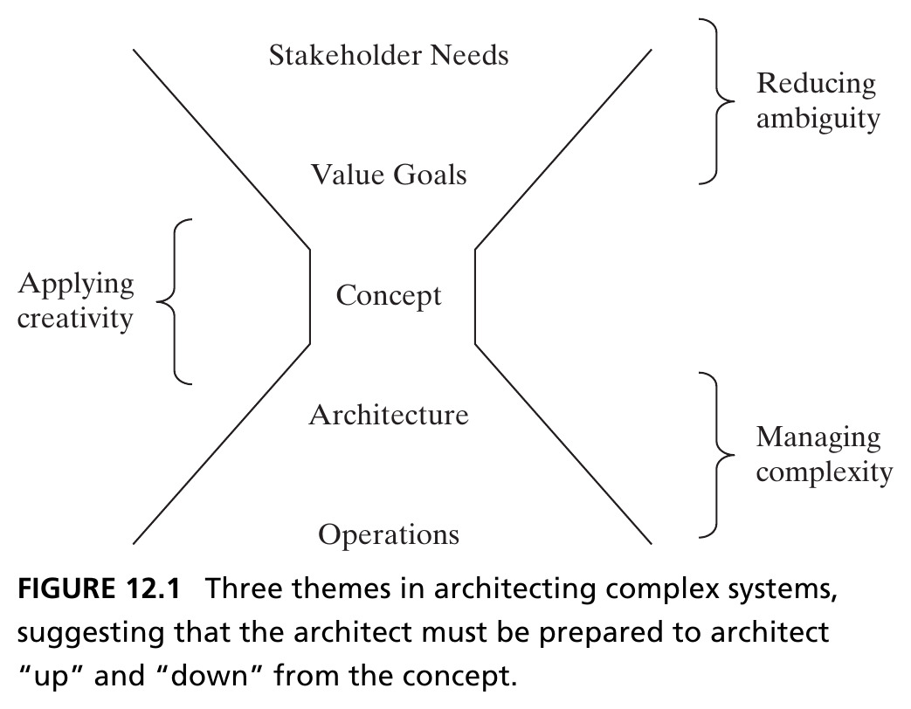{height=400px fig-align="center"}

::: {.side-caption}
Concept sits at the center: stakeholder needs and value goals flow down into it (reducing ambiguity); architecture and operations flow out of it (managing complexity); creativity is applied at the concept itself. Source: Crawley, Cameron & Selva (2016), Fig. 12.1.
:::

::: {.notes}
Walk through this diagram as the visual anchor for the whole book's Part 3 structure, not just this chapter. Concept sits literally in the middle. Above it: stakeholder needs and value goals flow down into the concept — this is the "reducing ambiguity" work of Chapters 9 through 11. Below it: architecture and operations flow out from the concept — this is the "managing complexity" work that Chapter 13 (immediately following this one) takes up. And bracketed at concept itself: applying creativity — exactly this chapter's contribution, sitting at the hinge between the two other themes.

Make the point explicit: this single figure is effectively a table of contents for Part 3 of the book (reducing ambiguity, applying creativity, managing complexity), with concept as the connective tissue linking all three. It's worth having students locate exactly where "we are" on this diagram at the start of each of the next several chapters — a repeating orientation device.
:::

# 12.2 Applying Creativity to Concept

## What Is Creativity? {.smaller}

- Creativity must result in a **novel** output — on this, most agree. Less agreement: must it be *intentional*? Must it have *influence or impact*?
- We take the position that **creativity must be intentional** — accidentally spilling paint on a canvas and discarding it isn't creative — but creativity **should not be defined by impact**, since a focus on impact too early can restrict ideation

::: {.fragment .callout-important appearance="minimal" icon=false}
In an ideal creative process, the **number of concepts under consideration should balloon** — an idea first articulated by Alex Osborn, originator of "brainstorming": *"quantity breeds quality."*
:::

::: {.notes}
This section opens by doing something the book does often: taking a genuinely contested term and staking out a precise, defensible position rather than leaving it vague. Almost everyone agrees creativity must produce something *novel* — not previously known. Where reasonable people disagree is on two further questions: must the output be *intentional*, and must it be judged by its *influence or impact*?

The book's position on intentionality, worth stating carefully: creativity must be intentional. The illustrative counter-example is memorable and worth using verbatim — someone accidentally spilling paint on a canvas and then discarding it into the trash is not being creative, even though the stain pattern is technically novel, because there was no deliberate effort behind it. Intention doesn't require a known or fully linear process — you can intend to create without knowing exactly how you'll get there — but effort has to be deliberately applied.

The book's position on impact is the more counter-intuitive one, and it's worth explaining *why*, not just stating it: creativity should *not* be defined by whether it ends up influential or impactful, because judging ideas by their eventual impact is exactly the kind of premature filtering that kills good ideation. If you require every idea generated in a brainstorm to already look impactful, you'll suppress exactly the raw, half-formed ideas that might mature into something valuable later — impact assessment is the job of the *metrics* applied afterward (Pugh matrices and similar, later in this chapter), not a gate at the ideation stage itself.

The closing fragment introduces Alex Osborn, the person who literally coined the word "brainstorming," and his core hypothesis: "quantity breeds quality." In an ideal creative process, the number of concepts under active consideration should *balloon* before it narrows — this ballooning-then-narrowing shape is exactly what the next slide's funnel diagram visualizes, and it recurs as the organizing image for the entire chapter (it reappears, quantified with real numbers, in the Figure 12.10 closing summary).
:::

## Figure 12.2 · Applying Intentional Creativity {.smaller}

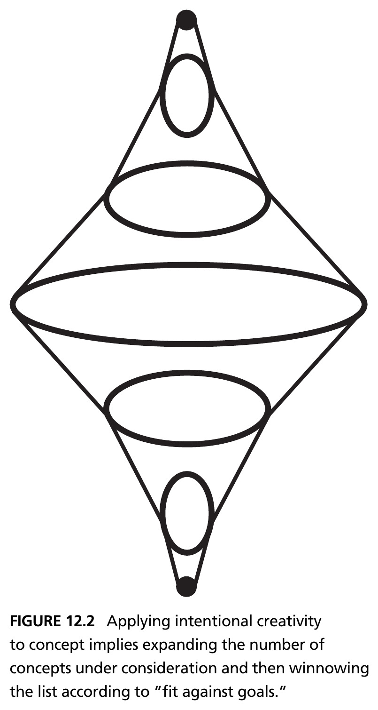{height=440px fig-align="center"}

::: {.side-caption}
Applying intentional creativity to concept means expanding the number of concepts under consideration, then winnowing the list according to "fit against goals." Source: Crawley, Cameron & Selva (2016), Fig. 12.2.
:::

::: {.notes}
This diamond shape is worth tracing with your finger on the screen as you narrate it, because its geometry *is* the argument: starting from a single point (one starting concept), the number of concepts under consideration expands outward — ballooning, exactly as Osborn's principle demanded — before narrowing back down to a small number at the bottom, winnowed according to fit against the goals established back in Chapter 11. This diamond shape recurs, quantified with real numbers at each stage, in Figure 12.10 at the very end of the chapter — it's worth telling students explicitly that we'll return to this exact picture, filled in with actual counts, once we've walked through the whole process.
:::

## Unstructured vs. Structured Creativity {.smaller}

::: {.columns}
::: {.column width="50%"}
**Unstructured Creativity**

The more prevalent approach: brainstorming, blue-sky ideas, free association. Focuses on ideating without prejudices from previous experience — forming new pathways through the concept-space (de Bono).
:::
::: {.column width="50%"}
**Structured Creativity**

Holds that problem *analysis* can help solution *synthesis*. Creative thinking is not fundamentally different from ordinary problem solving — creativity can be *stimulated* through analysis.
:::
:::

::: {.fragment .callout-tip}
Both are necessary. Our view of system architecture more closely reflects structured creativity — we'd rather succeed with an architecture that's *chosen*, not one arrived at by luck.
:::

::: {.notes}
Give students the two broad schools of thought on ideation, since the rest of the chapter's tools sort cleanly into one or the other. Unstructured creativity is the more prevalent, familiar approach — brainstorming, blue-sky ideation, free association — and it's rooted in a notion of *unconscious* processing: an "Aha!" moment that seems to arise out of nowhere. Edward de Bono, cited here, argued the mind is physically constrained by existing channels of thought, so the purpose of unstructured techniques is specifically to force new pathways through the concept-space — his own techniques include things like opening a book to a random page, blindly pointing at a word, and then forcing a connection between that word and the problem at hand. It's worth being honest with students, matching the book's own framing: some people hold that creativity is *by definition* unconscious and must occur without warning — if the process is knowable or plannable, on this view, it isn't really creative. The book finds this a feasible but "somewhat counterproductive" standard, since it holds creativity to an ideal it can't be deliberately encouraged toward.

Structured creativity takes the opposite starting assumption: that analyzing the *problem* can genuinely help synthesize the *solution*, and that creative thinking isn't fundamentally different in kind from ordinary problem-solving — it can be *stimulated* by structured analysis rather than only awaited passively. History has a long list of famous "creative thinkers" (Einstein, Picasso, da Vinci, Maya Angelou are the book's examples) characterized by unusually strong divergent thinking — the counterpoint view is that this capacity can, to some extent, be built through structure and analysis rather than being purely innate or unconscious.

The closing fragment states the book's own considered position plainly, and it's worth repeating to students since it explains the shape of the rest of this chapter: both approaches are genuinely necessary, but the book's own view of system architecture leans more toward structured creativity — we would rather succeed with an architecture that was deliberately *chosen* through some traceable reasoning, than one that was arrived at purely by luck. This is exactly the same sentiment as the "structured creativity is better than unstructured creativity" assertion from Chapter 1, now given its full methodological grounding.
:::

## Figure 12.3 · Component Recombination {.smaller}

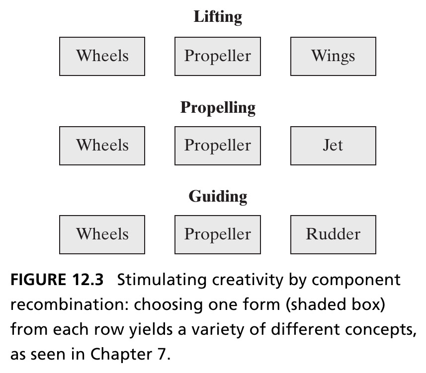{height=420px fig-align="center"}

::: {.side-caption}
A frequent theme in structured creativity: decompose the problem into pieces (here, the transporting concept's three internal functions), with more than one form-choice available per piece — choosing one option per row (shaded) yields distinct concepts, as in Ch. 7's morphological matrix. Source: Crawley, Cameron & Selva (2016), Fig. 12.3.
:::

::: {.notes}
This is the first concrete structured-creativity technique: component recombination. Walk through the diagram's own example: transporting decomposes into three internal functions — lifting, propelling, and guiding — and for each of those three functions, more than one form-choice is available (wheels, propeller, or something else per row). A concept is synthesized by selecting one choice per row; different row-selections yield genuinely different concepts. The diagram is deliberately vague about whether these pieces are form–function assignments or specific functions for a given solution-neutral function — that ambiguity is intentional, because the same recombination logic applies either way.

Make the connection to Chapter 7 explicit and specific: this is exactly the same logic as the morphological matrix introduced there — recall that choosing a propeller to perform all three of lifting, propelling, and guiding produced the concept of a helicopter. This same combinatorial idea is encoded not just here but also in the decision-support tools of Chapter 14 later in the course — component recombination is a genuinely recurring technique, not a one-off trick specific to this chapter.
:::

## Completeness Frameworks and TRIZ {.smaller}

- **Completeness frameworks** use lists to stimulate ideation — e.g., cataloging forms of energy (linear kinetic, rotational kinetic, potential, chemical...) and asking what a concept using *each* would look like
- De Bono's **Six Hats** is a team-based completeness framework: six roles (Managing, Information, Emotions, Discernment, Optimistic Response, Creativity) that force a more holistic evaluation of a problem
- **TRIZ** (Theory of Inventive Problem Solving), developed by Genrich Altshuller from 40,000 patent abstracts, resolves apparent contradictions (*"a faster train needs a more powerful engine, but a more powerful engine is heavier"*) using 40 inventive principles — e.g., **Mechanics Substitution**: replace a mechanical means with an optical, acoustic, magnetic, or electromagnetic one

::: {.notes}
Introduce a second family of structured-creativity techniques: completeness frameworks, which use pre-built lists to systematically stimulate ideation, rather than recombining existing decomposed pieces. The energy-forms example is a clean illustration: build a checklist of the known forms of energy — linear kinetic, rotational kinetic, potential, chemical, and so on — and for each entry on that list, deliberately ask "what would a concept using *this* form of energy look like for my problem?" This forces coverage of options a purely free-associative brainstorm might never reach. It's worth noting concretely, since it makes the technique less abstract: many modern hybrid cars store energy using batteries (chemical), but concepts using rotational kinetic energy exist too — the flywheel used in Porsche's GT3RS hybrid and in the 2009 Williams Formula 1 car are real examples of exactly this alternative being explored.

De Bono's Six Hats is a more abstract, team-based version of the same completeness idea: rather than a list of physical categories, it defines six distinct *roles* team members can deliberately adopt during a working session — Managing, Information, Emotions, Discernment, Optimistic Response, and Creativity. The underlying theory is that deliberately cycling a team through different modes of reasoning produces a more holistic evaluation of a problem than letting everyone reason the same way simultaneously. Be honest with students, echoing the book's own caveat: these six categories aren't proven to be orthogonal from a rigorous brain-and-cognitive-science perspective — but they're still a useful, practical decomposition of team roles for working groups.

TRIZ deserves the most time of the three, since it's the most fully developed and has real engineering pedigree. Give the origin story precisely: TRIZ (Theory of Inventive Problem Solving) was developed by Genrich Altshuller, working in the Soviet Navy, who reviewed roughly 40,000 patent abstracts to extract 40 general principles of invention. TRIZ's starting move is distinctive: it begins by naming apparent *contradictions* — the book's example is vivid and worth using verbatim: "a faster train requires a more powerful engine, but a more powerful engine is heavier" (thus eating into the very acceleration gains you wanted from the extra power). TRIZ's 40 inventive principles are then used to resolve exactly this kind of contradiction. Walk through the specific example given — Mechanics Substitution — one of these 40 principles: replace a purely mechanical means of interacting with something using a sensory means instead (optical, acoustic, magnetic, or electromagnetic fields). This might lead a designer from a diesel locomotive concept toward an electric locomotive or a linear induction motor. Flag the important caveat the book states explicitly: the principles don't guarantee the resulting system has the same weight or any other specific property — they only provide a *concept* for the new system, a direction to explore, not a guaranteed optimized outcome.
:::

## Identifying Concept {.smaller}

- Recall from Chapter 7: concept is a vision, idea, notion, or mental image that maps function to form — it embodies a principle of function and operation, and includes an abstraction of form
- Creating the concept is a moment of **peak creativity** — the selection of concept has a deep, far-reaching impact, and establishes the solution-specific vocabulary
- *"The concept rationalizes the structure of the architecture."* — Steve Imrich. Concept is **not** a product attribute; it is a mapping from one attribute (function) to another (form) — separate from, and prior to, the architecture itself

::: {.notes}
This slide is a deliberate callback-and-consolidate moment before the chapter turns to its practical four-step framework. Restate the Chapter 7 definition of concept precisely, since everything downstream depends on precision here: concept is a vision, idea, notion, or mental image that maps function to form — it embodies a principle of function and operation, and it includes an abstraction of form (not full detailed form, just enough abstraction to convey the principle).

Emphasize why this particular moment in the process gets singled out as "peak creativity": once a concept is selected, its impact is deep and far-reaching — it establishes the entire solution-specific vocabulary that every downstream team will use, exactly the same "decisions cascade" idea from Chapter 1's engine-mounting example, now applied specifically to concept selection.

The Steve Imrich quote — a civil architect, worth noting the domain-crossing citation, since this book draws architecture wisdom from outside engineering deliberately — captures something important: "the concept rationalizes the structure of the architecture." Unpack what "rationalizes" means here: the concept gives the eventual architecture its underlying logic, the reason its structure is organized the way it is, rather than some other way. And the final, precise point, worth stating carefully because it's easy to get backwards: concept is *not* itself a product attribute (it's not a property of the finished thing) — it is a *mapping* from one attribute (function) to another attribute (form). Concept is genuinely separate from, and logically prior to, the architecture itself; architecture comes after concept and builds on top of it.
:::

## Figure 12.4 · Representation of Concept {.smaller}

::: {.columns}
::: {.column width="55%"}
- Concept sits along a diagonal between pure function and pure form — neither fully abstract nor fully concrete
- In Chapter 11 we analyzed concepts in OPM, completing the To-By-Using framework
- For complex systems, OPM may only work at the first level — domain-specific language and methods quickly become necessary
:::
::: {.column width="45%"}
```{=html}
<div style="border:2px solid #333; padding:1.5rem; text-align:center; margin-top:1rem;">
  <div style="font-size:0.85em; color:#555;">Form</div>
  <div style="font-size:2.5em; margin:0.3rem 0;">↗</div>
  <div style="font-weight:bold;">Concept</div>
  <div style="font-size:0.85em; color:#555; margin-top:0.3rem;">Function</div>
</div>
```
:::
:::

::: {.notes}
Explain the diagonal-arrow diagram precisely, since it's a compact but genuinely informative visual claim: concept sits along a diagonal running from pure function (bottom) to pure form (top) — it is deliberately *neither* fully abstract (pure function, with no form implied at all) *nor* fully concrete (pure form, fully detailed with no functional reasoning left). This positions concept exactly where the Steve Imrich quote from the previous slide located it: a genuine bridge between the two.

Connect back to Chapter 11's method directly: there, we used OPM to analyze concepts, completing the To-By-Using framework (To — the value delivered; By — the process; Using — the instrument/form) by representing it formally in OPM notation. The third bullet is an important scope-setting caveat worth stating clearly, and it ties into the course's own established policy on representation tools: for genuinely complex systems, OPM may only remain tractable at the very first level of the concept — beyond that, domain-specific language and specialized methods become necessary quickly, since no single general-purpose notation can carry all the detail a complex concept eventually requires. This is a good moment to remind students that this course uses OPM as its primary tool, understanding that real, complex engineering problems will eventually need to supplement it with domain expertise.
:::

## A Four-Step Concept Framework {.smaller}

::: {.callout-note appearance="simple" icon=false}
**1. Develop the Concepts** — start with the SPS and goals; identify solution-neutral operands/processes; apply creativity to specialize a specific operand/process/instrument; check against goals.
:::
::: {.callout-note appearance="simple" icon=false}
**2. Expand and Develop Concept Fragments** — decompose rich, multifunctional concepts to reveal internal functions; repeat Step 1 for each fragment.
:::
::: {.callout-note appearance="simple" icon=false}
**3. Evolve and Refine Integrated Concepts** — search systematically through fragments; combine combinatorially, with constraints.
:::
::: {.callout-note appearance="simple" icon=false}
**4. Select a Few Integrated Concepts** — apply backward (fit to goals) and forward (potential for good architecture) considerations.
:::

::: {.notes}
This four-step framework is the chapter's central organizing structure — everything from here to the end of Section 12.6 is essentially a detailed worked example of these four steps, applied to the Hybrid Car. Introduce all four up front as a roadmap before diving into each one in turn.

Step 1, Develop the Concepts: start from the system problem statement (SPS) and the descriptive goals already established (in Chapter 11); identify the solution-neutral operands and processes those goals imply; then apply creativity to specialize a *specific* operand/process/instrument concept from that solution-neutral starting point; finally check that the resulting concept still meets the SPS's goals, reformulating the solution-neutral statement if it doesn't.

Step 2, Expand and Develop Concept Fragments: for concepts that are rich and multifunctional (meaning they bundle together several distinct internal functions), decompose or expand the concept to reveal those principal internal functions or expanded operands/processes/instruments — then, critically, repeat Step 1's exact same procedure for each resulting fragment individually.

Step 3, Evolve and Refine Integrated Concepts: having generated many individual fragments, search systematically through the space of concepts and fragments to ensure real coverage, then combine those fragments combinatorially — subject to real-world constraints — to produce integrated, whole concepts again.

Step 4, Select a Few Integrated Concepts: apply two kinds of consideration to narrow the resulting (likely large) set back down — a *backward* consideration (what's most likely to satisfy the established goals) and a *forward* consideration (what's most likely to lead to a good, elegant architecture down the line) — checking, once again, that whatever survives still meets the SPS and its descriptive goals.

Point out explicitly that steps 1 and 2 are the "ballooning" half of the diamond from Figure 12.2, and steps 3 and 4 are the "narrowing" half — this framework is the diamond shape, operationalized into four concrete, repeatable steps.
:::

## Box 12.1 · Principle of Creativity {.smaller}

::: {.callout-note appearance="simple" icon=false}
*"Imagination is more important than knowledge."* — Albert Einstein

*"Creativity is bred by creating a gap between current reality and the vision for the system."* — Peter Senge
:::

- For any interesting, real problem, there will be essential **tensions** among the goals — creativity in architecture is the process of resolving these tensions
- To maximize the possibility of creativity: treat all goals as tradable, remove organizational/cultural barriers, and consider the entire space of possibility
- *"Creativity is like driving a car at night. You never see further than your headlights, but you can make the whole trip that way."* — E.L. Doctorow

::: {.notes}
Walk through this Principle carefully, since it reframes what "creativity in architecture" actually means in a way worth making explicit. The book's central claim: for any genuinely interesting, real engineering problem, there will be essential *tensions* among the goals — goals that pull the design in different directions (fuel efficiency versus power, cost versus capability, and so on, all familiar from the Hybrid Car's own goal-setting in Chapter 11). Creativity in architecture, on this view, is specifically the process of *resolving* these tensions — not generating ideas in a vacuum, but generating ideas that reconcile genuine, competing pulls.

Give the three concrete practices the book recommends for maximizing the possibility of creativity, since these are actionable, not just inspirational: treat all goals as tradable (don't fossilize any single goal as untouchable before you've explored the possibility space); remove organizational and cultural barriers that might be suppressing certain kinds of ideas before they're even voiced; and deliberately consider the *entire* space of possibility, rather than anchoring early on a familiar or comfortable subset of it.

The two quotes bookending the slide reinforce this same idea from different angles — Einstein's is the more famous, general statement about imagination exceeding known facts. The closing Doctorow quote deserves particular attention because it's a genuinely useful mental model to leave students with: creativity is like driving a car at night — you never see further ahead than your headlights illuminate, but you can still make the entire trip that way, incrementally, trusting each next visible step even without seeing the whole road at once. This is a comforting, practical reframe for students who feel like they need to see the "whole solution" before starting to generate concepts — you don't; you only need to see as far as your current headlights reach.
:::

## Section 12.2 Summary {.smaller}

- Creativity must be intentional, but should not be judged by impact during ideation — that comes later, from metrics
- Unstructured creativity (brainstorming) and structured creativity (component recombination, completeness frameworks, TRIZ) are complementary, not competing, approaches
- Concept is a *mapping* from function to form, developed through a four-step framework: develop, expand into fragments, evolve/refine integrated concepts, and select a few for further development

::: {.notes}
Use this as a checkpoint before the chapter shifts from general theory (Section 12.2) into the fully worked Hybrid Car example (Sections 12.3 through 12.6). By this point students should be able to state: creativity must be intentional but shouldn't be judged by impact during ideation itself (that judgment is deferred to metrics applied afterward); unstructured and structured creativity are complementary tools, not rival philosophies, even though this course's own treatment of architecture leans structured; and concept is precisely a mapping from function to form, generated through the four-step framework just introduced (develop, expand into fragments, evolve/refine integrated concepts, select a few). Everything from here forward is that same four-step framework, applied in full, concrete detail to one real running example — the Hybrid Car.
:::

# 12.3–12.5 Developing the Hybrid Car Concept

## Step 1: Develop the Concept {.smaller}

Recall the Hybrid Car's system problem statement from Chapter 11:

::: {.callout-note appearance="simple" icon=false}
Provide our customers a product **to** transport them and their possessions inexpensively and in an environmentally sound manner, **by** allowing them to drive themselves, their passengers, and light cargo fuel-efficiently and with good handling characteristics, **using** a hybrid gas/electric car.
:::

- The word "hybrid" is itself a short form — it suppresses *which* two energy poles are combined. Historically, there was even a time when "hybrid" commonly meant hybrid **steam/gas**, not gas/electric

::: {.notes}
Begin the fully worked example by re-grounding students in exactly where the Hybrid Car's system problem statement came from: this is the same To-By-Using statement developed in Chapter 11's stakeholder and goal analysis, carried forward unchanged into this chapter as the starting point for concept generation. Read it aloud slowly, pointing out the three parts explicitly: To (transport customers inexpensively and in an environmentally sound manner) — the value delivered; By (allowing them to drive themselves, their passengers, and light cargo, fuel-efficiently and with good handling) — the process; Using (a hybrid gas/electric car) — the instrument/form, already partially specialized.

The last bullet is a genuinely important and slightly surprising historical point, worth pausing on, since it previews the chapter's closing case study. "Hybrid" is doing a lot of hidden work in that system problem statement — it's a short form that suppresses exactly *which* two energy poles are being combined. Point out explicitly: today, everyone assumes "hybrid car" means gasoline plus electric — but historically, there was a real period when "hybrid" commonly referred to hybrid *steam*/gas vehicles instead, not gas/electric at all. This is a deliberate seed the book plants here, which pays off fully in the case study at the very end of the chapter on early architectural competition among electric, steam, and internal-combustion cars.
:::

## Step 2: Expand the Concept — Propulsion {.smaller}

- "Driving" is a concept rich in meaning — we decompose it into fragments, beginning with **propulsion**
- Three overarching vehicle classifications, based on how many external energy sources the propulsion system depends on:

::: {.columns}
::: {.column width="33%"}
**Monovalent**

One external energy source (most cars today, including simple hybrids with one fuel source)
:::
::: {.column width="33%"}
**Bivalent**

Two external energy sources (e.g., a plug-in hybrid: electricity *and* fuel)
:::
::: {.column width="33%"}
**Multivalent**

Three or more (e.g., the Fiat Siena Tetrafuel: gasoline, ethanol blends, or CNG)
:::
:::

::: {.notes}
This slide is Step 2 of the four-step framework (expand and develop concept fragments) applied for the first time. "Driving" was identified in Step 1 as the specific process in the Hybrid Car's system problem statement, and the book flags it explicitly as a concept "rich in meaning" — meaning it's not a single atomic function but bundles together several distinct internal functions, exactly the trigger condition Step 2 calls for. We begin decomposing "driving" into fragments, and the first fragment tackled is propulsion.

Walk through the three-way classification of propulsion architectures carefully, since it's based on a single clean criterion — the number of distinct *external* energy sources the propulsion system depends on. Monovalent architectures depend on just one external energy source: most cars today are monovalent, including simple hybrids that still ultimately depend on only one external fuel source (gasoline), even though they have an internal high-voltage battery as a secondary internal store. Bivalent architectures depend on two external energy sources — the clean example is a plug-in hybrid electric vehicle, where both electricity (from the grid) and fuel (gasoline) are separately supplied from outside the vehicle. Multivalent architectures depend on three or more — the book's example is the Fiat Siena Tetrafuel, a real production vehicle designed to run on gasoline, E20-to-E25 ethanol blends, pure ethanol (E100), or compressed natural gas as a bi-fuel option. This classification is going to matter directly a few slides later, when we return to ask which of these categories our own Hybrid Car concept should specialize into.
:::

## Figure 12.5 · Four Vehicle-Moving Concepts {.smaller}

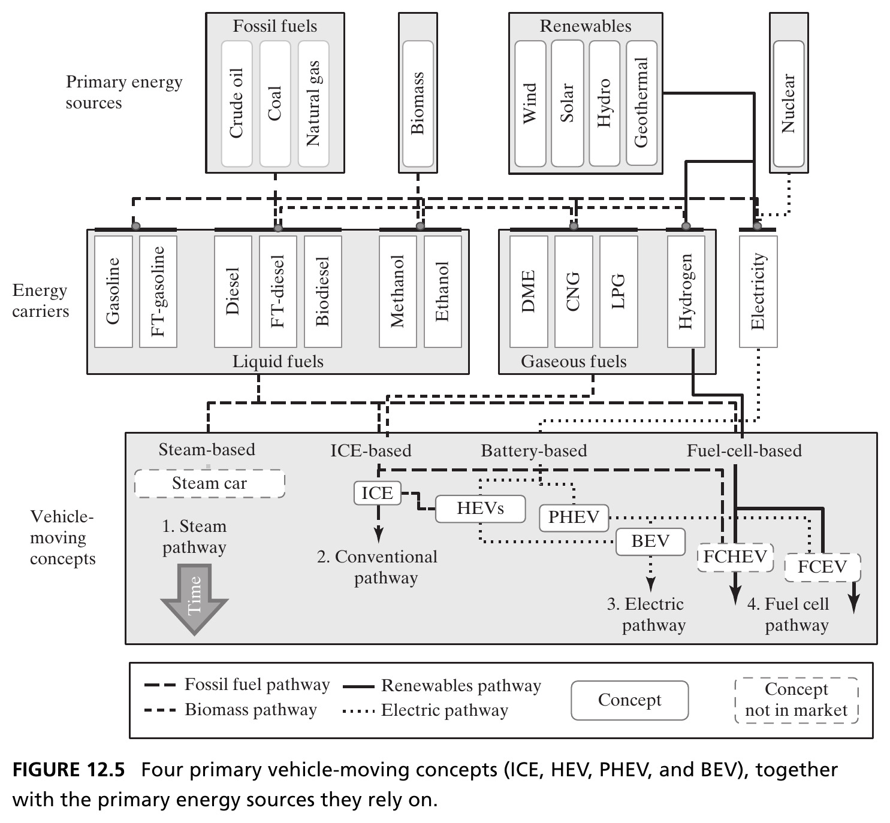{height=440px fig-align="center"}

::: {.side-caption}
Four energy-carrying/storage pathways: **steam** (1790–1906, no successful modern commercialization), **ICE** (dominant today), **battery-based** (HEV → PHEV → BEV), and **fuel-cell-based** — each drawing on different primary energy sources and carriers. Source: Crawley, Cameron & Selva (2016), Fig. 12.5.
:::

::: {.notes}
This is a genuinely dense, information-rich diagram, worth spending real time on rather than rushing past. Trace the flow left to right: primary energy sources (fossil fuels — crude oil, coal, natural gas; biomass; renewables — wind, solar, hydro, geothermal; and nuclear) feed into energy carriers (liquid fuels like gasoline and diesel, or gaseous fuels like CNG and hydrogen, or electricity), which in turn feed into four distinct vehicle-moving pathways: the steam pathway, the conventional ICE pathway, the electric pathway (spanning HEV through PHEV to BEV), and the fuel-cell pathway.

Point out the historical framing explicitly, since it directly sets up the chapter's closing case study: the steam pathway dominated roughly 1790 to 1906 and has seen no successful large-scale commercialization since — flag that we'll return to exactly why steam lost out, in detail, at the end of the chapter. The conventional ICE pathway is described here as dominant today. The battery-based pathway is presented as a spectrum, not a single point — HEV (hybrid electric, small assist), progressing toward PHEV (plug-in, externally chargeable), progressing toward BEV (battery electric, no combustion engine at all). And the fuel-cell pathway is presented as a fourth, distinct option, converting fuel chemically into electricity to power electric motors, rather than burning it directly.

The point of showing all four pathways together, worth stating explicitly: this is the "energy carrying/storage" fragment of the driving concept, decomposed and expanded per Step 2 of the framework — parallel to, but a separate fragment from, the propulsion-architecture classification (monovalent/bivalent/multivalent) from the previous slide. Both are fragments of "driving," expanded independently.
:::

## Seven Additional Concept Fragments {.smaller}

Beyond propulsion, seven internal functions capture the value added by hybrid systems:

::: {.columns}
::: {.column width="50%"}
1. **Motor start-stop** — shut off the engine at rest, restart on demand
2. **Regenerative braking** — capture braking energy that would otherwise be lost to friction/heat
3. **Power boost** — electric motor adds torque beyond what the engine alone delivers
4. **Load level increase** — engine drives a generator to recharge the battery
:::
::: {.column width="50%"}
5. **Electric driving** — propel using only stored electric energy, engine decoupled
6. **External battery charging** — plug into the grid (differentiates PHEVs from other HEVs)
7. **Gliding** — decouple both engine and electric system, coast on gravity alone
:::
:::

::: {.notes}
This slide catalogs the remaining seven concept fragments of "driving" that specifically capture the value hybrid systems add beyond a conventional ICE car — worth walking through each briefly with a bit more texture than the slide's one-line summaries allow, since these seven get directly reused a few slides later to build the integrated vehicle concepts.

Motor start-stop: as soon as the hybrid control system senses the vehicle will come to a complete stop (say, at a traffic light), the engine shuts off and is prevented from idling; it's restarted via an electrical motor or starter-generator as soon as power is needed again — in micro-hybrid systems without electric-driving capability, this restart has to happen in well under a second, typically triggered by the driver releasing the brake or depressing the clutch. Regenerative braking: braking energy that would normally be lost to friction and heat in a conventional car is instead captured by running the electric traction motor in a generative mode, storing the recovered energy directly in the high-voltage battery. Power boost: when the driver demands more acceleration than the combustion engine alone can deliver — including on inclines or while towing — the electric motor supplies additional torque; this is especially effective accelerating from rest, since electric motors deliver peak torque at zero RPM, precisely where combustion engines are weakest (Figure 12.7 shows this explicitly). Load level increase: the engine can deliberately run a generator to recharge the battery, shifting its own operating point to a more efficient region of its performance map when there's excess power capacity available.

Electric driving: using only stored electric energy from the high-voltage battery to power the traction motor, with the combustion engine fully decoupled (shut off or, alternatively, used to generate electricity rather than propel the vehicle directly) — this mode is fundamentally limited by how much energy the battery can store. External battery charging: the feature that specifically differentiates plug-in hybrids from every other hybrid type — a charging unit is added so the battery can be replenished from an external electrical grid, rather than solely from onboard regenerative braking and engine-driven charging; note that connecting a fleet of these vehicles to the electrical grid also opens interesting possibilities for nighttime charging and even vehicle-to-grid power flow. Gliding: somewhat trivial in concept but genuinely useful in a control strategy — decoupling *both* the engine and the electric system from the wheels and coasting purely on gravity, avoiding all powertrain friction losses; conventional cars can do this simply by shifting to neutral downhill, but hybrids need the ability to rapidly reconnect the appropriate powertrain the moment driving conditions change.
:::

## Figure 12.6 · Fuel Savings from Start-Stop and Braking {.smaller}

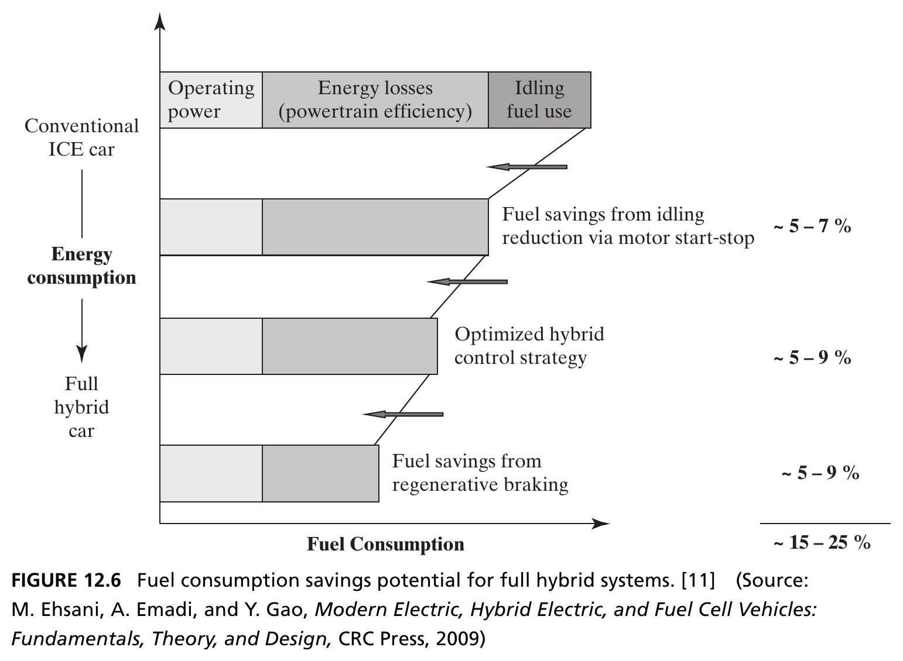{height=440px fig-align="center"}

::: {.side-caption}
Idling reduction via motor start-stop saves ~5–7%; an optimized hybrid control strategy (combining load level increase, boosting, electric driving, gliding) saves a further ~5–9%; regenerative braking saves another ~5–9% — totaling ~15–25%. Source: Crawley, Cameron & Selva (2016), Fig. 12.6, after Ehsani, Emadi & Gao (2009).
:::

::: {.notes}
Walk through this chart's stacked structure carefully, since the numbers here quantify exactly what all those concept fragments are worth, which makes the abstract discussion concrete. Starting from a conventional ICE car's fuel consumption as the baseline, motor start-stop alone — simply eliminating idling — saves roughly 5 to 7% during city driving conditions. Layering on an optimized hybrid control strategy that intelligently combines load level increase, power boosting, electric driving, and gliding together (note: not itemized separately in this chart, but combined as one bundled control-strategy improvement) saves a further 5 to 9%. And regenerative braking, layered on top of both, saves another 5 to 9%. Add all three together and you get a combined savings of roughly 15 to 25% relative to the conventional baseline — a genuinely substantial improvement, and worth pointing out explicitly why this matters for our concept-selection process later: these numbers give real, quantified backward-considerations we can use when comparing candidate integrated concepts against the fuel-efficiency goal from Chapter 11.

Point out one subtlety directly from the book's own caveat: of the seven concept fragments discussed, external battery charging is notably absent from this figure, because unlike the other six, it adds energy to the system from *outside* the vehicle's nominal operation — it's not a way of using onboard energy more cleverly, it's an entirely separate energy input. These percentages, in other words, represent full hybrid powertrains with limited (non-plug-in) electric driving, and specifically do not represent plug-in hybrid systems, which can replace a much larger share of fuel consumption by design.
:::

## Figure 12.7 · Why Boosting Helps at Low Speed {.smaller}

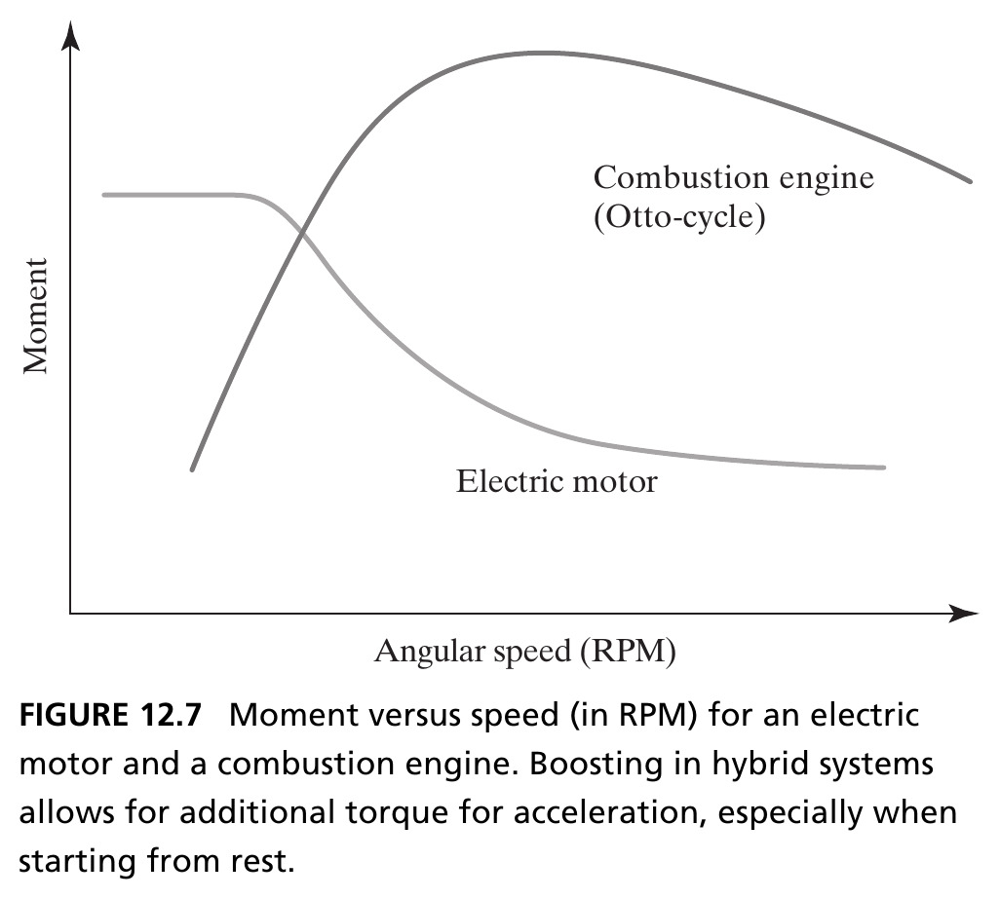{height=420px fig-align="center"}

::: {.side-caption}
The electric motor delivers its highest torque starting from rest and low RPM — exactly where a combustion engine is weakest. Boosting lets the electric motor supply torque during the acceleration phase the engine handles worst. Source: Crawley, Cameron & Selva (2016), Fig. 12.7.
:::

::: {.notes}
This chart gives the physical, engineering reason *why* the power-boost fragment is effective, rather than just asserting that it is. Trace the two curves: the electric motor's torque (moment) curve is essentially flat and high starting right from zero RPM, then tapers off at higher speeds. The typical Otto-cycle combustion engine's curve does the opposite — it starts relatively low at rest and low RPM, and only reaches its peak torque output at higher RPM (roughly 2000 to 2500 RPM in a typical case).

The complementary shape of these two curves is the entire point: exactly where the combustion engine is weakest — starting from rest and accelerating through low RPM — is exactly where the electric motor is strongest. So in a typical hybrid car, boosting is particularly effective for improving 0-to-100-km/h (0-to-60-mph) acceleration specifically, because the resulting system performance is enhanced by initially using the electric motor's torque advantage from rest, then letting the combustion engine take over once it reaches its own more favorable operating range. This is a nice concrete example of "emergence depends on structure" from Chapter 2, now applied to powertrain engineering — neither motor's curve alone is as good as the *combination*, precisely because their weaknesses and strengths are complementary rather than overlapping.
:::

## Step 3: Evolve and Refine Integrated Concepts {.smaller}

- The third step searches the space of concept fragments **systematically**, organized by the possible mappings between functions and forms
- Key question: is the **energy storage function** an input to the **vehicle-moving function** (a shared form — *parallel hybrid*), or do they use separate forms (*series hybrid*)?

::: {.fragment .callout-tip}
Vehicles that mix both modes are **combined hybrid systems** — they may split fuel-converter energy across series and parallel paths simultaneously (power-split hybrids), or switch between the two.
:::

::: {.notes}
This slide moves the worked example into Step 3 of the framework: evolve and refine integrated concepts, searching systematically through the fragments generated in Step 2. The book is candid that a full combinatorial search across all these fragments is excerpted for brevity here — computational, exhaustive methods for this kind of search are deferred to Part 4 of the book, later in the course. Instead, the chapter organizes the search analytically, around the two primary internal functions identified in Figure 12.5: energy storage and vehicle moving (the powertrain).

The key architectural question this slide poses, worth stating precisely since it's the crux of the whole hybrid-taxonomy discussion that follows: is the energy-storage function an *input* to the vehicle-moving function — meaning the two functions share a common form, an *additive* combination — or do energy storage and vehicle-moving decompose into genuinely *separate* forms? The first case is called a parallel hybrid: both the fuel-based converter and the electric converter feed directly and additively into the same energy load. The second case is a series hybrid: the fuel-based system works *sequentially*, only ever recharging the electric system, which alone actually drives the load — the fuel converter never directly propels the wheels.

The closing fragment adds a third, more sophisticated category worth walking through: vehicles that genuinely *mix* features of both parallel and series operation are called combined hybrid systems. These might split the fuel converter's energy across both the series and parallel paths *simultaneously* (called power-split hybrids), or instead have a distinct switch that allows the vehicle to operate in only-parallel mode or only-series mode at any given time, but not both simultaneously. This taxonomy — parallel, series, combined — is exactly what the next figure visualizes directly.
:::

## Figure 12.8 · Parallel vs. Series Hybrid Drive {.smaller}

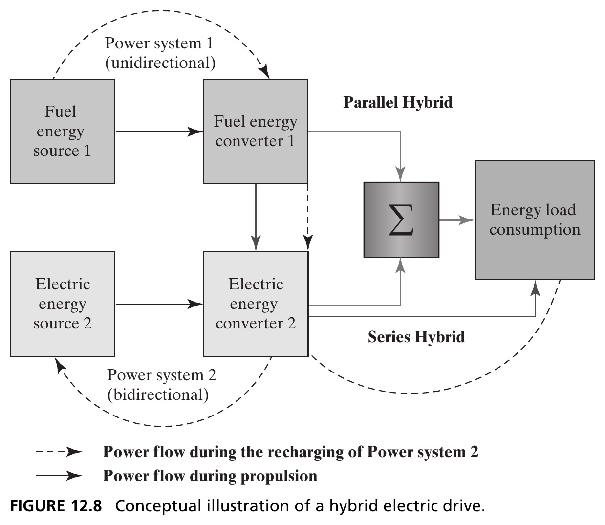{height=440px fig-align="center"}

::: {.side-caption}
**Parallel hybrid**: both fuel and electric converters feed the summing energy load *additively*. **Series hybrid**: the fuel-based system runs *sequentially* — it only recharges the electric system, which alone drives the load. Source: Crawley, Cameron & Selva (2016), Fig. 12.8.
:::

::: {.notes}
Walk through this schematic carefully, since it makes the previous slide's abstract parallel-versus-series distinction fully concrete and visual. In the parallel-hybrid path (top), the fuel energy source feeds a fuel energy converter, and the electric energy source feeds an electric energy converter — and critically, *both* converters feed directly into the same summing junction (the sigma symbol), which supplies the energy load. Both power flows are additive and simultaneous.

In the series-hybrid path (bottom, shown with dashed lines for the recharging flow), the fuel energy converter output does *not* go directly to the load — instead it recharges the electric energy converter (essentially, the battery, via power system 2, marked bidirectional), and only the electric converter ever supplies the actual energy load. The fuel-based system's role is entirely sequential and indirect: convert fuel to electricity first, then use that electricity to drive the load — there's no direct mechanical or electrical path from the fuel converter straight to propulsion.

Have students trace both power-flow paths with their eyes directly on this diagram before moving on — solid arrows for power flow during propulsion, dashed arrows specifically for power flow during the recharging of power system 2. This distinction (additive/simultaneous vs. sequential/indirect) is the single most important engineering fact underlying the whole taxonomy of hybrid vehicle types that follows in the next couple of slides.
:::

## Figure 12.9 · The HEV Conceptual Solution Space {.smaller}

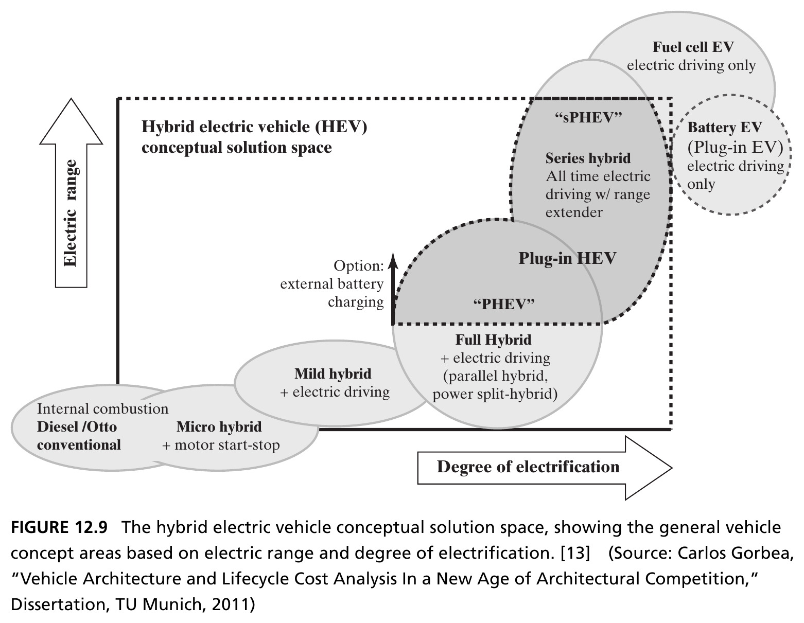{height=440px fig-align="center"}

::: {.side-caption}
Two dimensions organize the space: **electric range** and **degree of electrification** (ratio of peak electric motor power to maximum combined power). Seven integrated concepts populate this space — from conventional ICE (0,0) to battery EV (degree = 1). Source: Crawley, Cameron & Selva (2016), Fig. 12.9, after Gorbea (2011).
:::

::: {.notes}
This diagram is the payoff of Step 3 fully realized: a genuine two-dimensional conceptual solution space, built by combining the energy-storage/vehicle-moving fragments (parallel/series/combined, from the last two slides) with the seven additional concept fragments (start-stop, regenerative braking, and so on) from a few slides back. Define both axes precisely, since students will need them for the upcoming taxonomy. The horizontal axis is degree of electrification: formally, the ratio of cumulative peak electric-motor power to maximum combined electric-plus-engine power — a degree of zero means a purely conventional internal combustion car with no electrical propulsion system at all, and a degree of one means a purely battery-electric vehicle with no internal combustion engine installed whatsoever. The vertical axis is electric range: how far the vehicle can travel using its electrical propulsion system alone.

Point out where the named regions sit on this map, since the next slide walks through each of these seven integrated concepts in detail: conventional ICE and micro hybrid sit at or near the origin (essentially zero electrification, essentially zero electric range); mild hybrid sits a bit further along the electrification axis, still with minimal electric range; full hybrid occupies a region with moderate electrification and short electric range; plug-in HEV (PHEV) occupies a region with higher electrification and materially larger electric range, with an explicit option for external battery charging; series-PHEV (with a range extender) sits at especially high electrification with substantial electric range while still retaining a small combustion engine as backup; and finally the battery EV and fuel-cell EV both sit at the far edge of the space — degree of electrification equal to one, since both propel purely electrically, though they differ in how that electricity is originally produced (stored chemical battery energy versus a fuel cell converting fuel into electricity on the fly).
:::

## Seven Integrated Vehicle Concepts {.smaller}

| Concept | Degree of Electrification | Electric Range |
|---|---|---|
| Conventional ICE | 0 | none |
| Micro Hybrid | minimal | none (start-stop only) |
| Mild Hybrid | limited | short, parallel only |
| Full Hybrid | 10–30% | 500 m – 3 km |
| Plug-In Hybrid | >35% | 5–160 km |
| Battery EV (BEV) | 1 | full electric only |
| Fuel Cell EV (FCEV) | series architecture | electric only, via fuel cell |

::: {.notes}
This table gives the seven integrated concepts that populate the solution space from the previous slide, precise numbers attached — worth walking through each row briefly, since these seven are exactly what gets fed into the Pugh matrix comparison a few slides ahead. Conventional ICE: the current dominant architecture, a diesel or Otto-cycle engine, degree of electrification and electric driving range both exactly zero — no electrical propulsion system installed at all.

Micro Hybrid Electric Vehicle: achieves propulsion exclusively via the ICE but adds the motor start-stop function, typically requiring a more robust 12-to-16-volt electric battery and a more capable starter-generator than a conventional car; sometimes called "advanced ICE cars" since they're essentially conventional cars with no electric-driving capability and only minimal electrification. Mild Hybrid Electric Vehicle: differentiates itself by offering some limited electric-driving functionality (though some mild hybrids still don't offer electric-only driving), including the three key components of a real electric drive system — a high-voltage battery, an electric starter-motor for propulsion assist, and a control system coordinating when electric and combustion systems work together; mild hybrids are solely parallel systems, offering motor-assist and expanded regenerative braking on top of the micro-hybrid feature set.

Full Hybrid Electric Vehicle: displays a meaningfully larger degree of electrification (10 to 30%) than mild hybrids, with short electric-only driving distances (roughly 500 meters to 3 kilometers) — the internal combustion engine remains the primary propulsion source, but the electric system materially assists, and most full hybrids use parallel or combined configurations with full regenerative-braking capability. Plug-In Hybrid Electric Vehicle: differentiated specifically by the ability to charge the high-voltage battery externally via a charger plugged into an external energy source; PHEVs span parallel, series, and combined configurations, with degree of electrification typically above 35% and electric ranges spanning roughly 5 to 160 kilometers — the range-extender combustion engine in series plug-in hybrids can itself range from a fairly substantial ICE power system all the way down to a small "limp home" emergency engine.

Battery Electric Vehicle: falls entirely outside the conventional HEV solution space, at a degree of electrification of exactly one — no internal combustion engine is installed at all, and BEVs are plug-in vehicles by definition, since electricity is their only energy source; their electric range depends entirely on the battery capacity installed. Fuel Cell Electric Vehicle: exhibits an electrochemical cell that converts a source of fuel into electrical current directly; FCEVs are primarily configured in a series architecture, where the fuel-cell power system supplies energy to the electrical power system, which alone handles propulsion. In summary, these seven integrated concepts were generated by analytically combining the form-to-function mappings for the two primary internal functions with the seven additional concept fragments, combinatorially, giving us real coverage of the space of integrated concepts to compare in Step 4 next.
:::

## Step 4: Select Concepts with a Pugh Matrix {.smaller}

::: {.callout-note appearance="simple" icon=false}
A **Pugh matrix** rates each candidate concept against a set of criteria — here, the goals from Chapter 11 — on a five-level scale from very advantageous (**++**) to many disadvantages (**−−**), relative to a chosen reference concept.
:::

- Two screening criteria: a **backward-looking** comparison against the prioritized goals, and a **forward-looking** judgment of the concept's potential for a good, elegant architecture
- Not every goal *differentiates* — a goal met equally by every concept (like "must accommodate a driver") doesn't help choose *among* them; it belongs to detailed design more than to the concept decision

::: {.notes}
This slide begins Step 4 of the framework: selecting a few integrated concepts for further development from the seven generated in Step 3. Motivate why down-selection is necessary at all, using the book's own framing: one of the primary aims of generating multiple concepts was to make sure a real decision gets made — a decision with only one option isn't really a decision, there's nothing to weigh. But the architect's role during this phase is specifically to *preserve* options as long as reasonably possible, resisting organizational pressure to down-select to a single concept too early, since concepts at this stage typically aren't detailed enough yet to fully judge their fit against goals — hence the natural (and risky) pressure to down-select prematurely anyway.

It's worth flagging a subtlety about human judgment here, since the book raises it explicitly: research on managerial decision-making (citing Bazerman) identifies real, systematic biases relevant to concept selection — a tendency to overweight concepts that are easier to recall, concepts that come packaged with more information or apparent fidelity, concepts that confirm existing beliefs, and concepts we're already familiar with or anchored on. None of these biases are about which concept is actually *best* — they're about which concepts *feel* easiest to evaluate or most familiar, which is exactly why a structured tool like a Pugh matrix is valuable: it forces explicit, criterion-by-criterion comparison rather than an unstructured gut call.

Define the Pugh matrix precisely: a concept-comparison tool where each candidate concept is rated against a set of criteria, using a five-level scale running from very advantageous (++) through average (o) down to many disadvantages (−−) — always relative to a chosen reference concept (in the upcoming table, the full hybrid electric vehicle serves as that reference, rated "o" — average — against itself on every criterion by construction).

The two screening considerations echo Step 4's original framing from several slides back: a backward-looking comparison against the prioritized goals established in Chapter 11 (do the goals themselves have "critically," "importantly," and "desirably" priority tiers, exactly as introduced there), and a forward-looking judgment of the concept's potential to lead toward a genuinely good, elegant architecture later on. The final bullet raises an important practical filtering point worth emphasizing: not every goal actually *differentiates* among the candidate concepts. A goal like "must accommodate a driver" is very likely met equally well by every one of the seven integrated concepts — it constrains the detailed design later, but it doesn't help you *choose among* these concepts right now, so it should be set aside from this particular comparison, even though it remains a real, binding goal overall.
:::

## Table 12.1 · Comparing Vehicle Architecture Concepts {.smaller}

| Goal | ICE | Micro/Mild | HEV (ref.) | PHEV | FCEV | BEV |
|---|---|---|---|---|---|---|
| Environmental satisfaction | −− | −−/− | o | + | ++ | ++ |
| Good fuel efficiency | −− | −−/− | o | + | ++ | ++ |
| Transport range | + | + / + | o | o | — | −− |
| Modest investment, sells in volume | ++ | ++/+ | o | −− | −− | −− |
| Desirable handling | + | +/o | o | − | −− | −− |
| Inexpensive | ++ | +/+ | o | − | −− | −− |

::: {.side-caption}
Condensed from the full Pugh matrix — every "critically" goal that doesn't differentiate (regulatory compliance, driver size, passenger count) is omitted. ++ Very advantageous; + Some advantages; o Average; − Some disadvantages; −− Many disadvantages. Source: Crawley, Cameron & Selva (2016), Table 12.1.
:::

::: {.notes}
Walk through this table row by row, since it's the concrete decision-support artifact the whole chapter has been building toward. Note first, as the side-caption states, that this is a *condensed* version of the full Pugh matrix — every "critically important" goal that doesn't actually differentiate among the concepts (regulatory compliance, driver size accommodation, passenger count) has been omitted per the filtering principle from the previous slide, leaving only the goals that genuinely distinguish these seven concepts from each other.

Trace a couple of rows concretely. Environmental satisfaction and fuel efficiency move together and tell a consistent story: conventional ICE and micro/mild hybrids score poorly (−− to −), the full hybrid reference scores average by construction, and PHEV, FCEV, and BEV all score progressively better (+, ++, ++) as electrification increases — this is exactly the tradeoff the electrification spectrum was built to expose. Transport range tells the opposite story: ICE and micro/mild hybrids score well (+) precisely because they're not limited by battery capacity, while FCEV and especially BEV score poorly (− and −−) due to genuine range limitations of current battery and fuel-cell technology.

The remaining three rows — modest investment/sells in volume, desirable handling, and being inexpensive — all show the same pattern: ICE and micro/mild hybrids score very well, while PHEV, FCEV, and BEV all score poorly, reflecting the added weight, complexity, and manufacturing/commercial risk that comes with heavier electrification. This is the clearest visual demonstration in the whole chapter of the "essential tensions among goals" language from Box 12.1 — no single concept wins across the board; each one trades environmental/efficiency advantages against cost, handling, and range disadvantages, in a genuinely different balance.
:::

## Reading the Pugh Matrix {.smaller}

- The benefits of electrification: reduced tank-to-wheel emissions, better fuel consumption, an enhanced ecological image, government incentives
- The disadvantages: increased weight, reduced range, higher manufacturing costs, and commercial risk tied to servicing a first-generation high-voltage battery
- Beyond the qualitative Pugh scan, one could apply a **quantitative** comparison for the finalists — covered in Part 4

::: {.fragment .callout-tip}
A subjective down-selection according to criteria like **elegance** — is the function-to-form mapping simple and pleasing, closer to one-to-one? — is often the final step in choosing 2–3 concepts for further development.
:::

::: {.notes}
Draw out the narrative behind the numbers on the previous table, since a table of pluses and minuses is more memorable once it's tied to real underlying causes. The benefits driving the electrified concepts' good scores: reduced tank-to-wheel emissions, meaningfully better fuel consumption, an enhanced ecological brand image for the manufacturer, and often direct government financial incentives for buyers. The disadvantages driving their poor scores on the other criteria: increased vehicle weight (batteries are heavy), reduced usable range compared to a full tank of gasoline, higher manufacturing costs, and genuine commercial risk tied to servicing and warranting a first-generation high-voltage battery system, which is a newer and less-proven technology than a conventional drivetrain.

The third bullet is an important scope-setting note, worth stating clearly to preview later course content: the qualitative Pugh-matrix scan shown here is a first-pass, relatively coarse down-selection tool — once you've narrowed to a smaller set of finalist concepts, a *quantitative* comparison becomes possible and valuable, and that more rigorous, numbers-based comparison approach is exactly what Part 4 of the book (Chapters 14 through 16, later in this course) covers in depth.

The closing fragment introduces "elegance" as a genuinely useful, if inherently subjective, final screening criterion — is the mapping from function to form simple and pleasing, closer to a clean one-to-one correspondence (as in Suh's axiomatic design, referenced back in Chapter 8) rather than a tangled many-to-many mapping? This slide states plainly that this kind of subjective judgment, applied on top of the quantitative and qualitative screens, is often the actual final step used in practice to narrow a field down to the two or three concepts that get carried forward into further development — a nice bridge into Chapter 13's entire treatment of decomposition and elegant architecture.
:::

## Section 12.3–12.6 Summary {.smaller}

- The Hybrid Car concept was expanded via its propulsion fragment (monovalent/bivalent/multivalent) and seven additional internal-function fragments (start-stop, regenerative braking, boosting, load-level increase, electric driving, external charging, gliding)
- Fragments were recombined systematically along the parallel/series mapping to produce seven integrated concepts, organized by electric range and degree of electrification
- A **Pugh matrix**, screened backward against prioritized goals and forward against architectural elegance, narrows the field to a small number for further development

::: {.notes}
Use this slide as a checkpoint recapping the entire fully-worked Hybrid Car example in three sentences, tying each one back to a specific step of the four-step framework. First bullet: Step 2 (expand and develop concept fragments) — "driving" was expanded via the propulsion classification (monovalent/bivalent/multivalent) and the seven additional internal-function fragments (start-stop through gliding). Second bullet: Step 3 (evolve and refine integrated concepts) — those fragments were recombined systematically, organized specifically by the parallel-versus-series mapping question, producing the seven integrated concepts positioned in the electric-range/degree-of-electrification solution space. Third bullet: Step 4 (select a few integrated concepts) — a Pugh matrix, applying both backward (goal-fit) and forward (elegance-potential) screening, narrows the full field down to a small number of finalists for further development. This three-sentence recap is a good template for students to reuse when they apply this same four-step framework to a concept-generation exercise of their own later in the course.
:::

## Figure 12.10 · The Full Funnel {.smaller}

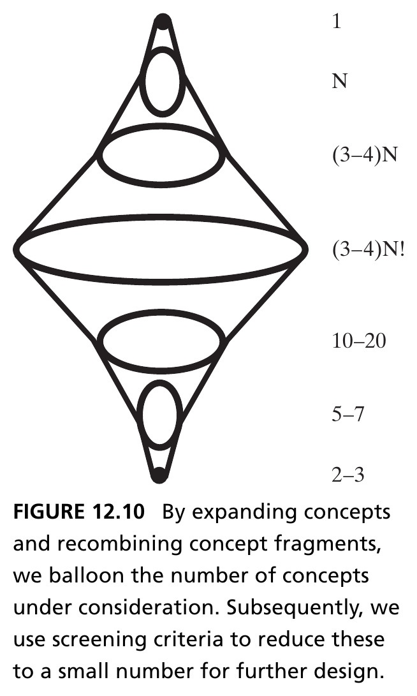{height=440px fig-align="center"}

::: {.side-caption}
1 solution-neutral function → N concepts (Step 1) → (3–4)N concept fragments (Step 2) → (3–4)N! combinatorial integrated concepts (Step 3) → 10–20 qualitative down-select → 5–7 quantitative down-select → 2–3 final concepts (Step 4). Source: Crawley, Cameron & Selva (2016), Fig. 12.10.
:::

::: {.notes}
This is the diamond from Figure 12.2, now returned to with real, quantified numbers attached at every stage — worth going through each transition slowly, since the arithmetic itself carries the chapter's argument. Starting point: exactly 1 solution-neutral function. Step 1 (develop the concepts) expands this to N distinct concepts. Step 2 (expand and develop concept fragments) expands each of those N concepts into roughly 3 to 4 internal-function fragments apiece, giving (3-to-4)×N total fragments. Step 3 (evolve and refine integrated concepts) then combines those fragments combinatorially — note the factorial, (3-to-4)N! — which is the mathematical reason the number of theoretically possible integrated concepts explodes dramatically at this stage; this is precisely why Part 4's computational, exhaustive-search methods become valuable for managing a space this large.

From that combinatorial peak, Step 4 (select a few integrated concepts) narrows the field back down in stages: first a more qualitative down-selection (the Pugh-matrix style screening we just walked through) brings the field down to roughly 10 to 20 candidates; a subsequent, more quantitative down-selection (the Part 4 methods, previewed a couple of slides ago) narrows further to roughly 5 to 7; and the final outcome of the entire concept-development stage is just 2 to 3 concepts, carried forward into detailed further development. This is the entire chapter, in one arithmetic sequence: balloon aggressively, then narrow deliberately and in stages, never collapsing to a single option before genuinely earning that narrowing through structured screening.
:::

## Chapter 12 Summary {.smaller}

- Developing concept is the moment of peak creativity in architecting — both unstructured (brainstorming) and structured (component recombination, TRIZ, completeness frameworks) approaches are needed
- The four-step framework — develop, expand into fragments, evolve/refine integrated concepts, select — deliberately **balloons** the number of concepts before winnowing them against goals
- With concept chosen, the architect's remaining task is managing the resulting investment in **complexity** — the subject of Chapter 13, where decomposition becomes the primary tool

::: {.callout-tip}
**Reference**: Crawley, E., Cameron, B., & Selva, D. (2016). *System Architecture: Strategy and Product Development for Complex Systems*. Pearson. Chapter 12.
:::

::: {.notes}
Close the chapter's main content with this summary before transitioning into the closing case study. Restate the three big ideas one final time, tying each explicitly back to Figure 12.1's three-themes diagram from the very start of the chapter: developing concept is the moment of peak creativity in the whole architecting process, requiring both unstructured techniques (brainstorming, blue-sky ideation) and structured techniques (component recombination, TRIZ, completeness frameworks) working together, not competing. The four-step framework — develop, expand into fragments, evolve/refine integrated concepts, select — deliberately balloons the number of concepts under consideration before winnowing them back down against the goals established in Chapter 11, exactly the diamond shape quantified in Figure 12.10. And critically, looking forward: once a concept has actually been chosen, the architect's remaining task shifts to managing the resulting investment in complexity that concept inevitably brings — which is precisely the subject of Chapter 13, where decomposition becomes the primary tool, continuing the same downward arrow on Figure 12.1's diagram from concept toward architecture and operations.
:::

# Case Study: Architectural Competition in the Automotive Industry

## Early Architectural Competition {.smaller}

::: {.callout-note appearance="simple" icon=false}
**Architectural competition** refers to differentiating a product from others in the market based on product architecture, rather than incremental improvement within a single dominant one.
:::

- In the automotive industry's early years, three fundamentally different concepts — **electric, steam, and internal combustion** — competed to dominate the market
- Electric cars were marketed to female drivers for ease of use and minimal maintenance; ICE cars targeted male drivers seeking power and speed; steam cars promised long range on a single "filling of the tanks"

::: {.notes}
Introduce the chapter's closing case study, and be transparent with students that this material is credited substantially to Dr. Carlos Gorbea's contribution (the book explicitly acknowledges his dissertation work on vehicle architecture and lifecycle cost analysis as the basis for this case study) — a nice moment to model good academic citation practice.

Define architectural competition precisely, since it's a genuinely useful concept for evaluating any market, not just automobiles: it refers to firms differentiating their products from competitors' based on fundamentally different product *architecture*, rather than through incremental improvement within a single, already-dominant architecture. This is directly contrasted with the "architectural dominance" period discussed a couple of slides ahead, where competition instead happens entirely at the subsystem level, inside one agreed-upon architecture.

Set the historical stage: in the automotive industry's earliest years, three fundamentally different concepts genuinely competed for market dominance — electric, steam, and internal combustion — each linking a variety of powertrain elements together differently to accomplish the exact same core function, propelling the car. Give the marketing-segmentation detail, since it's a memorable, concrete illustration of how differently these three architectures were actually perceived and sold to customers: electric cars were marketed specifically to female drivers, emphasizing ease of use and minimal maintenance; internal combustion cars targeted male drivers seeking power and speed; and steam cars were marketed on the promise of long range from a single "filling of the tanks" (note this phrasing carefully — steam cars needed to fill *both* a fuel tank and a separate water tank, which becomes relevant again shortly).
:::

## Figure 12.11 · Marketing an Early Electric Car {.smaller}

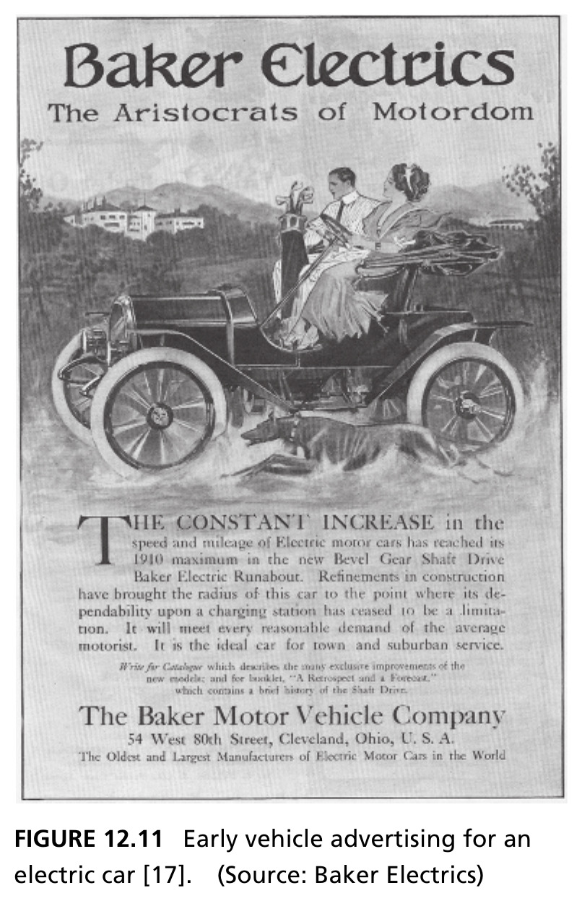{height=440px fig-align="center"}

::: {.side-caption}
The Baker Electric Runabout marketed as "The Aristocrats of Motordom" — evidence of genuine architectural competition in the early automotive market, each architecture appealing to a different customer segment. Source: Crawley, Cameron & Selva (2016), Fig. 12.11. Source: Baker Electrics.
:::

::: {.notes}
Walk through this period advertisement as primary-source evidence for the previous slide's claims, not just decoration. Point out its tagline, "The Aristocrats of Motordom," and its explicit sales pitch: constant increases in speed and mileage, reliability no longer being a limitation due to charging-station availability, and it being positioned as "the ideal car for town and suburban service" — explicitly a refined, low-maintenance product aimed at a genteel customer base, exactly matching the marketing-segmentation claim from the previous slide.

If useful, mention the book's own further comparison here: a contrasting 1904 advertisement for a steam car (not the one shown, but referenced in the same passage) was pitched in more technical language, boasting 100 miles of range on a single filling of "the tanks" — plural, referring to both the fuel tank and the separate water tank a steam car required. Both vehicles delivered the exact same aggregate system-level function (driving), yet exhibited genuinely different underlying vehicle architectures and were marketed to visibly different customer sensibilities — a clean, concrete illustration of real architectural competition playing out in an actual historical marketplace.
:::

## What Triggered ICE Dominance? {.smaller}

- Early steam cars had rapid acceleration but needed frequent water refills and 20 minutes to build boiler pressure; early electrics were simple but limited to ~64 km range and 32 km/h; ICE cars matched electrics in performance but were harder and riskier to start (hand crank)
- Two breakthroughs resolved steam's core weakness (water dependency): the internal combustion engine and the electric motor — both first proven in rail and power generation before entering automobiles
- **Ford's assembly line** (lower price) and the **electric starter** (removed the crank-injury risk) made ICE cars affordable and safe for the masses by 1920 — steam disappeared from the market entirely by 1930

::: {.notes}
Walk through the genuine three-way performance comparison among early steam, electric, and ICE cars, since it explains why the outcome wasn't obvious in advance. Early steam cars had the best raw acceleration of the three — reaching roughly 0 to 65 km/h (0 to 40 mph) in under 10 seconds, since steam engines produce their highest power and torque right from a standing start — but they required frequent refilling of their water tank (early models couldn't travel more than about 2 miles without replenishing it) and needed up to 20 minutes for the boiler to build sufficient pressure before the car could even move. Early electric cars had a price comparable to steam cars and required an electric power source that was really only reliably available in major cities at the time; they were limited to a range under 64 kilometers (40 miles) per charge and a top speed of about 32 km/h (20 mph), due to the genuinely low energy density of early lead-acid batteries (roughly 15 to 20 watt-hours per kilogram, compared to gasoline's roughly 12,200 watt-hours per kilogram) — but their key advantage was simplicity of operation: no complicated shifting mechanisms, and essentially no maintenance or uncomfortable emissions. Early ICE cars had performance roughly on par with electrics but inferior to steam — and steam proponents deliberately referred to it as the "internal explosion engine" to imply it was less safe, which, worth noting, had a real basis: while an ICE car could be started in under a couple of minutes, many motorists sustained genuine injuries starting the vehicle via the external hand crank.

Explain the two technological breakthroughs that resolved steam's fundamental weakness — dependency on water availability: the internal combustion engine and the electric motor. Point out something genuinely interesting and easy to miss: both of these technologies were initially developed and proven in entirely different markets first — rail transportation and stationary power generation — before either one entered the nascent automotive industry at all.

Explain precisely which two factors actually tipped the competition toward ICE dominance, since it wasn't raw technical superiority alone: Ford's assembly line dramatically reduced the price of ICE cars, making them affordable to a much wider public; and the development of the electric starter eliminated the genuine safety risk of hand-cranking. Together, these two price-and-safety improvements made ICE cars affordable *and* safe for the masses by around 1920 — and the once-dominant steam car, despite its centuries-old technological lineage going back to the 1780s, disappeared entirely from the market by 1930.
:::

## Figure 12.12 · A Century of Architectural Competition {.smaller}

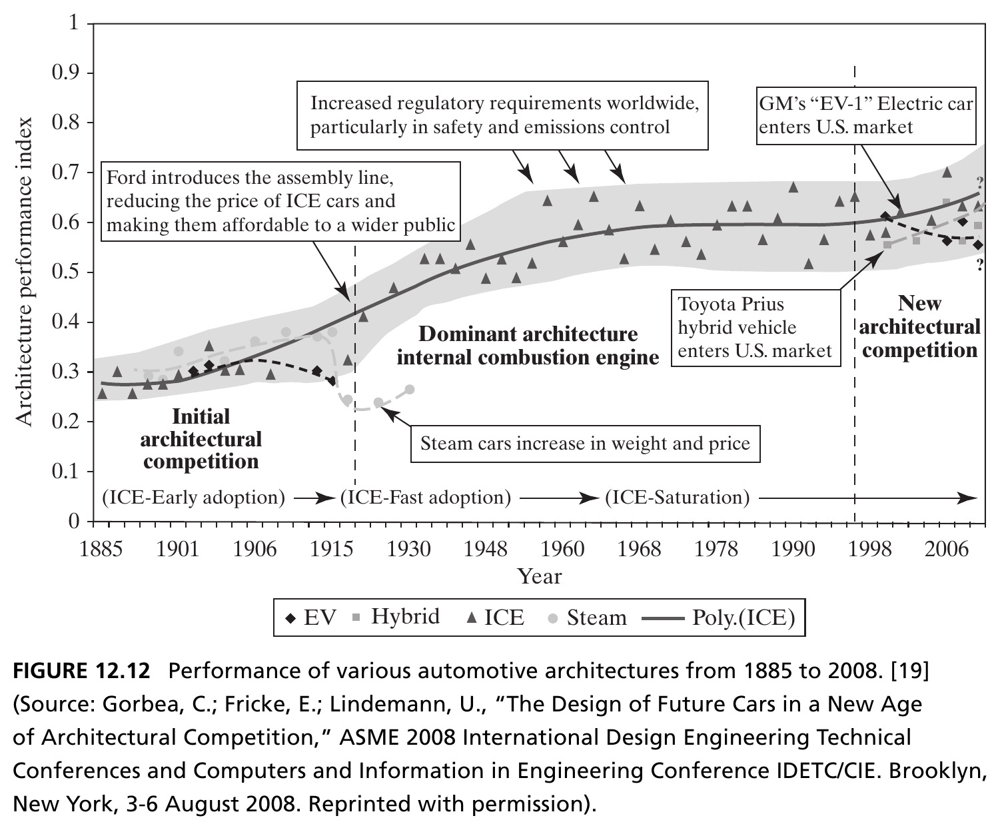{height=410px fig-align="center"}

::: {.side-caption}
Three eras: initial architectural competition (1885–1915), dominance of the ICE architecture (1915–1998) — punctuated by regulatory pressure and GM's EV-1 — and renewed architectural competition (1998–2008) beginning with the Toyota Prius and modern EVs. Source: Crawley, Cameron & Selva (2016), Fig. 12.12, after Gorbea, Fricke & Lindemann (2008).
:::

::: {.notes}
Walk through this chart's three named eras carefully, since it's the visual centerpiece tying together the entire case study. The initial architectural competition era runs from 1885 to about 1915 — corresponding exactly to the period we just discussed, where steam, electric, and ICE genuinely competed as fundamentally different architectures. Then a dominant-architecture era sets in: the ICE architecture's design principles have remained relatively unchanged since roughly the mid-1930s, and once the entire market adopted this single dominant architecture, the basic *risk* of not knowing which architecture would ultimately prevail was completely eliminated — this let manufacturers redirect their innovation efforts toward the subsystem level rather than the overall system-architecture level, exactly the "incremental improvement within a single dominant architecture" contrast from the case study's opening definition slide.

Point out the specific triggering events annotated on the chart within this long dominant era: Ford's assembly line reducing ICE car prices (already discussed); steam cars increasing in weight and price during their 1920-to-1930 last stand, trying and failing to compete via added features like a water-recycling condenser and a faster-pressure-building spark-ignition starter — improvements that only made the already-low-volume steam car heavier and more expensive, and it disappeared completely by 1930; increased worldwide regulatory requirements, particularly around safety and emissions control; and GM's "EV-1" electric car entering the U.S. market as an early, though ultimately unsuccessful in the near term, disruption attempt.

Finally, point to the renewed architectural competition era, beginning around 1998 to 2008 in this chart, triggered by two key historical events explicitly named: the reintroduction of electric vehicles into the market, and the Toyota Prius entering the U.S. market as the first mass-produced hybrid electric car. This is the moment the book explicitly frames as a return to genuine architectural — not merely incremental — competition, for the first time in nearly a century.
:::

## The Lesson of Dominant Architecture {.smaller}

- Once the market adopted ICE as the single dominant architecture, the *risk* of not knowing which architecture would prevail was eliminated — manufacturers could focus innovation at the **subsystem** level, not the architecture level
- Decades of incremental innovation followed — most automakers built core competencies deeply specific to ICE design, leaving them poorly positioned to pivot when architecture became contested again

::: {.fragment .callout-important appearance="minimal" icon=false}
A shift back toward architectural competition can place established firms in real jeopardy — this was exactly the case for most steam manufacturers in the 1920s, who failed to adapt. The electric car was a loser in 1910. **Could it become a winner again in a new period of architectural competition?**
:::

::: {.notes}
This is the case study's payoff slide, drawing out the strategic business lesson from the historical narrative just covered. Restate the key mechanism precisely: once the market settled on ICE as the single dominant architecture, the risk associated with not knowing which architecture would ultimately win was completely eliminated for every manufacturer simultaneously — and this let the whole industry redirect its innovation energy toward the subsystem level (better engines, better transmissions, better safety features) rather than toward the riskier, more fundamental question of overall vehicle architecture.

Point out the less obvious, longer-term consequence, which is the real strategic warning worth emphasizing: decades of purely incremental, subsystem-level innovation meant that most automakers built their core competencies — their institutional expertise, their supplier relationships, their manufacturing investments — deeply and specifically around ICE design. This left them structurally poorly positioned to pivot quickly once architectural competition returned with electric and hybrid vehicles.

The closing fragment states the strategic stakes as sharply as the book does, and it's worth reading close to verbatim, since it's a genuinely evocative closing thought for the whole chapter: a shift back toward architectural competition can place even large, established firms in real jeopardy — precisely what happened to most steam-car manufacturers in the 1920s, who simply failed to adapt in time and vanished from the market entirely by 1930. And then the book's own closing rhetorical question, worth leaving hanging in the room rather than answering for students: the electric car was a loser in the earlier period of architectural competition, back in 1910 — could it become a winner again, now that we're in a renewed period of architectural competition? This deliberately open question is a good note to end the lecture on, inviting students to reflect on how the same dynamic might be playing out again right now, in front of them, in the current automotive market.
:::

## Next: Decomposition as a Tool for Managing Complexity

Having selected a concept, Chapter 13 turns to the architect's remaining primary task: managing the explosion of complexity that follows, using decomposition as the central tool.

::: {.notes}
Close the lecture by connecting directly back to Figure 12.1's three-themes diagram one final time: we've now covered "applying creativity" — the middle theme, at concept itself. Chapter 13, up next, picks up the downward arrow from concept toward architecture and operations, addressing the "managing complexity" theme explicitly. Preview specifically what's coming: once a concept has been selected, the scope and information content of the resulting project explodes, and decomposition — dividing the system into manageable, well-chosen pieces — becomes the architect's central tool for keeping that explosion of complexity comprehensible rather than overwhelming, picking up directly from the "complex versus complicated" distinction first introduced back in Chapter 3.
:::
