## From Concept to Complexity {.smaller}

- Chapter 12 selected the concept — the mapping from function to form. Once that choice is made, the scope and information content of the project can grow **exponentially**: resources are added per subsystem, marketing shapes the message, manufacturing plans in earnest
- A central theme of this chapter: complexity **exists** and is inherently **neither good nor bad** — it is an investment made to reach system goals
- We first unpack the attributes of complexity (§13.2), then turn to **decomposition** as the architect's key lever for managing it (§13.3), closing with a case study contrasting Saturn V and Space Station *Freedom*

::: {.notes}
Open by explicitly linking back to Chapter 12: once a concept has been selected — the mapping from function to form — the scope and information content of the project can grow exponentially. Resources get added per subsystem, marketing starts shaping the message, manufacturing begins planning in earnest. This growth in scope is exactly what this chapter calls "complexity," and the chapter's first job is to convince students that complexity is not itself the enemy.

State the central theme plainly, since it reframes how students should think about complexity for the rest of the lecture: complexity exists, and it is inherently neither good nor bad — it is an investment made to reach the system's goals. A simple system that can't deliver the required function or performance isn't "better" for being simple; it's simply inadequate. The architect's job is not to minimize complexity at all costs, but to manage it deliberately.

Preview the chapter's two-part structure: Section 13.2 unpacks what complexity actually is — its attributes, how to measure it, and how it differs from being "complicated" — and Section 13.3 turns to decomposition as the architect's primary lever for managing that complexity once it exists. The chapter closes with a real case study — contrasting the Saturn V launch vehicle with the never-built Space Station Freedom — showing what happens when decomposition is done well versus poorly.
:::

# 13.2 Understanding Complexity

## What Is Complexity? {.smaller}

::: {.callout-note appearance="simple" icon=false}
**Box 13.1 · Definition: Complexity.** Several simple measures: N1 = number of things, N2 = number of types of things, N3 = number of interfaces, N4 = number of types of interfaces.

$$C = N_1 + N_2 + N_3 + N_4$$
:::

- The most-quoted measure of complexity is simply **N1**: Microsoft cites servers in its data centers; Boeing cites parts (6 million) in the 747
- Analogously, N3/N4 capture interfaces and interface *types* — a building's electrical system is more complex if its outlets are of many types (US, UK, EU, AU...)
- A variation: Boothroyd & Dewhurst's formal complexity $C = (N_1 \times N_2 \times N_3)^{1/3}$. Complexity is an **absolute, quantifiable** property once "measure" and "atomic level" are defined — regard it as a quantity to be *managed*, not an intractable outcome to be ignored

::: {.notes}
Give students Box 13.1's four counting measures precisely, since they recur for the rest of the lecture: N1 is simply the number of things (entities/parts), N2 is the number of distinct types of those things, N3 is the number of interfaces, and N4 is the number of distinct types of interfaces. The simplest and most-quoted of these is N1 alone — Microsoft touts the number of servers in its data centers, Boeing touts the roughly 6 million parts in a 747 — because raw part count is intuitive and easy to communicate externally, even though it's a crude measure on its own.

Walk through why N3/N4 matter as a distinct axis from N1/N2: two buildings could have the same number of electrical outlets (same N1), but one is more complex than the other if its outlets come in many incompatible types — US, UK, EU, AU plug standards — because now more interface *types* have to be designed for, stocked, and adapted to.

Introduce the Boothroyd & Dewhurst variation as an alternative combination worth knowing (a geometric-mean-style formula rather than a simple sum), and then land on the chapter's key philosophical point, which the rest of the lecture depends on: once you fix what you're measuring and at what level of atomic granularity, complexity becomes an absolute, quantifiable property of the system — not a vague, subjective impression. That's important because it means complexity is something the architect can actually track and manage as a real design variable, rather than an intractable, purely qualitative outcome to throw up your hands at.
:::

## Figure 13.1 · A Real (but Unwieldy) Complexity Measure {.smaller}

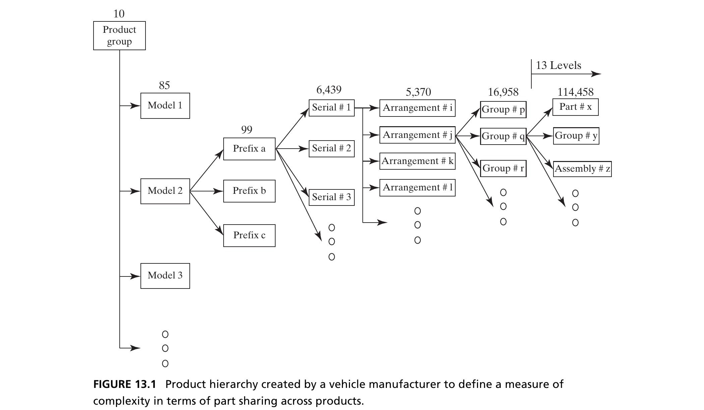{height=460px fig-align="center"}

::: {.side-caption}
A vehicle manufacturer's attempt to define complexity via part-sharing across a 13-level product hierarchy. The measure was not incorrect — but it was so cumbersome (the decomposition itself was never agreed upon) that it went unused. Source: Crawley, Cameron & Selva (2016), Fig. 13.1.
:::

::: {.notes}
Use this real-world case as a cautionary tale about measurement *usability*, not just measurement correctness. A vehicle manufacturer built out this elaborate 13-level product hierarchy specifically to define and track complexity via part-sharing across models and platforms. The measure itself wasn't technically wrong — it genuinely captured something real about how parts were shared and reused across the product line.

The problem, worth dwelling on because it's a subtle and common failure mode: the decomposition underlying the measure was never actually agreed upon across the organization. Different teams had different ideas about what belonged at which level, so the hierarchy itself was contested, and as a result this elaborate measure became so cumbersome to maintain and interpret that it simply went unused in practice. Draw the lesson explicitly for students: a complexity measure is only as useful as the decomposition it's built on — if you can't get organizational agreement on the underlying structure, even a correct measure will die from disuse. This sets up the tension the rest of the chapter explores: complexity can be measured in principle, but our human ability to *perceive* it is a separate matter entirely, which is exactly the next slide's topic.
:::

## Complex versus Complicated {.smaller}

- Complexity is a negative-sounding property, yet complex systems (transportation infrastructure, networked communication) deliver far more value than simple counterparts (bicycles, letter mail)
- Chapter 3 introduced **complicated** as a measure of our *ability to perceive and comprehend* complexity. Complicated things have high **apparent complexity** (complicatedness) — our human processor is more easily confused
- The pyramids were structurally less complicated than the Taj Mahal — but we leave comparing their emergent aesthetics to the reader's judgment and taste

::: {.notes}
Reconnect explicitly to Chapter 3's vocabulary, since this distinction was introduced there and now gets applied specifically to the cost/benefit tradeoff of complexity. First dispel a common misconception directly: complexity sounds like a negative, undesirable property in casual speech, yet complex systems routinely deliver far more value than their simple counterparts — transportation infrastructure and networked communication systems are wildly more complex than a bicycle or a letter carried by hand, and also wildly more valuable. Complexity, again, is not inherently bad.

Then draw the sharp distinction: "complicated" is not a synonym for complex — it specifically measures our human ability to perceive and comprehend a system's complexity. A complicated thing has high apparent complexity: it overwhelms or confuses our "human processor," regardless of whether its underlying (absolute) complexity is actually all that high. The pyramid/Taj Mahal comparison is a nice light example to close on: structurally, the pyramids are less complicated than the Taj Mahal, even though both perform essentially the same function of entombing royalty — but whether the added complicatedness of the Taj Mahal is aesthetically worth it is a matter of taste, not a matter this chapter's tools can adjudicate. That's a deliberate rhetorical move by the authors — leaving the value judgment to the reader while still making the technical point about complicatedness cleanly.
:::

## Box 13.2 · Principle of Apparent Complexity {.smaller}

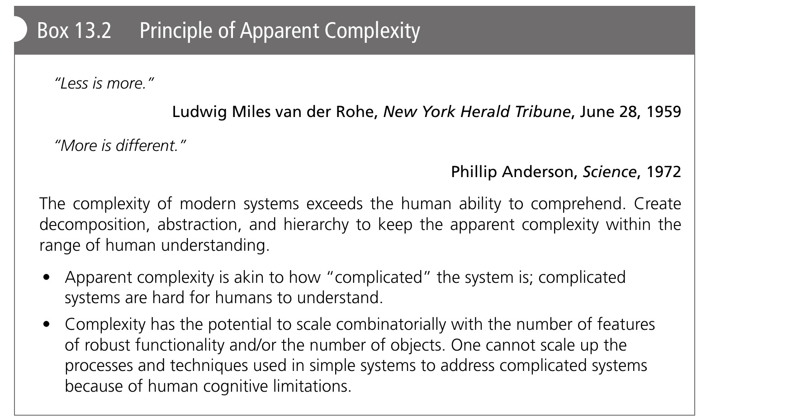{height=480px fig-align="center"}

::: {.notes}
Read through the box's two epigraphs and its prescriptive content, since this is the chapter's formally named principle for this idea. Mies van der Rohe's "Less is more" and Philip Anderson's "More is different" (the title of his famous 1972 *Science* article on emergent complexity in physics) are deliberately placed in tension — one says simplicity is a virtue, the other says genuinely new phenomena emerge only once you have enough scale or complexity. Both are true simultaneously, which is exactly the point: apparent complexity is worth minimizing where possible, but not at the cost of losing genuinely valuable emergent behavior.

State the principle's core claim plainly: the complexity of modern systems exceeds the human ability to comprehend it directly, so we create decomposition, abstraction, and hierarchy specifically to keep *apparent* complexity within the range of human understanding — these tools don't reduce the system's actual, absolute complexity at all, they only make it more digestible to the humans who have to work with it. And flag the box's important warning, which the next few slides build directly on: complexity has the potential to scale *combinatorially* with the number of features and the number of objects, so techniques that work for simple systems cannot simply be scaled up naively to complicated ones — new tools are needed, and inventing them is the point of the rest of the chapter.
:::

## Figure 13.2 · Complicatedness in Civil Architecture {.smaller}

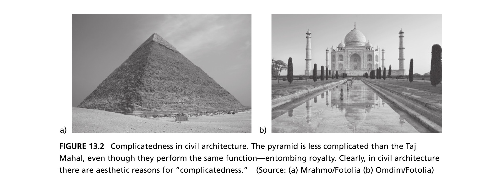{height=460px fig-align="center"}

::: {.side-caption}
The pyramid is less complicated than the Taj Mahal, even though both perform the same function — entombing royalty. In civil architecture there are aesthetic reasons for "complicatedness." Source: Crawley, Cameron & Selva (2016), Fig. 13.2.
:::

::: {.notes}
This is the visual payoff of the comparison introduced two slides back. Point out that both structures share an identical primary function — entombing royalty — yet one (the pyramid) is a relatively simple geometric form, while the other (the Taj Mahal) is visually and structurally far more intricate. Emphasize the point the caption makes explicitly: in civil architecture specifically, there can be genuine aesthetic reasons to *want* apparent complexity — ornamentation, symmetry, and visual richness are often deliberately pursued design goals, not accidents or failures of simplification. This is a useful moment to ask students whether the same logic could apply to a product they know well (a luxury car's dashboard, a piece of jewelry) — sometimes complicatedness is the point, not a flaw to eliminate.
:::

## Figure 13.3 · A Complicated Network {.smaller}

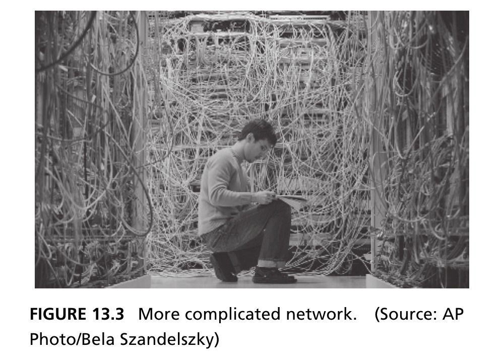{height=460px fig-align="center"}

::: {.side-caption}
The same function is delivered by Figures 13.3 and 13.4, and the inputs/outputs at an electrical layer are identical — but one architecture is far less complicated and more amenable to analysis and modification. Source: Crawley, Cameron & Selva (2016), Fig. 13.3.
:::

::: {.notes}
Set up this photo as one half of a deliberate before/after pair with the next slide — a tangle of cables with no visible organization. Emphasize the caption's key claim: this network and the one on the next slide deliver the *exact same function*, and at the electrical layer, the inputs and outputs are literally identical — nothing about what the network actually does has changed between the two. What differs entirely is how *legible* the physical arrangement is to a human trying to understand, maintain, or modify it. Ask students to imagine being asked to trace a single cable, or add a new connection, in a rack that looks like this one — that's the practical cost of high apparent complexity, even when the underlying function is unchanged.
:::

## Figure 13.4 · The Same Network, Organized {.smaller}

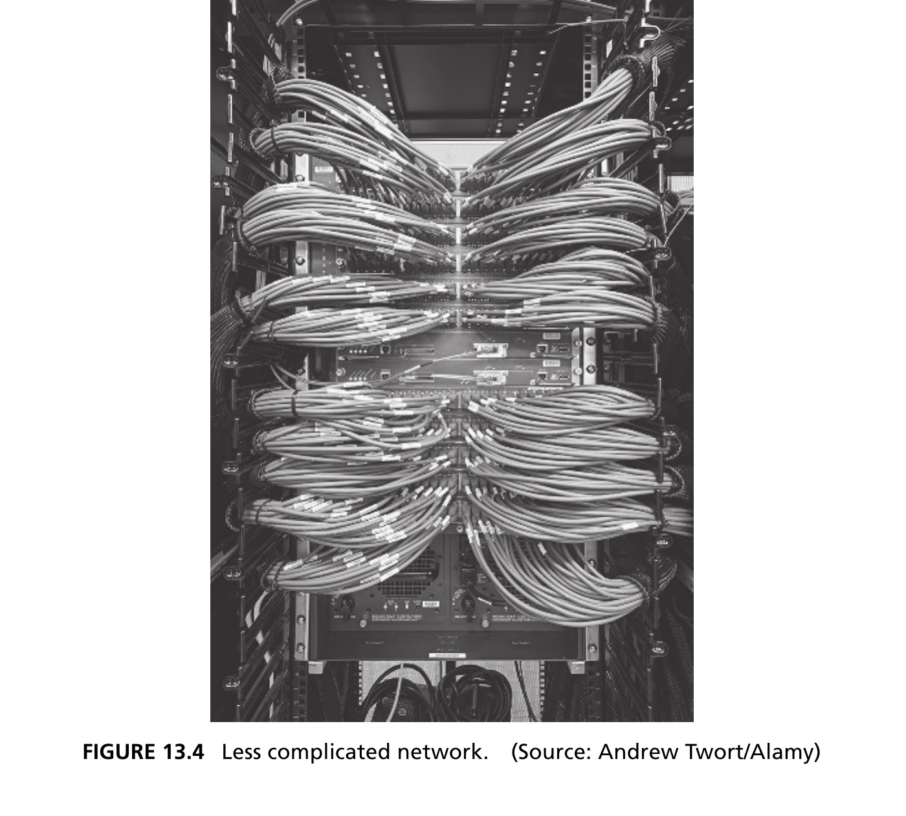{height=420px fig-align="center"}

::: {.side-caption}
Decomposing the network into cables, routers, and racks — and abstracting a bundle of cables into a single "bus" — makes the *organization* legible without changing what the network does. Source: Crawley, Cameron & Selva (2016), Fig. 13.4.
:::

::: {.notes}
Complete the before/after pair from the previous slide. This is the same underlying function as the tangled-cable photo, but now organized into a clean, legible arrangement — decomposed into cables, routers, and racks, with related cables abstracted and bundled into a single "bus" concept the viewer can track as one unit instead of dozens of individual strands. Reiterate the key point one more time for emphasis, since it's easy to let slide by: nothing about the network's actual function changed between the two photos — only its apparent complexity did, through deliberate application of decomposition and abstraction. This sets up the next slide's discussion directly: exactly *how* did we get from one to the other, mechanically?
:::

## Reducing Apparent Complexity {.smaller}

- The word "organized" is fuzzy — it doesn't reduce to a step-by-step process. We unpack it with Chapter 3's tools: **decomposition** and **abstraction**
- A cable can be treated as an instance of a class of entities sharing functionality; a bundle of cables tied together can be abstracted as a single **bus**, releasing the viewer from tracking each cable
- Is Figure 13.4 at *maximum* organization? Not necessarily — a layered diagram could abstract out the cable-routing detail entirely, at the cost of "presuming" the cables are routed correctly

::: {.fragment .callout-tip}
Low-level languages (assembly) are hard even for experienced programmers. High-level languages (JAVA, MATLAB) reduce apparent complexity — MATLAB inverts a matrix in one instruction. For some users this investment is merited; for others it costs performance or scalability.
:::

::: {.notes}
Unpack exactly what "organized" means mechanically, since it's a fuzzy word that doesn't reduce to a single step-by-step procedure on its own — the book deliberately reaches back to Chapter 3's tools to make it concrete: decomposition and abstraction. A cable, in this network example, can be treated as one instance of a general class of "cable" entities that all share the same basic functionality — and a whole bundle of these cables, tied together, can then be abstracted as a single higher-level concept, a "bus," which releases the viewer from having to track every individual strand.

Push students on whether Figure 13.4 (the tidy version) represents *maximum* possible organization, and let the answer surprise them: not necessarily. You could go a layer further and build a diagram that abstracts out the cable-routing detail entirely — but that comes at a real cost: doing so requires *presuming* the cables are routed correctly, since you're no longer showing that detail at all. There's always a tradeoff between how much apparent complexity you strip away and how much you're implicitly trusting rather than verifying.

Close with the software-language example in the fragment, since it generalizes the same idea to a completely different domain: low-level languages like assembly are hard even for experienced programmers — extremely low apparent complexity reduction. High-level languages like Java or MATLAB reduce apparent complexity dramatically (MATLAB inverts an entire matrix in a single instruction). But — and this is the important caveat — that investment in abstraction isn't free or universally beneficial: for some users the reduced apparent complexity is well worth it, while for others (say, someone needing maximum runtime performance or fine-grained memory control) that same abstraction costs real performance or scalability. Reducing apparent complexity is always a deliberate tradeoff, not an unambiguous win.
:::

## Essential Complexity {.smaller}

- Complexity is absolute, and the architect must *invest* in it to deliver more performance and functionality. This begs the question: is there a **minimum** complexity required to deliver a given function and performance?
- Yes — we call this the **essential complexity**. Functionality drives essential complexity: describe the required functionality carefully, then choose a concept that produces low complexity
- **Gratuitous complexity** is complexity added *over and above* the essential complexity for a given robust functionality — it should be avoided

::: {.notes}
Introduce a second major axis of complexity, distinct from "apparent" complexity (which was about human perception): "essential" complexity, which is about the underlying requirement itself. Since complexity is absolute (from the earlier N1–N4 discussion) and the architect necessarily invests in it to deliver more performance and functionality, a natural question arises: is there some *minimum* complexity required to deliver a given function at a given performance level? The answer is yes, and that minimum is exactly what's called essential complexity.

Give the practical guidance directly: functionality drives essential complexity, so the way to manage it is to describe the required functionality carefully and precisely, and then choose a concept (recall Chapter 12) that produces the lowest complexity capable of delivering that functionality robustly. Contrast this immediately with its counterpart, gratuitous complexity: anything invested *beyond* what's essential for the required, robust functionality. Be precise about the word "robust" here — it's not that you should cut every corner down to a fragile minimum; essential complexity already accounts for what's needed for robust operation. Gratuitous complexity is genuinely wasted investment beyond that, and the chapter is unambiguous that it should be avoided wherever it's identified.
:::

## Box 13.3 · Principle of Essential Complexity {.smaller}

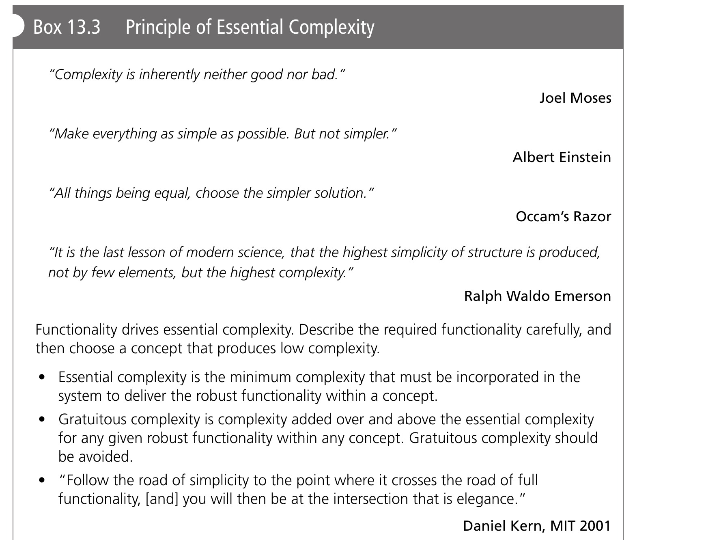{height=500px fig-align="center"}

::: {.notes}
Walk through this box's collection of quotations, since together they triangulate the same idea from several well-known thinkers: Joel Moses's "complexity is inherently neither good nor bad" (the chapter's opening theme, restated here as a formal principle), Einstein's "make everything as simple as possible, but not simpler" (essential complexity is the floor — don't go below it), Occam's Razor ("choose the simpler solution, all things being equal" — but note the crucial qualifier "all things being equal," meaning this doesn't license cutting essential complexity), and Ralph Waldo Emerson's remark that the highest simplicity of structure comes not from having few elements, but from the *highest* complexity, tamed to its intersection with elegance.

State the principle's core prescriptive content plainly: essential complexity is the minimum complexity that must be incorporated into the system to deliver its robust functionality; gratuitous complexity is anything added over and above that for the same functionality, and should be avoided. The box also offers a memorable closing aphorism worth reading aloud: follow the road of simplicity to the point where it crosses the road of full functionality, and *that* intersection is where elegance lives — neither the naive, under-functional simple design nor an over-engineered, gratuitously complex one, but the essential-complexity sweet spot in between.
:::

## Figure 13.5 · Is This Complexity Essential? {.smaller}

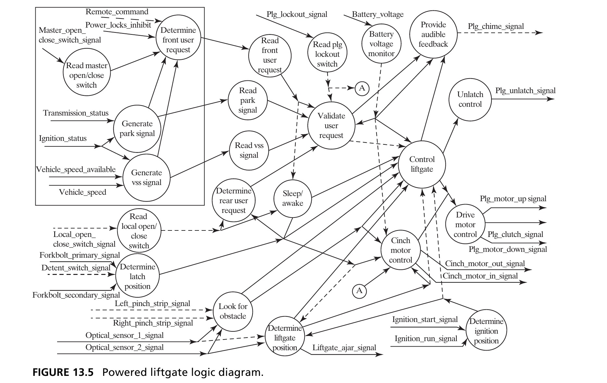{height=440px fig-align="center"}

::: {.side-caption}
A powered liftgate's logic: circles are processes, lines are signals. A minimum system (switch + reversing logic) wouldn't capture the function that prevents opening while the vehicle moves. It's hard to argue this diagram contains gratuitous functions or forms — but does it also carry gratuitous complexity inherited from legacy architectures? Source: Crawley, Cameron & Selva (2016), Fig. 13.5.
:::

::: {.notes}
Use this genuinely intricate diagram to make essential complexity concrete and to pose an open, discussion-worthy question rather than a settled answer. Walk through the basic notation first: circles are processes, lines are signals passing between them — this is a functional architecture diagram for something as seemingly mundane as a car's powered rear liftgate.

Point out why it's this complicated: a truly minimal system — just a button and simple reversing logic if something blocks the door — would fail to capture an important safety function: preventing the liftgate from opening at all while the vehicle is in motion. That requirement alone forces in vehicle-speed sensing, ignition-status checking, and more, cascading through the rest of the logic. Given that, it's genuinely hard to point to any individual function or form in this diagram and call it clearly gratuitous — every piece seems to be pulling its weight for some real requirement.

But raise the harder, more honest question the caption poses, and don't resolve it too quickly: even if no individual function is gratuitous, could the *overall* complexity still be higher than truly essential, inherited from legacy architectures — earlier liftgate designs, bolted-on incrementally over product generations, rather than architected fresh against today's full requirement set? This is a good moment to have students debate: how would you even go about testing whether this system's complexity is essential or partly inherited legacy cruft?
:::

## Figure 13.6 · Apparent ≠ Essential {.smaller}

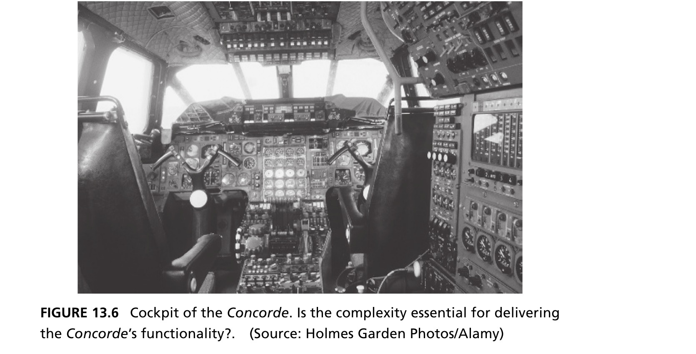{height=480px fig-align="center"}

::: {.side-caption}
A system's essential or gratuitous complexity is independent of its *apparent* complexity. The Concorde's flight deck is visually overwhelming and required extensive training — high apparent complexity. Given the Concorde's success, that complexity could be argued essential to delivering its performance with the technology of the era. Source: Crawley, Cameron & Selva (2016), Fig. 13.6.
:::

::: {.notes}
This slide's whole job is to decouple two axes students might otherwise conflate: apparent complexity (from Section 13.2's first half) and essential/gratuitous complexity (introduced just now) are genuinely *independent* properties — high on one doesn't imply anything about the other. The Concorde's flight deck, pictured here, is the clean illustrating case: it's visually overwhelming, packed with dials, switches, and gauges, and required extensive specialized pilot training — unambiguously high apparent complexity.

But make the argument the slide is making explicit: given that the Concorde actually succeeded at delivering supersonic passenger flight, using only the technology available in that era, one could reasonably argue that this level of complexity was essential — not gratuitous — for achieving that performance with 1960s–70s avionics technology. A simpler-looking flight deck, at that time, might genuinely not have been capable of the same performance. This is a good moment to have students hold two ideas simultaneously: something can look complicated (high apparent complexity) while still being architected efficiently (low or no gratuitous complexity) — those are different questions entirely, and conflating them leads to bad architectural judgment.
:::

## Figure 13.7 · Low Apparent, High Actual {.smaller}

{height=480px fig-align="center"}

::: {.side-caption}
The smartphone's touchscreen interface has very low apparent complexity — little or no training to operate — while masking substantial internal hardware complexity. No one would argue the Concorde's interface should be condensed to a menu, four buttons, and scrolling — but is the phone's hidden complexity essential, or gratuitous? Source: Crawley, Cameron & Selva (2016), Fig. 13.7.
:::

::: {.notes}
Give students the mirror-image case to the Concorde, completing the 2×2 that apparent complexity and essential complexity together define. A smartphone's touchscreen interface has extremely low apparent complexity — most people can pick one up and operate it with little or no training — while it simultaneously masks enormous internal hardware complexity (multi-core processors, radios for several wireless standards, sensor arrays, and so on).

Pose the deliberately unresolved question the caption raises, and treat it as worth debating rather than answering definitively: nobody seriously argues the Concorde's cockpit should have been simplified down to a phone-like menu-and-four-buttons interface — the flight-safety stakes are simply too different from checking a text message. But is the smartphone's *hidden* internal complexity essential to delivering what a modern phone actually needs to do, or does some of it represent gratuitous complexity accumulated from feature creep, legacy chip designs, or backward-compatibility requirements? This is a genuinely good discussion prompt: ask students to name a piece of their own phone's capability they suspect is more complex than strictly essential for the function it delivers.
:::

## Figure 13.8 · Decomposition Has a Price {.smaller}

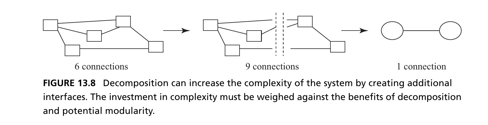{height=280px fig-align="center"}

::: {.side-caption}
Five entities, six connections (left). Grouping into two clusters of three and two apparently simplifies the system to one connection (right) — but the decomposition *introduces an interface* between the groups: the system now has six entities and nine connections (middle)! Reducing apparent complexity can *increase* actual complexity. Source: Crawley, Cameron & Selva (2016), Fig. 13.8.
:::

- The architect must decide whether to invest in actual complexity (to bring down apparent complexity), or not to invest at all

::: {.notes}
This is one of the most important and counter-intuitive figures in the whole chapter, so walk through all three panels carefully and slowly, ideally sketching it on the board alongside the slide. On the left: five entities with six connections among them — genuinely a fair amount of apparent complexity already, hard to take in at a glance. It's tempting to think "let's group these into two clusters to simplify things."

The middle panel shows what actually happens when you do that grouping: you now have the original five entities *plus* two new group-boundary entities (six total), and — critically — creating those group boundaries requires new interface connections to route existing relationships through them, so the connection count actually goes *up*, to nine. The apparent picture, if you only look at the group level, seems simpler — but the real, underlying system got more complex, not less.

Only in the right panel, once you've fully collapsed each cluster into a single abstracted box and stopped tracking what's inside it, does the diagram show just one connection between two boxes — genuinely lower apparent complexity, achieved by discarding visibility into the clusters' internals entirely.

Land on the chapter's central warning from this figure, worth stating as its own sentence: reducing apparent complexity through decomposition can *increase* actual complexity, because decomposition itself introduces new interfaces between the pieces you've created. This is not a flaw to be avoided — it's an unavoidable tradeoff. The bullet below the figure states the architect's actual job explicitly: consciously decide whether to make that investment in additional actual complexity in exchange for lower apparent complexity, versus not decomposing at all — but never fool yourself into thinking a "simpler-looking" decomposition is complexity-free.
:::

## Box 13.4 · Principle of the 2nd Law {.smaller}

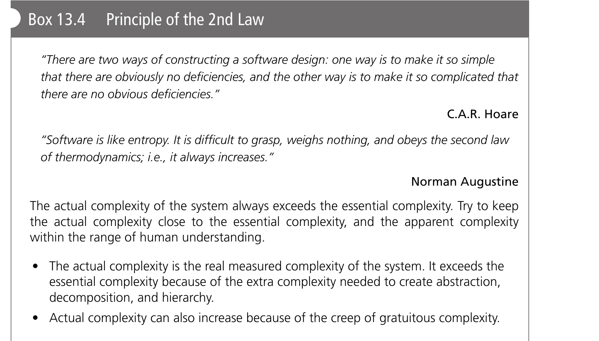{height=380px fig-align="center"}

::: {.fragment .callout-important appearance="minimal" icon=false}
**iDrive, a cautionary tale.** BMW's first iDrive consolidated dashboard switches under one twist/angle/press controller to *reduce* apparent complexity — but the menu ended up five levels deep to reach the heater. Reducing apparent complexity of the switches caused a net *increase* in apparent complexity of the menu.
:::

::: {.notes}
Give students the box's own two quotations first, since they're a nice pairing: C.A.R. Hoare's line about two ways to build software (make it so simple there are obviously no deficiencies, or so complicated there are no *obvious* deficiencies), and Norman Augustine's observation that software is like entropy — hard to grasp, weighs nothing, and always increases, echoing the actual Second Law of Thermodynamics the box is named after. State the principle itself precisely: actual complexity always exceeds essential complexity in practice, and the architect's job is to try to keep actual complexity close to essential, while keeping *apparent* complexity within the range of human understanding. Actual complexity, worth restating carefully, is the *real*, measured complexity of the built system — it exceeds essential complexity because of the necessary overhead of abstraction, decomposition, and hierarchy (recall Figure 13.8's lesson: those tools cost real interfaces), and it can grow further still from the ongoing "creep" of gratuitous complexity that accumulates over a product's life.

Then use the iDrive fragment as a vivid, real cautionary tale tying everything in this section together. BMW's original iDrive system consolidated a whole dashboard's worth of physical switches into a single twist/angle/press rotary controller, specifically to *reduce* the car interior's apparent complexity — fewer buttons, a cleaner-looking cabin. But the resulting menu system that controlled all those consolidated functions ended up five levels deep just to reach something as basic as the heater controls. The net effect: reducing apparent complexity on one axis (physical switches) caused a genuine net *increase* in apparent complexity on another axis (menu navigation) — the classic "whack-a-mole" failure mode of naive complexity reduction that doesn't account for where the complexity actually goes.
:::

## Section 13.2 Summary {.smaller}

- Complexity is absolute and quantifiable ($C = N_1+N_2+N_3+N_4$); **complicatedness** (apparent complexity) measures our ability to perceive it — the two are related but not the same, and can be manipulated somewhat independently
- **Essential complexity** is the minimum needed to deliver required functionality; **gratuitous complexity** is everything invested beyond that, and should be avoided
- Decomposition and abstraction can *reduce* apparent complexity, but frequently at the cost of *increasing* actual complexity (new interfaces) — that investment must be a deliberate choice, not an accident

::: {.notes}
Use this as a checkpoint before moving into the second half of the chapter — ask students to explain each bullet in their own words, since Section 13.3 builds directly on all of it. By now they should be comfortable with: complexity as an absolute, quantifiable property (N1 through N4); complicatedness/apparent complexity as a separate, human-perception-based property, related to but distinct from absolute complexity; essential complexity as the true minimum needed for required functionality, versus gratuitous complexity as anything invested beyond that; and — the trickiest and most important idea in the section — that our main tools for reducing apparent complexity (decomposition and abstraction) frequently *increase* actual complexity by introducing new interfaces, so using them is a deliberate investment decision, never a free lunch. With all of that established, the chapter now turns to its second major question: given that complexity has to be managed, not eliminated, what is the architect's primary tool for doing so well? The answer, developed over the rest of the chapter, is decomposition — but done thoughtfully, which is a very different thing from decomposition done carelessly.
:::

# 13.3 Managing Complexity

## Choosing a Decomposition {.smaller}

- Chapters 2–3 gave us abstraction, decomposition, hierarchy, and logical relationships (class/instance, type/specialization, recursion) — tools to represent architecture while removing irrelevant detail
- Modern engineering is entwined with the **Bill of Materials** — a very concrete decomposition down to purchased components. But it doesn't necessarily lend itself to *functional* decomposition of the concept
- A functional decomposition determines which subsystems accomplish which functions, which functions are necessarily emergent, and carries the architecture's intent down through the design — objectives not served by a purely formal decomposition

::: {.notes}
Reconnect this slide directly to Chapters 2 and 3's toolkit — abstraction, decomposition, hierarchy, and the special logical relationships (class/instance, type/specialization, recursion) — and frame this chapter as asking a sharper, more practical question: given all those tools exist, how does an architect actually *choose* a good decomposition, rather than an arbitrary one?

Make the Bill of Materials point carefully, since it's a genuinely useful real-world contrast. Modern engineering organizations are deeply entwined with the Bill of Materials (BOM) — an extremely concrete decomposition all the way down to individually purchased components, needed for procurement, costing, and manufacturing. But point out explicitly that a BOM-style decomposition doesn't necessarily serve the concept's *functional* decomposition well at all — a BOM tells you what parts to buy, not which subsystems are responsible for delivering which functions, nor which functions are going to be emergent and thus need careful architectural attention.

State the payoff of doing a genuine functional decomposition instead (or alongside a BOM): it determines which subsystems accomplish which functions, flags which functions are necessarily emergent (and therefore need deliberate cross-subsystem coordination), and carries the architect's original intent all the way down through subsequent, more detailed design — objectives that a purely formal (BOM-style) decomposition simply doesn't serve, because it was never organized around function in the first place.
:::

## Box 13.5 · Principle of Decomposition {.smaller}

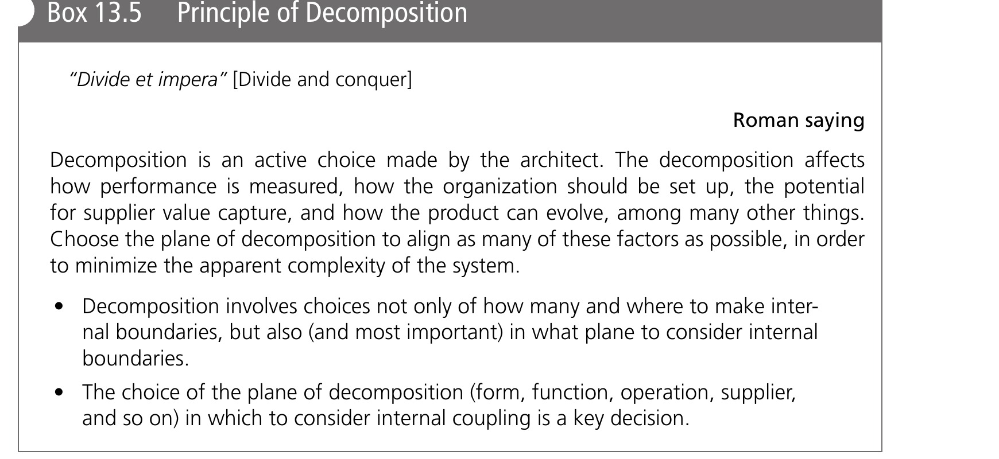{height=400px fig-align="center"}

- A bad example: decomposing operations by nominal get-ready/get-set/go/get-unset/get-unready focuses on the *typical* case, omitting fault conditions, contingencies, and commissioning

::: {.notes}
Read through this box's own epigraph — the Roman saying "Divide et impera" ("Divide and conquer") — and note it's the same ancient strategic idea from Chapter 3, now given its own formal principle specifically in the decomposition-of-architecture context. State its content precisely: decomposition is an active *choice* made by the architect, not a neutral or automatic technical step. That choice affects how performance gets measured, how the organization responsible for the system should be structured, the potential for suppliers to capture value, and how the product will be able to evolve later — among many other downstream consequences. The prescriptive guidance: choose the plane of decomposition specifically to align as many of these factors as possible, in order to minimize the system's resulting apparent complexity.

Use the bad example given on the slide as a concrete cautionary illustration, since it's easy to imagine engineers falling into this trap: decomposing a system's operations purely along the *nominal* sequence — get-ready, get-set, go, get-unset, get-unready — focuses attention entirely on the typical, happy-path case, while silently omitting fault conditions, contingencies, and commissioning procedures. A decomposition built this way will leave the architecture blind to exactly the scenarios where things go wrong — which, as Chapter 2's discussion of emergencies established, is often where the most serious system failures actually occur.
:::

## "2 Down, 1 Up" {.smaller}

- How do we judge the "goodness" of a decomposition? The decomposition at Level 1 **cannot be evaluated** until we descend to Level 2
- Analogy: decomposing a class of 30 students into two groups. We won't know if it's useful until we see the Level 2 structure — decomposition by height, or by visual impairment, serve very different purposes
- The real information about how to cluster at Level 1 is present in the structure and interaction **two levels down** from the reference

::: {.notes}
Pose the chapter's central practical question directly: given that decomposition is a real choice with real consequences (previous slide), how do you actually judge whether a *particular* decomposition is a good one? The answer the book gives is genuinely non-obvious, so take time with it: the decomposition at Level 1 cannot be evaluated in isolation — you literally cannot tell if it's good just by looking at Level 1 itself. You have to descend to Level 2 first.

Walk through the analogy carefully, since it's the clearest way to build intuition: imagine decomposing a class of 30 students into two groups. Just knowing "there are two groups" tells you nothing about whether the decomposition is useful — you need to see how those two groups are actually structured one level further down before you can judge. Decomposing by height serves a completely different purpose (say, seating arrangements) than decomposing by visual impairment (say, accommodation planning) — same Level 1 structure (two groups), radically different value depending on what's really being captured at Level 2.

State the punchline plainly, since it's the whole point of the next two slides: the real, actionable information about how to cluster things well at Level 1 is actually contained in the structure and interaction patterns *two levels down* from wherever you're standing — not at Level 1 itself. This is a genuinely counter-intuitive idea worth letting sink in before the next slide gives it a visual illustration.
:::

## Figure 13.9 · Illustration of "2 Down, 1 Up" {.smaller}

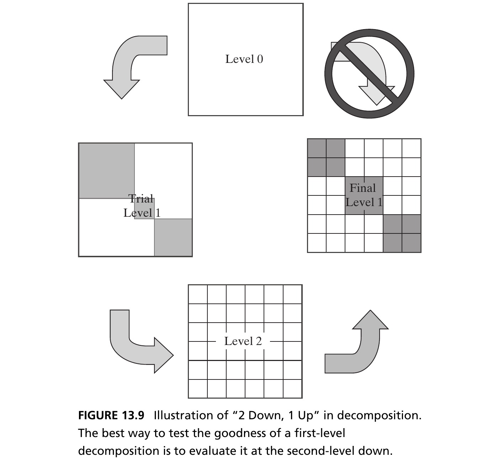{height=520px fig-align="center"}

::: {.notes}
Walk through this figure as the visual proof of the previous slide's claim. Point to the grid/matrix layout showing Level 2 entities and their pattern of interconnection — dense clustering in some regions, sparse or absent connections in others. The key visual insight the diagram is making: once you can actually *see* which Level 2 elements are tightly interconnected with each other and which are more loosely coupled, the "right" way to group them at Level 1 becomes visually obvious — you'd naturally want to draw your Level 1 boundaries around the tightly-clustered groups of Level 2 elements, precisely so that dense interactions stay contained *within* a Level 1 module rather than being forced to cross a Level 1 boundary as an interface. This is exactly the same underlying logic as the DSM-based clustering techniques from Chapter 8, now being explained as a general principle rather than a specific algorithmic technique.
:::

## Box 13.6 · Principle of "2 Down, 1 Up" {.smaller}

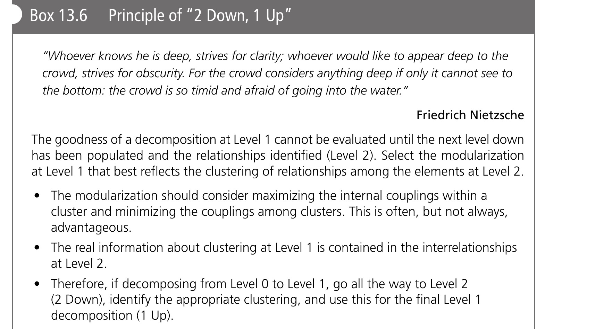{height=520px fig-align="center"}

::: {.notes}
Give students this box as the chapter's most quotable, most practically actionable principle — worth having them write down verbatim, since it's directly usable in their own project work. State it precisely: to judge whether a Level 1 decomposition is good, you must descend two levels down (to Level 2), examine the structure and interaction patterns you find there, and only *then* go back up one level to finalize your Level 1 groupings. Hence "2 Down, 1 Up" — descend two, then ascend one, in that specific order.

Emphasize why the order matters, since it's easy to try to shortcut this: if you commit to a Level 1 decomposition first and only later look at Level 2 to check it, you're liable to lock in a poor decomposition before you have the evidence to judge it — exactly the "30 students in two groups" trap from a couple of slides back. The discipline this principle imposes is to defer judgment on Level 1 until you've actually done the Level 2 work needed to justify it.
:::

## How Many Elements per Level? {.smaller}

- Chapter 8's air transportation service example works exactly this way: start from the Level 0 concept, propose a Level 1 trial decomposition organized by *sequence*, decompose to Level 2, examine clustering there, and only then finalize Level 1
- Experience suggests humans manage **7 ± 2** elements comfortably at each level of decomposition
- More than nine elements inhibits the designer and makes cross-element analysis combinatorially harder; fewer than five forces deeper decompositions (more levels, harder to "think vertically")

::: {.notes}
Tie the "2 Down, 1 Up" principle back to a concrete example students already know from Chapter 8: the air transportation service case worked exactly this way in practice — start from the Level 0 concept, propose a trial Level 1 decomposition organized around sequence, decompose that trial structure down to Level 2, examine what clustering patterns actually appear there, and only then go back and finalize the Level 1 structure. This is "2 Down, 1 Up" as an actual worked methodology, not just an abstract principle.

Bring back Miller's seven-plus-or-minus-two number from Chapter 2, now applied specifically to decomposition sizing at each level: experience suggests humans manage roughly seven, plus or minus two, elements comfortably at any given level of decomposition. Explain both failure directions concretely, since students should be able to recognize each: more than about nine elements at a single level inhibits the designer's ability to reason about the whole set at once, and makes cross-element analysis (checking every pairwise interaction) combinatorially harder as the count grows. Fewer than about five elements, on the other hand, forces the architecture into unnecessarily deep decompositions — more levels overall — which makes it harder to "think vertically" through the whole system, since there are now more layers to hold in mind simultaneously. The seven-plus-or-minus-two range is the sweet spot balancing both failure modes.
:::

## Modularity and Decomposition {.smaller}

- The choice of decomposition is linked to the resulting system's **modularity** — often called desirable, rarely clearly defined
- **Modularity** refers to a system's interfaces: a system is modular if its interfaces allow old modules to be removed and new ones inserted — most commonly in the context of an **open** number of variants (Lego's interface enables an open, if not infinite, number of shapes)
- **Commonality/platforms** refer instead to a **closed** set of variants (e.g., an alternator bracket for three known variants). Commonality focuses on cost-saving part/code sharing; modularity focuses on operational and design flexibility — related but distinct ideas

::: {.notes}
Introduce modularity as a concept that gets invoked constantly in engineering conversation, almost always as an unqualified virtue, but rarely defined precisely — this slide's job is to fix that. Tie the choice of decomposition directly to the resulting system's modularity: how you decompose determines what interfaces exist, and interfaces are exactly what modularity is about.

Give the precise definition: a system is modular if its interfaces allow old modules to be removed and new ones inserted in their place. Crucially, emphasize the word "open" in the slide — modularity is most powerfully associated with an *open*, potentially unbounded number of variants that could be swapped in. Lego is the canonical example: its brick interface (the stud/tube connector standard) supports an open, essentially unlimited variety of brick shapes, and anyone (not just the original manufacturer) can design a new brick that plugs into the existing system.

Now draw the careful distinction the slide is making, since commonality and modularity get conflated constantly in casual engineering talk: commonality (or platforming) instead refers to a *closed*, specifically known set of variants — the book's example is an alternator bracket designed to fit three known car models, not an open-ended interface standard. Commonality's motivation is fundamentally about cost savings through part or code sharing across those known variants; modularity's motivation is about operational and design *flexibility* — the ability to swap in something not yet known or designed. They're related (both involve deliberately designed interfaces) but conceptually distinct, and a system can have one property without the other.
:::

## Decomposition Plane: A Worked Example {.smaller}

- DSMs (Chapter 8) let the architect analyze a system against a clear objective — minimizing interconnections. But is minimizing interconnections always the right principle for decomposing a system?
- The two key ideas in decomposition are the **number of elements/chunks** (the easy part) and the **plane of decomposition** (the hard part)
- Consider a technical report on three concepts, each subjected to three types of analysis. The chapters could be organized **by concept** (Figure 13.10) — enabling broad cross-analysis judgment — or **by analysis**, enabling direct comparison of concepts against a metric. Neither is inherently right; the choice is a lens that enables creativity along one plane while repressing it along others

::: {.notes}
Reconnect to Chapter 8's DSM (Design Structure Matrix) tools, then push past them: DSMs let the architect analyze a system against one clear, well-defined objective — typically minimizing interconnections across a chosen boundary. But raise the deeper question this slide exists to ask: is minimizing interconnections actually always the *right* underlying principle for deciding how to decompose a system in the first place? The answer, developed through the rest of this section, is no — it depends entirely on which "plane" you're decomposing along.

State the two-part structure of any decomposition decision precisely: the number of elements or chunks (which, per the previous slide, is the comparatively easy part — Miller's number gives good guidance) and the *plane* of decomposition (which is the genuinely hard part, and where architectural judgment really matters).

Walk through the worked example carefully, since it's a small, concrete case students can hold entirely in their heads: imagine writing a technical report about three different concepts, each one evaluated against three different types of analysis (say, cost, performance, and risk). You could organize the report's chapters *by concept* — one chapter per concept, discussing all three analyses within it (this is Figure 13.10, up next) — which supports broad, holistic judgment about each concept as a whole. Or you could organize *by analysis type* — one chapter per analysis, comparing all three concepts against that one metric — which supports direct, apples-to-apples comparison of concepts on a single dimension. Land on the key insight: neither organizational choice is inherently more "correct." Each is a lens that enables a certain kind of creative or analytical thinking along one plane, while simultaneously suppressing or making harder that same kind of thinking along the other plane. Choosing a decomposition plane is choosing what kind of thinking you want to make easy.
:::

## Figure 13.10 · Potential Decomposition Planes {.smaller}

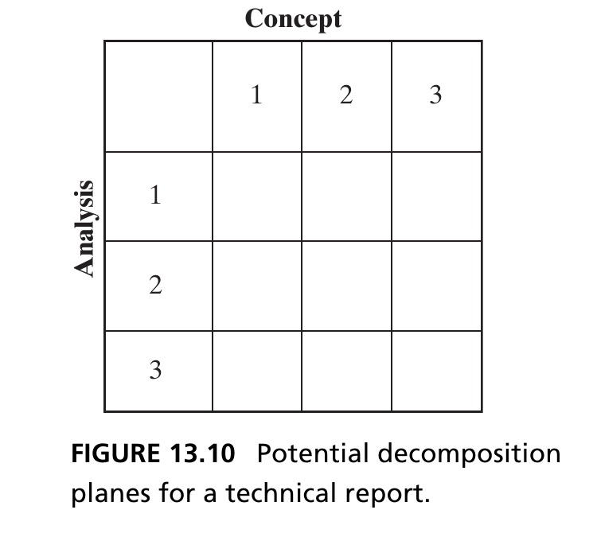{height=520px fig-align="center"}

::: {.notes}
Walk through the actual grid shown here: three concepts along one axis, three types of analysis along the other, giving a 3×3 space of possible report content. Point out visually how the "by concept" organization groups the grid into three row-wise chapters, while "by analysis" would instead group it into three column-wise chapters — same underlying information, two entirely different decomposition planes cutting through the exact same 3×3 space. This is a good moment to have students sketch a third possible plane themselves (say, organizing by author, or by project phase) and discuss what that would make easier or harder to see, reinforcing that the space of possible decomposition planes for any given problem is often larger than the two most obvious ones.
:::

## Box 13.7 · Principle of Elegance {.smaller}

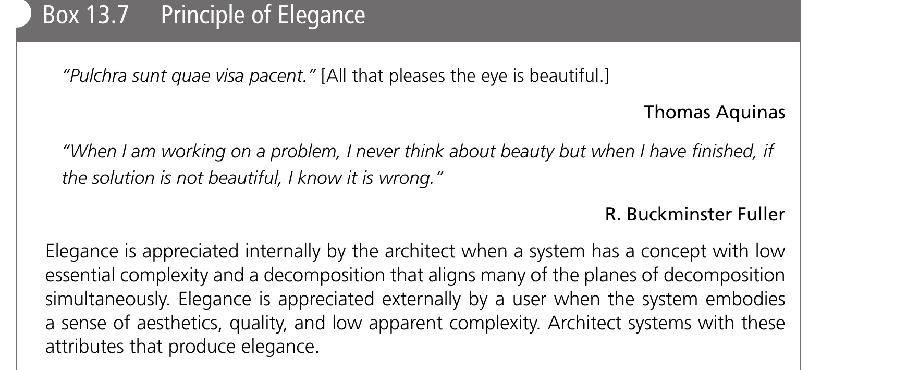{height=440px fig-align="center"}

- The choice of decomposition plane is a strong lever on the **elegance** of the resulting architecture

::: {.notes}
Walk through this box, which formally names the property the whole chapter has been building toward: elegance. Elegant architectures, per the box, are those where the decomposition aligns cleanly across multiple planes at once (form, function, supplier, operation — the very planes we've just been discussing), producing simple, minimal interfaces rather than a tangle of cross-cutting connections. Point out this is the formal payoff of everything covered so far in Section 13.3: 2 Down 1 Up gives you a *method* for judging whether a decomposition is locally good, but elegance is the broader property you're actually aiming for — a decomposition where multiple planes reinforce each other rather than fighting each other.

State plainly what the bullet beneath the box is telling students to carry forward: the specific choice of *which* plane (or combination of planes) to decompose along is one of the architect's strongest levers for achieving — or failing to achieve — that elegance. This sets up the rest of the section directly: the next few slides examine specific planes (form vs. function, then several more in Box 13.8) precisely so students have a working vocabulary of planes to actually choose among.
:::

## Form vs. Function Decomposition {.smaller}

- **Form decomposition** allocates one or more elements of form to each Level 1 entity — form is clearly divided (e.g., Hybrid Car by body, chassis, drivetrain, interior). Advantage: concrete, and properties like mass sum linearly, without emergence
- **Function decomposition** lists system functions as the Level 1 entities (support/comfort passengers, store energy, produce power, isolate passengers from vibration...). This highlights which types of **emergence** the decomposition will force the architect to confront
- There is no reason form and function are the *only* two decomposition planes — a firm's competitive advantage might instead hinge on the interface between two dissimilar **suppliers**

::: {.notes}
Give students the two most common — but not the only — decomposition planes in detail, using the Hybrid Car concept from Chapter 12 as the running example, since students already know it. Form decomposition allocates one or more concrete elements of physical form to each Level 1 entity — the Hybrid Car by body, chassis, drivetrain, interior, say. Its advantage is being concrete and tangible: properties like mass simply sum linearly across a form decomposition, without emergence complicating the bookkeeping, since form (unlike function) aggregates additively, as established back in Chapter 3.

Function decomposition instead lists the system's actual functions as the Level 1 entities — supporting/comforting passengers, storing energy, producing power, isolating passengers from vibration, and so on. Its value is exactly the opposite of form decomposition's: rather than making bookkeeping easy, it actively highlights which types of *emergence* the architect will be forced to confront, since function is where emergent, non-additive behavior actually shows up (again recalling Chapter 3's zooming/emergence pairing).

Close by opening the space back up: there's no principled reason form and function are the *only* two planes worth considering — the book's own example is that a firm's genuine competitive advantage might hinge specifically on the interface between two dissimilar suppliers, making "supplier" itself a meaningful decomposition plane, distinct from either form or function. This directly previews Box 13.8's much longer catalog of possible planes, coming up in a few slides.
:::

## Figure 13.11 · Form vs. Function {.smaller}

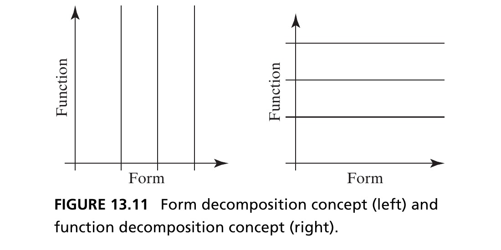{height=460px fig-align="center"}

::: {.notes}
Walk through the two side-by-side diagrams here as the direct visual companion to the previous slide's text. On one side, the form-decomposition tree shows the Hybrid Car split by physical elements (body, chassis, drivetrain, interior); on the other, the function-decomposition tree shows the same overall concept split by what it does (support/comfort passengers, store energy, produce power, isolate from vibration). Have students trace one specific physical element — say, the drivetrain — and identify which function(s) it's actually responsible for delivering; then trace one function — say, "produce power" — and identify which physical form elements are involved in delivering it. This exercise makes concrete a point from Chapter 2: form and function are related but genuinely distinct domains, and a single physical element can participate in multiple functions, just as a single function can require multiple physical elements working together.
:::

## Conway's Law {.smaller}

::: {.callout-note appearance="simple" icon=false}
**Conway's Law** (1968): *"Organizations which design systems are constrained to produce designs which are copies of the communication structures of these organizations."*
:::

- The modularity of a system is inextricably intertwined with the organization that develops it — cited as a storyline for the Mars Climate Orbiter failure (two teams, metric vs. imperial units, wrong orbital-insertion altitude)
- The best formulation: product and organization are **coupled**, not simply "product mirrors organization" or vice versa. Modern research finds strong evidence for a causal link between organization and product modularity in software

::: {.notes}
Introduce Conway's Law as yet another decomposition plane — the "organizational" plane — worth taking seriously precisely because it's usually invisible to engineers who think about decomposition purely in technical terms. Read the 1968 formulation carefully: organizations which design systems are constrained to produce designs that are copies of the communication structures of those organizations. In plain terms, if your company has three separate teams that don't talk to each other much, your product's architecture will very likely end up with three correspondingly separate modules, whether or not that's the technically ideal decomposition.

Give the Mars Climate Orbiter as the sobering real-world illustration: one team's software used metric units, another used imperial units for the same trajectory-correction calculations, and this mismatch — a direct byproduct of how the work was organizationally divided — led to an incorrect orbital-insertion altitude and loss of the spacecraft. This is Conway's Law manifesting as mission failure, not just an inconvenient inefficiency.

Push students toward the more nuanced, contemporary formulation, since a naive reading of Conway's Law can suggest the causality runs only one direction: the better framing is that product architecture and organizational structure are genuinely *coupled* — each influences the other — rather than simply "product mirrors organization" (which treats organization as the sole cause) or the reverse. Mention that modern empirical research (particularly in software engineering, where module boundaries are easiest to measure precisely) finds strong evidence for a real causal link running in both directions between organizational structure and product modularity — this is an active area of ongoing research, not a settled historical curiosity.
:::

## The Cost of Modularity {.smaller}

- It is easy to argue more modularity is better. But modularity **carries a cost** — recall Figure 13.8: even where interfaces already exist, building modularity *into* an interface means meeting a range of performance goals (extra structural loads, unused connector pins, and so on)

::: {.fragment .callout-tip}
Alan Perlis: *"Wherever there is modularity there is the potential for misunderstanding: hiding information implies a need to check communication."*
:::

- Box 13.8 catalogs 12 potential decomposition planes — by no means exhaustive — with guidance on each. Alignment of these planes can produce more elegant decompositions, where possible

::: {.notes}
Push back explicitly against the naive assumption that "more modularity is always better," since students will very likely have absorbed that assumption uncritically from other courses or from general engineering culture. It's easy to argue for more modularity, but the slide's point is that modularity carries a real cost — recall Figure 13.8 from Section 13.2: even in places where an interface already exists in some form, deliberately building genuine *modularity* into that interface (meaning, designing it to accommodate variants or replacements not yet built) means engineering it to meet a wider range of performance goals than the specific, known use case strictly requires — extra structural loads to handle unknown future modules, unused connector pins reserved for capabilities that may never materialize, and so on. Modularity is an investment in future flexibility, paid for in present-day cost and complexity.

Read the Alan Perlis quote carefully, since it's a dense, quotable line worth unpacking: "wherever there is modularity there is the potential for misunderstanding: hiding information implies a need to check communication." Modularity works by hiding information behind a clean interface — that's the whole point — but hiding information always carries the risk that the parties on either side of the interface misunderstand each other about exactly what's being hidden, which means real communication and interface specification discipline is required precisely *because* of the modularity, not despite it.

Close by introducing Box 13.8 as the chapter's most comprehensive practical reference: a catalog of a dozen potential decomposition planes, explicitly presented as non-exhaustive, each with brief guidance on when and why it matters. Tell students this is worth returning to as a checklist during their own future architecture work — before finalizing a decomposition, run down this list and ask whether aligning the decomposition along additional planes might improve its elegance.
:::

## Box 13.8 · Potential Planes for Decomposition (1/4) {.smaller}

| Plane | Guidance |
|---|---|
| **Delivered function & emergence** | Don't spread key delivered functions across many elements — it complicates managing emergence. |
| **Form & structure** | Cluster high-connectivity elements; avoid placing interfaces where connectivity is high. |
| **Design latitude & change propagation** | Group tightly-coupled designs to maximize latitude and limit change propagation. |
| **Changeability & evolution** | Place interfaces so modules can combine into platforms and support evolution. |

::: {.notes}
Walk through this first group of four planes, giving each a moment of concrete grounding rather than just reading the guidance aloud. "Delivered function & emergence" warns against spreading an important externally-delivered function across too many elements — recall from Chapter 5 that the primary function is what crosses the system boundary and delivers value, and if that function's implementation is scattered across many entities, managing its emergence gets much harder to reason about. "Form & structure" is a direct DSM-style clustering rule from Chapter 8: put high-connectivity elements together, and specifically avoid placing an interface boundary right where connectivity between elements happens to be highest. "Design latitude & change propagation" is about engineering flexibility: group designs that are already tightly coupled together, so that when one has to change, the change doesn't have to propagate outward across a module boundary into unrelated parts of the system. "Changeability & evolution" looks further out in time than the previous plane: place interfaces specifically where they'll let whole modules recombine into product platforms and support the system's evolution across future product generations, not just its current requirements.
:::

## Box 13.8 · Potential Planes for Decomposition (2/4) {.smaller}

| Plane | Guidance |
|---|---|
| **Integration transparency** | Create interfaces that enable easy testing and visibility at the interface. |
| **Suppliers** | Interface points let suppliers work independently — they can define modularity, or defy it. |
| **Openness** | Balance third-party innovation/network effects against information-sharing drawbacks. |
| **Legacy components** | Reuse of legacy components constrains decomposition and challenges interface design. |

::: {.notes}
Continue through the second group of four planes. "Integration transparency" asks for interfaces designed specifically to make testing easy and to give visibility into what's actually happening at the boundary — an interface you can't observe or test through is one that will hide integration problems until it's expensive to fix them. "Suppliers" reconnects directly to the Saturn V case study coming up later in this lecture: interface points can be deliberately placed to let different suppliers work independently and creatively on their piece — and the guidance's second half is worth emphasizing, since it's a subtle point — suppliers themselves can either *define* modularity for you (a supplier's own product boundaries might dictate where your interfaces naturally fall) or actively *defy* it (a supplier might resist a clean interface that doesn't match how they want to sell their product). "Openness" is about a strategic tradeoff: if you're deciding whether to open your interfaces to third parties, weigh the potential innovation and network-effect benefits against the real drawback of having to share more information than you might otherwise want to. "Legacy components" is a practical constraint many real projects face: if you're reusing existing legacy components, their pre-existing boundaries and interfaces will constrain what decomposition and interface designs are even feasible for the new system — you're not decomposing on a blank slate.
:::

## Box 13.8 · Potential Planes for Decomposition (3/4) {.smaller}

| Plane | Guidance |
|---|---|
| **Clockspeed of technology change** | Let technologies evolving at different rates be changed out asynchronously. |
| **Marketing & sales** | Enable differentiating features and cosmetic refreshes without architectural change. |
| **Operations & interoperability** | Delineate operator touch points and wear parts for easy training, maintenance, repair. |

::: {.notes}
Continue through the third group of three planes. "Clockspeed of technology change" is about designing interfaces so that components evolving at genuinely different rates — say, a fast-moving electronics module alongside a slow-moving mechanical chassis — can be swapped out asynchronously, each on its own natural upgrade cycle, without forcing the whole system to be redesigned whenever any one piece changes. "Marketing & sales" asks the decomposition to support the business side of the product directly: enabling differentiating features and cosmetic refreshes (new trim levels, new colors, new feature bundles) without requiring deep architectural change underneath. "Operations & interoperability" is about the people who will actually run and maintain the system day to day: delineate operator touch points and wear parts clearly enough that training, maintenance, and repair are all straightforward, rather than requiring specialized knowledge of internal boundaries that were never designed with operations in mind.
:::

## Box 13.8 · Potential Planes for Decomposition (4/4) {.smaller}

| Plane | Guidance |
|---|---|
| **Timing of investment** | Modularize to phase development spending across time. |
| **Organization** | Match the modularization of the system to the organization (Conway's Law). |

::: {.notes}
Finish the catalog with the last two planes. "Timing of investment" is a financial and staging consideration: modularize specifically to phase development spending over time — letting an initial module deliver real value and start generating returns before later modules require their own investment, rather than needing the entire system funded and built all at once. "Organization" closes the loop directly back to Conway's Law, discussed a few slides ago: match the system's modularization to the organization that will build and maintain it, since — per Conway's Law — a mismatch between the two tends to resolve itself eventually anyway, usually at a cost nobody planned for.

Wrap up the whole Box 13.8 sequence by reminding students these dozen planes are explicitly *not* exhaustive — they're a practical starting checklist, not a closed, complete taxonomy. The chapter's actual message isn't "consider all twelve every time," but rather: be aware that many possible planes exist beyond the obvious form/function split, and look for opportunities to *align* several of them simultaneously, since that alignment is precisely what produces the more elegant decompositions the chapter has been building toward all section.
:::

## Section 13.3 Summary {.smaller}

- The decomposition of a system is one of the architect's **most powerful decisions** — a poor decomposition can break lines of communication or hurt future modularity
- Test a decomposition's goodness by the Principle of **2 Down, 1 Up**: descend to Level 2, examine the aggregation, and only then finalize Level 1
- Many planes of decomposition are possible (form, function, supplier, operation, and Box 13.8's twelve more) — the architect must judge which emphasis matters and align planes where possible, in pursuit of **elegance**

::: {.notes}
Use this as a checkpoint for the whole of Section 13.3, mirroring the Section 13.2 summary earlier. Students should now be able to state: decomposition is one of the architect's single most powerful and consequential decisions, since a poorly chosen one can break down lines of communication (Conway's Law) or foreclose future modularity options; the way to test whether any given decomposition is good is the "2 Down, 1 Up" principle — you cannot judge Level 1 without first examining Level 2's actual structure; and there are many valid planes along which to decompose a system (form, function, supplier, operation, and the twelve further planes cataloged in Box 13.8), with no universally "correct" choice — the architect's job is to judge which planes matter most for the system at hand, and to align as many of them as possible, since that alignment is precisely what produces elegance. With decomposition now fully covered, the chapter turns to its closing chapter-level summary before the case study.
:::

## 13.4 Chapter Summary {.smaller}

- Managing complexity is a central task of the architect. **Apparent complexity** (complicatedness) is distinct from **essential complexity**, which is driven purely by required functionality
- The architect invests in abstraction, hierarchy, decomposition, and recursion to reduce apparent complexity — potentially at the cost of increasing **actual** complexity
- The goodness of a decomposition is judged by testing it two levels down (**2 Down, 1 Up**); many decomposition planes are possible, and the architect must choose deliberately

::: {.callout-tip}
**Reference**: Crawley, E., Cameron, B., & Selva, D. (2016). *System Architecture: Strategy and Product Development for Complex Systems*. Pearson. Chapter 13.
:::

::: {.notes}
Deliver this as the chapter's overall closing statement before moving into the case study. Managing complexity is genuinely a central, ongoing task of the architect — not a one-time step early in a project. Restate the chapter's two core distinctions one final time, since they're worth hearing repeated in slightly different words for retention: apparent complexity (complicatedness) is about human perception and is distinct from essential complexity, which is instead driven purely by what functionality is actually required. The architect's tools — abstraction, hierarchy, decomposition, recursion — are all investments made to reduce apparent complexity, but that investment potentially comes at the cost of increasing actual complexity through new interfaces, so it must always be a deliberate, examined choice.

Restate the practical decomposition guidance one more time as the takeaway students should leave with: judge any decomposition's goodness by testing it two levels down before finalizing it one level up (2 Down, 1 Up), and recognize that many decomposition planes are possible — the architect's real skill lies in choosing deliberately among them, and aligning several where possible, rather than defaulting unreflectively to whichever plane seems most obvious.

Transition into the case study by framing its purpose explicitly: everything just covered is abstract and principle-level; the case study that follows is going to make it concrete by contrasting two real, large-scale aerospace programs — one where decomposition alignment worked out extremely well (Saturn V), and one where it very much did not (Space Station Freedom) — to show these aren't just academic distinctions, they have real, measurable consequences for whether a multi-billion-dollar program succeeds or struggles.
:::

# Case Study: Decomposition of Saturn V and Space Station *Freedom*

## Box 13.9 · Two Complex Space Systems {.smaller}

- We compare two complex space systems: the **Saturn V** launch vehicle (1960s) and Space Station ***Freedom*** (proposed, 1980s) — to illustrate the importance of *alignment* across planes of decomposition
- Thesis: the Saturn V shows good alignment across decomposition planes; the Space Station presents a far more coupled, complex picture — and the relative success of the two programs can be partly attributed to this difference

::: {.notes}
Set up the case study's structure and its central thesis clearly before diving into either program's details. Both Saturn V and Space Station Freedom are large, genuinely complex space systems, but from different eras — Saturn V from NASA's 1960s Apollo program, Space Station Freedom a proposed (and, importantly, never fully built) station from the 1980s. The comparison exists specifically to illustrate the importance of *alignment* across the decomposition planes covered throughout Section 13.3 — form, function, supplier, operation, and the rest.

State the thesis plainly, since it's what the rest of the case study sets out to demonstrate with real data: the Saturn V's architecture shows genuinely good alignment across its decomposition planes, while Space Station Freedom's architecture presents a far more coupled, tangled picture where those same planes actively work against each other. And be careful with the causal claim, since the book is appropriately careful too: the relative success of these two programs can be *partly* attributed to this difference in decomposition alignment — not the sole cause of either outcome, but a real and demonstrable contributing factor, which is exactly the kind of claim careful architectural analysis can support.
:::

## Saturn V: The Launch Vehicle {.smaller}

{height=460px fig-align="center"}

::: {.side-caption}
The Saturn V, developed by NASA 1962–1968, launched the Apollo Command Service Module, Lunar Module, and crew from Earth's surface into orbit and toward the Moon. Its solution-neutral function: accelerate a payload by a change in velocity (Delta-ν) in each of three stages. Source: Crawley, Cameron & Selva (2016), Fig. 13.12.
:::

::: {.notes}
Ground the Saturn V case in the specific facts that make the following tables interpretable. Developed by NASA between 1962 and 1968 — note this overlaps directly with Chapter 1's opening story about the June 1962 lunar-orbit-rendezvous decision, so this is a nice callback for students who took this course from the start. The vehicle launched the Apollo Command/Service Module, the Lunar Module, and the crew from Earth's surface all the way into orbit and toward the Moon.

State its solution-neutral function precisely, using the exact vocabulary from Chapter 7: accelerate a payload by a change in velocity — Delta-nu — and crucially, this happens in each of three separate stages. That three-stage structure is the whole key to understanding the decomposition tables coming up next: the Saturn V's Level 1 decomposition is, quite simply, Stage 1, Stage 2, and Stage 3, and the question the next two slides investigate is how those three stages relate to each other across the function, supplier, and operation planes.
:::

## Table 13.1 · Saturn V — Function & Supplier Arrays {.smaller}

```{=html}
<div style="display:flex; gap:2.5rem; justify-content:center; font-size:0.6em;">
<div>
<div style="text-align:center; font-weight:bold; margin-bottom:0.3rem;">Solution-Neutral Function</div>
<table style="border-collapse:collapse;">
<tr><th></th><th style="border:1px solid #888; padding:4px 12px;">Stage 1</th><th style="border:1px solid #888; padding:4px 12px;">Stage 2</th><th style="border:1px solid #888; padding:4px 12px;">Stage 3</th></tr>
<tr><th style="border:1px solid #888; padding:4px 12px;">Stage 1</th><td style="border:1px solid #888; padding:4px 12px; text-align:center;">Delta ν1</td><td style="border:1px solid #888;"></td><td style="border:1px solid #888;"></td></tr>
<tr><th style="border:1px solid #888; padding:4px 12px;">Stage 2</th><td style="border:1px solid #888;"></td><td style="border:1px solid #888; padding:4px 12px; text-align:center;">Delta ν2</td><td style="border:1px solid #888;"></td></tr>
<tr><th style="border:1px solid #888; padding:4px 12px;">Stage 3</th><td style="border:1px solid #888;"></td><td style="border:1px solid #888;"></td><td style="border:1px solid #888; padding:4px 12px; text-align:center;">Delta ν3</td></tr>
</table>
</div>
<div>
<div style="text-align:center; font-weight:bold; margin-bottom:0.3rem;">Internal Function</div>
<table style="border-collapse:collapse;">
<tr><th></th><th style="border:1px solid #888; padding:4px 12px;">Stage 1</th><th style="border:1px solid #888; padding:4px 12px;">Stage 2</th><th style="border:1px solid #888; padding:4px 12px;">Stage 3</th></tr>
<tr><th style="border:1px solid #888; padding:4px 12px;">Stage 1</th><td style="border:1px solid #888; padding:4px 12px; text-align:center;">TGLA</td><td style="border:1px solid #888;"></td><td style="border:1px solid #888;"></td></tr>
<tr><th style="border:1px solid #888; padding:4px 12px;">Stage 2</th><td style="border:1px solid #888; padding:4px 12px; text-align:center;">L</td><td style="border:1px solid #888; padding:4px 12px; text-align:center;">TGLA</td><td style="border:1px solid #888;"></td></tr>
<tr><th style="border:1px solid #888; padding:4px 12px;">Stage 3</th><td style="border:1px solid #888;"></td><td style="border:1px solid #888; padding:4px 12px; text-align:center;">L</td><td style="border:1px solid #888; padding:4px 12px; text-align:center;">TGLA</td></tr>
</table>
</div>
<div>
<div style="text-align:center; font-weight:bold; margin-bottom:0.3rem;">Supplier</div>
<table style="border-collapse:collapse;">
<tr><th></th><th style="border:1px solid #888; padding:4px 10px;">Stage 1</th><th style="border:1px solid #888; padding:4px 10px;">Stage 2</th><th style="border:1px solid #888; padding:4px 10px;">Stage 3</th></tr>
<tr><th style="border:1px solid #888; padding:4px 10px;">Stage 1</th><td style="border:1px solid #888; padding:4px 8px; text-align:center;">Boeing</td><td style="border:1px solid #888;"></td><td style="border:1px solid #888;"></td></tr>
<tr><th style="border:1px solid #888; padding:4px 10px;">Stage 2</th><td style="border:1px solid #888;"></td><td style="border:1px solid #888; padding:4px 8px; text-align:center;">North American</td><td style="border:1px solid #888;"></td></tr>
<tr><th style="border:1px solid #888; padding:4px 10px;">Stage 3</th><td style="border:1px solid #888;"></td><td style="border:1px solid #888;"></td><td style="border:1px solid #888; padding:4px 8px; text-align:center;">McDonnell</td></tr>
</table>
</div>
</div>
```

::: {.side-caption}
T-creating thrust, G-creating guidance torques, L-carrying structural load, A-reacting aerodynamic loads. Source: Crawley, Cameron & Selva (2016), Table 13.1.
:::

::: {.notes}
Walk through all three of these small arrays as N-Squared-style tables (recall Chapter 2's introduction of N-Squared tables for relationships) — rows and columns are the three stages, and diagonal or off-diagonal cells describe the relationship between a stage and itself or another stage.

The Solution-Neutral Function array is almost perfectly diagonal: Stage 1 alone delivers Delta-nu-1, Stage 2 alone delivers Delta-nu-2, Stage 3 alone delivers Delta-nu-3 — each stage's core function is self-contained, with essentially no off-diagonal entries. That's about as clean and decoupled as a decomposition can get on this plane.

The Internal Function array is the one deliberate exception, and it's worth pausing on precisely because it's the one interesting entry in an otherwise very clean picture: each stage delivers its own thrust, guidance, structural load, and aerodynamic-load functions (TGLA) on the diagonal — but there's one off-diagonal entry, "L" (carrying structural load), appearing where Stage 2 meets Stage 1's row, and again where Stage 3 meets Stage 2's row. This single off-diagonal L represents the physical stacking of the rocket: each stage's structural load has to be carried by the stage below it, since they're literally bolted on top of one another. This is the one place complexity genuinely couples across the stage boundaries, and it's important precisely because it's isolated — a single, well-understood interface, not a tangle.

The Supplier array is again cleanly diagonal: Stage 1 built by Boeing, Stage 2 by North American, Stage 3 by McDonnell — three different companies, each fully responsible for one stage, with no shared supplier responsibility crossing stage boundaries.
:::

## Table 13.1 · Saturn V — Operation Array {.smaller}

```{=html}
<div style="display:flex; justify-content:center; font-size:0.7em;">
<table style="border-collapse:collapse;">
<tr><th></th><th style="border:1px solid #888; padding:6px 16px;">Stage 1</th><th style="border:1px solid #888; padding:6px 16px;">Stage 2</th><th style="border:1px solid #888; padding:6px 16px;">Stage 3</th></tr>
<tr><th style="border:1px solid #888; padding:6px 16px;">Stage 1</th><td style="border:1px solid #888; padding:6px 16px; text-align:center;">Fire 1</td><td style="border:1px solid #888;"></td><td style="border:1px solid #888;"></td></tr>
<tr><th style="border:1px solid #888; padding:6px 16px;">Stage 2</th><td style="border:1px solid #888;"></td><td style="border:1px solid #888; padding:6px 16px; text-align:center;">Fire 2</td><td style="border:1px solid #888;"></td></tr>
<tr><th style="border:1px solid #888; padding:6px 16px;">Stage 3</th><td style="border:1px solid #888;"></td><td style="border:1px solid #888;"></td><td style="border:1px solid #888; padding:6px 16px; text-align:center;">Fire 3</td></tr>
</table>
</div>
```

- Nominal operations: fire Stage 1, drop Stage 1, fire Stage 2, drop Stage 2, fire Stage 3 — a simple sequential set. While any one stage operates, no other attached stage is active

::: {.notes}
Complete the four-array picture with the Operation array, which is exactly as clean as the previous three: Stage 1's operation is "Fire 1," Stage 2's is "Fire 2," Stage 3's is "Fire 3" — each stage fires once, on the diagonal, with no off-diagonal entries at all. The nominal sequence of operations is dead simple: fire Stage 1, drop Stage 1, fire Stage 2, drop Stage 2, fire Stage 3. Point out the key temporal property this sequence has: while any one stage is actively operating, no other attached stage is simultaneously active — there's no period where two stages are both doing something at once, which massively simplifies both the physical interface design and the operational logic. Having now walked through all four arrays individually, the next slide steps back to explain *why* this particular pattern — sparse, diagonal, cleanly decomposed — mattered so much for the program's actual success.
:::

## Why the Saturn V Succeeded {.smaller}

- The Solution-Neutral Function, Supplier, and Operation arrays each suggest a **sparse, uncoupled** relationship among elements of form, and a strong potential alignment of decomposition planes — the Internal Function array is the deliberate exception
- The key architectural decision: **replicate** each principal internal function (thrust, guidance, structural load, aerodynamic loads) in *every* stage — the only important internal interface was the structural-load path (**L**) transmitting force up the stack
- This replication created some sub-optimality (a single guidance system could have served the whole vehicle) — but let each supplier integrate and test its stage nearly independently, with dead-simple inter-stage interfaces (a bolt pattern plus a few wires)

::: {.fragment .callout-tip}
The Saturn V was the largest launch vehicle ever built and had a **perfect launch record** — alignment of decomposition planes, simple interfaces, decentralized testing, and simple integration were major contributors.
:::

::: {.notes}
Synthesize the four arrays just reviewed into the chapter's actual analytical conclusion. Three of the four arrays — Solution-Neutral Function, Supplier, and Operation — all independently point toward the same clean, sparse, uncoupled Stage 1 / Stage 2 / Stage 3 decomposition. That's alignment: multiple independent planes all agreeing on the same natural boundaries. The Internal Function array is the deliberate, isolated exception, and it's worth restating why that exception was deliberate rather than accidental: the architects chose to *replicate* each principal internal function (thrust, guidance, structural load, aerodynamic loads) inside every single stage, rather than sharing, say, one guidance system across the whole vehicle. That replication meant the only genuinely important internal interface anywhere in the vehicle was the structural-load path — the physical stacking connection transmitting force from an upper stage down through the one below it.

Be honest about the cost of this choice, since it's a good teaching moment about tradeoffs in architecture: this replication was not perfectly efficient — a single shared guidance system, in principle, could have served the entire vehicle, saving mass and cost. That's a real sub-optimality, deliberately accepted. But in exchange, it let each of the three different suppliers (Boeing, North American, McDonnell) integrate and test their own stage nearly completely independently, with dead-simple interstage interfaces — essentially a bolt pattern and a handful of wires.

Land on the payoff, stated in the fragment: the Saturn V was the largest launch vehicle ever built and achieved a perfect launch record. Make the causal claim carefully and precisely, the way the book does: alignment of decomposition planes, resulting simple interfaces, decentralized testing enabled by that simplicity, and correspondingly simple integration were *major contributors* to that success — not the only factor (rigorous engineering discipline mattered enormously too), but a real, identifiable one that traces directly back to the deliberate architectural choices reviewed in this case study.
:::

## Space Station *Freedom* {.smaller}

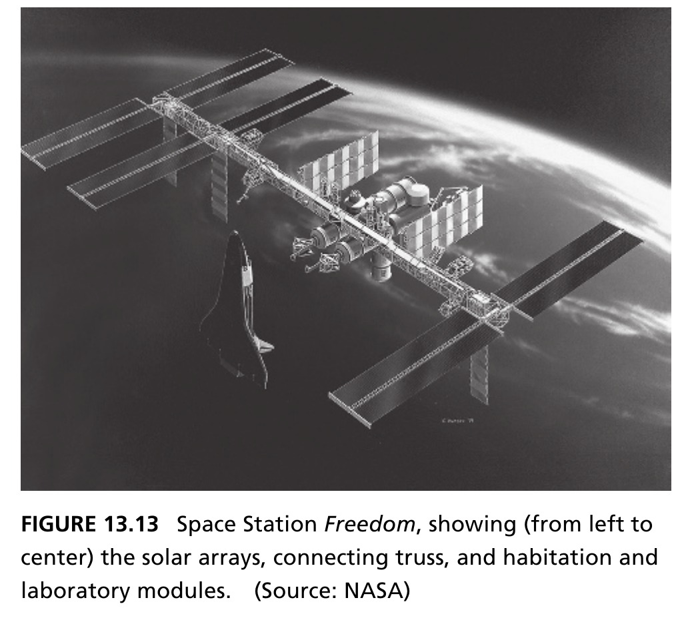{height=360px fig-align="center"}

::: {.side-caption}
Space Station *Freedom* (SSF), a semi-permanent Earth-orbiting station announced in 1984, was never built — over a decade it underwent design changes and eventually evolved into the International Space Station (1993). Source: Crawley, Cameron & Selva (2016), Fig. 13.13.
:::

- Solution-neutral function: a laboratory for micro-gravity science and Earth observation, a base for space operations, and — a strong Cold-War political function — cementing international relationships (elements from Europe, Canada, Japan)

::: {.notes}
Introduce the contrasting case directly, making sure students register the key contextual fact immediately: Space Station Freedom, as originally announced in 1984, was never actually built as such — over roughly a decade it underwent repeated design changes and eventually evolved into what became the International Space Station in 1993. That's already a very different outcome from the Saturn V's clean, successful program, and the rest of this case study explains why.

Walk through SSF's solution-neutral function, and notice immediately how much more heterogeneous it is compared to the Saturn V's single, clean "accelerate a payload by Delta-nu": SSF was meant to be a laboratory for micro-gravity science and Earth observation, simultaneously a base for space operations, and — this third function is worth emphasizing since it's not a technical requirement at all — it carried a strong Cold-War-era political function of cementing international relationships, given that the station's elements were being contributed by multiple partner nations (Europe, Canada, Japan, alongside the US). Point out to students that this third function is a good example of something from Chapter 5 — value-related function driven by non-technical stakeholder interests — and flag it as a preview of why the decomposition tables on the next two slides look so much messier than the Saturn V's.
:::

## Table 13.2 · SSF — Function Arrays {.smaller}

```{=html}
<div style="display:flex; gap:2.5rem; justify-content:center; font-size:0.6em;">
<div>
<div style="text-align:center; font-weight:bold; margin-bottom:0.3rem;">Solution-Neutral Function</div>
<table style="border-collapse:collapse;">
<tr><th></th><th style="border:1px solid #888; padding:4px 10px;">Solar Array</th><th style="border:1px solid #888; padding:4px 10px;">Truss</th><th style="border:1px solid #888; padding:4px 10px;">Modules</th></tr>
<tr><th style="border:1px solid #888; padding:4px 10px;">Solar Array</th><td style="border:1px solid #888; padding:4px 10px; text-align:center;">ISM</td><td style="border:1px solid #888; padding:4px 10px; text-align:center;">ISM</td><td style="border:1px solid #888; padding:4px 10px; text-align:center;">ISM</td></tr>
<tr><th style="border:1px solid #888; padding:4px 10px;">Truss</th><td style="border:1px solid #888; padding:4px 10px; text-align:center;">ISM</td><td style="border:1px solid #888; padding:4px 10px; text-align:center;">ISM</td><td style="border:1px solid #888; padding:4px 10px; text-align:center;">ISM</td></tr>
<tr><th style="border:1px solid #888; padding:4px 10px;">Modules</th><td style="border:1px solid #888; padding:4px 10px; text-align:center;">ISM</td><td style="border:1px solid #888; padding:4px 10px; text-align:center;">ISM</td><td style="border:1px solid #888; padding:4px 10px; text-align:center;">ISM</td></tr>
</table>
</div>
<div>
<div style="text-align:center; font-weight:bold; margin-bottom:0.3rem;">Internal Function</div>
<table style="border-collapse:collapse;">
<tr><th></th><th style="border:1px solid #888; padding:4px 10px;">Solar Array</th><th style="border:1px solid #888; padding:4px 10px;">Truss</th><th style="border:1px solid #888; padding:4px 10px;">Modules</th></tr>
<tr><th style="border:1px solid #888; padding:4px 10px;">Solar Array</th><td style="border:1px solid #888; padding:4px 10px; text-align:center;">PL</td><td style="border:1px solid #888; padding:4px 10px; text-align:center;">PL</td><td style="border:1px solid #888; padding:4px 10px; text-align:center;">P</td></tr>
<tr><th style="border:1px solid #888; padding:4px 10px;">Truss</th><td style="border:1px solid #888; padding:4px 10px; text-align:center;">PL</td><td style="border:1px solid #888; padding:4px 10px; text-align:center;">PLEA</td><td style="border:1px solid #888; padding:4px 10px; text-align:center;">PLE</td></tr>
<tr><th style="border:1px solid #888; padding:4px 10px;">Modules</th><td style="border:1px solid #888; padding:4px 10px; text-align:center;">P</td><td style="border:1px solid #888; padding:4px 10px; text-align:center;">PLE</td><td style="border:1px solid #888; padding:4px 10px; text-align:center;">PLEC</td></tr>
</table>
</div>
</div>
```

::: {.side-caption}
Left legend: I-international relationships, S-space operations, M-micro-gravity science. Right legend: P-provide power, L-carry structural load, E-conduct experiments, A-attitude control, C-house crew. Source: Crawley, Cameron & Selva (2016), Table 13.2.
:::

::: {.notes}
Contrast these two arrays directly against their Saturn V counterparts from a few slides back, since the difference is the entire point. The Solution-Neutral Function array here is completely dense — every single cell, including every off-diagonal one, contains "ISM" (international relationships, space operations, micro-gravity science). Compare this explicitly to the Saturn V's nearly-empty-off-diagonal array: where Saturn V's function array told you exactly how to decompose (each stage does its own thing), SSF's function array tells you almost nothing useful about how to decompose, because every element — Solar Array, Truss, Modules — is entangled with every other element on all three functions simultaneously.

The Internal Function array is nearly as bad: notice power (P) and structural load (L) both extend to nearly every element (Solar Array, Truss, and Modules all need power; Truss and Modules both carry structural load), and the Truss row/column in particular picks up power, load, experiments, *and* attitude control (PLEA) — a single element responsible for four distinct internal functions simultaneously. Compare this to Saturn V's Internal Function array, which had exactly one isolated off-diagonal coupling (structural load, L) — here, by contrast, there are couplings almost everywhere you look. This is architecturally very different from Saturn V's clean replication strategy, and it foreshadows real integration difficulty.
:::

## Table 13.2 · SSF — Supplier & Operation Arrays {.smaller}

```{=html}
<div style="display:flex; gap:2.5rem; justify-content:center; font-size:0.6em;">
<div>
<div style="text-align:center; font-weight:bold; margin-bottom:0.3rem;">Supplier</div>
<table style="border-collapse:collapse;">
<tr><th></th><th style="border:1px solid #888; padding:4px 10px;">Solar Array</th><th style="border:1px solid #888; padding:4px 10px;">Truss</th><th style="border:1px solid #888; padding:4px 10px;">Modules</th></tr>
<tr><th style="border:1px solid #888; padding:4px 10px;">Solar Array</th><td style="border:1px solid #888; padding:4px 10px; text-align:center;">R</td><td style="border:1px solid #888; padding:4px 10px; text-align:center;">R</td><td style="border:1px solid #888; padding:4px 10px; text-align:center;">R</td></tr>
<tr><th style="border:1px solid #888; padding:4px 10px;">Truss</th><td style="border:1px solid #888; padding:4px 10px; text-align:center;">R</td><td style="border:1px solid #888; padding:4px 10px; text-align:center;">RM</td><td style="border:1px solid #888; padding:4px 10px; text-align:center;">RM</td></tr>
<tr><th style="border:1px solid #888; padding:4px 10px;">Modules</th><td style="border:1px solid #888; padding:4px 10px; text-align:center;">R</td><td style="border:1px solid #888; padding:4px 10px; text-align:center;">RM</td><td style="border:1px solid #888; padding:4px 10px; text-align:center;">RMB</td></tr>
</table>
</div>
<div>
<div style="text-align:center; font-weight:bold; margin-bottom:0.3rem;">Operation (1987 manifest)</div>
<table style="border-collapse:collapse;">
<tr><th></th><th style="border:1px solid #888; padding:4px 10px;">Solar Array</th><th style="border:1px solid #888; padding:4px 10px;">Truss</th><th style="border:1px solid #888; padding:4px 10px;">Modules</th></tr>
<tr><th style="border:1px solid #888; padding:4px 10px;">Solar Array</th><td style="border:1px solid #888; padding:4px 10px; text-align:center;">1</td><td style="border:1px solid #888; padding:4px 10px; text-align:center;">1</td><td style="border:1px solid #888;"></td></tr>
<tr><th style="border:1px solid #888; padding:4px 10px;">Truss</th><td style="border:1px solid #888; padding:4px 10px; text-align:center;">1</td><td style="border:1px solid #888; padding:4px 10px; text-align:center;">123</td><td style="border:1px solid #888; padding:4px 10px; text-align:center;">23</td></tr>
<tr><th style="border:1px solid #888; padding:4px 10px;">Modules</th><td style="border:1px solid #888;"></td><td style="border:1px solid #888; padding:4px 10px; text-align:center;">23</td><td style="border:1px solid #888; padding:4px 10px; text-align:center;">23</td></tr>
</table>
</div>
</div>
```

::: {.side-caption}
Left legend: R-Rocketdyne, M-McDonnell Douglas, B-Boeing. Right: entries are Shuttle flight numbers (MB-1, MB-2, MB-3) from the 1987 manifest. Source: Crawley, Cameron & Selva (2016), Table 13.2.
:::

::: {.notes}
Complete the picture with the last two arrays, and notice the pattern holds: the Supplier array shows Rocketdyne (R) touching every single element, with McDonnell Douglas (M) and Boeing (B) layered in on top of Rocketdyne for the Truss and Modules — again, far more overlapping supplier responsibility than Saturn V's clean one-supplier-per-stage picture.

The Operation array — based on the actual 1987 flight manifest — is arguably the most tangled of all four, and worth walking through carefully since it's counterintuitive: Solar Array is delivered across flights 1 and (separately) also flight 1 again via Truss; Truss spans flights 1, 2, *and* 3 simultaneously (the "123" entry); Modules span flights 2 and 3. Unlike Saturn V, where "while one stage operates, no other stage is active," here the assembly flights needed to deliver a single physical element (say, the Truss) were spread non-contiguously across multiple separate launches, interleaved with flights delivering *other* elements. Point out this is architecturally almost the opposite of Saturn V's clean sequential operation pattern, and it sets up the next slide's diagnosis directly: four independently-analyzed planes (function, internal function, supplier, operation), and every single one of them shows dense, tangled coupling rather than the clean alignment Saturn V displayed.
:::

## A Crisis in Decomposition {.smaller}

- The Solution-Neutral Function array is **dense** (ISM everywhere) — the function plane gives almost no guidance for modularization. The Internal Function array shows power and structural load extending to *every* element
- Each piece of form was part of an element (truss, laboratory), part of a system (thermal control, power), **and** part of a launch package (flight 1, flight 2) — four separate NASA center/supplier teams were responsible across both elements and systems
- The Operation array (1987 manifest) defied every other alignment — assembly flights were sequenced to maximize payload utilization, with mating components not planned to meet until on-orbit

::: {.fragment .callout-important appearance="minimal" icon=false}
Ten years of SSF development, roughly **$10 billion** spent, only modest progress. In 1993 the program was dramatically restructured under a single prime contractor (Boeing) and a single NASA center — aligning launch packages with elements and functions with elements.
:::

::: {.notes}
Pull the diagnosis together into one coherent narrative, since this is the slide where the four separate arrays reviewed over the last several minutes get synthesized into a single explanation of *why* SSF struggled. The Solution-Neutral Function array being completely dense means the function plane itself provides almost no useful guidance for how to modularize the system — every element is entangled with every other on every function, so there's no natural fault line to decompose along. The Internal Function array compounds this by showing power and structural load extending to nearly every element, rather than being neatly contained.

Make the organizational point explicit, since it's a real, structural root cause, not just an abstract observation: each piece of physical form was simultaneously part of an *element* (say, the truss or a laboratory module), part of a *system* running through that element (thermal control, power distribution), *and* part of a specific *launch package* (a particular assembly flight) — three separate, overlapping ways of dividing up responsibility for the exact same physical hardware. Four separate NASA center and supplier teams ended up holding responsibility across these overlapping element and system boundaries, with no single team having clean end-to-end ownership of anything. And then the Operation array (the 1987 flight manifest) actively defied whatever alignment the other planes might have suggested, since assembly flights were sequenced purely to maximize each individual launch's payload utilization — meaning components that needed to physically mate together were sometimes not even scheduled to meet each other until they were already on orbit.

Land on the sobering real-world outcome in the fragment: roughly ten years of SSF development and about $10 billion spent, with only modest actual progress to show for it. The 1993 restructuring is worth stating as the resolution: the program was dramatically reorganized under a single prime contractor (Boeing) and a single NASA center specifically to force alignment between launch packages and elements, and between functions and elements — in other words, the eventual fix was exactly the kind of deliberate plane-alignment this whole chapter has been teaching, applied after a decade of costly experience learning it was necessary the hard way.
:::

## Lessons from Alignment {.smaller}

- **Elegant architectures** (Box 13.7) have decompositional alignment that allows modularization of all factors in the same way, producing simple interfaces
- **Good architectures**, like the Saturn V, accommodate some irregularities (recall the single guidance system that could have served the whole vehicle) while still keeping most planes aligned
- **Poor architectures** have no alignment, and require difficult choices about what to modularize and what to leave as a more complex set of interfaces — as in Space Station *Freedom*
- The lesson generalizes well beyond aerospace: whenever possible, **choose the plane of decomposition to align** form, function, supplier, and operation — elegance and manageable complexity follow from that alignment, not from chance

::: {.notes}
Close the case study by returning explicitly to the vocabulary from Box 13.7 (Principle of Elegance) and generalizing beyond just these two aerospace examples. Elegant architectures achieve decompositional alignment across all the relevant factors simultaneously, producing genuinely simple interfaces — the Saturn V is the illustrating case, even though (as discussed) it wasn't perfectly optimal (recall the accepted sub-optimality of replicated guidance systems). Good architectures, like the Saturn V, tolerate some irregularities while still keeping most planes aligned — this is a useful middle category for students to have, since real systems are rarely perfectly elegant. Poor architectures have no meaningful alignment at all, forcing difficult, reactive choices later about what to modularize and what to just accept as a tangled mess of interfaces — Space Station Freedom, before its 1993 restructuring, is the illustrating case.

Deliver the chapter's final, generalizable takeaway as the closing line of this lecture: whenever it's possible, choose the plane of decomposition specifically to align form, function, supplier, and operation together — elegance and genuinely manageable complexity follow from that deliberate alignment, they don't happen by chance. This is worth connecting one last time to the opening theme of the whole chapter: complexity itself is neither good nor bad, it's an investment — and this case study has shown, with real dollar figures and real launch records, that *how* an architect chooses to decompose that complexity has enormous, measurable consequences for whether the investment pays off.
:::

## Next: System Architecture as a Decision-Making Process

Having selected a concept and managed the complexity of its architecture, Chapter 14 turns to architecting as an explicit **decision-making process** — illustrated with a case study of the Apollo mission-mode decision.

::: {.notes}
Close the lecture by pointing forward explicitly, and take a moment to note the full arc of Part 3 so far: Chapter 9 established ambiguity and the architect's role, Chapter 10 covered upstream and downstream influences, Chapter 11 translated stakeholder needs into goals, Chapter 12 applied creativity to generate and select a concept, and this chapter, 13, has covered managing the resulting complexity through deliberate decomposition. Chapter 14 turns next to architecting as an explicit decision-making process in its own right — treating the *act* of choosing among architectural alternatives as a formal subject of study, illustrated through a case study of the Apollo mission-mode decision. It's worth telling students explicitly that this is the very same decision referenced all the way back in Chapter 1's opening story — the June 1962 choice of lunar-orbit rendezvous over direct ascent — and Chapter 14 is going to return to that exact decision and examine, in much greater depth, the decision-making process that actually produced it, bringing the course's opening hook back around to close the loop.
:::
