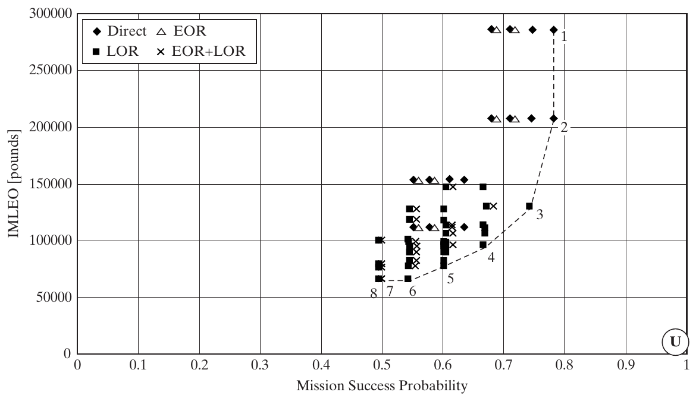

## Architecture as a system of decisions {.smaller}

- Chapters 11–13 connected stakeholder needs, concepts, and decomposition.
- A **decision model** sits between needs and the resulting architecture.
- Its entities are decisions; its relationships are constraints and shared effects on metrics.
- Ten binary decisions already admit $2^{10}=1{,}024$ combinations.

**Purpose:** use computation to explore alternatives while preserving the architect's judgment.

::: {.notes}
- Ask: “What decisions would change the architecture of a campus delivery system?” Expect vehicle type, depot arrangement, and allocation of delivery functions. Contrast these with choosing a paint color.
- Reconnect to Chapter 13: we now manage the apparent complexity of the *decision problem*, not only the physical product. The decision model is itself a system.
- The chapter emphasizes the leverage of the first few architectural decisions over performance and cost. The power-of-two count is a size illustration, not evidence that all combinations are feasible.
- Humans contribute framing, creativity, holism, and judgment; computers help enumerate, check, calculate, and display.

**Source:** Crawley, Cameron & Selva (2016), §14.1, pp. 325–326.
:::


## Learning objectives and route {.smaller}

By the end of this chapter, you should be able to:

1. Formulate decisions, alternatives, constraints, and metrics using Apollo.
2. Distinguish decision-making phases from decision-support layers.
3. Use morphological matrices, DSMs, and decision trees.
4. Evaluate alternatives under uncertainty and explain the tools' limits.

**Route:** Apollo → decision support → tools → architectural challenges.

::: {.notes}
- Explain that the deck is a complete chapter treatment and can be split after the four decision-support layers if needed.
- Students should be able to construct and critique a small model, not memorize historical spacecraft details.
- Opening diagnostic: ask whether “low cost” is a decision, alternative, constraint, or metric. It is a goal; cost is a metric, and a specified cost ceiling can be a constraint.
- Keep that distinction visible during the Apollo example.

**Source:** Crawley, Cameron & Selva (2016), §§14.1–14.7.
:::


# 14.1 The Apollo architecture problem

::: {.notes}
Start with the mission purpose. Ask students to propose ways of getting a crew to the lunar surface and home before showing the mission-mode choices. Source: §14.1, pp. 325–326.
:::


## Apollo: purpose and mission modes {.smaller}

**Goal:** land a person on the Moon and return safely to Earth within the 1960s.

| Mission mode | Earth-orbit rendezvous (EOR) | Lunar-orbit rendezvous (LOR) |
|---|:---:|:---:|
| Direct | No | No |
| EOR | Yes | No |
| LOR | No | Yes |
| EOR + LOR | Yes | Yes |

**Rendezvous and docking:** vehicles meet and connect so crew or equipment can transfer.

::: {.notes}
- Define orbit, rendezvous, and docking before discussing tradeoffs. Meeting is not yet docking: docking adds the physical connection needed for transfer.
- In the direct mission mode, the spacecraft travels to the Moon, lands, ascends, and returns; the model has no separate lunar module.
- Important vocabulary: “direct mission mode” means neither EOR nor LOR. It does *not* require every individual launch/arrival/departure maneuver to take the alternative named “direct.”
- The book identifies June 1962 as the decisive LOR selection and 1969 as the successful landing. Present this as the chapter's historical account.

**Source:** Crawley, Cameron & Selva (2016), §14.1, pp. 325–326; Fig. 14.1.
:::


## Why the mission-mode decision matters {.smaller}

| Mode | Architectural benefit | Architectural burden |
|---|---|---|
| Direct | Fewer vehicle types to develop | Take return hardware down to the Moon and back up |
| EOR | Assemble near Earth; easier retreat after failure | Rendezvous and docking operations |
| LOR | Leave Earth-return hardware and propellant in lunar orbit | Specialized lander and remote rendezvous |

LOR assigns **lunar landing** and **Earth return** to different vehicles.

::: {.notes}
- Ask: “Why carry an Earth-entry heat shield to the lunar surface if it will only be used back at Earth?” This makes the mass benefit of separating functions concrete.
- Explain the OPM connection verbally: the crew is an operand whose location changes; landing and returning are processes; the lander and return vehicle are instruments. LOR changes the mapping of those functions to form.
- EOR's near-Earth assembly has a recovery advantage; that alone does not prove an EOR architecture has the best total success probability. Several operations contribute to the metric.
- Selecting LOR created a stable family of acceptable designs for engineers to refine; it did not specify every dimension or component.

**Source:** Crawley, Cameron & Selva (2016), §§14.1–14.2, pp. 325–327.
:::


# 14.2 Formulating the Apollo decision problem

::: {.notes}
The next task is to translate a mission into an explicit model. Revisit the four nouns: decisions, alternatives, constraints, and metrics. Source: §14.2, pp. 326–331.
:::


## Three heuristics for choosing decisions {.smaller}

1. **Bound the architectural space.** Include plausible ways to meet the goal within scope and schedule.
2. **Choose decisions that affect the metrics.** Test whether the evaluated outcomes change.
3. **Keep decisions architectural.** Include choices that alter form, function, or their mapping.

Refine the model iteratively: an apparently irrelevant decision may expose a **missing metric**.

::: {.notes}
- Boundary example: the study considers small crews and EOR/LOR; Mars expeditions and large lunar settlements exceed its immediate scope.
- Influence example: crew size and propellant affect mass and success probability. An uninformative decision may be removed, but first ask whether the metric set omits the value it provides.
- Architecture example: LOR changes the vehicles and the functions allocated to each. Fuel affects engine and tank requirements indirectly. The authors omit launch-site location in this model; do not generalize that it can never be architectural.
- Ask: “If passenger capacity has no effect on our delivery-system score, should we delete the capacity decision or fix our score?” There is no automatic answer; inspect the stakeholder needs.

**Source:** Crawley, Cameron & Selva (2016), §14.2, pp. 326–327.
:::


## Five mission-mode decisions {.smaller}

| Decision | Alternatives | Question |
|---|---|---|
| `EOR` | no / yes | Dock in Earth orbit? |
| `earthLaunch` | orbit / direct | Enter Earth orbit or depart directly? |
| `LOR` | no / yes | Dock in lunar orbit? |
| `moonArrival` | orbit / direct | Enter lunar orbit or descend directly? |
| `moonDeparture` | orbit / direct | Enter lunar orbit or return directly? |

One selection from each row specifies the maneuver pattern.

::: {.notes}
- Trace the order of travel: Earth departure, lunar arrival, lunar departure, and Earth return. EOR and LOR describe operations at orbital meeting points.
- These are the first five rows of Figure 14.1. Keep the exact identifiers so students can compare the slides to the source tables.
- Ask whether choosing LOR=yes leaves moonArrival and moonDeparture free. It does not; the forthcoming constraints force both to orbit.
- This table represents alternatives but does not yet say which combinations are compatible.

**Source:** Crawley, Cameron & Selva (2016), Fig. 14.1, pp. 327–328.
:::


## Four crew and propellant decisions {.smaller}

| Decision | Alternatives |
|---|---|
| `cmCrew` | 2 or 3 people in the Command Module |
| `lmCrew` | 0, 1, 2, or 3 people in the Lunar Module |
| `smFuel` | cryogenic / storable |
| `lmFuel` | NA / cryogenic / storable |

- **Cryogenic:** LOX/LH₂; higher performance in this model.
- **Storable:** hypergolic propellant; higher reliability in this model.
- **0 / NA** represent an absent lunar module.

::: {.notes}
- Spell out Command Module (CM), Lunar Module (LM), and Service Module (SM). The service module supports the command module with propulsion and other services.
- The framing discussion considers landing one to three people. The actual decision table uses *two or three* CM crew, while a separate LM can carry one to three. These are different counts.
- LOX/LH2 means liquid oxygen/liquid hydrogen; hypergolic propellants ignite on contact. Limit the performance/reliability comparison to the chapter's retrospective assumptions.
- With no lunar module, lmCrew=0 does not mean nobody lands: the direct-mode vehicle carries the crew to the surface. The mission goal is still satisfied.

**Source:** Crawley, Cameron & Selva (2016), Fig. 14.1 and §14.2, p. 328.
:::


## Logical constraints: maneuvers {.smaller}

| ID | Rule | Physical meaning |
|---|---|---|
| a | `EOR = yes` ⇒ `earthLaunch = orbit` | Earth docking needs an Earth orbit |
| b | `LOR = yes` ⇒ `moonArrival = orbit` | Arrive in lunar orbit to support LOR |
| c | `LOR = yes` ⇒ `moonDeparture = orbit` | Ascend to lunar orbit for rendezvous |

An implication is **one-way**: `earthLaunch = orbit` does not require `EOR = yes`.

::: {.notes}
- Translate each implication into a rejected combination. For example, EOR=yes with earthLaunch=direct fails constraint a.
- Ask for a counterexample to the converse: one vehicle can enter Earth orbit without meeting another vehicle there.
- This distinction prevents students from over-pruning the search space.
- The chapter contains apparent labeling errors: the prose on p. 337 says earthLaunch=yes, although its alternatives are orbit/direct; Figs. 14.4 and 14.5 label a direct lunar departure under LOR=yes. Use Table 14.1 as the consistent rule: LOR requires orbital departure. The tree examples in this lecture follow that rule.

**Source:** Crawley, Cameron & Selva (2016), Table 14.1, p. 329; compare Figs. 14.4–14.5.
:::


## Logical constraints: crew and vehicle existence {.smaller}

| ID | Rule |
|---|---|
| d | `lmCrew ≤ cmCrew` |
| e | No LOR ⇒ `lmCrew = 0`; LOR ⇒ `lmCrew > 0` |
| f | No LOR ⇒ `lmFuel = NA`; LOR ⇒ `lmFuel ≠ NA` |

LOR couples the mission maneuvers, existence of the lunar module, its crew, and its fuel.

**Check:** can `LOR=yes, cmCrew=2, lmCrew=3` be feasible?

::: {.notes}
- Expected answer: no, it violates constraint d. We cannot manufacture another astronaut at the Moon.
- Constraints e and f encode the modeling convention that a separate LM exists exactly when LOR is selected. This is a boundary of this model, not a universal statement about all imaginable lunar systems.
- Ask students to repair the assignment in two ways: reduce lmCrew to one or two, or increase cmCrew to three, while satisfying the other constraints.
- The constraints capture expert knowledge and prevent nonsensical combinations from acquiring apparently attractive scores.

**Source:** Crawley, Cameron & Selva (2016), Table 14.1 and §14.2, p. 329.
:::


## Feasibility and reasonableness {.smaller}

- **Logical constraint:** a combination violates the model's physical or operational rules.
- **Reasonableness constraint:** a combination is possible but judged undesirable.
- Example: two partner nations each develop a redundant lunar lander; potentially wasteful, but not logically impossible.

**Discussion:** when might redundancy justify what initially looks wasteful?

::: {.notes}
- Invite answers such as resilience, independent access, or different mission roles. The book's example assumes duplication without a compensating benefit.
- Emphasize that a reasonableness rule embeds a judgment. Record its rationale and revisit it when goals change.
- If all undesirable alternatives are excluded before scoring, the model can conceal a meaningful tradeoff. Ask whether a cost penalty would be more informative than a hard exclusion.
- Distinguish such a judgment from the crew-count constraint, which is a logical consistency requirement in the stated model.

**Source:** Crawley, Cameron & Selva (2016), §14.2, p. 329.
:::


## How large is the Apollo search space? {.smaller}

**Before constraints:**

$$2^5\times2\times4\times2\times3=1{,}536$$

**After all six logical constraints:** **108 feasible assignments**.

| Branch | Count |
|---|---:|
| No LOR | $3\times4\times2\times2=48$ |
| LOR | $3\times5\times2\times2=60$ |

*Classroom enumeration from the chapter's decisions and constraints.*

::: {.notes}
- This is a derived classroom calculation, not a total quoted by the chapter. Walk through the factors rather than ask students to memorize 108.
- Three valid (earthLaunch,EOR) pairs: (orbit,no), (orbit,yes), (direct,no).
- No LOR: four lunar arrival/departure combinations, two CM crew choices, and two SM fuels give 48; LM crew/fuel are fixed to 0/NA.
- LOR: both lunar maneuvers are fixed to orbit; five feasible (cmCrew,lmCrew) pairs are (2,1), (2,2), (3,1), (3,2), (3,3). Two SM fuels and two LM fuels give 60.
- Ask why naive multiplication fails *after* constraints: alternatives are coupled. Count assignments, not necessarily distinct metric points; several assignments can have equal scores.

**Source:** Crawley, Cameron & Selva (2016), Fig. 14.1 and Table 14.1; classroom enumeration.
:::


## Apollo evaluation metrics {.smaller}

The case is **iso-performance**: every feasible architecture meets the basic lunar-landing goal.

| Metric | Desired direction | Interpretation |
|---|---|---|
| Initial mass to low Earth orbit (IMLEO) | Lower | Proxy for cost |
| Probability of mission success | Higher | Proxy for operational risk |

Mass is calculated using the rocket equation and historical parameters; success uses operation-level factors.

::: {.notes}
- Iso-performance means equivalent at the level of the minimum mission objective, not identical scientific return, crew capability, or comfort.
- IMLEO is a mass measure, not a complete dollar-cost estimate. Different development programs could cost differently even at the same mass.
- The chapter does not include developmental risk as an explicit axis in this particular plot; it notes that performance, cost, and development/operation risk commonly appear in architecture evaluation.
- Ask what could be missing: schedule, scientific return, abort options, or development effort. A good plot still inherits its modeling boundary.

**Source:** Crawley, Cameron & Selva (2016), §14.2, p. 329.
:::


## Why mission mode changes mass {.smaller}

The rocket equation relates a maneuver to its mass ratio:

$$\Delta v=I_{sp}g_0\ln\!\left(\frac{m_0}{m_f}\right)$$

- $m_0$: mass before the burn; $m_f$: mass after the burn.
- $I_{sp}$: specific impulse; $g_0$: standard gravitational acceleration.
- Extra payload requires extra propellant, which earlier stages must also carry.
- LOR avoids landing and relaunching the hardware reserved for Earth return.

::: {.notes}
- This equation makes explicit the rocket-equation relationship named by the chapter; it is an explanatory addition, not a reconstruction of the authors' full IMLEO simulation.
- Explain delta-v as the maneuver's required velocity change, including the appropriate trajectory/model assumptions. Students do not need orbital-mechanics details here.
- The logarithm hides strong mass growth: solving for m0 gives mf times exp(delta-v/(Isp*g0)). Carrying more final mass multiplies through earlier maneuvers.
- A full architecture evaluation needs trajectories, staging, inert masses, propellant properties, and burn assignments. Do not imply this one equation alone reproduces Figure 14.2.

**Source:** Crawley, Cameron & Selva (2016), §§14.2 and 14.5, pp. 329, 338–340.
:::


## Success factors: maneuver choices {.smaller}

| Decision | Alternative | Success factor |
|---|---|---:|
| EOR | no / yes | 0.98 / 0.95 |
| Earth launch | orbit / direct | 0.99 / 0.90 |
| LOR | no / yes | 1.00 / 0.95 |
| Moon arrival | orbit / direct | 0.99 / 0.95 |
| Moon departure | orbit / direct | 0.90 / 0.90 |

These are the chapter's **retrospective model inputs**, not measured Apollo flight frequencies.

::: {.notes}
- The prose groups operational risk into high, medium, low, and very low, associated with success factors 0.90, 0.95, 0.98, and 0.99. Table 14.2 additionally uses neutral factors of 1 and repeated-operation products.
- Higher values here mean higher success, not higher risk. Be explicit because the table labels its rows “risk.”
- The authors base the factors on early-1960s documents and interviews with decision makers. They are simplifying assessments.
- EOR=no still receives 0.98. Do not silently substitute 1 because it seems more intuitive; the point is to expose and question the chosen model.

**Source:** Crawley, Cameron & Selva (2016), Table 14.2, p. 330; §14.2, p. 329.
:::


## Success factors: crew and fuel choices {.smaller}

| Decision | Alternatives and factors |
|---|---|
| CM crew | 2: **1**; 3: **1** |
| LM crew | 0: **1**; 1: **0.90**; 2: **1**; 3: **1** |
| SM fuel | cryogenic: **$0.95^{n_{burns}}$**; storable: **1** |
| LM fuel | NA: **1**; cryogenic: **0.9025**; storable: **1** |

$$P(\text{mission success})=\prod_i p_i$$

A factor of 1 means **no additional penalty in this model**.

::: {.notes}
- One lunar-module crew member incurs a penalty; two or three do not. This is a model assumption about solo operations, not a universal numerical law about teamwork.
- The LM cryogenic factor is 0.95 squared = 0.9025. The SM cryogenic exponent depends on the architecture's burn count, so it is not a universal fixed number.
- A product of unconditional probabilities requires independence; alternatively, a product of appropriately conditioned stage-success probabilities follows the chain rule. The chapter's simplified factor model should not be mistaken for proof of real operational independence.
- Metrics also couple decisions: changing one success factor changes the product associated with every combination of the other decisions. Discuss common-cause failures that a naive product could miss.

**Source:** Crawley, Cameron & Selva (2016), Table 14.2 and §14.2, pp. 329–330.
:::


## Worked example: the Apollo-like assignment {.smaller}

`EOR=no`, `earthLaunch=orbit`, `LOR=yes`, both lunar maneuvers `orbit`, **3 CM crew**, **2 LM crew**, both fuels **storable**.

$$P_s=0.98(0.99)(0.95)(0.99)(0.90)(1)(1)(1)(1)$$
$$P_s\approx0.8212$$

Changing only the LM crew to one gives $0.8212\times0.90\approx0.7391$.

*Calculated from Table 14.2; these are model scores, not observed mission reliability.*

::: {.notes}
- Ask students to check all six constraints before multiplying: EOR=no is compatible with Earth orbit; LOR=yes requires lunar orbit on arrival/departure, positive LM crew and a real fuel; 2≤3.
- Assign one student to read the decision values and another to supply the table factors. The bookkeeping matters more than the arithmetic.
- Point 3 in the book matches the actual Apollo configuration qualitatively. The source plot places it at roughly 0.74, whereas directly multiplying the printed Table 14.2 factors for this assignment gives 0.8212. The chapter does not provide enough computational detail to reconcile this discrepancy. Keep the worked table calculation separate from the published plot; do not claim to reproduce its point coordinates.
- The one-person variant reduces the factor by 10 percent, or about 8.21 percentage points of modeled mission success. This distinction is a useful numerical check.

**Source:** Crawley, Cameron & Selva (2016), Table 14.2 and Fig. 14.2, pp. 330–331; classroom calculation.
:::


## The Apollo tradespace {.smaller}

{height=450px fig-align="center" fig-alt="Apollo tradespace: mission success probability on the horizontal axis and initial mass in pounds on the vertical axis, comparing direct, EOR, LOR, and combined mission modes."}

::: {.side-caption}
Source: Crawley, Cameron & Selva (2016), Fig. 14.2, p. 331. Published plot; each point is a feasible assignment. Lower and farther right is preferable. U marks the hypothetical ideal.
:::

::: {.notes}
- Read the axes first: IMLEO is in pounds on the original figure; success probability increases to the right. Therefore the preferred direction is down and right.
- Explain U: zero mass and certain success are an imaginary benchmark, not an achievable design. Distance to U is not automatically a valid preference rule because axes have different units and scales.
- The dashed set shows architectures for which improving one objective requires a tradeoff with the other. Chapter 15 develops this reasoning more fully.
- Ask whether the highest-success point must be selected. Expected answer: not without a judgment about the added mass, cost proxy, and omitted concerns.
- Use this as the published result, not a plot regenerated from the simplified factor table; the preceding notes explain their numerical mismatch.

**Source:** Crawley, Cameron & Selva (2016), Fig. 14.2, p. 331.
:::


## Interpreting the highlighted architectures {.smaller}

| Points | Configuration | Tradeoff |
|---|---|---|
| 1–2 | Direct missions; 3 or 2 crew | High modeled success; very high mass |
| 3 | Apollo-like LOR; 3 CM / 2 LM; storable fuels | Compromise between mass and risk |
| 4–7 | Other LOR assignments | Intermediate combinations |
| 8 | 2 CM / 1 LM; cryogenic propellants | Minimum mass; resembles the Soviet proposal |

The computation recovers recognizable historical choices without making the final value judgment.

::: {.notes}
- The chapter associates the direct-mode proposals with von Braun, LOR with Houbolt, and point 8 with the Soviet lunar architecture. Phrase these as the source's retrospective comparisons.
- Do not invent detailed decision vectors for points 4–7: the chapter does not list them.
- Emphasize the role of evaluation: it exposes the mass-risk compromise, but the eventual preference still depends on the stakeholders and assumptions.
- Ask students which additional evidence they would request before deciding among points 2, 3, and 8. Encourage questions about schedule, abort behavior, and uncertainty rather than only “which is closest to U?”

**Source:** Crawley, Cameron & Selva (2016), §14.2, pp. 330–331.
:::


# 14.3 Decisions and decision support

::: {.notes}
Shift from Apollo to the general decision process. The key distinction is between forming and evaluating alternatives and actually selecting one. Source: §14.3, pp. 331–333.
:::


## What is a decision? {.smaller}

A decision is a **purposeful selection among mutually exclusive alternatives**.

- There is an issue with more than one possible course of action.
- Selecting an alternative separates the remaining solution space from rejected options.
- The selection is made to achieve an expected benefit.

**Decision support** helps a person reason about that choice.

::: {.notes}
- The chapter's etymological discussion emphasizes cutting or separating; use the image of pruning a space of possibilities rather than treating a decision as merely expressing a preference.
- “Mutually exclusive” applies within a particular decision. EOR and LOR can both be yes because they are separate decisions, not alternatives in the same binary decision.
- Ask students to turn “we care about reliability” into a decision statement. An example is selecting single versus redundant sensing; reliability is then an evaluation metric.
- Decision making is goal-directed behavior in the presence of options, culminating in one or more selections.

**Source:** Crawley, Cameron & Selva (2016), §14.3, pp. 331–332.
:::


## Simon's four phases {.smaller}

| Phase | Main activity | Apollo illustration |
|---|---|---|
| Intelligence | Identify the situation requiring a decision | Interpret the mission need and deadline |
| Design | Invent, develop, and analyze alternatives | Formulate and evaluate mission modes |
| Choice | Select a course of action | Commit to LOR |
| Review | Assess past choices | Compare outcomes with expectations |

Much effort goes into **Intelligence and Design**, before the selection itself.

::: {.notes}
- These are phases of the overall decision process, not the four layers of software that come next.
- Simon reports substantial effort in Intelligence, even more in Design, and smaller shares in Choice and Review. Do not make up universal percentages.
- Undergraduates often equate design with drawing a final object; here Design includes developing and analyzing possible courses of action.
- Ask: “Which phase is missing when a team immediately votes among the first two ideas?” Typically the framing and deliberate development of alternatives; review may also be neglected.

**Source:** Crawley, Cameron & Selva (2016), §14.3, p. 332.
:::


## Programmed and non-programmed decisions {.smaller}

| Programmed | Non-programmed |
|---|---|
| Repeated or well-defined problem | Novel or weakly structured problem |
| An established procedure is available | Creativity, judgment, and heuristics are central |
| Models and objectives are well specified | Models or goals may be imprecise |
| Controller tuning; routine factory planning | New product strategy; a new mission mode |

**Programmed does not mean easy or inexpensive.** These are ends of a spectrum.

::: {.notes}
- Figure 14.3 places engineering design toward operations research and system architecting toward management science; the separation is a tendency, not a professional boundary.
- The source includes tipping a waiter, optimal control gains, and national aircraft routing as programmed examples. Aircraft routing can be computationally very demanding despite having a defined method.
- Other non-programmed examples include human Mars mission modes and national policy decisions. Avoid expanding into a political discussion; the distinction is the absence of a prepared solution procedure.
- Ask students to classify choosing an aircraft size. It can lie between the poles: some equations exist, but market framing and program context can remain uncertain.

**Source:** Crawley, Cameron & Selva (2016), Fig. 14.3 and §14.3, pp. 332–333.
:::


## Developing methods for unfamiliar decisions {.smaller}

- A previously non-programmed decision can become more systematic.
- Alexander's **pattern language** records reusable triples:
  - **Context:** where the pattern applies.
  - **Problem:** what must be resolved.
  - **Solution:** a reusable architectural response.
- Decision support makes exploration more rigorous while leaving room to revise the framing.

::: {.notes}
- The chapter suggests “not-yet-programmed” as a useful way of thinking about some non-programmed decisions.
- Classroom analogy: a quiet study space next to a noisy corridor is a context; acoustic disturbance is the problem; a buffer space is a possible reusable response. Label it as an illustrative pattern, not a quoted Alexander pattern.
- Reuse does not make a pattern universally correct. Ask what changes in context would invalidate the proposed solution.
- Bridge to later chapters: patterns return in Chapter 16. Here the purpose is to see why systematic support can help without eliminating creativity.

**Source:** Crawley, Cameron & Selva (2016), §14.3, p. 333.
:::


# 14.4 Four tasks of decision support

::: {.notes}
Place all four layers inside Simon’s Design Activity. Keep the phases and layers distinct on the board. Source: §14.4, pp. 333–334.
:::


## Four layers within the Design Activity {.smaller}

| Layer | Question | Apollo example |
|---|---|---|
| **Representing** | What are the decisions and alternatives? | Nine-row morphological matrix |
| **Structuring** | How are decisions connected and ordered? | LOR constraints; decision DSM |
| **Simulating** | Which assignments work, and how well? | Feasibility, mass, and success calculations |
| **Viewing** | How can people interpret the results? | Apollo tradespace plot |

These support **Design**; selecting the architecture belongs to **Choice**.

::: {.notes}
- Give students a quick sorting exercise: listing two fuels is representing; linking LOR to LM fuel is structuring; multiplying success factors is simulating; plotting the results is viewing.
- Representation must be understandable by people and also encodable for computation. OPM is one available representation for function, form, and decision problems.
- Structuring includes decision order and connectivity. Simulation includes enforcing constraints as well as calculating outcomes; methods range from simple equations to discrete-event simulation.
- Viewing communicates results from both structuring and simulation. A useful display should support questions, not simply decorate an answer.
- The book mentions commercial DSS packages as examples, not as required course tools. No particular software package is necessary to apply these layers.

**Source:** Crawley, Cameron & Selva (2016), §14.4, pp. 333–334.
:::


# 14.5 Basic decision-support tools

::: {.notes}
Revisit tools already encountered in earlier chapters: OPM, morphological matrices, and DSMs. Then introduce decision trees. Source: §14.5, pp. 334–340.
:::


## Morphological matrices and OPM {.smaller}

- A **morphological matrix** lists each decision with its alternatives.
- Choose one alternative **per row**; choices need not share a column.
- The combinations are represented **implicitly**.
- **OPM** connects choices to objects, processes, and function-to-form mappings.

Neither a list of alternatives nor an OPM representation alone computes which architecture is best.

::: {.notes}
- Credit Zwicky's morphological approach, which sought to study the space of configurations. Recall Chapter 7's concept-selection examples and function/form specialization.
- Use the Apollo rows: EOR=no, LOR=yes, cmCrew=2, lmCrew=2 is a partial assignment selecting alternatives in different columns. Complete the remaining rows before calling it a full architecture.
- The morphological matrix is easy to build and understand, but by itself lacks constraints, metrics, and evaluation results. Do not imply columns are bundled designs.
- OPM retains the functional meaning that a decision table can hide. Ask what changes in the objects and processes when the LM is absent. We use OPM for this connection; the other tools here model choices and their relationships.

**Source:** Crawley, Cameron & Selva (2016), §14.5, pp. 334–335; Fig. 14.1.
:::


## A decision DSM {.smaller}

A **Design Structure Matrix** is an $N\times N$ table with the same decisions on both axes.

- An entry records a connection between two decisions.
- The connection may be a logical rule, a reasonableness rule, or a shared metric effect.
- A blank means **no connection of the type currently represented**.
- The DSM lists decisions and relationships, but not their alternatives.

::: {.notes}
- Recall product DSMs from Chapter 4. The mathematical form is familiar; the entities have changed from product parts to architectural decisions.
- Steward introduced the DSM term in 1981; the chapter notes applications in product design, organizations, and project management.
- Ask: “If the constraint DSM has a blank, can the decisions still interact through mass?” Yes. Always specify what relationship a matrix represents.
- A binary mark reveals that a relationship exists, not its exact equation, sign, strength, or causal direction. Keep the constraint definitions alongside the DSM.

**Source:** Crawley, Cameron & Selva (2016), §14.5, p. 335.
:::


## Apollo DSM: logical constraints {.smaller}

| Decision | 1 | 2 | 3 | 4 | 5 | 6 | 7 | 8 | 9 |
|---|:-:|:-:|:-:|:-:|:-:|:-:|:-:|:-:|:-:|
| 1 EOR | — | a | | | | | | | |
| 2 earthLaunch | a | — | | | | | | | |
| 3 LOR | | | — | b | c | | e | | f |
| 4 moonArrival | | | b | — | | | | | |
| 5 moonDeparture | | | c | | — | | | | |
| 6 cmCrew | | | | | | — | d | | |
| 7 lmCrew | | | e | | | d | — | | |
| 8 smFuel | | | | | | | | — | |
| 9 lmFuel | | | f | | | | | | — |

Letters refer to constraints **a–f**. LOR has four direct neighbors.

::: {.notes}
- Reconstructed from Table 14.3 with the LM fuel identifier normalized to lmFuel; the printed table uses imFuel in places.
- Have students find constraint d at the intersection of cmCrew and lmCrew. Then find all the entries in the LOR row.
- The table is symmetric because it records involvement in a shared constraint, not a directed causal implication. The underlying rules can still be one-way.
- smFuel has no logical-constraint neighbors here. It is not irrelevant: it affects metrics.
- Ask whether CM crew is connected to LOR: not directly in this matrix, but there is a path through LM crew. Direct adjacency and indirect dependence differ.

**Source:** Crawley, Cameron & Selva (2016), Table 14.3, p. 336; Table 14.1, p. 329.
:::


## Apollo DSM: coupling through mass {.smaller}

| Decision | LOR | CM crew | LM crew | SM fuel | LM fuel |
|---|:---:|:---:|:---:|:---:|:---:|
| LOR | — | I | I | I | I |
| CM crew | I | — | I | I | I |
| LM crew | I | I | — | I | I |
| SM fuel | I | I | I | — | I |
| LM fuel | I | I | I | I | — |

**I:** interaction through IMLEO. This conceptual submatrix groups vehicle existence, crew, and propulsion choices.

::: {.notes}
- This is an explanatory symmetric submatrix of the interacting decisions discussed around Table 14.4, not a cell-for-cell transcription of that table.
- Table 14.4 as printed is asymmetric: several reciprocal entries involving LOR appear under the moonArrival column. The surrounding explanation identifies the coupled group as LOR, crew, and fuel. Make the conceptual relationship explicit rather than teach the apparent indexing inconsistency as a physical fact.
- Mass depends jointly on which vehicles exist, their crew-dependent size, and their propulsion. Changing fuel cannot be assessed in isolation from what that propulsion system must move.
- These connections differ from the logical-constraint DSM. Do not treat the four omitted maneuver rows as a proof that maneuvers never affect mass; the full trajectory model is richer than this conceptual submatrix.

**Source:** Crawley, Cameron & Selva (2016), Table 14.4 and accompanying discussion, pp. 335–336; conceptual adaptation.
:::


## Sorting and clustering a DSM {.smaller}

Reorder the constraint DSM to place related decisions together:

| Block | Decisions |
|---|---|
| Earth operations | EOR, earthLaunch |
| Lunar operations and crew | LOR, moonArrival, moonDeparture, cmCrew, lmCrew, lmFuel |
| No logical links in this model | smFuel |

- Partitioning or clustering exposes groups to coordinate.
- Reordering **does not remove** an interaction.
- Adding metric couplings can change these groups.

::: {.notes}
- This presents Table 14.5's reordered grouping in a compact form: moving lmFuel before smFuel makes the connected lunar block contiguous.
- The chapter mentions partitioning procedures and clustering algorithms, with further clustering detail in Appendix B. Students need the purpose here, not a new algorithm implementation.
- These blocks are connected sets in this particular constraint graph, not equally dense cliques. Decisions within a coupled block should be coordinated or revisited together rather than frozen independently.
- If matrix order represents decision order, the DSM can support timing; it does not by itself prove an optimal sequence.
- Point back to the mass submatrix: adding metric connections brings smFuel into the coordinated group. The prose around Table 14.5 discusses fuel couplings more broadly than the displayed constraint-only matrix.

**Source:** Crawley, Cameron & Selva (2016), Table 14.5, p. 337; §14.5, pp. 336–337.
:::


## Decision-tree vocabulary {.smaller}

| Node | Meaning | Who controls the branch? |
|---|---|---|
| **Decision** (square) | Select an alternative | Decision maker |
| **Chance** (circle) | Realize an uncertain outcome | Not the decision maker |
| **Leaf** (terminal node) | Complete path and its outcome | No further branch |

- Without chance nodes: a complete path specifies an architecture.
- With chance nodes: a complete path specifies an architecture **and a scenario**.

::: {.notes}
- The book uses triangles for leaves; terminal shapes are a drawing convention. Our editable tree examples label terminal nodes explicitly.
- Make the control distinction tangible: choosing a fuel is controllable; the future outcome of an uncertain operation is not.
- If a tree includes only five of Apollo's nine decisions, its leaves specify mission modes, not fully specified nine-decision architectures.
- A tree explicitly enumerates paths, unlike a morphological matrix's implicit combinations. This clarity has a size cost.

**Source:** Crawley, Cameron & Selva (2016), §14.5, pp. 337–339; Figs. 14.4–14.5.
:::


## A pruned Apollo decision tree {.smaller}

```{mermaid}
%%| fig-width: 9
%%| fig-height: 4
%%{init: {"themeVariables": {"fontSize": "24px"}}}%%
flowchart LR
  A[earthLaunch] -->|orbit| B[EOR]
  A -->|direct| C[EOR]
  B -->|no| D[Lunar choices]
  B -->|yes| E[Lunar choices]
  C -->|no| F[Lunar choices]
```

The branch `earthLaunch=direct, EOR=yes` is absent because it violates constraint **a**.

Three valid Earth-operation prefixes remain.

::: {.notes}
- This is a fragment adapting the logic of Figure 14.4, not the whole nine-decision tree. Each endpoint continues into lunar decisions.
- Ask how many prefixes would exist without the constraint: four. Pruning one leaves three.
- The tree's decision order is a representation choice. Different orderings can encode the same feasible set, though some reveal constraints earlier and are easier to inspect.
- The source figure labels the first decision earthDeparture; we use earthLaunch consistently with Figure 14.1. No chance nodes appear here.

**Source:** Crawley, Cameron & Selva (2016), Fig. 14.4 and Table 14.1, pp. 329, 338; adapted fragment.
:::


## Completing the lunar branches {.smaller}

For **each** valid Earth-operation prefix:

| Moon arrival | LOR | Allowed Moon departure | Leaves |
|---|---|---|---:|
| orbit | yes | orbit | 1 |
| orbit | no | orbit or direct | 2 |
| direct | no | orbit or direct | 2 |

$3$ Earth prefixes $\times\ 5$ lunar patterns $=\mathbf{15}$ mission modes.

Add the crew and fuel decisions to obtain complete architectures.

::: {.notes}
- Ask students which missing row is forbidden: moonArrival=direct with LOR=yes violates constraint b.
- Constraint c gives orbital departure whenever LOR=yes. This corrects the “Direct” branch label in the printed Figures 14.4 and 14.5.
- The total of fifteen mission-mode leaves agrees with the discussion on p. 340. Do not confuse it with 108 full feasible assignments after crew and fuel choices.
- Give one minute for students to sketch the five-leaf lunar subtree. This is easier to read than projecting the full fifteen-leaf tree at small scale.

**Source:** Crawley, Cameron & Selva (2016), Fig. 14.4, pp. 337–338; Table 14.1, p. 329; p. 340.
:::


## Evaluating a path through a tree {.smaller}

- A separable metric can accumulate along a path.
- Apollo's success-factor model uses a **product** of contributions.
- IMLEO involves nonlinear interactions and typically needs the **complete assignment**.
- Evaluating every leaf can become impractical as decisions and scenarios multiply.

A readable representation does not guarantee an inexpensive computation.

::: {.notes}
- Multiplication of factors is analogous to accumulating a running score, although burn counts and conditional assumptions must still be supplied correctly.
- Contrast with mass: the effect of a propellant choice depends on vehicle size and mission maneuvers, so a fixed independent “fuel mass score” is insufficient.
- Ask students to count twenty binary decisions: over a million assignments even before adding scenarios. Trees can become too large despite a short decision list.
- General methods may evaluate selected branches or cache repeated computations, but the chapter's basic tree approach should not be confused with a scalable solution to every architecture problem.

**Source:** Crawley, Cameron & Selva (2016), §14.5, pp. 337–339.
:::


## Combining metrics into utility {.smaller}

A stakeholder preference model can combine normalized metric utilities:

$$U(a)=w\,u_M(M(a))+(1-w)\,u_P(P_s(a))$$

- $a$: architecture; $0\leq w\leq1$: mass-utility weight.
- $u_M$ rewards lower mass; $u_P$ rewards higher success.
- Utility functions and weights express preferences, not physical laws.

The raw sum “pounds + probability” is not a meaningful utility model.

::: {.notes}
- This rewrites the chapter's example with distinct symbols for architecture, mass, success, and utility to avoid overloading u.
- Multi-attribute utility theory provides a framework for eliciting component utilities and weights. An additive model requires suitable preference assumptions; a weighted sum is not automatically justified.
- Ask what increasing w does: it increases the relative contribution of mass utility, but its effect depends on the utility scales and shapes.
- Retain the two-axis tradespace during discussion so students can see what a single score compresses. Subjective preferences should remain traceable.

**Source:** Crawley, Cameron & Selva (2016), §14.5, p. 339.
:::


## Uncertainty adds scenarios {.smaller}

```{mermaid}
%%| fig-width: 9
%%| fig-height: 4
%%{init: {"themeVariables": {"fontSize": "24px"}}}%%
flowchart LR
  A[Choose architecture] -->|A| B((Scenario))
  A -->|B| C((Scenario))
  B -->|optimistic: 0.5| D[Leaf: utility 90]
  B -->|pessimistic: 0.5| E[Leaf: utility 30]
  C -->|optimistic: 0.5| F[Leaf: utility 70]
  C -->|pessimistic: 0.5| G[Leaf: utility 60]
```

*Classroom utilities and probabilities, not Apollo measurements.*

You can choose A or B; you cannot choose the optimistic outcome.

::: {.notes}
- This numerical teaching example instantiates the chance-node idea in Figure 14.5 without using the source's inconsistent lunar-departure label.
- Ask: “Why not choose the leaf with utility 90?” Because the leaf includes an outcome we cannot control.
- At each chance node, outgoing probabilities sum to one. Equal scenario probabilities are an illustrative assumption, not a default for real uncertainty.
- The decision precedes the scenario here. If information becomes available before a later decision, the tree must represent that timing and the resulting contingent policy correctly.

**Source:** Crawley, Cameron & Selva (2016), §14.5, pp. 339–340; Fig. 14.5; classroom example.
:::


## Rollback: expectation, then choice {.smaller}

**At chance nodes:** compute expected utility.

$$EU(A)=0.5(90)+0.5(30)=60$$
$$EU(B)=0.5(70)+0.5(60)=65$$

**At the decision node:** select the larger expected utility → **B**.

Repeat backward through the tree. For a cost or loss metric, minimize instead.

::: {.notes}
- Let students compute both expectations before discussing the choice. B wins in expectation despite A having the best individual outcome.
- These are already utility values. Maximizing expected utility is not the same as maximizing raw expected money or minimizing every kind of risk; utility encodes the preferences.
- In a tree with chance nodes interleaved among decisions, rollback can produce a policy conditional on observed information. Do not let a decision depend on an outcome that has not yet been observed.
- The source describes rolling back from Moon departure to LOR and earlier choices, averaging at chance nodes and optimizing at decision nodes.

**Source:** Crawley, Cameron & Selva (2016), §14.5, p. 339; classroom calculation.
:::


## Sensitivity to the scenario probability {.smaller}

Let $p$ be the optimistic-scenario probability for both architectures.

$$EU(A)=90p+30(1-p)=30+60p$$
$$EU(B)=70p+60(1-p)=60+10p$$

The preference changes at $p=0.60$:

- $p<0.60$: choose B.
- $p>0.60$: choose A.
- $p=0.60$: equal expected utilities.

::: {.notes}
- This is a classroom extension of the previous example. Derive 30+60p=60+10p, then 50p=30.
- Ask whether a decision is convincing if plausible probabilities range from 0.4 to 0.8. The preferred alternative changes within that range; better information or a robustness argument would matter.
- The same p is an explicit simplification. The book notes that different chance nodes can have different probabilities.
- Distinguish a probability of an optimistic scenario from the mission-success probability conditioned on that scenario. They are not interchangeable quantities.

**Source:** Crawley, Cameron & Selva (2016), §14.5, pp. 339–340; classroom sensitivity example.
:::


## Where basic decision trees struggle {.smaller}

- **Size:** decisions and uncertain outcomes multiply the leaves.
- **Evaluation effort:** architecture–scenario payoffs may require expensive simulation.
- **Dependence:** one uncertain parameter can affect many decisions and metrics.
- **Information structure:** choices must use only information available at that point.

Example: an uncertain propellant-to-structure mass ratio changes IMLEO across multiple mission modes.

::: {.notes}
- The chapter's mass-ratio example is a hidden, uncontrollable parameter whose effect passes through the nonlinear mass model, not a simple local risk multiplier.
- The authors discuss collapsing all fifteen mission modes into one decision as a way to express the dependency, at the expense of losing the original decision structure.
- Clarify the scope of the book's independence criticism: simple independent-factor evaluation is restrictive. General decision trees can represent conditional probabilities and dependent payoffs by expanding the histories, but this can be unwieldy. Dependence is not mathematically forbidden in every tree.
- Decision networks relax the tree topology and allow more general connections, as the chapter's footnote notes. Markov decision processes are mentioned but not developed; architecture coupling can prevent the required decomposition assumptions.
- Ask which tool could expose a hidden shared dependency before constructing a huge tree: a decision DSM is one useful start.

**Source:** Crawley, Cameron & Selva (2016), §14.5, pp. 339–340 and footnote.
:::


## What each tool contributes {.smaller}

| Tool | Represents | Structures | Simulates / evaluates |
|---|---|---|---|
| Morphological matrix | Decisions and alternatives | No explicit coupling | No |
| Decision DSM | Decisions and relationships | Coupling and clusters | No |
| Decision tree | Explicit paths and scenarios | Order and pruning | Some path evaluation and rollback |

**Viewing** evaluated tradespaces requires an appropriate results display.

::: {.notes}
- These are capabilities of the basic forms, not claims about every software implementation that incorporates them.
- A matrix or tree is visible, but the chapter's viewing layer means presenting decision-support information derived from structuring and simulation, such as the evaluated tradespace.
- Ask students to assemble a workflow rather than pick a single winning tool: list choices, record couplings, check/evaluate assignments, and inspect results.
- OPM remains useful for representing the functional and physical meaning of the options, especially when students need to explain what an architectural decision changes.

**Source:** Crawley, Cameron & Selva (2016), §§14.4–14.5, pp. 333–340; §14.7, p. 342.
:::


# 14.6 What architecture decision support needs

::: {.notes}
Box 14.1 has six properties. Treat them as reasons to adapt the modeling approach, not excuses to avoid analysis. Source: §14.6 and Box 14.1, pp. 340–342.
:::


## Breadth, uncertainty, and ambiguity {.smaller}

**1. Breadth versus depth**

Explore many different architectures at low fidelity before refining a few designs in detail.

**2. Uncertainty and ambiguity**

- Uncertainty: outcomes are not known, for example future operational events.
- Ambiguity: a statement or category is fuzzy, for example “easy to maintain.”
- More Monte Carlo samples cannot resolve an undefined requirement.

::: {.notes}
- These are the first two properties in Box 14.1. A deep model of only one architecture can miss a superior family; a very broad model may miss engineering detail. Model fidelity is a deliberate tradeoff.
- Ask students to classify “the sensor may fail” versus “the product should be intuitive.” The former can motivate an uncertainty model; the latter needs clarification of meaning and evaluation.
- The chapter argues that early ambiguity can make standard probabilistic techniques inadequate or impractical. It does not say Monte Carlo is never useful in architecture.
- Interval analysis and fuzzy sets are examples mentioned in the chapter's references for cases where precise probabilistic descriptions are not justified. The first action may simply be to clarify stakeholder language.

**Source:** Crawley, Cameron & Selva (2016), Box 14.1, p. 341; reference [28], p. 344.
:::


## Variable types and subjective value {.smaller}

**3. Variable type**

| Type | Example |
|---|---|
| Categorical | Cryogenic or storable propulsion |
| Discrete integer | Number of crew members |
| Continuous | A tank dimension |

**4. Subjectivity:** stakeholder value may require elicited utilities, expert judgment, and an explanation of the assessment.

::: {.notes}
- Architectural choices are often categorical, sometimes discrete, and rarely continuous in the chapter's characterization. Detailed design has a stronger emphasis on continuous variables.
- Encoding cryogenic as 0 and storable as 1 does not make their numerical difference a meaningful physical distance. Do not interpolate to “fuel 0.4.”
- Subjectivity is not the same as arbitrariness: record whose judgment was used, the evidence, and how an alternative score was produced.
- Multi-attribute utility theory and fuzzy sets are approaches the book mentions. Ask how two stakeholders could agree on mass but disagree on the architecture's value.

**Source:** Crawley, Cameron & Selva (2016), Box 14.1, p. 341; references [29]–[30], p. 344.
:::


## Objective functions, coupling, and emergence {.smaller}

**5. Objective-function form**

Low-fidelity architecture models mix equations, lookup tables, and if–then rules to handle diverse alternatives and subjective metrics.

**6. Coupling and emergence**

A small set of strongly connected decisions can produce a huge space of combinations and system-level effects.

Choosing the locally best alternative in each row need not produce the best system.

::: {.notes}
- Explain the three reasons for rule-based metrics given in the box: different architecture types need different evaluation logic; low fidelity motivates heuristics; subjective judgments may be expressed as rules.
- Ask why choosing the lightest individual component is not sufficient. Interfaces, support equipment, and operations can reverse the system-level result.
- The box cautions that strong coupling can defeat methods that rely on separability or a useful Markov structure. This is a reason to examine assumptions, not to declare all dynamic programming impossible.
- Reconnect to emergence in earlier chapters: system value is produced by the interaction of selections, not merely the independent quality of the selected parts.

**Source:** Crawley, Cameron & Selva (2016), Box 14.1, p. 341.
:::


## An interactive architecture-support process {.smaller}

- Let the architect revise boundaries, alternatives, metrics, and assumptions.
- Use knowledge-based rules to encode and explain expert reasoning.
- Preserve traceability from a score back to its evidence and judgments.
- Use computation to reveal options and tradeoffs worth investigating.

The chapter points to **Object Process Networks**, **Architecture Decision Graphs**, and **VASSAR** as specialized approaches.

::: {.notes}
- Architectural DSSs tend to be more interactive and less automatic because their models are provisional and their values partly subjective.
- At the level of the chapter's references: Object Process Networks emphasize synthesis/evaluation and simulation; Architecture Decision Graphs emphasize structuring; VASSAR uses rules for architecture value assessment and supports structuring/simulation.
- Object Process Networks are a related meta-language, not simply another name for the OPM notation used in this course. No additional notation is required here.
- Ask what explanation a student would want if a tool rejected their preferred architecture. A useful answer identifies the exact constraint, assumption, or utility judgment rather than displaying an unexplained score.

**Source:** Crawley, Cameron & Selva (2016), §14.6, p. 342; reference [31], p. 344.
:::


# 14.7 Synthesis and practice

::: {.notes}
Consolidate the chapter with a small formulation exercise and an exit ticket. These activities apply the chapter’s methods to an undergraduate-scale problem. Source: §14.7, p. 342.
:::


## Class activity: a campus delivery system {.smaller}

**Goal:** deliver small parcels between campus buildings.

| Decision | Alternatives |
|---|---|
| Vehicle | Ground robot / aerial drone |
| Loading | Manual / automated |
| Handoff | Staffed desk / secure locker |

In pairs: propose **two constraints**, **two metrics**, and one **OPM function-to-form statement**. Mark a decision coupling in a DSM.

::: {.notes}
- Allow about five minutes plus discussion. This is an original classroom exercise, not a book case study.
- Define scope together: parcels, routes, and users must be specified before declaring an architecture feasible. Invite students to state additional assumptions rather than silently invent capabilities.
- A valid OPM-oriented answer identifies an operand and a process that changes its state or location, plus the instrument enabling that process.
- Encourage one logical compatibility rule and one policy or reasonableness rule. The rules depend on the assumed campus system; they are not universal truths about robots or drones.
- Ask teams to say which DSS layer each part of their answer belongs to.

**Source:** Crawley, Cameron & Selva (2016), §§14.2, 14.4–14.6; classroom application.
:::


## Activity discussion: one possible model {.smaller}

- Assume the automated loader only mates with the ground robot: **automated ⇒ ground**.
- Assume unstaffed handoff requires a secure locker: a **policy constraint**.
- Metrics: delivery time and cost per parcel; track successful delivery as well.
- OPM statement: **Transporting** changes a **Parcel** from origin to destination, using a **Vehicle** as instrument.
- Coupling: vehicle and loading interact through compatibility and delivery time.

::: {.notes}
- Accept alternative answers with explicit, consistent assumptions. The proposed loader compatibility is a hardware assumption of this toy case, not an inherent prohibition on automated drone loading.
- Point out that “unstaffed” is contextual here; if staffing becomes a decision, add it explicitly rather than hide it in a rule. The staffed desk / secure locker alternatives already carry an assumed operating concept.
- Evaluate the quality of the formulation: clear variable domains, testable constraints, meaningful metrics, and traceable assumptions.
- Ask how the model changes if the campus buys a drone-compatible loader. The constraint changes, so previously excluded combinations must be reconsidered.
- In the OPM statement, the parcel is transformed in location; the vehicle enables the process and is not consumed. Keep object, process, state, and instrument roles distinct.

**Source:** Crawley, Cameron & Selva (2016), §§14.2, 14.4–14.6; classroom application.
:::


## Chapter 14 takeaways {.smaller}

- Formulate an architecture as **interconnected decisions**, bounded by goals.
- Keep alternatives, feasibility rules, outcome metrics, and preferences explicit.
- Combine **representing, structuring, simulating, and viewing**.
- Match each tool to the problem's coupling, scale, uncertainty, and ambiguity.
- Preserve human creativity and judgment while making the reasoning inspectable.

**Next:** Chapter 15 uses tradespaces to learn about architectural tradeoffs and decision structure.

::: {.notes}
- Return to the opening learning objectives and ask students for one Apollo example of each layer.
- The chapter's central claim is not that every architecture choice should be fully automated. A useful decision model helps people understand and explore alternatives.
- Revisit the two numerical levels: 15 feasible mission-mode patterns versus 108 full assignments in our enumeration. This is a useful final check on what each representation includes.
- Preview Chapter 15's emphasis on learning from a tradespace; Chapter 16 will develop architecture choice and optimization more fully.

**Source:** Crawley, Cameron & Selva (2016), §14.7, p. 342.
:::


## Exit ticket {.smaller}

1. Why can two feasible decisions become infeasible when combined?
2. What does a blank in a constraint DSM tell you—and what does it not tell you?
3. Why is the best leaf not necessarily the best architecture when chance nodes exist?
4. Give an example of ambiguity that cannot be fixed by increasing simulation fidelity.

::: {.notes}
- Expected answer 1: constraints link decisions; EOR=yes with earthLaunch=direct is the Apollo example.
- Expected answer 2: no direct connection of the represented constraint type; other metric couplings and indirect paths may still exist.
- Expected answer 3: a leaf includes an uncontrollable scenario. Average utility at chance nodes, then choose at decision nodes using the correct information order.
- Expected answer 4: an undefined goal such as “easy to maintain.” More detailed simulation cannot supply the missing stakeholder meaning.
- Use responses to decide whether to begin Chapter 15 with more formulation practice or proceed to tradeoff analysis.

**Source:** Crawley, Cameron & Selva (2016), §§14.2–14.7; classroom review.
:::


## Reference and further reading {.smaller}

**Crawley, E., Cameron, B., & Selva, D. (2016).** *System Architecture: Strategy and Product Development for Complex Systems*. Pearson. **Chapter 14, pp. 325–344.**

Foundations cited in the chapter:

- Simon: decision-making phases and programmed decisions.
- Zwicky and Steward: morphological analysis and DSMs.
- Keeney and Raiffa: decisions with multiple objectives.

Slide-specific source locations and teaching discussion points appear in the speaker notes.

::: {.notes}
- The lecture covers all seven sections of Chapter 14, including its worked Apollo case, basic tools, six architectural properties, and summary.
- Further reading as listed in the chapter: Simon, The New Science of Management Decision (1960); Zwicky, Discovery, Invention, Research through the Morphological Approach (1969); Steward, “The Design Structure System” (1981); Keeney and Raiffa, Decisions with Multiple Objectives (1976).
- The numerical enumeration, explicit rocket equation, expected-utility activity, sensitivity calculation, and campus exercise are teaching additions. Source plots and the chapter's factor model are distinguished where their numerical results do not align.
- For teaching, press S in Reveal.js to open the speaker view. The notes include prompts and expected answers, so students need only the projected material.

**Source:** Crawley, Cameron & Selva (2016), Chapter 14 and references [16], [22], [24], [26], pp. 325–344.
:::
