# 15.1 Learning from a tradespace

::: {.notes}
Ask students what the Apollo tradespace taught them beyond identifying an attractive point. Expected themes: mass versus success, coupled choices, and the importance of assumptions. Source: §15.1, p. 345.
:::


## What Chapter 15 adds {.smaller}

- Chapter 14 represented and evaluated architectures as interconnected decisions.
- Here we focus on **structuring** and **viewing** the results.
- A tradespace can reveal good candidates, influential choices, and fragile assumptions.
- The outcome can be a better **decision process**, not merely one selected architecture.

**Route:** basics → Pareto analysis → structure → sensitivity → decision sequencing.

::: {.notes}
- Revisit Simon's Design Activity: we are still developing and understanding alternatives, not automatically choosing the largest single score.
- Ask: “If the preferred Apollo design changes when our reliability assumptions change, what have we learned?” The assumptions deserve attention; this does not make the analysis useless.
- By the end, students should compute a small Pareto front, distinguish clusters from strata, test a claim's robustness, and prioritize decisions using connectivity and metric sensitivity.
- This is a full chapter treatment. Natural teaching breaks follow §15.3 and §15.5; the numerical activities can be done in pairs.

**Discussion:** What have we learned if the preferred design changes with reliability assumptions?

**Suggested answer:** The preference is sensitive to those assumptions. Investigate their plausible range and the consequences of being wrong; sensitivity is useful information rather than evidence that analysis has no value.

**Source:** Crawley, Cameron & Selva (2016), §15.1, p. 345.
:::


# 15.2 Tradespace basics

::: {.notes}
Start with the two axes and what each point represents. Keep asking what a projection hides. Source: §15.2, pp. 346–348.
:::


## An engine tradespace {.smaller}

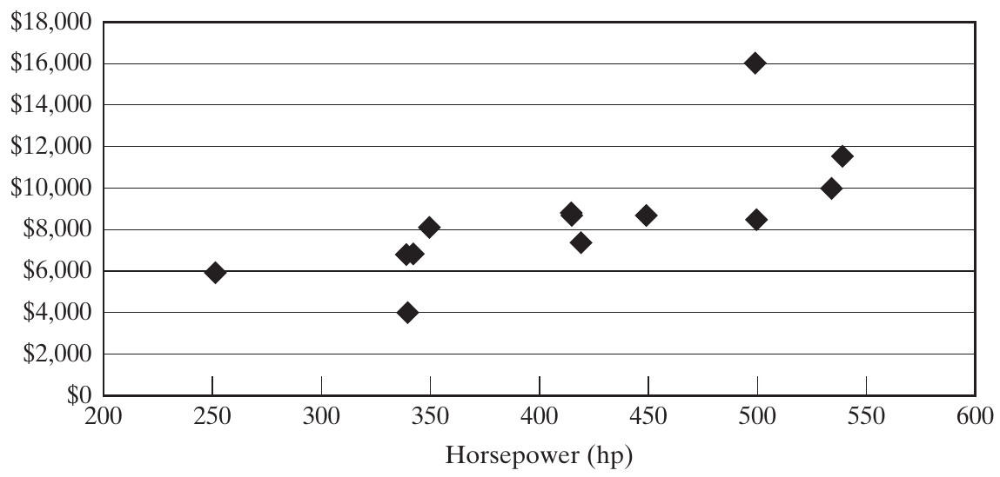{height=360px fig-align="center" fig-alt="Historical engine choices plotted by horsepower and dollar cost."}

::: {.side-caption}
Each point represents an engine. More power and lower cost are the preferred directions. Source: Crawley, Cameron & Selva (2016), Fig. 15.1, p. 346.
:::

::: {.notes}
- Read the axes aloud: horsepower horizontally, dollar cost vertically. These are the book's historical examples, not current engine prices.
- The observed options span roughly 250–540 hp. A gap could reflect technology, constraints, or which options were included; the plot alone cannot distinguish these explanations.
- Ask students to isolate engines around 330–350 hp. Then ask what they might miss by imposing an exact 335-hp requirement before exploring the alternatives.
- A tradespace is a set of architectures represented by two or more metrics. It deliberately condenses many design details.

**Discussion:** What could an exact 335-hp screen hide?

**Suggested answer:** Nearby engines with acceptable power and better cost or other attributes. Establish whether 335 hp is truly an exact requirement or a proxy for a broader performance need.

**Source:** Crawley, Cameron & Selva (2016), Fig. 15.1, p. 346.
:::


## Choosing metrics for a useful display {.smaller}

- Keep metrics **transparent**: fuel consumption is easier to interpret than an unexplained satisfaction score.
- Expose the **two or three important tradeoffs** to the decision maker.
- Make any aggregation and its weights visible.
- Use lower-priority goals to distinguish remaining candidates after the key tensions are understood.

A simple display should still lead back to the detailed goals.

::: {.notes}
- The chapter reconciles the detailed goals of Chapters 11–12 with the simpler objectives used in tradespace exploration and Chapter 16.
- Avoid a long, undifferentiated list of metrics, but do not throw away the underlying requirements. A screen is not a complete stakeholder model.
- Ask how changing the weight on environmental impact could change a single “car quality” score without changing either car.
- The point is to give decision makers visibility and authority over tradeoffs, rather than hiding those choices inside the analyst's aggregation.

**Discussion:** Can changing a quality-score weight change the winner without changing either car?

**Suggested answer:** Yes. The score reflects preferences as well as performance. Keep the underlying metrics visible so users can see whether a ranking change comes from evidence or weighting.

**Source:** Crawley, Cameron & Selva (2016), §15.2, pp. 346–347.
:::


## Tradespaces and point designs {.smaller}

| Tradespace exploration | Point-design comparison |
|---|---|
| Many architectures | A few developed designs |
| Lower fidelity per architecture | Greater detail per design |
| A few key metrics | Many detailed metrics |
| Discover families and major tensions | Scrutinize individual alternatives |

These approaches support different stages of a decision.

::: {.notes}
- A point design embodies substantial design effort. Comparing two such designs can deepen understanding but also anchor attention on an unnecessarily narrow set of possibilities.
- The book warns that point-by-point comparison can collapse into a single deciding metric, such as price, before the broader trade space has been considered.
- Ask: “When would you want the full specification sheet?” After narrowing the architectural families, or when checking an essential constraint.
- Building an enumerable tradespace has a real cost. The chapter argues that complex systems can justify that investment; it does not claim every small purchase needs one.

**Discussion:** When should we inspect full point-design details?

**Suggested answer:** When narrowing promising architectural families or checking an essential constraint. Broad tradespace exploration and detailed design verification serve complementary purposes.

**Source:** Crawley, Cameron & Selva (2016), §15.2, pp. 347–348.
:::


## Hybrid cars: critical and important goals {.smaller}

| Metric | Point design 1 | Point design 2 |
|---|---:|---:|
| **Critical:** CO₂ emissions | 128 g/km | 200 g/km |
| Supplier relationship score | 4/5 | 4/5 |
| Driver accommodation: males / females | 94% / 98% | 95% / 99% |
| **Important:** range | 200 km | 140 km |
| Regulatory compliance | Satisfies | Satisfies |
| Passenger capacity | 5 | 5 |
| Employee turnover | 2%/year | 2%/year |
| Fuel consumption | 4.2 L/100 km | 5.2 L/100 km |

::: {.notes}
- This is the critical/important portion of Table 15.1. Bold group labels identify priority categories, not a blanket preference for every value in one column.
- The original range requirement labels miles but the reported values are in km. Preserve the numerical entries in km; do not silently convert them as though they were miles.
- Driver accommodation uses the book's specified American male/female population measures. Ask how a contemporary project would define its relevant user population and accessibility needs.
- Identical supplier scores, compliance, seating, and turnover do not distinguish these two designs, although the corresponding requirements still matter.
- Ask students whether “lower turnover is always better” is actually established by this table. It is not necessary to decide here because both values are equal.

**Discussion:** How should a project define the population behind an accommodation goal?

**Suggested answer:** Identify its actual intended users, operating context, and access needs, then choose appropriate measures. A population assumption from the book's comparison is not automatically suitable for another project.

**Source:** Crawley, Cameron & Selva (2016), Table 15.1, p. 347.
:::


## Hybrid cars: desirable goals and screening {.smaller}

| Metric | Point design 1 | Point design 2 |
|---|---:|---:|
| Return on investment | 24% | 19% |
| Skidpad acceleration | 0.95 g | 0.82 g |
| Cargo volume | 1.1 m³ | 1.5 m³ |
| Sales price | $32,000 | $28,000 |

**Discuss:** if the minimum acceptable range is 160 km, which design remains? What if that limit is only a preference?

::: {.notes}
- This completes all twelve rows of Table 15.1. Its cargo requirement mentions cubic feet, while its values are m³; keep the reported m³ units.
- The five heuristics in the text are: set aside equal metrics; judge whether differences are effectively equivalent; focus on critical needs; identify justified constraints; and, if still tied, use a deciding metric such as price.
- With a hard 160-km range requirement, design 2 fails. If range is negotiable, it remains part of a tradeoff. Do not invent a constraint just to rationalize a favored choice.
- The source treats both handling values as potentially adequate for a sedan. Whether a difference is negligible depends on the use case; it may matter for a performance car.
- Cargo and price favor design 2, while several other values favor design 1. A lower price does not establish universal superiority.

**Discussion:** Why not discard a concept just because it misses a desirable goal?

**Suggested answer:** A desirable goal may be tradable against stronger benefits elsewhere. Separate hard acceptance conditions from preferences and document what value is lost or gained.

**Source:** Crawley, Cameron & Selva (2016), Table 15.1 and §15.2, pp. 347–348.
:::


# 15.3 The Pareto frontier

::: {.notes}
First establish dominance without weights. Then examine the GNC example and ask why a nominal frontier is only one screening tool. Source: §15.3, pp. 348–355.
:::


## Dominance: compare every metric {.smaller}

Using this chapter's terminology, architecture A:

- **Strongly dominates** B if A is strictly better in every metric.
- **Weakly dominates** B if A is at least as good in every metric and strictly better in at least one.

The **Pareto frontier** contains architectures that no other candidate dominates.

Always state whether each metric is to be minimized or maximized.

::: {.notes}
- In the chapter, “weakly dominates” includes the requirement of a strict improvement somewhere. Terminology varies between texts, so use the displayed inequalities rather than relying on the label alone.
- Two distinct architectures with identical metric values do not dominate one another under this rule. Retain both identities if later criteria might distinguish them.
- “Better” here is conditional on the modeled metrics, feasibility rules, and candidate set. It does not establish superiority on omitted properties.
- Pareto analysis requires no weight between metrics. Choosing among non-dominated alternatives does require further preferences or information.

**Discussion:** What is required for A to dominate B?

**Suggested answer:** A must be no worse on every modeled metric and strictly better on at least one, using the stated preferred directions. Superiority on only one metric is insufficient.

**Source:** Crawley, Cameron & Selva (2016), §15.3, pp. 348–349.
:::


## Worked example: three engines {.smaller}

| Engine | Power ↑ | Cost ↓ |
|---|---:|---:|
| A | 330 hp | $4,000 |
| B | 250 hp | $6,000 |
| C | 420 hp | $7,500 |

- A dominates B: **more power, lower cost**.
- A and C trade power against cost: neither dominates the other.
- The frontier is **{A, C}**.

*Illustrative classroom values; the dominance pattern follows Fig. 15.2.*

::: {.notes}
- Give students thirty seconds to name the preferred directions and identify the dominated engine before showing the conclusion verbally.
- The values are deliberately specified classroom numbers, not a digitization of Figure 15.2. That source has the same A-dominates-B, A-versus-C tradeoff.
- Ask whether a customer who needs at least 400 hp can pick A. A is non-dominated in the displayed set but fails that customer's additional constraint.
- Ask whether adding a warranty metric could rescue B. It could, if B has a meaningful advantage on the added metric; the earlier conclusion was conditional on two metrics.

**Discussion:** Which engine is feasible if at least 400 hp is required?

**Suggested answer:** Only C in the classroom set meets that threshold. A remains non-dominated in the original two-metric comparison, but non-dominance does not guarantee suitability for an added requirement.

**Source:** Crawley, Cameron & Selva (2016), Fig. 15.2 and §15.3, p. 349; classroom example.
:::


## Utopia, distance, and the shape of the front {.smaller}

- **Utopia** combines ideal values for every metric, whether jointly attainable or not.
- Locate the direction of improvement before reading the front.
- Distance to utopia depends on units, normalization, and preferences.
- A Pareto front need not be smooth or convex.
- A **knee** suggests a change in marginal tradeoff; it does not select the architecture for us.

::: {.notes}
- For cost versus horsepower, move down and right. The GNC mass–reliability plot has the same preferred direction.
- A point can be closer to a chosen ideal yet fail to dominate another point. Converting dollars to cents can radically change an unnormalized Euclidean distance without changing dominance.
- The book describes a typical curved envelope and a visual search from utopia. Treat this as a reading aid, not a dominance algorithm or a theorem about convexity.
- Discrete alternatives and technology changes generate irregular fronts. At a knee, ask how much extra mass the next reliability improvement costs and whether that improvement is needed.

**Discussion:** Why is distance to utopia sensitive to units?

**Suggested answer:** Rescaling cost or power changes geometric distances unless the metric scales are deliberately normalized. Proximity to an ideal point is therefore not a preference-free selection rule.

**Source:** Crawley, Cameron & Selva (2016), §15.3, pp. 351–352 and footnote.
:::


## The GNC example: function and scope {.smaller}

A guidance, navigation, and control system:

1. Measures the vehicle's current state.
2. Determines the desired state and control action.
3. Commands actuators to influence the vehicle.

Assume adequate functional performance; compare **mass** and **reliability**.

The chapter studies the **sensor–computer** portion of a larger sensor–computer–actuator system.

::: {.notes}
- GNC applies to cars, aircraft, robots, and spacecraft. Reliability matters particularly when maintenance is expensive or impossible.
- OPM connection: Measuring produces state information; Computing transforms that information into commands; sensors and computers are instruments. The commands support subsequent Actuating, which changes vehicle state.
- The book uses symmetry between sensor–computer and computer–actuator connections to limit the example. Do not represent its sensor–computer reliability as a fully validated vehicle-level reliability prediction.
- The autonomous-car examples include sonar, GPS, accelerometers, FPGAs, microprocessors, motors, and an engine. Those real functions are not automatically interchangeable; the simplified model assumes adequate performance and compatible paths.

**Discussion:** Why define GNC function before selecting sensors and computers?

**Suggested answer:** The required sensing and computation determine what counts as successful operation. Component counts and connections matter only through their ability to support those processes under the model's conditions.

**Source:** Crawley, Cameron & Selva (2016), §15.3, pp. 349–350.
:::


## GNC decisions and baseline assumptions {.smaller}

| Decision or assumption | Model choice |
|---|---|
| Number of sensors / computers | 1–3 of each |
| Type of each component | A, B, or C; increasing mass and reliability |
| Connections | Choose the sensor–computer topology |
| Connectivity rule | No isolated component |
| Baseline connections | Massless and perfectly reliable |
| Mixed component types | No initial penalty |

The book reports **20,509 valid architectures**.

::: {.notes}
- An architecture specifies counts, types, and the pattern of interconnection. A table of component counts alone is incomplete.
- Every sensor must connect to at least one computer and every computer to at least one sensor. This is not the same as requiring the entire graph to be connected: separate channels can be valid.
- The chapter reports the enumeration count but does not provide all numerical component data and implementation conventions needed to reproduce the full simulation here. Treat the published plots as source results.
- Ask which assumptions make extra connections look unusually attractive. Students should identify zero mass and perfect connection reliability immediately.

**Discussion:** Which baseline assumptions make extra connections especially attractive?

**Suggested answer:** Zero connection mass and perfect connection reliability remove important penalties. Under a different mass or fault model, additional links may create costs or risks as well as useful paths.

**Source:** Crawley, Cameron & Selva (2016), §15.3, pp. 349–350; Fig. 15.3.
:::


## Examples of valid connection topologies {.smaller}

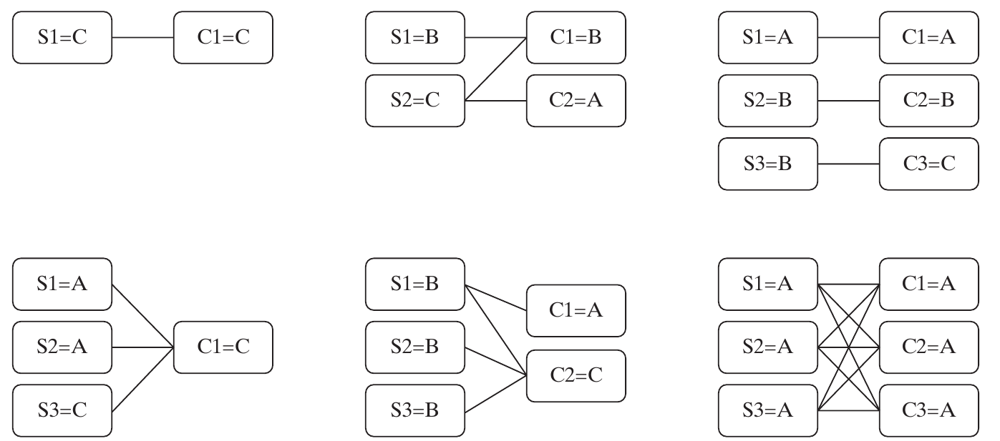{height=350px fig-align="center" fig-alt="Six valid sensor–computer configurations with component types A, B, and C and different links."}

::: {.side-caption}
S denotes a sensor and C a computer; the value after = is its type. These are connectivity sketches. Source: Crawley, Cameron & Selva (2016), Fig. 15.3, p. 350.
:::

::: {.notes}
- Trace a functioning sensor-to-computer route in each sketch. Then ask how the lower-right configuration differs from separate channels.
- Define fully cross-strapped: every sensor is connected to every computer. With three of each, there are nine links.
- Define homogeneous as one sensor type and one computer type within their respective classes; the sensor type and computer type need not be the same letter.
- These drawings show connectivity. Use OPM concepts from the preceding slide to explain the function-to-form allocation; use the sketches to inspect links.

**Discussion:** What functional check should we make on each topology?

**Suggested answer:** Trace a valid route from a working sensor to a working computer under the success definition. More links can provide alternatives, but the required process must still be supported.

**Source:** Crawley, Cameron & Selva (2016), Fig. 15.3, p. 350.
:::


## Reliability expressed as “number of nines” {.smaller}

For reliability $R<1$, define

$$n=-\log_{10}(1-R),\qquad R=1-10^{-n}.$$

| Reliability | Failure probability | Number of nines |
|---|---:|---:|
| 0.999 | $10^{-3}$ | 3 |
| 0.993 | 0.007 | ≈ 2.155 |
| 0.99999999 | $10^{-8}$ | 8 |

One additional nine means **ten times less failure probability**.

::: {.notes}
- The plot uses a logarithmic transformation of failure probability. Counting literal consecutive 9 digits is not enough for a value such as 0.993.
- Have students calculate 1−R first. A common mistake is taking −log10(R), which is a different quantity.
- R=1 would correspond to infinitely many nines; the finite right edge of the plot is not perfect reliability.
- Because the transformation is strictly increasing, it preserves dominance based on reliability, but it changes geometric distances and apparent slopes. Reliability also needs an operating-duration and success-event definition in an actual engineering study.

**Discussion:** What does one additional ‘nine’ mean?

**Suggested answer:** With n = −log10(1−R), increasing n by one reduces modeled failure probability by a factor of ten. It is not an equal additive increase in reliability probability.

**Source:** Crawley, Cameron & Selva (2016), Fig. 15.4, p. 351; explicit classroom formula.
:::


## The GNC mass–reliability tradespace {.smaller}

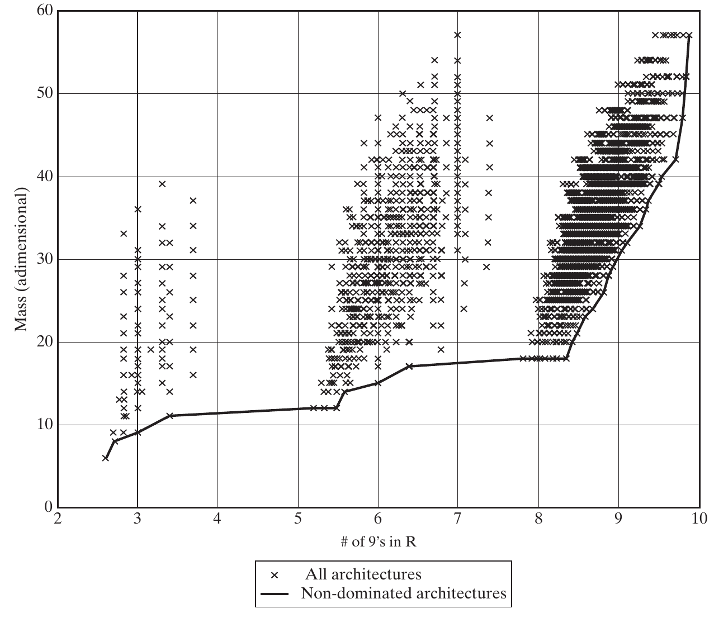{height=450px fig-align="center" fig-alt="GNC architectures plotted against number of reliability nines and dimensionless mass; the non-dominated front is highlighted."}

::: {.side-caption}
Mass is dimensionless; reliability increases to the right. The line marks non-dominated outcomes. Source: Crawley, Cameron & Selva (2016), Fig. 15.4, p. 351.
:::

::: {.notes}
- Ask students to find the direction toward utopia: lower mass and higher reliability. Explain that ideal zero mass and perfect reliability are hypothetical.
- The plot shows the published 20,509-architecture study, with many overlaid outcomes. A visible dot count is not the number of underlying architectures.
- All architectures are assumed to meet the functional-performance screen, so this plot focuses on a mass–reliability tension.
- Do not yet explain all the bands and clusters. Invite observations and hold them for §15.4, where structure becomes evidence about architectural choices.

**Discussion:** Which direction improves both GNC metrics?

**Suggested answer:** Toward lower mass and higher reliability. The ideal of zero mass and perfect reliability is a reference, not evidence that an achievable architecture exists there.

**Source:** Crawley, Cameron & Selva (2016), Fig. 15.4, p. 351.
:::


## Examining the high-reliability frontier {.smaller}

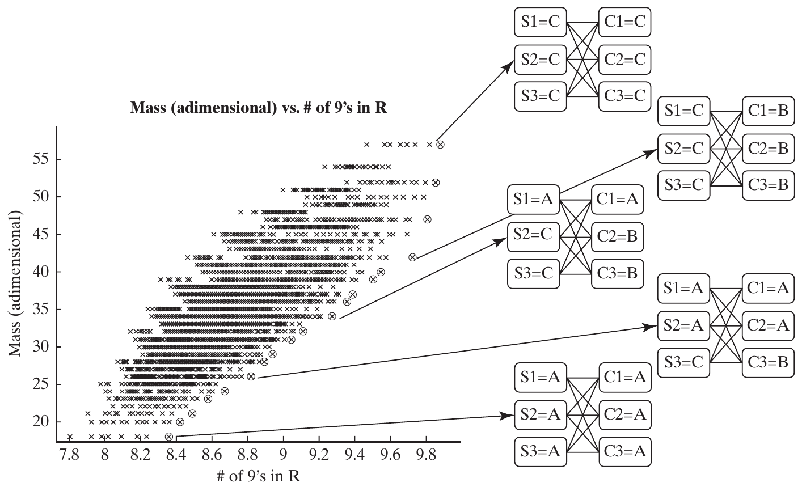{height=450px fig-align="center" fig-alt="High-reliability GNC outcomes with connection sketches for five selected configurations."}

::: {.side-caption}
The zoom includes the neighborhood of the eight-nines threshold and the frontier toward higher reliability. Source: Crawley, Cameron & Selva (2016), Fig. 15.5, p. 352.
:::

::: {.notes}
- The prose says four illustrated architectures, but the printed figure contains five sketches. Discuss the actual displayed configurations rather than repeating the count in the prose.
- The heaviest, most reliable illustrated architecture uses three type-C sensors and three type-C computers with complete interconnection.
- The light all-A configuration and mixed-type configurations illustrate technology changes along an irregular front.
- The chapter notes a knee around 9.7 nines, where additional reliability becomes mass-intensive. Ask whether an eight-nines requirement justifies paying to reach that knee.
- An arrow links a particular architecture to a point; it does not claim every point on that horizontal band has the same topology.

**Discussion:** Does an eight-nines requirement justify automatically choosing the knee near 9.7?

**Suggested answer:** No. Assess whether extra reliability delivers enough benefit to justify its mass and other costs. A knee describes a tradeoff change, not a universal acceptance target.

**Source:** Crawley, Cameron & Selva (2016), Fig. 15.5, p. 352.
:::


## Why retain a fuzzy Pareto frontier? {.smaller}

A **fuzzy frontier** retains some slightly dominated candidates near the front.

Reasons include:

- Uncertainty or error in the metric estimates.
- Benefits in omitted metrics or constraints.
- A useful member of an architecture family.
- Greater robustness to changes in assumptions.

Nominal non-dominance is a filter, not a final selection rule.

::: {.notes}
- Slightly dominated does not mean worthless. A tiny modeled advantage may disappear with measurement error or improved modeling.
- A family might need a common platform across several products; a member just off the nominal frontier may matter to that family-level choice.
- The chapter's “fuzzy frontier” is a relaxed screening set; it need not imply that a full fuzzy-set formalism is being used.
- Ask what would justify retaining an engine that costs $20 more with identical modeled power. Answers could include service access, uncertainty, or compatibility, but the rationale should be explicit.

**Discussion:** Why keep a slightly dominated candidate?

**Suggested answer:** Its small modeled disadvantage may be outweighed by uncertainty or an unmodeled benefit such as compatibility. A fuzzy frontier preserves such options for further study under an explicit retention rule.

**Source:** Crawley, Cameron & Selva (2016), §15.3, p. 352.
:::


## Mining a feature on the frontier {.smaller}

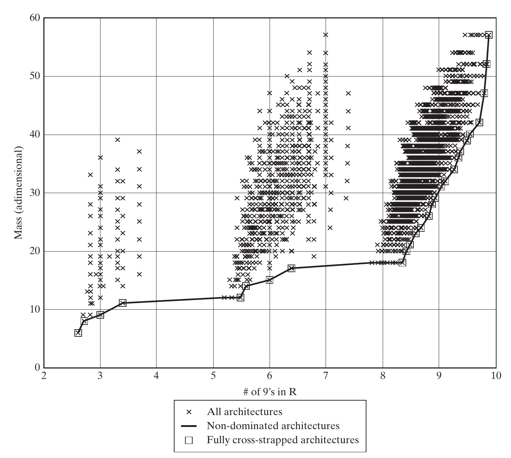{height=440px fig-align="center" fig-alt="The baseline GNC tradespace with fully cross-strapped frontier architectures marked by squares."}

::: {.side-caption}
In the baseline model, every non-dominated architecture is fully cross-strapped. Source: Crawley, Cameron & Selva (2016), Fig. 15.6, p. 353.
:::

::: {.notes}
- First inspect the legend, then trace the square markers along the frontier. This is a systematic way of testing an apparent pattern from the individual sketches.
- Ask whether every fully cross-strapped architecture must be on the frontier. No: the implication goes from being on the front to having the feature, not the reverse.
- The zero-mass, perfect-link assumptions make adding usable paths free in the plotted objectives. This gives a model-based reason for the pattern, subject to how reliability is computed.
- Keep the conclusion conditional; §15.5 changes connection mass and tests whether the feature remains dominant.

**Discussion:** If every frontier candidate is cross-strapped, is every cross-strapped candidate on the frontier?

**Suggested answer:** No. Having the feature may be necessary for membership in that observed front, but is not sufficient. Other choices can still make a cross-strapped architecture dominated.

**Source:** Crawley, Cameron & Selva (2016), Fig. 15.6, p. 353.
:::


## Feature frequencies: keep denominators straight {.smaller}

| Feature | Share of all architectures | Share of Pareto front | Share of feature group on front |
|---|---:|---:|---:|
| Fully cross-strapped | 2% | 100% | 7% |
| Homogeneous | 7% | 33% | 1% |
| ≥1 type-C sensor | 59% | 56% | 0.1% |

**Three different questions:** $P(F)$, $P(F\mid PF)$, and $P(PF\mid F)$.

*Reported percentages from Table 15.2.*

::: {.notes}
- Read one row in complete sentences before interpreting it: 2% of all architectures are cross-strapped; 100% of front architectures are cross-strapped; only 7% of cross-strapped architectures lie on the front.
- The surrounding prose mistakenly says all homogeneous architectures are on the front, conflicting with the printed 1% in the last column. Use the table and the correct distinction between the two conditional percentages.
- A bullet in the source names type-A sensors, while the table and interpretation name type C. Follow type C consistently.
- These are reported, rounded summary percentages, not raw counts. They do not support reconstructing an exact common frontier size; do not treat them as a fully consistent exact joint probability table.

**Discussion:** Which two denominators matter in feature mining?

**Suggested answer:** The share of frontier architectures with the feature and the share of all architectures with it. Comparing them reveals enrichment; either percentage alone can mislead.

**Source:** Crawley, Cameron & Selva (2016), Table 15.2 and accompanying text, p. 354.
:::


## What the feature frequencies imply {.smaller}

- **Cross-strapping:** strongly enriched on the front; necessary in this baseline, not sufficient.
- **Homogeneity:** overrepresented, but most frontier architectures are not homogeneous.
- **At least one C sensor:** 56% on the front versus 59% overall; little enrichment.

Feature enrichment suggests where to investigate. It does not establish a universal design law.

::: {.notes}
- Compare baseline prevalence with prevalence among good outcomes; a feature that is common everywhere is not necessarily informative.
- Ask why 33% can represent enrichment: it is much larger than the 7% base share. It still means 67% of the front is not homogeneous.
- These frequencies depend on the enumerated space and how architectures are represented or duplicated. They are associations within this model, not frequencies of success in the real world.
- The chapter allows this analysis on a fuzzy front as well as the strict front; specify which set forms the denominator each time.

**Discussion:** Why is a 33% frontier share noteworthy when the feature's base share is 7%?

**Suggested answer:** The feature is much more common on the frontier than in the full space. It is still absent from 67% of frontier candidates, so enrichment is not universality.

**Source:** Crawley, Cameron & Selva (2016), §15.3, pp. 353–354; Table 15.2.
:::


## Computing the Pareto front {.smaller}

For each feasible candidate A:

1. Compare A with other candidates in **all** metrics.
2. If some B is no worse in every metric and better in at least one, mark A dominated.
3. Keep candidates for which no such B exists.

A direct pairwise method costs **$O(MN^2)$** for $N$ architectures and $M$ metrics.

::: {.notes}
- Demonstrate an early exit: as soon as B dominates A, there is no need to find every other dominator just to decide front membership.
- The complexity is the straightforward worst-case comparison count, not a lower bound on all possible algorithms.
- Check all objective directions consistently, exclude infeasible points first, and retain ties in outcome values under the chapter's strict-improvement requirement.
- When many metrics are present, most candidates may be non-dominated because each is better somewhere. The resulting large front limits Pareto dominance as a down-selection method.

**Discussion:** How would a simple Pareto-front algorithm classify one candidate?

**Suggested answer:** Compare it against the other feasible candidates. If any is no worse on all metrics and better on at least one, it is dominated; otherwise retain it on the front.

**Source:** Crawley, Cameron & Selva (2016), §15.3, pp. 354–355.
:::


## Non-dominated sorting {.smaller}

- **Rank 1:** the original Pareto front.
- Remove rank 1 and compute the remaining front → **rank 2**.
- Repeat until all candidates have ranks.

High ranks indicate domination by successive layers of alternatives.

Repeated naive filtering can cost **$O(MN^3)$**; retaining dominance relationships can reduce repeated work at a memory cost.

::: {.notes}
- Rank is relative to the current candidate set and metric definitions, not a universal performance score.
- The O(MN³) statement is a worst-case bound for repeating the simple all-pairs method across up to N layers, as discussed by the chapter.
- The source points to faster non-dominated sorting, including the NSGA-II reference. Do not imply this is the only or fastest possible algorithm.
- Ask whether rank 2 is “twice as bad” as rank 1. No; ranking does not measure distance or utility.

**Discussion:** Is a rank-2 architecture twice as bad as rank 1?

**Suggested answer:** No. Rank records successive non-dominated layers. It does not measure utility, performance distance, or how much a stakeholder should prefer one candidate.

**Source:** Crawley, Cameron & Selva (2016), §15.3, p. 355; reference [4], p. 371.
:::


## Practice: assign Pareto ranks {.smaller}

| Architecture | Mass ↓ | Reliability nines ↑ |
|---|---:|---:|
| A | 4 | 6 |
| B | 5 | 8 |
| C | 6 | 9 |
| D | 5 | 5 |
| E | 7 | 7 |
| F | 8 | 4 |

*Classroom data.* Identify the first front, remove it, and repeat.

::: {.notes}
- Give pairs two minutes. The answer is rank 1: A, B, C; rank 2: D, E; rank 3: F.
- A dominates D, B and C dominate E, and several points dominate F. D and E trade mass against reliability once the first front is removed.
- Have a student justify why A and B do not dominate one another. Checking only mass is a common error.
- Keep the dataset on the board for the next discussion of fuzzy filters. Its mass values are illustrative units, not the source GNC data.

**Discussion:** What are the Pareto ranks in the practice dataset?

**Suggested answer:** Rank 1 contains A, B, and C; remove them, then rank 2 contains D and E; F is rank 3. Apply dominance using both metric directions at each step.

**Source:** Crawley, Cameron & Selva (2016), §15.3, p. 355; classroom exercise.
:::


## Two ways to build a fuzzy filter {.smaller}

| Method | Example rule | Limitation |
|---|---|---|
| Pareto rank | Keep ranks 1–3 | Dense regions can assign poor ranks to nearby points |
| Distance from front | Keep points within a normalized tolerance | Result depends on scales and distance definition |

A **10% distance threshold** is an example in the chapter, not a universal engineering tolerance.

::: {.notes}
- Revisit the classroom ranking example: rank-based filtering can keep all six points if we choose rank≤3. That does not make every one acceptable.
- A dense cloud near the front may contain many domination layers, while a remote point in a sparse region may have a small rank.
- For a distance filter, state how each metric is normalized and whether distance is measured to actual feasible frontier points or an interpolated envelope. Interpolation may pass through infeasible designs.
- Tolerances should reflect uncertainty, stakes, and modeling purpose. This is the first cut toward a manageable set, not a substitute for requirements or judgment.

**Discussion:** Why might two fuzzy-filter methods retain different candidates?

**Suggested answer:** Successive dominance layers and distance-based tolerances measure different notions of closeness. State the rule and scaling before interpreting membership as being ‘near’ the frontier.

**Source:** Crawley, Cameron & Selva (2016), §15.3, p. 355.
:::


# 15.4 Structure of the tradespace

::: {.notes}
Revisit features students noticed in the full GNC cloud. A frontier is only its boundary; clusters, holes, and strata can expose what drives the outcomes. Source: §15.4, pp. 355–358.
:::


## Clusters in the GNC tradespace {.smaller}

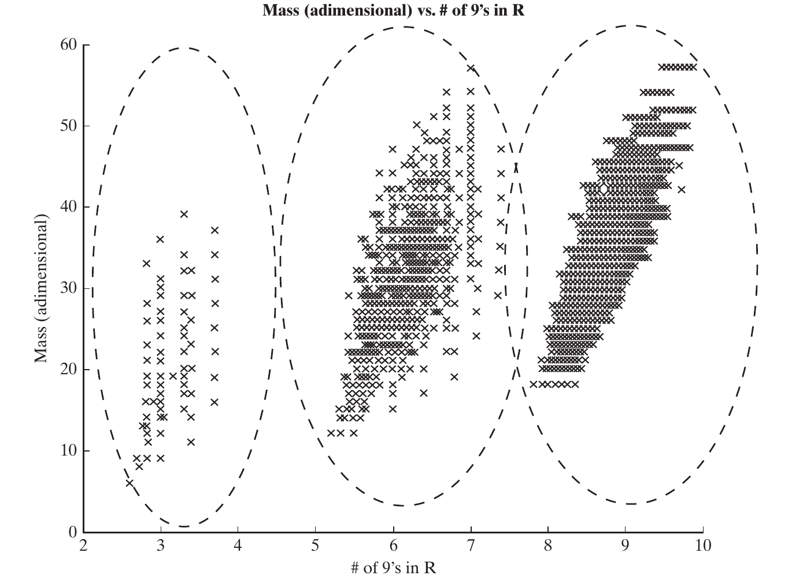{height=440px fig-align="center" fig-alt="The GNC mass–reliability outcomes form three broad clusters highlighted by dashed outlines."}

::: {.side-caption}
Clusters group similar outcomes; the architectural cause still needs to be identified. Source: Crawley, Cameron & Selva (2016), Fig. 15.7, p. 356.
:::

::: {.notes}
- Ask students how they would describe the cloud without naming a component choice. The three regions are initially an observation in metric space.
- Two architectures near one another in mass and reliability may have very different decisions or topologies. Outcome-space distance is not architectural distance.
- Holes, fronts, and groups can arise from discrete metrics, metric ranges, physical limits, or the enumerated choices. A visually striking structure needs an explanation.
- The dashed cluster boundaries are qualitative guides, not proofs of three uniquely optimal statistical clusters.

**Discussion:** Does a visible cluster prove its members share a component type?

**Suggested answer:** No. It is first an observation in metric space. Inspect decision attributes and possible emergent properties to explain the grouping and look for counterexamples.

**Source:** Crawley, Cameron & Selva (2016), Fig. 15.7, p. 356.
:::


## Explaining clusters with an emergent property {.smaller}

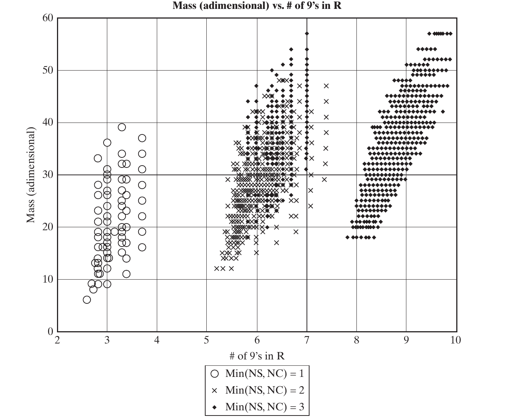{height=440px fig-align="center" fig-alt="GNC points are marked by the minimum of sensor count and computer count, with values one, two, or three."}

::: {.side-caption}
The feature min(NS, NC) helps explain the three reliability regions. Source: Crawley, Cameron & Selva (2016), Fig. 15.8, p. 357.
:::

::: {.notes}
- NS is the number of sensors and NC the number of computers. Their minimum is an emergent property of two choices, not one independent decision in the model.
- Leftmost architectures have min(NS,NC)=1; min=2 occupies the middle region. The rightmost region has min=3, but some min=3 architectures appear in the middle too.
- Ask why three computers cannot remove a single sensor's failure risk if a working sensor is required. This gives a bottleneck explanation without treating count alone as a complete reliability model.
- The authors note that changing component reliabilities can separate or merge the apparent groups; the architectural explanation should be tested beyond one parameter setting.

**Discussion:** Why can't three computers eliminate the risk of a single required sensor?

**Suggested answer:** If successful operation requires a working sensor, its failure remains a bottleneck. Extra computation cannot replace missing measurement capability under that success definition.

**Source:** Crawley, Cameron & Selva (2016), Fig. 15.8, p. 357.
:::


## A useful cluster-analysis workflow {.smaller}

1. Identify a concentration or gap in metric space.
2. Mark points by a decision choice or derived architectural feature.
3. Check whether the marked groups explain the pattern.
4. Inspect exceptions and repeat under changed assumptions.

A family requires evidence of similar **architectures and outcomes**, not just nearby plotted points.

::: {.notes}
- Visual inspection is a useful starting point; clustering algorithms can also partition the data. Appendix B supplies methods beyond this chapter's scope.
- The chapter relates architectural families to set-based S-Pareto frontiers. Mention this connection without introducing an unsupported new algorithm here.
- Ask what finding would weaken the min(NS,NC) explanation: many counterexamples or disappearance of the pattern under plausible component values.
- If all points share a high score in one metric because of a hidden constraint, coloring by unrelated labels can still produce misleading apparent groups. Check the model and sampling scheme.

**Discussion:** What would weaken the proposed explanation based on min(NS, NC)?

**Suggested answer:** Many counterexamples, or disappearance of the pattern under plausible component assumptions. A useful explanation should predict the grouping and survive checks beyond the original plot.

**Source:** Crawley, Cameron & Selva (2016), §15.4, pp. 355–357; reference [5], p. 371.
:::


## Strata: repeated values of one metric {.smaller}

**Stratification:** points form horizontal or vertical bands because one metric takes only a few distinct values.

- A discrete objective, such as the number of projects, can create strata.
- Continuous quantities can also have discrete attainable sums.
- The baseline GNC component choices produce **49 mass values**.
- Within a mass stratum, retain the greatest reliability; equal-score architectures can still tie.

::: {.notes}
- In the massless-link model, different topologies can change reliability without changing the component mass sum.
- A stratum is not necessarily one architectural family: several different component combinations may happen to have equal total mass.
- In two objectives, at most one distinct non-dominated metric value can remain per mass level, although multiple architecture identities can share that value. Entire strata can also be dominated by another stratum.
- The book says frontier size is typically similar to the number of strata; explain these qualifications rather than teaching exact equality.

**Discussion:** How is a stratum different from a cluster?

**Suggested answer:** A stratum fixes one metric while another varies; a cluster is a concentration of outcomes. Neither alone establishes that the architectures share all underlying decisions.

**Source:** Crawley, Cameron & Selva (2016), §15.4, pp. 357–358.
:::


## One stratum: AAA–AAA {.smaller}

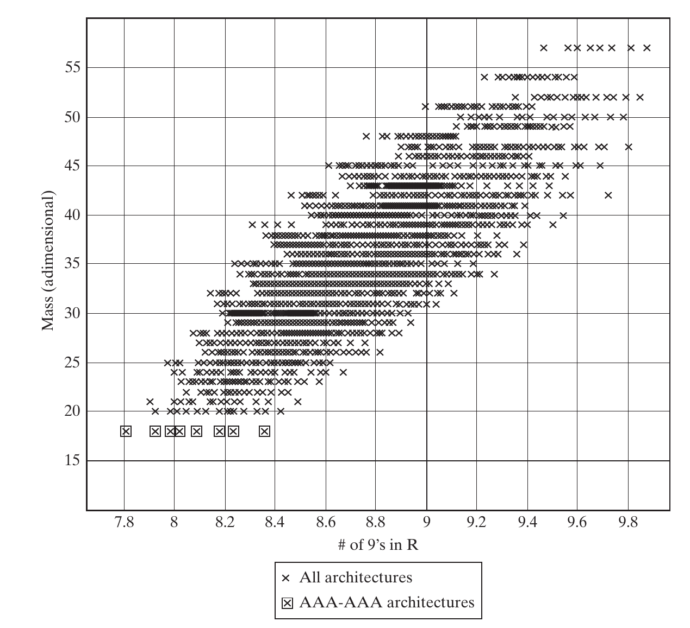{height=440px fig-align="center" fig-alt="High-reliability GNC outcomes highlighting configurations with three type-A sensors and three type-A computers."}

::: {.side-caption}
Fix the components and vary their connections: reliability changes while baseline mass stays fixed. Source: Crawley, Cameron & Selva (2016), Fig. 15.9, p. 358.
:::

::: {.notes}
- AAA–AAA denotes three sensors of type A and three computers of type A. It says nothing by itself about which links are present.
- The highlighted horizontal band contains different interconnection patterns. Perfect, massless links allow added paths to improve or preserve reliability without increasing mass.
- The fully cross-strapped configuration is the best-reliability endpoint for this fixed component set under the stated model.
- Ask what happens to this horizontal band if each connection has positive mass. Its points no longer all have the same mass; this is the transition to sensitivity analysis.

**Discussion:** What happens to the AAA–AAA mass stratum if each connection has positive mass?

**Suggested answer:** Topologies with different numbers of connections acquire different masses, so the formerly equal-mass band separates. The stratum depended on the original mass assumption.

**Source:** Crawley, Cameron & Selva (2016), Fig. 15.9, p. 358.
:::


# 15.5 Sensitivity and robustness

::: {.notes}
Separate two questions: is a model result stable under changed assumptions, and does a particular architecture perform well across relevant conditions? Source: §15.5, pp. 359–363.
:::


## Test the assumptions behind the result {.smaller}

A posteriori sensitivity analysis reruns the model under alternative assumptions.

For the GNC example, vary:

- Connection mass.
- Penalty or benefit for dissimilar components.
- Component masses and reliabilities.

Compare frontier membership, architectural features, and metric values across scenarios.

::: {.notes}
- This work occurs toward the end of Simon's Design Activity and may require more resources than the initial model run.
- A scenario is a coherent set of inputs. Specify which variables change and which remain fixed so differences are interpretable.
- Do not only check whether the same point is still non-dominated. A changed value, changed feature frequency, or shifted knee can all matter to the decision.
- Nominal means the chosen baseline assumptions, not a guaranteed or most likely future unless that interpretation has been justified.

**Discussion:** Which assumption should we test first?

**Suggested answer:** Favor uncertain assumptions that could change the conclusion and are worth resolving. Perturb them over defensible ranges and inspect whether the preferred families or feasibility conditions change.

**Source:** Crawley, Cameron & Selva (2016), §15.5, p. 359.
:::


## Adding mass to connections {.smaller}

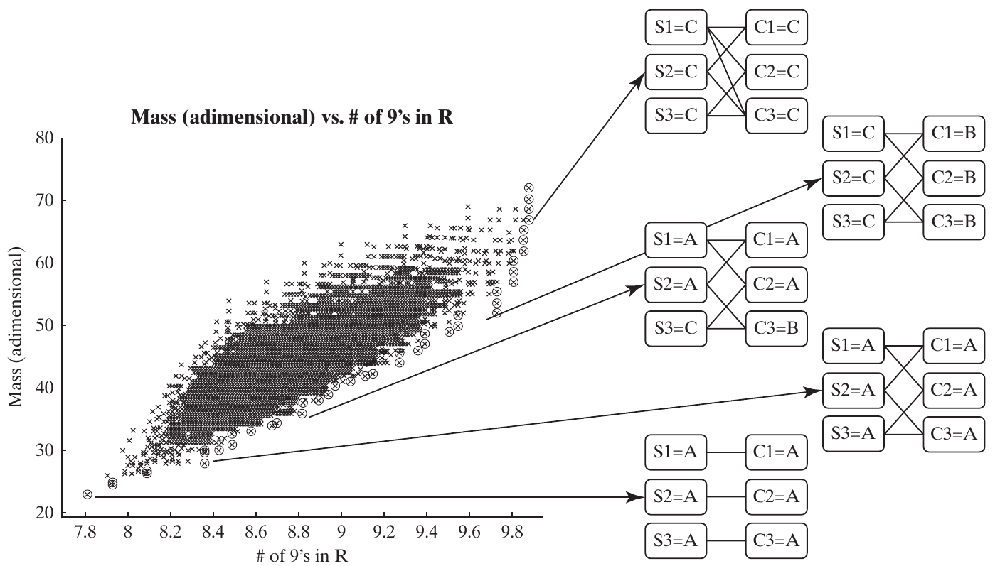{height=450px fig-align="center" fig-alt="GNC high-reliability tradespace when connection weight is five thirds and dissimilar-component penalty is zero."}

::: {.side-caption}
Published scenario: connection weight = 5/3; dissimilar-component penalty = 0. Source: Crawley, Cameron & Selva (2016), Fig. 15.10, p. 359.
:::

::: {.notes}
- Compare with Figure 15.5: the horizontal bands arising solely from changing links no longer remain horizontal at one fixed mass.
- The selected configurations now include channelized and partially connected architectures; complete cross-strapping no longer occupies the whole front.
- Channelized here means separate sensor–computer paths, not one single link for the entire architecture. Some configurations also use two connections per component.
- The mass axis is normalized, not kilograms or pounds. Explain that more links now carry a cost in the objective while connection reliability remains an assumption of this scenario.

**Discussion:** Why can adding connection mass alter the Pareto front?

**Suggested answer:** Architectures with more links incur a larger mass penalty. Their reliability advantage must now be compared against an added cost that was absent from the baseline model.

**Source:** Crawley, Cameron & Selva (2016), Fig. 15.10, p. 359.
:::


## Penalizing dissimilar components {.smaller}

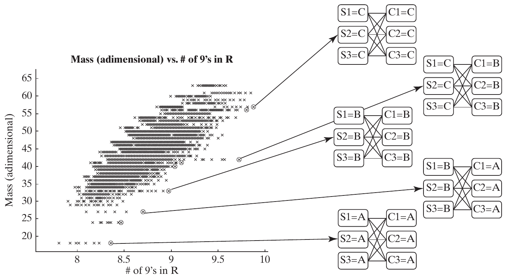{height=430px fig-align="center" fig-alt="GNC outcomes with zero connection weight and dissimilar-component penalty of nine; homogeneous configurations populate the frontier."}

::: {.side-caption}
Published scenario: connection weight = 0; dissimilar-component penalty = 9. Source: Crawley, Cameron & Selva (2016), Fig. 15.11, p. 360.
:::

::: {.notes}
- In this source scenario, the large positive penalty drives the frontier toward homogeneous architectures.
- Homogeneous means a single type within the sensors and a single type within the computers. For example, CCC sensors with BBB computers still meet this interpretation.
- A positive penalty might represent the burden of more component types; a negative value could express a modeled benefit of diversity against common-cause failures.
- Do not automatically translate organizational burden into physical mass or count a diversity reliability benefit twice. A real model needs a justified metric or proxy. This is the chapter's illustrative penalty model.
- The raw penalty of 9 in this figure is not the same numerical normalization as the later horizontal axis in Figure 15.13.

**Discussion:** What does a dissimilarity penalty represent?

**Suggested answer:** It models an assumed cost of mixing component types, such as integration burden. Its magnitude and interpretation need justification; it is not an inherent universal price of diversity.

**Source:** Crawley, Cameron & Selva (2016), Fig. 15.11, p. 360.
:::


## Is cross-strapping a robust finding? {.smaller}

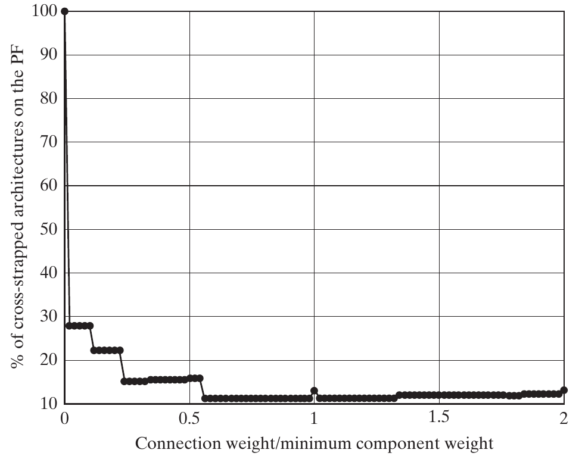{height=430px fig-align="center" fig-alt="Percentage of Pareto-front architectures that are fully cross-strapped versus normalized connection weight."}

::: {.side-caption}
At zero connection mass, the share is 100%; at a ratio of 0.02, the chapter reports less than 30%. Source: Crawley, Cameron & Selva (2016), Fig. 15.12, p. 361.
:::

::: {.notes}
- Read the denominator: this is the share of the Pareto front having a feature, not the reliability of one architecture and not the share of all architectures on the front.
- The horizontal variable is connection weight divided by minimum component weight. A value of 0.02 means 2% of that reference weight.
- The sharp decline shows that the all-cross-strapped conclusion is fragile. It does not show that every cross-strapped design becomes bad; some remain on the front.
- A more robust conclusion is that complete cross-strapping does not dominate the frontier unless connection mass is negligible relative to component mass.

**Discussion:** When can we call the cross-strapping result robust?

**Suggested answer:** When its relevant advantage persists across the tested plausible assumptions. Report which variations were examined; robustness over a limited scenario set is not a guarantee under all failure models.

**Source:** Crawley, Cameron & Selva (2016), Fig. 15.12, p. 361.
:::


## Three regions of diversity sensitivity {.smaller}

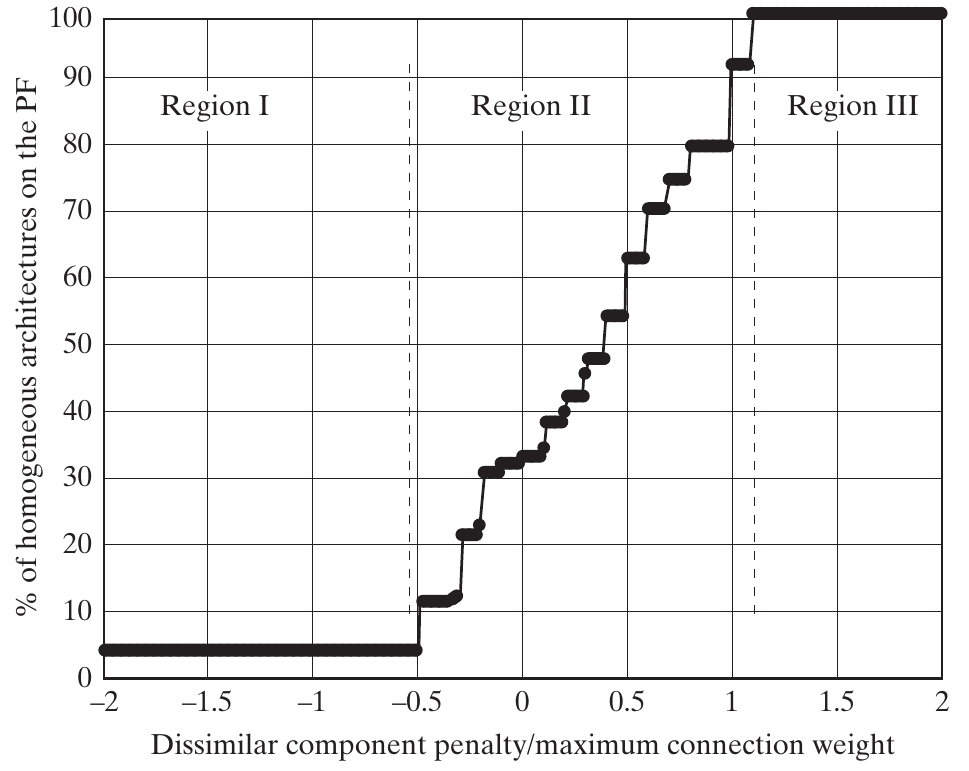{height=430px fig-align="center" fig-alt="Homogeneous share of the GNC Pareto frontier rises across a middle range of normalized dissimilar-component penalty."}

::: {.side-caption}
Low penalty: few homogeneous choices. Middle region: strong sensitivity. High penalty: all frontier choices homogeneous. Source: Crawley, Cameron & Selva (2016), Fig. 15.13, p. 362.
:::

::: {.notes}
- The text places region boundaries near −0.5 and 1.1. Between them the homogeneous share rises from about 4% to 100%; the baseline penalty of zero lies in the sensitive region.
- Explain the source inconsistency explicitly: the prose on p. 361 says normalization by maximum component mass, but the printed axis says maximum connection weight. Preserve the original plot; do not use these threshold values as a physical calibration until the denominator is resolved.
- The default claim that 33% of the front is homogeneous is therefore model-sensitive, even apart from the labeling ambiguity.
- Ask where improved knowledge of the penalty is most valuable: the transition region, where a plausible change can alter the conclusion.

**Discussion:** Where is better knowledge of the diversity penalty most valuable?

**Suggested answer:** Near the transition where plausible penalty changes alter the preferred architectures. Far from that threshold, the same information may be less likely to change the decision.

**Source:** Crawley, Cameron & Selva (2016), Fig. 15.13, p. 362.
:::


## The cost of scenario enumeration {.smaller}

A full grid multiplies the numbers of input settings.

- Connection weight 0–2 by 0.1: **21 settings**.
- Dissimilar-component penalty −2–10 by 1: **13 settings**.
- Additional component-property alternatives multiply these again.

Even these first two inputs require **273 model runs**.

Use **Latin hypercubes** or **orthogonal arrays** to plan a smaller, informative scenario set.

::: {.notes}
- The chapter estimates about 600,000 runs for an expanded experiment with several component-property alternatives. Its prose does not specify the factor counting sufficiently to derive that number uniquely, so do not manufacture an exact reconstruction.
- The displayed 21×13=273 is an explicit classroom calculation for the two fully specified ranges, inclusive of endpoints.
- Latin hypercube sampling spreads samples across each input's range; orthogonal arrays provide balanced combinations for selected effects. They reduce cost but do not guarantee that every interaction or rare failure is captured.
- Distinguish a scenario run from an architecture evaluation: each scenario may require evaluating thousands of architectures. Chapter 16 discusses experimental design further.

**Discussion:** Why does adding uncertain inputs make scenario enumeration expensive?

**Suggested answer:** Scenario combinations multiply across inputs, and each may require evaluating many architectures. Count architecture–scenario evaluations, not only the number of scenario labels.

**Source:** Crawley, Cameron & Selva (2016), §15.5, pp. 360, 363; classroom count.
:::


## Robustness and adaptability {.smaller}

**Robustness:** maintain useful performance despite variations.

**Adaptability:** change the system to respond to new conditions.

Consider variations in:

- Architectural inputs and assumptions.
- Design and implementation.
- Technical, market, and operating environments.

A narrow nominal optimum can be fragile if it depends on an immature technology.

::: {.notes}
- This covers Box 15.1. Its Augustine epigraphs caution against expensive last increments of performance and unjustified optimism; treat them as provocations, not empirical constants.
- Ask: “If a new sensor is delayed, can the architecture use an existing sensor?” This may reveal a tradeoff between nominal performance and the ability to adapt.
- Robust does not mean unchanged metric values, and adaptable does not mean costless modification. Both need a clear definition of acceptable value delivery and relevant variations.
- Pareto-optimal designs are sometimes especially fragile, not invariably so. Assess the tradeoff instead of asserting that all optimal designs are poor choices.

**Discussion:** How does adaptability differ from robustness?

**Suggested answer:** Robustness concerns maintaining acceptable performance across conditions without the specified redesign; adaptability concerns changing the system to respond. A substitute sensor may improve adaptability while carrying interface or performance costs.

**Source:** Crawley, Cameron & Selva (2016), Box 15.1, p. 363; §15.5, pp. 361–362.
:::


## Measuring performance across scenarios {.smaller}

For each architecture, examine:

- Mean metric values across the selected scenarios.
- Fraction of scenarios meeting a stated threshold.
- Frequency of membership in the fuzzy Pareto frontier.
- Scenarios with unacceptable outcomes.

Report both the result and **which scenarios were included**.

::: {.notes}
- A design that repeatedly appears on the fuzzy front is a useful candidate for robust performance, conditional on the scenarios studied.
- Frontier membership is relative to the other candidates in each scenario. It can change even if a particular architecture's score changes little.
- Equal weighting describes an average over the selected scenario set; it is not automatically a probability of future success.
- The chapter emphasizes averages and fractions of good outcomes. Add inspection of unacceptable cases so an attractive average does not hide a violated essential requirement.

**Discussion:** Why report a threshold-satisfaction measure as well as an average?

**Suggested answer:** An average can hide unacceptable outcomes. The proportion or probability of scenarios meeting a requirement reveals a different aspect of performance, conditioned on the scenario model.

**Source:** Crawley, Cameron & Selva (2016), §15.5, pp. 361–362; Box 15.1.
:::


## Weighting scenarios by probabilities {.smaller}

The chapter gives this connection-weight illustration:

| Scenario | Input value | Probability |
|---|---:|---:|
| Optimistic | 0.05 | 0.20 |
| Best guess | 0.20 | 0.60 |
| Pessimistic | 0.50 | 0.20 |

$$\mathbb{E}[M(a)]=\sum_s p_s\,M(a;s),\qquad \sum_s p_s=1.$$

Use probabilities only when there is a defensible basis for them.

::: {.notes}
- Here M(a;s) is the metric of architecture a evaluated under scenario s. The probabilities weight scenarios, not the architecture decision alternatives.
- The numbers are a source illustration, not measured probabilities for a particular hardware program.
- Ask why evaluating only at the expected input can fail: for a nonlinear model, the metric at the expected input need not equal the expected metric.
- For multiple uncertain inputs, dependence between them matters. Independently combining marginal distributions is an additional assumption, not a free consequence of Monte Carlo sampling.

**Discussion:** Why not evaluate the model only at the expected input?

**Suggested answer:** For nonlinear models, the metric at the expected input generally differs from the expected metric. Evaluate scenarios or samples and combine their outputs with appropriate probabilities.

**Source:** Crawley, Cameron & Selva (2016), §15.5, p. 362; explicit expectation notation.
:::


## Worked example: average and threshold {.smaller}

*Illustrative metric outputs under the preceding scenario probabilities; lower is better.*

| Architecture | Optimistic | Best guess | Pessimistic |
|---|---:|---:|---:|
| A | 10 | 14 | 26 |
| B | 12 | 15 | 20 |

$$\mathbb{E}[M_A]=15.6,\qquad \mathbb{E}[M_B]=15.4.$$

For the requirement $M\leq20$: A meets it with probability **0.8**, B with **1.0**, under these scenarios.

::: {.notes}
- These are classroom outputs, not a reconstruction of the GNC plots. Use the weights 0.2, 0.6, and 0.2 from the preceding slide.
- Compute A: 2+8.4+5.2=15.6. Compute B: 2.4+9+4=15.4. The average difference is small, but the threshold distinction is consequential.
- Ask whether B is therefore always preferable. Only under the modeled criteria and scenario assumptions; omitted metrics could still change the decision.
- “Probability 1.0” here means all probability mass in this finite model satisfies the threshold, not a guarantee under every possible real-world event.

**Discussion:** What distinguishes A and B in the classroom scenario calculation?

**Suggested answer:** Their expected metrics are close: 15.6 and 15.4. For M≤20, A meets the threshold with probability 0.8 and B with 1.0 within the stated finite scenario model.

**Source:** Crawley, Cameron & Selva (2016), §15.5, p. 362; classroom calculation.
:::


## Monte Carlo and practical scenario design {.smaller}

- Assign distributions to uncertain inputs and simulate resulting outcomes.
- Examples include demand, material prices, and enabling-technology performance.
- Accurate tail estimates can require many evaluations.
- Input distributions may themselves be difficult to justify.

When full sampling is impractical, choose scenarios that span the important ranges and interactions.

::: {.notes}
- The source's graphene price example is a historical five-year forecast illustration: $1/cm² with probability 0.6, $10/cm² with 0.2, and $0.1/cm² with 0.2. It is not a current price or forecast.
- It also mentions power-grid demand and optical-transceiver performance as uncertain inputs. The common lesson is how assumptions propagate to architecture outcomes.
- Sampling cannot resolve an ambiguous requirement or repair an incorrect physical model. More samples mainly reduce sampling error conditional on that model.
- Use Latin hypercubes or orthogonal arrays when appropriate, and include plausible adverse combinations. Explain the practical limits of the reduced scenario set rather than claiming exhaustive robustness.

**Discussion:** What does increasing Monte Carlo sample size improve, and what does it not fix?

**Suggested answer:** It can reduce sampling error for the chosen distributions. It does not correct omitted scenarios, wrong distributions, or biased architecture evaluation models.

**Source:** Crawley, Cameron & Selva (2016), §15.5, pp. 362–363 and references [6]–[8].
:::


# 15.6 Organizing architectural decisions

::: {.notes}
Now the dots will represent decisions rather than architectures. The aim is to identify decisions with strong metric effects and decisions that constrain many other choices. Source: §15.6, pp. 364–370.
:::


## Two meanings of a high-impact decision {.smaller}

| Impact | Question | Measure |
|---|---|---|
| On other decisions | How much does this choice constrain or couple other choices? | Connectivity |
| On system outcomes | How much do important metrics change across alternatives? | Sensitivity |

A decision may be high on one measure and low on the other.

::: {.notes}
- Examples from the book: drive-wheel choice affects steering geometry, engine layout, and suspension; processor choice affects memory and other design choices.
- Reconnect to Chapter 14's two kinds of relationships: logical constraints and joint contributions to metrics.
- Low logical degree does not imply an unimportant metric effect. Service-module fuel in the Apollo example makes this distinction visible.
- A highly connected decision can propagate change through paths beyond its immediate neighbors. Direct degree is a useful summary, not a full change-propagation analysis.

**Discussion:** Can a highly connected decision have a small metric effect?

**Suggested answer:** Yes. Connectivity counts modeled relationships, while sensitivity measures performance variation. They answer different questions and should not be substituted for one another.

**Source:** Crawley, Cameron & Selva (2016), §15.6, p. 364.
:::


## Counting connectivity in Apollo {.smaller}

Count logical constraints that involve each decision:

| Decision | Constraints | Degree |
|---|---|---:|
| LOR | b, c, e, f | 4 |
| LM crew | d, e | 2 |
| EOR; Earth launch; Moon arrival; Moon departure; CM crew; LM fuel | One each | 1 each |
| SM fuel | None | 0 |

This is **logical connectivity**, not total physical or metric interaction.

::: {.notes}
- Reuse Table 14.1: b/c connect LOR to lunar arrival/departure, e/f connect it to LM existence through crew/fuel, and d compares LM and CM crew.
- A decision DSM exposes the adjacency pattern, while the constraint list tells us the actual rules.
- Counting constraints is not always identical to counting unique neighbors. Several constraints can involve the same pair, and one constraint can involve more than two variables. Specify the convention.
- Ask whether a zero degree permits deleting SM fuel. No; its mass effect can be substantial even without a logical constraint.

**Discussion:** Does zero constraint degree justify deleting SM fuel?

**Suggested answer:** No. It can still have a substantial mass effect. A constraint DSM describes logical relationships, not every performance coupling or source of architectural value.

**Source:** Crawley, Cameron & Selva (2016), §15.6, p. 364; Chapter 14, Tables 14.1 and 14.3.
:::


## Connectivity depends on model formulation {.smaller}

Apollo can be represented as:

- **Five binary mission decisions + three compatibility constraints**, or
- **One mission-mode decision with 15 feasible alternatives**.

The second representation hides the internal compatibility rules inside its alternatives.

Inspect whether a high degree reflects the system or your chosen decomposition of decisions.

::: {.notes}
- The fifteen feasible mission modes were derived in Chapter 14. Replacing five variables with one categorical variable removes the three internal maneuver constraints; crew and fuel relationships remain.
- This changes the degree count without changing the represented set of feasible mission modes.
- The book recommends combining strongly coupled decisions when it simplifies the model and avoids artificial connectivity. Do not imply that aggregation removes physical interaction or computational difficulty entirely; the variable now has more alternatives.
- The same principle as Chapter 13's decomposition applies to the decision system itself. Try alternative formulations when the sequencing conclusion depends strongly on the representation.

**Discussion:** Why does changing the encoding change connectivity?

**Suggested answer:** Splitting, merging, or redefining decisions changes which dependencies are represented as edges. Degree is a property of the specified decision model, not an immutable physical characteristic.

**Source:** Crawley, Cameron & Selva (2016), §15.6, pp. 364–365.
:::


## Metric couplings need a separate analysis {.smaller}

- Decisions can interact through a metric even without a logical constraint.
- Apollo fuel and mission mode jointly affect IMLEO.
- Examine combinations of alternatives, not only one decision at a time.
- Reasonableness constraints can add further connections if explicitly modeled.

A constraint DSM alone does not capture every architectural interaction.

::: {.notes}
- A different propulsion choice can have different consequences depending on the required maneuvers and carried hardware.
- The chapter mentions statistical interaction analysis, augmented regression, and clustering as ways to investigate more general couplings, with more detail in later material.
- Ask whether changing fuel would save the same mass in every mission mode. That is precisely the kind of assumption a joint analysis should test.
- Keep a clear distinction between an infeasible combination and a feasible combination with an unexpectedly poor metric score.

**Discussion:** How would you discover coupling absent from a constraint DSM?

**Suggested answer:** Vary decisions jointly in the evaluator and inspect how their metric effects depend on one another. Logically independent choices may still interact through mass, cost, or reliability.

**Source:** Crawley, Cameron & Selva (2016), §15.6, p. 365 and reference [12].
:::


## Binary main effect {.smaller}

For decision $x_i\in\{0,1\}$ and metric $M$:

$$ME_i=\underbrace{\frac{1}{N_1}\sum_{x:x_i=1}M(x)}_{\text{mean with alternative 1}}-
\underbrace{\frac{1}{N_0}\sum_{x:x_i=0}M(x)}_{\text{mean with alternative 0}}.$$

- The sign states the direction of the difference.
- The magnitude describes an average difference in **metric units**.
- Both alternatives must occur in the analyzed set.

::: {.notes}
- N1 and N0 count architectures in each group, which need not have equal sizes.
- Have students paraphrase the formula before calculating: average the metric in each group, then subtract the group-0 average from the group-1 average.
- This is a group comparison over a chosen architecture set, not automatically a causal estimate of changing only that decision. Constraints can make the groups differ in other choices too.
- For a metric to minimize, a positive main effect means group 1 is worse on average under the chosen encoding. Relabeling the alternatives reverses the sign.

**Discussion:** What does a positive binary main effect mean for a metric to minimize?

**Suggested answer:** The group encoded 1 has a higher, worse average metric than group 0 in the analyzed set. Constraints and different group composition can prevent a causal interpretation.

**Source:** Crawley, Cameron & Selva (2016), §15.6, p. 365.
:::


## Worked example: main effect and interactions {.smaller}

*Classroom mass values for two alternatives in two contexts.*

| Other design context | Decision = 0 | Decision = 1 | Difference |
|---|---:|---:|---:|
| X | 8 | 10 | +2 |
| Y | 12 | 22 | +10 |

$$ME=\frac{10+22}{2}-\frac{8+12}{2}=16-10=6.$$

The average effect is **6**, but its size depends on the other design context.

::: {.notes}
- Ask students to compute the two within-context changes before the aggregate mean. This makes the interaction concrete.
- The difference-in-differences is 10−2=8: the effect of the decision changes across contexts. A single average hides that structure.
- If constraints removed some cells, the group mean comparison could additionally be affected by unequal context composition.
- The data are an instructional example, not Apollo mass values. They illustrate why main effects and interaction analysis answer different questions.

**Discussion:** Why is the main effect of 6 not the whole story in the worked example?

**Suggested answer:** The within-context changes are +2 and +10. Their difference of 8 shows that the decision's effect depends on context; averaging hides that interaction.

**Source:** Crawley, Cameron & Selva (2016), §15.6, p. 365; classroom example.
:::


## Sensitivity for several alternatives {.smaller}

Let $K$ be the available alternatives. Compare each group with its complement:

$$S_i=\frac{1}{|K|}\sum_{k\in K}\left|\overline{M}_{x_i=k}-\overline{M}_{x_i\ne k}\right|.$$

- Nonnegative, with the same units as $M$.
- Each alternative contributes one absolute mean difference.
- The definition requires nonempty comparison groups.

With **two alternatives**, this averaged definition gives $S_i=|ME_i|$.

::: {.notes}
- This is the compact form of the printed equation on p. 365, including its factor 1/|K|. The complement mean is over architectures, not an unweighted mean of alternative-group means unless group sizes are equal.
- The following prose on p. 366 claims twice the main effect for two alternatives. That conflicts with the printed normalization. Under the displayed equation, the two absolute differences are identical, so their average is |ME|. An unnormalized sum would yield 2|ME|.
- State the convention before comparing numbers from different implementations. This lecture follows the normalized printed equation consistently.
- Sensitivity does not give a direction of preference because absolute values remove the sign; retain the group means for interpretation.

**Discussion:** Why define the multialternative sensitivity measure precisely?

**Suggested answer:** Several valid summaries measure different things. State how each alternative is compared with its complement, how groups are weighted, and what normalization is used before interpreting the number.

**Source:** Crawley, Cameron & Selva (2016), §15.6, pp. 365–366; normalized printed equation.
:::


## Worked example: three alternatives {.smaller}

*Equal-size classroom groups for a metric to minimize.*

| Alternative | Values | Group mean | Complement mean | Absolute gap |
|---|---|---:|---:|---:|
| A | 8, 12 | 10 | 18 | 8 |
| B | 12, 16 | 14 | 16 | 2 |
| C | 20, 24 | 22 | 12 | 10 |

$$S=\frac{8+2+10}{3}=\frac{20}{3}\approx6.67.$$

This is **not** the range of group means, which is $22-10=12$.

::: {.notes}
- Work the first complement explicitly: the mean of 12,16,20,24 is 18. Then let students compute the other two rows.
- Equal group sizes make the arithmetic simple here. With unequal sizes, combine all complement architecture values with their actual counts.
- Both 6.67 and 12 are mathematically valid summaries, but they answer different questions. Use the measure defined for the study.
- Ask which alternative has the smallest mean: A. The overall sensitivity number alone cannot tell you which alternative to choose.

**Discussion:** What does the three-alternative example say about sensitivity and preference?

**Suggested answer:** The defined sensitivity is 20/3, about 6.67, while the range of group means is 12. A has the lowest mean; the sensitivity number alone does not identify that preferred alternative.

**Source:** Crawley, Cameron & Selva (2016), §15.6, pp. 365–366; classroom calculation.
:::


## Which architectures enter the sensitivity calculation? {.smaller}

| Analyzed set | Benefit | Caution |
|---|---|---|
| Entire tradespace | Broad exploration of driving decisions | Includes poor and possibly irrelevant regions |
| Fuzzy frontier | Focus on plausible candidates | Some alternatives may be rare or absent |
| A selected region | Answers a local decision question | Conclusions are conditional on that region |

State the metric, alternatives, subset, and weighting convention.

::: {.notes}
- The chapter recommends a broad set early when identifying variables to simplify, and a more focused set later when refining a selection.
- A search algorithm may only return a Pareto or fuzzy front. Recognize this limitation instead of describing the available sample as the whole space.
- If one alternative is absent, its mean comparison is undefined, not zero sensitivity. Report the missing support and seek additional evaluations when needed.
- A decision's sensitivity can change between mass and reliability or between subsets. Avoid treating a single sensitivity ranking as intrinsic to the system.

**Discussion:** Can filtering to the frontier change a sensitivity estimate?

**Suggested answer:** Yes. It changes the analyzed population and possibly the alternatives represented. Report the candidate set and check that every required group and complement exists.

**Source:** Crawley, Cameron & Selva (2016), §15.6, p. 366.
:::


## Apollo: the decision-space view {.smaller}

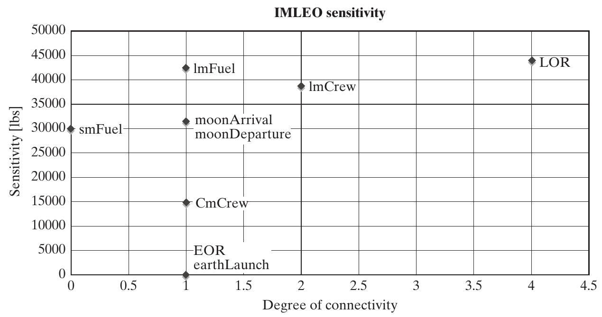{height=410px fig-align="center" fig-alt="Apollo decisions plotted by logical connectivity and sensitivity of IMLEO in pounds."}

::: {.side-caption}
Each point is a decision. Horizontal axis: connectivity. Vertical axis: IMLEO sensitivity in pounds. Source: Crawley, Cameron & Selva (2016), Fig. 15.14, p. 367.
:::

::: {.notes}
- Explicitly contrast with earlier plots: the points are now decisions, not complete architectures. A separate view is needed for each metric.
- LOR is highly connected and strongly affects mass; LM crew is also connected and sensitive. SM fuel has zero logical degree but appreciable mass sensitivity.
- The source's numerical sensitivity convention cannot be fully resolved from the equation/prose discrepancy. Use its qualitative ordering and stated units; do not claim the newly worked normalized examples reproduce these plotted values.
- Ask students which decisions deserve early attention and which could be studied more independently.

**Discussion:** Why plot sensitivity against connectivity?

**Suggested answer:** It separates decisions with large performance consequences from decisions requiring extensive coordination. Together the axes help prioritize evidence gathering and organize trade studies.

**Source:** Crawley, Cameron & Selva (2016), Fig. 15.14, p. 367.
:::


## Four quadrants for organizing decisions {.smaller}

| | Weakly connected | Strongly connected |
|---|---|---|
| **High metric sensitivity** | **II:** analyze relatively independently; high priority | **I:** address first; shapes many later options |
| **Low metric sensitivity** | **IV:** parallel or later work | **III:** resolve after sensitive choices, with coordination |

“High” and “low” are contextual judgments, not universal thresholds.

::: {.notes}
- This is the content of Figure 15.15 in an editable table. Make the x-axis connectivity and y-axis sensitivity clear before discussing priorities.
- Quadrant I combines impact on metrics with impact on other decisions, so early resolution helps stabilize the remaining design space.
- Quadrant II decisions still matter greatly; weaker coupling makes independent analysis more practical. Quadrant III often contains detailed implementation decisions whose consistency matters after key choices.
- Quadrant IV decisions may help meet lower-priority goals. Low sensitivity in one screening metric does not excuse ignoring an essential requirement on a different metric.
- Ask students to place SM fuel and LOR based on the preceding plot, without inventing a precise cutoff.

**Discussion:** Which quadrant generally deserves early coordinated attention?

**Suggested answer:** High sensitivity and high connectivity: choices there can change performance substantially and constrain many other decisions. The quadrant guides attention rather than imposing an inflexible schedule.

**Source:** Crawley, Cameron & Selva (2016), Fig. 15.15 and §15.6, pp. 366–367.
:::


## Coupling and sequencing principles {.smaller}

- Address decisions with **high sensitivity and high connectivity** early.
- Combine strongly coupled choices into a **joint trade study**.
- Run weakly coupled studies **in parallel** where practical.
- Coordinate shared assumptions and metric budgets across studies.

The aim is to reduce rework while preserving important interactions.

::: {.notes}
- This paraphrases Box 15.2 and the adjacent sequencing discussion. Hard constraints are especially strong couplings because a choice can remove alternatives elsewhere.
- The Wilson epigraph emphasizes synthesis and wise use of information; the technical point is to organize rather than merely collect decision data.
- “Make first” is guidance for prioritizing and stabilizing the architectural choices, not an instruction to make irreversible commitments before obtaining evidence.
- Parallel work avoids unnecessary waiting, but weak coupling is not zero coupling. Establish what information must be shared and when a changed result triggers a revisit.

**Discussion:** Why study tightly coupled decisions jointly?

**Suggested answer:** Selecting one while holding the others arbitrarily fixed can conceal a better combination. Weakly coupled groups can be explored in parallel while maintaining shared assumptions and interfaces.

**Source:** Crawley, Cameron & Selva (2016), Box 15.2 and §15.6, p. 368.
:::


## Apollo: organizing the trade studies {.smaller}

```{mermaid}
%%| fig-width: 10
%%| fig-height: 4
%%{init: {"themeVariables": {"fontSize": "23px"}}}%%
flowchart TB
 L[LOR] --> A[LM crew and fuel]
 L --> B["CM crew<br/>and SM fuel"]
 L --> C["Moon arrival<br/>and departure"]
 A --> D["EOR and<br/>Earth launch"]
 B --> D
 C --> D
```

Adapted from Fig. 15.16: coordinate the middle studies; preserve all maneuver constraints.

::: {.notes}
- The source puts LOR at the root, then three studies in parallel, then EOR. This adaptation includes earthLaunch explicitly so all nine decisions remain visible; the printed figure omits it.
- The middle studies are coordinated through mass and other model relationships. The arrows show proposed decision organization, not physical flows, chronology of flight, or an OPM process model.
- With LOR=yes, Chapter 14's constraints already force orbital lunar arrival and departure. The lunar study must respect inherited choices rather than reopen incompatible alternatives.
- The book relates late EOR resolution to launch-vehicle availability and its relatively weak connection to the other decisions. EOR and Earth launch still have their mutual constraint.
- The source sentence about parallel studies being coupled through IMLEO should not be read as independence. Parallel evaluation requires exchanging shared metric effects.

**Discussion:** How should Apollo trade-study boundaries be justified?

**Suggested answer:** Use the represented logical and metric couplings to identify decisions that need joint evaluation. Keep information exchange explicit across groups rather than assuming a matrix partition eliminates all dependence.

**Source:** Crawley, Cameron & Selva (2016), Fig. 15.16 and §15.6, pp. 368–369; adapted hierarchy.
:::


## Decision structure informs team structure {.smaller}

- Teams working on tightly coupled choices need frequent coordination.
- A joint trade study should include the people responsible for the interacting decisions.
- Weakly coupled work can proceed with fewer synchronization points.
- A provisional decision hierarchy is useful even before a complete numerical model exists.

::: {.notes}
- The chapter argues that the ordered decision set is itself a valuable mental model, not just a by-product of a simulation.
- Ask students to imagine separate sensor and computer teams independently minimizing their own mass. Who is checking path reliability and interface compatibility?
- Tightly coupled teams need communication and shared studies; that need not mean reorganizing everyone into one large team.
- A hierarchy assembled from expert knowledge should expose its uncertain links and be refined as evidence arrives.

**Discussion:** What information must flow between teams responsible for coupled decisions?

**Suggested answer:** Current alternatives, constraints, interface assumptions, and performance consequences. Team boundaries should support those exchanges and provide a way to resolve conflicting local choices.

**Source:** Crawley, Cameron & Selva (2016), §15.6, p. 369.
:::


## Refine the decision model as you learn {.smaller}

- Consider removing low-impact, weakly connected decisions from the exploratory model.
- Add detail or split a decision when a coarse choice drives the results.
- Simplify expensive metrics that do not distinguish architectures.
- Improve low-fidelity metrics that control the recommendation.

Check for missing stakeholder value before discarding a decision or metric.

::: {.notes}
- This is an iterative modeling process: representation affects connectivity and sensitivity, which then inform a revised representation.
- “Remove from the model” does not mean the real project no longer needs a decision. It may be handled later or in a different study.
- A metric that currently fails to distinguish candidates may encode a necessary constraint, or its implementation may be too crude. Inspect that before deleting it.
- Ask where the team should spend one additional week of analysis: a high-fidelity metric with no effect on the result, or an uncertain low-fidelity metric that reverses the winner.

**Discussion:** When should the decision model be revised?

**Suggested answer:** When new evidence reveals missing alternatives, irrelevant distinctions, hidden constraints, or incorrect couplings. Re-evaluate affected candidates so the old ranking is not carried into a changed problem unexamined.

**Source:** Crawley, Cameron & Selva (2016), §15.6, pp. 369–370.
:::


## Architectural competition and dominant designs {.smaller}

The chapter describes an industry pattern:

1. Competing architectures explore different ways to deliver value.
2. A dominant architecture can emerge.
3. Innovation concentrates on components and processes.
4. A new architecture can remove limits of the old one and disrupt that pattern.

Both established and unsettled architectures require systems thinking and judgment.

::: {.notes}
- The book names mobile phones, UAVs, and hybrid vehicles as examples of architectural competition. Treat these as historical examples, not a claim about the current market state of each industry.
- With a dominant architecture, component improvements must still work within the whole. Without one, architects face more ambiguity because there is no presumed arrangement.
- This is a strategy perspective, not a guarantee that every industry follows exactly the same sequence.
- Ask whether a technically superior component necessarily overturns an established architecture. Interfaces, complementary assets, goals, and constraints can prevent that outcome.

**Discussion:** Why can't a firm freely combine the best component from every competitor?

**Suggested answer:** Interfaces, complementary assets, manufacturing, and operating assumptions may be incompatible. Local component excellence does not ensure an integrated system that satisfies the same goals.

**Source:** Crawley, Cameron & Selva (2016), §15.6, p. 370.
:::


# 15.7 Synthesis and practice

::: {.notes}
Use the closing exercise to connect filtering, sensitivity, and decision organization. The purpose is a defensible explanation rather than a single unexplained winner. Source: §15.7, pp. 370–371.
:::


## An integrated tradespace-analysis workflow {.smaller}

1. Inspect goals, feasibility, metric directions, and model scope.
2. Find the Pareto and fuzzy frontiers.
3. Compare feature frequencies; investigate clusters and strata.
4. Test conclusions across scenarios.
5. Analyze decision connectivity and metric sensitivity.
6. Organize studies and refine the model before selecting.

::: {.notes}
- Ask students to provide one GNC or Apollo example for each step.
- A good result might be a small candidate set, a requirement for better evidence, or a sequence of coordinated studies rather than an immediate architecture selection.
- The chapter emphasizes that discovering the few decisions driving the space can be more valuable than identifying a nominally good point.
- Keep the workflow iterative: a sensitivity result can send the team back to assumptions, metric definitions, or architecture enumeration.

**Discussion:** What sequence turns a tradespace plot into a useful study?

**Suggested answer:** Screen feasibility, identify non-dominated candidates, examine features and clusters, test assumptions, and study high-impact decisions. Use the findings to refine the model and focus further evaluation.

**Source:** Crawley, Cameron & Selva (2016), §15.7, pp. 370–371.
:::


## Class discussion: choose the next study {.smaller}

Your team observes:

- Every nominal frontier design uses complete cross-strapping.
- Its connection-mass estimate is uncertain.
- A low-mass candidate depends on an immature sensor.
- Sensor type and topology interact strongly in reliability.

Propose a **sensitivity study**, a **robustness question**, and a **joint decision study**. Explain each choice.

::: {.notes}
- Allow three minutes in pairs. Suggested sensitivity study: vary connection mass across a justified range and track feature share, membership, and metric values.
- Suggested robustness question: if the immature sensor misses its target or schedule, does the architecture still meet requirements? Can it accept a substitute, and at what cost?
- Suggested joint study: evaluate sensor type and topology together, involving both teams, because their interaction drives reliability.
- Ask teams to express the functional consequence in OPM terms: Measuring supplies state information used by Computing; changing instruments or their connections affects whether the required processes can be supported.
- Reward explicit assumptions and criteria rather than “choose the lightest design.” This scenario is a classroom synthesis, not a new empirical GNC result.

**Discussion:** What next study is justified when an immature sensor drives the preferred design?

**Suggested answer:** Test whether plausible performance or schedule shortfalls change feasibility and whether a substitute can be accommodated. Trace the OPM consequence: Measuring must still provide the information needed by Computing.

**Source:** Crawley, Cameron & Selva (2016), §§15.3–15.6; classroom synthesis.
:::


## Exit ticket {.smaller}

1. Why does “on the Pareto front” not mean “best architecture”?
2. What is the difference between a cluster and a stratum?
3. Why does a high feature frequency on the front not prove robustness?
4. What does the normalized two-alternative sensitivity equal?
5. Which decisions should be studied jointly, and which can proceed in parallel?

::: {.notes}
- Expected answer 1: multiple objectives, omitted criteria, model uncertainty, and stakeholder preferences remain.
- Expected answer 2: a cluster is a concentration of outcomes; a stratum fixes one metric while another varies. Neither alone proves architectural similarity.
- Expected answer 3: it is conditional on one model and scenario; test it under plausible input changes and consider its prevalence in the full space.
- Expected answer 4: |ME| under the printed 1/|K|-normalized definition used here, not twice the main effect.
- Expected answer 5: tightly coupled choices belong in joint trade studies; weakly coupled studies can run in parallel with appropriate coordination. High-sensitivity, high-connectivity decisions deserve early attention.

**Source:** Crawley, Cameron & Selva (2016), §§15.2–15.7; classroom review.
:::


## Reference and next chapter {.smaller}

**Crawley, E., Cameron, B., & Selva, D. (2016).** *System Architecture: Strategy and Product Development for Complex Systems*. Pearson. **Chapter 15, pp. 345–372.**

The chapter's references connect these ideas to fuzzy Pareto frontiers, non-dominated sorting, experimental design, and architecture-decision analysis.

**Next:** Chapter 16 formalizes architecture optimization problems and methods for solving them.

::: {.notes}
- Further reading from the chapter includes Smaling and de Weck on fuzzy Pareto frontiers; Deb and colleagues on non-dominated sorting; Montgomery on experimental design; and Simmons and Battat and colleagues on organizing architectural decisions.
- Source figures are the published results; the small numerical exercises are explicitly labeled classroom data. The deck does not claim to reconstruct the 20,509-architecture simulation.
- Teaching notes explain source inconsistencies in the hybrid-car units, Table 15.2 prose, Figure 15.13 normalization, and sensitivity normalization. Use the stated conventions when discussing the exercises.
- Press S in Reveal.js for the presenter window. The next chapter develops the representing and simulating work alongside formal optimization and search.

**Source:** Crawley, Cameron & Selva (2016), Chapter 15, pp. 345–372; references [3]–[4], [11], [13]–[15].
:::
