# 16.1 Architecture as an optimization problem

::: {.notes}
Reconnect to Chapter 14’s architectural decisions and Chapter 15’s Pareto analysis. This chapter supplies a vocabulary for building the decision model and choosing a search strategy. Source: §16.1, pp. 373–374.
:::

## Learning objectives {.smaller}

- Formulate decisions, metrics, a value function, and constraints.
- Recognize six recurring **decision patterns**.
- Explain the tradeoffs behind common architectural styles.
- Estimate search-space size and choose an exploration method.
- Critique encodings, decomposition, and heuristic results.

::: {.notes}
- Ask: “Last chapter we read a tradespace. What must exist before we can generate those points?” A representation of candidates, a validity check, and an evaluation model.
- Distinguish the architect’s judgment from a programmed decision. A solver cannot supply missing stakeholder priorities or establish whether the chosen model is appropriate.
- This is a full chapter treatment. Suggested teaching breaks follow ASSIGNING, CONNECTING, and §16.5. The exercises can be used as pair discussions or homework.
- The learning goal is to formulate and audit a small problem, rather than implement an industrial optimization package.

**Source:** Crawley, Cameron & Selva (2016), §16.1, pp. 373–374.
:::

## Six recurring architecting tasks {.smaller}

| Task | Decision to make |
|---|---|
| Decompose form or function | Which elements belong together? |
| Map function to form | Which objects perform which processes? |
| Specialize | Which solution-specific concept? |
| Characterize | Which attribute values? |
| Connect | Which interfaces or operational relationships? |
| Select goals | Which candidate goals define the scope? |

::: {.notes}
- Connect to OPM: processes express function, objects express form, and their relations describe how the system works. Choosing the allocation is an architectural decision; entering the chosen allocation in an OPM model records the result.
- Decomposition connects to Chapters 3–8 and 13; mapping to Chapters 6–8 and 12; specialization and characterization to Chapters 4, 7, 13, and 14; connectivity to Chapters 4, 5, and 7; goal selection to Chapter 11.
- Ask for a campus robot example of each task. “Choose lithium-ion batteries” specializes form; “choose 500 Wh capacity” characterizes it.
- There are six tasks and six patterns, but their mapping is many-to-many.

**Discussion:** Give a campus-robot example of each recurring architecting task.

**Suggested answer:** Group components into modules; allocate Transporting to a vehicle; select a propulsion concept; set battery capacity; choose communication links; and select the delivery goals. These illustrate decomposition, mapping, specialization, characterization, connecting, and goal selection.

**Source:** Crawley, Cameron & Selva (2016), Table 16.1, p. 374.
:::

# 16.2 Formulating the model

::: {.notes}
We now make explicit what was implicit in the Apollo and GNC tradespaces. Ask students to identify the input, output, and assumptions of the evaluator. Source: §16.2, pp. 375–377.
:::

## Architectures as decision vectors {.smaller}

For decision $i$, choose one value from an allowed set $D_i$:

$$A=(x_1,\ldots,x_n),\qquad x_i\in D_i.$$

An Apollo-style encoding includes:

`[EOR, earthLaunch, LOR, moonArrival, moonDeparture, cmCrew, lmCrew, smFuel, lmFuel]`

The **dictionary and ordering** give the vector meaning.

::: {.notes}
- Read the vector as a compact architecture description, not a complete engineering specification. Units, option dictionaries, and dependencies belong in the model documentation.
- Reuse Chapter 14’s naming: earthLaunch has alternatives orbit/direct. An illustrative valid vector is [no, orbit, yes, orbit, orbit, 3, 2, storable, storable].
- The printed §16.2 Apollo vector starts with EOR=yes while calling itself the actual architecture. This conflicts with the LOR-only configuration used in our Chapter 14 discussion. Do not teach EOR=yes as the historical Apollo choice. The purpose here is the encoding.
- Ask whether swapping the two crew entries preserves meaning. It does not unless the dictionary also changes.

**Discussion:** Does swapping the CM-crew and LM-crew entries preserve a decision vector's meaning?

**Suggested answer:** Only if the dictionary and ordering are changed consistently. A vector is meaningful through its documented variable definitions; swapping values alone can describe a different or infeasible architecture.

**Source:** Crawley, Cameron & Selva (2016), §16.2, p. 375.
:::

## The value function {.smaller}

$$A\ \xrightarrow{\quad V\quad}\ M=(M_1,\ldots,M_p)$$

- **Input:** a candidate architecture.
- **Model:** physics, cost estimates, risk models, and documented judgments.
- **Output:** metrics that reflect stakeholder needs.

Apollo: **minimize launched mass** and **maximize mission success**.

::: {.notes}
- The value function is an evaluator that can return a vector. It need not be a single weighted utility score.
- Ask what lives inside Apollo’s V: the rocket equation, mass assumptions, and the operation-level risk table. Changing an assumption can move many points in the tradespace.
- Explain the compression twice: the architecture vector leaves out design detail, and the metric vector leaves out stakeholder detail. Each compression needs justification.
- The arrow is the input/output abstraction of Fig. 16.1, not an OPM procedural link. Keep mathematical evaluation distinct from the system’s physical function.

**Discussion:** What belongs inside Apollo's value function?

**Suggested answer:** The mass and propulsion calculations, operation-level success factors, and their assumptions. It returns evaluation metrics, potentially as a vector, rather than necessarily collapsing all stakeholder concerns into one utility score.

**Source:** Crawley, Cameron & Selva (2016), §16.2 and Fig. 16.1, pp. 375–376.
:::

## Multiple objectives and feasibility {.smaller}

Let $\mathcal F$ be the architectures that satisfy all hard constraints.

$$\mathcal A^*=\{A\in\mathcal F:\nexists B\in\mathcal F\text{ with }V(B)\succ V(A)\}$$

Here $\succ$ means **dominates** in the stated metric directions.

- State the preferred direction of every metric.
- Retain non-dominated tradeoffs.
- Use stakeholder preferences to choose among them.

::: {.notes}
- The compact Pareto expression identifies candidates through their metric values. Equal metric vectors can correspond to several distinct architectures, all of which may deserve further comparison.
- The book writes an argmax of a metric vector. Interpret this as multiobjective non-dominance, not as a request for one vector that independently maximizes every component. Mass is a minimization metric unless its sign is reversed.
- Ask students why “best mass and best reliability” might describe no single architecture.
- Dominance is conditional on this feasible set and these metrics. A non-dominated point is not a certificate of real-world desirability.

**Discussion:** Why might no candidate have both minimum mass and maximum reliability?

**Suggested answer:** Improving reliability can require extra resources that increase mass. The Pareto set retains feasible tradeoffs; stakeholder preferences are still needed to select among them.

**Source:** Crawley, Cameron & Selva (2016), §16.2, p. 375; Chapter 15 Pareto analysis.
:::

## Useful metrics and traceable judgments {.smaller}

- A metric should vary across the architectures under study.
- Prefer a small, interpretable set: the book suggests **2–5**, often **2–3**.
- Keep essential requirements even when they do not distinguish candidates.
- Record the rationale behind subjective scores.
- Examine sensitivity to aggregation and weights.

::: {.notes}
- If safety is identical for all modeled hybrid-car candidates, it does not help rank them. That does not authorize dropping safety requirements or verification.
- With many competing objectives, dominance becomes less selective. A unique best performer in one metric cannot be dominated, but tied maxima need closer inspection. The book’s statement about any maximum should be read with this qualification.
- Scientific value and community engagement can require judgment. Subjectivity is not automatically invalid; untraceable or inconsistent judgment is the problem.
- Appendix C discusses rule-based evaluation and explanations. Here students need to know why a score was assigned, not the implementation details of that appendix.

**Discussion:** What would make a judgment-based score auditable?

**Suggested answer:** State the criterion, evidence, assumptions, scale, and rule used to assign it. A reviewer should be able to explain a score change in terms of the underlying architecture or judgment.

**Source:** Crawley, Cameron & Selva (2016), §16.2, p. 376.
:::

## Hard and soft constraints {.smaller}

| Constraint | Treatment | Example |
|---|---|---|
| Hard | Reject the architecture | LOR requires lunar-orbit arrival |
| Soft | Retain it with a penalty | A desirable range target |

Illustrative penalty for shortfall below range $r_0$:

$$C_{\mathrm{effective}}=C+\lambda\max(0,r_0-r),\qquad\lambda\geq0.$$

::: {.notes}
- Ask students to identify the units of lambda. If C is dollars and range is kilometres, lambda is dollars per kilometre of shortfall.
- This linear penalty is a classroom formulation, not a formula supplied by the chapter. Other penalty shapes are possible.
- A hard constraint can express physical consistency, an inviolable requirement, or an analyst’s screening rule. The last use deserves scrutiny because it may remove useful architectures before comparison.
- The book’s 5 km car-range threshold illustrates screening and soft penalties, not a universal market requirement. A soft penalty cannot make a physically meaningless simulation meaningful.
- Optimization transformations such as Lagrange multipliers do not change what stakeholders actually require.

**Discussion:** What units must a range-shortfall penalty coefficient have?

**Suggested answer:** If the objective is dollars and shortfall is kilometres, the coefficient is dollars per kilometre. A finite penalty permits a tradeoff; it does not automatically enforce a hard range requirement.

**Source:** Crawley, Cameron & Selva (2016), §16.2, p. 377.
:::

## Combinatorial growth and model scope {.smaller}

For independent decision domains:

$$N_{\mathrm{raw}}=\prod_{i=1}^{n}|D_i|.$$

- Categorical choices do not supply ordinary derivatives.
- More options improve coverage but increase computation.
- Constraints and duplicate encodings change the effective count.
- Difficulty depends on the evaluator and mathematical structure.

::: {.notes}
- “Independent domains” means each decision has a defined choice set, not that the decisions have independent effects on value.
- The text describes NP-hardness as exponential time and suggests a practical limit near 15–20 decisions. Treat those as cautions about scale, not formal theorems or universal limits. NP-hardness does not prove an exponential lower bound, and many structured discrete problems are tractable.
- Direct gradients are unavailable for unordered labels such as fuel types. Structured integer methods, relaxations, or mixed formulations may still help in suitable problems.
- Ask which matters more: 20 binary choices with microsecond evaluation, or eight choices with a day-long simulation? Compute a time budget before deciding.

**Discussion:** Why is the number of decision variables alone a poor measure of computational difficulty?

**Suggested answer:** Option counts, constraints, and evaluator cost matter. Twenty binary choices have about a million assignments, but cheap evaluations can be easier than a small space requiring days per simulation.

**Source:** Crawley, Cameron & Selva (2016), §16.2, p. 376; §16.6, pp. 408–410.
:::

# 16.3 The NEOSS example

::: {.notes}
NEOSS is the chapter’s NASA Earth Observing Satellite System architecture study. Treat it as the book’s modeling example, not a description of a current NASA program. Source: §16.3, pp. 377–379.
:::

## Earth-observation architectures {.smaller}

{height=460px fig-align="center" fig-alt="Envisat spacecraft above and the A-Train satellite formation below."}

::: {.side-caption}
Envisat and the A-Train illustrate different ways to organize Earth-observing instruments. Source: Crawley, Cameron & Selva (2016), Fig. 16.2, p. 378.
:::

::: {.notes}
- The upper image concentrates instruments on a spacecraft; the lower image shows several coordinated spacecraft. They motivate the packaging decision without establishing which is better.
- Scientists need usable data products about land, oceans, and atmosphere, rather than simply a larger satellite count.
- Ask: “What could be shared on one spacecraft? What could fail together?” Expected answers include power, communication, launch, schedule, and platform disturbances.
- Original image credits in the book: ESA/EPA/Corbis for Envisat and Ed Hanka/NASA for A-Train. Historical illustrations only.

**Discussion:** What can instruments share on one spacecraft, and what can fail together?

**Suggested answer:** They can share power, communications, launch, and support structure. They can also share platform failures, schedule delays, and disturbances, so resource savings must be weighed against coupled risks.

**Source:** Crawley, Cameron & Selva (2016), Fig. 16.2, p. 378.
:::

## NEOSS stakeholders and candidate instruments {.smaller}

**Scientists value** resolution, accuracy, coverage, and continuous records.

| Candidate instruments | Candidate instruments |
|---|---|
| Radar altimeter | GPS receiver |
| Conical microwave radiometer | Infrared spectrometer |
| Laser altimeter / lidar | Millimeter-wave sounder |
| Synthetic aperture radar | High-resolution optical imager |

Cost, schedule, and risk also enter the evaluation.

::: {.notes}
- In OPM language, Measuring creates measurement information about an environmental property, and Processing produces a data product. Instruments are objects that enable the relevant processes.
- A laser altimeter and a synthetic aperture radar are alternative forms for some topographic measurements, with different capabilities. Selecting both can add value or create redundant capabilities.
- Explain spatial resolution as distinguishable ground detail and temporal resolution as how frequently useful observations arrive. Data continuity asks whether records remain comparable and uninterrupted across missions.
- The chapter later uses six instruments and three orbit types to isolate the ASSIGNING pattern. Those are reduced examples, not a contradictory eight-instrument count.

**Discussion:** Why might stakeholders prefer different Earth-observation instruments?

**Suggested answer:** Their valued observations can differ in coverage, spatial detail, revisit time, and continuity. Instrument count alone does not measure how well the program meets those needs.

**Source:** Crawley, Cameron & Selva (2016), §16.3, pp. 377–379.
:::

## NEOSS decision groups {.smaller}

| Group | Choices |
|---|---|
| Instrument selection | Which of the eight instruments? |
| Instrument packaging | Which spacecraft, orbits, and constellations? |
| Mission scheduling | Which launch order and dates? |

Initial orbital options: **1–3 planes**, **1–4 satellites per plane**, true polar / sun-synchronous / tropical, **400 / 600 / 800 km**.

::: {.notes}
- Higher altitude generally trades coarser ground resolution for broader coverage for a given instrument geometry. This is a model relationship, not a claim that every instrument’s performance depends only on altitude.
- Power limits and electromagnetic interference couple the instrument and platform decisions.
- A replacement mission launched after an existing mission ends can create a data gap even if its instrument is excellent. Shared budgets also link launch dates.
- Ask which decision group influences scientific value. All of them do, which anticipates the decomposition discussion.
- Packaging includes the orbital design, not just fitting objects in a box.

**Discussion:** Which NEOSS decision group affects scientific value?

**Suggested answer:** All can: selection determines measurements, packaging affects interactions, orbit affects observation conditions, and deployment affects availability and continuity. Optimizing these groups separately can miss their combined effects.

**Source:** Crawley, Cameron & Selva (2016), §16.3, p. 379.
:::

# 16.4 Six patterns of architectural decisions

::: {.notes}
A pattern describes recurring decision structure. An architectural style describes a recognizable family of solutions within that structure. Source: §16.4, pp. 379–403.
:::

## Patterns and architectural styles {.smaller}

- **Pattern:** the structure of a recurring decision problem.
- **Style:** a characteristic way to organize the resulting architecture.

Examples:

- ASSIGNING admits channelized and fully cross-strapped styles.
- PARTITIONING admits monolithic and distributed styles.
- CONNECTING admits bus, star, ring, mesh, and tree styles.

::: {.notes}
- The chapter traces the idea to Christopher Alexander’s building patterns and the reusable software designs popularized by the Gang of Four.
- Alexander’s example of light from two sides of a room includes a recurring problem and ways to address it in differently sized buildings. The architectural decision patterns here chiefly organize the problem rather than prescribe one universal solution.
- Classical optimization problems, including knapsack and traveling salesman, provide related mathematical structures.
- Ask whether “choose a distributed architecture” specifies a decision pattern or a style. It is a style preference that still requires concrete grouping decisions.
- Patterns are useful mental models even when no optimization program is written.

**Discussion:** Is ‘choose a distributed architecture’ a pattern or a style?

**Suggested answer:** It expresses a style. A pattern such as partitioning organizes the decisions needed to define the actual groups; the style does not specify those memberships by itself.

**Source:** Crawley, Cameron & Selva (2016), §16.4, pp. 379–381.
:::

## The six patterns at a glance {.smaller}

| Pattern | Core question |
|---|---|
| DECISION-OPTION | Which one option for each decision? |
| DOWN-SELECTING | Which subset of candidates? |
| ASSIGNING | Which links between two sets? |
| PARTITIONING | Which non-overlapping groups? |
| PERMUTING | Which one-to-one placement or order? |
| CONNECTING | Which links within a fixed node set? |

::: {.notes}
- Use the vocabulary consistently throughout the lecture. The names identify mathematical structure, not six mutually exclusive kinds of real system.
- Ask students to classify packing instruments into unlabeled spacecraft versus allocating instrument copies to named orbits. Those are different questions despite both sounding like “assignment.”
- We will give each pattern a representation, a count before extra constraints, a case example, and the architectural tradeoffs it exposes.
- Keep the distinction between an encoding and a physical system visible: a binary 1 can mean selecting an instrument, installing a copy, or connecting a cable depending on the model.

**Discussion:** How does grouping instruments differ from assigning instrument copies to named orbits?

**Suggested answer:** Exhaustive, disjoint grouping into unlabeled spacecraft is partitioning. Links to named orbits are assigning, potentially allowing multiple copies or omissions unless constraints prohibit them.

**Source:** Crawley, Cameron & Selva (2016), Table 16.2, p. 381.
:::

## DECISION-OPTION: one choice per decision {.smaller}

$$A=(x_1,\ldots,x_n),\quad x_i\in O_i,\qquad N=\prod_i m_i.$$

| Decision | Option 1 | Option 2 | Option 3 | Option 4 |
|---|---|---|---|---|
| 1 | 1.1 | 1.2 | 1.3 | |
| 2 | 2.1 | 2.2 | | |
| 3 | 3.1 | 3.2 | 3.3 | 3.4 |

Three decisions give $3\times2\times4=24$ raw architectures.

::: {.notes}
- This editable morphological matrix reproduces the structure of Table 16.3. An architecture selects one entry in each row.
- Ask students to decode [2,1,3]. It chooses options 1.2, 2.1, and 3.3.
- Each decision has its own domain. A memory capacity is not automatically an option for processor type.
- Continuous attributes require a finite set or a stated discretization if this pattern is used literally. The book’s spring rates of 400, 500, and 600 lb/in illustrate such a choice.
- Sequence and compatibility are not implicit. Add constraints when needed.

**Discussion:** Decode the vector [2,1,3].

**Suggested answer:** Choose option 2 for decision 1, option 1 for decision 2, and option 3 for decision 3. The option dictionaries determine the physical meaning of those selections.

**Source:** Crawley, Cameron & Selva (2016), §16.4, pp. 381–384; Table 16.3.
:::

## Two DECISION-OPTION architectures {.smaller}

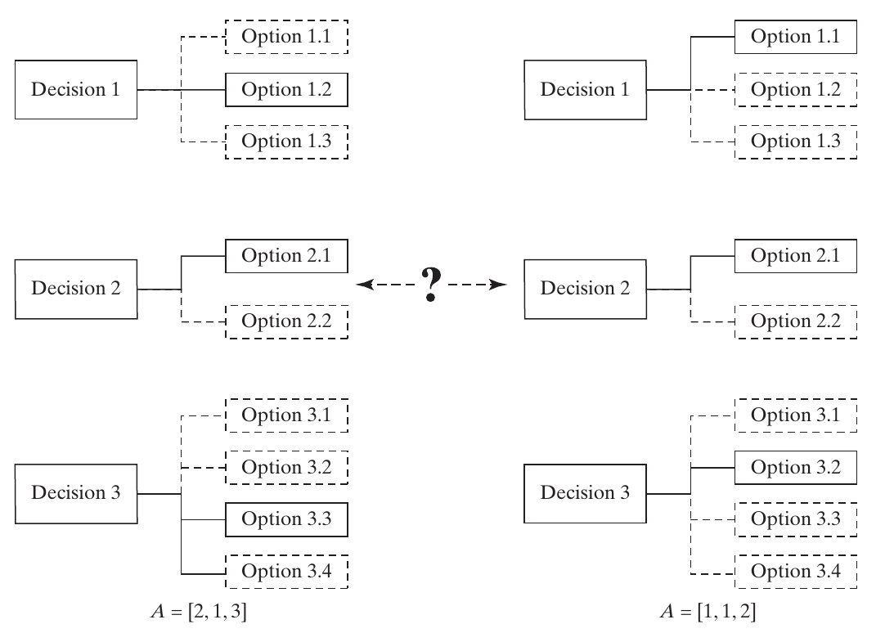{height=440px fig-align="center" fig-alt="Two selections among three decisions with respectively three, two, and four options."}

::: {.side-caption}
The same choice sets support different architecture vectors. Source: Crawley, Cameron & Selva (2016), Fig. 16.3, p. 382.
:::

::: {.notes}
- Trace one selected option for each decision in each half of the diagram. These are generic decision graphs, not a system-behavior notation.
- Invite a student to move from [2,1,3] to [1,1,2]. Two entries change; the second decision remains fixed.
- Discuss why “independent options” does not imply that their performance contributions can be added independently. The evaluator may have strong interactions.
- A decision tree can express the same choices, but it can quickly become too large to inspect.

**Discussion:** Do independently selectable options have independent performance contributions?

**Suggested answer:** No. The evaluator may contain strong interactions even when every option combination is allowed. Feasibility independence does not imply an additive value function.

**Source:** Crawley, Cameron & Selva (2016), Fig. 16.3, p. 382.
:::

## Autonomous underwater vehicle choices {.smaller}

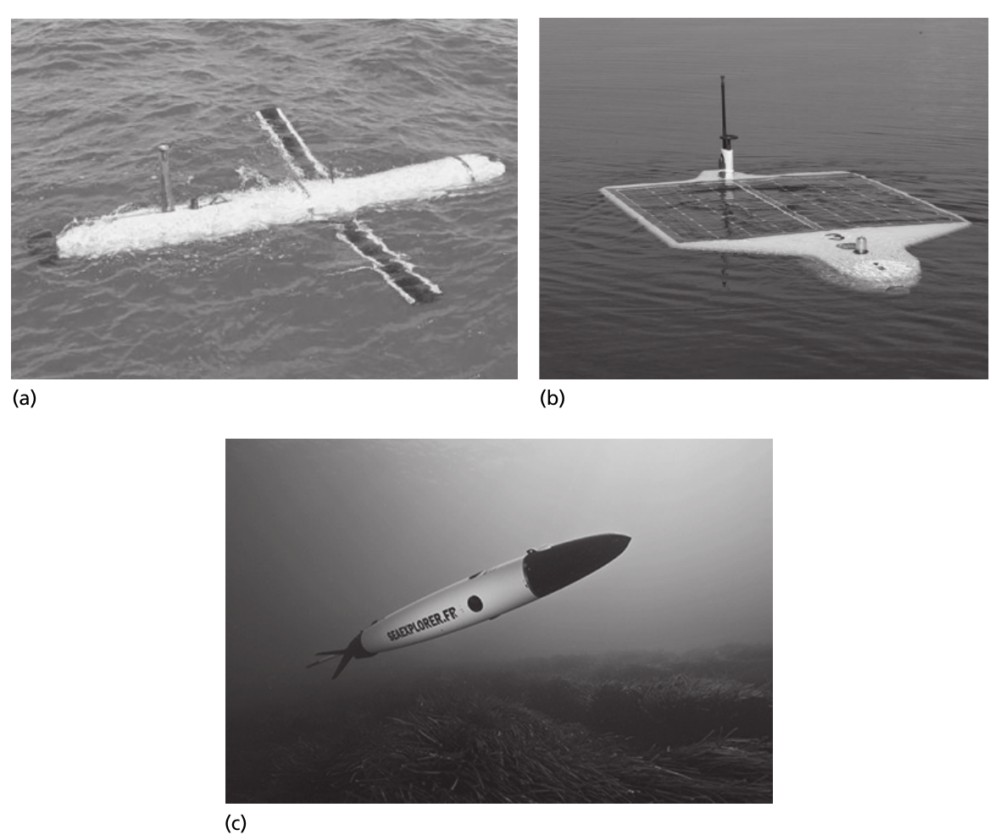{height=460px fig-align="center" fig-alt="Three autonomous underwater vehicle designs with different forms."}

::: {.side-caption}
Bluefin 12 BOSS, Nereus, and SeaExplorer illustrate alternative AUV forms. Source: Crawley, Cameron & Selva (2016), Fig. 16.4, p. 383.
:::

::: {.notes}
- Use the images to motivate specialization before presenting the count. Shape, propulsion, power, and sensing interact with the operational concept.
- Ask whether hovering and efficient long-distance transit necessarily favor the same configuration.
- These are examples in the book, not a specification comparison of current products. Original credits: NOAA; AUVfest 2008/Navy/NOAA; Alseamar.
- The next table lists the chapter’s abstract options. Do not infer that each pictured vehicle has every listed alternative.

**Discussion:** Must hovering and efficient long-distance transit favor the same AUV configuration?

**Suggested answer:** No. Their propulsion, control, and energy demands can differ. State the mission profile and compare the complete concepts rather than optimizing one operating mode in isolation.

**Source:** Crawley, Cameron & Selva (2016), Fig. 16.4, p. 383.
:::

## AUV: ten decisions, 4,608 combinations {.smaller}

| Decision | Alternatives |
|---|---|
| Configuration | Torpedo, blended wing, hybrid, rectangular |
| Swim / hover | Yes or no for each |
| Navigation | Dead reckoning, acoustic positioning |
| Propulsion | Propeller, Kort nozzle, passive gliding |
| Motor | Brushed, brushless |
| Power | Rechargeable batteries, fuel cells, solar |
| Sonar / magnetometer / thermistor | Yes or no for each |

$4(2)(2)(2)(3)(2)(3)(2)(2)(2)=4{,}608$ **before constraints**.

::: {.notes}
- There are ten decisions, despite seven displayed rows: swim and hover are separate, as are the three sensor decisions.
- Ask for invalid or operationally implausible combinations. Passive gliding with a motor choice may introduce irrelevant values; solar power depends on an appropriate operating concept.
- A raw Cartesian product is a starting point. It is not a count of 4,608 feasible, distinct, useful vehicles.
- This pattern commonly supports specialization and characterization of form and function.

**Discussion:** Do 4,608 nominal combinations mean 4,608 useful AUV architectures?

**Suggested answer:** No. Some assignments may be invalid, operationally unsuitable, irrelevant, or duplicate under the chosen concept. Apply constraints and examine encoding meaning before treating the product count as the useful space.

**Source:** Crawley, Cameron & Selva (2016), §16.4, pp. 383–384.
:::

## Aerial network: duplicate encodings {.smaller}

Ten candidate balloon sites. Per site:

- Radio: type A, type B, or **no balloon**.
- Altitude: low or high.

Raw encoding: $6^{10}=60{,}466{,}176$ vectors.

With one canonical no-balloon state:

$$5^{10}=9{,}765{,}625\ \text{distinct site-choice combinations}.$$

::: {.notes}
- This derived count assumes at most one balloon per site and that all four radio-altitude combinations are allowed for an occupied site.
- The book deliberately exposes the duplication: an empty site has no physical altitude. Two encoded states therefore represent one architecture choice.
- Ask students whether eliminating duplicate encodings is the same as eliminating a bad architecture. It is not; it avoids counting the same alternative repeatedly.
- If radio types can mix across sites, the model must address interoperability. If several balloon types can occupy a site, the ASSIGNING formulation later allows a different design space.
- The chapter’s approximate 60 million count describes raw vectors.

**Discussion:** Is removing a duplicate encoding the same as rejecting an inferior architecture?

**Suggested answer:** No. It removes a repeated representation of the same physical alternative. Canonicalization improves counting and search efficiency without eliminating a distinct design choice.

**Source:** Crawley, Cameron & Selva (2016), §16.4, p. 384; canonical count derived for class.
:::

## DOWN-SELECTING: a subset of candidates {.smaller}

$$S\subseteq U,\qquad A=(x_1,\ldots,x_m),\ x_i\in\{0,1\}.$$

$$N=2^m\quad\text{including the empty and full subsets}.$$

Instrument order:

`[radiometer, altimeter, imager, sounder, lidar, GPS, SAR, spectrometer]`

`[1,1,0,0,0,1,0,0]` selects radiometer, altimeter, and GPS.

::: {.notes}
- Ask what flipping a bit does physically: it adds or removes one candidate instrument. In ordinary DECISION-OPTION, a change may instead replace one incompatible option with another.
- For eight instruments, there are 256 subsets before budget and other constraints.
- The subset structure gives search algorithms useful information. Adding an item changes its cost and benefit and may change interactions with items already present.
- The chapter’s second printed example has a vector with an extra entry relative to the eight-item set. Its intended imager/sounder/SAR/spectrometer subset is [0,0,1,1,0,0,1,1]. Keep the dictionary explicit.
- Selecting goals and choosing among several allowable solution forms are common applications.

**Discussion:** What does flipping a down-selection bit mean physically?

**Suggested answer:** It adds or removes one candidate from the selected set. The evaluator must account for the resulting changes in benefit, cost, feasibility, and interactions with the remaining elements.

**Source:** Crawley, Cameron & Selva (2016), §16.4, pp. 384–386.
:::

## Two selected subsets {.smaller}

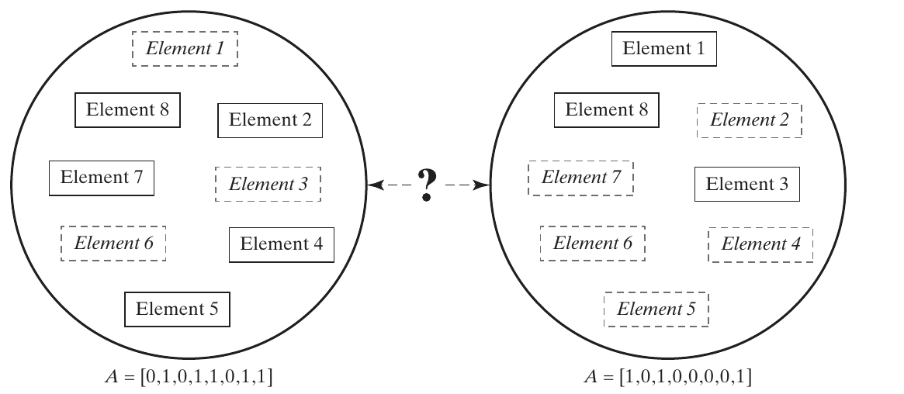{height=390px fig-align="center" fig-alt="Two subsets of eight candidate elements shown with selected and omitted elements."}

::: {.side-caption}
Both architectures use the same candidate set; the selected members differ. Source: Crawley, Cameron & Selva (2016), Fig. 16.5 and §16.4, pp. 385–386.
:::

::: {.notes}
- Solid rectangles show selected elements and dashed rectangles show omitted ones. Ask students to read the corresponding binary strings.
- A point with fewer elements can outperform a larger subset if the latter wastes resources or introduces interference.
- In the NEOSS case, selecting radar altimetry without the complementary radiometer can reduce achievable measurement accuracy because an atmospheric correction is missing.
- Ask what model output would reveal that loss. A count of instruments alone would not.

**Discussion:** Why can't instrument count alone measure the loss from removing one selected instrument?

**Suggested answer:** Different instruments supply different observations and may enable joint benefits. Evaluate the affected scientific functions and interactions, not just the number of selected boxes.

**Source:** Crawley, Cameron & Selva (2016), Fig. 16.5 and §16.4, pp. 385–386.
:::

## Interactions change subset value {.smaller}

| Interaction | Everyday example | NEOSS example |
|---|---|---|
| Synergy | Toothbrush with toothpaste | Altimeter with radiometer |
| Redundancy | Several similar toothpastes | Overlapping topographic measurements |
| Interference | Hot food beside a cold drink | Power or orbit conflicts |

A useful subset combines **high synergy**, **low interference**, and **limited redundancy**.

::: {.notes}
- A classical 0/1 knapsack adds fixed item values subject to a resource bound. This chapter’s subsets can have context-dependent values, so simply sorting items by benefit/cost can fail.
- Radar altimetry and microwave radiometry can work together through humidity correction. SAR and lidar can compete for resources or preferred orbital conditions. These interactions require the evaluator to know more than instrument names.
- The book calls favorable recurring combinations schemata. We will return to the precise binary-string meaning in genetic algorithms.
- Ask whether redundancy is always wasteful. It may instead be valuable when the metric includes fault tolerance; interpretation depends on the function and failure model.

**Discussion:** Is redundancy necessarily wasted value in subset selection?

**Suggested answer:** No. It can support fault tolerance or coverage if those benefits are represented. Apparent duplication must be interpreted against the required function and failure model.

**Source:** Crawley, Cameron & Selva (2016), §16.4 and Box 16.1, pp. 386–387.
:::

## A worked subset-selection problem {.smaller}

**Classroom data:** budget $=6$ cost units.

| Item | Cost | Standalone benefit |
|---|---:|---:|
| A | 3 | 4 |
| B | 3 | 3 |
| C | 4 | 8 |

Selecting **A and B together** adds a synergy bonus of 4.

Which feasible subset has the highest benefit?

::: {.notes}
- Give students a minute before revealing the answer. Feasible subsets are empty, A, B, C, and AB. AC, BC, and ABC exceed the budget.
- Benefits are 0, 4, 3, 8, and 4+3+4=11 respectively. AB wins even though C has the highest standalone benefit/cost ratio.
- Without the synergy term, C would beat AB’s benefit of 7. Thus the interaction changes the architecture recommendation.
- Ask how to encode the evaluator: B(x)=4x_A+3x_B+8x_C+4x_Ax_B, with 3x_A+3x_B+4x_C≤6.
- These numbers are illustrative and do not quantify actual instruments.

**Discussion:** Which subset wins the classroom problem with budget 6?

**Suggested answer:** AB costs 6 and scores 4+3+4=11, exceeding C's score of 8 at cost 4. Empty, A, B, C, and AB are feasible; AC, BC, and ABC exceed the budget.

**Source:** Crawley, Cameron & Selva (2016), §16.4 and Box 16.1, pp. 386–387; classroom example.
:::

## Subset selection beyond instruments {.smaller}

- **NLP strategies:** complementary methods can improve coverage while consuming development and computation resources.
- **Spectral bands:** additional bands can add information, duplicate a capability, or enable corrections.
- **Projects and goals:** a limited budget forces scope choices.

The benefit of an addition depends on what is already selected.

::: {.notes}
- The chapter uses IBM Watson’s combination of language-processing strategies and a hypothetical next-generation RapidEye band-selection problem. Present these as historical teaching cases, not current product specifications.
- Deep and shallow language-processing approaches motivate complementary capabilities. For spectral bands, measurements of the same constituent motivate redundancy, while cloud or atmospheric information can enable corrections.
- The text mentions 2.2 and 4.7 micrometre bands and a 1.6 micrometre correction example. The lesson is conditional value; detailed spectral retrieval physics would require a separate instrument model.
- Ask students to name two course projects that share equipment. Their combined cost need not equal their separate costs.

**Discussion:** How can two course projects cost less together than separately?

**Suggested answer:** They may share equipment or facilities. Include the shared resource once where appropriate and check capacity and scheduling; simple addition of standalone costs can overestimate the joint program.

**Source:** Crawley, Cameron & Selva (2016), §16.4, p. 386.
:::

## ASSIGNING: links between two sets {.smaller}

For $m$ left elements and $n$ right elements:

$$a_{ij}=\begin{cases}1&\text{left }i\text{ is assigned to right }j\\0&\text{otherwise.}\end{cases}$$

$$A\in\{0,1\}^{m\times n},\qquad N=2^{mn}.$$

Each left element may link to **none, one, or several** right elements.

::: {.notes}
- This is a many-to-many relation in the general pattern. Exactly-one assignment is an additional constraint, not the default.
- Examples include workers to tasks, processes to objects, instruments to orbits, or sensors to computers. In OPM, a process-object allocation still needs a precise procedural role; a generic binary matrix does not specify whether an object enables, is consumed by, or is affected by a process.
- The matrix has mn independent binary positions before added constraints. Six instruments and three orbits give 2^18=262,144 architectures.
- Ask whether assigning one instrument type to two orbits means teleporting one physical unit. It generally means deploying two copies.

**Discussion:** Does assigning one instrument type to two orbits move one physical unit between them?

**Suggested answer:** Usually it represents two copies. The model must state whether rows identify types or individual units and apply constraints consistent with that meaning.

**Source:** Crawley, Cameron & Selva (2016), §16.4, pp. 388–390.
:::

## NEOSS instrument-to-orbit assignment {.smaller}

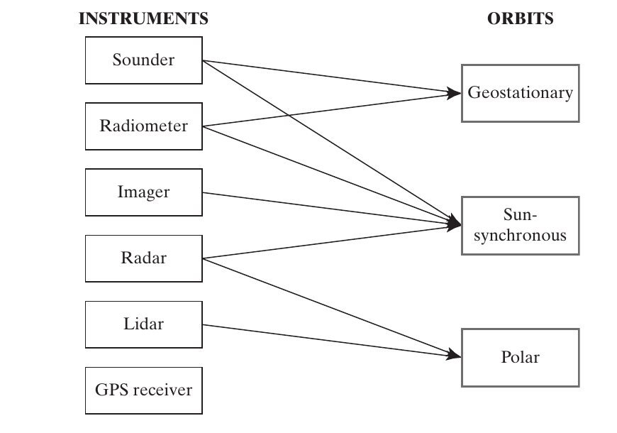{height=460px fig-align="center" fig-alt="Six instrument types with links to geostationary, sun-synchronous, and polar orbits."}

::: {.side-caption}
Instrument types can appear in more than one orbit, or in none. Source: Crawley, Cameron & Selva (2016), Fig. 16.6, p. 388.
:::

::: {.notes}
- Trace the sounder and radiometer to geostationary and sun-synchronous orbits, radar to sun-synchronous and polar orbits, imager to sun-synchronous orbit, and lidar to polar orbit. GPS is unused.
- Count eight assignments in this illustration. A type appearing twice represents multiple deployed instances in this simplified model.
- This reduced example introduces geostationary orbit and six instrument types to illustrate a pattern. It is not the same domain as the earlier eight-instrument NEOSS setup.
- Ask which constraints would limit available power or prohibit an instrument-orbit pairing.

**Discussion:** What constraints could rule out an instrument-to-orbit assignment?

**Suggested answer:** Incompatible observation conditions or insufficient power and other resources are examples. Specify the relevant quantities and limits rather than treating every binary link as physically feasible.

**Source:** Crawley, Cameron & Selva (2016), Fig. 16.6, p. 388.
:::

## Assignment constraints change the count {.smaller}

For $m$ left elements and $n$ right elements:

| Rule for each left element | Raw count |
|---|---:|
| Any subset | $2^{mn}$ |
| At least one right element | $(2^n-1)^m$ |
| Exactly one right element | $n^m$ |

For 3 sensors and 2 computers: **64**, **27**, or **8**.

::: {.notes}
- Derive one row at a time. Two computers have four subsets: empty, first, second, both. Removing empty leaves three; requiring exactly one leaves two.
- Raise each per-sensor count to three because the constraints in this classroom example are local to each sensor. Shared capacity limits would couple the rows and invalidate that simple product.
- The book’s second generic example uses 3 by 5 elements, giving 2^15=32,768.
- Ask students to explain why “exactly one computer per sensor” does not require each computer to have exactly one sensor. Many-to-one mappings remain possible.

**Discussion:** Does exactly one computer per sensor imply exactly one sensor per computer?

**Suggested answer:** No. That condition constrains each sensor's outgoing assignment but can allow many sensors to share a computer. Add separate capacity or one-to-one constraints if needed.

**Source:** Crawley, Cameron & Selva (2016), §16.4, pp. 388–392; constrained counts derived for class.
:::

## Channelized and cross-strapped styles {.smaller}

::: {.columns}
::: {.column width="48%"}
**Channelized**

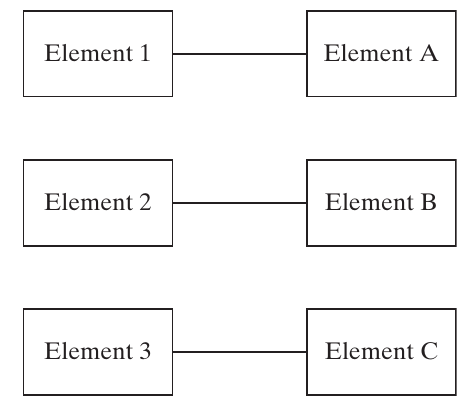{height=340px fig-alt="Three independent one-to-one channels."}
:::
::: {.column width="48%"}
**Fully cross-strapped**

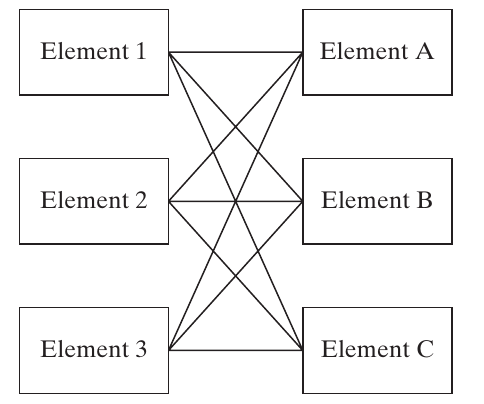{height=340px fig-alt="All three left elements connected to all three right elements."}
:::
:::

::: {.side-caption}
Source: Figs. 16.8–16.9, p. 391. Partial connections give intermediate architectures.
:::

::: {.notes}
- The figures show three isolated channels versus nine cross-connections. The ideal isolated-chain illustration is stronger than merely saying each left node has one right node: sharing a right node could still couple the chains.
- Reconnect to Chapter 15’s GNC architecture study. Sensor-to-computer and computer-to-actuator links are separate assignment layers.
- The book uses Saturn V’s functional decomposition and X-38’s independent buses as channelized examples, and Total Football and Space Shuttle avionics as examples of more coupled mappings or connectivity.
- Suh’s functional-independence principle motivates decoupling. Shared form can nevertheless reduce parts, mass, volume, and cost.

**Discussion:** What distinguishes channelized and fully cross-strapped assignments?

**Suggested answer:** Channelized arrangements preserve selected sensor–computer channels; full cross-strapping links every sensor to every computer. The resulting alternatives differ in path redundancy, connection costs, and fault interactions.

**Source:** Crawley, Cameron & Selva (2016), §16.4, pp. 390–392; Figs. 16.8–16.9.
:::

## Connectivity, cost, and failures {.smaller}

| Channelized tendencies | Cross-strapped tendencies |
|---|---|
| Fewer interfaces and lower connection cost | More interfaces and greater complexity |
| Fewer alternative paths | More potential redundancy and throughput |
| Greater isolation between chains | More opportunities for failure propagation |

The choice depends on **connection cost**, **value of reliability**, and the **failure model**.

::: {.notes}
- Avoid turning these tendencies into guarantees. A fully cross-strapped system is more reliable only under an appropriate model of component, interface, and dependent failures.
- The book’s common-cause discussion includes one failed sensor damaging connected computers. Distinguish this propagated failure from a shared external cause such as loss of common power; both undermine an independent-failure calculation.
- Ask which style would be attractive if cables are nearly massless but can transmit damaging faults. The answer may differ from the independent-failure result.
- An extra nine of reliability costs something. The stakeholder’s cost-reliability preferences and credible failure dependencies help determine whether that cost is worthwhile.

**Discussion:** Are massless connections automatically desirable if they can propagate damaging faults?

**Suggested answer:** No. Additional links can spread failures even without a mass penalty. Compare isolation and alternate-path benefits under the stated fault model before preferring maximum connectivity.

**Source:** Crawley, Cameron & Selva (2016), Box 16.2, p. 392.
:::

## PARTITIONING: exhaustive, disjoint groups {.smaller}

Partition $U$ into nonempty groups $S_1,\ldots,S_k$:

$$\bigcup_{i=1}^{k}S_i=U,\qquad S_i\cap S_j=\varnothing\quad(i\ne j).$$

- Every element belongs to **exactly one** group.
- The number of groups can vary from 1 to $|U|$.
- Group labels do not define different architectures.

Example: `{{radar, radiometer}, {imager, sounder, GPS}, {lidar}}`.

::: {.notes}
- Pairwise disjointness is essential. The book prints an empty intersection over all groups, which is too weak: three groups can have no common element while still overlapping pairwise.
- Give the counterexample {a,b}, {b,c}, {a,c}. Their total intersection is empty, but each element appears twice. It is not a valid partition.
- Unlabeled bins distinguish a partition from assignment to named spacecraft or orbits. Relabeling satellite 1 as satellite 2 changes no grouping by itself.
- Partitioning does not decide precise facility positions or orbital parameters; those require further decisions.

**Discussion:** What two conditions define a partition of the selected elements?

**Suggested answer:** Every element belongs to a group, and no element belongs to more than one group. Groups are nonempty and unlabeled; changing arbitrary group names does not create a new partition.

**Source:** Crawley, Cameron & Selva (2016), §16.4, p. 393.
:::

## Two instrument-packaging architectures {.smaller}

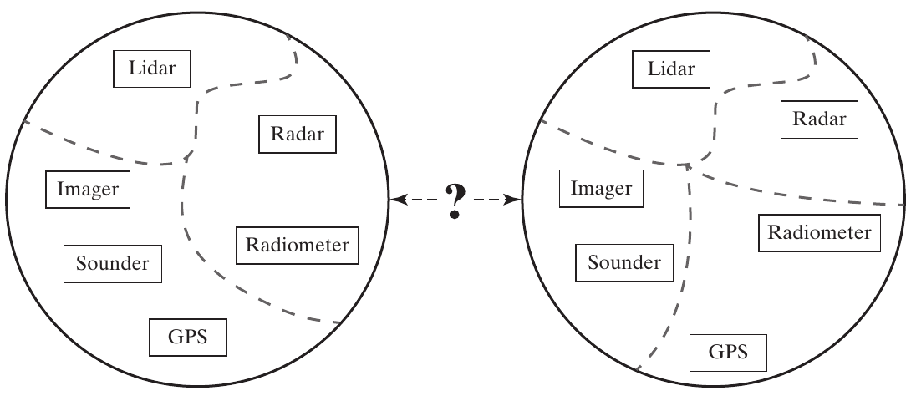{height=400px fig-align="center" fig-alt="Six instruments partitioned into three groups on the left and four on the right."}

::: {.side-caption}
Every instrument appears exactly once; the groups change. Source: Crawley, Cameron & Selva (2016), Fig. 16.10, p. 393.
:::

::: {.notes}
- Ask students to list the groups on each side. Left: lidar alone; radar with radiometer; imager with sounder and GPS. Right: lidar alone; radar alone; imager with sounder; radiometer with GPS.
- Count instruments rather than labels to verify completeness. Ask what decision would permit leaving one out: a separate DOWN-SELECTING decision.
- Explain that the partition determines what shares a platform. A platform design step must subsequently check mass, power, interfaces, and orbit compatibility.
- Grouping radar and radiometer can support measurement synergy, but only if their operating conditions actually permit coordinated observations.

**Discussion:** How can we verify the two packaging diagrams are partitions?

**Suggested answer:** Check that each of the six instruments appears exactly once. Left groups are lidar; radar–radiometer; imager–sounder–GPS. Right groups are lidar; radar; imager–sounder; radiometer–GPS. Omitting an instrument requires a separate selection decision.

**Source:** Crawley, Cameron & Selva (2016), Fig. 16.10, p. 393.
:::

## Encoding and counting partitions {.smaller}

For ordered elements $[a,b,c,d]$:

`[1,1,2,3]` represents `{{a,b},{c},{d}}`.

`[7,7,2,9]` represents the **same partition**.

| Elements $m$ | Partitions $B_m$ |
|---|---:|
| 3 | 5 |
| 5 | 52 |
| 8 | 4,140 |
| 10 | 115,975 |

::: {.notes}
- Canonical labels assigned in order of first appearance eliminate this representation redundancy. Starting from [7,7,2,9], rename the first encountered group 1, the next 2, and the next 3.
- Bell numbers count all partitions. Stirling numbers of the second kind S(m,k) count partitions into exactly k nonempty groups; B_m is their sum.
- Ask students to enumerate the five partitions of {a,b,c}: all together, all separate, and each of the three possible pairs plus a singleton.
- Fig. 16.11 illustrates two eight-element partitions. Its B_8 count is captured in this editable table.
- Do not use m^m as the number of distinct unlabeled partitions.

**Discussion:** List the five partitions of {a,b,c}.

**Suggested answer:** They are {abc}, {a|bc}, {b|ac}, {c|ab}, and {a|b|c}. The bars separate groups; rearranging group order or renaming groups does not create a new partition.

**Source:** Crawley, Cameron & Selva (2016), §16.4, pp. 394–395; reference [19], pp. 417–418.
:::

## Partitioning in other systems {.smaller}

- **Oil reservoirs:** group reservoirs served by a common facility.
- **Service engineers:** group engineers supported by a common supply manager.
- **Function decomposition:** group lower-level processes into larger functions.

The partition decides **which elements share a group**. Further models determine location, capacity, and feasibility.

::: {.notes}
- The book’s three-reservoir example has five partitions. Ask students whether grouping A and B locates their common facility on a map. It does not.
- The service network example has 3,000 engineers, each assigned to one manager. Capacity and geography can make many mathematical partitions impractical.
- Mapping function to form and decomposition are the most direct architecting tasks for this pattern.
- In OPM, a grouping choice can inform decomposition or the allocation of processes to objects. Preserve the distinction between a structural grouping and a claim about what each process actually does.

**Discussion:** Does grouping reservoirs A and B locate their shared facility?

**Suggested answer:** No. Group membership and facility location are separate decisions. A complete architecture may couple the partition with location, capacity, and network choices.

**Source:** Crawley, Cameron & Selva (2016), §16.4, pp. 394–395.
:::

## Monolithic and distributed architectures {.smaller}

| Monolithic | Fully distributed |
|---|---|
| One large group | One group per element |
| Shares common infrastructure | Replicates common infrastructure |
| Can capture close-coupled synergies | Can isolate interference and failures |
| Integration links development schedules | Smaller units can evolve separately |
| Shared resources may become bottlenecks | Coordination can add cost and complexity |

::: {.notes}
- These styles are the two ends of a partitioning tradespace. Intermediate groupings can preserve valuable synergies while separating incompatible elements.
- Cost depends on both replicated common functionality and the cost of interference. A shared solar array saves duplication but can create a power bottleneck and a common vulnerability.
- Distributed systems are not automatically redundant. If each unique instrument flies once, losing one still loses its measurement, even if the other instruments survive.
- Ask students whether faster replacement of a smaller satellite improves evolvability even when the initial hardware costs more.

**Discussion:** Can smaller replaceable satellites improve evolvability despite higher initial cost?

**Suggested answer:** Yes, if selective replacement or staged upgrades provide valuable flexibility. Compare that benefit with duplicated infrastructure, coordination, and lifecycle costs rather than equating distribution with automatic improvement.

**Source:** Crawley, Cameron & Selva (2016), Box 16.3, pp. 395–396.
:::

## What drives the grouping decision? {.smaller}

- Strength of synergies and interferences.
- Physical proximity needed for those interactions.
- Cost of replicated power, communication, structure, and support.
- Resource competition and failure concentration.
- Development time, expense profile, and opportunities to upgrade.

::: {.notes}
- DOWN-SELECTING asks whether both instruments are present. PARTITIONING asks whether their placement allows the interaction to occur.
- Radar-altimeter and radiometer measurements must be sufficiently coordinated and registered to realize their synergy. Merely flying somewhere in the same program is insufficient.
- In the book’s Envisat discussion, shared infrastructure and common observations come with power competition, launch risk, and dependence on the least ready instrument. Metop illustrates vibration interference from a scanning instrument to a sensitive sounder.
- The chapter reports Envisat at roughly eight tonnes, ten instruments, over two billion euros, and over ten years of development. Use these as historical case details, not current cost estimates. Its specific SAR duty-cycle claim should not be generalized to all radar modes.
- Ask which grouping remains attractive if the maturity of one instrument slips by three years.

**Discussion:** What grouping might help when one instrument is delayed by three years?

**Suggested answer:** Separating it may allow other instruments to deploy earlier. Check the loss of shared infrastructure or joint observations, extra costs, and continuity needs before adopting the separation.

**Source:** Crawley, Cameron & Selva (2016), §16.4 and Box 16.3, pp. 395–397.
:::

## PERMUTING: exclusive positions {.smaller}

Match $m$ elements to $m$ positions, one element per position.

$$N=m!$$

For the order **2, 4, 1, 3**:

| Representation | Vector |
|---|---|
| Element occupying each successive position | `[2,4,1,3]` |
| Position assigned to each successive element | `[3,1,4,2]` |

The two vectors are inverse descriptions of the same arrangement.

::: {.notes}
- Use explicit semantics instead of relying on potentially confusing labels such as “element-based.” In the second row, element 1 goes to position 3, element 2 to position 1, element 3 to position 4, and element 4 to position 2.
- Ask students to reconstruct the first vector from the second. This is a useful check against encoding mistakes.
- Positions can be launch slots, locations on a board, or other exclusive options. The pattern does not require a temporal interpretation.
- A permutation is a bijection: each element and each position appears exactly once.

**Discussion:** Why must the convention for a permutation vector be stated?

**Suggested answer:** A vector may list the element in each position or the position of each element. These are inverse descriptions; using one as the other can produce a different order.

**Source:** Crawley, Cameron & Selva (2016), §16.4, pp. 397–398.
:::

## Two permutations of five elements {.smaller}

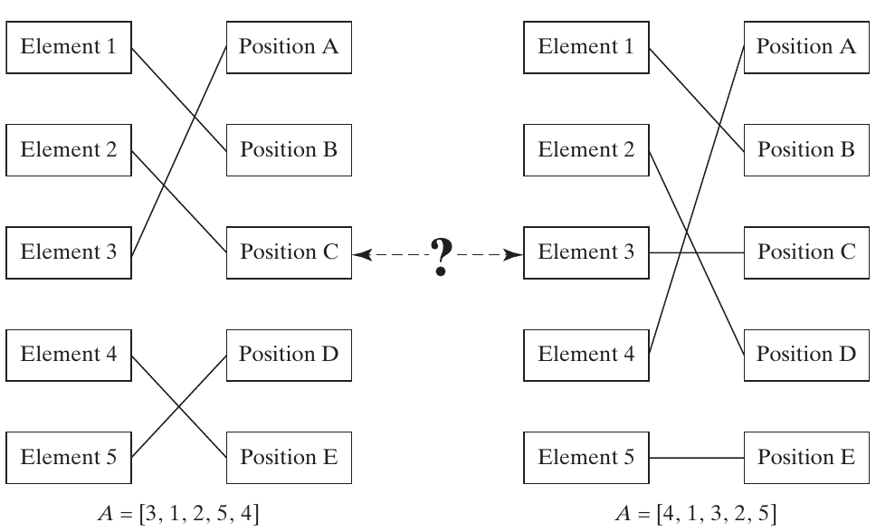{height=440px fig-align="center" fig-alt="Two one-to-one mappings of five elements to five positions."}

::: {.side-caption}
Five elements have 5! = 120 possible arrangements. Source: Crawley, Cameron & Selva (2016), Fig. 16.12 and §16.4, pp. 397–398.
:::

::: {.notes}
- Trace all five links and verify that no position has two occupants. A generic binary matrix without row and column constraints would admit many invalid configurations.
- Ask why a vector with repeated entries, such as [1,1,3,4,5], cannot represent this permutation.
- The count for 15 elements is 15!=1,307,674,368,000, already over a trillion. This motivates selective search.
- Factorial growth eventually exceeds any fixed-base exponential c^m. The exact practical limit still depends on evaluation cost and exploitable structure.

**Discussion:** Why is [1,1,3,4,5] not a permutation of five distinct elements?

**Suggested answer:** Element 1 is repeated and element 2 is missing. A permutation uses every element exactly once, so its mutation and crossover operators must preserve that property or repair violations.

**Source:** Crawley, Cameron & Selva (2016), Fig. 16.12 and §16.4, pp. 397–398.
:::

## Order, layout, and operations {.smaller}

- **NEOSS:** launch order affects data continuity and budgets.
- **Circuit layout:** placement changes total interconnection length.
- **Vehicle operations:** task order changes travel and resource use.
- **Exploration portfolios:** destination sequence changes capability development.

An order alone may still need dates, durations, or geometry.

::: {.notes}
- The book connects circuit placement to the importance of total wire length and uses NASA’s historical Flexible Path discussion as a portfolio-sequencing example.
- Treat those as illustrations of decision structure, not claims about current chip specifications or current NASA plans.
- Ask whether “A then B” gives a launch date. It does not. Development durations, launch availability, annual budgets, and precedence constraints can still determine feasibility.
- Operations belong in architectural reasoning early because the concept of operations generates goals and metrics.
- Position exclusivity also supports layouts with no natural first-to-last ordering.

**Discussion:** Does ‘A then B’ specify a feasible launch schedule?

**Suggested answer:** No. It gives order, not dates. Durations, readiness, launch availability, budgets, and precedence constraints must still support that ordering.

**Source:** Crawley, Cameron & Selva (2016), §16.4, pp. 398–399.
:::

## Front-loaded and incremental deployment {.smaller}

| Front-loaded high-value deployment | Incremental deployment |
|---|---|
| Prioritizes the most valuable systems | Delivers some value sooner |
| May require a long wait for first value | Builds capability progressively |
| Can avoid duplicated interim capability | May incur interim or replacement costs |
| Greater exposure to program cancellation | More opportunities to learn and adapt |

::: {.notes}
- The book calls the first style “greedy deployment,” assuming high-value elements are costly and slow to develop. Distinguish this architectural style from a generic greedy optimization algorithm.
- Ask which strategy stakeholders can sustain through years of spending without operational benefit.
- Incremental delivery can reduce programmatic risk and improve flexibility, but it can also require redundant or temporary capability.
- The table gives tendencies under the chapter’s assumptions. If a high-value element is also quick and inexpensive, the apparent conflict may disappear.
- A useful evaluation considers value delivery over time, not only the final system’s performance.

**Discussion:** When might incremental deployment be preferable to front-loading?

**Suggested answer:** When early partial service, learning, or staged funding is valuable. Weigh these benefits against delayed full capability, repeated deployment costs, and coordination or continuity requirements.

**Source:** Crawley, Cameron & Selva (2016), Box 16.4, p. 399.
:::

## CONNECTING: a graph on a fixed node set {.smaller}

$$G=(U,E),\qquad a_{ij}=1\ \text{when edge }i\to j\text{ exists}.$$

- One set of nodes, with decisions about connections.
- The adjacency matrix is square.
- An undirected graph has $a_{ij}=a_{ji}$.
- Self-connections require an explicit modeling choice.

Nodes can represent systems, objects, processes, or facilities.

::: {.notes}
- The book’s formal paragraph uses “vertices” for connections. Use the standard distinction: vertices or nodes are elements, and edges are connections.
- Clarify whether an edge means a physical cable, a possible flow, or a logical dependency. Binary adjacency alone does not encode capacity, delay, or flow magnitude.
- Examples include a power grid and a water network with fixed production/treatment locations. Choosing those locations would add further architectural decisions.
- ASSIGNING has two distinct node sets and only links across the sets. CONNECTING starts with a single fixed set and permits whatever pairs the domain allows.

**Discussion:** What stays fixed in a connecting problem?

**Suggested answer:** The node set; the choice is which allowable edges exist. Selecting or adding nodes is a separate decision unless the formulation explicitly combines those patterns.

**Source:** Crawley, Cameron & Selva (2016), §16.4, pp. 399–401.
:::

## Connectivity and adjacency matrices {.smaller}

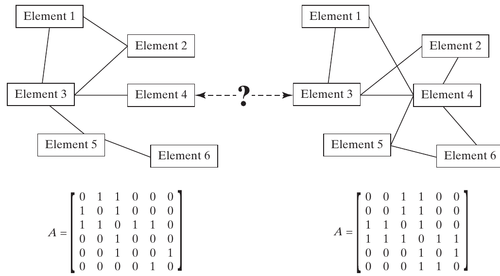{height=440px fig-align="center" fig-alt="Two undirected six-node networks with corresponding symmetric adjacency matrices."}

::: {.side-caption}
The matrices encode which pairs share a connection. Source: Crawley, Cameron & Selva (2016), Fig. 16.13, p. 400.
:::

::: {.notes}
- Ask students to find node 3’s neighbors in the left graph: nodes 1, 2, 4, and 5. The corresponding row has four ones.
- Check symmetry and the zero diagonal. Each undirected edge occupies two matrix entries but is only one binary decision.
- Both graphs have six fixed nodes; they differ in edges. These are general mathematical network representations, not system-behavior diagrams.
- The count 32,768 is 2^15 for six labeled nodes, no self-loops, and at most one edge per pair.

**Discussion:** Who are node 3's neighbors in the illustrated left graph?

**Suggested answer:** Nodes 1, 2, 4, and 5. Its adjacency row therefore has four ones; for the undirected graph the corresponding entries are symmetric.

**Source:** Crawley, Cameron & Selva (2016), Fig. 16.13, p. 400.
:::

## Four connectivity counts {.smaller}

For $m$ labeled nodes and binary connections:

| Self-connections | Directed | Undirected |
|---|---:|---:|
| Allowed | $2^{m^2}$ | $2^{m(m+1)/2}$ |
| Prohibited | $2^{m(m-1)}$ | $2^{m(m-1)/2}$ |

For 3 nodes without self-connections:

**64 directed graphs**, **8 undirected graphs**.

::: {.notes}
- Derive the exponents as the number of independent yes/no choices. Directed edges use ordered pairs; undirected edges use unordered pairs.
- For undirected graphs with loops, count m(m−1)/2 ordinary edges plus m loops, giving m(m+1)/2.
- These formulas allow the empty graph and disconnected graphs. A connected-network requirement reduces the count and needs another constraint.
- Parallel links, weighted edges, identical unlabeled nodes, and multiple edge types would need a different counting argument.
- Ask why squaring the node count is wrong for an undirected loop-free network.

**Discussion:** Why aren't there n² independent edges in an undirected loop-free graph?

**Suggested answer:** Each unordered pair counts once and self-links are excluded, giving n(n−1)/2 possible edges. Optional edge selection therefore gives 2 raised to that count, before additional constraints.

**Source:** Crawley, Cameron & Selva (2016), Table 16.4, p. 400.
:::

## Bus and star topologies {.smaller}

::: {.columns}
::: {.column width="48%"}
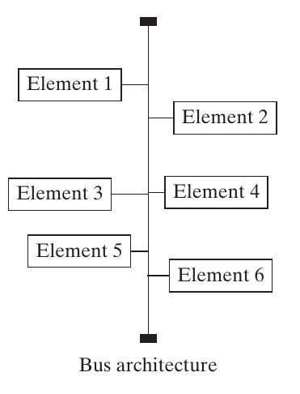{height=350px fig-alt="Six elements sharing a common bus interface."}
:::
::: {.column width="48%"}
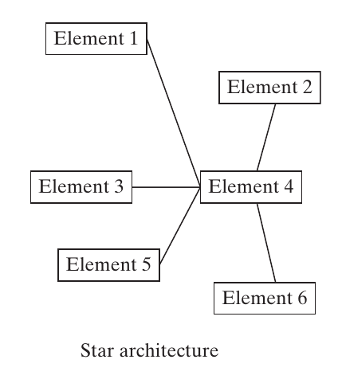{height=350px fig-alt="A star network with element 4 as its hub."}
:::
:::

A bus is a **shared interface**. A star has a **central node**.

::: {.side-caption}
Source: Crawley, Cameron & Selva (2016), Fig. 16.14 and Box 16.5, pp. 402–403.
:::

::: {.notes}
- Ask students to trace a message from element 1 to element 6. Which resource does every such transfer depend on?
- In the star, element 4 is a node that can perform processing or act as a source or sink. The bus is a shared interface rather than an additional node in this illustration.
- Ask how increasing traffic affects the shared resource. Both styles can encounter bottlenecks, but the flow-control mechanism matters.
- These generic graphs depict network topology, not procedural relationships in an OPM model. An architecture model should still state the kind of flow and the roles of its objects and processes.

**Discussion:** What shared resource does a transfer depend on in bus and star topologies?

**Suggested answer:** A bus uses the common communication medium; a star routes through its center. Traffic and failures affecting those resources can limit service, depending on the implementation and protocol.

**Source:** Crawley, Cameron & Selva (2016), Fig. 16.14 and Box 16.5, pp. 402–403.
:::

## Ring, mesh, and tree topologies {.smaller}

::: {.columns}
::: {.column width="32%"}
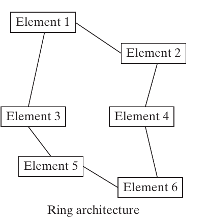{height=300px fig-alt="Six elements connected in a closed ring."}
:::
::: {.column width="32%"}
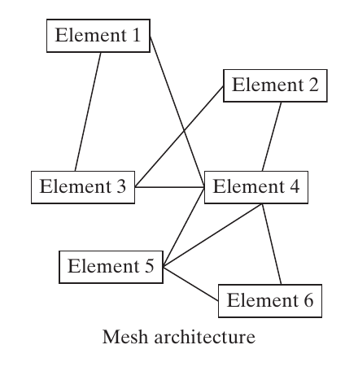{height=300px fig-alt="Six elements with multiple mesh connections."}
:::
::: {.column width="32%"}
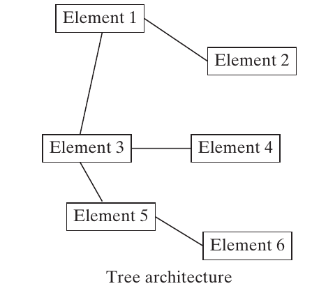{height=300px fig-alt="A tree with a branching hierarchy."}
:::
:::

Where are the **alternative routes**, **bottlenecks**, and **failure dependencies**?

::: {.side-caption}
Source: Crawley, Cameron & Selva (2016), Fig. 16.14 and Box 16.5, pp. 402–403.
:::

::: {.notes}
- Trace the closed circuit in the ring, alternative paths in the mesh, and branches in the tree. A mesh need not be a complete graph.
- Ask students to remove one edge mentally and assess which flows remain possible. Avoid equating graph connectivity with the behavior of a particular forwarding protocol.
- The commodity may be data, vehicles, power, water, gas, or food. Reliability, latency, throughput, and scalability depend on both topology and the flow and failure models.
- Hybrid architectures combine styles across regions or levels. The following tables summarize the tradeoffs rather than declaring a universal winner.

**Discussion:** What happens if one edge is removed from a ring, tree, or full mesh?

**Suggested answer:** An undirected simple ring remains connected as a path; a tree disconnects; a full mesh with at least three nodes remains connected. Actual communication also depends on forwarding and recovery behavior.

**Source:** Crawley, Cameron & Selva (2016), Fig. 16.14 and Box 16.5, pp. 401–403.
:::

## Bus, star, and ring tradeoffs {.smaller}

| Style | Potential advantage | Principal concern |
|---|---|---|
| Bus | Low interface cost, easy attachment | Shared bus failure or congestion |
| Star | Simple hub coordination | Hub bottleneck and failure |
| Ring | Predictable access in suitable protocols | Dependence on the intact forwarding path |

A **bus** is a shared interface. A **hub** is a node that can process or relay flow.

::: {.notes}
- The chapter cites launch-vehicle avionics for a bus, airline hub-and-spoke systems for a star, and token-ring networking for a ring. Present these as examples from the text rather than current universal practice.
- Qualify the book’s statement that every ring node is a single point of failure. That applies to an unprotected forwarding ring; bypass, dual rings, routing, and protection alter failure behavior. An undirected cycle with one removed node can remain connected as a path.
- Likewise, scalability is not unlimited when every flow shares one resource.
- Ask whether adding a faster hub changes topology. It changes capability and cost while preserving the star’s structure.

**Discussion:** Does installing a faster hub change a star's topology?

**Suggested answer:** No. It changes capability and possibly cost while preserving the connection structure. Distinguish node attributes from decisions about which nodes are linked.

**Source:** Crawley, Cameron & Selva (2016), Box 16.5, p. 403.
:::

## Mesh, tree, and hybrid tradeoffs {.smaller}

| Style | Potential advantage | Principal concern |
|---|---|---|
| Mesh | Alternative routes, distributed cooperation | More links and routing complexity |
| Tree | Clear hierarchy, maintainable expansion | Failure can disconnect descendants |
| Hybrid | Different structures for different needs | More interface and coordination choices |

Performance depends on **where flow originates**, **where it goes**, and **how much it carries**.

::: {.notes}
- The chapter uses rural communication networks and peer-to-peer systems for mesh structures, and apartment-building distribution networks for trees.
- A tree is connected and acyclic. Every edge is a bridge, so losing one can separate the graph; the system-level consequence depends on the traffic and available backup paths.
- A mesh can improve fault tolerance, but not every sparse mesh survives every failure. Make the protection target explicit.
- Ask students to propose a hybrid campus network and identify where resilience is most valuable. The point is to justify connections through stakeholder needs rather than select a fashionable topology.

**Discussion:** Propose a campus network combining different topologies.

**Suggested answer:** Use local stars for buildings and redundant links between important aggregation nodes. Justify extra resilience for critical services and check that a remaining shared resource does not become an unexamined bottleneck.

**Source:** Crawley, Cameron & Selva (2016), §16.4 and Box 16.5, pp. 401–403.
:::

## Pattern recognition exercise {.smaller}

Choose a natural pattern and state one necessary assumption.

1. Select experiments within a mass limit.
2. Divide experiments into spacecraft without duplication.
3. Deploy instrument copies into named orbits.
4. Choose the order of four launches.
5. Select communication links among the spacecraft.
6. Choose one propulsion type for each spacecraft.

::: {.notes}
- Expected answers: DOWN-SELECTING, PARTITIONING, ASSIGNING, PERMUTING, CONNECTING, and DECISION-OPTION.
- Ask what changes if experiments can fly twice. Pure partitioning no longer represents the intended space without changing what the elements mean.
- Ask what changes if a launch can carry several spacecraft. A permutation of spacecraft alone no longer describes the full packaging/scheduling problem.
- Accept an alternative encoding if students state the constraints and explain what structure is lost or gained. Pattern recognition should not become a vocabulary guessing game.
- This is a useful pause before the discussion of overlapping formulations.

**Discussion:** What are the six exercise patterns, and when would the answers change?

**Suggested answer:** They are down-selecting, partitioning, assigning, permuting, connecting, and decision-option. Repeated experiments require copies or assignment rather than pure partitioning; multiple spacecraft per launch add packaging and scheduling beyond a simple permutation.

**Source:** Crawley, Cameron & Selva (2016), §16.4, pp. 379–403; classroom exercise.
:::

# 16.5 Formulating a large problem

::: {.notes}
Real architecture problems combine patterns. Decomposition can make analysis manageable, but coupling can invalidate independently optimized choices. Source: §16.5, pp. 403–408.
:::

## Architecting tasks and useful patterns {.smaller}

| Task | Usually useful patterns |
|---|---|
| Decompose form / function | PARTITIONING |
| Map function to form | ASSIGNING, PARTITIONING |
| Specialize form / function | DECISION-OPTION, DOWN-SELECTING |
| Characterize form / function | DECISION-OPTION |
| Connect form / function | ASSIGNING, PERMUTING, CONNECTING |
| Define scope / select goals | DOWN-SELECTING |

::: {.notes}
- This is the full mapping of Table 16.5 in a compact editable form. “Usually” matters: it is guidance, not a rule that excludes other encodings.
- Revisit students’ campus-robot examples from the opening table. Ask whether their assumptions point toward a particular pattern.
- In NEOSS, assigning instruments to named orbits permits missing or repeated types, while partitioning a selected set into spacecraft permits neither. A budget or deployment rule may make one formulation more natural.
- The pattern should match the architect’s mental model and the intended alternatives.

**Discussion:** Why isn't there a one-to-one mapping from architecting tasks to patterns?

**Suggested answer:** The appropriate pattern depends on the decision's semantics and constraints. Mapping functions to form, for example, can involve assignment or grouping under different assumptions.

**Source:** Crawley, Cameron & Selva (2016), Table 16.5 and §16.5, p. 404.
:::

## Overlap: generic encodings {.smaller}

| Pattern | DECISION-OPTION representation |
|---|---|
| DOWN-SELECTING | One binary choice per candidate |
| ASSIGNING | One binary choice per left-right pair |
| PARTITIONING | List partitions, or constrain group labels |
| PERMUTING | List permutations, or enforce distinct positions |
| CONNECTING | One binary choice per allowable edge |

Representability does not guarantee a convenient search space.

::: {.notes}
- This slide captures the DECISION-OPTION row of Table 16.6. Listing all 52 partitions of five instruments as one decision is possible, but conceals the grouping structure.
- The printed ASSIGNING conversion uses an ambiguous N count. The explicit count is mn binary variables for m left and n right elements.
- A constrained label representation of partitions also needs duplicate handling because many group-label vectors encode the same partition.
- Ask which representation makes “move one instrument to another spacecraft” easy to express. The structured grouping representation usually does.

**Discussion:** Why retain a structured representation when everything could be encoded as bits?

**Suggested answer:** It makes meaningful operations and constraints easier to express. Moving an instrument between groups is clearer in a partition representation than in an arbitrary bit string that may generate many invalid codes.

**Source:** Crawley, Cameron & Selva (2016), Table 16.6 and §16.5, pp. 405–406.
:::

## Overlap: subset and graph views {.smaller}

- ASSIGNING can be a subset choice for each left element.
- CONNECTING can select a subset of candidate edges.
- PARTITIONING can select candidate groups, with exact coverage constraints.
- PERMUTING can select element-position pairs, with one per element and position.
- A decision-option graph needs links only to that decision’s valid options.

::: {.notes}
- These are the DOWN-SELECTING row and related graph conversions in Table 16.6.
- For partitioning as group selection, require each element to occur in exactly one selected group. Otherwise a set of selected subsets may overlap or leave gaps.
- For a decision-option bipartite graph, require exactly one selected edge out of each decision and forbid edges to another decision’s private options.
- Ask why treating a permutation as arbitrary edge selection creates many invalid candidates. Most edge subsets violate the one-to-one requirements.
- General-purpose encodings often trade conceptual simplicity for extra constraints.

**Discussion:** Why does encoding a permutation as arbitrary edge selection generate invalid candidates?

**Suggested answer:** Most selected edge sets do not enforce exactly one element per position and one position per element. The generic representation needs constraints that preserve the original one-to-one meaning.

**Source:** Crawley, Cameron & Selva (2016), Table 16.6 and §16.5, pp. 405–406.
:::

## Overlap: groups, positions, and networks {.smaller}

- PARTITIONING: assign to **indistinguishable bins**, exactly once per element.
- PERMUTING: assign to **distinct positions**, exactly one per position.
- ASSIGNING: connect two distinct node sets only across the sets.
- PERMUTING: use a perfect matching between elements and positions.
- PARTITIONING: recover groups from graph components, often with duplicates.

::: {.notes}
- This captures the remaining direct relationships in Table 16.6. Empty abstract bins can be ignored for partitioning, but bin labels must not create spurious alternatives.
- Many graphs have the same connected components. For three elements all in one group, a path and a triangle recover the same partition, so graph encoding is many-to-one.
- The table also discusses theoretical conversions between partitioning and permutation problems through complexity reductions. Those concern appropriately formulated optimization/decision problems with objectives and constraints; merely enumerating a permutation is not an NP-completeness claim.
- The practical lesson is to preserve useful structure. The chapter’s broad interchangeability claim should not be read as a promise that every conversion is simple, compact, or equally efficient.

**Discussion:** Does representational overlap make two optimization problems identical?

**Suggested answer:** Not automatically. A valid conversion must preserve feasible solutions, objectives, and meaning. Generic encodings can add invalid or duplicate candidates and change which search operations are convenient.

**Source:** Crawley, Cameron & Selva (2016), Table 16.6 and §16.5, pp. 405–406.
:::

## Binary encoding requires enough bits {.smaller}

A decision with $m$ options needs

$$b=\lceil\log_2m\rceil$$

bits in a compact binary encoding.

For 3 options:

| Bits | Meaning |
|---|---|
| 00 / 01 / 10 | Options A / B / C |
| 11 | Invalid code |

::: {.notes}
- The ceiling is necessary. The book writes log2(m), which is not an integer for most option counts.
- Ask whether treating the two bits as unconstrained selection decisions preserves the original choice set. It introduces the invalid 11 code.
- A one-hot alternative would use three bits with an exactly-one constraint. It is less compact but gives another useful representation.
- Compactness alone does not determine a good encoding: mutation, crossover, feasibility checks, and neighborhood meaning also matter.
- When m is a power of two, every compact code can represent an option; other architectural constraints may still apply.

**Discussion:** Why do two bits require a constraint to encode exactly three alternatives?

**Suggested answer:** Two bits provide four codes. Map three to the allowed options and exclude the remaining code, such as 11; otherwise the encoded space contains an unintended alternative.

**Source:** Crawley, Cameron & Selva (2016), §16.5, p. 406.
:::

## NEOSS subproblems remain coupled {.smaller}

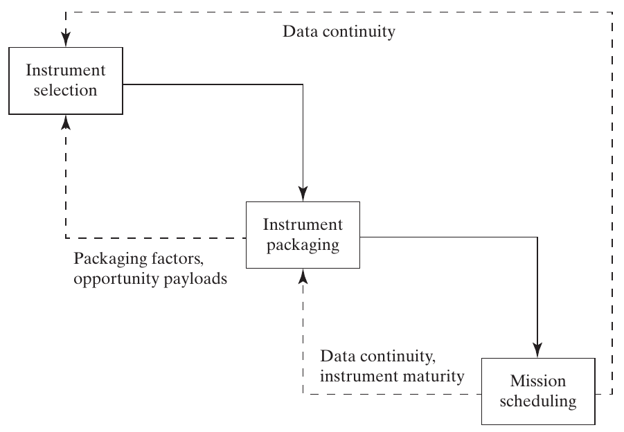{height=450px fig-align="center" fig-alt="Instrument selection, packaging, and mission scheduling linked by packaging factors, maturity, and data continuity."}

::: {.side-caption}
Different patterns organize different decisions, with feedback between them. Source: Crawley, Cameron & Selva (2016), Fig. 16.15 and §16.5, pp. 407–408.
:::

::: {.notes}
- Instrument selection maps naturally to DOWN-SELECTING; packaging to PARTITIONING or ASSIGNING; scheduling to PERMUTING plus any needed date decisions.
- Follow the feedback links: spare bus or launch capacity can favor an opportunity payload; instrument maturity affects packaging and launch order; data continuity affects both selection and scheduling.
- The chapter argues that instrument selection often drives the largest cost and performance changes, with packaging effects at a smaller but still important scale. Treat this as a case-specific assessment.
- Ask why the best standalone instrument set might be awkward to package.

**Discussion:** Why might the best standalone instrument subset be difficult to package?

**Suggested answer:** Its instruments may compete for power, require incompatible conditions, interfere, or have mismatched readiness. Joint scientific value must be evaluated with spacecraft, orbit, and deployment consequences.

**Source:** Crawley, Cameron & Selva (2016), Fig. 16.15 and §16.5, pp. 407–408.
:::

## Decomposition and global quality {.smaller}

- Separate subproblems that are as loosely coupled as possible.
- Preserve links through shared constraints and evaluation.
- Carry multiple promising alternatives across a boundary.
- Revisit upstream choices when downstream results expose a conflict.

Combining individually optimal subproblem solutions can produce a poor overall architecture.

::: {.notes}
- A data-gap requirement can constrain instrument selection so the scheduling stage has an appropriate replacement mission to launch.
- A packaging stage might reject an otherwise attractive set because of wasted bus capacity, interference, or an immature instrument that delays all others.
- Carrying alternatives and iterating are practical classroom extensions of the chapter’s explicit coupling constraints. They reduce premature commitment but do not prove a global optimum.
- Ask students to identify the metric and interface data exchanged between two teams. “We will coordinate” is insufficient unless they say what information changes the decisions.
- The goal is manageable analysis with honest limits on the result.

**Discussion:** What concrete information should packaging and orbit teams exchange?

**Suggested answer:** Candidate group memberships, resource requirements, allowed orbits, expected observation performance, and constraints. Iterate when one team's choices change the other's feasible options or metric contributions.

**Source:** Crawley, Cameron & Selva (2016), §16.5, pp. 404, 407–408.
:::

# 16.6 Solving the optimization problem

::: {.notes}
Start with the simplest method that fits the computational budget. Search algorithms do not remove the need for valid encodings and credible evaluators. Source: §16.6, pp. 408–416.
:::

## Full-factorial enumeration {.smaller}

1. Generate every candidate combination.
2. Reject invalid architectures and duplicate encodings.
3. Evaluate every remaining architecture.
4. Retain metrics and explanations.
5. Apply Pareto analysis and stakeholder preferences.

Enumeration gives both the frontier and the surrounding tradespace.

::: {.notes}
- This builds on the chapter’s nested-loop approach and Chapter 15’s argument for retaining dominated regions to learn about structure.
- Distinguish a raw Cartesian product from the feasible set. The book’s Fig. 16.16 shows generation but omits the constraint filter in that snippet; include it in an actual workflow.
- Exhaustive evaluation identifies the true Pareto set for the finite model if evaluation and filtering are correct. It does not validate the physical model itself.
- Ask what evidence is lost if the tool stores only its final best point. Clusters, sensitivities, alternative families, and explanations can disappear.

**Discussion:** What evidence is lost if enumeration stores only one winning point?

**Suggested answer:** Alternative Pareto candidates, clusters, feature patterns, and sensitivity information can disappear. Retaining feasible candidates and metrics supports explanation and later preference changes.

**Source:** Crawley, Cameron & Selva (2016), §16.6, pp. 408–409; Fig. 16.16.
:::

## Enumeration algorithm {.smaller}

<pre style="font-size: 0.75em; line-height: 1.35;">
results = []
for A in CartesianProduct(option_sets):
    if not hard_constraints_hold(A):
        continue
    A = canonicalize(A)
    if already_evaluated(A):
        continue
    metrics, explanation = evaluate(A)
    results.append(A, metrics, explanation)
front = nondominated_architectures(results)
</pre>

::: {.notes}
- This pseudocode generalizes Apollo’s nine nested loops. Canonicalization and duplicate checking are explicit classroom additions motivated by the balloon and partition examples.
- The evaluation must apply any soft-constraint penalties consistently, and the Pareto routine must know each metric’s direction.
- Ask where a partition generator would fit. Either generate valid partitions directly or preprocess a list of partition options; naïvely looping over arbitrary labels needs constraints and duplicate handling.
- Procedural languages specify steps. Declarative/rule-based approaches specify relationships and goals and use an inference mechanism to generate candidates; Appendix C develops that alternative.
- Do not run a costly physical simulation on a combination already known to be invalid.

**Discussion:** Where should a partition generator enter an enumeration algorithm?

**Suggested answer:** Generate valid canonical partitions as candidate values before evaluation, or use them within the architecture generator. Arbitrary group labels need feasibility and duplicate checks before they represent distinct partitions.

**Source:** Crawley, Cameron & Selva (2016), §16.6, pp. 408–409; adapted from Fig. 16.16.
:::

## The computational budget {.smaller}

Approximate serial evaluation time:

$$T\approx N_{\mathrm{evaluated}}\,t_{\mathrm{eval}}.$$

**Classroom example:** $2^{20}=1{,}048{,}576$ candidates.

| Time per evaluation | Total serial time |
|---|---:|
| 1 millisecond | 17.5 minutes |
| 1 second | 12.1 days |
| 1 minute | 2.0 years |

Broader coverage competes with deeper modeling.

::: {.notes}
- These estimates neglect generation, constraint checking, communication, and storage overhead. Parallelism can help, but speedup is limited by available resources and serial work.
- Ask students to decide whether more fidelity is worthwhile before seeing the evaluation budget. A detailed model that evaluates only two arbitrary candidates may be less useful at this stage.
- A staged approach can use a simpler model to find families and detailed models to scrutinize survivors, provided screening assumptions are checked.
- “Small enough” depends on candidate count, evaluation time, hardware, and tolerable elapsed time, not an immutable number of decisions.

**Discussion:** When could a lower-fidelity evaluator be more useful initially?

**Suggested answer:** When it enables broad comparison of architectural families within the budget and captures the dominant effects adequately. Validate finalists with more detail rather than spending the entire budget on a few arbitrary candidates.

**Source:** Crawley, Cameron & Selva (2016), §16.6, p. 408; classroom calculation.
:::

## Heuristic search for large spaces {.smaller}

- Generate promising candidates without visiting every combination.
- Use evaluated results to guide subsequent search.
- Seek several good architectural families.
- Treat the returned front as an **approximation** unless completeness is established.

Flexible heuristics suit categorical, nonlinear, and nonsmooth models.

::: {.notes}
- The chapter favors metaheuristics because they require relatively little problem structure. This is a pragmatic choice, not a claim that they outperform every exact or specialized algorithm.
- Branch-and-bound, cutting planes, network methods, and dynamic programming can be useful when their mathematical assumptions fit. Standard gradients are unsuitable for arbitrary category labels.
- A run that stops improving may have converged locally or simply exhausted its search budget.
- Ask students what would justify saying “globally optimal.” Exhaustive coverage, a valid optimality bound, or another mathematical certificate would be needed, not just a long run.

**Discussion:** What evidence supports a claim of global optimality?

**Suggested answer:** Exhaustive valid coverage, an applicable optimality bound, or another mathematical certificate under the model. A long heuristic run or repeated convergence alone does not establish it.

**Source:** Crawley, Cameron & Selva (2016), §16.6, pp. 409–410; reference [27].
:::

## Generator, evaluator, and search agent {.smaller}

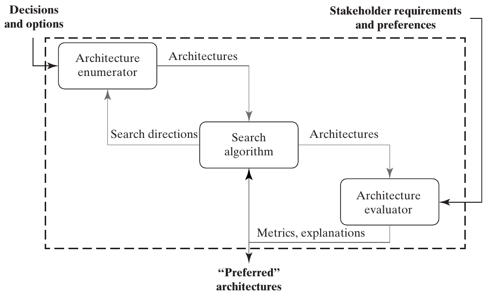{height=440px fig-align="center" fig-alt="Architecture generator and evaluator coordinated by a search algorithm receiving metrics and explanations."}

::: {.side-caption}
Search directions connect candidate generation to evaluation feedback. Source: Crawley, Cameron & Selva (2016), Fig. 16.17, p. 410.
:::

::: {.notes}
- Trace one cycle: generate an architecture, evaluate it using stakeholder requirements, then use metrics and explanations to choose another region or change.
- With full enumeration, generation and final filtering can be separate. With heuristic search, generating candidates and selecting survivors become intertwined.
- The evaluator’s explanation can show why a design failed or which requirement created a penalty. That information is useful to the human architect even if the search operator uses only numbers.
- Ask which box contains stakeholder judgments and which box proposes new decision vectors.

**Discussion:** Which search component contains stakeholder evaluation, and which proposes candidates?

**Suggested answer:** The evaluator maps architectures to metrics or value using the stated judgments. The search agent proposes where to explore, working with a generator that constructs the candidate representations.

**Source:** Crawley, Cameron & Selva (2016), Fig. 16.17, p. 410.
:::

## A population-based search cycle {.smaller}

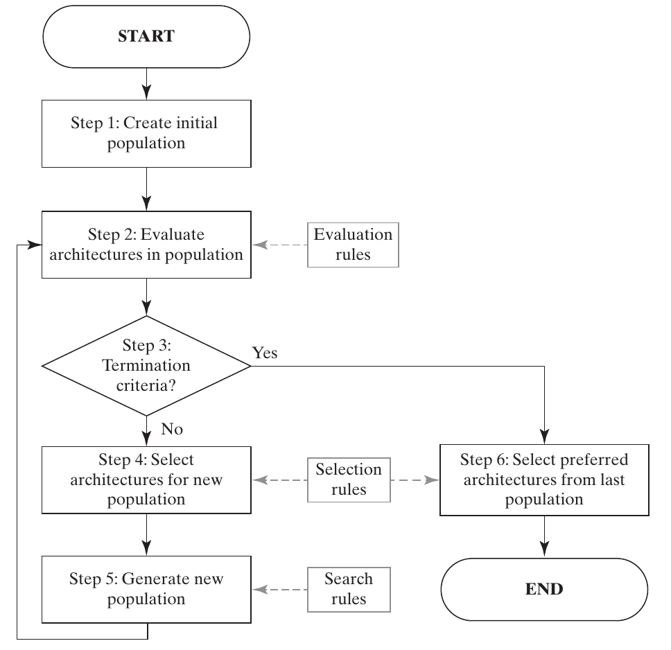{height=480px fig-align="center" fig-alt="Initial population, evaluation, termination check, selection, generation, and final preferred architectures."}

::: {.side-caption}
A population carries multiple alternatives through successive generations. Source: Crawley, Cameron & Selva (2016), Fig. 16.18, p. 411.
:::

::: {.notes}
- Walk through all six numbered steps. Initial generation precedes evaluation; each iteration tests termination, selects parents or survivors, and creates the next candidates.
- Evaluation rules define performance. Selection rules decide which architectures contribute. Search rules decide how new candidates are constructed.
- Populations are useful when the goal is several Pareto families instead of one best scalar solution.
- The termination branch should not be interpreted as proof that the mathematical frontier was found. It may simply represent a budget limit.

**Discussion:** Why keep a population instead of only one current architecture?

**Suggested answer:** It can preserve several promising families and Pareto tradeoffs while exploring combinations. The benefit depends on maintaining useful diversity rather than storing many duplicate candidates.

**Source:** Crawley, Cameron & Selva (2016), Fig. 16.18, p. 411.
:::

## Selection, diversity, and stopping {.smaller}

- Preserve high-quality candidates through elitism.
- Retain diversity across the tradeoffs and architecture families.
- Generate new candidates through search operators.
- Stop at a stated time, evaluation, generation, or improvement limit.
- Compare final candidates with baselines and further analysis.

::: {.notes}
- Pareto rank is useful in multiobjective selection, but rank alone may let the population crowd into one narrow region.
- Some dominated candidates can contribute diversity and lead to useful new combinations. Selection is not identical to immediately discarding every dominated point forever.
- Elitism means retaining high-quality solutions across generations; selecting only current Pareto points as parents is one possible rule, not the entire definition.
- Ask what happens if every individual becomes the same architecture. Crossover alone then offers little novelty.
- Final preference selection remains a stakeholder decision informed by the search results.

**Discussion:** What happens if every population member becomes the same architecture?

**Suggested answer:** Crossover between identical parents produces little novelty. Mutation, diverse seeds, or other exploration mechanisms are needed to reach different candidates; apparent stability alone need not mean optimality.

**Source:** Crawley, Cameron & Selva (2016), §16.6, pp. 411–412, 414–415.
:::

## Generating feasible initial populations {.smaller}

- Randomly choose valid decision options or binary values.
- Reject infeasible samples when rejection is inexpensive.
- For tight constraints, generate feasible candidates directly.
- Alternatively, repair an infeasible candidate.
- Check whether sampling or repair favors particular regions.

::: {.notes}
- For an unconstrained DECISION-OPTION problem, sample one option per decision. For a subset problem, sample a binary vector.
- Rejection sampling can become ineffective when feasible candidates occupy a tiny fraction of the raw space. Record the acceptance rate rather than assuming randomness is sufficient.
- Repair requires a definition of a nearby feasible architecture. It can introduce systematic bias, for example always deleting the most recently added instrument.
- Ask students how to sample a permutation directly. Shuffle the element list rather than sample positions independently and hope there are no repeats.
- Feasible-by-construction generation still needs the additional domain constraints checked.

**Discussion:** How would you generate a feasible random permutation directly?

**Suggested answer:** Shuffle the list of distinct elements. Sampling each position independently can repeat or omit elements and therefore requires extra checking or repair.

**Source:** Crawley, Cameron & Selva (2016), §16.6, p. 412.
:::

## Uniform sampling can miss useful styles {.smaller}

For 10 elements, $B_{10}=115{,}975$ partitions.

| Number of groups | Number of partitions |
|---|---:|
| 2 | 511 |
| 4 | 34,105 |
| 5 | 42,525 |
| 6 | 22,827 |

About **85.8%** have 4–6 groups. Uniform over partitions is not uniform over group counts.

::: {.notes}
- The counts are Stirling numbers of the second kind. The fraction is (34,105+42,525+22,827)/115,975=0.85757.
- The book reports 88% and more than 45,000 five-group partitions; those figures are inaccurate. Use the exact counts here.
- If two- or three-spacecraft architectures seem promising, deliberately include them or sample the group count first and then a partition conditional on that count.
- Explain that this intentional bias changes the sampling distribution. It can improve search coverage of a region of interest, but should not be mistaken for an unbiased statistical estimate of the entire tradespace.
- Ask whether uniformly generating arbitrary group labels would be uniform over partitions. In general, it would not.

**Discussion:** Is uniform sampling of arbitrary group labels uniform sampling of partitions?

**Suggested answer:** Generally no. Different partitions can have different numbers of label encodings. Use a method matched to the intended sample distribution and handle equivalent encodings explicitly.

**Source:** Crawley, Cameron & Selva (2016), §16.6, p. 412; counts computed from Stirling numbers.
:::

## A mixed initial population {.smaller}

| Source of candidates | Why include it? |
|---|---|
| Baselines and architectures of interest | Compare with known proposals |
| Extreme styles | Test boundaries of the architecture space |
| Structured experimental designs | Cover selected combinations systematically |
| Carefully sampled random candidates | Explore less anticipated regions |

Check feasibility for every source.

::: {.notes}
- For PARTITIONING, include the monolithic and fully distributed extremes. For ASSIGNING, include channelized and fully cross-strapped examples where feasible.
- A deterministic design does not automatically contain every architectural extreme. Include important extremes explicitly.
- A Latin hypercube stratifies each sampled dimension; an orthogonal array balances combinations to a specified strength. Neither should be described as universally testing every full combination.
- Ask why an initial population consisting only of the current baseline and small mutations might overlook an entirely different architecture family.
- Preserve provenance so an architect can see whether an attractive result came from the baseline, a style extreme, or search.

**Discussion:** Why mix expert seeds with broader random or structured samples?

**Suggested answer:** Expert seeds exploit known promising regions; broader samples expose other families. Starting only near the baseline can miss alternatives that require several coordinated changes.

**Source:** Crawley, Cameron & Selva (2016), §16.6, pp. 412–413.
:::

## An orthogonal-array example {.smaller}

For three binary decisions, choose four of the eight vectors:

| Sample | Decision 1 | Decision 2 | Decision 3 |
|---|---:|---:|---:|
| A | 0 | 0 | 0 |
| B | 1 | 1 | 0 |
| C | 0 | 1 | 1 |
| D | 1 | 0 | 1 |

Every **pair of columns** contains 00, 01, 10, and 11 exactly once.

::: {.notes}
- Have students check columns 1 and 3, then columns 2 and 3. This is pairwise coverage, not all eight triples.
- Orthogonal here refers to combinatorial balance, not zero dot products of these binary vectors.
- The chapter also gives L_9(3^4): nine runs for four three-level decisions, compared with 3^4=81 full-factorial cases. The run count is not generally less than the number of decisions; the text’s P<N statement is a typo.
- Coverage alone does not isolate arbitrary higher-order interactions or guarantee inclusion of the best architecture.
- Such designs can initialize a search or select tests when full-factorial testing is too expensive.

**Discussion:** Does the four-run orthogonal array cover all eight binary triples?

**Suggested answer:** No. It covers every pair of column values once, but only four triples. Pairwise balance does not guarantee full interaction identification or inclusion of the optimum.

**Source:** Crawley, Cameron & Selva (2016), §16.6, p. 413.
:::

## Exploration and exploitation {.smaller}

| Exploration | Exploitation |
|---|---|
| Discover new regions | Improve within a promising region |
| Preserve diverse possibilities | Investigate useful local changes |
| Reduces premature convergence | Improves candidate quality |

Too little exploration can trap a search. Too little exploitation can leave promising candidates underdeveloped.

::: {.notes}
- Use a landscape analogy cautiously because categorical spaces do not have a unique geometric distance. The encoding and move operator define what “nearby” means.
- The chapter mentions genetic algorithms, particle swarm, ant colony, bees, and harmony search as families that balance these aims. It focuses on genetic operators and local search rather than surveying all algorithms.
- Ask whether mutation always explores far away. A one-bit mutation may be quite local; an operator’s effect depends on the problem.
- A practical search strategy may combine mechanisms instead of expecting one heuristic to serve every purpose.

**Discussion:** Is mutation always exploration far from the current design?

**Suggested answer:** No. A one-bit change may be local, while a large structured move can be distant. Judge exploration and exploitation by the operator's effect in the actual architecture space.

**Source:** Crawley, Cameron & Selva (2016), §16.6, p. 413.
:::

## Crossover combines parent decisions {.smaller}

**Classroom example:** cut after the third decision.

| Architecture | Prefix | Suffix |
|---|---|---|
| Parent 1 | `1 1 0` | `0 1 0` |
| Parent 2 | `0 0 1` | `1 0 1` |
| Child 1 | `1 1 0` | `1 0 1` |
| Child 2 | `0 0 1` | `0 1 0` |

Single-point, multi-point, and uniform crossover exchange different portions of the encoding.

::: {.notes}
- Relate this explicit binary example to the single-point exchange in Fig. 16.19. The children inherit prefixes and suffixes from different parents.
- Ask whether two feasible parents guarantee feasible children. A shared budget or incompatible option pair can make a child invalid.
- Single-point crossover tends to preserve contiguous fragments. The ordering of decisions therefore matters when useful interactions span particular positions.
- In uniform crossover, choose the contributing parent at each decision position. It is decisions or genes that are exchanged within an architecture chromosome.
- Genetic algorithms use fitness or multiobjective selection to bias which parents contribute, not knowledge that each inherited fragment must be good.

**Discussion:** Do feasible parents guarantee feasible crossover offspring?

**Suggested answer:** No. Combining individually valid choices can exceed a shared budget or violate compatibility. Use suitable operators and check or repair offspring before evaluation.

**Source:** Crawley, Cameron & Selva (2016), §16.6 and Fig. 16.19, p. 414; classroom encoding.
:::

## Schemata represent architecture families {.smaller}

A schema uses 0, 1, and $*$ (“either value”).

`[1,*,*,0]` describes **four** binary architectures.

For a length-$n$ schema with $k$ fixed positions:

$$\text{number of matching architectures}=2^{n-k}.$$

One complete binary architecture matches $2^n$ schemata.

::: {.notes}
- List [1,0,0,0], [1,0,1,0], [1,1,0,0], and [1,1,1,0]. Two free bits give four instances.
- To see the second count, choose independently whether each position in a complete architecture remains fixed or becomes a wildcard.
- In the book, a schema with instrument 2 present and instrument 5 absent identifies a family whose value can be estimated by average fitness over matching candidates.
- A promising schema has above-average fitness in the comparison population. That estimate depends on sampling and the other decisions, so it is not a context-free guarantee.
- Selection can amplify useful schemata, while crossover preserves some and disrupts others. This explains a mechanism, not a proof of global convergence.

**Discussion:** How many architectures match [1,*,*,0], and why?

**Suggested answer:** Four: [1,0,0,0], [1,0,1,0], [1,1,0,0], and [1,1,1,0]. The two free positions each have two values, so the family has 2² members.

**Source:** Crawley, Cameron & Selva (2016), §16.6, pp. 414–415.
:::

## Mutation and valid neighborhoods {.smaller}

- Mutation makes a small random change.
- Local search examines neighboring architectures for improvement.
- A subset neighbor may flip one inclusion bit.
- A permutation neighbor may swap two positions.
- A partition neighbor may move one element between groups.

Operators should respect the encoding’s meaning and constraints.

::: {.notes}
- The chapter presents mutation as a way to reduce trapping in a suboptimal region. The pattern-specific moves here are classroom examples of implementing that principle.
- Naïve single-point crossover on [1,2,3,4] and [3,4,1,2] at the midpoint produces [1,2,1,2], which is not a permutation. Use a permutation-preserving operator or a justified repair.
- Moving an element out of a singleton partition removes the now-empty group. Canonicalize labels afterward.
- Local search can become stuck if reaching a better architecture requires temporarily accepting a worse one.
- Ask which operation changes system scope versus only rearranging an existing scope.

**Discussion:** How do down-selection and partition mutations differ?

**Suggested answer:** Flipping a selection bit adds or removes an element from scope. Moving an element between partition groups rearranges an existing selected set while preserving completeness and disjointness.

**Source:** Crawley, Cameron & Selva (2016), §16.6, pp. 413–415; pattern-aware classroom examples.
:::

## Additional heuristics and expert knowledge {.smaller}

- **Tabu-style memory:** discourage cycling through recently visited moves or configurations.
- **Domain knowledge:** try combinations known to have useful interactions.
- **NEOSS example:** colocate altimeter and radiometer when the mission permits their synergy.
- Retain exploration beyond the expert’s favored region.

::: {.notes}
- The chapter simplifies Tabu Search to a list of bad schemata. Teach the broader memory idea carefully: tabu status is a temporary search restriction, not a statement that a design is physically infeasible or permanently bad.
- A domain rule can help discover useful packaging far faster than blind random changes, but it must respect orbit, resource, maturity, and data-continuity constraints.
- Ask what happens if expert knowledge is outdated or omits a new technology. An overly rigid rule can exclude the best family.
- Keep hard constraints separate from heuristic preferences. A useful tendency should not silently become an absolute prohibition.

**Discussion:** What is the risk of turning expert experience into a hard search rule?

**Suggested answer:** Outdated assumptions can exclude valuable new families. Distinguish genuine feasibility constraints from preferences or heuristics and test whether the latter improve search without overly narrowing it.

**Source:** Crawley, Cameron & Selva (2016), §16.6, p. 415; reference [34].
:::

## A portfolio of search heuristics {.smaller}

- Combine general and domain-specific operators.
- Measure which operators produce useful candidates.
- Allocate more effort to effective operators.
- Preserve enough exploration to detect changing opportunities.
- Account for evaluation cost as well as improvement.

::: {.notes}
- The chapter warns about dilution: adding weak heuristics can reduce the impact of good ones if effort is divided indiscriminately.
- Hyperheuristics adapt the choice of heuristics. Machine-learning approaches can support this extra layer, but are beyond the chapter’s introductory treatment.
- Ask what “effective” means in a multiobjective search. Possibilities include new non-dominated candidates, better coverage, or improved quality per evaluation; one scalar score may hide tradeoffs.
- An operator that succeeds early may become less useful later. Monitoring should not assume performance is fixed.
- More algorithmic complexity should earn its place through evidence on the problem at hand.

**Discussion:** How could a multiobjective search compare the usefulness of different heuristics?

**Suggested answer:** Track new non-dominated candidates, coverage of tradeoffs, and improvement per evaluation under a common budget. A single score may conceal that operators contribute different useful families.

**Source:** Crawley, Cameron & Selva (2016), §16.6, pp. 415–416.
:::

## Choosing and reporting a search strategy {.smaller}

| Situation | Reasonable starting point |
|---|---|
| Small feasible space | Full enumeration |
| Strong exploitable mathematical structure | A suitable specialized method |
| Large, irregular architecture model | Population-based heuristic search |

Report the model, constraints, evaluation budget, baselines, and the limits of the resulting frontier.

::: {.notes}
- Ask students to separate model uncertainty from incomplete search. Repeating a search can reveal variability in found candidates, but cannot correct a biased cost model.
- Compare small versions against exhaustive enumeration when practical, and compare full runs with known baselines and style extremes.
- Treat reproducible random seeds, repeated runs, and sensitivity to assumptions as practical evaluation habits. They are useful checks, not certificates of optimality.
- The chapter’s message is to use enumeration when feasible and flexible heuristics when needed, while retaining architecture judgment throughout.

**Discussion:** Can repeating heuristic search correct a biased cost model?

**Suggested answer:** No. Repeated runs reveal variability in search outcomes under that model. Model uncertainty requires checking assumptions and evaluation evidence separately from search incompleteness.

**Source:** Crawley, Cameron & Selva (2016), §16.6 and §16.7, pp. 408–416; classroom synthesis.
:::

# 16.7 Synthesis and application

::: {.notes}
Return to the full architecture task: a faithful representation, credible evaluation, manageable search, and reasoned interpretation. Source: §16.7, p. 416.
:::

## A compact NEOSS formulation exercise {.smaller}

For a simplified program:

- Choose among four instruments.
- Partition selected instruments into spacecraft.
- Assign each spacecraft one of three allowed orbit options.
- Order the spacecraft launches.

Define **two metrics**, **two hard constraints**, and **one coupling** that a staged solution must retain.

::: {.notes}
- Give pairs five minutes. Expected patterns: DOWN-SELECTING, PARTITIONING, DECISION-OPTION for each spacecraft’s orbit, and PERMUTING for launch order.
- Possible metrics: scientific requirement satisfaction and lifecycle cost. Possible constraints: spacecraft power capacity and an instrument-orbit incompatibility. A continuity requirement can couple instrument selection with launch timing.
- The orbit step here requires exactly one named orbit option per spacecraft, so its simple decision-option encoding is intentional. A more general multiple-copy orbit allocation would use ASSIGNING.
- Ask students whether launch order alone verifies a no-gap condition. Actual dates or a model that derives dates are needed.
- Do not reward a long list of variables unless each has a dictionary, interpretation, and role in evaluation.

**Discussion:** Which patterns appear in the compact NEOSS exercise?

**Suggested answer:** Down-select instruments, partition the selected set into spacecraft, choose an orbit option for each group, and permute launch order. A no-gap condition additionally needs dates or a model that derives them.

**Source:** Crawley, Cameron & Selva (2016), §§16.2–16.6, pp. 375–416; classroom exercise.
:::

## Counting the compact NEOSS space {.smaller}

**Classroom assumptions:** no duplicated instruments, no extra constraints.

For a selected set of size $s$, partition it into $k$ spacecraft, choose one of 3 orbits for each, and order the launches:

$$N=\sum_{s=1}^{4}\binom{4}{s}\sum_{k=1}^{s}S(s,k)\,3^k\,k!=4{,}059.$$

The empty program adds **one** more architecture if it is allowed.

::: {.notes}
- Break the product into choices: choose the subset, choose an unlabeled partition, assign an orbit to each resulting instrument group, and permute those groups into launch order.
- Contributions by selected-set size are 12, 126, 876, and 3,045, totaling 4,059. For one selected instrument there are four choices times three orbits.
- Each group is identifiable by its instrument membership, so assigning orbit options and launch positions does not reintroduce arbitrary bin-label duplicates.
- This count does not represent the full NEOSS program in the book. It omits dates, constellation details, copies, and constraints by construction.
- Use as an optional challenge. The learning goal is a correct factorization, not memorizing Stirling numbers.

**Discussion:** What does each factor in the compact NEOSS count represent?

**Suggested answer:** Choose the subset, partition its members into spacecraft, choose one of three orbits per group, and order launches. Summing gives 4,059 nonempty architectures under the classroom assumptions; allowing the empty program adds one.

**Source:** Crawley, Cameron & Selva (2016), §§16.4–16.6; derived classroom example.
:::

## Chapter 16 takeaways {.smaller}

- A decision model links architecture choices to stakeholder metrics.
- Six patterns expose useful structure and architectural styles.
- Encodings must preserve meaning, feasibility, and distinct alternatives.
- Decomposition requires explicit attention to coupling.
- Enumeration gives complete model coverage when affordable.
- Heuristics provide useful candidates with limits that must remain visible.

::: {.notes}
- Reconnect the final three chapters: Chapter 14 represents and evaluates decisions; Chapter 15 reasons about the tradespace; Chapter 16 formulates recurring structures and searches them.
- Ask students which step requires the most human judgment. There is no single correct stage: scope, metrics, assumptions, constraints, decomposition, and interpretation all do.
- Optimization supports architecture rather than replacing stakeholder analysis, concept generation, or detailed engineering.
- Invite a student to explain one pattern using an example outside aerospace to test transfer of understanding.

**Discussion:** Which optimization step requires human judgment?

**Suggested answer:** All major stages can: scope, metrics, constraints, assumptions, decomposition, search strategy, and interpretation. A solver explores the formulated model; it does not establish that the model represents the right problem.

**Source:** Crawley, Cameron & Selva (2016), §16.7, p. 416.
:::

## Exit ticket {.smaller}

1. Why is assigning to named orbits different from partitioning into spacecraft?
2. Why can two encodings represent the same architecture?
3. When can a locally attractive subsystem harm the full system?
4. What does a heuristic Pareto front establish, and what does it leave uncertain?

::: {.notes}
- Expected answer 1: general assignment permits omissions and multiple copies and uses named destinations; partitioning is exhaustive, disjoint grouping into unlabeled subsets.
- Expected answer 2: irrelevant values at an empty balloon site, or different labels for identical partition groups, do not change the physical architecture.
- Expected answer 3: shared resources, incompatible packaging, delayed maturity, or data-continuity gaps can offset local value.
- Expected answer 4: the returned candidates are non-dominated among those found under the stated model; unvisited candidates may dominate them, and the model itself may be inaccurate.
- Use the answers to identify whether students need another exercise in representation, coupling, or search interpretation.

**Source:** Crawley, Cameron & Selva (2016), §16.7, p. 416; classroom assessment.
:::

## Reading and further study {.smaller}

**Crawley, Cameron & Selva, _System Architecture_ (2016)**

- Chapter 16, §§16.1–16.7, pp. **373–416**.
- Chapter references, pp. **416–419**.
- Appendix C: rule-based representation, generation, and evaluation.
- Appendix D: related computational methods and classical problems.

Revisit Chapters 14–15 for the Apollo, GNC, and Pareto examples.

::: {.notes}
- The lecture follows the supplied edition. All reproduced source figures carry their figure and page references; numerical classroom examples are labeled as such.
- Further-reading routes within the chapter include Alexander and software design patterns, Suh’s functional independence, Bell and Stirling numbers, Holland’s genetic algorithms, and multiobjective methods such as NSGA-II.
- Students do not need to read every research citation before using the six patterns. Assign the chapter and choose a targeted reference for deeper work.
- Suggested follow-up: formulate a small architecture problem, enumerate it, then compare a limited heuristic search with the exact finite-model frontier.

**Source:** Crawley, Cameron & Selva (2016), Chapter 16 and references, pp. 373–419.
:::
