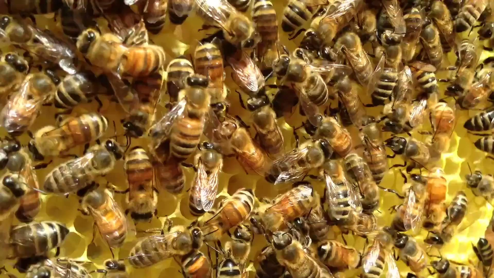
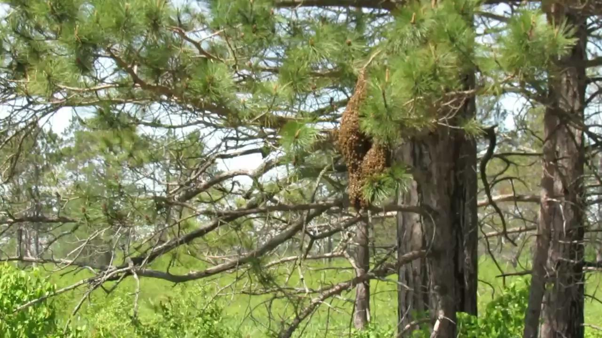
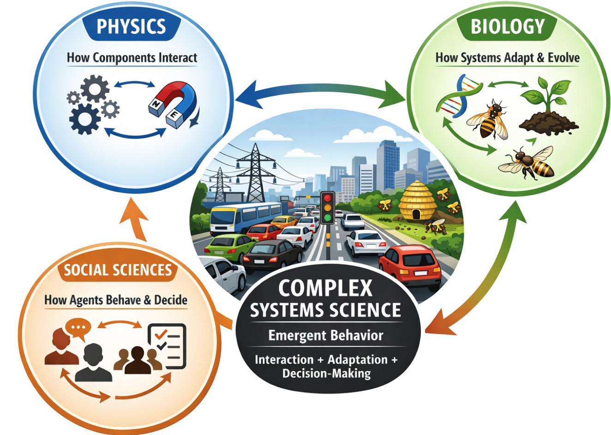
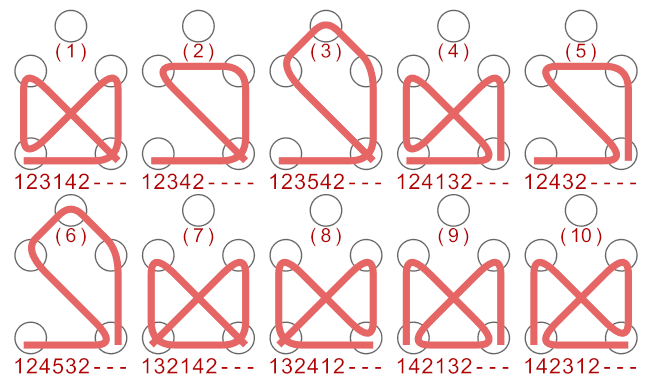

## Beyond a Single Discipline {.smaller}

::: {.callout-important appearance="simple" icon=false title="Definition: Emergence"}
System-level behavior that arises from the interaction of many simple parts, and that cannot be predicted by analyzing those parts in isolation. It is the central phenomenon this entire course is organized around.
:::

The science of complex systems does not belong exclusively to physics, biology, or the social sciences. It **emerges from a combination of all three**, forming a new discipline in its own right.

::: {.columns}
::: {.column width="33%"}
**From physics**\
mathematical rigor, quantitative modeling, predictability
:::
::: {.column width="33%"}
**From biology**\
adaptation, evolution, self-organization
:::
::: {.column width="33%"}
**From social science**\
agent interaction, decision-making, collective behavior
:::
:::

::: {.fragment .callout-note title="Example: Traffic Flow"}
Behaves like a physical system (density, flow), evolves like a biological one (drivers adapt to congestion), and reflects social behavior (incentives, risk tolerance).
:::

::: {.notes}
Open by naming the central phenomenon this whole course orbits: **emergence**, meaning behavior at the level of the whole system that you cannot predict just by analyzing its parts in isolation, no matter how well you understand each part. Everything else in these two lectures (the three-discipline framing, the honeybee examples, self-organized criticality next time) is really an extended answer to one question: how does emergent behavior arise, and when can we expect it even if we can't derive it?

With that anchor in place, locate this course's core object of study, complex systems, outside any one traditional discipline. Physics, biology, and the social sciences each explain part of the picture, but none is sufficient alone. Complex systems science is what you get when you deliberately combine them. From physics we inherit the demand for mathematical rigor and testable, quantitative models. From biology we inherit the vocabulary of adaptation, evolution, and self-organization, concepts that don't arise naturally in classical physics. From the social sciences we inherit the idea that a system can be made of agents who decide, respond to incentives, and interact strategically, not just particles obeying fixed laws.

Traffic is a good example to plant early because every student has direct intuition for it: traffic has a physical component (density and flow, much like fluid dynamics), a biological or adaptive component (drivers learn routes and avoid congestion over repeated trips), and a social component (individual drivers making decisions based on risk tolerance, incentives, and information). No single lens fully explains traffic jams, and that gap is the space this course lives in.
:::

## What Physics Contributes {.smaller}

::: {.columns}
::: {.column width="55%"}
Physics is the *quantitative, predictive science of matter and interactions*: mathematical description, testable predictions, controlled experiments, repeatability.

It excels at **isolated systems**, **linear cause-and-effect**, and **predictable outcomes**.
:::
::: {.column width="45%"}
{width=100%}

::: {.side-caption}
Honeybees on comb: thousands of simple agents, densely interacting.
:::
:::
:::

::: {.fragment .callout-important appearance="minimal" icon=false}
Knowing the physics of a single neuron does **not** explain consciousness. Knowing the aerodynamics of one car does **not** explain a traffic jam.
:::

::: {.notes}
Give physics its due before showing its limits. Physics predicts the trajectory of a projectile with Newton's laws, or current through a circuit with Ohm's law, because those are precise, unambiguous, falsifiable statements about isolated systems with few interacting parts and mostly linear cause-and-effect. That's real predictive power, and complex systems science doesn't discard it. It builds on it.

But complex systems, like the ten thousand densely interacting bees in this hive, involve many interacting components, nonlinear behavior, feedback loops, and emergent properties that fall outside what isolated-system physics was built to handle. The two examples on the slide are meant to be memorable: understanding a single neuron's biophysics tells you nothing about how billions of them together produce consciousness, and understanding a single car's aerodynamics tells you nothing about why a highway locks into stop-and-go traffic. The components' physics is necessary but nowhere near sufficient.
:::

## Biology: How Systems Adapt {.smaller}

::: {.columns}
::: {.column width="55%"}
Biology explains **adaptation, learning, and survival over time**. Not just interaction, but change.

**Example (honeybee colony)**: individual bees follow simple rules; the colony *adapts* foraging strategy to food availability, and *evolves* behavior to improve survival. Poor strategies die out; successful ones persist.
:::
::: {.column width="45%"}
{width=100%}

::: {.side-caption}
A honeybee swarm relocating: a colony-level decision made with no central controller.
:::
:::
:::

::: {.fragment}
Biology answers: *"How does the system change over time to improve fitness?"*
:::

::: {.notes}
Physics answers "how do components interact right now"; biology adds the missing time dimension: "how does the system change to get better at surviving." The honeybee colony is the running example for this whole lecture. No single bee understands foraging strategy, food availability, or colony-level fitness. Each bee follows a small set of local rules. Yet the colony as a whole visibly adapts, shifting where it forages when conditions change, and this adaptation has a selection mechanism behind it, much like Darwinian evolution: strategies (and, in swarming, entire potential colony sites) that work persist, and those that don't, don't.

The photo captures a swarm in the middle of exactly this kind of decision. When a colony outgrows its hive, a large fraction of the bees cluster together and collectively evaluate candidate new home sites through a decentralized voting process (scout bees "dancing" for locations), eventually converging on one, without any bee having the full picture. We come back to swarm decision-making explicitly in a few slides.
:::

## Social Science: How Agents Decide {.smaller}

Social sciences focus on **decision-making, incentives, and interactions among agents**.

::: {.callout-note appearance="simple" icon=false title="Example: Drivers in Traffic"}
Speed chosen by risk tolerance; lane changes chosen by perceived advantage; route chosen by experience or navigation apps. Behavior varies by culture, incentives, and information.
:::

::: {.fragment}
Social sciences answer: *"Why do agents choose certain actions?"*
:::

::: {.notes}
The third lens completes the triangle. Where physics asks how components interact and biology asks how systems change over time, social science asks why individual agents choose the actions they do. That question only makes sense once you allow your "components" to have something like preferences, incomplete information, and strategic reasoning.

Driving is again a useful concrete anchor: two drivers in physically identical situations (same road, same traffic density) may behave completely differently based on risk tolerance, whether they trust a navigation app's suggested route, or cultural norms about following distance and lane discipline. None of that variation comes from the physics of the vehicles or the biology of learning over repeated trips. It comes from agents making decisions under incentives and information, squarely social-science territory. Complex systems science needs all three lenses simultaneously, which is the pitch of the next slide.
:::

## All Three, Integrated {.smaller}

{width=62% fig-align="center"}

::: {.fragment .callout-important appearance="minimal" icon=false}
No single discipline alone explains urban traffic jams, cascading power-grid blackouts, or emergency-department overcrowding.
:::

::: {.notes}
This diagram is the visual summary of the last three slides: physics (how components interact), biology (how systems adapt and evolve), and social science (how agents behave and decide) combine into complex systems science, whose object of study is emergent behavior arising from interaction, adaptation, and decision-making together.

Three quick integrated examples worth walking through out loud, even though only traffic is pictured. Urban traffic: physics governs vehicle dynamics and road capacity, biology-like adaptation governs how drivers learn routes and avoid congestion, social science governs incentives and norms, and the emergent outcome is that traffic jams appear even with zero accidents, with small disruptions cascading into system-wide congestion. The power grid: physics governs power flow and voltage stability, automated control systems provide biology-like adaptive response to load changes, human consumption patterns and market behavior form the social layer, and cascading blackouts are the emergent failure mode. Healthcare systems: equipment reliability and patient-flow capacity behave physics-like, disease progression and population health dynamics behave biology-like, and decisions by patients, clinicians, and administrators are the social layer, emerging in phenomena like ED overcrowding and unintended policy consequences. In every case, no single discipline alone explains the emergent behavior.
:::

## Why Interactions Matter {.smaller}

::: {style="font-size: 1.3em; text-align: center; margin-top: 1em;"}
**Honeybees** (10,000 bees): possible pairwise interactions = 10,000 × 9,999 ≈ **100 million**

**Non-social bees** (10 bees, e.g. mason or carpenter bees): 10 × 9 = **90**
:::

::: {.fragment .callout-note appearance="minimal" icon=false}
Same order of magnitude difference in population, six orders of magnitude difference in the space of possible interactions.
:::

::: {.notes}
This is a small piece of arithmetic that does a lot of conceptual work. It shows why social insects like honeybees are a paradigm example of a complex system while a solitary bee species is not, and the answer isn't really about how many individuals exist. It's about how many potential interactions exist among them. A honeybee colony's roughly 10,000 members can, in principle, pairwise-interact in roughly 100 million ways; a small aggregation of 10 non-social bees (species like mason bees or carpenter bees, which don't form true colonies) has only 90 possible pairwise interactions.

The takeaway to make explicit: complexity scales combinatorially with the number of interacting entities, not linearly. A system's *element count* is therefore a poor proxy for its complexity; what matters is the connectivity, the actual realized and potential interactions among elements. This point resurfaces later in the course when we formally define networks as the representation of choice for complex systems.
:::

## Emergence from Interactions {.smaller}

::: {.columns}
::: {.column width="55%"}
Simple components, connected in complex ways, cause behavior to **emerge**.

Emergent behavior is **impossible to predict analytically**, but it can be *expected algorithmically*.
:::
::: {.column width="45%"}
{width=100%}

::: {.side-caption}
Simple local crossing rules generate a rich family of distinct global patterns.
:::
:::
:::

::: {.notes}
"Emergence" is the single most important word in this course, so define it precisely here and keep coming back to it. A system exhibits emergent behavior when its collective, system-level behavior cannot be derived analytically, with pencil and paper, from first principles, from a description of its individual parts. That doesn't mean it's magic or unknowable: emergent behavior can still be *expected* algorithmically, by simulating the simple local rules forward and observing what patterns reliably show up, even though you can't derive those patterns with a closed-form equation.

The animation is a visual metaphor rather than a literal complex system: a handful of simple local crossing rules, applied consistently, produce a surprisingly rich family of distinct global patterns. No single rule "contains" any one pattern; the pattern is a consequence of applying the rule repeatedly across the whole structure. That's the essence of emergence: global structure from local rules, not from any central blueprint. Every example this semester, from bee swarms deciding on a hive site to traffic jams to cascading blackouts, is a version of this same phenomenon.
:::

## What Are Complex Systems? {.smaller}

::: {.callout-note appearance="simple" icon=false title="Definition"}
Complex systems exhibit **emergent behavior that cannot be predicted by analysis of constituent parts**, but emergent patterns *can* be expected algorithmically.
:::

Identifying characteristics:

- **High sensitivity to boundary conditions** (uncertainty)
- **Behavior dominated by power laws** (path dependence, outliers)
- **Representable as networks** of connected elements (abstractability)

::: {.fragment .callout-important appearance="minimal" icon=false}
Studying complex systems can pay off enormously: the *Honey Bee Algorithm*, inspired by swarm decision-making, has had an estimated **\$50B** economic impact.
:::

::: {.notes}
This is the formal definition slide, worth having students write down. Complex systems exhibit emergent behavior that resists analytical prediction from the parts, but which can still be expected algorithmically (simulated, not derived). Three practical fingerprints let you recognize a complex system in the wild. It's highly sensitive to boundary and initial conditions, meaning small perturbations can produce very different outcomes, a form of irreducible uncertainty. Its behavior is dominated by power laws rather than the bell-curve statistics you'd expect from independent random components, producing path dependence and heavy-tailed outliers instead of predictable averages. And it can be usefully represented as a network of connected elements, which is why network abstraction becomes such a central tool later in the course.

Complex systems also nest: bees within a hive, hives within a beekeeping union, that union within Dutch society, Dutch society within the global economy. Each level is itself a complex system whose elements are, at a finer grain, complex systems in their own right. Close with a concrete payoff so this doesn't feel purely academic: the Honey Bee Algorithm, an optimization technique directly inspired by how bee colonies allocate foragers to food sources, has been credited with roughly \$50 billion in real-world economic impact.
:::

## Representing Systems as Networks {.smaller}

Complexity science shifted focus from *isolated components* to **interactions, networks, and co-evolution**.

::: {.columns}
::: {.column width="50%"}
**Network theory** explains connectivity patterns in:

- Social networks
- Power grids
- Biological & genetic-regulatory networks
:::
::: {.column width="50%"}
::: {.callout-note appearance="simple" icon=false title="Impact"}
Structure matters as much as components.
:::
:::
:::

::: {.notes}
This slide begins the historical arc that closes the lecture: why does any of this matter beyond the immediate examples? Before complexity science, most scientific explanation focused on characterizing components in isolation and finding universal, equilibrium-based laws. Complexity science's first major methodological contribution was insisting that *structure*, who's connected to whom and how, carries as much explanatory weight as the properties of the components themselves.

Network theory is the formal tool that emerged from this shift, and it now underlies analysis of social networks (who influences whom), power grids (which failures cascade into which other failures), and biological systems including genetic regulatory and Boolean networks (how genes switch on and off through mutual interaction, not in isolation). The one-line impact statement is worth repeating to students: structure matters as much as components. Two systems built from identical components can behave completely differently depending purely on how those components are wired together, a claim we return to once we formally introduce network representations of architecture later in the course.
:::

## Emergence, Criticality, Beyond {.smaller}

::: {.columns}
::: {.column width="50%"}
**Self-organized criticality**: many systems naturally evolve to critical states *without external tuning*. Small events trigger large-scale consequences (earthquakes, market crashes).

**Evolution as computation**: genetic algorithms mimic evolution to solve optimization problems. Evolution becomes a general problem-solving mechanism, not just a biological process.
:::
::: {.column width="50%"}
**Power laws**: hidden regularities behind apparently chaotic phenomena, such as city sizes, wealth distribution, and earthquake magnitudes.

**Beyond equilibrium**: complexity science extends physics to driven, non-equilibrium systems, applicable to biology, economics, and social systems.
:::
:::

::: {.notes}
This slide compresses several distinct historical contributions into one comparative view, so pace it more slowly than a normal slide. Self-organized criticality (we return to this with a concrete sand-pile example in the next lecture) explains why many systems drift, entirely on their own, toward a critical state where a small triggering event, one grain of sand, one failed transmission line, one bad trade, can cascade into a large-scale consequence. This directly challenged the older assumption of roughly linear cause-and-effect.

Evolution-as-computation is a portable idea: genetic algorithms treat "natural selection acting on variation" as a general-purpose optimization procedure, applicable to engineering design, machine learning, or materials discovery, not just to biological populations. Power laws are the statistical signature you keep encountering across unrelated domains: city population sizes, personal wealth, earthquake magnitudes, internet connectivity. Before complexity science, these looked like unrelated curiosities; complexity science revealed they share a common generative mechanism. And extending physics beyond equilibrium (most classical statistical mechanics assumes systems settle to thermal equilibrium) opened the door to applying physics-style quantitative rigor to systems that are perpetually far from equilibrium: living organisms, economies, societies.
:::

## The Big Picture Takeaway {.smaller}

Complexity science has:

- Shifted science from **parts to interactions**
- Extended physics **beyond equilibrium**
- Unified **evolution, networks, and information**
- Explained **emergence, power laws, and systemic risk**
- Created tools applicable across biology, economics, and cities

::: {.fragment .callout-important appearance="minimal" icon=false}
It represents a **paradigm shift**, not just a new topic.
:::

::: {.notes}
Close the historical argument with a single unifying claim: everything on the last two slides (networks, self-organized criticality, evolution-as-computation, power laws, non-equilibrium physics, complexity economics, network epidemiology) is not a loosely related grab-bag of new topics bolted onto existing disciplines. It's a genuine paradigm shift, in Kuhn's sense: a change in what questions are considered askable and what counts as an adequate explanation. Before: characterize the parts, assume equilibrium, expect linear cause-and-effect. After: characterize the interactions and the structure, expect systems to be driven and far from equilibrium, and expect small causes to sometimes have disproportionately large, emergent effects.

This sets expectations for the rest of the course. We are not going to hand you a formula that outputs "the architecture." We're going to teach you to recognize when you're dealing with a complex system, and to reason about it using the tools this new paradigm developed (networks, emergence, power laws, adaptive robustness) rather than the tools of classical, component-by-component analysis.
:::

## Coming Up: Emergence

The next lecture asks: *why is stability so rare in complex, chaotic systems*, and when it does appear, what does it look like?

::: {.callout-note title="Reference"}
Thurner, S., Klimek, P., & Hanel, R. (2018). *Introduction to the Theory of Complex Systems*. Oxford University Press.
:::

::: {.notes}
Close by previewing the throughline into the next lecture. We've established what a complex system is and why it needs its own discipline. The natural next question is about outcomes: given all this interaction, adaptation, and decision-making, why is stable, predictable behavior the exception rather than the rule? On the rare occasions when a complex system does settle into something stable (Lagrange points are the opening example next time), what does that stability actually look like, and how fragile is it? That's the bridge into "Emergence in Complex Systems."
:::
